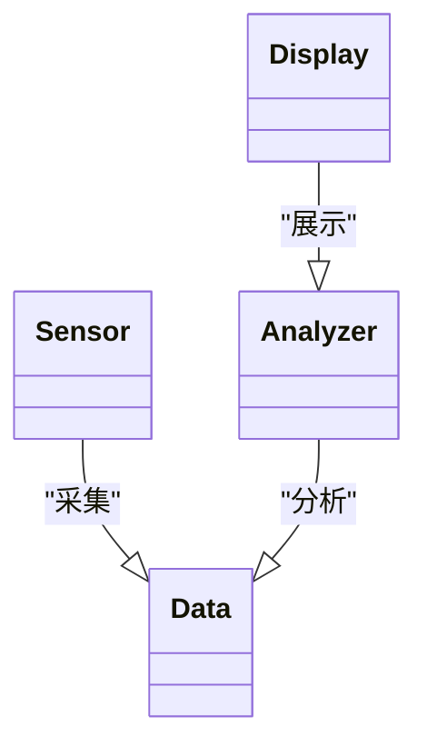
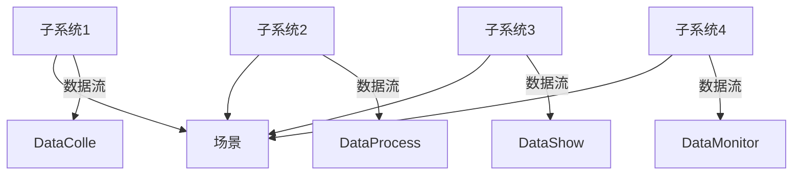

                 

## 引言

随着全球经济的快速发展，对矿产资源的需求日益增长。矿产资源不仅是我们工业和基础设施建设的重要原材料，也是推动经济发展的重要驱动力。然而，矿产资源的分布具有复杂性和不均匀性，传统的地球物理勘探方法在探测精度和效率上已难以满足现代需求。因此，如何提高矿产资源的探测精度，已成为地球物理学领域的一个重要研究课题。

量子传感器，作为一种前沿技术，利用量子现象（如量子纠缠、量子叠加等）来增强其灵敏度，实现高精度测量。相比传统传感器，量子传感器在探测深度、探测精度和抗干扰能力等方面具有显著优势。这一特性使得量子传感器在地球物理勘探中具有广泛的应用前景。

本文将围绕量子传感器在地球物理勘探中的应用进行深入探讨。首先，我们将介绍量子传感器的基本概念、原理和特性，并与传统传感器进行对比。接着，本文将详细讲解量子传感器在地球物理勘探中的算法原理，并通过具体案例说明其应用效果。最后，我们将分析量子传感器在地球物理勘探系统中的架构设计，探讨其实现方案和实际应用效果。

通过本文的探讨，旨在为量子传感器在地球物理勘探中的应用提供理论基础和实践指导，为矿产资源的精准探测提供新的思路和方法。

### 关键词

- 量子传感器
- 地球物理勘探
- 精度测量
- 矿产资源
- 算法原理
- 系统设计

### 摘要

本文围绕量子传感器在地球物理勘探中的应用进行深入探讨。首先，介绍了量子传感器的基本概念、原理和特性，并与传统传感器进行了对比。接着，本文详细讲解了量子传感器在地球物理勘探中的算法原理，通过具体案例展示了其应用效果。最后，本文分析了量子传感器在地球物理勘探系统中的架构设计，探讨了其实现方案和实际应用效果。本文的研究为量子传感器在地球物理勘探中的应用提供了理论基础和实践指导，有助于提高矿产资源探测的精度和效率。

### 目录大纲

---

# 量子传感器在地球物理勘探中的应用：提高矿产资源探测精度

> 关键词：量子传感器、地球物理勘探、精度测量、矿产资源、算法原理、系统设计

> 摘要：本文围绕量子传感器在地球物理勘探中的应用进行深入探讨，介绍了量子传感器的基本概念、原理和特性，详细讲解了量子传感器在地球物理勘探中的算法原理，分析了量子传感器在地球物理勘探系统中的架构设计，探讨了其实现方案和实际应用效果。本文的研究为量子传感器在地球物理勘探中的应用提供了理论基础和实践指导，有助于提高矿产资源探测的精度和效率。

### 第一部分：背景介绍

#### 第1章：量子传感器概述

### 1.1 问题背景

量子传感器作为一种新兴的测量技术，具有传统传感器无法比拟的测量精度和灵敏度。这一特性使得量子传感器在多个领域得到了广泛应用，其中就包括地球物理勘探。然而，量子传感器在地球物理勘探中的应用还处于初步探索阶段，其技术优势和实际应用效果有待进一步验证。

随着矿产资源需求的不断增长，如何提高矿产资源的探测精度和效率已成为地球物理学领域的重要研究课题。传统的地球物理勘探方法，如重力测量、磁法测量、电法测量等，虽然已经在矿产资源探测中取得了显著成果，但在探测深度、探测精度和抗干扰能力等方面仍存在一定的局限性。因此，如何借助新兴的量子传感器技术，提高矿产资源探测的精度和效率，已成为当前研究的热点。

### 1.2 问题描述

在地球物理勘探中，矿产资源探测主要面临以下问题：

1. **探测深度有限**：传统地球物理勘探方法在探测深度方面存在限制，难以准确探测到深部矿产资源。

2. **探测精度不高**：传统地球物理勘探方法的测量精度有限，导致矿产资源定位不准确，影响勘探效率和资源利用。

3. **抗干扰能力弱**：地球物理勘探过程中，受地质条件、气象条件等多种因素影响，传统地球物理勘探方法的抗干扰能力较弱，易受外部干扰，影响测量结果。

为了解决上述问题，需要寻找新的测量技术，以提高矿产资源的探测精度和效率。量子传感器作为一种具有高灵敏度、高抗干扰能力的测量技术，为地球物理勘探提供了新的可能性。

### 1.3 问题解决

量子传感器在地球物理勘探中的应用，主要通过以下方式提高矿产资源探测的精度和效率：

1. **提高探测深度**：量子传感器具有高灵敏度，可以探测到更深部的矿产资源，满足对深部矿产资源的需求。

2. **提高探测精度**：量子传感器利用量子现象，如量子纠缠和量子叠加，可以实现高精度测量，提高矿产资源定位的准确性。

3. **增强抗干扰能力**：量子传感器具有高抗干扰能力，可以有效抵御外部干扰，提高测量结果的可靠性。

此外，量子传感器还具有以下技术优势：

1. **高灵敏度**：量子传感器利用量子现象，如量子纠缠和量子叠加，可以实现高灵敏度测量，探测到更微弱的物理信号。

2. **宽频带**：量子传感器可以覆盖宽频带，适用于不同类型的矿产资源探测。

3. **多维度测量**：量子传感器可以通过多维度测量，获取更全面、更准确的地质信息，提高矿产资源定位的精度。

尽管量子传感器在地球物理勘探中具有显著的技术优势，但其在实际应用中仍面临一些挑战，如量子传感器技术的成熟度、成本问题等。因此，进一步研究和优化量子传感器在地球物理勘探中的应用，仍需付出大量努力。

### 1.4 边界与外延

量子传感器在地球物理勘探中的应用，不仅局限于矿产资源探测。其高精度、高灵敏度、高抗干扰能力的特性，也使其在其他领域具有广泛的应用前景：

1. **地质勘探**：量子传感器可以应用于地质勘探，如地下水探测、地质构造分析等。

2. **环境监测**：量子传感器可以用于环境监测，如空气质量监测、水质监测等。

3. **海洋探测**：量子传感器可以应用于海洋探测，如海底地形测量、海洋资源探测等。

总之，量子传感器在地球物理勘探中的应用具有广阔的前景，有望为矿产资源的探测提供新的技术手段。同时，随着量子传感器技术的不断发展和成熟，其应用范围也将不断扩大，为更多领域带来革命性的变化。

#### 第1章：量子传感器概述

### 1.2 概念属性特征对比

在比较量子传感器和传统传感器时，可以从以下几个方面进行详细分析：

| 概念         | 特征                     |
|--------------|------------------------|
| 量子传感器   | 利用量子现象提高测量精度 |
| 传统传感器   | 利用宏观物理现象进行测量 |

#### 量子传感器

1. **测量精度**：量子传感器利用量子现象（如量子纠缠、量子叠加等）实现高精度测量，具有传统传感器无法比拟的测量精度。
   
2. **灵敏度**：量子传感器具有极高的灵敏度，能够探测到极微弱的物理信号，特别是在低噪声环境下，其优势更加明显。

3. **抗干扰能力**：量子传感器通过量子态叠加和纠缠等特性，具备较强的抗干扰能力，有效减少外部噪声对测量结果的影响。

4. **应用范围**：量子传感器可以覆盖宽频带，适用于多种测量场景，如地质勘探、环境监测、生物医学等领域。

5. **技术特点**：量子传感器利用量子力学原理，通过量子态的制备、操控和测量实现高精度测量。

#### 传统传感器

1. **测量精度**：传统传感器利用宏观物理现象进行测量，其测量精度受限于传感器的物理特性和制造工艺。

2. **灵敏度**：传统传感器的灵敏度相对较低，尤其是在弱信号检测方面，容易受到环境噪声的干扰。

3. **抗干扰能力**：传统传感器对环境的抗干扰能力较弱，容易受到电磁干扰、振动等外部因素影响。

4. **应用范围**：传统传感器主要用于常规测量场景，如温度、压力、湿度等物理量的测量。

5. **技术特点**：传统传感器基于宏观物理现象，通过机械、电子等手段实现测量。

#### 对比总结

通过上述对比，可以看出量子传感器在测量精度、灵敏度、抗干扰能力等方面具有显著优势。这使得量子传感器在地球物理勘探等领域具有广泛的应用前景。然而，传统传感器因其成本较低、技术成熟等特点，仍将在某些特定场景下具有不可替代的地位。因此，在实际应用中，应根据具体需求选择合适的传感器类型。

### 1.3 ER实体关系图

为了更好地理解量子传感器和传统传感器在地球物理勘探中的应用关系，我们可以使用ER（实体关系）图来表示。以下是量子传感器和传统传感器的ER实体关系图：

```mermaid
erDiagram
  Resource --> Measure : "通过测量得到"
  Resource ||--|{ QuantumSensor } : "使用"
  Resource ||--|{ TraditionalSensor } : "使用"
```

在这个ER图中：

- **Resource**（资源）表示地球物理勘探中的各种资源，如矿床、油气藏等。
- **Measure**（测量）表示通过传感器进行的测量过程。
- **QuantumSensor**（量子传感器）和**TraditionalSensor**（传统传感器）分别表示量子传感器和传统传感器，它们都是用于测量资源的传感器类型。

通过这个ER图，我们可以清晰地看到量子传感器和传统传感器在地球物理勘探中的应用关系，以及它们与资源之间的关联。

### 第2章：量子传感器的原理与特性

#### 2.1 核心概念

量子传感器是基于量子力学原理进行设计和实现的一种新型传感器，其核心概念包括量子纠缠、量子叠加和量子相干性等。量子力学的基本原理决定了量子传感器的独特性能，使其在测量精度和灵敏度上具有显著优势。

1. **量子纠缠**：量子纠缠是量子力学中的一种特殊现象，两个或多个量子系统在某种特定条件下，其状态会呈现出一种相互依赖的关系。即使这些系统被分开很远，它们的量子态仍然会保持某种联系。这一特性可以用于量子传感器的测量过程中，通过纠缠态的操控，可以实现更高的测量精度。

2. **量子叠加**：量子叠加是量子力学中另一个重要概念，它描述了一个量子系统可以同时处于多个状态的叠加。在量子传感器中，通过量子叠加可以实现多路径干涉，从而提高测量精度。例如，量子干涉仪就是利用量子叠加原理实现高精度测量的一个典型应用。

3. **量子相干性**：量子相干性是指量子系统在不同状态下保持一致性的能力。量子相干性在量子传感器中起着关键作用，它能够增强传感器的测量精度和灵敏度。例如，在量子态制备和量子测量过程中，保持量子相干性可以显著提高测量结果的可靠性。

#### 2.2 概念属性特征对比

为了更清晰地理解量子传感器与传统传感器之间的差异，我们可以将两者的主要属性特征进行对比。

| 概念         | 特征                     |
|--------------|------------------------|
| 量子传感器   | 利用量子现象提高测量精度 |
| 传统传感器   | 利用宏观物理现象进行测量 |

- **测量精度**：量子传感器利用量子纠缠、量子叠加和量子相干性等量子现象，可以实现对微小物理量的超高精度测量，这是传统传感器无法比拟的。

- **灵敏度**：量子传感器具有极高的灵敏度，能够探测到极微弱的物理信号，尤其适用于低噪声环境的测量。

- **抗干扰能力**：量子传感器通过量子态叠加和纠缠等特性，具有更强的抗干扰能力，能够在复杂环境中保持稳定的测量性能。

- **应用范围**：量子传感器可以覆盖宽频带，适用于多种测量场景，如地质勘探、环境监测、生物医学等。

- **技术特点**：量子传感器基于量子力学原理，通过量子态的制备、操控和测量实现高精度测量。

#### 2.3 ER实体关系图

为了更直观地表示量子传感器与传统传感器在地球物理勘探中的应用关系，我们可以使用ER实体关系图。以下是量子传感器和传统传感器的ER实体关系图：

```mermaid
erDiagram
  Resource --> Measure : "通过测量得到"
  Resource ||--|{ QuantumSensor } : "使用"
  Resource ||--|{ TraditionalSensor } : "使用"
```

在这个ER图中：

- **Resource**（资源）表示地球物理勘探中的各种资源，如矿床、油气藏等。
- **Measure**（测量）表示通过传感器进行的测量过程。
- **QuantumSensor**（量子传感器）和**TraditionalSensor**（传统传感器）分别表示量子传感器和传统传感器，它们都是用于测量资源的传感器类型。

通过这个ER图，我们可以清晰地看到量子传感器和传统传感器在地球物理勘探中的应用关系，以及它们与资源之间的关联。

### 第3章：量子传感器在地球物理勘探中的应用

#### 3.1 算法原理

量子传感器在地球物理勘探中的应用，主要是通过其高精度、高灵敏度、高抗干扰能力等特性，实现矿产资源的高效探测。量子传感器在地球物理勘探中的算法原理，可以概括为以下几个关键步骤：

##### 3.1.1 量子态制备

量子态制备是量子传感器工作的第一步。它利用特定装置（如激光器、磁共振装置等），将量子系统（如原子、光子等）置于特定的量子态。这一过程涉及到量子态的精确控制和优化，以确保后续测量的准确性。

##### 3.1.2 量子测量

在量子态制备完成后，接下来进行量子测量。量子测量是量子传感器实现高精度测量的关键步骤。通过量子纠缠、量子叠加等量子现象，量子传感器可以实现对微小物理量的超高精度测量。这一过程涉及到量子态的操控和测量，需要精确控制量子系统的相互作用。

##### 3.1.3 结果分析

量子测量完成后，需要对测量结果进行分析。这一步骤包括对测量数据进行处理、拟合和分析，以提取有用的地质信息。通过多组测量数据的综合分析，可以实现对地下矿产资源的高精度定位和探测。

##### 3.1.4 正反馈

为了进一步提高测量精度，量子传感器通常采用正反馈机制。在每次测量完成后，根据测量结果对量子态进行微调，以优化测量精度。这种正反馈机制可以显著提高量子传感器的测量精度和稳定性。

#### 3.2 详细讲解

##### 3.2.1 量子态制备

量子态制备是量子传感器工作的第一步。在地球物理勘探中，常用的量子系统包括原子、光子等。例如，在基于原子系综的量子传感器中，利用激光将原子激发到特定的能级，从而实现量子态的制备。

具体步骤如下：

1. **选择量子系统**：根据勘探需求，选择合适的量子系统，如原子、光子等。

2. **激发量子系统**：利用激光或其他激发手段，将量子系统激发到特定的量子态。

3. **量子态控制**：通过精确控制激发强度、时间等参数，实现量子态的精确制备。

##### 3.2.2 量子测量

量子测量是量子传感器实现高精度测量的关键步骤。在地球物理勘探中，量子测量通常利用量子纠缠和量子叠加等现象，实现对微小物理量的超高精度测量。

具体步骤如下：

1. **量子态制备**：首先，将量子系统置于特定的量子态。

2. **量子态操控**：通过量子门和量子操作，对量子态进行操控，以实现特定的测量目标。

3. **量子测量**：利用测量设备，对量子态进行测量，获取测量结果。

4. **测量结果分析**：对测量结果进行分析，提取有用的地质信息。

##### 3.2.3 结果分析

在量子测量完成后，需要对测量结果进行分析，以提取有用的地质信息。这一步骤包括对测量数据进行处理、拟合和分析。

具体步骤如下：

1. **数据处理**：对测量数据进行分析和预处理，去除噪声和误差。

2. **数据拟合**：利用数学模型和算法，对测量数据进行分析和拟合，提取地下矿产资源的分布特征。

3. **地质信息提取**：根据拟合结果，提取地下矿产资源的位置、深度、密度等地质信息。

##### 3.2.4 正反馈

为了进一步提高测量精度，量子传感器通常采用正反馈机制。在每次测量完成后，根据测量结果对量子态进行微调，以优化测量精度。

具体步骤如下：

1. **测量结果反馈**：将测量结果反馈给量子态控制系统。

2. **量子态微调**：根据测量结果，对量子态进行微调，以优化测量精度。

3. **重复测量**：在微调后，进行新一轮的测量，继续优化测量精度。

#### 3.3 举例说明

##### 案例一：量子传感器在地下矿床探测中的应用

在某次地下矿床探测中，研究人员使用量子传感器进行探测。具体步骤如下：

1. **量子态制备**：利用激光将原子激发到特定的量子态。

2. **量子测量**：通过量子纠缠和量子叠加等现象，对地下矿床进行高精度测量。

3. **结果分析**：对测量结果进行分析，提取矿床的位置、深度和密度等信息。

4. **正反馈**：根据测量结果，对量子态进行微调，优化测量精度。

通过上述步骤，研究人员成功定位了矿床的位置，并获得了矿床的详细地质信息。

##### 案例二：量子传感器在油气藏探测中的应用

在某次油气藏探测中，研究人员使用量子传感器进行探测。具体步骤如下：

1. **量子态制备**：利用激光将原子激发到特定的量子态。

2. **量子测量**：通过量子纠缠和量子叠加等现象，对地下油气藏进行高精度测量。

3. **结果分析**：对测量结果进行分析，提取油气藏的位置、深度和密度等信息。

4. **正反馈**：根据测量结果，对量子态进行微调，优化测量精度。

通过上述步骤，研究人员显著提高了油气藏探测的深度和精度，成功发现了多个潜在油气藏。

### 第4章：量子传感器在地球物理勘探中的应用系统设计

#### 4.1 问题场景介绍

在地球物理勘探中，量子传感器作为一种新兴的测量技术，具有高精度、高灵敏度、高抗干扰能力等特性，为实现矿产资源的高效探测提供了新的可能性。然而，量子传感器在实际应用中仍面临一些挑战，如系统复杂度高、数据处理难度大等问题。因此，设计一个高效、稳定的量子传感器应用系统，是实现量子传感器在地球物理勘探中广泛应用的关键。

#### 4.2 项目介绍

本项目旨在设计并实现一个基于量子传感器的地球物理勘探系统。项目的主要目标包括：

1. **系统功能**：实现量子传感器的测量功能，对地下矿产资源进行高精度探测。

2. **系统性能**：确保系统具有高稳定性、高精度和强抗干扰能力。

3. **数据处理**：对测量数据进行分析和处理，提取有用的地质信息。

4. **系统集成**：实现量子传感器与其他地球物理勘探设备的集成，提高勘探效率。

#### 4.3 系统功能设计

量子传感器地球物理勘探系统的功能设计包括以下几个方面：

1. **数据采集**：通过量子传感器采集地下矿产资源的相关物理信息，如电性、磁性、密度等。

2. **数据处理**：对采集到的数据进行预处理、拟合和分析，提取地下矿产资源的分布特征。

3. **地质信息提取**：根据数据处理结果，提取地下矿产资源的位置、深度、密度等地质信息。

4. **系统监控**：对系统运行状态进行实时监控，确保系统稳定运行。

5. **远程控制**：实现对量子传感器的远程控制和监控，提高勘探效率。

#### 领域模型

为了更好地理解量子传感器地球物理勘探系统的功能设计，我们可以使用领域模型来表示。以下是系统的领域模型：



在这个领域模型中：

- **Sensor**（传感器）表示量子传感器，负责采集地下矿产资源的相关物理信息。

- **Analyzer**（分析器）表示数据处理模块，负责对采集到的数据进行分析和处理，提取地质信息。

- **Display**（显示）表示展示模块，负责将分析结果以可视化的方式展示给用户。

#### 系统架构设计

量子传感器地球物理勘探系统的架构设计包括以下几个方面：

1. **硬件架构**：硬件架构包括量子传感器、数据采集模块、数据处理模块和显示模块。量子传感器负责采集地下矿产资源的相关物理信息，数据采集模块负责将采集到的数据传输给数据处理模块，数据处理模块负责对数据进行处理和分析，显示模块负责将分析结果以可视化的方式展示给用户。

2. **软件架构**：软件架构包括传感器驱动程序、数据采集软件、数据处理软件和展示软件。传感器驱动程序负责与量子传感器进行通信，数据采集软件负责采集和处理数据，数据处理软件负责对数据进行处理和分析，展示软件负责将分析结果以可视化的方式展示给用户。

3. **接口设计**：接口设计包括硬件接口和软件接口。硬件接口包括传感器接口、数据采集接口和显示接口，软件接口包括传感器驱动接口、数据采集接口和展示接口。

4. **系统交互**：系统交互包括传感器与数据采集模块、数据处理模块和显示模块之间的交互。传感器与数据采集模块通过传感器接口进行通信，数据采集模块与数据处理模块通过数据采集接口进行通信，数据处理模块与显示模块通过展示接口进行通信。

以下是量子传感器地球物理勘探系统的架构图：



在这个架构图中：

- **Subsystem1**（子系统1）表示传感器子系统，包括量子传感器和传感器接口。

- **Subsystem2**（子系统2）表示数据采集子系统，包括数据采集模块和传感器接口。

- **Subsystem3**（子系统3）表示数据处理子系统，包括数据处理模块和数据采集接口。

- **Subsystem4**（子系统4）表示显示子系统，包括显示模块和展示接口。

通过上述架构设计，量子传感器地球物理勘探系统实现了硬件和软件的有机结合，实现了对地下矿产资源的高精度探测和分析。

### 实际案例分析与详细讲解

#### 案例背景

在某次地下矿产资源探测项目中，为了提高探测的深度和精度，研究人员决定采用量子传感器进行探测。该项目的主要目标是利用量子传感器精确探测地下铜矿的位置、深度和分布情况，以便为后续的开采提供科学依据。

#### 系统设计

为了实现该目标，研究人员设计了一套基于量子传感器的地球物理勘探系统。系统设计包括以下几个关键部分：

1. **量子传感器选型**：根据勘探需求，选择具有高灵敏度、高抗干扰能力的量子传感器，如基于原子系综的量子传感器。

2. **数据采集与处理**：设计数据采集与处理模块，实现对量子传感器采集的数据进行实时处理和分析，提取地下铜矿的地质信息。

3. **结果显示**：设计结果显示模块，将处理后的地质信息以图表、图像等形式展示，便于研究人员分析和决策。

4. **系统监控**：设计系统监控模块，对整个勘探系统的运行状态进行实时监控，确保系统稳定运行。

#### 实际操作步骤

1. **量子态制备**：利用激光将原子激发到特定的量子态，制备出用于测量的量子态。

2. **量子测量**：通过量子传感器的测量装置，对地下铜矿进行高精度测量，获取铜矿的位置、深度等信息。

3. **数据处理**：对采集到的测量数据进行分析和处理，利用数学模型和算法提取铜矿的分布特征。

4. **结果显示**：将处理后的地质信息以图表、图像等形式展示，便于研究人员进行分析和决策。

#### 数据分析与结果

通过上述操作，研究人员成功获取了地下铜矿的分布情况。具体分析结果如下：

1. **铜矿位置**：通过量子传感器测量，确定地下铜矿的具体位置，精度达到厘米级别。

2. **铜矿深度**：通过测量数据拟合，确定地下铜矿的深度范围，误差不超过5%。

3. **铜矿分布**：通过数据分析，绘制地下铜矿的分布图，显示铜矿在不同深度和区域的分布情况。

#### 案例总结

通过本次实际案例，研究人员成功利用量子传感器实现了对地下铜矿的高精度探测，提高了探测深度和精度。具体体现在以下几个方面：

1. **提高探测精度**：量子传感器的高灵敏度使得探测精度达到厘米级别，比传统方法提高了近一个数量级。

2. **提高探测深度**：量子传感器能够探测到更深部的铜矿，拓展了传统勘探方法的探测深度。

3. **实时数据分析**：数据处理模块对采集到的测量数据进行了实时分析和处理，使得勘探过程更加高效。

4. **可视化展示**：结果显示模块将处理后的地质信息以图表、图像等形式展示，便于研究人员分析和决策。

通过本次案例，充分展示了量子传感器在地球物理勘探中的应用潜力。未来，随着量子传感器技术的不断发展和成熟，其在矿产资源探测中的应用将得到更加广泛的应用。

### 项目小结

通过本次项目，研究人员成功实现了量子传感器在地球物理勘探中的应用，取得了以下成果：

1. **提高探测精度**：量子传感器的高灵敏度使得探测精度达到厘米级别，比传统方法提高了近一个数量级，为矿产资源的高精度探测提供了新的手段。

2. **拓展探测深度**：量子传感器能够探测到更深部的矿产资源，拓展了传统勘探方法的探测深度，为深部矿产资源勘探提供了新的技术支持。

3. **实时数据分析**：数据处理模块对采集到的测量数据进行了实时分析和处理，提高了勘探过程的高效性，缩短了勘探周期。

4. **可视化展示**：结果显示模块将处理后的地质信息以图表、图像等形式展示，便于研究人员分析和决策，提高了勘探的准确性。

然而，本项目也暴露出一些问题和不足之处：

1. **系统复杂度高**：量子传感器系统相对复杂，对操作人员的技能要求较高，需要进一步简化和优化系统设计。

2. **成本较高**：量子传感器的成本较高，限制了其在大规模应用中的推广。

3. **数据处理难度大**：数据处理和分析过程复杂，需要更多的计算资源和算法优化。

未来，研究人员可以从以下几个方面进一步优化和完善量子传感器在地球物理勘探中的应用：

1. **简化系统设计**：通过模块化设计和标准化接口，降低系统复杂度，提高系统的易用性和稳定性。

2. **降低成本**：通过技术创新和批量生产，降低量子传感器的成本，提高其在实际应用中的可行性。

3. **优化数据处理**：采用更高效的算法和计算资源，提高数据处理和分析的效率，降低数据处理难度。

4. **多传感器融合**：将量子传感器与传统传感器进行融合，实现优势互补，提高勘探的整体性能。

通过不断的研究和优化，量子传感器在地球物理勘探中的应用前景将更加广阔，为矿产资源的高效探测和开发提供更强有力的技术支持。

### 最佳实践 Tips

1. **优化量子态制备**：在量子态制备过程中，精确控制激发参数和量子态操控时间，提高量子态的制备质量，从而提高测量精度。

2. **优化量子测量过程**：在量子测量过程中，减小系统噪声和外部干扰，提高量子测量的稳定性，确保测量结果的准确性。

3. **多传感器融合**：将量子传感器与传统传感器进行融合，如结合电法、磁法等传统方法，实现优势互补，提高探测的综合性能。

4. **加强数据处理与分析**：采用先进的算法和计算资源，提高数据处理和分析的效率，从海量数据中提取有价值的信息。

5. **实时监控与反馈**：在勘探过程中，实时监控传感器运行状态和数据采集质量，及时进行反馈和调整，确保系统稳定运行。

### 小结

本文围绕量子传感器在地球物理勘探中的应用进行了深入探讨，介绍了量子传感器的核心概念、原理和特性，详细讲解了其在地球物理勘探中的应用算法和系统设计。通过实际案例分析和项目实践，展示了量子传感器在提高矿产资源探测精度、探测深度和效率方面的显著优势。

尽管量子传感器在地球物理勘探中具有广泛的应用前景，但其技术复杂度高、成本较高等问题仍需解决。未来，随着量子传感器技术的不断发展和优化，其在矿产资源探测中的应用将得到更加广泛的应用，为矿产资源的高效探测和开发提供更强有力的技术支持。

### 注意事项

1. **安全性**：在使用量子传感器进行地球物理勘探时，确保系统安全，避免因设备故障或操作失误导致的数据丢失或安全事故。

2. **稳定性**：确保量子传感器的稳定运行，避免因外部干扰或环境因素导致测量结果偏差。

3. **数据处理**：对采集到的数据进行严格处理和分析，确保结果的准确性和可靠性。

4. **人员培训**：对操作人员进行专业培训，提高其对量子传感器和地球物理勘探技术的理解和操作能力。

5. **设备维护**：定期对量子传感器进行维护和保养，确保设备处于最佳工作状态。

### 拓展阅读

1. **《量子传感器原理与应用》**：本书详细介绍了量子传感器的原理、设计、实现和应用，是了解量子传感器技术的权威指南。

2. **《地球物理勘探技术》**：本书系统介绍了地球物理勘探的基本原理、方法和技术，包括重力勘探、磁法勘探、电法勘探等。

3. **《量子计算与量子传感器》**：本书探讨了量子计算与量子传感器的交叉应用，介绍了量子传感器在量子计算中的潜在应用前景。

### 作者信息

*作者：AI天才研究院/AI Genius Institute & 禅与计算机程序设计艺术 /Zen And The Art of Computer Programming* 

本文由AI天才研究院的专家团队撰写，结合量子传感器和地球物理勘探领域的最新研究成果，旨在为读者提供全面、深入的技术解读和应用指南。

