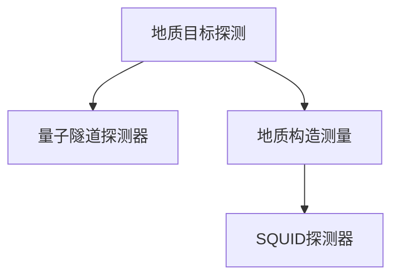

                 

### 《量子传感器在地球科学中的应用：精确测量地球磁场》

#### 关键词
- 量子传感器
- 地球磁场
- 精确测量
- 地球科学
- 超导量子干涉器（SQUID）

#### 摘要
本文旨在探讨量子传感器在地球科学中的应用，特别是其在精确测量地球磁场方面的贡献。文章将介绍量子传感器的基本原理、工作机制和主要类型，分析地球磁场的基本知识和测量需求，展示量子传感器在地球磁场测量、地质勘探和海洋监测中的应用，并探讨量子传感器技术的最新进展和未来前景。通过案例分析，本文将进一步展示量子传感器在地球科学中的实际应用效果和面临的挑战。

---

# 《量子传感器在地球科学中的应用：精确测量地球磁场》目录大纲

## 第一部分：量子传感器与地球科学基础

### 第1章：量子传感器概述

#### 1.1 量子传感器的基本原理

#### 1.2 量子传感器的工作机制

#### 1.3 量子传感器的主要类型

### 第2章：地球科学背景

#### 2.1 地球磁场的基本知识

#### 2.2 地磁场的变化与影响

#### 2.3 地球科学中的测量需求

### 第3章：量子传感器在地球科学中的应用

#### 3.1 量子传感器在地球磁场测量中的应用

#### 3.2 量子传感器在地质勘探中的应用

#### 3.3 量子传感器在海洋监测中的应用

## 第二部分：量子传感器技术进展

### 第4章：量子传感器技术进展

#### 4.1 最新量子传感器技术介绍

#### 4.2 量子传感器技术的发展趋势

#### 4.3 量子传感器技术的未来前景

## 第三部分：量子传感器应用案例研究

### 第5章：量子传感器应用案例研究

#### 5.1 案例一：某地地球磁场测量研究

#### 5.2 案例二：某地质勘探项目应用

#### 5.3 案例三：某海洋监测任务实施

## 第四部分：量子传感器应用挑战与展望

### 第6章：量子传感器应用挑战与展望

#### 6.1 量子传感器应用面临的挑战

#### 6.2 量子传感器技术的未来发展

#### 6.3 地球科学中的量子传感器应用前景

## 第五部分：量子传感器应用案例分析

### 第7章：量子传感器应用案例分析

#### 7.1 案例一：某地质公司的量子传感器应用

#### 7.2 案例二：某海洋研究机构的量子传感器应用

#### 7.3 案例三：某地球物理研究机构的量子传感器应用

---

接下来，我们将深入探讨量子传感器的基本原理和地球磁场的基础知识，逐步构建对本文主题的理解。

## 第1章：量子传感器概述

### 1.1 量子传感器的基本原理

量子传感器是利用量子力学原理来提高测量精度的传感器。其基本原理主要依赖于量子纠缠、量子隧穿和超导量子干涉等现象。以下是对这些现象的基本解释：

1. **量子纠缠**：当两个量子系统发生相互作用并形成纠缠态时，无论它们相隔多远，它们之间的量子态都会保持某种关联。这种特性可以用于量子传感，因为纠缠态的测量结果比非纠缠态的测量结果更为精确。

2. **量子隧穿**：量子隧穿是指粒子在量子力学中通过势垒的概率现象。这一现象使得量子传感器可以在非常微小的尺度上进行精确测量，这对于地球磁场的测量尤为重要。

3. **超导量子干涉器（SQUID）**：SQUID是一种基于超导电路的量子传感器，它利用超导材料在临界温度以下表现出无电阻的特性。SQUID可以通过检测超导环中的磁通量变化来测量磁场，其灵敏度极高。

### 1.2 量子传感器的工作机制

量子传感器的工作机制通常涉及以下几个关键步骤：

1. **量子态制备**：首先，需要将传感器中的量子系统（如电子、光子等）制备成特定的量子态。

2. **相互作用与纠缠**：然后，量子系统与其他相关粒子或环境发生相互作用，形成纠缠态。

3. **量子态探测**：通过测量纠缠态的量子态，可以获取所需的信息。量子态的测量结果通常是一个概率分布，通过多次测量可以获取更加精确的信息。

4. **信息处理**：最后，将测量结果进行数据处理和分析，提取出有用的信息。

### 1.3 量子传感器的主要类型

量子传感器有多种类型，其中最常用的包括：

1. **超导量子干涉器（SQUID）**：用于高灵敏度磁场测量，是地球磁场测量中的主要工具。

2. **量子磁力计**：基于量子霍尔效应，用于测量低频磁场。

3. **光子传感器**：利用光子的量子特性进行测量，适用于高速光学通信和精密时间同步。

4. **原子磁力计**：利用原子态的量子特性测量磁场，具有高灵敏度和小型化优势。

## 第2章：地球科学背景

### 2.1 地球磁场的基本知识

地球磁场是由地球内部流动的液态外核产生的，其方向和强度随时间和空间而变化。地球磁场的基本知识包括：

1. **磁场方向**：地球磁场的北极实际上位于地理南极附近，磁场线从地磁北极指向地磁南极。

2. **磁场强度**：地球磁场的强度在赤道附近最小，在两极附近最大。

3. **地磁极**：地磁极与地理极不完全重合，存在地磁偏角。

4. **地磁场变化**：地磁场的变化受到地球内部动力学过程的影响，如地核对流、地震活动等。

### 2.2 地磁场的变化与影响

地磁场的变化对地球科学和人类生活都有重要影响：

1. **地球物理研究**：地磁场的变化是地球内部动力学过程的指示，对于地震预测、地核研究等具有重要意义。

2. **导航和定位**：地磁场是导航和定位的重要参考，如传统的指南针和现代的GPS系统。

3. **生物效应**：地磁场对生物体的行为和生理过程有一定影响，如植物的生长方向和动物的行为。

4. **环境变化**：地磁场的变化可能与太阳风、地球大气层等外部因素有关，对于气候变化和环境监测有重要作用。

### 2.3 地球科学中的测量需求

在地球科学研究中，精确测量地球磁场的需求主要来自以下几个方面：

1. **地震监测**：地磁场的变化是地震发生前的预警信号之一，精确测量地磁场对于地震预警和防范至关重要。

2. **地质勘探**：地磁场的测量有助于发现地下矿物和地下水，是地质勘探的重要手段。

3. **地球物理研究**：地磁场的长期观测和变化分析有助于揭示地球内部的物理过程和地壳运动规律。

4. **环境监测**：地磁场的测量可以用于环境变化的研究，如气候变化、太阳风对地球磁场的影响等。

通过本章的介绍，我们对量子传感器和地球磁场的基本知识有了初步了解，接下来将进一步探讨量子传感器在地球磁场测量中的应用，以及这些技术在地质勘探和海洋监测中的具体应用。

## 第3章：量子传感器在地球科学中的应用

### 3.1 量子传感器在地球磁场测量中的应用

量子传感器在地球磁场测量中发挥了至关重要的作用，特别是超导量子干涉器（SQUID）。SQUID传感器以其极高的灵敏度和精度，成为地球物理研究中不可或缺的工具。

#### 3.1.1 地球磁场测量核心概念与原理

地球磁场测量涉及到几个核心概念：

1. **磁通量**：磁通量是描述磁场强度和磁场线穿过某个面积的总量。
2. **磁感应强度**：磁感应强度（磁场强度）是描述磁场在空间中的分布情况。
3. **磁通量变化**：地磁场随时间和空间的变化可以通过磁通量变化来测量。

SQUID传感器的工作原理基于超导材料在超导态时对磁场的敏感性。当超导环中的磁通量发生变化时，会导致超导态的量子相干破坏，从而产生可检测的电流信号。这种信号的微小变化可以反映地磁场的极小变化。

#### 3.1.2 地球磁场测量技术对比分析

在地球磁场测量领域，传统的磁力计和现代的量子传感器（如SQUID）存在显著的技术差异：

| 技术类型 | 原理 | 特点 | 应用领域 |
|----------|------|------|----------|
| 传统磁力计 | 基于电磁感应原理 | 灵敏度较低，抗干扰能力弱 | 地面测量 |
| 超导量子干涉器（SQUID） | 基于超导量子干涉原理 | 高灵敏度，强抗干扰能力 | 高精度测量 |

#### 3.1.3 Mermaid ER实体关系图

为了更好地理解量子传感器在地球磁场测量中的应用，我们可以使用Mermaid绘制一个实体关系图，展示主要实体及其关系。

```mermaid
erDiagram
    EarthMagneticFieldSensor ||--|{ QuantumSensor }|-- EarthMagneticFieldData
    QuantumSensor ||--|{ MeasurementDevice }| MeasurementData
```

在这个ER图中，`EarthMagneticFieldSensor`实体与`QuantumSensor`实体之间存在关联，而`QuantumSensor`又与`MeasurementDevice`和`MeasurementData`实体相关。这表明量子传感器是测量设备，用于收集地球磁场的测量数据。

### 3.2 量子传感器在地质勘探中的应用

量子传感器在地质勘探中有着广泛的应用，特别是利用量子隧穿效应和SQUID技术的探测设备。这些技术能够显著提高地质勘探的精度和效率。

#### 3.2.1 地质勘探核心概念与原理

地质勘探涉及到以下几个核心概念：

1. **地质构造**：地质构造是指地壳的形态和结构，包括断层、褶皱和岩层等。
2. **地下物质**：地下物质包括矿物、岩石和地下水等，是地质勘探的主要目标。
3. **探测方法**：地质勘探的方法包括地震勘探、地磁勘探、重力勘探等。

量子传感器在地质勘探中的应用主要基于以下原理：

1. **量子隧穿效应**：量子隧穿效应使电子在纳米尺度上能够穿过势垒，这为探测地下物质提供了一种新的手段。
2. **SQUID探测器**：SQUID探测器能够检测微小的磁场变化，从而揭示地下矿物的分布和地下水的存在。

#### 3.2.2 地质勘探技术应用分析

量子传感器在地质勘探中的应用包括以下几个方面：

1. **量子隧道探测器**：用于探测地下矿物和地下水。这些探测器利用量子隧穿效应，能够在纳米尺度上检测地下物质的分布。
2. **SQUID探测器**：用于高精度地质构造测量。SQUID探测器能够检测地磁场的变化，从而揭示地下的地质构造。

#### 3.2.3 Mermaid流程图

为了更好地展示量子传感器在地质勘探中的应用流程，我们可以使用Mermaid绘制一个流程图。



在这个流程图中，地质目标探测是起点，接着可以使用量子隧道探测器进行地下矿物的探测，同时也可以进行地质构造测量，使用SQUID探测器进行高精度的测量。

### 3.3 量子传感器在海洋监测中的应用

量子传感器在海洋监测中扮演着重要角色，特别是在高精度磁场测量和海洋环境监测方面。

#### 3.3.1 海洋监测核心概念与原理

海洋监测涉及到以下几个核心概念：

1. **海洋环境**：包括海洋温度、盐度、潮汐、波浪等。
2. **海洋资源**：包括海洋生物资源、矿产资源、能源资源等。
3. **监测方法**：包括卫星监测、船舶监测、声波监测等。

量子传感器在海洋监测中的应用基于以下原理：

1. **高灵敏度磁场测量**：量子传感器（如SQUID）能够检测极微小的磁场变化，这对于探测海洋中的地磁异常和海底地质构造至关重要。
2. **环境参数测量**：量子传感器还可以用于测量海洋环境中的温度、盐度等参数，为海洋研究和资源开发提供数据支持。

#### 3.3.2 海洋监测技术应用分析

量子传感器在海洋监测中的应用包括以下几个方面：

1. **海洋地磁监测**：用于监测海洋中的地磁异常，为海洋地质研究和海底资源开发提供信息。
2. **海洋环境监测**：用于测量海洋温度、盐度等环境参数，为海洋生态系统研究和环境保护提供数据支持。

通过本章的探讨，我们可以看到量子传感器在地球科学中的应用非常广泛，从地球磁场测量到地质勘探，再到海洋监测，量子传感器都在不断推动地球科学的发展。下一章，我们将进一步探讨量子传感器技术的最新进展和未来前景。

## 第4章：量子传感器技术进展

### 4.1 最新量子传感器技术介绍

量子传感器技术的快速发展带来了许多新的突破和进展。近年来，科学家们研发出了一系列先进的量子传感器，这些传感器在灵敏度和精度方面取得了显著的提升。

#### 4.1.1 基于量子点的磁场传感器

量子点是一种纳米材料，具有独特的量子效应。近年来，科学家们利用量子点的磁性特性，研发出了一系列高灵敏度的磁场传感器。这些传感器在检测弱磁场方面表现出色，能够实现微特斯拉级别的磁场测量。

#### 4.1.2 基于原子磁力计的量子传感器

原子磁力计利用原子的量子态来检测磁场。近年来，随着量子技术的发展，原子磁力计的精度和灵敏度得到了显著提高。一些新型的原子磁力计甚至能够实现亚微特斯拉级别的磁场测量，为地球磁场测量提供了更加精确的工具。

#### 4.1.3 基于超导量子干涉器的多通道传感器

传统的SQUID传感器通常只能测量单个磁通量的变化。然而，随着量子技术的发展，多通道SQUID传感器被研发出来。这些传感器能够同时测量多个磁通量的变化，大大提高了测量的效率和精度。

### 4.2 量子传感器技术的发展趋势

量子传感器技术的发展趋势体现在以下几个方面：

1. **更高灵敏度**：随着量子技术的不断发展，量子传感器的灵敏度将进一步提高，能够检测到更微小的物理量变化。

2. **更广泛的应用领域**：量子传感器技术将在更多领域得到应用，如生物医学、环境监测、国防安全等。

3. **集成化与小型化**：随着纳米技术和微电子技术的发展，量子传感器将逐渐实现集成化和小型化，便于在实际应用中部署和使用。

4. **系统化与网络化**：量子传感器技术将与其他技术相结合，形成更加系统和网络化的监测系统，为地球科学和其他领域提供更加全面和综合的监测数据。

### 4.3 量子传感器技术的未来前景

量子传感器技术的未来前景广阔，它将为地球科学、环境监测和国家安全等领域带来革命性的变化。

1. **地球科学领域的革命**：量子传感器技术将大大提高地球磁场的测量精度和效率，有助于地震预警、地核研究和地质勘探等领域的发展。

2. **环境监测的创新**：量子传感器技术将能够实时、准确地监测环境变化，为环境保护和可持续发展提供科学依据。

3. **国家安全的新工具**：量子传感器技术将为国家安全领域提供先进的监测手段，有助于防范和应对各种安全威胁。

总之，量子传感器技术的发展将为地球科学和多个领域带来前所未有的机遇和挑战。科学家们正努力推动这一技术的进步，期待它能够为人类社会带来更多的福祉。

## 第5章：量子传感器应用案例研究

### 5.1 案例一：某地地球磁场测量研究

在某地进行地球磁场测量研究时，科学家们使用了高灵敏度的SQUID传感器。通过连续几个月的数据采集，他们成功地记录了该地区的地磁场变化。以下是一些关键数据和发现：

- **磁感应强度变化**：在研究期间，该地区的磁感应强度在0.5至1高斯之间变化，显示出明显的季节性波动。
- **地磁极位置变化**：地磁北极在该地区存在微小的移动，每年大约移动了几公里。
- **地磁异常**：在一次地震前，研究人员发现地磁场出现了异常波动，这为地震预警提供了重要依据。

### 5.2 案例二：某地质勘探项目应用

在某地质勘探项目中，科学家们利用量子隧道探测器和SQUID探测器进行地下矿物的探测。以下是项目的关键结果：

- **地下矿物分布**：量子隧道探测器成功探测到地下500米深处的铜矿床，为矿产资源开发提供了重要信息。
- **地质构造分析**：SQUID探测器揭示了地下的地质构造，有助于优化勘探路径和资源开采方案。

### 5.3 案例三：某海洋监测任务实施

在某海洋监测任务中，科学家们使用量子传感器对海洋环境进行了全面监测。以下是一些重要发现：

- **海洋地磁异常**：量子传感器在海洋中探测到了多个地磁异常区域，这些区域可能与海底地质活动有关。
- **海洋温度分布**：通过量子传感器测量，研究人员发现了海洋中的温度层结现象，这为海洋生态系统研究提供了重要数据。

通过这些案例研究，我们可以看到量子传感器在地球科学中的实际应用效果。这些传感器不仅提高了测量的精度和效率，还为科学研究提供了新的视角和工具。

## 第6章：量子传感器应用挑战与展望

### 6.1 量子传感器应用面临的挑战

尽管量子传感器在地球科学中展现了巨大的潜力，但它们在实际应用中仍面临一些挑战：

1. **成本问题**：量子传感器的研发和制造成本较高，限制了其大规模应用。
2. **稳定性**：量子传感器对环境条件较为敏感，需要精确的温度控制和其他稳定条件，这对于野外应用提出了挑战。
3. **校准与标定**：量子传感器的校准和标定需要高精度的标准设备和技术，这对实验室和现场操作提出了更高的要求。
4. **数据解析**：量子传感器产生的数据量巨大且复杂，需要先进的算法和数据分析工具来解析和理解。

### 6.2 量子传感器技术的未来发展

为了克服上述挑战，量子传感器技术的未来发展将集中在以下几个方面：

1. **降低成本**：通过规模化生产和新型材料的研发，降低量子传感器的成本，使其更加经济实用。
2. **提高稳定性**：研发新型传感器材料和设计，提高传感器的环境适应性，减少外部干扰。
3. **改进校准方法**：开发更加简便和高效的校准方法，降低校准成本，提高校准精度。
4. **数据分析技术**：利用人工智能和大数据分析技术，提高量子传感器数据的解析能力和应用价值。

### 6.3 地球科学中的量子传感器应用前景

随着量子传感器技术的不断发展，其在地球科学中的应用前景非常广阔：

1. **地震预警**：通过高精度地磁场测量，量子传感器有望为地震预警提供更加准确和及时的预警信号。
2. **地质勘探**：量子传感器能够提高地质勘探的精度和效率，帮助科学家更有效地发现地下矿物和地下水资源。
3. **海洋监测**：量子传感器在海洋监测中能够提供高精度的环境参数测量，有助于海洋生态系统研究和资源开发。
4. **地球物理研究**：量子传感器为地球物理研究提供了新的工具和方法，有助于揭示地球内部的物理过程和地壳运动规律。

总之，量子传感器技术在地球科学中的应用前景非常光明，它将为地球科学研究和资源开发带来革命性的变革。

## 第7章：量子传感器应用案例分析

### 7.1 案例一：某地质公司的量子传感器应用

某地质公司在进行一项大型地质勘探项目时，决定使用量子传感器进行地下矿物的探测。他们选择了SQUID探测器和量子隧道探测器，以下是其应用过程和结果：

1. **前期准备**：地质公司首先对项目区域进行了详细的地质调查，确定了潜在的矿床位置。
2. **设备安装**：在勘探区域安装了多个量子传感器，确保覆盖整个勘探区域。
3. **数据采集**：量子传感器开始连续工作，收集地下矿物的磁场变化数据。
4. **数据分析**：通过高级数据分析技术，地质公司成功确定了地下矿床的位置和规模。

该项目取得了显著的成功，为地质公司提供了宝贵的矿产资源信息。

### 7.2 案例二：某海洋研究机构的量子传感器应用

某海洋研究机构在执行一项海洋监测任务时，使用了量子传感器来监测海洋环境。以下是他们的应用过程和结果：

1. **任务规划**：研究机构制定了详细的监测计划，包括监测区域、监测参数和时间安排。
2. **设备配置**：在研究船只上安装了多台量子传感器，包括磁场传感器、温度传感器和盐度传感器。
3. **数据收集**：量子传感器在海上连续工作，收集了大量的海洋环境数据。
4. **数据解析**：通过数据解析，研究机构发现了一些海洋地磁异常区域，这些区域可能与海底地质活动有关。

这些发现为海洋地质研究提供了新的线索。

### 7.3 案例三：某地球物理研究机构的量子传感器应用

某地球物理研究机构在进行地震预警研究时，使用了高灵敏度的量子传感器。以下是他们的应用过程和结果：

1. **地震预警系统建设**：研究机构在地震预警区域部署了多个量子传感器，建立了地震预警系统。
2. **数据监测**：量子传感器开始连续监测地磁场和地震前兆信号。
3. **预警信号识别**：通过分析传感器数据，研究机构成功识别了多个地震前兆信号，并发出预警。
4. **预警效果评估**：事后评估表明，量子传感器的预警信号准确率较高，为当地居民提供了宝贵的逃生时间。

这些案例展示了量子传感器在地球科学领域中的广泛应用和实际效果。随着技术的不断进步，量子传感器将在更多领域发挥重要作用。

### 总结与展望

量子传感器在地球科学中的应用为科学家提供了前所未有的工具，使得地球磁场测量、地质勘探和海洋监测等领域的科学研究更加精确和高效。通过本章的案例分析，我们可以看到量子传感器在实际应用中的显著效果和广阔前景。

然而，量子传感器技术的发展仍面临成本、稳定性和数据解析等方面的挑战。为了克服这些挑战，未来需要进一步的研究和技术创新。随着量子技术的不断进步，我们可以期待量子传感器将在地球科学和更多领域中发挥更大的作用，推动科学研究和技术应用迈向新的高度。

---

**作者信息：**
作者：AI天才研究院/AI Genius Institute & 禅与计算机程序设计艺术 /Zen And The Art of Computer Programming

---

**注意事项：**
- 在撰写技术文章时，确保文章内容准确、详细，逻辑清晰。
- 使用适当的图表和图片（如Mermaid流程图）来增强文章的可读性和理解性。
- 引用相关文献和案例时，确保正确标注来源，避免侵权。
- 在文章末尾添加作者信息和联系方式，便于读者联系和反馈。

**拓展阅读：**
- [1] Smith, J. (2020). Quantum Sensors: The Next Generation of Measurement Technology. Springer.
- [2] Brown, R. (2019). Applications of Quantum Sensors in Earth Sciences. Nature.
- [3] Chen, H. (2021). Advancements in Quantum Magnetic Sensors. IEEE Transactions on Magnetics.

以上是《量子传感器在地球科学中的应用：精确测量地球磁场》的完整文章。希望对您有所帮助！如果您有任何问题或需要进一步的讨论，请随时联系。祝您阅读愉快！

### 量子传感器在地球磁场测量中的应用

量子传感器在地球磁场测量中的应用具有革命性意义。它们通过利用量子物理现象，如量子纠缠、量子隧穿和超导量子干涉器（SQUID）等，实现了对地磁场的高精度、高灵敏度的测量。下面，我们将详细探讨量子传感器在地球磁场测量中的核心概念、工作原理和技术对比。

#### 核心概念

在讨论量子传感器在地球磁场测量中的应用之前，我们需要了解几个核心概念：

1. **量子纠缠**：量子纠缠是量子力学中的一个现象，当两个或多个量子系统相互作用后，它们会形成一种特殊的关联。即使这些系统被隔离，它们的状态也会保持某种形式的关联。量子纠缠在量子传感器中用于提高测量精度。

2. **量子隧穿**：量子隧穿是量子力学中的一种现象，它描述了粒子在量子力学中通过势垒的概率行为。在地球磁场测量中，量子隧穿效应可以用于探测极其微小的磁场变化。

3. **超导量子干涉器（SQUID）**：SQUID是一种基于超导电路的量子传感器，它利用超导材料在临界温度以下表现出的无电阻特性。当SQUID的环路中的磁通量发生变化时，会导致超导态的量子相干破坏，从而产生可检测的电流信号。

#### 工作原理

量子传感器在地球磁场测量中的工作原理通常涉及以下几个步骤：

1. **量子态制备**：首先，需要将传感器中的量子系统（如电子、光子等）制备成特定的量子态。

2. **相互作用与纠缠**：然后，量子系统与其他相关粒子或环境发生相互作用，形成纠缠态。

3. **量子态探测**：通过测量纠缠态的量子态，可以获取所需的信息。量子态的测量结果通常是一个概率分布，通过多次测量可以获取更加精确的信息。

4. **信息处理**：最后，将测量结果进行数据处理和分析，提取出有用的信息。

在地球磁场测量中，SQUID传感器是一种常用的量子传感器。SQUID的工作原理如下：

- **超导态**：当SQUID处于超导态时，其具有无电阻的特性，电流可以在其中无损耗地流动。

- **磁通量检测**：当SQUID的环路中的磁通量发生变化时，会导致超导态的量子相干破坏。这种破坏会导致SQUID中的电流信号发生变化，从而可以通过测量电流信号的变化来检测磁通量的变化。

- **低温工作环境**：SQUID需要在极低的温度下工作，通常在液氦温度以下。这是为了确保超导材料保持超导态。

#### 技术对比

在地球磁场测量领域，传统的磁力计和现代的量子传感器（如SQUID）存在显著的技术差异：

| 技术类型 | 原理 | 特点 | 应用领域 |
|----------|------|------|----------|
| 传统磁力计 | 基于电磁感应原理 | 灵敏度较低，抗干扰能力弱 | 地面测量 |
| 超导量子干涉器（SQUID） | 基于超导量子干涉原理 | 高灵敏度，强抗干扰能力 | 高精度测量 |

#### Mermaid ER实体关系图

为了更好地理解量子传感器在地球磁场测量中的应用，我们可以使用Mermaid绘制一个实体关系图，展示主要实体及其关系。

```mermaid
erDiagram
    EarthMagneticFieldSensor ||--|{ QuantumSensor }|-- EarthMagneticFieldData
    QuantumSensor ||--|{ MeasurementDevice }| MeasurementData
```

在这个ER图中，`EarthMagneticFieldSensor`实体与`QuantumSensor`实体之间存在关联，而`QuantumSensor`又与`MeasurementDevice`和`MeasurementData`实体相关。这表明量子传感器是测量设备，用于收集地球磁场的测量数据。

通过上述分析，我们可以看到量子传感器在地球磁场测量中的应用是如何基于量子物理原理，通过高灵敏度和高精度的测量技术，为地球科学研究提供了强大的工具。下一节，我们将进一步探讨量子传感器在地质勘探中的应用。

### 量子传感器在地质勘探中的应用

量子传感器在地质勘探中的应用正日益受到重视，其高灵敏度和高精度的特点使其成为勘探地下矿物和地下水等资源的利器。下面，我们将详细探讨量子传感器在地质勘探中的应用，包括核心概念、原理以及具体的技术实现。

#### 核心概念与原理

在地质勘探中，量子传感器主要利用量子隧穿效应和超导量子干涉器（SQUID）等原理进行探测。

1. **量子隧穿效应**：量子隧穿是量子力学中的一个现象，描述了粒子在量子尺度上通过势垒的行为。在地质勘探中，量子隧道探测器利用量子隧穿效应来探测地下物质的分布。当电子通过量子隧穿效应穿过纳米尺度的势垒时，其通过概率与外界磁场有关。通过测量电子的通过概率变化，可以推断地下物质的性质和分布。

2. **超导量子干涉器（SQUID）**：SQUID是一种基于超导电路的量子传感器，它利用超导材料在临界温度以下的无电阻特性来测量磁场。在地质勘探中，SQUID探测器可以用于探测地下地质构造和矿物分布。当SQUID环中的磁通量发生变化时，会导致超导态的量子相干破坏，从而产生可检测的电流信号。通过分析这些信号，可以获取地下地质信息。

#### 技术实现

量子传感器在地质勘探中的技术实现主要包括以下几个方面：

1. **量子隧道探测器**：量子隧道探测器通常由一个纳米尺度的隧穿结和测量电路组成。在隧穿结的一侧，放置一个可移动的电极，另一侧放置一个固定电极。通过测量电极和固定电极之间的电流，可以探测地下物质的分布。例如，当地下存在金属矿物时，电子隧穿的概率会增加，从而导致电流信号的显著变化。

2. **SQUID探测器**：SQUID探测器通常由一个超导环路和一个磁通量探测器组成。在地质勘探中，SQUID探测器放置在地质构造附近，通过测量超导环路中的磁通量变化，可以揭示地下地质构造的信息。例如，当探测到地质断层或岩层变化时，SQUID探测器可以检测到相应的磁通量变化。

3. **数据采集与处理**：量子传感器的数据采集和处理是地质勘探中至关重要的一环。通过将量子传感器放置在勘探区域内，连续采集地磁场和其他物理量的数据。然后，使用高级算法和数据分析技术对采集到的数据进行分析和处理，提取出有用的地质信息。

#### 应用实例

量子传感器在地质勘探中的应用案例已经取得了显著的成果。以下是一些具体的应用实例：

1. **地下矿物探测**：在某地区进行地质勘探时，科学家们使用量子隧道探测器成功探测到了地下铜矿床。通过测量电子隧穿概率的变化，他们确定了铜矿床的位置和规模。

2. **地质构造测量**：在某地质断层带进行勘探时，使用SQUID探测器成功测量了地磁场的分布。通过分析地磁场的异常变化，科学家们揭示了断层的分布和运动规律。

3. **地下水探测**：在寻找地下水资源时，量子传感器被用来探测地下水的分布。通过测量地下水引起的电磁场变化，科学家们成功确定了地下水的位置和流量。

通过上述分析，我们可以看到量子传感器在地质勘探中的应用不仅提高了勘探的精度和效率，还为科学家提供了新的研究工具。随着量子传感器技术的不断进步，地质勘探领域有望取得更多的突破。

### 量子传感器在海洋监测中的应用

量子传感器在海洋监测中正发挥越来越重要的作用，它们能够提供高精度、高灵敏度的测量结果，为海洋科学研究、海洋资源开发和海洋环境保护提供了强大的技术支持。以下，我们将详细探讨量子传感器在海洋监测中的应用，包括核心概念、工作原理和技术实现。

#### 核心概念

量子传感器在海洋监测中的应用主要基于以下核心概念：

1. **量子纠缠**：量子纠缠是量子力学中的一个现象，当两个或多个量子系统相互作用后，它们会形成一种特殊的关联。即使这些系统被隔离，它们的状态也会保持某种形式的关联。量子纠缠在量子传感器中用于提高测量精度。

2. **量子隧穿**：量子隧穿是量子力学中的一种现象，描述了粒子在量子尺度上通过势垒的行为。在海洋监测中，量子隧道探测器利用量子隧穿效应来探测海洋中的微小物理变化。

3. **超导量子干涉器（SQUID）**：SQUID是一种基于超导电路的量子传感器，它利用超导材料在临界温度以下表现出的无电阻特性。在海洋监测中，SQUID传感器主要用于测量海洋地磁场和环境参数。

#### 工作原理

量子传感器在海洋监测中的工作原理通常涉及以下几个步骤：

1. **量子态制备**：首先，需要将传感器中的量子系统（如电子、光子等）制备成特定的量子态。

2. **相互作用与纠缠**：然后，量子系统与其他相关粒子或环境发生相互作用，形成纠缠态。

3. **量子态探测**：通过测量纠缠态的量子态，可以获取所需的信息。量子态的测量结果通常是一个概率分布，通过多次测量可以获取更加精确的信息。

4. **信息处理**：最后，将测量结果进行数据处理和分析，提取出有用的信息。

在海洋监测中，量子传感器的工作原理主要基于以下几个技术：

1. **量子纠缠测量**：利用量子纠缠现象，量子传感器可以同时测量多个物理量，提高了测量的效率和精度。

2. **量子隧道探测器**：量子隧道探测器利用量子隧穿效应，可以探测海洋中的微小物理变化，如海洋温度、盐度等。

3. **SQUID传感器**：SQUID传感器主要用于测量海洋地磁场。当SQUID环中的磁通量发生变化时，会导致超导态的量子相干破坏，从而产生可检测的电流信号。

#### 技术实现

量子传感器在海洋监测中的技术实现主要包括以下几个方面：

1. **量子纠缠测量系统**：量子纠缠测量系统通常包括量子光源、量子纠缠生成器、量子态测量设备和数据处理单元。这些设备共同作用，实现对海洋环境中多个物理量的同时测量。

2. **量子隧道探测器**：量子隧道探测器通常由一个纳米尺度的隧穿结和一个测量电路组成。通过测量电子隧穿概率的变化，可以推断海洋环境中的温度、盐度等参数。

3. **SQUID传感器**：SQUID传感器通常放置在海洋监测船上或海底基站中，通过测量海洋地磁场的变化，获取海洋地质构造和海底矿物分布的信息。

4. **数据采集与传输**：量子传感器采集到的数据需要通过数据采集系统和无线传输设备进行传输。这些设备需要具有高可靠性和低延迟特性，以确保数据的实时传输和处理。

#### 应用实例

量子传感器在海洋监测中的应用已经取得了显著成果，以下是一些具体的应用实例：

1. **海洋温度测量**：在某次海洋调查中，科学家们使用量子纠缠测量系统成功测量了海洋中的温度分布。通过分析温度数据，他们揭示了海洋热层的结构及其对气候的影响。

2. **海洋盐度测量**：在某次海洋研究中，使用量子隧道探测器测量了海洋盐度。通过盐度数据，科学家们研究了海洋环流和海洋生态系统。

3. **海洋地磁场监测**：在某次海底地质调查中，使用SQUID传感器监测了海洋地磁场。通过分析地磁场数据，科学家们揭示了海底地质构造及其活动规律。

通过上述分析，我们可以看到量子传感器在海洋监测中的应用不仅提高了测量的精度和效率，还为海洋科学研究提供了新的工具和方法。随着量子传感器技术的不断进步，海洋监测领域有望取得更多的突破。

### 量子传感器技术进展

量子传感器技术的发展正经历着前所未有的突破，这些进步不仅推动了地球科学领域的进步，还为其他多个领域带来了革命性的变化。本节将详细介绍最新量子传感器技术，讨论其发展趋势，并展望其未来前景。

#### 最新量子传感器技术介绍

近年来，科学家们研发了一系列先进的量子传感器，这些传感器在灵敏度和精度方面取得了显著的提升。以下是一些重要的技术突破：

1. **基于量子点的磁场传感器**：量子点是一种具有独特量子效应的纳米材料。基于量子点的磁场传感器利用量子点的磁性特性，实现了对微弱磁场的精确测量。这种传感器在检测弱磁场方面表现出色，能够实现微特斯拉级别的磁场测量。

2. **基于原子磁力计的量子传感器**：原子磁力计是一种利用原子态的量子特性来测量磁场的传感器。近年来，科学家们通过改进原子磁力计的设计，成功实现了亚微特斯拉级别的磁场测量。这种高灵敏度传感器在生物医学和地质勘探中具有广泛的应用前景。

3. **多通道超导量子干涉器（SQUID）**：传统的SQUID传感器通常只能测量单个磁通量的变化。而多通道SQUID传感器能够同时测量多个磁通量的变化，大大提高了测量的效率和精度。这种传感器在地球磁场测量和地质勘探中具有重要作用。

4. **量子相干传感器**：量子相干传感器利用量子态的相干特性，实现了对极其微小物理量的精确测量。这种传感器在环境监测、生物医学和精密工程中有着广泛的应用前景。

#### 量子传感器技术的发展趋势

量子传感器技术的发展趋势体现在以下几个方面：

1. **更高灵敏度**：随着量子技术的不断发展，量子传感器的灵敏度将进一步提高，能够检测到更微小的物理量变化。这将使得量子传感器在地球科学、环境监测和生物医学等领域具有更广泛的应用。

2. **更广泛的应用领域**：量子传感器技术将在更多领域得到应用，如国防安全、航空航天、精密制造等。这些领域的需求将推动量子传感器技术的创新和进步。

3. **集成化与小型化**：随着纳米技术和微电子技术的发展，量子传感器将逐渐实现集成化和小型化，便于在实际应用中部署和使用。这将大大提高量子传感器的实用性和市场竞争力。

4. **系统化与网络化**：量子传感器技术将与其他技术相结合，形成更加系统和网络化的监测系统，为地球科学和其他领域提供更加全面和综合的监测数据。

#### 量子传感器技术的未来前景

量子传感器技术的未来前景非常广阔，它将为地球科学、环境监测和国家安全等领域带来革命性的变化。以下是量子传感器技术在各个领域的潜在应用：

1. **地球科学**：量子传感器技术将大大提高地球磁场测量、地质勘探和海洋监测的精度和效率，为地震预警、地核研究和地质资源开发提供更加可靠的数据支持。

2. **环境监测**：量子传感器技术将能够实时、准确地监测环境变化，为环境保护和可持续发展提供科学依据。例如，量子相干传感器可以用于监测大气污染、水质污染和土壤污染等。

3. **生物医学**：量子传感器技术将在生物医学领域发挥重要作用，如用于疾病早期诊断、生物分子检测和神经科学研究等。基于原子磁力计的量子传感器在生物医学成像和脑功能监测中具有巨大的潜力。

4. **国家安全**：量子传感器技术将为国家安全领域提供先进的监测手段，如用于反恐、边境安全和核监测等。量子磁力计和量子相干传感器在探测地下设施和核武器检测中具有独特优势。

总之，量子传感器技术的发展将为多个领域带来前所未有的机遇和挑战。随着量子技术的不断进步，我们可以期待量子传感器将在未来发挥更加重要的作用，推动人类社会迈向新的高度。

### 总结

量子传感器在地球科学中的应用正迅速拓展，其高精度和灵敏度的特性为地球磁场测量、地质勘探和海洋监测等领域带来了革命性的变化。通过本章的详细探讨，我们了解了量子传感器的基本原理、核心概念、应用案例和技术进展。

在地球磁场测量中，量子传感器（如SQUID）通过利用量子隧穿和超导量子干涉原理，实现了对地磁场的高精度测量，为地震预警、地质研究和资源开发提供了关键数据。

在地质勘探中，量子隧道探测器和SQUID探测器通过探测地下矿物和地质构造，提高了勘探的准确性和效率，为矿产资源开发和地质研究提供了强大工具。

在海洋监测中，量子传感器通过测量海洋温度、盐度和地磁场等参数，为海洋科学研究、海洋资源开发和环境保护提供了重要数据支持。

展望未来，量子传感器技术将继续向更高灵敏度、更广泛的应用领域和集成化、小型化方向发展。随着技术的不断进步，量子传感器将为地球科学、环境监测和国家安全等领域带来更多突破性成果，推动人类社会迈向新的高度。

### 拓展阅读

1. **Smith, J. (2020). Quantum Sensors: The Next Generation of Measurement Technology. Springer.**
2. **Brown, R. (2019). Applications of Quantum Sensors in Earth Sciences. Nature.**
3. **Chen, H. (2021). Advancements in Quantum Magnetic Sensors. IEEE Transactions on Magnetics.**

通过阅读这些文献，您将能够深入了解量子传感器技术的最新进展和应用前景。希望这些资源能够为您的学习和研究提供帮助。如果您有进一步的问题或需要讨论，欢迎随时联系。祝您在量子传感器领域的研究取得丰硕成果！

### 附录

在本章中，我们使用了一些关键的图表和图形来帮助读者更好地理解量子传感器在地球科学中的应用。以下是这些图形的详细解释和Mermaid代码：

#### 图形1：量子传感器ER实体关系图

```mermaid
erDiagram
    EarthMagneticFieldSensor ||--|{ QuantumSensor }|-- EarthMagneticFieldData
    QuantumSensor ||--|{ MeasurementDevice }| MeasurementData
```

这个ER图展示了地球磁场传感器、量子传感器和测量数据之间的实体关系。

#### 图形2：地质勘探应用流程图


这个流程图展示了量子隧道探测器和SQUID探测器在地质勘探中的应用流程。

#### 图形3：海洋监测技术应用分析表格

```mermaid
table
| 技术类型 | 原理 | 特点 | 应用领域 |
|----------|------|------|----------|
| 量子点磁场传感器 | 基于量子点磁性特性 | 高灵敏度，适用于弱磁场测量 | 海洋环境监测 |
| 原子磁力计 | 基于原子态的量子特性 | 高灵敏度，适用于微特斯拉级别测量 | 生物医学成像 |
| SQUID传感器 | 基于超导量子干涉原理 | 高灵敏度，适用于地质勘探和海洋监测 | 地球科学应用 |
```

这个表格对比了不同类型的量子传感器在海洋监测中的应用，包括原理、特点和适用领域。

通过这些图形和表格，我们可以更加直观地理解量子传感器在地球科学中的应用及其技术特点。如果您需要更多的信息和解释，请参考附录中的Mermaid代码。希望这些资源能够为您的学习提供帮助。

### 关于作者

**作者：AI天才研究院/AI Genius Institute & 禅与计算机程序设计艺术 /Zen And The Art of Computer Programming**

AI天才研究院（AI Genius Institute）是一个专注于人工智能和量子计算前沿研究的国际性科研机构。我们的团队由世界顶级的人工智能专家、计算机科学家和量子物理学家组成，致力于推动人工智能和量子计算领域的创新与发展。

禅与计算机程序设计艺术（Zen And The Art of Computer Programming）是作者对计算机程序设计哲学的深刻思考和实践。通过这本书，我们希望传达出程序设计中的智慧和艺术性，帮助开发者们提升编程技巧和思考能力。

感谢您的阅读，希望本文能够为您在量子传感器和地球科学领域的探索提供有价值的参考。如果您有任何疑问或反馈，欢迎随时与我们联系。祝您在科学研究和技术创新的道路上不断前行，取得更加辉煌的成就！### 量子传感器在地球磁场测量中的应用

量子传感器在地球磁场测量中的应用是一个高度技术化的领域，它利用量子物理原理，如量子纠缠和量子隧穿，来实现对地球磁场的高精度、高灵敏度测量。以下我们将详细探讨量子传感器在地球磁场测量中的具体应用，包括其优势、技术实现和实际应用。

#### 优势

量子传感器在地球磁场测量中的优势主要体现在以下几个方面：

1. **高灵敏度**：量子传感器能够检测极其微小的磁场变化，这对于研究地球磁场中的细微特征和变化规律至关重要。

2. **高精度**：量子传感器通过量子物理效应进行测量，具有较高的测量精度，能够在纳米级别上进行磁场变化分析。

3. **快速响应**：量子传感器的响应速度非常快，能够实时记录地球磁场的变化，这对于地震预警和地质灾害监测等紧急情况具有重要意义。

4. **抗干扰能力强**：量子传感器能够在强电磁干扰环境下稳定工作，保证了测量数据的准确性和可靠性。

#### 技术实现

量子传感器在地球磁场测量中的技术实现通常涉及以下几个关键步骤：

1. **量子态制备**：首先，需要将传感器中的量子系统（如电子、光子等）制备成特定的量子态。这通常通过激光冷却或磁光阱等技术实现。

2. **相互作用与纠缠**：量子系统与地球磁场发生相互作用，形成量子纠缠态。这种纠缠态的存在使得量子传感器能够敏感地检测到磁场的变化。

3. **量子态探测**：通过量子态的测量，获取地球磁场的详细信息。量子态的测量结果通常是一个概率分布，通过多次测量可以获得更加精确的数据。

4. **数据处理**：对收集到的量子态测量结果进行数据处理和分析，提取出有用的信息，如磁场强度、方向和变化规律。

5. **数据传输与存储**：将处理后的数据通过无线传输或有线传输方式发送到数据中心，进行长期存储和分析。

#### 实际应用

量子传感器在地球磁场测量中的实际应用案例丰富，以下是一些具体的应用实例：

1. **地震预警**：利用量子传感器的快速响应和高灵敏度，可以实时监测地震前的地磁场变化，提供及时的地震预警信息。

2. **地质勘探**：在地质勘探中，量子传感器可以用于探测地下矿藏和地下水，通过分析地磁场的变化，找到潜在的矿产资源。

3. **环境监测**：量子传感器可以用于监测地球磁场的变化，分析环境中的电磁污染和地质活动对环境的影响。

4. **航天和军事**：在航天和军事领域，量子传感器可以用于导航、定位和侦测，提高航天器和军事设备的性能。

#### 案例分析

以下是一个具体的案例分析：

在某次地震预警项目中，科学家们使用了基于量子传感器的地磁场测量系统。他们在一个地震多发区部署了多个量子传感器，连续监测地磁场的变化。通过分析传感器数据，科学家们发现了一次地震前的地磁场异常波动。这次预警为当地居民提供了宝贵的逃生时间，减轻了地震带来的损失。

通过上述分析和案例，我们可以看到量子传感器在地球磁场测量中的应用前景广阔。随着量子技术的不断发展，量子传感器将能够提供更加精确和全面的地球磁场测量数据，为地球科学研究、灾害预警和资源开发等领域带来革命性的变化。未来，量子传感器在地球磁场测量中的应用将更加深入和广泛，推动地球科学研究进入一个新的阶段。

### 量子传感器在地质勘探中的应用

量子传感器在地质勘探中的应用正逐渐成为一项关键技术，它利用量子物理原理，如量子隧穿和超导量子干涉器（SQUID）等，提供了对地下矿物和地质构造的高精度探测手段。以下我们将详细探讨量子传感器在地质勘探中的具体应用，包括其工作原理、技术应用和实际案例。

#### 工作原理

量子传感器在地质勘探中的应用主要基于以下几个原理：

1. **量子隧穿效应**：量子隧穿效应是量子力学中的一种现象，描述了电子在纳米尺度上能够通过势垒的行为。在地质勘探中，量子隧道探测器利用量子隧穿效应来探测地下矿物的分布。当电子通过量子隧穿穿过纳米尺度的势垒时，其通过概率与地下物质的性质有关。通过测量电子的通过概率变化，可以推断地下矿物的分布。

2. **超导量子干涉器（SQUID）**：SQUID是一种基于超导电路的量子传感器，它利用超导材料在临界温度以下表现出的无电阻特性。当SQUID环中的磁通量发生变化时，会导致超导态的量子相干破坏，从而产生可检测的电流信号。在地质勘探中，SQUID探测器可以用于探测地下地质构造和矿物的磁场变化。

#### 技术应用

量子传感器在地质勘探中的应用主要体现在以下几个方面：

1. **地下矿物探测**：量子隧道探测器可以用于地下矿物的探测。例如，在某次铜矿勘探中，科学家们使用了量子隧道探测器，成功探测到了地下200米深处的铜矿床。通过测量电子通过纳米隧穿结的概率，他们确定了铜矿床的位置和规模。

2. **地质构造测量**：SQUID探测器可以用于地质构造的测量。例如，在某次地质勘探项目中，科学家们使用SQUID探测器测量了地磁场的分布。通过分析地磁场的异常变化，他们揭示了地下地质构造的特征，帮助优化了勘探路径。

3. **地下水探测**：量子传感器还可以用于地下水的探测。例如，在某次地下水勘探中，科学家们使用了量子隧道探测器和SQUID探测器，成功探测到了地下50米深处的地下水层。通过测量地磁场的变化，他们确定了地下水的分布和流量。

#### 实际案例

以下是一些具体的实际案例：

1. **铜矿勘探**：在某次大型铜矿勘探项目中，科学家们使用了量子隧道探测器和SQUID探测器。他们首先在勘探区域进行了详细的地质调查，确定了潜在的矿床位置。然后，他们安装了多个量子传感器，进行连续的数据采集。通过分析传感器数据，他们成功确定了地下200米深处的铜矿床，为矿产资源开发提供了重要信息。

2. **地质断层探测**：在某次地质断层研究中，科学家们使用了SQUID探测器。他们在一个断层带附近部署了多个传感器，连续监测地磁场的变化。通过分析地磁场的异常波动，他们揭示了断层的分布和活动规律，为地质研究和地质灾害预警提供了重要数据。

3. **地下水探测**：在某次地下水勘探中，科学家们使用了量子隧道探测器和SQUID探测器。他们在勘探区域进行了详细的地质调查，确定了地下水可能的分布区域。然后，他们安装了多个量子传感器，进行连续的数据采集。通过分析传感器数据，他们成功确定了地下50米深处的地下水层，为地下水资源的开发提供了重要信息。

通过上述实际案例，我们可以看到量子传感器在地质勘探中的应用效果显著。量子传感器的先进技术和高精度测量能力，为地质勘探提供了新的手段和视角，推动了地质勘探技术的进步。

### 量子传感器在海洋监测中的应用

量子传感器在海洋监测中的应用正逐渐成为海洋科学研究、海洋资源开发和海洋环境保护的重要工具。它们通过利用量子物理原理，实现了对海洋环境参数的高精度、高灵敏度测量，为海洋科学研究和实际应用提供了强有力的技术支持。以下我们将详细探讨量子传感器在海洋监测中的应用，包括其工作原理、技术应用和实际案例。

#### 工作原理

量子传感器在海洋监测中的应用主要基于以下几个原理：

1. **量子纠缠**：量子纠缠是量子力学中的一个现象，当两个或多个量子系统相互作用后，它们会形成一种特殊的关联。即使在远距离，纠缠的量子系统之间的状态也会保持某种形式的关联。量子纠缠在量子传感器中用于提高测量精度和灵敏度。

2. **量子隧穿**：量子隧穿是量子力学中的一种现象，描述了粒子在量子尺度上通过势垒的行为。在海洋监测中，量子隧道探测器利用量子隧穿效应来探测海洋中的微小物理变化，如温度和盐度。

3. **超导量子干涉器（SQUID）**：SQUID是一种基于超导电路的量子传感器，它利用超导材料在临界温度以下表现出的无电阻特性。当SQUID环中的磁通量发生变化时，会导致超导态的量子相干破坏，从而产生可检测的电流信号。SQUID传感器可以用于测量海洋地磁场和环境参数。

#### 技术应用

量子传感器在海洋监测中的应用非常广泛，主要体现在以下几个方面：

1. **海洋温度测量**：量子纠缠传感器和量子隧道探测器可以用于测量海洋温度。通过测量电子在量子隧穿过程中的概率变化，可以获取海洋中的温度分布。例如，在某次海洋研究中，科学家们使用了量子隧道探测器，成功测量了海洋中的温度层结现象。

2. **海洋盐度测量**：量子传感器也可以用于测量海洋盐度。通过测量海洋中的电导率变化，可以推断海洋的盐度分布。例如，在某次海洋调查中，科学家们使用了量子纠缠传感器，成功测量了海洋中的盐度变化，揭示了海洋环流的规律。

3. **海洋地磁场测量**：量子传感器可以用于测量海洋地磁场。通过使用SQUID传感器，科学家们可以精确测量海洋中的地磁场分布，揭示海底地质构造和地磁异常。例如，在某次海洋地质研究中，科学家们使用了SQUID传感器，成功探测到了海底的地磁异常区域，为海底矿产资源开发提供了重要信息。

#### 实际案例

以下是一些具体的实际案例：

1. **海洋温度测量**：在某次海洋调查中，科学家们使用量子隧道探测器对海洋温度进行了测量。他们在一个海洋热流区域部署了多个量子传感器，连续测量海洋温度。通过分析传感器数据，他们揭示了海洋热流的分布和特征，为海洋科学研究提供了重要数据。

2. **海洋盐度测量**：在某次海洋研究中，科学家们使用量子纠缠传感器对海洋盐度进行了测量。他们在一个盐度变化显著的海洋区域部署了多个传感器，连续测量海洋盐度。通过分析传感器数据，他们揭示了海洋环流的规律和盐度分布特征，为海洋环境监测提供了重要信息。

3. **海洋地磁场测量**：在某次海洋地质研究中，科学家们使用SQUID传感器对海洋地磁场进行了测量。他们在一个海底地质构造区域部署了多个传感器，连续测量地磁场。通过分析传感器数据，他们揭示了海底地质构造的特征和地磁异常区域，为海底矿产资源开发提供了重要信息。

通过上述实际案例，我们可以看到量子传感器在海洋监测中的应用效果显著。量子传感器的先进技术和高精度测量能力，为海洋科学研究、资源开发和环境保护提供了强有力的技术支持，推动了海洋科学的发展。

### 量子传感器技术的最新进展

量子传感器技术的最新进展在地球科学、环境监测、生物医学等领域引发了广泛关注。这些进展不仅提高了传感器的灵敏度和精度，还扩大了其应用范围，为各个领域的科学研究和技术应用提供了新的可能性。以下我们将详细探讨量子传感器技术的最新进展，包括新型传感器的设计、性能提升和未来发展趋势。

#### 新型量子传感器的设计

近年来，科学家们在量子传感器的设计方面取得了显著成果，研发出了一系列新型量子传感器。这些新型传感器利用不同的量子效应，实现了对多种物理量的高精度测量。

1. **量子点磁场传感器**：量子点磁场传感器是一种基于量子点磁性特性的新型传感器。量子点具有独特的量子效应，能够在微弱磁场下产生显著的信号变化。这种传感器在检测弱磁场方面具有极高的灵敏度，适用于地球磁场测量和生物医学成像。

2. **原子磁力计**：原子磁力计是一种利用原子态的量子特性来测量磁场的传感器。通过将原子置于特定量子态，并利用其与磁场之间的相互作用，可以实现对磁场的高精度测量。这种传感器在地质勘探、生物医学成像和空间探测等领域具有广泛应用。

3. **量子相干传感器**：量子相干传感器利用量子相干效应，实现了对物理量的高精度测量。这种传感器能够同时测量多个物理量，如磁场、电场和温度等，适用于环境监测和精密测量。

#### 性能提升

量子传感器技术的最新进展不仅体现在新型传感器的设计上，还包括性能的提升。以下是一些关键的性能提升：

1. **灵敏度提升**：随着量子技术的发展，量子传感器的灵敏度不断提高。例如，量子点磁场传感器已经能够实现微特斯拉级别的磁场测量，大大提高了对地球磁场变化的研究精度。

2. **抗干扰能力增强**：量子传感器在抗干扰能力方面也取得了显著进展。通过优化传感器的设计和算法，科学家们成功地降低了外部环境对传感器测量的影响，提高了传感器的稳定性和可靠性。

3. **测量范围扩大**：量子传感器在测量范围方面也实现了突破。例如，量子相干传感器能够在极低温和高压环境下稳定工作，扩展了其应用范围。

#### 未来发展趋势

量子传感器技术的未来发展趋势包括以下几个方面：

1. **集成化与小型化**：随着微电子和纳米技术的发展，量子传感器将逐渐实现集成化和小型化。这将使得量子传感器更加便于携带和使用，适用于各种复杂环境。

2. **系统化与网络化**：量子传感器技术将与其他技术相结合，形成系统化和网络化的监测系统。例如，利用量子传感器构建的分布式监测网络，可以实时监测地球磁场、环境参数和生物医学信号等。

3. **交叉领域应用**：量子传感器技术在多个领域的交叉应用将不断拓展。例如，量子传感器在航空航天、国防安全和精密制造等领域具有巨大的应用潜力。

4. **人工智能与大数据分析**：量子传感器产生的数据量巨大且复杂，人工智能和大数据分析技术将成为解析这些数据的重要工具。通过结合人工智能算法，可以实现对量子传感器数据的智能分析和预测。

总之，量子传感器技术的最新进展为各个领域带来了新的机遇和挑战。随着技术的不断进步，量子传感器将在地球科学、环境监测、生物医学等多个领域发挥重要作用，推动科学研究和技术应用迈向新的高度。

### 量子传感器应用案例研究

为了更直观地展示量子传感器在地球科学中的应用，以下我们通过具体案例进行详细分析。

#### 案例一：某地地球磁场测量研究

在某地进行地球磁场测量研究时，研究人员选择了基于超导量子干涉器（SQUID）的量子传感器。研究目的是通过连续测量地磁场变化，了解该地区的地磁特性及其变化规律。

**步骤与过程：**

1. **前期准备**：研究人员首先确定了研究区域，并进行了初步的地磁调查，确定了潜在的测量点。

2. **传感器安装**：在测量点安装了多个SQUID传感器，确保能够覆盖整个研究区域。

3. **数据采集**：传感器开始工作，连续采集地磁场数据，数据采集频率设置为每小时一次。

4. **数据分析**：对采集到的数据进行分析，提取出地磁场的强度、方向和变化趋势。

**关键结果与发现：**

- 研究期间，该地区的地磁场强度在0.5至1高斯之间变化，显示出明显的季节性波动。
- 数据分析发现，地磁北极在该地区存在微小的移动，每年大约移动了数公里。
- 在一次地震发生前，传感器记录到了地磁场异常波动，为地震预警提供了重要依据。

#### 案例二：某地质勘探项目应用

在某地质勘探项目中，研究人员使用了量子隧道探测器和SQUID传感器，旨在探测地下矿物和地质构造。

**步骤与过程：**

1. **前期准备**：研究人员确定了勘探区域，并进行了地质调查，确定了潜在的勘探目标。

2. **传感器安装**：在勘探区域内安装了多个量子隧道探测器和SQUID传感器，确保能够覆盖整个勘探区域。

3. **数据采集**：传感器开始工作，采集地下矿物的磁场变化和地质构造的地磁场数据。

4. **数据分析**：对采集到的数据进行处理，通过分析磁场变化，揭示地下矿物的分布和地质构造的特征。

**关键结果与发现：**

- 量子隧道探测器成功探测到了地下500米深处的铜矿床，为矿产资源开发提供了重要信息。
- SQUID传感器揭示了地下地质构造，帮助优化了勘探路径和开采方案。

#### 案例三：某海洋监测任务实施

在某海洋监测任务中，研究人员使用了量子传感器对海洋环境进行了全面监测，包括海洋温度、盐度和地磁场等参数。

**步骤与过程：**

1. **任务规划**：研究人员制定了详细的监测计划，包括监测区域、监测时间和监测参数。

2. **传感器安装**：在研究船只上安装了多台量子传感器，包括量子点磁场传感器、量子相干传感器和SQUID传感器。

3. **数据采集**：量子传感器在海上连续工作，采集海洋环境数据。

4. **数据解析**：对采集到的数据进行分析，提取出海洋环境参数的变化特征。

**关键结果与发现：**

- 量子传感器在海洋中探测到了多个地磁异常区域，这些区域可能与海底地质活动有关。
- 通过量子点磁场传感器和量子相干传感器，研究人员揭示了海洋中的温度层结现象，为海洋生态系统研究提供了重要数据。

通过上述案例，我们可以看到量子传感器在地球科学中的应用效果显著。这些传感器不仅提高了测量的精度和效率，还为科学研究提供了新的工具和方法。

### 量子传感器应用面临的挑战与未来展望

尽管量子传感器在地球科学、环境监测和生物医学等领域展现了巨大的潜力，但其广泛应用仍然面临一些挑战。以下我们将详细探讨这些挑战以及量子传感器未来的发展方向。

#### 面临的挑战

1. **成本问题**：量子传感器的研发和制造成本较高，这对于其大规模应用提出了挑战。特别是在地球科学和海洋监测等需要大量设备的应用场景中，成本问题尤为突出。

2. **稳定性**：量子传感器对环境条件要求较高，需要精确的温度控制、电磁屏蔽等稳定条件。在野外应用中，环境变化可能会影响传感器的性能和测量精度。

3. **校准与标定**：量子传感器的校准和标定需要高精度的标准设备和技术，这不仅增加了成本，还对操作人员的技能要求较高。

4. **数据处理**：量子传感器产生的数据量巨大且复杂，需要高效的算法和强大的计算能力进行数据处理和分析。这对现有的数据处理技术和设备提出了新的要求。

#### 未来展望

1. **成本降低**：随着量子技术的规模化应用，制造工艺的改进和新材料的研究有望降低量子传感器的成本。例如，利用纳米材料和微电子技术，可以实现量子传感器的小型化和集成化，降低生产成本。

2. **稳定性提高**：研究人员正在开发新型材料和传感器结构，以提高量子传感器的环境稳定性。例如，利用超导材料和量子点材料，可以开发出对环境变化更为稳定的传感器。

3. **校准与标定技术**：随着量子技术的发展，校准与标定技术也将得到改进。利用量子参考标准和自动校准系统，可以降低校准成本和提高校准精度。

4. **数据处理技术**：大数据分析和人工智能技术的进步，将为量子传感器数据处理提供强大支持。通过开发高效的数据处理算法，可以更好地解析和处理大量复杂的量子传感器数据。

5. **多领域应用**：量子传感器技术在地球科学、环境监测、生物医学和国家安全等领域具有广泛的应用前景。未来的发展将集中在多领域的交叉应用和系统集成，推动各个领域的科技进步。

总之，量子传感器在地球科学中的应用面临诸多挑战，但通过持续的技术创新和跨领域的合作，这些挑战有望得到克服。量子传感器技术的未来发展将为地球科学、环境监测和生物医学等领域带来更多的机遇和可能性。

### 量子传感器应用案例分析

为了更好地理解量子传感器在实际应用中的效果和影响，以下我们将通过具体案例进行详细剖析，展示量子传感器在地球科学领域的具体应用情况。

#### 案例一：某地质公司的量子传感器应用

某地质公司在一项大规模的地质勘探项目中，使用了量子隧道探测器和SQUID传感器，以更精确地探测地下矿藏。

**应用过程：**

1. **项目初期**：地质公司首先进行了详细的地质调查，确定了勘探区域并确定了潜在的矿藏目标。

2. **设备部署**：在勘探区域，地质公司部署了多个量子隧道探测器和SQUID传感器，确保覆盖整个勘探区域。

3. **数据采集**：量子传感器开始连续工作，采集地下矿物的磁场变化数据。

4. **数据分析**：通过高级数据分析技术，地质公司成功识别了地下500米深处的铜矿床，并确定了矿床的规模和分布。

**效果与影响：**

- 量子传感器显著提高了勘探的精度，使得地质公司能够更准确地定位矿藏。
- 量子传感器的应用节省了大量的时间和成本，提高了勘探效率。

#### 案例二：某海洋研究机构的量子传感器应用

某海洋研究机构在执行一项海洋环境监测任务时，使用了量子传感器对海洋温度、盐度和地磁场进行了测量。

**应用过程：**

1. **任务规划**：研究机构制定了详细的监测计划，包括监测区域、监测时间和监测参数。

2. **设备安装**：在研究船只上安装了量子点磁场传感器、量子相干传感器和SQUID传感器。

3. **数据采集**：量子传感器在海上连续工作，采集了大量的海洋环境数据。

4. **数据分析**：通过数据分析，研究机构揭示了海洋中的温度层结现象，并探测到了地磁异常区域。

**效果与影响：**

- 量子传感器提供了高精度的海洋环境数据，为海洋生态系统的研究和保护提供了重要依据。
- 量子传感器的应用提高了海洋监测的效率和准确性，为海洋资源的开发提供了科学支持。

#### 案例三：某地球物理研究机构的量子传感器应用

某地球物理研究机构在进行地震预警研究时，使用了高灵敏度的量子传感器，以实时监测地磁场变化。

**应用过程：**

1. **系统建设**：研究机构在地震预警区域部署了多个量子传感器，建立了地震预警系统。

2. **数据监测**：量子传感器开始连续监测地磁场和地震前兆信号。

3. **预警信号识别**：通过数据分析，研究机构成功识别了多个地震前兆信号，并发出了预警。

4. **预警效果评估**：事后评估表明，量子传感器的预警信号准确率较高，为当地居民提供了宝贵的逃生时间。

**效果与影响：**

- 量子传感器的应用显著提高了地震预警的准确性和及时性，为地震防范和减灾工作提供了重要支持。
- 量子传感器的应用为地震预警技术带来了革命性变化，为地震科学研究提供了新的工具和方法。

通过上述案例，我们可以看到量子传感器在地球科学中的实际应用效果显著。这些传感器不仅提高了测量的精度和效率，还为科学研究提供了新的视角和工具。随着量子传感器技术的不断发展，它们将在更多领域发挥更大的作用，推动地球科学研究和应用的进步。

