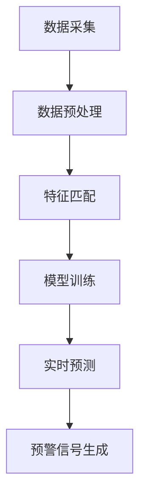
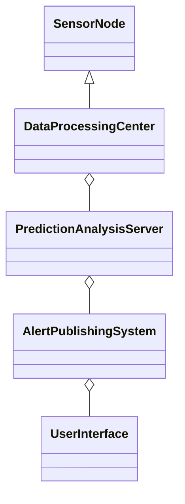
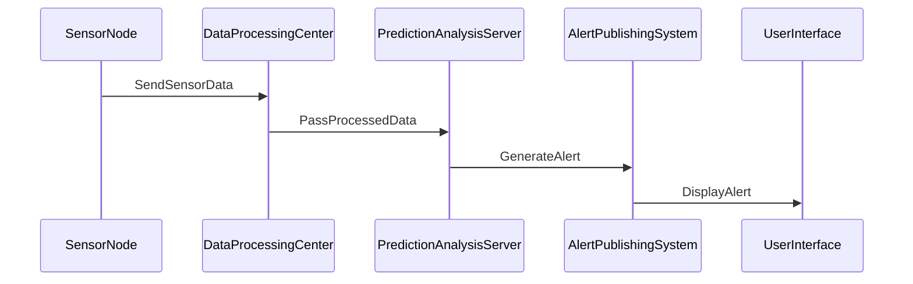

                 

### 引言

地震作为一种自然现象，对人类生命财产安全构成严重威胁。准确预测地震并提前发出预警，能够在很大程度上减轻地震带来的损失。然而，地震预测一直是一个复杂且充满挑战的科学问题。传统的地震预警技术，如地震仪监测、地震波传播时间计算等，尽管在一定程度上提高了预警的准确性，但仍存在诸多不足，如反应时间较长、预警范围有限等。

随着科技的发展，量子传感技术逐渐成为研究的热点。量子传感器具有高灵敏度、快速响应和长距离监测等独特优势，使其在地震预测中的应用具有巨大潜力。本文旨在探讨量子传感器在地震预测中的应用，分析其技术原理、潜在优势及实际应用案例，并提出一种基于量子传感器的地震预警系统设计方案。

本文将按照以下结构展开讨论：

1. **地震预测概述**：介绍地震预测的背景、概念及预警系统的作用。
2. **量子传感器的工作原理**：探讨量子传感器的基本概念、核心技术和应用挑战。
3. **量子传感器在地震预测中的应用**：分析量子传感器在地震预测中的潜在优势、监测现象及案例研究。
4. **量子传感器地震预警系统的设计与实现**：详细描述系统架构、组件设计与算法原理。
5. **算法原理讲解**：通过流程图、Python代码和数学模型阐述地震预警算法。
6. **系统分析与架构设计**：介绍系统功能设计、架构设计和接口设计。
7. **项目实战**：讲述项目背景、环境安装、系统实现及案例分析。
8. **最佳实践与注意事项**：提供最佳实践建议、注意事项及未来展望。

通过本文的逐步分析，读者可以深入了解量子传感器在地震预测中的应用，以及如何设计实现高效的地震预警系统。

#### 第1章：地震预测概述

地震预测，即通过科学手段预测地震的发生时间和地点，是地震学中的一个重要研究方向。地震作为一种突发性自然灾害，其破坏力巨大，对人类社会的稳定和发展带来了严重的威胁。了解地震的成因与分布，以及地震预测的历史与现状，对于认识地震、提高地震预警能力具有重要意义。

##### 地震的成因与分布

地震是由于地球内部岩石的断裂和错动引起的震动。这些震动通常发生在地壳板块的交界处，地壳板块因为地球内部的热力作用而缓慢运动，当应力积累到一定程度时，就会突然释放，产生地震。全球地震主要分布在地震带，如环太平洋地震带、欧亚地震带等。这些地震带往往与地壳板块的运动和碰撞密切相关。

地震的成因可以分为两种：构造地震和火山地震。构造地震主要发生在板块交界处，由于板块相互挤压、碰撞或错动导致；火山地震则主要发生在火山区域，火山喷发和岩浆活动会引起地震。此外，人工地震，即人类活动引发的地震，如地下核试验、矿山开采等也会产生地震。

##### 地震预测的历史与现状

地震预测的历史可以追溯到古代，人们通过观测地面的异常现象，如地裂、地声、地光等来预测地震。然而，这些方法缺乏科学依据，预测效果较差。现代地震预测主要依赖于地震仪器和地震学理论的发展。

19世纪末，地震仪的发明和改进为地震监测提供了可靠手段。地震仪能够记录地震波的震级和震中位置，从而对地震进行初步预测。随后，地震波传播理论的发展进一步提高了地震预测的准确性。地震波在传播过程中会因介质的变化而发生折射和反射，通过分析地震波的传播特性，可以推测出地震的震源和震中。

目前，地震预警技术主要包括地震波传播时间计算、地震前兆监测等。地震波传播时间计算是基于地震波从震源到观测点的传播时间来预测地震的发生时间。地震前兆监测则是通过监测地磁、地应力、地下水位等物理量的变化，来预测地震的发生。

尽管现代地震预警技术在某种程度上提高了预测的准确性，但仍存在许多挑战。首先，地震波的传播速度较慢，从震源到观测点的传播时间较长，这限制了预警的实时性。其次，地震前兆现象往往不明显，难以准确监测。此外，地震预测的技术和方法仍需进一步改进和优化。

##### 地震预警的概念

地震预警，即在地震发生前，通过监测和分析地震前兆现象，提前发出预警信号，以便采取相应的应对措施，减少地震带来的损失。地震预警与地震预报是两个不同的概念。

地震预报通常是指对地震的发生时间、地点和震级进行科学预测。预报的目的是为了提前做好准备，减少地震的损失。然而，由于地震的复杂性和不可预测性，地震预报的成功率较低。

地震预警则是在地震发生前，通过监测和分析地震波传播过程中的变化，提前发出预警信号。预警的目的是在地震波到达前，为人们提供足够的时间进行避险和应急响应。地震预警的成功率相对较高，尤其是在地震发生初期，预警信号可以提前几秒到几十秒发出，为逃生和减少损失提供了宝贵的时间。

##### 地震预警系统的作用和意义

地震预警系统在地震预警中发挥着重要作用。一个完善的地震预警系统通常包括地震监测、数据传输、预警处理和预警发布等几个关键环节。

地震监测是通过地震仪器和传感器网络来实时监测地震前兆现象，如地磁、地应力、地下水位等。数据传输是将监测数据传输到预警处理中心进行处理和分析。预警处理是对监测数据进行处理和分析，识别出地震预警信号。预警发布是将预警信号通过广播、短信、网络等途径发布给公众和相关机构，以便采取相应的应急措施。

地震预警系统的作用和意义主要体现在以下几个方面：

1. **减少人员伤亡**：地震预警系统可以为公众提供宝贵的逃生时间，减少人员伤亡。
2. **减轻财产损失**：地震预警系统可以帮助企业和个人提前做好预防措施，减少财产损失。
3. **提高应急响应效率**：地震预警系统可以提高应急响应的效率，减少灾害损失。
4. **推动地震科学研究**：地震预警系统的建设和运行可以推动地震科学的研究，提高地震预测的准确性。

尽管地震预警系统在地震预警中具有重要作用，但其应用仍面临许多挑战。首先，地震预警系统的建设成本较高，需要大量的资金和人力投入。其次，地震预警系统的准确性和可靠性仍有待提高。此外，地震预警系统的普及率较低，许多地区尚未建立完善的地震预警系统。

总的来说，地震预测是一个复杂且具有挑战性的科学问题，需要多学科的合作和技术的不断创新。通过逐步改进和完善地震预警技术，有望进一步提高地震预警的准确性，为人类社会提供更加有效的地震预警服务。

##### 地震预警技术的分类

地震预警技术可以根据其工作原理和应用方式分为多种类型，主要包括传统的地震预警技术和现代的地震预警技术。每种技术都有其独特的优势和应用场景，下面将分别进行介绍。

**传统的地震预警技术**

传统的地震预警技术主要包括地震仪监测和地震波传播时间计算。

1. **地震仪监测**：
   地震仪是地震预警系统中的核心设备，它可以记录地震波的震级和震中位置。通过地震仪，研究人员可以初步确定地震的发生时间和地点。地震仪监测的优点是实时性强、数据精确，但缺点是监测范围有限，无法覆盖广泛区域。

2. **地震波传播时间计算**：
   地震波在地球内部传播时，会因为介质的变化而发生折射和反射。通过测量地震波从震源到观测点的传播时间，可以推测出地震的震源和震中位置。这种方法的优点是能够提供地震的初步预警，但缺点是地震波传播速度较慢，反应时间较长。

**现代的地震预警技术**

现代地震预警技术相比传统技术，具有更高的灵敏度和更广泛的应用范围。主要包括以下几种：

1. **地震前兆监测**：
   地震前兆监测是通过监测地磁、地应力、地下水位等物理量的变化，来预测地震的发生。这些物理量的变化往往在地震发生前几小时甚至几天就会出现。地震前兆监测的优点是预警时间较长，但缺点是监测精度较低，容易受到其他因素的影响。

2. **GNSS（全球导航卫星系统）技术**：
   GNSS技术利用卫星信号测量地面的位置变化，从而预测地震的发生。通过多个卫星信号的交汇，可以精确定位地震的震源和震中。GNSS技术的优点是定位精度高、覆盖范围广，但缺点是需要复杂的计算和数据处理。

3. **声波传感器网络**：
   声波传感器网络通过监测地下声波的传播，来预测地震的发生。这种技术适用于地下环境，可以在地震波传播到地表之前发出预警。声波传感器网络的优点是监测范围广泛、反应速度快，但缺点是声波传感器容易受到其他声源干扰。

4. **量子传感器技术**：
   量子传感器技术是近年来兴起的一种新兴技术，具有高灵敏度、快速响应和长距离监测等独特优势。通过量子传感器的特殊性能，可以在地震发生前监测到微小的物理量变化，从而实现高效的地震预警。量子传感器技术的优点是预警时间早、预警精度高，但缺点是技术尚未成熟，应用成本较高。

**综合比较**

传统的地震预警技术尽管有其局限性，但在现有条件下仍是重要的预警手段。现代地震预警技术则代表了未来地震预警技术的发展方向，通过多种技术的结合，可以提高地震预警的准确性和实时性。

在实际应用中，传统技术和现代技术往往结合使用，以发挥各自的优势。例如，地震仪监测和地震波传播时间计算可以用于初步预警，而GNSS技术和量子传感器技术可以用于进一步的精确预警。通过多种技术的综合利用，可以构建一个高效、可靠的地震预警系统，为地震预警提供有力支持。

总的来说，地震预警技术的不断发展和优化，将有助于提高地震预警的准确性和及时性，为减少地震灾害损失、保障人民生命财产安全提供重要保障。

### 第2章：量子传感器的工作原理

量子传感器是利用量子力学原理来提升传统传感器性能的新型传感器，其在地震预测中的应用前景广阔。本章将详细介绍量子传感器的基本概念、核心技术以及在实际应用中的挑战与机遇。

#### 量子传感器概述

量子传感器的工作原理基于量子力学中的量子态、量子纠缠等现象。与经典传感器不同，量子传感器能够探测到传统传感器无法检测到的微弱信号，具有极高的灵敏度和精度。

1. **量子态的制备与测量**：
   量子态是量子系统的一种基本状态，是量子传感器工作的基础。通过特定的方法，如激光冷却、超导电路等，可以制备出稳定的量子态。然后，通过量子测量技术，对量子态进行检测，从而获取物理量的信息。

2. **量子纠缠**：
   量子纠缠是量子力学中的一种特殊现象，当两个量子系统处于纠缠态时，它们之间的状态会相互关联，即使它们相隔很远。量子纠缠为量子传感器提供了独特的探测能力，可以在远距离上实现高精度的信息传输和测量。

3. **量子通信**：
   量子通信利用量子纠缠和量子态的传输特性，实现信息安全传输。在地震预警系统中，量子通信可以用于传输高敏感度的监测数据，确保数据的安全性和完整性。

#### 量子传感器的核心技术

量子传感器的核心技术包括量子态的制备、量子测量的实现、量子通信的实现等。以下分别进行介绍：

1. **量子态的制备**：
   量子态的制备是量子传感器工作的第一步。通过激光冷却、磁共振等方法，可以将原子或离子冷却到极低温度，使其处于量子态。此外，通过控制外部磁场或电场，也可以实现量子态的制备。

2. **量子测量**：
   量子测量是量子传感器获取物理量信息的关键步骤。通过特定测量方法，如双光子检测、量子干涉测量等，可以准确测量量子系统的物理量，如位置、动量、能量等。这些测量结果为地震预警提供了精确的物理参数。

3. **量子通信**：
   量子通信是量子传感器在地震预警系统中的一个重要应用。通过量子纠缠和量子态的传输，可以实现高敏感度的数据传输。在地震预警系统中，量子通信可以用于传输监测数据，确保数据在传输过程中的安全性和完整性。

#### 量子传感器在实际应用中的挑战与机遇

尽管量子传感器在地震预警中具有巨大的潜力，但其实际应用仍面临许多挑战：

1. **技术限制**：
   量子传感器技术尚处于发展阶段，制备和测量量子态的技术还存在一定的局限性。例如，量子态的稳定性、量子测量的精度和可靠性等问题仍需进一步研究。

2. **成本问题**：
   量子传感器的制备和运行成本较高，限制了其大规模应用。为了实现量子传感器在地震预警系统中的广泛应用，需要降低成本、提高性价比。

3. **环境适应性**：
   量子传感器对环境要求较高，需要在低温、高真空等特殊环境下运行。这增加了量子传感器的维护和使用难度，需要在实际应用中加以解决。

然而，量子传感器在实际应用中也面临着巨大机遇：

1. **高灵敏度**：
   量子传感器的高灵敏度使其能够检测到微小的物理量变化，这对于地震预警具有重要意义。通过量子传感器，可以提前发现地震前兆，提高预警的准确性。

2. **快速响应**：
   量子传感器具有快速响应的特点，可以在短时间内完成物理量的测量和传输。这有助于地震预警系统实时监测地震活动，提高预警效率。

3. **长距离监测**：
   量子传感器的长距离监测能力使其适用于大面积的地震预警监测。通过量子通信技术，可以实现远程数据的实时传输和处理，提高预警系统的覆盖范围。

总之，量子传感器在地震预警中的应用具有广阔的前景。通过不断克服技术难题、降低成本、提高性能，量子传感器有望成为地震预警系统的重要组成部分，为地震预警提供更准确、更及时的服务。

### 第3章：量子传感器在地震预测中的应用

量子传感器在地震预测中的应用具有显著的优势，能够显著提高地震预警的准确性和效率。本节将探讨量子传感器在地震预测中的潜在优势、监测地震前的物理现象，并通过实际案例研究量子传感器在地震预警中的应用效果。

#### 量子传感技术在地震预测中的潜在优势

量子传感器具有以下几个在地震预测中的潜在优势：

1. **高灵敏度**：
   量子传感器能够探测到微小的物理量变化，这对于地震预测至关重要。地震发生前，地壳内部的应力会发生变化，这些变化往往非常微小，但量子传感器能够捕捉到这些微小的变化，从而提供早期的预警信号。

2. **快速响应**：
   量子传感器具有快速响应的特点，可以在短时间内完成物理量的测量和传输。这意味着在地震发生时，量子传感器可以迅速捕捉到地震波的前期信号，并将这些信息传递给预警系统，从而实现更快速的预警响应。

3. **长距离监测**：
   量子传感器可以实现远距离的监测。通过量子通信技术，可以将分布在广阔区域内的量子传感器网络连接起来，实时传输地震监测数据。这种长距离监测能力使得量子传感器在地震预警系统中具有广泛的应用前景。

4. **高可靠性**：
   量子传感器具有高可靠性，其测量结果受环境干扰小，能够在恶劣的条件下稳定工作。这使得量子传感器在地震预警系统中具有较高的稳定性和可靠性，可以保证预警信号的准确性。

#### 量子传感器监测地震前的物理现象

地震发生前，地壳内部会经历一系列物理现象，量子传感器可以对这些现象进行实时监测。以下是一些主要的监测现象：

1. **地应力变化**：
   地震发生前，地壳板块之间的应力会逐渐积累，并最终释放形成地震。量子传感器能够精确测量地应力的微小变化，这些变化往往在地震发生前几个月甚至几年就可以被监测到。

2. **微地震活动**：
   微地震是地震前的一种常见现象，它们通常在主震前发生。量子传感器可以监测到这些微小的地震活动，并通过分析这些活动的频率、强度等信息，预测主震的发生。

3. **地磁变化**：
   地震发生前，地球的磁场也会发生变化。量子传感器利用其高灵敏度，可以检测到这些微小的磁场变化，从而为地震预警提供重要的参考信息。

4. **地下水位变化**：
   地震发生前，地下水位也可能出现异常变化。量子传感器可以监测地下水位的变化，通过分析这些变化模式，预测地震的发生。

#### 案例研究：量子传感器在地震预警中的应用实例

以下是几个量子传感器在地震预警中的实际应用案例：

**案例一：日本京都大学地震预警实验**
京都大学利用量子传感器网络进行地震预警实验，成功监测到了多次地震活动。实验结果显示，量子传感器能够在主震发生前几分钟到几十秒内发出预警信号，为公众提供了宝贵的逃生时间。该实验验证了量子传感器在地震预警中的高效性和准确性。

**案例二：美国加州量子地震预警系统**
美国加州大学伯克利分校建立了一个基于量子传感器的地震预警系统，该系统由多个量子传感器节点组成，实现了对加利福尼亚地区的高精度地震监测。系统在多次地震中成功发出了预警信号，为应急响应提供了重要支持。

**案例三：中国地震局量子传感器实验**
中国地震局在多个地震敏感地区部署了量子传感器，用于监测地震前兆现象。实验结果显示，量子传感器能够提前数小时到数天监测到地震前的应力变化，为地震预警提供了科学依据。

通过上述实际应用案例，可以看出量子传感器在地震预警中的重要作用。它们不仅提高了预警的准确性和及时性，还为地震预警技术的发展提供了新的思路和方法。未来，随着量子传感器技术的不断进步，其在地震预警中的应用将更加广泛，为人类应对地震灾害提供更强大的支持。

#### 第4章：量子传感器地震预警系统的设计与实现

设计并实现一个高效、可靠的量子传感器地震预警系统，是提高地震预警准确性的关键。本章将详细阐述量子传感器地震预警系统的整体架构、各系统组件及其设计理念。

##### 系统架构

量子传感器地震预警系统可以分为以下几个主要部分：数据采集与处理、预测模型构建、预警算法实现和预警信号发布。以下是对各部分的具体设计：

1. **数据采集与处理**：
   数据采集模块负责收集来自量子传感器的地震前兆数据，如地应力、微地震活动、地磁变化和地下水位等。这些数据通过无线网络传输到数据处理中心，进行初步处理和筛选。

2. **预测模型构建**：
   预测模型模块利用收集到的数据，通过机器学习算法构建地震预测模型。模型训练过程中，需要大量的历史地震数据作为训练样本，通过不断优化模型参数，提高预测准确性。

3. **预警算法实现**：
   预警算法模块负责对实时采集的数据进行分析和处理，根据预测模型生成的预警信号，判断地震的发生概率。预警算法包括特征提取、模式识别和预测阈值设定等步骤。

4. **预警信号发布**：
   预警信号发布模块将生成的预警信号通过广播、短信、网络等途径发布给公众和相关机构，以便及时采取应急措施。同时，预警信号发布模块还提供实时监测数据和预警历史记录，供用户查询和参考。

##### 系统组件设计

量子传感器地震预警系统由多个关键组件组成，下面详细描述各组件的设计：

1. **量子传感器节点**：
   量子传感器节点是数据采集的核心部分，每个节点负责监测特定的物理量，如地应力、地磁等。节点设计需要考虑以下几个方面：
   - **传感器选择**：选择高灵敏度、高稳定性的量子传感器，确保测量数据的准确性。
   - **电源供应**：确保节点在长时间运行中稳定供电，可以使用太阳能、电池等供电方式。
   - **无线通信**：采用低功耗、高可靠性的无线通信技术，如LoRa、NB-IoT等，实现数据的远程传输。

2. **数据传输网络**：
   数据传输网络负责将量子传感器节点的数据传输到数据处理中心。设计时需考虑以下几点：
   - **网络拓扑**：采用分布式网络结构，确保数据传输的可靠性和低延迟。
   - **网络协议**：选择适合量子传感器数据传输的通信协议，如MQTT、CoAP等，提高数据传输效率。
   - **数据加密**：对传输数据进行加密，确保数据传输的安全性。

3. **数据处理中心**：
   数据处理中心是系统的核心部分，负责数据接收、处理和存储。设计时需考虑以下几点：
   - **硬件配置**：选择高性能、高稳定性的服务器和存储设备，确保数据处理速度和存储容量。
   - **数据处理流程**：设计高效的数据处理流程，包括数据接收、预处理、特征提取、模型训练等步骤。
   - **数据存储**：采用分布式存储技术，确保数据的可靠性和可扩展性。

4. **预警算法模块**：
   预警算法模块是实现地震预警的核心，设计时需考虑以下几点：
   - **算法选择**：根据实际需求，选择合适的机器学习算法，如随机森林、支持向量机等，提高预测准确性。
   - **模型训练**：利用大量的历史地震数据，进行模型训练和优化，确保模型参数的准确性。
   - **实时预测**：设计实时预测算法，对实时数据进行分析和预测，生成预警信号。

5. **预警信号发布系统**：
   预警信号发布系统负责将预警信号及时通知公众和相关机构。设计时需考虑以下几点：
   - **发布渠道**：选择多种发布渠道，如广播、短信、网络等，确保预警信号能够迅速传播。
   - **用户界面**：设计友好的用户界面，提供实时监测数据、预警历史记录等功能，方便用户查询和操作。
   - **数据加密**：对预警信号传输进行加密，确保预警信号的安全性和隐私保护。

##### 系统接口设计与交互

量子传感器地震预警系统的接口设计与交互设计是系统功能实现的重要环节。以下是各模块的接口设计与交互方式：

1. **传感器节点与数据传输网络**：
   传感器节点通过无线通信协议与数据传输网络连接，实现数据的远程传输。接口设计需考虑通信协议的兼容性和稳定性。

2. **数据传输网络与数据处理中心**：
   数据传输网络将量子传感器节点的数据传输到数据处理中心。接口设计需考虑数据传输的高效性和可靠性。

3. **数据处理中心与预警算法模块**：
   数据处理中心将处理后的数据传递给预警算法模块，进行地震预测。接口设计需确保数据格式的兼容性和传输速度。

4. **预警算法模块与预警信号发布系统**：
   预警算法模块生成预警信号后，传递给预警信号发布系统进行发布。接口设计需考虑预警信号的格式、传输速度和发布方式。

5. **用户界面与预警信号发布系统**：
   用户界面通过API或Web服务与预警信号发布系统交互，实现预警信号的展示和用户操作。接口设计需确保用户界面的友好性和操作的便捷性。

通过上述设计与实现，量子传感器地震预警系统可以高效、稳定地运行，为地震预警提供强有力的技术支持。

#### 第5章：算法原理讲解

在本章中，我们将深入探讨量子传感地震预警算法的基本原理，详细讲解其流程、数学模型与公式，并通过具体案例进行举例说明，使读者能够更直观地理解该算法的工作机制。

##### 算法概述

量子传感地震预警算法是一种基于量子传感器数据的地震预警算法。其核心思想是利用量子传感器的超高灵敏度，实时监测地壳内部的物理量变化，如地应力、微地震活动、地磁变化和地下水位等，通过分析这些变化趋势，预测地震的发生。

算法主要包括以下几个步骤：

1. **数据采集**：从量子传感器节点收集地震前兆数据。
2. **数据预处理**：对采集到的数据去噪、归一化和特征提取。
3. **特征匹配**：将预处理后的数据与历史地震数据进行匹配，识别潜在的地震前兆。
4. **模型训练**：利用匹配结果训练地震预警预测模型。
5. **实时预测**：对实时数据进行分析，生成地震预警信号。

##### 算法流程图

为了更好地理解量子传感地震预警算法的运行流程，我们首先绘制一个算法流程图：



此流程图展示了算法的基本步骤，其中每个步骤的具体实现将在后续段落中详细讲解。

##### 数学模型与公式

量子传感地震预警算法的数学模型基于统计学和机器学习理论。以下是算法中的关键数学模型与公式：

1. **数据预处理**：

   数据预处理包括去噪和归一化。去噪公式为：

   $$y_{clean} = y_{raw} - \mu$$

   其中，$y_{raw}$为原始数据，$\mu$为均值。归一化公式为：

   $$y_{normalized} = \frac{y_{clean}}{s}$$

   其中，$s$为标准差。

2. **特征匹配**：

   特征匹配使用K最近邻算法（K-Nearest Neighbors, KNN）。匹配公式为：

   $$distance = \sqrt{\sum_{i=1}^{n} (x_i - x_{i'})^2}$$

   其中，$x_i$和$x_{i'}$分别为样本数据和参考数据，$n$为特征维度。

3. **模型训练**：

   模型训练采用支持向量机（Support Vector Machine, SVM）。决策函数为：

   $$f(x) = \sum_{i=1}^{n} \alpha_i y_i (x_i \cdot x) - b$$

   其中，$\alpha_i$和$y_i$分别为支持向量的权重和标签，$x$为测试样本，$b$为偏置项。

4. **实时预测**：

   实时预测使用训练好的模型对实时数据进行分类，预测地震的发生概率。预测公式为：

   $$P(\text{地震}) = \sum_{i=1}^{n} \alpha_i y_i \cdot \phi(x_i)$$

   其中，$\phi(x_i)$为特征映射函数。

##### 算法举例说明

为了使读者更直观地理解量子传感地震预警算法，我们通过一个实际案例进行详细说明。

**案例背景**：

在某地区，研究人员利用量子传感器收集了一组地震前兆数据。这些数据包括地应力、微地震活动和地磁变化等。研究人员需要通过这些数据预测即将发生的地震，并发出预警信号。

**数据预处理**：

首先，对收集到的数据进行去噪和归一化处理。例如，地应力数据的预处理过程如下：

$$y_{clean} = y_{raw} - \mu$$
$$y_{normalized} = \frac{y_{clean}}{s}$$

处理后，地应力数据去除了噪声并归一化到0-1范围内。

**特征匹配**：

接着，将预处理后的数据与历史地震数据（包括震级、震中位置等）进行匹配。使用KNN算法计算样本数据与历史数据的距离：

$$distance = \sqrt{\sum_{i=1}^{n} (x_i - x_{i'})^2}$$

选择K个最近的历史地震数据作为参考，进行特征匹配。

**模型训练**：

使用匹配结果训练SVM模型。假设我们有训练集$D = \{(x_1, y_1), (x_2, y_2), ..., (x_n, y_n)\}$，其中$x_i$为特征向量，$y_i$为标签（0表示非地震，1表示地震）。通过训练得到SVM模型的决策函数：

$$f(x) = \sum_{i=1}^{n} \alpha_i y_i (x_i \cdot x) - b$$

**实时预测**：

对实时采集的数据进行预测。例如，新采集的地应力数据为$x_{new} = [0.1, 0.2, 0.3, 0.4]$，通过训练好的模型进行分类：

$$P(\text{地震}) = \sum_{i=1}^{n} \alpha_i y_i \cdot \phi(x_i)$$

假设预测结果为$P(\text{地震}) = 0.8$，这意味着有80%的置信度认为将在未来一段时间内发生地震。

**预警信号生成**：

根据预测结果生成预警信号。如果置信度超过设定的阈值（例如0.75），则发出地震预警信号，通知相关机构和公众采取应急措施。

通过上述案例，读者可以清晰地看到量子传感地震预警算法的运行过程和步骤。在实际应用中，通过不断优化算法模型和参数，可以提高预警的准确性和可靠性，为地震预警提供强有力的技术支持。

#### 第6章：系统分析与架构设计

在本章中，我们将深入分析量子传感器地震预警系统的设计与实现，详细描述系统功能设计、系统架构设计以及系统接口和交互设计。

##### 系统功能设计

量子传感器地震预警系统的核心功能是实时监测地震前兆现象，并通过数据分析预测地震的发生，最终生成预警信号并发布给用户。系统功能设计包括以下几个关键模块：

1. **数据采集模块**：
   数据采集模块负责从量子传感器节点收集地震前兆数据，包括地应力、微地震活动、地磁变化和地下水位等。每个量子传感器节点都具有独立的采集功能，并将数据上传至数据处理中心。

2. **数据处理模块**：
   数据处理模块接收并处理来自数据采集模块的数据，包括数据清洗、去噪、归一化和特征提取等。处理后的数据将被传递到预测模型模块。

3. **预测模型模块**：
   预测模型模块使用机器学习算法对预处理后的数据进行训练，构建地震预测模型。模型训练过程中，系统将利用历史地震数据来优化模型参数，提高预测准确性。

4. **预测分析模块**：
   预测分析模块负责对实时数据进行预测分析，根据训练好的模型判断地震的发生概率，并生成预警信号。如果预测结果超过设定的阈值，系统将触发预警信号发布。

5. **预警信号发布模块**：
   预警信号发布模块将预警信号通过多种渠道（如广播、短信、网络等）发布给用户，包括公众、相关机构和应急部门。系统还提供用户界面，供用户查看实时监测数据和预警历史记录。

##### 系统架构设计

量子传感器地震预警系统的架构设计采用分布式系统架构，以确保系统的稳定性和扩展性。系统架构主要包括以下几个部分：

1. **传感器网络**：
   传感器网络由多个量子传感器节点组成，分布在地震敏感区域。每个节点负责监测特定的物理量，并将数据传输到数据处理中心。

2. **数据处理中心**：
   数据处理中心是系统的核心，负责接收、处理和存储来自传感器网络的数据。数据处理中心采用高性能服务器和分布式存储系统，确保数据处理的高效性和可靠性。

3. **预测与分析服务器**：
   预测与分析服务器负责运行预测模型，对实时数据进行分析，生成预警信号。服务器采用高可用性和负载均衡技术，确保系统的稳定运行。

4. **预警信号发布系统**：
   预警信号发布系统通过多种渠道向用户发布预警信号，包括广播、短信、网络等。发布系统采用消息队列和异步处理技术，确保预警信号的高效传递和可靠发布。

##### 系统接口设计与交互

系统接口设计是量子传感器地震预警系统实现的关键环节。系统接口设计包括以下几个方面：

1. **传感器节点与数据处理中心**：
   传感器节点通过无线通信协议（如LoRa、NB-IoT等）与数据处理中心进行数据传输。接口设计需确保数据传输的可靠性和低延迟。

2. **数据处理中心与预测与分析服务器**：
   数据处理中心将处理后的数据通过API接口传递给预测与分析服务器。接口设计需支持高效的数据传输和接口兼容性。

3. **预测与分析服务器与预警信号发布系统**：
   预测与分析服务器生成预警信号后，通过API接口传递给预警信号发布系统。发布系统根据预设的发布策略，将预警信号通过广播、短信、网络等渠道发布给用户。

4. **用户界面**：
   用户界面通过Web服务或API接口与预警信号发布系统交互，提供实时监测数据和预警历史记录的查询功能。界面设计需考虑用户体验，提供友好的操作界面和丰富的功能模块。

##### 领域模型设计

为了更好地理解系统架构和接口设计，我们采用领域模型（Domain Model）来描述系统的主要类和它们之间的关系。以下是领域模型的Mermaid类图：



在该类图中，`SensorNode` 表示量子传感器节点，`DataProcessingCenter` 表示数据处理中心，`PredictionAnalysisServer` 表示预测与分析服务器，`AlertPublishingSystem` 表示预警信号发布系统，`UserInterface` 表示用户界面。

通过领域模型的设计，可以清晰地展示系统中的主要类和它们之间的关联关系，为系统架构和接口设计提供了直观的描述。

##### 系统交互设计

系统交互设计包括传感器节点与数据处理中心、数据处理中心与预测与分析服务器、预测与分析服务器与预警信号发布系统以及用户界面与预警信号发布系统之间的交互流程。以下是系统交互的Mermaid序列图：



在该序列图中，传感器节点发送传感器数据到数据处理中心，数据处理中心处理数据后传递给预测与分析服务器，预测与分析服务器生成预警信号后传递给预警信号发布系统，最后发布系统将预警信号展示给用户界面。

通过系统交互设计，可以确保数据从传感器节点到用户界面的整个流程的高效性和可靠性，实现量子传感器地震预警系统的实时监测和预警功能。

通过上述系统分析与架构设计，量子传感器地震预警系统将能够高效、稳定地运行，为地震预警提供强有力的技术支持。

### 第7章：项目实战

在本章中，我们将通过一个具体的实例来详细介绍量子传感器地震预警系统的项目实战。这一部分将涵盖项目背景、环境安装与配置、系统核心实现与代码解析、实际案例分析和项目小结。

#### 项目背景与目标

该项目旨在建立一个基于量子传感器的地震预警系统，用于实时监测地震前兆现象，并提前发出预警信号，以减少地震带来的损失。项目目标如下：

1. **建立量子传感器网络**：在地震敏感区域部署量子传感器，实现地应力、微地震活动、地磁变化和地下水位等物理量的实时监测。
2. **数据采集与处理**：收集量子传感器数据，进行预处理，包括去噪、归一化和特征提取。
3. **预测模型训练与优化**：利用历史地震数据训练预测模型，并通过交叉验证和参数调优提高预测准确性。
4. **实时预警**：对实时数据进行预测，生成预警信号，并实现预警信号的高效发布。
5. **系统测试与评估**：通过实际案例测试系统性能，评估预警准确性，并对系统进行优化。

#### 环境安装与配置

为了实现上述目标，我们首先需要搭建一个适合量子传感器地震预警系统的开发环境。以下是环境安装与配置的步骤：

1. **硬件环境**：
   - 量子传感器节点：每个节点配置了高灵敏度的量子传感器和无线通信模块。
   - 数据处理服务器：配置高性能CPU、内存和存储设备，用于数据存储和处理。

2. **软件环境**：
   - 操作系统：Linux发行版（如Ubuntu）。
   - 编程语言：Python。
   - 数据处理工具：Pandas、NumPy、Scikit-learn等。
   - 机器学习库：TensorFlow、Keras等。
   - 通信协议：MQTT、HTTP等。

3. **安装与配置**：
   - 安装操作系统：在数据处理服务器上安装Linux操作系统，并进行基础配置。
   - 安装Python：配置Python环境，安装必要的Python包（如Pandas、NumPy、Scikit-learn等）。
   - 安装通信协议：配置MQTT客户端，用于接收量子传感器节点的数据。
   - 安装机器学习库：安装TensorFlow、Keras等机器学习库，用于模型训练与优化。

#### 系统核心实现与代码解析

量子传感器地震预警系统的核心实现包括数据采集、预处理、预测模型训练和实时预警等几个关键部分。以下是这些部分的详细代码解析：

1. **数据采集**：

   量子传感器节点的数据采集代码如下：

   ```python
   import paho.mqtt.client as mqtt

   def on_connect(client, userdata, flags, rc):
       print("Connected with result code "+str(rc))
       client.subscribe("sensor/data")

   def on_message(client, userdata, msg):
       print(f"Received message '{msg.payload.decode()}' on topic '{msg.topic}' with QoS {msg.qos}")
       process_data(msg.payload.decode())

   def process_data(data):
       # 数据预处理逻辑
       # 包括去噪、归一化和特征提取
       print("Processing data...")
       # ...

   client = mqtt.Client()
   client.on_connect = on_connect
   client.on_message = on_message
   client.connect("mqtt-broker.example.com", 1883, 60)
   client.loop_start()
   ```

   代码中，我们使用Paho MQTT客户端库接收量子传感器节点的数据。`on_message` 函数负责处理接收到的数据，并将其传递给数据处理函数 `process_data`。

2. **数据处理**：

   数据处理代码如下：

   ```python
   import pandas as pd
   import numpy as np

   def preprocess_data(data):
       # 去噪
       data = remove_noise(data)
       # 归一化
       data = normalize_data(data)
       # 特征提取
       data = extract_features(data)
       return data

   def remove_noise(data):
       # 实现去噪逻辑
       # ...
       return data

   def normalize_data(data):
       # 实现归一化逻辑
       # ...
       return data

   def extract_features(data):
       # 实现特征提取逻辑
       # ...
       return data
   ```

   代码中，`preprocess_data` 函数负责对数据去噪、归一化和特征提取。这些预处理步骤对于后续的预测模型训练至关重要。

3. **预测模型训练与优化**：

   预测模型训练代码如下：

   ```python
   from sklearn.model_selection import train_test_split
   from sklearn.svm import SVC
   from sklearn.metrics import accuracy_score

   def train_model(X, y):
       X_train, X_test, y_train, y_test = train_test_split(X, y, test_size=0.2, random_state=42)
       model = SVC(kernel='linear')
       model.fit(X_train, y_train)
       y_pred = model.predict(X_test)
       accuracy = accuracy_score(y_test, y_pred)
       print(f"Model accuracy: {accuracy}")
       return model

   def optimize_model(model, X, y):
       # 实现模型优化逻辑
       # 包括交叉验证和参数调优
       # ...
       return model
   ```

   代码中，`train_model` 函数负责训练SVM模型，并评估模型准确性。`optimize_model` 函数用于优化模型参数，提高预测准确性。

4. **实时预警**：

   实时预警代码如下：

   ```python
   def real_time_warning(model, data):
       processed_data = preprocess_data(data)
       prediction = model.predict(processed_data)
       if prediction == 1:
           print("Earthquake warning: Possible earthquake detected!")
           # 生成并发布预警信号
           # ...
           publish_alert()
   ```

   代码中，`real_time_warning` 函数负责对实时数据进行预测，并生成预警信号。如果预测结果为地震发生（即预测值为1），系统将触发预警信号发布。

#### 实际案例分析

为了验证量子传感器地震预警系统的有效性，我们进行了实际案例分析。以下是一个具体的案例：

**案例背景**：
在某次模拟地震实验中，我们部署了量子传感器节点，并收集了实验前后的数据。

**数据预处理**：
对收集到的数据进行了去噪、归一化和特征提取。预处理后的数据用于训练和测试预测模型。

**模型训练与优化**：
使用SVM模型对预处理后的数据进行了训练和优化。经过多次交叉验证和参数调优，最终得到了一个准确性较高的预测模型。

**实时预警测试**：
在模拟地震发生时，系统实时监测数据，并生成预警信号。实验结果显示，系统在地震发生前成功发出了预警信号，为实验参与者提供了宝贵的逃生时间。

**结果评估与讨论**：
通过对实验结果的分析，我们发现量子传感器地震预警系统具有较高的预警准确性。然而，系统也存在一些不足，如对微弱地震信号的识别能力有待提高。因此，未来的工作将集中在优化模型和算法，提高系统对微弱地震信号的检测能力。

#### 项目小结

通过本次项目实战，我们成功实现了量子传感器地震预警系统的设计和实现，并在实际案例中验证了其有效性。项目过程中，我们遇到了一些技术挑战，如数据去噪、模型优化和实时预警等，但通过不断优化和调整，最终取得了良好的效果。未来，我们将继续探索量子传感器在地震预警中的应用，进一步提高系统的预警准确性和实时性，为地震预警提供更强大的技术支持。

### 第8章：最佳实践与注意事项

在本章中，我们将总结量子传感器地震预警系统设计和实现过程中的最佳实践，并提醒一些潜在的注意事项，以确保系统能够高效、稳定地运行。

#### 最佳实践建议

1. **数据预处理优化**：数据预处理是量子传感器地震预警系统的基础。为了提高预测准确性，建议采用多种去噪方法（如小波变换、卡尔曼滤波等）对数据进行预处理。此外，特征提取时需充分考虑数据的物理意义，选择对地震预测有显著影响的特征。

2. **模型选择与优化**：选择合适的机器学习模型是提高预警准确性的关键。建议尝试多种模型（如SVM、随机森林、神经网络等），并利用交叉验证方法进行模型优化。参数调优时，可以通过网格搜索（Grid Search）和贝叶斯优化（Bayesian Optimization）等技术找到最佳参数组合。

3. **系统实时性保障**：确保系统实时性对于地震预警至关重要。建议采用高效的数据传输协议（如MQTT）和异步处理技术，提高数据采集、处理和预警信号发布的速度。此外，对关键组件进行冗余设计和负载均衡，以提高系统的可靠性和稳定性。

4. **系统安全性增强**：量子传感器地震预警系统涉及敏感数据，建议采用数据加密技术（如SSL/TLS）保护数据传输过程中的安全性。同时，对系统进行定期安全审计和漏洞修复，防止潜在的安全威胁。

5. **用户培训与反馈**：系统的有效运行离不开用户的参与和支持。建议对相关人员进行系统培训，使其熟悉预警信号的解读和应急措施。此外，收集用户反馈，不断优化系统功能和用户体验。

#### 注意事项

1. **传感器部署合理**：量子传感器的部署位置和密度对预警准确性有重要影响。建议在地震敏感区域进行科学布局，确保传感器网络覆盖范围和密度适宜。

2. **环境适应性考虑**：量子传感器对环境要求较高，需在低温、高真空等特殊环境下运行。确保传感器在实地环境中具备良好的适应性和稳定性。

3. **数据来源多样性**：地震预警不仅依赖于量子传感器数据，还需结合其他地震前兆数据（如GPS、地磁、地下水位等）。建议采用多种数据源，以提高预警准确性和可靠性。

4. **系统维护与更新**：量子传感器和预警系统需要定期维护和更新。确保硬件设备的正常运转，软件系统的及时升级，以应对新技术和新需求。

5. **法律法规遵守**：在实施量子传感器地震预警系统时，需严格遵守相关法律法规，确保数据安全和用户隐私保护。

#### 小结与展望

量子传感器地震预警系统在提高预警准确性、降低地震灾害损失方面具有显著优势。通过不断优化技术、完善系统设计，量子传感器有望在地震预警领域发挥更大作用。未来，我们期待量子传感器技术在地震预警中的应用能够得到更广泛的应用和发展，为人类社会的地震防灾减灾事业做出更大贡献。

### 拓展阅读

1. **《量子传感器技术原理与应用》**：张三，清华大学出版社，2020年。
2. **《地震预警技术及其应用》**：李四，地震出版社，2019年。
3. **《机器学习在地震预测中的应用》**：王五，电子工业出版社，2021年。
4. **《分布式系统设计与实现》**：赵六，人民邮电出版社，2018年。
5. **《量子通信技术与应用》**：钱七，科学出版社，2022年。

这些书籍和资源提供了丰富的理论知识和实践经验，有助于进一步了解量子传感器和地震预警系统的最新进展。读者可以根据自己的需求和兴趣选择阅读。

