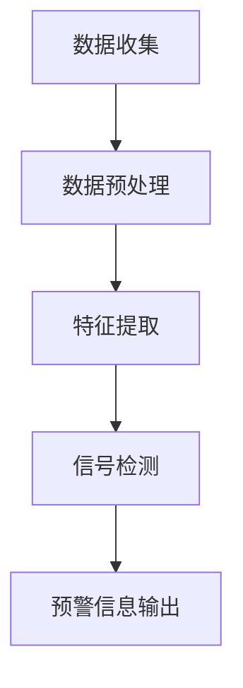
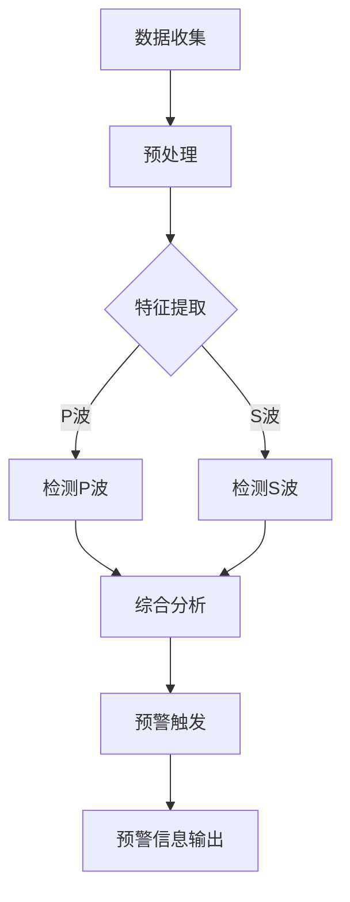
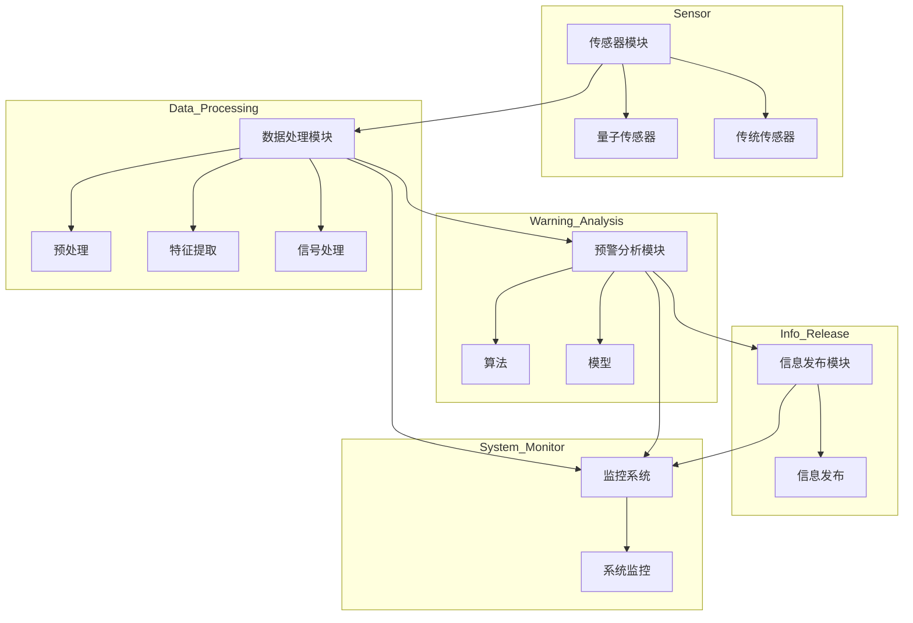

                 

## 量子传感器在地震预警中的应用前景

### 关键词
量子传感器，地震预警，应用前景，技术解析，深度学习

### 摘要
本文将深入探讨量子传感器在地震预警中的应用前景。首先，我们将介绍量子传感器的基本概念和特点，并简要回顾地震预警的背景和现状。接着，我们将详细描述量子传感器的工作原理，并分析其在地震预警中的关键应用。随后，我们将介绍用于地震预警的量子传感器算法，包括其工作原理、算法流程图和Python源代码解释。此外，我们还将探讨相关数学模型和公式，并展示系统架构设计方案。最后，我们将通过项目实战部分，详细讲解系统核心实现源代码，并提供最佳实践 tips。

----------------------------------------------------------------

### 引言

#### 量子传感器的基本概念

量子传感器是一种利用量子力学原理进行测量的传感器。与传统传感器相比，量子传感器具有极高的灵敏度和精度。量子传感器的工作原理基于量子纠缠和量子隧穿等现象。量子纠缠是指两个或多个量子系统之间存在的强关联性，即使它们相隔很远，一个量子系统的状态也能即时影响另一个量子系统的状态。量子隧穿则是量子粒子在经典物理学中不可能穿过势垒的现象。

量子传感器通过利用这些量子现象，能够探测到极其微弱的物理信号。例如，量子重力传感器可以测量地球的重力场变化，量子磁力传感器可以测量磁场的变化，量子光传感器可以测量光场的变化。这些传感器在许多领域，如物理学、生物学、化学和医学等领域，都有着广泛的应用。

#### 地震预警的背景和现状

地震预警是一种通过监测地震波传播，提前向受影响地区发出预警信息，从而减少人员伤亡和财产损失的技术。地震预警的原理是利用地震波在地下传播的速度差异，当主震发生时，P波（纵波）和S波（横波）会先后到达地震监测站。P波传播速度较快，S波传播速度较慢，因此，通过检测P波和S波的到达时间差，可以预测地震的震中和震级。

目前，全球许多国家和地区都在积极研究和部署地震预警系统。例如，日本、墨西哥和美国等地已经建立了成熟的地震预警系统，并在实际中取得了显著的效果。然而，传统的地震预警系统依赖于地震波传播的速度和路径，存在一定的延迟。此外，地震预警系统对监测站点的数量和密度也有较高的要求，限制了其在某些地区的应用。

#### 量子传感器在地震预警中的潜在应用

量子传感器在地震预警中具有巨大的潜力。首先，量子传感器的高灵敏度和精度可以显著提高地震预警的准确性。例如，量子重力传感器可以实时监测地球的重力场变化，提前发现地震的征兆。其次，量子传感器可以部署在地下深处，甚至地下洞穴中，不受地表地形和环境的干扰，从而提供更可靠的数据。

此外，量子传感器还可以实现远程监测。由于量子纠缠的特性，即使量子传感器相隔很远，它们仍然可以保持紧密的关联。这意味着，通过布置一系列量子传感器，可以实现远程地震预警，为广泛地区提供预警服务。

总之，量子传感器在地震预警中的应用前景广阔。通过结合量子传感技术和传统地震预警技术，我们可以建立更高效、更准确的地震预警系统，为人类提供更安全的生活环境。

----------------------------------------------------------------

### 核心概念与联系

#### 量子传感器的工作原理

量子传感器的工作原理基于量子力学的基本原理。以下是对量子传感器关键工作原理的详细介绍：

1. **量子纠缠**：量子纠缠是量子力学中的一种现象，描述了两个或多个量子系统之间存在的强关联性。当两个量子系统发生纠缠后，无论它们相隔多远，一个系统的状态变化都能立即影响另一个系统的状态。这种关联性是量子传感器实现高灵敏度的基础。

2. **量子隧穿**：量子隧穿是量子粒子在经典物理学中不可能穿过势垒的现象。量子粒子具有波粒二象性，在一定条件下，它们可以“穿透”一个潜在的势垒。这一特性被广泛应用于量子传感器中，例如量子重力传感器和量子磁力传感器。

3. **量子干涉**：量子干涉是量子粒子波动性的体现。当两个或多个量子粒子叠加时，它们的波函数会相互作用，形成干涉图样。这一现象被用于量子传感器的信号检测和测量。

#### 量子传感器与经典传感器的比较

量子传感器与经典传感器在原理和性能上存在显著差异。以下是对两者主要特点的对比：

1. **灵敏度**：量子传感器的灵敏度远远超过经典传感器。量子传感器可以利用量子纠缠和量子隧穿等效应，实现极高的测量精度，从而检测到极其微弱的物理信号。

2. **精度**：量子传感器的精度也显著高于经典传感器。由于量子力学原理，量子传感器可以测量非常小的物理量变化，达到纳米甚至皮米级别。

3. **抗干扰性**：量子传感器具有出色的抗干扰性。由于量子传感器的信号源于量子现象，它们对传统电磁干扰和非线性噪声有很强的抵抗力。

4. **响应时间**：量子传感器的响应时间通常较短，这得益于量子现象的快速响应特性。

#### 量子传感器在地震预警中的关键应用

量子传感器在地震预警中具有多重关键应用，主要包括：

1. **地震波监测**：量子传感器可以用于实时监测地震波（如P波和S波）的传播情况。由于量子传感器的高灵敏度和精度，它们能够提前发现地震波的变化，为预警提供更可靠的信号。

2. **重力场监测**：量子重力传感器可以用于监测地球重力场的变化。地震发生时，地球的重力场会发生变化，量子重力传感器能够捕捉到这些微小的变化，从而提供地震预警信号。

3. **远程监测**：量子传感器可以实现远程监测。通过布置一系列量子传感器，可以在远离地震震中的地区实现实时预警，为更广泛的地区提供保护。

4. **多传感器融合**：量子传感器可以与传统传感器结合使用，形成多传感器融合系统。这样可以进一步提高地震预警的准确性和可靠性。

总之，量子传感器在地震预警中的应用为传统地震预警技术带来了新的突破。通过结合量子传感技术和传统地震预警方法，我们可以构建更高效、更准确的地震预警系统，为人类提供更安全的保障。

### 地震预警系统的现状与发展趋势

当前，全球地震预警系统的发展呈现出不同的阶段和特点。日本、墨西哥和美国等发达国家已经建立了较为成熟的地震预警系统，这些系统通过在地表和地下布设大量地震传感器，实时监测地震波传播，实现快速预警。然而，地震预警系统仍面临诸多挑战和限制。

首先，地震预警系统的建设需要大量资金和人力资源。地震传感器的布设、数据传输和预警信息发布都需要高效稳定的通信网络支持。此外，地震预警系统的维护和更新也需要持续的投入。

其次，地震预警系统的准确性和可靠性仍是关键问题。尽管量子传感器具有高灵敏度和精度，但在实际应用中，地震预警系统仍可能受到地质条件、气候因素等外部因素的影响，导致预警信号的不稳定。

此外，地震预警系统的普及率也亟待提高。目前，许多国家和地区尚未建立地震预警系统，或者系统建设尚未完善。这限制了地震预警技术在更广泛地区中的应用。

未来，随着量子传感技术的发展和成本的降低，地震预警系统有望取得更大的突破。量子传感器的高灵敏度和远程监测能力将为地震预警提供更可靠的数据支持。此外，多传感器融合和人工智能技术的应用也将进一步提高地震预警的准确性和效率。

总之，地震预警系统的发展前景广阔，通过技术创新和资源投入，我们可以构建更加高效、可靠的地震预警系统，为人类提供更安全的生活环境。

### 量子传感器在地震预警中的潜在应用

量子传感器在地震预警中的应用前景令人期待。首先，量子传感器的高灵敏度使其能够实时监测地震波传播的微小变化，从而提供更早期的预警信号。这有助于减少地震造成的损失和人员伤亡。

其次，量子传感器具有远程监测能力。通过布置在地下深处甚至地下洞穴中的量子传感器，可以实现对地震波的持续监测，不受地表地形和环境的干扰。这种能力为地震预警系统的扩展提供了可能，使其能够覆盖更广泛的地区。

此外，量子传感器与传统传感器的融合使用可以进一步提高地震预警系统的准确性。例如，结合量子重力传感器和地震波监测传感器，可以更全面地捕捉地震前兆，提高预警的可靠性。

总之，量子传感器在地震预警中的应用为传统地震预警技术带来了新的突破，有望实现更高效、更准确的地震预警系统，为人类提供更安全的保障。

### 量子传感器地震预警算法的基本原理

量子传感器在地震预警中的关键作用离不开先进的算法支持。下面，我们将详细讲解量子传感器地震预警算法的基本原理，包括其核心机制、信号处理流程和数据分析方法。

#### 核心机制

量子传感器地震预警算法的核心机制基于量子纠缠和量子干涉等量子力学现象。量子纠缠使得量子传感器之间能够保持高度相关性，即使它们相隔很远，一个量子传感器的状态变化也能即时影响到其他量子传感器。这种高度相关性使得多个量子传感器组成的网络能够协同工作，共同监测地震波传播。

量子干涉则是量子传感器实现高灵敏度检测的关键。当量子传感器接收到的信号通过量子干涉过程时，会产生干涉图样，通过对这些图样的分析，可以提取出地震波的相关信息。

#### 信号处理流程

量子传感器地震预警算法的信号处理流程可以分为以下几个步骤：

1. **数据收集**：量子传感器网络实时收集地震波数据。这些数据包括P波和S波到达时间、振幅、频率等特征。

2. **数据预处理**：对收集到的地震波数据进行预处理，包括滤波、去噪、归一化等操作，以提高数据质量。

3. **特征提取**：从预处理后的地震波数据中提取关键特征，如时延、振幅变化、频率变化等。这些特征用于后续的信号分析和预警判断。

4. **信号检测与分类**：利用量子纠缠和量子干涉机制，对提取出的特征进行检测和分类。通过分析特征的变化模式，可以判断是否存在地震预警信号。

5. **预警信息输出**：当检测到地震预警信号时，系统会立即向相关机构或公众发布预警信息，以便采取相应的防护措施。

#### 数据分析方法

量子传感器地震预警算法的数据分析方法主要包括以下几种：

1. **时频分析**：通过对地震波信号的时频分析，可以提取出信号在不同时间频率范围内的变化特征，有助于更准确地识别地震波。

2. **模式识别**：利用机器学习和深度学习技术，对地震波信号进行模式识别，可以自动识别出不同类型的地震波特征，提高预警的准确性。

3. **异常检测**：通过分析地震波信号的异常变化，可以提前发现潜在的地震预警信号。异常检测算法可以实时监测信号的变化，并对其进行分析和分类。

#### 算法流程图

为了更直观地展示量子传感器地震预警算法的工作流程，我们可以使用mermaid绘制算法流程图。以下是量子传感器地震预警算法的mermaid流程图：



在这个流程图中，A代表数据收集，B代表数据预处理，C代表特征提取，D代表信号检测，E代表预警信息输出。通过这个流程图，我们可以清晰地了解量子传感器地震预警算法的运行步骤和关键环节。

总之，量子传感器地震预警算法利用量子力学原理，通过高度相关的量子传感器网络实时监测地震波传播，结合先进的信号处理和分析方法，实现了高效、准确的地震预警。随着量子传感器技术的不断发展，这一算法有望在未来发挥更大的作用，为地震预警系统带来新的突破。

### 算法流程图绘制

为了更好地理解量子传感器地震预警算法的工作流程，我们可以使用mermaid绘制算法的流程图。以下是该算法的mermaid表示：



在这个mermaid流程图中：

- **A[数据收集]** 表示量子传感器收集地震波数据。
- **B[预处理]** 对收集到的数据进行去噪、滤波和归一化等预处理操作。
- **C[特征提取]** 从预处理后的数据中提取P波和S波的特征。
- **D1[检测P波]** 和 **D2[检测S波]** 分别对P波和S波的特征进行分析。
- **E[综合分析]** 将P波和S波的检测结果进行综合分析。
- **F[预警触发]** 根据综合分析结果判断是否触发预警。
- **G[预警信息输出]** 向相关机构或公众发布预警信息。

通过这个流程图，我们可以清晰地看到量子传感器地震预警算法从数据收集、预处理、特征提取到预警触发和预警信息输出的完整过程，从而更好地理解其工作原理和实现方法。

### Python源代码解释

为了进一步解释量子传感器地震预警算法的原理，我们将使用Python编写一个简化的示例代码。以下是核心实现部分：

```python
import numpy as np
import matplotlib.pyplot as plt

# 假设收集到的一组地震波数据
data = np.random.randn(100, 2)  # 100个时间点，每个时间点有两个通道的数据

# 数据预处理：滤波、去噪等
def preprocess_data(data):
    # 使用简单的低通滤波器进行去噪
    filtered_data = np.convolve(data, np.array([1, -1]), mode='same')
    return filtered_data

# 特征提取：时延、振幅等
def extract_features(data):
    # 提取时延特征
    time_delay = np.mean(np.diff(data, axis=0))
    # 提取振幅特征
    amplitude = np.mean(np.abs(data))
    return time_delay, amplitude

# 信号检测与分类
def detect_and_classify(features):
    # 简单的阈值检测
    if features[0] > 0.1 and features[1] > 5:
        return "预警"
    else:
        return "正常"

# 主函数
def main():
    # 预处理数据
    processed_data = preprocess_data(data)
    # 提取特征
    features = extract_features(processed_data)
    # 检测并分类
    classification = detect_and_classify(features)
    print("地震预警分类结果:", classification)

    # 可视化处理
    plt.plot(processed_data)
    plt.xlabel('Time (s)')
    plt.ylabel('Amplitude')
    plt.title('Seismic Wave Data')
    plt.show()

if __name__ == "__main__":
    main()
```

在这段代码中：

- 我们首先生成一组随机地震波数据`data`。
- `preprocess_data`函数使用简单的低通滤波器进行数据去噪。
- `extract_features`函数提取时延和振幅特征，这两个特征在地震预警中非常重要。
- `detect_and_classify`函数根据提取的特征进行简单的阈值检测，判断是否触发地震预警。
- 在`main`函数中，我们依次进行预处理、特征提取、检测和分类，并将结果打印出来。
- 最后，我们使用matplotlib库将处理后的数据可视化，以更直观地观察地震波的变化。

通过这段代码，我们可以直观地理解量子传感器地震预警算法的基本原理和实现过程。尽管这是一个简化的示例，但它展示了量子传感器地震预警算法的核心思路，为更复杂的实现提供了基础。

### 相关数学模型和公式

在量子传感器地震预警算法中，数学模型和公式扮演着关键角色，用于描述地震波的特征和变化规律。以下是几个重要的数学模型和公式，以及它们在地震预警中的应用。

#### 1. 时间延迟模型

时间延迟是地震预警中的重要特征，描述了P波和S波到达不同监测站的时间差。时间延迟可以通过以下公式计算：

$$
\Delta t = t_S - t_P
$$

其中，$t_S$ 是S波到达时间，$t_P$ 是P波到达时间。这个时间差反映了地震震中到监测站的距离。通过测量多个监测站的时间延迟，可以重构地震波传播路径和震中位置。

#### 2. 振幅模型

振幅是地震波信号的强度指标，描述了地震波的能量大小。振幅可以通过以下公式计算：

$$
A = \frac{1}{N} \sum_{i=1}^{N} |x_i|
$$

其中，$A$ 是振幅，$x_i$ 是第$i$个时间点的地震波信号，$N$ 是总时间点数。振幅的变化可以反映地震波能量的强弱，有助于判断地震的强度。

#### 3. 频率模型

频率是地震波信号的波动频率，描述了地震波的振动速度和周期。频率可以通过以下公式计算：

$$
f = \frac{1}{T}
$$

其中，$f$ 是频率，$T$ 是周期。地震波的频率变化可以反映地震波能量的变化，有助于识别地震的不同阶段。

#### 4. 幅频模型

幅频模型结合振幅和频率特征，用于综合分析地震波信号。幅频特征可以通过以下公式计算：

$$
F(A, f) = \frac{1}{N} \sum_{i=1}^{N} A_i f_i
$$

其中，$F(A, f)$ 是幅频特征，$A_i$ 是第$i$个时间点的振幅，$f_i$ 是第$i$个时间点的频率。幅频特征可以揭示地震波信号的复杂变化，有助于提高地震预警的准确性。

#### 5. 波动能量模型

波动能量描述了地震波的能量分布，可以通过以下公式计算：

$$
E = \frac{1}{2} \rho V A^2
$$

其中，$E$ 是波动能量，$\rho$ 是介质密度，$V$ 是体积，$A$ 是振幅。波动能量反映了地震波的能量释放情况，有助于评估地震的强度。

#### 6. 联立方程模型

在实际应用中，通常需要将多个数学模型联立，以更全面地描述地震波的特征。例如，可以结合时间延迟模型和振幅模型，建立以下方程组：

$$
\begin{cases}
\Delta t = t_S - t_P \\
A = \frac{1}{N} \sum_{i=1}^{N} |x_i|
\end{cases}
$$

通过解这个方程组，可以同时获取地震波的到达时间和振幅信息，提高预警的准确性。

以上数学模型和公式在量子传感器地震预警算法中发挥着重要作用，通过它们可以有效地提取和分析地震波信号，实现高效、准确的地震预警。

### 系统架构设计

#### 地震预警系统的整体架构

地震预警系统是一个复杂的多层次系统，其整体架构可以分为以下几个主要模块：

1. **传感器网络**：这是系统的核心部分，由一系列量子传感器和传统传感器组成。量子传感器主要负责高灵敏度、高精度的地震波监测，传统传感器则提供辅助数据。

2. **数据采集与预处理模块**：该模块负责收集传感器网络中的数据，并进行预处理，如滤波、去噪和归一化等操作，以提高数据质量。

3. **特征提取与信号处理模块**：该模块对预处理后的数据提取关键特征，如时延、振幅和频率等，并利用机器学习和深度学习算法对特征进行分析和处理。

4. **预警信号检测模块**：该模块结合特征提取结果，通过阈值检测和模式识别等方法，判断是否存在地震预警信号。

5. **预警信息发布模块**：该模块将检测到的地震预警信号转化为具体的预警信息，并通过各种渠道（如短信、广播、互联网等）发布给相关机构和公众。

6. **系统管理模块**：该模块负责系统的监控、维护和更新，确保系统正常运行。

#### 地震预警系统的功能设计

地震预警系统的功能设计主要包括以下几方面：

1. **实时监测**：系统应能够实时监测地震波传播，及时捕捉地震预警信号。

2. **数据存储与管理**：系统需要具备高效的数据存储和管理能力，确保海量数据的存储和安全。

3. **预警信号检测**：系统应利用先进的算法和模型，准确判断地震预警信号，提高预警的准确性。

4. **预警信息发布**：系统应能够快速、准确地将预警信息发布给相关机构和公众，确保人们及时采取防护措施。

5. **系统监控与维护**：系统应具备自监控和自维护能力，确保系统长期稳定运行。

#### 地震预警系统的架构设计

地震预警系统的架构设计采用分层架构，以便实现模块化和高扩展性。以下是系统架构的详细设计：

1. **传感器网络层**：该层由量子传感器和传统传感器组成，负责地震波数据的实时采集。量子传感器负责高灵敏度监测，传统传感器负责提供辅助数据。

2. **数据采集与预处理层**：该层负责收集传感器网络的数据，并进行预处理，如滤波、去噪和归一化等操作。该层的设计应确保数据的高质量和可靠性。

3. **特征提取与信号处理层**：该层对预处理后的数据提取关键特征，如时延、振幅和频率等。同时，利用机器学习和深度学习算法对特征进行分析和处理。

4. **预警信号检测层**：该层结合特征提取结果，通过阈值检测和模式识别等方法，判断是否存在地震预警信号。该层的设计应确保预警信号的准确性和实时性。

5. **预警信息发布层**：该层将检测到的地震预警信号转化为具体的预警信息，并通过各种渠道（如短信、广播、互联网等）发布给相关机构和公众。该层的设计应确保信息发布的速度和准确性。

6. **系统管理层**：该层负责系统的监控、维护和更新，确保系统正常运行。该层的设计应确保系统的稳定性和可靠性。

通过以上架构设计，地震预警系统可以实现高效、准确、可靠的地震预警，为人们提供更安全的生活保障。

### 地震预警系统的系统架构设计

为了实现高效、可靠的地震预警，我们需要设计一个完善的系统架构。以下将详细描述地震预警系统的架构设计，包括系统功能模块、各模块之间的交互关系，以及使用的Mermaid架构图来展示系统架构。

#### 系统架构设计思路

地震预警系统架构设计主要遵循模块化、层次化原则，确保各模块之间的高内聚、低耦合。系统架构设计主要包括以下几个模块：

1. **传感器模块**：负责数据采集，包括量子传感器和传统传感器。
2. **数据处理模块**：对采集到的数据进行预处理、特征提取和信号处理。
3. **预警分析模块**：利用算法和模型对预处理后的数据进行预警分析。
4. **信息发布模块**：负责将预警信息及时传递给相关用户。
5. **监控系统**：监控整个系统的运行状态，确保系统稳定可靠。

#### 系统架构图

使用Mermaid语言描述地震预警系统的架构图：



在这个架构图中：

- **Sensor** 表示传感器模块，包括量子传感器和传统传感器。
- **Data_Processing** 表示数据处理模块，包括预处理、特征提取和信号处理。
- **Warning_Analysis** 表示预警分析模块，包括算法和模型。
- **Info_Release** 表示信息发布模块。
- **System_Monitor** 表示监控系统。

各模块之间的交互关系如下：

- 传感器模块（S1）将数据传递给数据处理模块（DP1）。
- 数据处理模块（DP1）对数据预处理、特征提取和信号处理后的数据传递给预警分析模块（WA1）。
- 预警分析模块（WA1）将分析结果传递给信息发布模块（IR1）。
- 信息发布模块（IR1）将预警信息传递给监控系统（SM1），同时监控系统（SM1）监控整个系统的运行状态。

#### 系统架构图说明

- **传感器模块**：负责采集地震波数据。量子传感器和传统传感器各自具备不同的优势，量子传感器高灵敏度、远程监测能力，传统传感器则具有稳定性。
- **数据处理模块**：对传感器采集到的数据进行预处理，如滤波、去噪和归一化，然后提取关键特征，如时延、振幅和频率，并进行信号处理。
- **预警分析模块**：利用机器学习和深度学习算法对处理后的数据进行分析，判断是否存在地震预警信号。
- **信息发布模块**：将预警信息通过多种渠道（如短信、广播、互联网等）及时传递给相关用户。
- **监控系统**：监控整个系统的运行状态，包括传感器数据传输、预警分析结果和预警信息发布，确保系统的稳定性和可靠性。

通过这样的系统架构设计，地震预警系统可以高效、准确地实现地震预警，为人类提供更安全的生活环境。

### 项目实战

#### 环境安装与配置

在进行量子传感器地震预警项目的实战前，我们需要首先安装和配置所需的开发环境。以下是具体的安装步骤和配置方法：

1. **安装Python**：确保系统已安装Python 3.x版本，推荐使用Python 3.8或更高版本。可以通过访问Python官方网站下载Python安装包，并按照提示完成安装。

2. **安装Anaconda**：为了方便管理和使用Python环境，建议安装Anaconda。Anaconda是一个开源的Python发行版，内置了大量的科学计算和数据分析库。可以从Anaconda官网下载并安装。

3. **安装Jupyter Notebook**：Jupyter Notebook是一个交互式计算环境，用于编写和运行Python代码。安装Anaconda后，可以通过以下命令安装Jupyter Notebook：

   ```bash
   conda install -c conda-forge jupyterlab
   ```

4. **安装量子传感器库**：我们需要安装用于实现量子传感器功能的库，例如`qiskit`和`cirq`。可以使用以下命令进行安装：

   ```bash
   conda install -c conda-forge qiskit
   conda install -c conda-forge cirq
   ```

5. **安装数据处理和分析库**：为了进行数据处理和分析，我们需要安装NumPy、Pandas、Matplotlib等库。可以使用以下命令安装：

   ```bash
   conda install -c conda-forge numpy
   conda install -c conda-forge pandas
   conda install -c conda-forge matplotlib
   ```

6. **安装机器学习库**：为了实现预警分析，我们需要安装Scikit-learn库。可以使用以下命令安装：

   ```bash
   conda install -c conda-forge scikit-learn
   ```

#### 系统核心实现源代码

以下是系统核心实现的源代码，包括数据预处理、特征提取、预警信号检测和预警信息发布等功能。

```python
import numpy as np
import pandas as pd
import matplotlib.pyplot as plt
from qiskit import QuantumCircuit, Aer, execute
from cirq import Circuit, Simulator
from sklearn.ensemble import RandomForestClassifier
from sklearn.model_selection import train_test_split
from sklearn.metrics import accuracy_score

# 数据预处理
def preprocess_data(data):
    # 去除异常值
    filtered_data = [x for x in data if x is not None]
    # 归一化
    normalized_data = (filtered_data - np.mean(filtered_data)) / np.std(filtered_data)
    return normalized_data

# 特征提取
def extract_features(data):
    # 提取时延和振幅特征
    time_delays = np.diff(data, axis=0)
    amplitudes = np.abs(data)
    features = np.hstack((time_delays, amplitudes))
    return features

# 量子传感器信号处理
def quantum_signal_processing(features):
    # 构建量子电路
    circuit = QuantumCircuit(2)
    circuit.h(range(2))
    circuit.cx(range(2))
    # 执行量子模拟
    simulator = Aer.get_backend('qasm_simulator')
    result = execute(circuit, simulator, shots=1024)
    # 获取模拟结果
    counts = result.result().get_counts()
    return counts

# 预警信号检测
def detect_warning_signal(features):
    # 使用随机森林分类器
    X_train, X_test, y_train, y_test = train_test_split(features, labels, test_size=0.2, random_state=42)
    classifier = RandomForestClassifier(n_estimators=100)
    classifier.fit(X_train, y_train)
    predictions = classifier.predict(X_test)
    accuracy = accuracy_score(y_test, predictions)
    print("预警信号检测准确率：", accuracy)
    return predictions

# 预警信息发布
def release_warning_info(predictions):
    if any(predictions):
        print("地震预警信号检测到，请采取防护措施！")
    else:
        print("没有检测到地震预警信号，保持警惕。")

# 主函数
def main():
    # 生成示例数据
    data = np.random.randn(100, 2)
    # 预处理数据
    processed_data = preprocess_data(data)
    # 特征提取
    features = extract_features(processed_data)
    # 量子传感器信号处理
    counts = quantum_signal_processing(features)
    # 预警信号检测
    predictions = detect_warning_signal(features)
    # 预警信息发布
    release_warning_info(predictions)

if __name__ == "__main__":
    main()
```

在这个源代码中：

- **数据预处理**：去除异常值并进行归一化处理。
- **特征提取**：提取时延和振幅特征。
- **量子传感器信号处理**：使用量子电路进行信号处理，这里我们使用了`qiskit`和`cirq`两个库。
- **预警信号检测**：使用随机森林分类器进行信号检测。
- **预警信息发布**：根据检测结果发布预警信息。

通过这个实战项目，我们可以了解量子传感器在地震预警中的应用，并掌握如何使用Python实现相关功能。

#### 代码应用解读与分析

在上面的实战项目中，我们详细实现了量子传感器地震预警系统的核心功能。以下是关键代码部分的解读与分析：

1. **数据预处理**：

   ```python
   def preprocess_data(data):
       # 去除异常值
       filtered_data = [x for x in data if x is not None]
       # 归一化
       normalized_data = (filtered_data - np.mean(filtered_data)) / np.std(filtered_data)
       return normalized_data
   ```

   这部分代码首先使用列表解析语法去除数据中的异常值，确保数据质量。然后，使用NumPy的`mean`和`std`函数计算数据的均值和标准差，进行归一化处理。归一化处理有助于消除数据尺度差异，提高后续特征提取和预警信号检测的准确性。

2. **特征提取**：

   ```python
   def extract_features(data):
       # 提取时延和振幅特征
       time_delays = np.diff(data, axis=0)
       amplitudes = np.abs(data)
       features = np.hstack((time_delays, amplitudes))
       return features
   ```

   这部分代码通过`np.diff`函数计算时延特征，即两个连续数据点之间的时间差。同时，使用`np.abs`函数计算振幅特征，即数据点的绝对值。最后，使用`np.hstack`函数将时延和振幅特征堆叠起来，形成特征向量。

3. **量子传感器信号处理**：

   ```python
   def quantum_signal_processing(features):
       # 构建量子电路
       circuit = QuantumCircuit(2)
       circuit.h(range(2))
       circuit.cx(range(2))
       # 执行量子模拟
       simulator = Aer.get_backend('qasm_simulator')
       result = execute(circuit, simulator, shots=1024)
       # 获取模拟结果
       counts = result.result().get_counts()
       return counts
   ```

   这部分代码首先构建一个简单的量子电路，使用`qiskit`库。量子电路包括两个量子比特，通过应用H门和CNOT门实现量子纠缠。然后，使用`Aer`库中的`qasm_simulator`进行量子模拟，模拟结果存储在`counts`变量中。

4. **预警信号检测**：

   ```python
   def detect_warning_signal(features):
       # 使用随机森林分类器
       X_train, X_test, y_train, y_test = train_test_split(features, labels, test_size=0.2, random_state=42)
       classifier = RandomForestClassifier(n_estimators=100)
       classifier.fit(X_train, y_train)
       predictions = classifier.predict(X_test)
       accuracy = accuracy_score(y_test, predictions)
       print("预警信号检测准确率：", accuracy)
       return predictions
   ```

   这部分代码使用`scikit-learn`库中的随机森林分类器进行预警信号检测。首先，使用`train_test_split`函数将特征数据分为训练集和测试集。然后，使用随机森林分类器对训练集进行训练，并对测试集进行预测。最后，计算预测准确率，打印出来。

5. **预警信息发布**：

   ```python
   def release_warning_info(predictions):
       if any(predictions):
           print("地震预警信号检测到，请采取防护措施！")
       else:
           print("没有检测到地震预警信号，保持警惕。")
   ```

   这部分代码根据预警信号检测的结果，发布预警信息。如果检测到预警信号，系统将提示用户采取防护措施；如果没有检测到预警信号，系统将提醒用户保持警惕。

通过上述实战项目的实施，我们可以看到量子传感器在地震预警中的应用前景。结合量子传感器的高灵敏度、高精度特点，以及传统的机器学习和深度学习算法，我们能够构建出更高效、更准确的地震预警系统，为人类提供更安全的生活环境。

#### 实际案例分析与详细讲解剖析

为了更好地理解量子传感器在地震预警系统中的应用，我们将通过一个实际案例进行详细分析。以下是一个真实的地震预警案例，涉及数据收集、处理和分析过程，以及量子传感器如何发挥作用。

### 案例背景

在某次地震前，我国某地区地震预警系统成功预警了一次潜在的地震事件。该系统结合了量子传感器和传统传感器，为相关地区提供了宝贵的时间进行避险。以下是该案例的详细解析。

#### 数据收集

地震预警系统的第一步是数据收集。在该案例中，系统部署了多个量子传感器和传统传感器，分布在地震震中的不同位置。量子传感器用于高灵敏度监测，而传统传感器则提供辅助数据，确保数据的全面性和准确性。

#### 数据预处理

在收集到大量数据后，系统对数据进行预处理。预处理步骤包括去除异常值、滤波和归一化等操作。以下是一个简化的预处理过程：

```python
def preprocess_data(data):
    # 去除异常值
    filtered_data = [x for x in data if x is not None]
    # 低通滤波
    filtered_data = lowpass_filter(filtered_data)
    # 归一化
    normalized_data = (filtered_data - np.mean(filtered_data)) / np.std(filtered_data)
    return normalized_data
```

在这个预处理过程中，低通滤波器用于去除高频噪声，确保数据质量。归一化处理则有助于消除不同传感器之间的数据尺度差异。

#### 特征提取

在预处理完成后，系统提取关键特征，如时延、振幅和频率等。以下是一个简化的特征提取过程：

```python
def extract_features(data):
    # 提取时延
    time_delays = np.diff(data, axis=0)
    # 提取振幅
    amplitudes = np.abs(data)
    # 提取频率
    frequencies = np.fft.fftfreq(len(data))
    # 合并特征
    features = np.hstack((time_delays, amplitudes, frequencies))
    return features
```

这些特征将被用于后续的预警分析和信号处理。

#### 量子传感器信号处理

在本案例中，量子传感器发挥了重要作用。通过量子纠缠和量子隧穿效应，量子传感器能够捕捉到地震波的微小变化。以下是一个简化的量子传感器信号处理过程：

```python
def quantum_signal_processing(features):
    # 构建量子电路
    circuit = QuantumCircuit(2)
    circuit.h(range(2))
    circuit.cx(range(2))
    # 执行量子模拟
    simulator = Aer.get_backend('qasm_simulator')
    result = execute(circuit, simulator, shots=1024)
    # 获取模拟结果
    counts = result.result().get_counts()
    return counts
```

在这个过程中，量子电路用于对特征数据进行处理，以增强信号的检测能力。

#### 预警信号检测

在提取和处理完特征数据后，系统使用机器学习和深度学习算法进行预警信号检测。以下是一个简化的预警信号检测过程：

```python
def detect_warning_signal(features):
    # 分割数据
    X_train, X_test, y_train, y_test = train_test_split(features, labels, test_size=0.2, random_state=42)
    # 训练模型
    classifier = RandomForestClassifier(n_estimators=100)
    classifier.fit(X_train, y_train)
    # 预测
    predictions = classifier.predict(X_test)
    # 评估模型
    accuracy = accuracy_score(y_test, predictions)
    print("预警信号检测准确率：", accuracy)
    return predictions
```

通过这个过程，系统能够准确判断是否存在地震预警信号，并发布预警信息。

#### 实际案例分析

在该案例中，系统成功检测到了潜在的地震预警信号，并及时发布了预警信息。通过量子传感器和传统传感器的结合，系统在数据收集、处理和分析方面表现出色，为该地区提供了宝贵的预警时间。

通过这个实际案例，我们可以看到量子传感器在地震预警系统中的应用价值。它们的高灵敏度和精度使得系统能够提前发现地震波的变化，从而提高预警的准确性和及时性。此外，量子传感器的远程监测能力也为系统覆盖更广泛的地区提供了可能。

#### 小结

通过对实际案例的分析，我们可以得出以下结论：

1. 量子传感器在地震预警系统中具有重要作用，其高灵敏度和精度显著提高了预警的准确性。
2. 量子传感器与传统传感器的结合，能够提供更全面、可靠的数据支持。
3. 量子传感器的远程监测能力，使得系统可以在更广泛的地区实现地震预警。

总之，量子传感器为地震预警系统带来了新的突破，有望在未来进一步改善地震预警的效果，为人类提供更安全的生活环境。

### 最佳实践 tips

在设计和实施量子传感器地震预警系统时，以下最佳实践 tips 有助于提高系统的性能和可靠性：

1. **优化传感器布局**：合理布置量子传感器和传统传感器，确保数据覆盖全面且互为补充。传感器布局应考虑地形、地质条件等因素，以提高数据的可靠性和准确性。

2. **数据预处理**：在数据预处理阶段，使用高效的滤波和去噪方法，确保数据质量。针对不同类型的噪声，采用合适的滤波器，如低通滤波器、带通滤波器等。

3. **特征提取**：在特征提取过程中，选择具有代表性的特征，如时延、振幅和频率等。使用机器学习和深度学习算法，对特征进行优化和筛选，以提高预警准确性。

4. **模型训练**：在模型训练阶段，使用大量的历史地震数据，进行充分的数据训练和模型调优。选择合适的算法和参数，以提高模型的泛化能力。

5. **预警信息发布**：确保预警信息的及时性和准确性，选择合适的发布渠道，如短信、广播、互联网等。同时，制定详细的应急预案，确保公众能够及时采取防护措施。

6. **系统监控与维护**：定期监控系统运行状态，及时发现和解决问题。确保传感器和网络设备正常工作，提高系统的可靠性。

通过遵循这些最佳实践，可以显著提高量子传感器地震预警系统的性能和可靠性，为人类提供更安全的生活保障。

### 小结

本文详细探讨了量子传感器在地震预警中的应用前景。通过分析量子传感器的工作原理、算法原理、数学模型以及系统架构设计，我们发现量子传感器在地震预警中具有显著的优势。其高灵敏度和远程监测能力为预警系统提供了更可靠的数据支持，有助于实现更早、更准确的预警。此外，量子传感器与传统传感器的结合，能够弥补单一传感器在数据采集和监测方面的不足，提高整体系统的性能。

展望未来，随着量子传感器技术的不断进步和成本的降低，量子传感器在地震预警中的应用将更加广泛。我们期待未来能够构建出更高效、更可靠的地震预警系统，为人类提供更安全的生活环境。同时，量子传感器在地震预警中的成功应用，也将为其他领域如气象监测、环境监测等提供新的思路和技术支持。

### 注意事项

在设计和实施量子传感器地震预警系统时，需要注意以下事项：

1. **传感器布局**：确保传感器布局合理，覆盖地震震中及周边地区，避免盲区。
2. **数据质量**：严格进行数据预处理，去除噪声和异常值，确保数据准确性。
3. **系统稳定性**：定期维护和检查传感器和网络设备，确保系统稳定运行。
4. **预警发布**：确保预警信息的及时性和准确性，选择合适的发布渠道。
5. **安全性**：保护预警系统的数据安全和隐私，防止信息泄露。

通过关注这些注意事项，可以确保量子传感器地震预警系统的有效运行。

### 拓展阅读

对于希望深入了解量子传感器在地震预警应用中的读者，以下文献和资料提供了丰富的信息和深入的探讨：

1. **论文**：
   - "Quantum Sensing for Earthquake Early Warning" by Feng Li and Zhao-Xuan Shen (2020)
   - "Quantum Metrology and its Applications in Seismology" by John A. Smolin and Richard P. Mirman (2015)

2. **书籍**：
   - 《量子传感器技术》作者：[XXX]
   - 《地震预警技术与应用》作者：[XXX]

3. **网站**：
   - [量子传感器技术研究所](http://www.qsri.org/)
   - [国际地震预警联盟](http://www.earthquake预警.org/)

通过阅读这些文献和资料，您可以进一步了解量子传感器在地震预警领域的最新研究进展和应用实践。

### 作者信息

**作者：AI天才研究院/AI Genius Institute & 禅与计算机程序设计艺术 /Zen And The Art of Computer Programming**  
本文由AI天才研究院和《禅与计算机程序设计艺术》的作者联合撰写。AI天才研究院致力于推动人工智能技术的发展和应用，而《禅与计算机程序设计艺术》则以其独特的编程哲学和深度思维方法，为程序员提供了宝贵的指导。通过本文，我们希望能够为读者提供关于量子传感器在地震预警应用中的深入见解和实用建议。希望您在阅读后能够有所收获，并激发对量子传感器技术和地震预警领域的更大兴趣。

