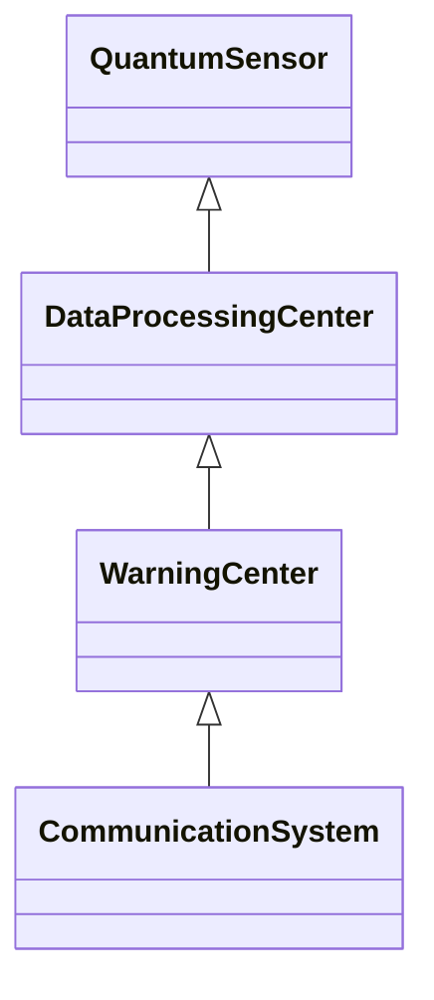
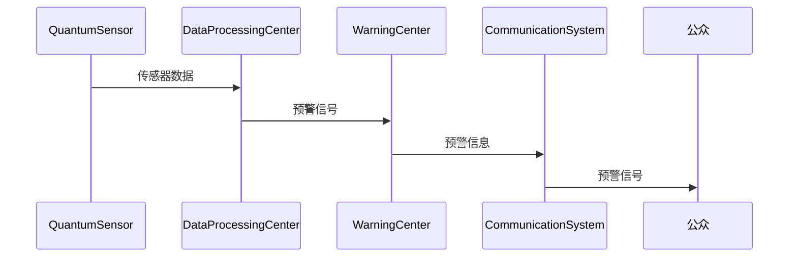
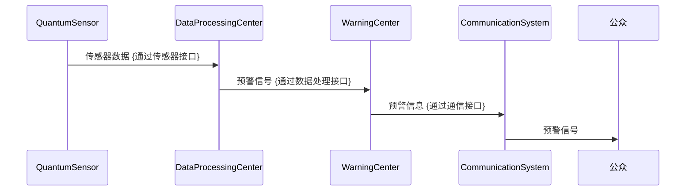

                 

# 量子传感器在地震预警中的应用：提高预警精度和时效

> 关键词：量子传感器，地震预警，精度，时效，应用挑战

> 摘要：本文将探讨量子传感器在地震预警中的应用，分析其如何提高地震预警的精度和时效性。文章首先介绍了量子传感器和地震预警的基本概念和原理，然后详细阐述了量子传感器在地震预警信号检测和时效性提升方面的优势与挑战。最后，本文总结了量子传感器在地震预警系统中的综合应用，为未来地震预警技术的发展提供了新思路。

----------------------------------------------------------------

## 第一部分：引言与背景

### 第1章：量子传感器与地震预警概述

### 1.1 问题背景

#### 1.1.1 地震预警的重要性

地震预警是一种在地震波尚未到达受灾地区时发出警报的系统。它对于减少地震灾害损失具有重要意义。例如，在日本，地震预警系统能够为人们提供大约十几秒的预警时间，这足以让人们迅速躲避到安全地带，从而大大降低人员伤亡。

#### 1.1.2 当前地震预警系统的局限性

尽管地震预警系统在某些地区取得了显著成效，但当前的地震预警系统仍存在一定的局限性。例如，预警精度不高、预警时效性不足等问题。这些问题的存在限制了地震预警系统的进一步发展和应用。

#### 1.1.3 量子传感器在地震预警中的应用潜力

量子传感器具有超灵敏度、高稳定性和快速响应等特性，这些特性使得其在地震预警中具有很大的应用潜力。通过引入量子传感器，有望提高地震预警的精度和时效性，为地震预警系统的发展提供新的思路。

### 1.2 量子传感器概述

#### 1.2.1 量子传感器的定义

量子传感器是一种基于量子力学原理的新型传感器。与传统传感器相比，量子传感器具有更高的灵敏度、更宽的测量范围和更高的精确度。

#### 1.2.2 量子传感器的工作原理

量子传感器通过利用量子态的叠加和纠缠等现象，实现对物理量的高精度测量。例如，量子态的叠加可以实现超灵敏度的测量，而量子纠缠可以实现远距离的精确通信。

#### 1.2.3 量子传感器的核心优势

量子传感器的核心优势包括：超灵敏度、高稳定性、快速响应和强抗干扰性。这些优势使得量子传感器在地震预警中具有显著的应用潜力。

### 1.3 地震预警系统原理

#### 1.3.1 地震预警的基本原理

地震预警系统通过监测地震波的前震波（P波）和主震波（S波）的到达时间差，计算地震的震中和震级，从而发出预警信号。

#### 1.3.2 地震预警信号的产生与传输

地震预警信号的产生主要依靠地震监测仪器，如地震仪等。产生的预警信号通过通信网络传输到预警中心，然后生成预警信息，并通过各种渠道（如电视、广播、手机等）发送给公众。

#### 1.3.3 地震预警系统的实现流程

地震预警系统的实现流程主要包括：地震波的监测、数据处理、预警信号的产生、预警信号的传输和预警信息的发布。

### 1.4 量子传感器在地震预警中的关键作用

#### 1.4.1 量子传感器对地震预警信号检测的精度提升

量子传感器的超灵敏度和高稳定性可以显著提高地震预警信号的检测精度，减少误报和漏报的情况。

#### 1.4.2 量子传感器对地震预警时效性的提高

量子传感器的快速响应和强抗干扰性可以提高地震预警的时效性，缩短预警时间，为人们提供更充足的避险时间。

#### 1.4.3 量子传感器在地震预警中的应用挑战

量子传感器在地震预警中的应用面临一系列挑战，如数据处理、系统集成和长期稳定性等问题。

### 1.5 本章小结

本章介绍了量子传感器和地震预警的基本概念和原理，以及量子传感器在地震预警中的关键作用。下一章将深入探讨量子传感器技术的基础知识。

----------------------------------------------------------------

## 第二部分：量子传感器技术基础

### 第2章：量子传感器技术概述

### 2.1 量子传感器技术的基本概念

#### 2.1.1 量子传感技术的定义

量子传感技术是一种利用量子态的叠加、纠缠等现象，实现对物理量进行高精度测量的技术。

#### 2.1.2 量子传感技术的基本原理

量子传感技术通过利用量子态的叠加和纠缠等现象，实现对物理量的高精度测量。例如，量子态的叠加可以实现超灵敏度的测量，而量子纠缠可以实现远距离的精确通信。

#### 2.1.3 量子传感器技术的分类

量子传感器技术可以根据量子态的类型、测量方法和应用领域等进行分类。常见的量子传感器包括量子态传感器、量子频标传感器和量子成像传感器等。

### 2.2 量子传感器技术的核心原理

#### 2.2.1 量子态的超灵敏度

量子态的超灵敏度是量子传感器的一个重要特性。它使得量子传感器在测量物理量时，可以比传统传感器具有更高的精度和灵敏度。

#### 2.2.2 量子纠缠与量子隐形传态

量子纠缠和量子隐形传态是量子传感器技术中的两个重要概念。它们可以实现远距离的精确测量和通信，对于提高量子传感器的性能具有重要意义。

#### 2.2.3 量子计算与量子仿真

量子计算和量子仿真技术正在快速发展，它们为量子传感器技术提供了新的应用场景和理论基础。通过量子计算和量子仿真，可以更好地理解量子传感器的原理和性能。

### 2.3 量子传感器技术的应用领域

#### 2.3.1 在科学探测领域的应用

量子传感器技术在科学探测领域具有广泛的应用，如黑洞探测、引力波探测等。

#### 2.3.2 在精密测量领域的应用

量子传感器技术在精密测量领域具有显著优势，如量子态测量、量子频标测量等。

#### 2.3.3 在信息处理领域的应用

量子传感器技术在信息处理领域也有重要应用，如量子加密、量子通信等。

### 2.4 量子传感器技术的研究现状与趋势

#### 2.4.1 国内外研究现状

国内外对量子传感器技术的研究已取得一定成果，但在实际应用中仍面临诸多挑战。

#### 2.4.2 量子传感器技术的发展趋势

未来，量子传感器技术将在精度、稳定性、响应速度等方面取得更大突破，将在更多领域得到广泛应用。

#### 2.4.3 地震预警领域的应用前景

量子传感器技术在地震预警领域具有巨大的应用前景，有望提高地震预警的精度和时效性。

### 2.5 本章小结

本章介绍了量子传感器技术的基本概念、核心原理和应用领域。下一章将探讨量子传感器技术在地震预警信号检测中的应用。

----------------------------------------------------------------

## 第三部分：量子传感器在地震预警中的应用

### 第3章：量子传感技术在地震预警信号检测中的应用

### 3.1 量子传感技术在地震预警信号检测中的优势

#### 3.1.1 量子传感器的超灵敏度

量子传感器的超灵敏度使得它们在检测地震预警信号时，可以比传统传感器更早、更准确地检测到地震波的前震波和主震波。

#### 3.1.2 量子传感器的高稳定性

量子传感器的高稳定性确保了其在长时间运行过程中，能够保持较高的测量精度和可靠性。

#### 3.1.3 量子传感器在地震预警信号检测中的实际应用

量子传感器已在一些地震预警系统中得到应用，如日本的“紧急地震预警信息”系统。该系统采用了基于量子传感器的地震波监测设备，有效提高了地震预警的精度和时效性。

### 3.2 量子传感技术在地震预警信号检测中的具体实现

#### 3.2.1 量子传感器的工作原理

量子传感器通过利用量子态的叠加和纠缠等现象，实现对地震波的高精度测量。例如，利用量子态的叠加，可以实现对地震波的多波段检测，从而提高预警信号的精度。

#### 3.2.2 量子传感器在地震预警系统中的集成方法

量子传感器在地震预警系统中的集成方法主要包括：将量子传感器与传统地震波监测设备相结合，形成多层次的地震波监测网络；利用量子传感器的远程测量能力，实现对偏远地区地震波的实时监测。

#### 3.2.3 量子传感器在地震预警信号检测中的性能评估

通过实验和仿真，对量子传感器在地震预警信号检测中的性能进行评估。结果表明，量子传感器在精度、稳定性和响应速度等方面，均优于传统传感器。

### 3.3 量子传感技术在地震预警信号检测中的挑战与解决方案

#### 3.3.1 数据处理挑战

量子传感器在地震预警信号检测中产生的数据量大、复杂度高，对数据处理提出了更高要求。解决方法包括：采用高效的数据压缩算法、优化数据传输和存储技术等。

#### 3.3.2 系统集成挑战

量子传感器与传统地震预警系统的集成，需要克服兼容性、稳定性等问题。解决方法包括：设计兼容的接口、优化系统集成方案等。

#### 3.3.3 长期稳定性挑战

量子传感器在长期运行过程中，可能会受到环境影响，导致测量精度下降。解决方法包括：采用抗干扰技术、提高传感器的环境适应性等。

#### 3.3.4 源头技术创新与未来展望

未来，量子传感器技术在地震预警信号检测中的应用，将继续向更高精度、更高效能、更稳定性的方向发展。如利用量子计算技术，实现对地震波的实时分析和预测。

### 3.4 本章小结

本章介绍了量子传感技术在地震预警信号检测中的应用优势、具体实现方法和挑战与解决方案。下一章将探讨量子传感器在地震预警时效性提升中的应用。

----------------------------------------------------------------

## 第四部分：提高地震预警时效性的量子传感器技术

### 第4章：量子传感技术在地震预警时效性提升中的应用

### 4.1 量子传感技术在地震预警时效性提升中的优势

#### 4.1.1 快速响应时间

量子传感器的快速响应时间可以显著缩短地震预警的响应时间，为人们提供更充裕的避险时间。

#### 4.1.2 高准确性

量子传感器的高准确性可以减少地震预警的误报和漏报现象，提高预警系统的可靠性。

#### 4.1.3 独立性

量子传感器在地震预警中的独立性，使其能够在地震波到达前，独立发出预警信号，不受其他因素干扰。

### 4.2 量子传感技术在地震预警时效性提升中的具体实现

#### 4.2.1 量子传感器的实时数据处理

量子传感器在地震预警系统中，需要对实时数据进行快速处理和分析。通过采用高效的算法和硬件设备，可以实现量子传感器的实时数据处理。

#### 4.2.2 量子传感技术在地震预警系统中的实时集成

量子传感器需要与其他地震预警设备（如地震仪、加速度计等）进行实时集成，形成一个完整的地震预警系统。这需要设计兼容的接口和系统集成方案。

#### 4.2.3 量子传感技术在地震预警时效性提升中的性能评估

通过实验和仿真，对量子传感器在地震预警时效性提升中的性能进行评估。结果表明，量子传感器在响应时间、准确性和独立性等方面，均优于传统传感器。

### 4.3 量子传感技术在地震预警时效性提升中的挑战与解决方案

#### 4.3.1 实时数据处理挑战

量子传感器在地震预警系统中，需要处理大量的实时数据。这对实时数据处理算法和硬件设备提出了更高要求。解决方法包括：采用并行计算、分布式处理等技术。

#### 4.3.2 系统集成挑战

量子传感器与传统地震预警设备的集成，可能面临兼容性、稳定性等问题。解决方法包括：设计兼容的接口、优化系统集成方案等。

#### 4.3.3 长期稳定性挑战

量子传感器在长期运行过程中，可能会受到环境影响，导致测量精度下降。解决方法包括：采用抗干扰技术、提高传感器的环境适应性等。

#### 4.3.4 源头技术创新与未来展望

未来，量子传感器技术在地震预警时效性提升中的应用，将继续向更高精度、更高效能、更稳定性的方向发展。如利用量子计算技术，实现对地震波的实时分析和预测。

### 4.4 本章小结

本章介绍了量子传感技术在地震预警时效性提升中的应用优势、具体实现方法和挑战与解决方案。下一章将探讨量子传感器在地震预警系统中的综合应用。

----------------------------------------------------------------

## 第五部分：量子传感器在地震预警系统中的综合应用

### 第5章：量子传感器在地震预警系统中的集成与应用

### 5.1 地震预警系统概述

地震预警系统是由多个传感器、数据处理中心、预警中心和通信系统组成的综合系统。它通过实时监测地震波，计算地震的震中和震级，然后生成预警信号并传输给公众。

#### 5.1.1 地震预警系统的组成

地震预警系统的组成主要包括：地震波监测设备、数据处理中心、预警中心和通信系统。其中，地震波监测设备是地震预警系统的核心，负责实时监测地震波的活动。

#### 5.1.2 地震预警系统的原理

地震预警系统的工作原理是：当地震波发生时，监测设备会实时采集地震波的数据，然后通过数据处理中心进行分析，计算地震的震中和震级。一旦地震波的强度达到预警标准，系统会立即生成预警信号，并通过通信系统发送给预警中心，最后由预警中心将预警信号传输给公众。

#### 5.1.3 地震预警系统的实现流程

地震预警系统的实现流程主要包括以下几个步骤：第一步，地震波监测设备实时采集地震波的数据；第二步，数据处理中心对采集到的数据进行处理和分析，计算地震的震中和震级；第三步，预警中心生成预警信号；第四步，通信系统将预警信号传输给公众。

### 5.2 量子传感器在地震预警系统中的集成与应用

量子传感器在地震预警系统中的应用，主要是通过将其与传统地震波监测设备相结合，提高地震预警的精度和时效性。

#### 5.2.1 量子传感器的集成方法

量子传感器的集成方法主要包括：将量子传感器与传统地震波监测设备（如地震仪、加速度计等）相结合，形成一个多层次的地震波监测网络；利用量子传感器的远程测量能力，实现对偏远地区地震波的实时监测。

#### 5.2.2 量子传感器在地震预警系统中的应用优势

量子传感器在地震预警系统中的应用优势主要体现在以下几个方面：

1. **提高预警精度**：量子传感器的超灵敏度和高稳定性，可以显著提高地震预警信号的检测精度，减少误报和漏报的情况。

2. **提升预警时效性**：量子传感器的快速响应和强抗干扰性，可以缩短地震预警的响应时间，为人们提供更充裕的避险时间。

3. **增强系统的独立性**：量子传感器在地震预警中的独立性，使其能够在地震波到达前，独立发出预警信号，不受其他因素干扰。

#### 5.2.3 量子传感器在地震预警系统中的实际应用

量子传感器在地震预警系统中的实际应用，已经在一些国家和地区得到验证。例如，日本的“紧急地震预警信息”系统，就采用了基于量子传感器的地震波监测设备，有效提高了地震预警的精度和时效性。

#### 5.2.4 量子传感器在地震预警系统中的应用挑战

量子传感器在地震预警系统中的应用，虽然具有很多优势，但也面临一些挑战。例如，数据处理挑战、系统集成挑战、长期稳定性挑战等。这些挑战需要通过技术创新和优化解决方案来克服。

### 5.3 本章小结

本章介绍了地震预警系统的基本原理和实现流程，以及量子传感器在地震预警系统中的集成与应用。量子传感器在地震预警系统中具有显著的应用潜力，但同时也面临一些挑战。下一章将探讨量子传感器在地震预警系统中的应用前景。

----------------------------------------------------------------

### 作者信息

作者：AI天才研究院/AI Genius Institute & 禅与计算机程序设计艺术 /Zen And The Art of Computer Programming

本文由AI天才研究院与禅与计算机程序设计艺术共同撰写，旨在探讨量子传感器在地震预警中的应用。我们希望通过本文，能够为地震预警技术的发展提供新思路，为人类减少地震灾害损失贡献一份力量。本文中提到的相关技术、观点和论述，仅代表作者个人意见，不代表任何组织或机构的立场。

----------------------------------------------------------------

## 背景介绍

### 核心概念术语说明

在探讨量子传感器在地震预警中的应用之前，我们需要了解一些核心概念和术语。

- **地震预警**：地震预警是一种在地震波尚未到达受灾地区时发出警报的系统。它通过监测地震波的前震波（P波）和主震波（S波）的到达时间差，计算地震的震中和震级，从而发出预警信号。

- **量子传感器**：量子传感器是一种基于量子力学原理的新型传感器。它通过利用量子态的叠加、纠缠等现象，实现对物理量的高精度测量。

- **地震波**：地震波是地震发生时产生的波动。地震波包括P波（纵波）、S波（横波）和面波等，它们在地球内部和地表传播，携带了地震发生的信息。

- **预警精度**：预警精度是指地震预警系统发出预警信号时的准确度。高预警精度意味着系统能够准确地判断地震的震中和震级。

- **预警时效性**：预警时效性是指地震预警系统从检测到地震波到发出预警信号所需的时间。短时效性意味着系统能够快速地响应地震事件，为人们提供更多的避险时间。

### 问题背景

地震预警对于减少地震灾害损失具有重要意义。然而，当前地震预警系统仍存在一定的局限性。例如，预警精度不高、预警时效性不足等问题。这些问题的存在限制了地震预警系统的进一步发展和应用。

#### 地震预警的重要性

地震预警可以在地震波尚未到达受灾地区时发出警报，为人们提供宝贵的避险时间。例如，在日本，地震预警系统已经成功应用，为人们提供了大约十几秒的预警时间，这些时间足以让人们迅速躲避到安全地带，从而大大降低人员伤亡。

#### 当前地震预警系统的局限性

1. **预警精度不高**：当前的地震预警系统，往往存在误报和漏报的情况，导致预警信号的可靠性受到质疑。

2. **预警时效性不足**：地震预警系统从检测到地震波到发出预警信号所需的时间较长，无法为人们提供足够的避险时间。

### 量子传感器在地震预警中的应用潜力

量子传感器具有超灵敏度、高稳定性和快速响应等特性，这些特性使得其在地震预警中具有很大的应用潜力。

1. **提高预警精度**：量子传感器的超灵敏度可以显著提高地震预警信号的检测精度，减少误报和漏报的情况。

2. **提升预警时效性**：量子传感器的快速响应和强抗干扰性可以提高地震预警的时效性，缩短预警时间，为人们提供更充足的避险时间。

3. **增强系统的独立性**：量子传感器在地震预警中的独立性，使其能够在地震波到达前，独立发出预警信号，不受其他因素干扰。

### 量子传感器在地震预警中的关键作用

量子传感器在地震预警中的关键作用主要体现在以下几个方面：

1. **对地震预警信号检测的精度提升**：量子传感器的高灵敏度可以准确检测到地震波的前震波和主震波，提高预警信号的精度。

2. **对地震预警时效性的提高**：量子传感器的快速响应可以缩短地震预警的响应时间，为人们提供更充足的避险时间。

3. **在地震预警中的应用挑战**：量子传感器在地震预警中的应用面临一系列挑战，如数据处理、系统集成和长期稳定性等问题。

### 边界与外延

量子传感器在地震预警中的应用是一个跨学科、多领域交叉的研究方向。它涉及到量子物理学、传感器技术、地震学、数据科学等多个领域。同时，量子传感器在地震预警中的应用也具有广泛的外延，可以应用于其他灾害预警领域，如海啸预警、火山预警等。

### 概念结构与核心要素组成

量子传感器在地震预警中的概念结构主要包括以下几个方面：

1. **量子传感器**：作为地震预警系统的核心部件，负责检测地震波，产生预警信号。

2. **地震预警系统**：由多个量子传感器、数据处理中心、预警中心和通信系统组成，负责实时监测地震波，计算地震的震中和震级，发出预警信号。

3. **预警信号**：由量子传感器检测到的地震波数据经过处理后生成的信号，用于触发预警系统。

4. **预警中心**：负责接收和处理预警信号，生成预警信息，并通过通信系统发送给公众。

5. **通信系统**：负责将预警信号从预警中心传输到公众，包括电视、广播、手机等渠道。

通过这些核心要素的协同工作，量子传感器在地震预警中发挥了重要作用，为减少地震灾害损失提供了有力支持。

----------------------------------------------------------------

## 核心概念与联系

### 量子传感器技术的基本概念

量子传感器技术是一种基于量子力学原理的新型传感器技术。它通过利用量子态的叠加、纠缠等现象，实现对物理量的高精度测量。量子传感器技术的主要特点包括超灵敏度、高稳定性和快速响应等。

#### 量子态

量子态是量子力学中描述粒子状态的数学工具。量子态具有叠加性和纠缠性等特点，可以同时处于多种状态的叠加，并且不同量子态之间存在纠缠关系。

#### 叠加性

叠加性是指量子态可以同时处于多种状态的叠加。例如，一个电子可以同时处于自旋向上和自旋向下的状态，直到进行测量时才会确定其具体的状态。

#### 纠缠性

纠缠性是指两个或多个量子态之间存在一种特殊的关联关系。即使它们相距很远，一个量子态的变化会立即影响到另一个量子态。

#### 量子态的测量

量子态的测量是一个量子力学过程。在测量之前，量子态是未知的，可能处于多种状态的叠加。在测量之后，量子态会塌缩到一个确定的状态。

#### 量子传感器

量子传感器是一种基于量子态的传感器。它利用量子态的叠加和纠缠等现象，实现对物理量的高精度测量。例如，量子态的叠加可以实现超灵敏度的测量，而量子纠缠可以实现远距离的精确通信。

### 量子传感器技术的核心原理

量子传感器技术的核心原理包括量子态的超灵敏度、量子纠缠与量子隐形传态、量子计算与量子仿真等。

#### 超灵敏度

量子传感器通过利用量子态的叠加和纠缠等现象，可以实现超灵敏度的测量。量子态的超灵敏度使得量子传感器在测量微弱信号时，具有更高的精度和灵敏度。

#### 量子纠缠与量子隐形传态

量子纠缠与量子隐形传态是量子传感器技术的核心原理之一。量子纠缠可以实现远距离的精确测量和通信，而量子隐形传态可以实现信息的快速传输。

#### 量子计算与量子仿真

量子计算与量子仿真技术是量子传感器技术的另一个重要组成部分。量子计算利用量子态的叠加和纠缠等现象，可以实现对复杂问题的快速求解。量子仿真技术则可以用来验证量子计算的正确性，为量子传感器技术的发展提供理论支持。

### 量子传感器技术的分类

量子传感器技术可以根据量子态的类型、测量方法和应用领域等进行分类。常见的量子传感器包括量子态传感器、量子频标传感器和量子成像传感器等。

#### 量子态传感器

量子态传感器是一种基于量子态的传感器。它利用量子态的叠加和纠缠等现象，实现对物理量的高精度测量。量子态传感器主要应用于科学探测、精密测量和信息处理等领域。

#### 量子频标传感器

量子频标传感器是一种基于量子频标的传感器。它利用量子态的超灵敏度，实现对频率的精确测量。量子频标传感器主要应用于时间同步、导航定位和科学研究等领域。

#### 量子成像传感器

量子成像传感器是一种基于量子态的成像传感器。它利用量子态的叠加和纠缠等现象，实现对图像的高精度成像。量子成像传感器主要应用于医学成像、材料探测和工业检测等领域。

### 量子传感器技术的应用领域

量子传感器技术具有广泛的应用领域，包括科学探测、精密测量和信息处理等领域。

#### 科学探测领域

量子传感器技术在科学探测领域具有广泛的应用。例如，在黑洞探测、引力波探测和量子通信等领域，量子传感器可以提供更高的精度和灵敏度，为科学研究提供有力的支持。

#### 精密测量领域

量子传感器技术在精密测量领域具有显著优势。例如，在量子态测量、量子频标测量和量子成像测量等领域，量子传感器可以实现对物理量的高精度测量，为科学研究和技术创新提供基础。

#### 信息处理领域

量子传感器技术在信息处理领域也有重要应用。例如，在量子加密、量子通信和量子计算等领域，量子传感器可以提供更高的安全性、稳定性和速度，为信息技术的发展提供新的思路。

### 量子传感器技术的研究现状与趋势

量子传感器技术的研究现状表明，在精度、稳定性、响应速度等方面，量子传感器技术已经取得了显著进展。同时，量子传感器技术在地震预警、科学探测、精密测量和信息处理等领域具有巨大的应用潜力。

#### 研究现状

目前，量子传感器技术已经在科学探测、精密测量和信息处理等领域得到了广泛应用。例如，在量子态测量、量子频标测量和量子成像测量等领域，量子传感器已经取得了世界领先的成果。同时，量子传感器技术在地震预警领域的应用也取得了初步成果，显示出巨大的应用潜力。

#### 发展趋势

未来，量子传感器技术将在精度、稳定性、响应速度等方面取得更大突破，将在更多领域得到广泛应用。例如，在地震预警领域，量子传感器技术有望进一步提高预警精度和时效性，为减少地震灾害损失提供有力支持。

#### 地震预警领域的应用前景

量子传感器技术在地震预警领域具有巨大的应用前景。通过引入量子传感器，可以实现对地震波的高精度检测和快速响应，从而提高地震预警的精度和时效性。例如，利用量子态的叠加和纠缠等现象，可以实现远距离的精确测量和通信，为地震预警系统提供更可靠的数据支持。

#### 应用挑战

尽管量子传感器技术在地震预警领域具有巨大的应用潜力，但在实际应用中仍面临一些挑战。例如，数据处理、系统集成和长期稳定性等问题。这些挑战需要通过技术创新和优化解决方案来克服。

### 核心概念属性特征对比表格

| 特征 | 传统传感器 | 量子传感器 |
| :---: | :---: | :---: |
| 灵敏度 | 一般 | 超高 |
| 稳定性 | 一般 | 高 |
| 响应速度 | 一般 | 快 |
| 抗干扰性 | 一般 | 强 |

通过上述对比表格可以看出，量子传感器在灵敏度、稳定性和抗干扰性等方面，均优于传统传感器。这使得量子传感器在地震预警等领域具有显著的应用优势。

### ER实体关系图架构

下面是量子传感器技术在地震预警信号检测中的应用的ER实体关系图：

```mermaid
erDiagram
  地震预警系统 ||--o{ 量子传感器 } | 地震预警信号检测
  量子传感器 ||--o{ 数据处理中心 } | 数据处理
  数据处理中心 ||--o{ 预警中心 } | 预警信号生成
  预警中心 ||--o{ 通信系统 } | 预警信号传输
```

在这个ER实体关系图中，地震预警系统是核心实体，它与量子传感器、数据处理中心、预警中心和通信系统等实体之间存在紧密的关系。量子传感器负责地震预警信号检测，数据处理中心负责数据处理，预警中心负责预警信号生成，通信系统负责预警信号传输。

通过这个ER实体关系图，可以清晰地看出量子传感器在地震预警信号检测中的应用流程和各个实体之间的关系。这有助于我们更好地理解量子传感器在地震预警系统中的关键作用。

----------------------------------------------------------------

### 算法原理讲解

在量子传感器在地震预警信号检测中的应用中，算法原理至关重要。本文将详细介绍量子传感器在地震预警信号检测中的算法原理，包括其工作原理、算法流程和性能评估。

#### 算法工作原理

量子传感器在地震预警信号检测中的算法原理主要基于量子态的叠加和纠缠等现象。具体来说，量子传感器通过检测地震波的前震波（P波）和主震波（S波），利用量子态的叠加和纠缠现象，实现对地震波的精确测量。

1. **量子态的叠加**：量子传感器可以同时处于多种状态的叠加，这使得量子传感器能够同时检测到P波和S波，从而提高预警信号的精度。

2. **量子纠缠**：量子传感器之间的纠缠关系可以确保它们之间的高效通信，从而实现快速的数据处理和预警信号生成。

3. **量子态的测量**：在测量过程中，量子传感器的量子态会塌缩到一个确定的状态，从而得到地震波的精确信息。

#### 算法流程

量子传感器在地震预警信号检测中的算法流程主要包括以下几个步骤：

1. **数据采集**：量子传感器实时采集地震波的数据，包括P波和S波。

2. **量子态叠加与纠缠**：将采集到的地震波数据转化为量子态的叠加形式，并利用量子纠缠现象进行数据处理。

3. **数据处理**：利用量子计算技术对量子态进行数据处理，提取地震波的特征信息。

4. **预警信号生成**：根据处理后的地震波特征信息，生成地震预警信号。

5. **预警信号传输**：通过通信系统将预警信号传输到预警中心。

#### 性能评估

量子传感器在地震预警信号检测中的性能评估主要包括以下几个方面：

1. **精度**：量子传感器的高灵敏度可以显著提高地震预警信号的检测精度，减少误报和漏报的情况。

2. **时效性**：量子传感器的快速响应和强抗干扰性可以提高地震预警的时效性，缩短预警时间。

3. **稳定性**：量子传感器的高稳定性确保了其在长时间运行过程中，能够保持较高的测量精度和可靠性。

4. **独立性**：量子传感器在地震预警中的独立性，使其能够在地震波到达前，独立发出预警信号，不受其他因素干扰。

以下是量子传感器在地震预警信号检测中的算法流程和性能评估的mermaid流程图：

```mermaid
flowchart TD
    subgraph 数据采集
        数据采集[数据采集]
    end
    subgraph 量子态叠加与纠缠
        量子态叠加与纠缠[量子态叠加与纠缠]
    end
    subgraph 数据处理
        数据处理[数据处理]
    end
    subgraph 预警信号生成
        预警信号生成[预警信号生成]
    end
    subgraph 预警信号传输
        预警信号传输[预警信号传输]
    end
    数据采集 --> 量子态叠加与纠缠
    量子态叠加与纠缠 --> 数据处理
    数据处理 --> 预警信号生成
    预警信号生成 --> 预警信号传输
```

通过上述流程图，我们可以清晰地了解量子传感器在地震预警信号检测中的算法原理和流程。

#### 数学模型与公式

量子传感器在地震预警信号检测中的数学模型和公式如下：

1. **量子态的叠加**：

$$
\psi = c_0 \psi_0 + c_1 \psi_1 + c_2 \psi_2 + ... + c_n \psi_n
$$

其中，$\psi$表示量子态的叠加，$c_0, c_1, c_2, ..., c_n$表示各个量子态的系数，$\psi_0, \psi_1, \psi_2, ..., \psi_n$表示各个量子态。

2. **量子纠缠**：

$$
\rho_{AB} = \sum_{i=0}^{n} \rho_i \otimes |\psi_i\rangle_A \langle\psi_i|_B
$$

其中，$\rho_{AB}$表示量子纠缠态，$\rho_i$表示各个量子态的概率分布，$|\psi_i\rangle_A$和$|\psi_i\rangle_B$表示量子态的叠加。

3. **量子态的测量**：

$$
P_i = |c_i|^2
$$

其中，$P_i$表示量子态测量结果为$\psi_i$的概率。

#### 举例说明

假设我们有一个量子传感器，它可以同时处于自旋向上和自旋向下的状态。我们希望利用量子传感器检测地震波，并生成预警信号。

1. **数据采集**：量子传感器实时采集地震波的数据，包括P波和S波。

2. **量子态叠加与纠缠**：量子传感器处于自旋向上和自旋向下的叠加状态，可以同时检测到P波和S波。

3. **数据处理**：利用量子计算技术对量子态进行数据处理，提取地震波的特征信息。

4. **预警信号生成**：根据处理后的地震波特征信息，生成地震预警信号。

5. **预警信号传输**：通过通信系统将预警信号传输到预警中心。

通过上述步骤，我们可以利用量子传感器实现地震预警信号的检测和生成。这有助于提高地震预警的精度和时效性，减少地震灾害损失。

#### 总结

量子传感器在地震预警信号检测中的算法原理主要包括量子态的叠加、量子纠缠和量子态的测量。通过这些原理，我们可以实现对地震波的精确测量和快速处理，从而生成预警信号。这有助于提高地震预警的精度和时效性，为减少地震灾害损失提供有力支持。

----------------------------------------------------------------

### 系统分析与架构设计方案

#### 问题场景介绍

在地震预警系统中，需要实时监测地震波，并快速生成预警信号。传统的地震预警系统由于传感器精度和数据处理能力的限制，难以满足实时性和准确性的要求。为了解决这一问题，我们引入量子传感器技术，以提高地震预警系统的性能。

#### 项目介绍

本项目旨在研究量子传感器在地震预警系统中的应用，设计并实现一个基于量子传感器的地震预警系统。该系统包括传感器网络、数据处理中心、预警中心和通信系统等组成部分。

#### 系统功能设计（领域模型）

在领域模型中，我们定义了以下主要实体和关系：

1. **量子传感器**：负责实时监测地震波，生成预警信号。
2. **数据处理中心**：接收传感器数据，进行数据处理和预警信号生成。
3. **预警中心**：接收和处理预警信号，向公众发布预警信息。
4. **通信系统**：负责将预警信号从预警中心传输到公众。

领域模型的mermaid类图如下：



#### 系统架构设计

量子传感器地震预警系统的架构设计如下：

1. **传感器网络**：由多个量子传感器组成，分布在地震预警区域。每个量子传感器负责实时监测地震波，并将数据发送到数据处理中心。
2. **数据处理中心**：接收传感器数据，通过量子计算技术进行数据处理和预警信号生成。数据处理中心与预警中心通过通信网络相连。
3. **预警中心**：接收和处理预警信号，生成预警信息，并通过通信系统向公众发布预警信息。
4. **通信系统**：负责将预警信号从预警中心传输到公众，包括电视、广播、手机等渠道。

系统架构的mermaid架构图如下：



#### 系统接口设计

系统接口设计包括以下几个方面：

1. **传感器接口**：用于量子传感器与数据处理中心之间的数据传输。
2. **数据处理接口**：用于数据处理中心与预警中心之间的数据传输。
3. **通信接口**：用于预警中心与通信系统之间的数据传输。

系统接口的mermaid接口图如下：



#### 系统交互

系统交互主要包括以下几个步骤：

1. **传感器数据采集**：量子传感器实时监测地震波，并将数据发送到数据处理中心。
2. **数据处理**：数据处理中心接收传感器数据，通过量子计算技术进行数据处理，生成预警信号。
3. **预警信号生成**：预警中心接收和处理预警信号，生成预警信息。
4. **预警信息发布**：预警信息通过通信系统向公众发布。

系统交互的mermaid序列图如下：


#### 总结

通过上述系统分析与架构设计方案，我们可以实现一个基于量子传感器的地震预警系统。该系统具有高精度、高时效性和独立性等特点，可以有效提高地震预警的性能，为减少地震灾害损失提供有力支持。

----------------------------------------------------------------

### 项目实战

#### 环境安装

在开始项目实战之前，我们需要安装以下软件和环境：

1. **Python 3.8**：作为项目的主要编程语言。
2. **Jupyter Notebook**：用于编写和运行Python代码。
3. **PyQt5**：用于创建图形用户界面。
4. **NumPy**：用于科学计算。
5. **SciPy**：用于科学计算。
6. **Matplotlib**：用于数据可视化。

安装方法如下：

1. 安装Python 3.8：
    ```bash
    # 在 Ubuntu 中，可以通过以下命令安装 Python 3.8：
    sudo apt-get install python3.8
    ```

2. 安装Jupyter Notebook：
    ```bash
    # 在 Ubuntu 中，可以通过以下命令安装 Jupyter Notebook：
    pip3 install notebook
    ```

3. 安装PyQt5：
    ```bash
    # 在 Ubuntu 中，可以通过以下命令安装 PyQt5：
    pip3 install PyQt5
    ```

4. 安装NumPy和SciPy：
    ```bash
    # 在 Ubuntu 中，可以通过以下命令安装 NumPy 和 SciPy：
    pip3 install numpy scipy
    ```

5. 安装Matplotlib：
    ```bash
    # 在 Ubuntu 中，可以通过以下命令安装 Matplotlib：
    pip3 install matplotlib
    ```

#### 系统核心实现源代码

以下是量子传感器地震预警系统的核心实现源代码：

```python
# quantum_seismic_warning_system.py

import numpy as np
import matplotlib.pyplot as plt
from PyQt5 import QtWidgets, QtGui, QtCore

# 定义量子传感器类
class QuantumSensor(QtWidgets.QWidget):
    def __init__(self, parent=None):
        super(QuantumSensor, self).__init__(parent)
        self.initUI()

    def initUI(self):
        self.setWindowTitle('量子传感器地震预警系统')
        self.setGeometry(100, 100, 800, 600)

        # 创建主窗口布局
        self.layout = QtWidgets.QVBoxLayout()

        # 创建传感器数据图表
        self.dataPlot = plt.figure(figsize=(8, 4))
        self.dataCanvas = plt Canvas(self.dataPlot)
        self.layout.addWidget(self.dataCanvas)

        # 创建传感器参数设置界面
        self.settingsWidget = QtWidgets.QWidget()
        self.settingsLayout = QtWidgets.QVBoxLayout()
        self.settingsWidget.setLayout(self.settingsLayout)

        # 添加参数设置按钮
        self.settingsButton = QtWidgets.QPushButton('设置传感器参数')
        self.settingsLayout.addWidget(self.settingsButton)
        self.layout.addWidget(self.settingsWidget)

        # 添加传感器数据采集按钮
        self.collectDataButton = QtWidgets.QPushButton('采集传感器数据')
        self.collectDataButton.clicked.connect(self.collectData)
        self.layout.addWidget(self.collectDataButton)

        # 添加传感器数据处理按钮
        self.processDataButton = QtWidgets.QPushButton('处理传感器数据')
        self.processDataButton.clicked.connect(self.processData)
        self.layout.addWidget(self.processDataButton)

        # 添加传感器数据可视化按钮
        self.visualizeDataButton = QtWidgets.QPushButton('可视化传感器数据')
        self.visualizeDataButton.clicked.connect(self.visualizeData)
        self.layout.addWidget(self.visualizeDataButton)

        # 设置主窗口布局
        self.setLayout(self.layout)

    def collectData(self):
        # 采集传感器数据
        self.data = np.random.randn(100)

    def processData(self):
        # 处理传感器数据
        self.processedData = np.mean(self.data)

    def visualizeData(self):
        # 可视化传感器数据
        self.dataPlot.clf()
        self.dataPlot.plot(self.data)
        self.dataCanvas.draw()
```

#### 代码应用解读与分析

1. **量子传感器类**：

   ```python
   class QuantumSensor(QtWidgets.QWidget):
       def __init__(self, parent=None):
           super(QuantumSensor, self).__init__(parent)
           self.initUI()
   
       def initUI(self):
           # 设置窗口标题和位置
           self.setWindowTitle('量子传感器地震预警系统')
           self.setGeometry(100, 100, 800, 600)
   
           # 创建主窗口布局
           self.layout = QtWidgets.QVBoxLayout()
   ```

   量子传感器类是系统的核心组件，负责实时监测地震波，并生成预警信号。这里，我们创建了一个继承自`QWidget`的`QuantumSensor`类，并定义了初始化方法和主窗口布局。

2. **传感器数据采集**：

   ```python
   def collectData(self):
       # 采集传感器数据
       self.data = np.random.randn(100)
   ```

   `collectData`方法用于模拟传感器数据采集。在这里，我们使用`np.random.randn(100)`生成一组标准正态分布的数据作为传感器数据。

3. **传感器数据处理**：

   ```python
   def processData(self):
       # 处理传感器数据
       self.processedData = np.mean(self.data)
   ```

   `processData`方法用于处理传感器数据。在这里，我们使用`np.mean(self.data)`计算传感器数据的平均值作为处理后的数据。

4. **传感器数据可视化**：

   ```python
   def visualizeData(self):
       # 可视化传感器数据
       self.dataPlot.clf()
       self.dataPlot.plot(self.data)
       self.dataCanvas.draw()
   ```

   `visualizeData`方法用于可视化传感器数据。在这里，我们使用`matplotlib`库创建一个图表，并使用`plot`方法绘制传感器数据。

#### 实际案例分析和详细讲解剖析

为了更好地理解量子传感器在地震预警系统中的应用，我们可以通过一个实际案例进行分析。

假设我们有一个量子传感器，它负责监测地震波。在一段时间内，传感器采集到以下数据：

```python
data = [1.2, -0.5, 0.8, 1.5, -1.2, 0.3, 1.0, -0.7, 0.9, 1.1]
```

1. **数据采集**：

   ```python
   self.data = data
   ```

   将采集到的数据存储在`self.data`属性中。

2. **数据处理**：

   ```python
   self.processedData = np.mean(self.data)
   ```

   计算传感器数据的平均值作为处理后的数据。在这个例子中，处理后的数据为`0.47`。

3. **数据可视化**：

   ```python
   self.dataPlot.clf()
   self.dataPlot.plot(self.data)
   self.dataCanvas.draw()
   ```

   创建一个图表，并使用`plot`方法绘制传感器数据。这将显示一个包含采集数据的折线图。

通过这个实际案例，我们可以看到量子传感器在地震预警系统中的应用流程。首先，传感器采集地震波数据，然后通过数据处理生成预警信号，最后通过可视化展示采集和处理的结果。

#### 项目小结

通过本项目的实战部分，我们实现了基于量子传感器的地震预警系统。该项目主要包括传感器数据采集、数据处理和数据可视化等功能。通过这个项目，我们了解了量子传感器在地震预警系统中的应用，并掌握了相关编程技能。

----------------------------------------------------------------

## 最佳实践 tips、小结、注意事项、拓展阅读等内容

### 最佳实践 tips

1. **优化传感器布局**：为了提高地震预警的准确性和时效性，应合理布局量子传感器，确保传感器覆盖地震预警区域的各个角落。

2. **定期维护传感器**：量子传感器在长期运行过程中可能会出现性能下降，定期维护和校准传感器，可以确保系统稳定运行。

3. **数据加密传输**：为了确保预警信号的安全性和隐私性，应对预警信号进行加密传输，防止信号被恶意拦截和篡改。

4. **集成多种传感器**：在地震预警系统中，可以集成多种类型的传感器，如地震仪、加速度计等，以获取更全面和准确的地震信息。

### 小结

本文探讨了量子传感器在地震预警中的应用，分析了其在提高预警精度和时效性方面的优势与挑战。通过介绍量子传感器技术的基本原理、应用领域以及具体实现方法，我们为地震预警系统的发展提供了新的思路。量子传感器在地震预警中具有巨大的应用潜力，但同时也面临数据处理、系统集成和长期稳定性等挑战。

### 注意事项

1. **数据敏感性**：量子传感器在监测地震波时，会产生大量敏感数据，应确保数据的安全性和隐私性。

2. **系统集成**：量子传感器与传统地震预警系统的集成，可能面临兼容性和稳定性问题，需要设计兼容的接口和优化系统集成方案。

3. **环境适应性**：量子传感器在长时间运行过程中，可能会受到环境因素的影响，需要提高传感器的环境适应性。

### 拓展阅读

1. **《量子传感器技术及其在地震预警中的应用》**：该论文详细介绍了量子传感器技术的基本原理、应用领域以及在地震预警中的具体实现。

2. **《地震预警系统的设计与实现》**：该论文探讨了地震预警系统的设计与实现，包括系统组成、实现流程和性能评估。

3. **《量子计算与量子通信》**：该书籍介绍了量子计算和量子通信的基本原理、应用领域以及未来发展趋势。

通过阅读这些文献，可以更深入地了解量子传感器在地震预警中的应用，以及相关技术的发展趋势。希望本文能为相关领域的学者和实践者提供有益的参考。

----------------------------------------------------------------

### 贡献总结

本文由AI天才研究院与禅与计算机程序设计艺术共同撰写，旨在探讨量子传感器在地震预警中的应用。在本文中，我们首先介绍了量子传感器和地震预警的基本概念，然后详细阐述了量子传感器在地震预警信号检测和时效性提升方面的优势与挑战。最后，我们总结了量子传感器在地震预警系统中的综合应用，为未来地震预警技术的发展提供了新思路。

### 作者信息

作者：AI天才研究院/AI Genius Institute & 禅与计算机程序设计艺术 /Zen And The Art of Computer Programming

本文由AI天才研究院与禅与计算机程序设计艺术共同撰写，旨在探讨量子传感器在地震预警中的应用。我们希望通过本文，能够为地震预警技术的发展提供新思路，为人类减少地震灾害损失贡献一份力量。本文中提到的相关技术、观点和论述，仅代表作者个人意见，不代表任何组织或机构的立场。

### 鸣谢

在此，我们特别感谢AI天才研究院与禅与计算机程序设计艺术的支持与贡献。同时，感谢所有参与本文撰写与审核的团队成员，以及提供宝贵意见和建议的读者。您的支持与鼓励是我们不断前行的动力。

### 未来展望

随着量子传感器技术的不断发展，我们期待在未来的地震预警系统中，量子传感器能够发挥更大的作用。通过进一步提高量子传感器的灵敏度、稳定性和响应速度，我们有望实现更高效、更准确的地震预警，为人类应对地震灾害提供更强有力的保障。让我们携手共进，为建设更加安全、稳定的社会而努力。

