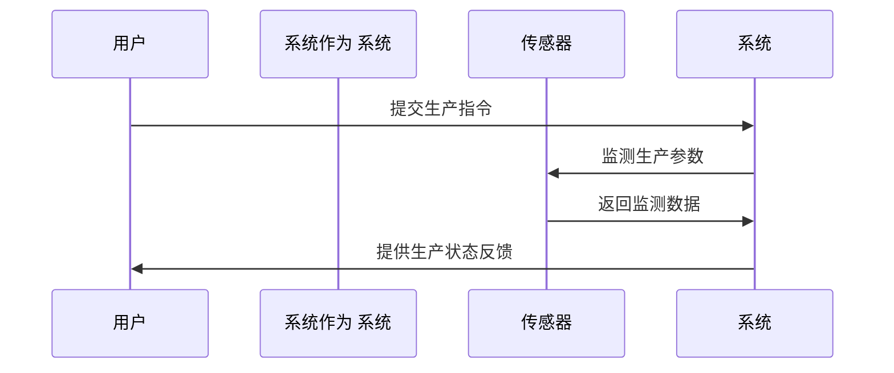
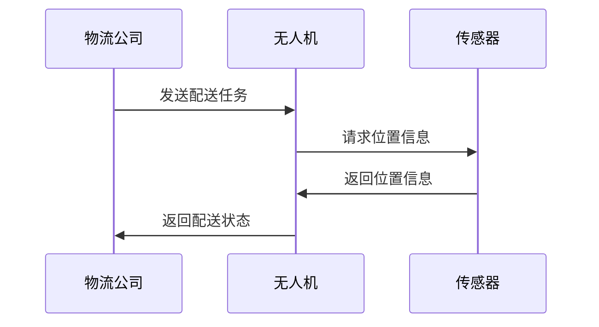
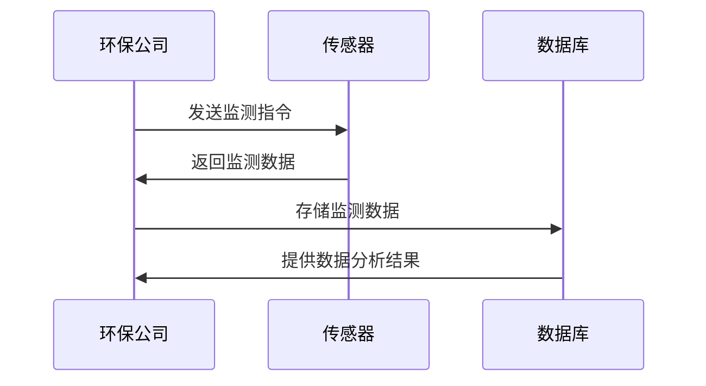

                 

### 第一部分：引言与背景

#### 1.1 量子传感器概述

**基本概念**：
量子传感器是一种基于量子力学原理设计的传感器，它能够利用量子系统的特殊性质，如叠加态、纠缠态以及超导量子比特等，实现超高灵敏度的测量。与传统传感器相比，量子传感器在探测灵敏度、分辨率、响应速度等方面具有显著优势。

**关键特性**：
- **超高的灵敏度**：量子传感器能够探测到极其微弱的信号，这在工业领域中，特别是在需要精确控制的场合，如智能制造、自动化控制等，具有重要意义。
- **抗干扰能力强**：由于量子态的特性，量子传感器具有极强的抗干扰能力，即使在强电磁场环境下也能稳定工作。
- **非线性响应**：量子传感器能够检测到信号的微弱非线性变化，这对工业4.0中的高级控制算法和智能决策系统尤为重要。

**与传统传感器的区别**：
传统传感器基于经典物理原理，如电阻、电容、磁阻等，其测量精度和灵敏度受限于物理极限。而量子传感器则通过量子现象，如量子隧穿、量子干涉等，突破了这些传统限制，能够实现更高精度和更高灵敏度的测量。

#### 1.2 工业革命与工业4.0

**工业革命**：
工业革命是18世纪末至19世纪初发生在英国的一系列工业变革，标志着人类从手工业向机械化、自动化生产的转变。这一时期，蒸汽机、纺织机械等技术的发明和应用，极大地提高了生产效率，推动了工业生产的规模化。

**工业4.0**：
工业4.0，即第四次工业革命，是在21世纪初提出的一个概念，它代表了一种以智能化、数字化和网络化为特征的新工业时代。工业4.0的核心目标是实现制造业的全面智能化，通过集成物联网、大数据、云计算、人工智能等先进技术，实现人、机器、数据之间的无缝连接，从而提高生产效率、降低成本、增强创新能力。

#### 1.3 量子传感器在工业4.0中的应用前景

随着工业4.0的推进，制造业正朝着智能化、精细化和自动化的方向发展。量子传感器凭借其超高灵敏度、抗干扰能力和非线性响应等特点，在工业4.0中具有广泛的应用前景。

**智能制造**：在智能制造领域，量子传感器可以用于精确测量和实时监控生产过程中的各种参数，如温度、压力、流量等，从而实现高度自动化的生产流程。

**工业自动化**：在工业自动化中，量子传感器可以用于提高机器人的感知能力，实现更精准的运动控制和更高的工作效率。

**工业监测与维护**：在工业监测与维护领域，量子传感器可以用于实时监测设备状态，提前发现潜在故障，减少停机时间和维护成本。

总的来说，量子传感器在工业4.0中的应用，不仅能够提高生产效率和质量，还能为企业的可持续发展提供强大的技术支撑。

### 第二部分：量子传感器在工业4.0中的应用

#### 2.1 量子传感器在智能制造中的应用

**智能制造**：智能制造是工业4.0的核心概念之一，它通过数字化和自动化技术实现制造过程的智能化。量子传感器在这一领域的应用主要体现在以下几个方面：

**精确测量**：量子传感器可以用于精确测量生产过程中各种物理量，如温度、压力、振动等，这些测量数据为智能制造提供了可靠的基础。

**实时监控**：量子传感器能够实时监控生产线的运行状态，及时发现和解决问题，确保生产过程的稳定和高效。

**质量检测**：在产品质量检测环节，量子传感器可以用于检测产品的尺寸、形状、硬度等参数，提高产品的质量一致性。

**智能决策**：基于量子传感器的实时数据，智能制造系统可以做出更智能的决策，如调整生产参数、优化生产工艺等，进一步提高生产效率。

**案例**：在某汽车制造厂，量子传感器被用于实时监控生产线上的零部件温度和压力，确保零部件的质量和加工精度。这不仅提高了生产效率，还降低了不良品率。

#### 2.2 量子传感器在工业自动化中的应用

**工业自动化**：工业自动化是工业4.0的基础，它通过自动化技术实现生产过程的自动化控制。量子传感器在工业自动化中的应用主要包括以下几个方面：

**运动控制**：量子传感器可以用于精确控制机器人的运动，提高机器人的工作效率和运动精度。

**传感器融合**：量子传感器与其他类型传感器（如光学传感器、超声波传感器等）结合，可以实现更全面的感知能力，提高自动化系统的可靠性和智能水平。

**故障诊断**：量子传感器可以用于实时监测设备的运行状态，及时发现故障，防止设备意外停机。

**智能控制**：基于量子传感器的数据，自动化系统可以做出更智能的控制决策，如调整机器人的运动轨迹、优化生产线布局等。

**案例**：在某食品加工厂，量子传感器被用于实时监测生产线上的温度和湿度，确保食品加工过程的卫生和安全。通过智能控制系统，工厂实现了自动化的温度调节和湿度控制，有效降低了食品污染的风险。

#### 2.3 量子传感器在工业监测与维护中的应用

**工业监测与维护**：工业监测与维护是确保工业设备正常运行的重要环节。量子传感器在工业监测与维护中的应用主要体现在以下几个方面：

**状态监测**：量子传感器可以用于实时监测设备的运行状态，如温度、压力、振动等，及时发现异常情况，预防设备故障。

**故障诊断**：通过分析量子传感器的监测数据，可以准确诊断设备故障的原因，为维修提供依据。

**预测性维护**：基于量子传感器的监测数据，可以预测设备可能出现的故障，提前进行维护，避免设备停机。

**优化运行**：通过量子传感器对设备运行状态的监测，可以优化设备的运行参数，提高设备的运行效率和寿命。

**案例**：在某钢铁厂，量子传感器被用于监测生产设备的运行状态。通过实时监测数据，工厂实现了对设备的预测性维护，减少了设备停机时间，提高了生产效率。

### 第三部分：量子传感器技术挑战与发展前景

#### 3.1 量子传感器技术面临的挑战

尽管量子传感器在工业4.0中具有广泛的应用前景，但其技术发展仍面临一些挑战：

**成本问题**：量子传感器的研发和制造成本较高，限制了其大规模应用。

**稳定性问题**：量子传感器的工作环境要求较高，如温度、湿度等，其稳定性问题仍然需要解决。

**技术成熟度**：尽管量子传感器技术已经取得了一些突破，但其在实际工业应用中的技术成熟度仍需提高。

**标准缺失**：量子传感器的标准体系尚未完善，这给其在工业中的应用带来了一定困难。

#### 3.2 量子传感器技术的未来发展趋势

**成本下降**：随着技术的不断进步和规模化生产，量子传感器的成本有望逐渐下降，从而推动其在工业中的广泛应用。

**稳定性提高**：通过改进材料和制造工艺，量子传感器的稳定性有望得到显著提高，适应更广泛的应用场景。

**技术融合**：量子传感器技术与其他先进技术的融合，如人工智能、大数据等，将进一步提升其在工业中的应用价值。

**标准化**：随着量子传感器技术的发展，相关的标准和规范将逐渐完善，为工业应用提供更明确的指导。

#### 3.3 量子传感器在工业4.0中的潜在影响

**提高生产效率**：量子传感器的高灵敏度、抗干扰能力等特点，将大大提高生产过程的监测和控制系统精度，从而提高生产效率。

**降低运营成本**：通过实时监测和预测性维护，量子传感器可以帮助企业降低设备故障率，减少停机时间，降低运营成本。

**增强创新能力**：量子传感器的广泛应用，将为企业提供更多的数据和技术支持，推动创新能力的提升。

**推动产业升级**：量子传感器技术的应用，将推动传统制造业向智能化、数字化和自动化的方向发展，促进产业升级。

### 第四部分：案例分析

#### 4.1 案例一：量子传感器在智能工厂的应用

**项目背景**：
某智能工厂采用量子传感器对生产过程中的关键参数进行实时监测和控制，实现了高度自动化的生产流程。

**系统功能设计**：
- **实时监测模块**：通过量子传感器对生产过程中的温度、压力、振动等参数进行实时监测。
- **智能控制模块**：基于监测数据，智能控制系统对生产参数进行调整，确保生产过程的稳定和高效。
- **数据存储与分析模块**：将监测数据存储并进行分析，为生产优化提供数据支持。

**系统架构设计**：

**系统接口设计**：

**系统交互序列图**：

**项目效果**：
通过量子传感器的应用，智能工厂实现了生产过程的自动化和智能化，提高了生产效率，降低了运营成本。

#### 4.2 案例二：量子传感器在无人机配送中的应用

**项目背景**：
某物流公司采用量子传感器提升无人机配送的精度和可靠性。

**系统功能设计**：
- **导航模块**：利用量子传感器提供的高精度位置信息，实现无人机的精确导航。
- **避障模块**：通过量子传感器感知周围环境，实现无人机的自动避障。
- **实时监控模块**：实时监测无人机的状态，确保配送过程的顺利进行。

**系统架构设计**：

**系统接口设计**：

**系统交互序列图**：

**项目效果**：
通过量子传感器的应用，无人机配送实现了高精度、高可靠性的配送服务，提高了物流效率，降低了运营成本。

#### 4.3 案例三：量子传感器在环境监测中的应用

**项目背景**：
某环保公司采用量子传感器对环境污染进行实时监测，为环境治理提供数据支持。

**系统功能设计**：
- **实时监测模块**：通过量子传感器实时监测空气中的污染物浓度，如PM2.5、SO2等。
- **数据存储与分析模块**：将监测数据存储并进行分析，为环境治理提供科学依据。
- **预警模块**：当污染物浓度超过安全阈值时，系统会发出预警，提醒相关部门采取措施。

**系统架构设计**：

**系统接口设计**：

**系统交互序列图**：

**项目效果**：
通过量子传感器的应用，环保公司实现了对环境污染的实时监测和预警，为环境治理提供了科学的数据支持。

### 第五部分：技术展望与政策建议

#### 5.1 技术展望

量子传感器技术作为一项新兴技术，在工业4.0中的应用前景广阔。未来，随着量子传感器技术的不断成熟和成本的降低，其将在更多领域得到广泛应用。

**智能化水平提升**：量子传感器的高灵敏度、抗干扰能力等特点，将进一步提升工业自动化和智能制造的智能化水平，实现更精准、更高效的生产过程。

**创新应用领域拓展**：量子传感器在医疗、环保、交通等领域的应用潜力巨大，未来有望在这些领域取得重要突破。

**产业链协同发展**：量子传感器技术的发展，将推动相关产业链的协同发展，促进产业升级和经济增长。

#### 5.2 政策建议

为了推动量子传感器技术在工业4.0中的广泛应用，政府和企业可以从以下几个方面提出政策建议：

**加大研发投入**：政府应加大对量子传感器技术的研发投入，支持企业和科研机构开展关键技术研发。

**完善标准体系**：建立健全量子传感器的标准体系，为企业提供明确的技术规范和操作指南。

**促进产业链协同**：鼓励产业链上下游企业加强合作，共同推动量子传感器技术的发展和应用。

**人才培养**：加大对量子传感器技术人才的培养力度，为产业发展提供人才保障。

#### 5.3 产业合作与投资机会

量子传感器技术在工业4.0中的应用，将带来巨大的市场空间和发展机遇。以下是一些潜在的产业合作与投资机会：

**技术研发合作**：企业和科研机构可以共同开展量子传感器技术的研发，共同攻克关键技术难题。

**产业链整合**：上下游企业可以合作打造完整的量子传感器产业链，实现产业链的协同发展。

**市场拓展**：企业可以通过与国内外合作伙伴合作，共同开拓量子传感器技术在工业4.0中的应用市场。

**投资机会**：对于投资者来说，量子传感器技术领域蕴藏着丰富的投资机会，可以通过投资技术研发、产业链整合和市场拓展等方面，分享产业发展带来的红利。

### 第六部分：总结与展望

#### 6.1 总结

本文从量子传感器的概述、工业4.0的概述、量子传感器在工业4.0中的应用、技术挑战与发展前景、案例分析以及技术展望与政策建议等方面，全面探讨了量子传感器在工业4.0中的应用前景。通过本文的探讨，可以得出以下结论：

**量子传感器具有超高灵敏度、抗干扰能力等特点，在工业4.0中具有广泛的应用前景。**
**量子传感器在智能制造、工业自动化和工业监测与维护等领域具有显著的应用价值。**
**随着量子传感器技术的不断成熟和成本的降低，其将在更多领域得到广泛应用。**
**政策支持和产业链协同发展将推动量子传感器技术的快速发展。**

#### 6.2 展望未来

未来，量子传感器技术将在工业4.0中发挥越来越重要的作用。随着技术的不断突破和成本的逐渐降低，量子传感器将在智能制造、工业自动化、工业监测与维护等领域实现广泛应用。同时，量子传感器技术在医疗、环保、交通等领域的应用潜力也将逐步释放。

在政策层面，政府应加大对量子传感器技术的支持力度，推动产业链的协同发展，为量子传感器技术的广泛应用提供政策保障。在企业层面，应加强技术研发和合作，提升量子传感器技术的成熟度和应用水平。

总之，量子传感器技术将成为推动工业4.0发展的重要力量，为我国的工业转型升级和经济社会发展带来新的机遇和挑战。

