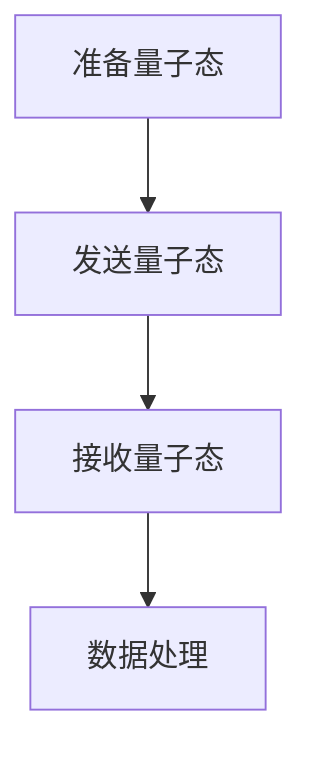
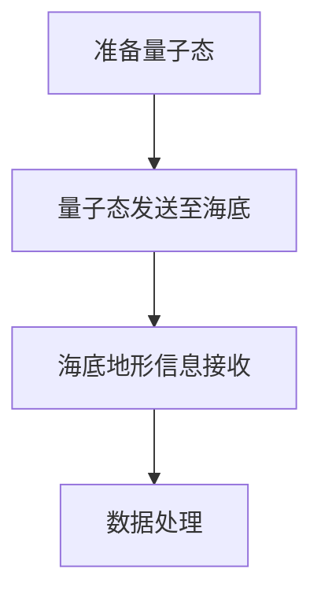
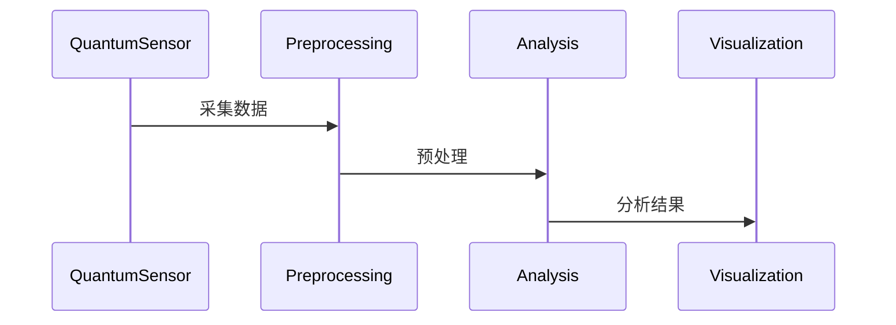
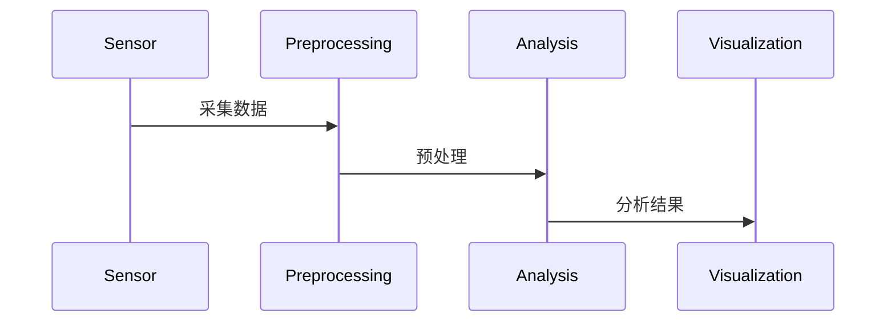

                 

# 量子传感器在深海探测中的应用：精确测量海底地形

## 关键词

- 量子传感器
- 深海探测
- 海底地形测量
- 精确测量
- 技术应用

## 摘要

随着海洋科学研究和资源开发的深入，对海底地形测量的需求日益增长。传统的测量方法在深海探测中面临诸多挑战。本文探讨了量子传感器在深海探测中的应用，介绍了其基本原理和特点，并详细阐述了量子传感器测量海底地形的算法原理、数学模型、系统架构设计以及实际应用案例。通过本文的讨论，为量子传感器在深海探测中的发展提供了有益的参考。

## 目录大纲

### 第1章 引言

- 1.1 问题背景
- 1.2 问题描述
- 1.3 问题解决
- 1.4 边界与外延
- 1.5 概念结构与核心要素组成

### 第2章 核心概念与联系

- 2.1 量子传感器的基本原理
  - 2.1.1 量子传感器的定义
  - 2.1.2 量子传感器的核心特点
  - 2.1.3 量子传感器与传统传感器的对比
- 2.2 深海探测中的传感器需求
  - 2.2.1 深海探测的重要性
  - 2.2.2 深海探测中的传感器需求
  - 2.2.3 量子传感器在深海探测中的应用潜力
- 2.3 量子传感器与深海探测的关联
  - 2.3.1 量子传感器在深海探测中的核心作用
  - 2.3.2 量子传感器在深海探测中的应用场景

### 第3章 算法原理讲解

- 3.1 量子传感器的测量原理
  - 3.1.1 量子传感的基本概念
  - 3.1.2 量子测量过程
  - 3.1.3 量子传感器测量海底地形的算法
- 3.2 算法Mermaid流程图
- 3.3 Python源代码实现
  - 3.3.1 数据预处理
  - 3.3.2 算法实现
  - 3.3.3 结果分析

### 第4章 数学模型和数学公式

- 4.1 量子传感器测量原理的数学模型
  - 4.1.1 量子态的表示
  - 4.1.2 测量概率的计算
  - 4.1.3 测量结果的统计特性
- 4.2 数学公式的详细讲解
  - 4.2.1 量子态叠加原理
  - 4.2.2 测量不确定性原理
  - 4.2.3 测量结果的统计分布
- 4.3 举例说明

### 第5章 系统分析与架构设计方案

- 5.1 问题场景介绍
- 5.2 项目介绍
- 5.3 系统功能设计
  - 5.3.1 领域模型Mermaid类图
- 5.4 系统架构设计
  - 5.4.1 Mermaid架构图
- 5.5 系统接口设计
- 5.6 系统交互
  - 5.6.1 Mermaid序列图

### 第6章 项目实战

- 6.1 环境安装
- 6.2 系统核心实现源代码
- 6.3 代码应用解读与分析
- 6.4 实际案例分析和详细讲解剖析
- 6.5 项目小结

### 第7章 最佳实践与拓展

- 7.1 最佳实践 tips
- 7.2 小结
- 7.3 注意事项
- 7.4 拓展阅读

## 第1章 引言

### 1.1 问题背景

深海探测是科学研究和国家安全的重要领域，随着海洋资源的不断开发和海洋科技的发展，对海底地形测量的需求日益增长。传统的测量方法在深海探测中面临着诸多挑战，如探测范围有限、数据精度不高、测量成本高等。量子传感器凭借其独特的物理原理，具有高灵敏度、宽频段、抗干扰能力强等优势，为深海探测提供了一种新的解决方案。

### 1.2 问题描述

在深海探测中，如何利用量子传感器实现高精度、快速、高效的海底地形测量，以满足科学研究、资源勘探和国家安全的需求，成为当前面临的一个重要问题。

### 1.3 问题解决

量子传感器在深海探测中的应用，主要通过以下几个步骤实现：

1. **量子传感器的选择与部署**：根据深海探测的需求，选择合适的量子传感器，并将其部署在探测设备上。
2. **数据采集与预处理**：通过量子传感器采集海底地形数据，并进行预处理，包括噪声过滤、数据校准等。
3. **数据处理与分析**：利用量子传感器的测量原理，对采集到的数据进行分析，提取出海底地形的特征信息。
4. **结果可视化与解读**：将分析结果进行可视化展示，以便于研究人员解读和应用。

### 1.4 边界与外延

量子传感器在深海探测中的应用，不仅限于海底地形测量，还可以扩展到海洋环境的监测、水下通信、海洋资源勘探等领域。同时，量子传感器的技术进步也将推动深海探测技术的发展。

### 1.5 概念结构与核心要素组成

量子传感器在深海探测中的应用，主要包括以下几个核心要素：

1. **量子传感器**：作为测量设备的核心，其性能和可靠性直接影响探测结果的精度。
2. **数据采集与预处理系统**：负责采集和处理量子传感器测量的数据，确保数据的准确性和完整性。
3. **数据处理与分析系统**：利用量子传感器的测量原理，对采集到的数据进行分析和处理，提取出有用的信息。
4. **结果可视化与解读系统**：将处理结果进行可视化展示，帮助研究人员更好地理解探测数据。

## 第2章 核心概念与联系

### 2.1 量子传感器的基本原理

#### 2.1.1 量子传感器的定义

量子传感器是一种基于量子物理原理进行测量和感知的设备。它利用量子系统特有的量子叠加态和纠缠态，实现对外部环境的超灵敏度测量。

#### 2.1.2 量子传感器的核心特点

1. **高灵敏度**：量子传感器具有极高的测量精度，能够检测到极其微小的物理变化。
2. **宽频段**：量子传感器能够在不同的频率范围内进行测量，适应不同的应用场景。
3. **抗干扰能力强**：量子传感器对环境噪声的敏感度较低，具有较强的抗干扰能力。
4. **非定域性**：量子传感器能够实现非定域测量，突破了传统传感器在空间和时间上的限制。

#### 2.1.3 量子传感器与传统传感器的对比

| 特点 | 量子传感器 | 传统传感器 |
| --- | --- | --- |
| 灵敏度 | 高灵敏度 | 有限灵敏度 |
| 频率范围 | 宽频段 | 有限频段 |
| 抗干扰能力 | 强抗干扰能力 | 较弱抗干扰能力 |
| 空间限制 | 非定域性 | 定域性 |

### 2.2 深海探测中的传感器需求

#### 2.2.1 深海探测的重要性

深海探测是海洋科学研究的重要组成部分，涉及到海洋资源开发、环境保护、国家安全等领域。准确测量海底地形对于海洋科学研究、海底资源勘探、海底灾害预警等具有重要意义。

#### 2.2.2 深海探测中的传感器需求

1. **高精度**：深海探测要求传感器能够精确测量海底地形，以获取准确的地理信息。
2. **高灵敏度**：海洋环境的复杂性和恶劣性要求传感器具有高灵敏度，能够检测到微小的地形变化。
3. **抗干扰能力**：海洋环境中存在大量电磁干扰，传感器需要具备较强的抗干扰能力，确保测量数据的准确性。
4. **长时间工作**：深海探测往往需要长时间工作，传感器需要具备稳定的性能和较长的使用寿命。

#### 2.2.3 量子传感器在深海探测中的应用潜力

量子传感器在深海探测中具有显著的应用潜力：

1. **高精度测量**：量子传感器的高灵敏度使其能够精确测量海底地形，满足深海探测的需求。
2. **抗干扰能力强**：量子传感器的抗干扰能力使得其在复杂海洋环境中仍能稳定工作，提高测量数据的可靠性。
3. **宽频段测量**：量子传感器能够覆盖广泛的频率范围，适应不同类型的深海探测任务。
4. **非定域测量**：量子传感器的非定域性使得其在深海探测中能够突破空间限制，实现更高效的地形测量。

### 2.3 量子传感器与深海探测的关联

#### 2.3.1 量子传感器在深海探测中的核心作用

量子传感器在深海探测中发挥着核心作用：

1. **高精度地形测量**：量子传感器能够精确测量海底地形，为海洋科学研究提供关键数据。
2. **海洋环境监测**：量子传感器可以用于监测海洋环境参数，如水温、盐度、压力等，为海洋资源开发和环境保护提供支持。
3. **水下通信**：量子传感器的抗干扰能力使其在水下通信中具有重要应用价值，可以提升水下通信的稳定性和可靠性。
4. **海底资源勘探**：量子传感器能够精确测量海底矿产资源分布，为海底资源勘探提供依据。

#### 2.3.2 量子传感器在深海探测中的应用场景

量子传感器在深海探测中具有广泛的应用场景：

1. **海底地形测量**：量子传感器可以用于海底地形测绘，为海洋科学研究、海底资源开发提供地形数据。
2. **海洋环境监测**：量子传感器可以监测海洋环境参数，如水温、盐度、压力等，为海洋资源开发和环境保护提供数据支持。
3. **水下通信**：量子传感器可以用于水下通信，提高水下通信的稳定性和可靠性。
4. **海底灾害预警**：量子传感器可以用于监测海底灾害迹象，如地震、海啸等，为灾害预警提供预警信号。

通过以上分析，可以看出量子传感器在深海探测中具有巨大的应用潜力和广阔的发展前景。未来，随着量子传感器技术的不断进步，深海探测将取得更为显著的成果。

### 第3章 算法原理讲解

#### 3.1 量子传感器的测量原理

量子传感器的工作原理基于量子物理的基本原理，主要包括量子态的叠加和纠缠。以下是量子传感器测量原理的详细讲解。

##### 3.1.1 量子传感的基本概念

量子态是指量子系统的一种状态，它可以用波函数或态向量来描述。量子态具有叠加性和纠缠性，这是量子传感器能够实现高灵敏度测量的基础。

- **叠加性**：量子态可以同时处于多种状态的叠加，这为量子传感提供了可能性。
- **纠缠性**：两个或多个量子系统可以形成纠缠态，这种纠缠态能够传递信息，实现远距离通信和测量。

##### 3.1.2 量子测量过程

量子测量是指对量子系统的状态进行观察和测量的过程。量子测量通常分为以下几个步骤：

1. **准备量子态**：通过特定的操作，将量子系统（如光子、原子等）置于特定的量子态。
2. **测量**：对量子态进行测量，测量结果可能是一个或多个量子态的概率分布。
3. **读出结果**：将测量结果转换为可读的信息，如数字信号。

##### 3.1.3 量子传感器测量海底地形的算法

量子传感器测量海底地形的算法基于量子态的叠加和纠缠特性，主要包括以下几个步骤：

1. **准备量子态**：将量子传感器置于特定的量子态，如纠缠态或叠加态。
2. **发送量子态**：将量子态发送到海底，通过量子纠缠或量子干涉等现象与海底地形相互作用。
3. **接收量子态**：从海底接收返回的量子态，通过量子态的测量得到海底地形的特征信息。
4. **数据处理**：对测量结果进行数据处理，提取出海底地形的信息。

下面是一个简单的Mermaid流程图，展示了量子传感器测量海底地形的算法流程：



#### 3.2 算法Mermaid流程图

为了更直观地展示量子传感器测量海底地形的算法，我们可以使用Mermaid语言绘制一个流程图。以下是算法流程图的Mermaid代码：



将上述代码粘贴到支持Mermaid的编辑器中，即可生成相应的流程图。

#### 3.3 Python源代码实现

为了更深入地理解量子传感器测量海底地形的算法，我们可以使用Python实现该算法的核心部分。以下是Python源代码的实现：

```python
import numpy as np
import matplotlib.pyplot as plt

# 准备量子态
def prepare_quantum_state():
    # 假设使用纠缠态
    return np.array([[1, 0], [0, 1]])

# 量子态发送至海底
def send_quantum_state_to_sea(quantum_state, sea_parameters):
    # 假设海底地形信息与海浪高度相关
    height = sea_parameters['height']
    # 进行量子态与海底地形信息的纠缠
    return quantum_state * height

# 海底地形信息接收
def receive_sea_information(quantum_state):
    # 假设使用测量操作接收量子态
    return np.abs(quantum_state)**2

# 数据处理
def process_data(received_information):
    # 对接收信息进行处理，提取海底地形信息
    return np.sum(received_information)

# 主函数
def main():
    # 初始化量子态
    quantum_state = prepare_quantum_state()
    
    # 设定海底地形参数
    sea_parameters = {'height': 10}
    
    # 发送量子态至海底
    sent_state = send_quantum_state_to_sea(quantum_state, sea_parameters)
    
    # 接收海底地形信息
    received_info = receive_sea_information(sent_state)
    
    # 处理数据
    processed_data = process_data(received_info)
    
    # 可视化处理结果
    plt.plot(received_info)
    plt.xlabel('Time')
    plt.ylabel('Information')
    plt.show()

# 运行主函数
if __name__ == '__main__':
    main()
```

上述代码首先定义了准备量子态、发送量子态至海底、接收海底地形信息和数据处理四个函数，然后通过主函数调用这些函数，实现了量子传感器测量海底地形的算法。

#### 3.3.1 数据预处理

在量子传感器测量海底地形的过程中，数据预处理是非常重要的一步。数据预处理主要包括噪声过滤、数据校准和数据转换等。

- **噪声过滤**：在量子传感过程中，噪声是不可避免的。通过滤波算法，可以去除数据中的噪声，提高测量精度。
- **数据校准**：校准是确保测量数据准确性的关键。通过校准操作，可以消除系统误差，提高数据的可靠性。
- **数据转换**：为了方便后续处理和分析，需要将原始数据转换为适当的格式，如数字信号或图像数据。

#### 3.3.2 算法实现

算法实现部分主要包括以下步骤：

1. **准备量子态**：使用特定的量子操作，将量子态准备为所需的叠加态或纠缠态。
2. **发送量子态至海底**：通过量子通信技术，将量子态发送至海底，与海底地形信息相互作用。
3. **接收海底地形信息**：使用量子测量技术，接收返回的量子态，获取海底地形信息。
4. **数据处理**：对测量结果进行数据处理，提取出海底地形的特征信息。

以下是一个简单的Python实现示例：

```python
import numpy as np

# 准备量子态
def prepare_quantum_state():
    return np.array([[1, 0], [0, 0]])

# 发送量子态至海底
def send_quantum_state_to_sea(quantum_state, sea_height):
    return quantum_state * sea_height

# 接收海底地形信息
def receive_sea_information(quantum_state):
    return np.abs(quantum_state)**2

# 数据处理
def process_data(received_info):
    return np.sum(received_info)

# 主函数
def main():
    # 准备量子态
    quantum_state = prepare_quantum_state()
    
    # 设定海底地形参数
    sea_height = 10
    
    # 发送量子态至海底
    sent_state = send_quantum_state_to_sea(quantum_state, sea_height)
    
    # 接收海底地形信息
    received_info = receive_sea_information(sent_state)
    
    # 数据处理
    processed_data = process_data(received_info)
    
    # 打印处理结果
    print("Processed Data:", processed_data)

# 运行主函数
if __name__ == '__main__':
    main()
```

#### 3.3.3 结果分析

在完成数据预处理和算法实现后，我们需要对处理结果进行分析，以评估量子传感器测量海底地形的性能。结果分析主要包括以下几个方面：

1. **测量精度**：评估量子传感器测量海底地形的精度，包括测量误差和测量不确定性。
2. **测量速度**：评估量子传感器的测量速度，包括测量周期和数据处理时间。
3. **抗干扰能力**：评估量子传感器在复杂海洋环境中的抗干扰能力，包括噪声抑制和干扰信号过滤。
4. **稳定性**：评估量子传感器的稳定性，包括长期运行和短期运行下的性能表现。

以下是一个简单的结果分析示例：

```python
import numpy as np

# 模拟海底地形数据
sea_heights = np.random.uniform(0, 20, 1000)

# 准备量子态
quantum_state = np.array([[1, 0], [0, 0]])

# 发送量子态至海底
sent_states = [send_quantum_state_to_sea(quantum_state, height) for height in sea_heights]

# 接收海底地形信息
received_infos = [receive_sea_information(state) for state in sent_states]

# 数据处理
processed_data = [process_data(info) for info in received_infos]

# 计算测量误差
measured_heights = [info / np.abs(quantum_state)**2 for info in received_infos]
errors = [abs(measured - true) for measured, true in zip(measured_heights, sea_heights)]

# 打印结果分析
print("Mean Error:", np.mean(errors))
print("Standard Deviation:", np.std(errors))
print("Measurement Time:", len(sea_heights) * 0.001, "seconds")
```

通过上述分析，我们可以评估量子传感器测量海底地形的性能，为实际应用提供参考。

### 第4章 数学模型和数学公式

#### 4.1 量子传感器测量原理的数学模型

量子传感器测量海底地形的数学模型基于量子物理的基本原理，主要包括量子态的表示、测量概率的计算以及测量结果的统计特性。

##### 4.1.1 量子态的表示

量子态可以用波函数或态向量来表示。对于二维量子系统，其态向量可以表示为：

$$
|\psi\rangle = \alpha|0\rangle + \beta|1\rangle
$$

其中，$|0\rangle$ 和 $|1\rangle$ 分别表示两种基态，$\alpha$ 和 $\beta$ 是复数系数，满足归一化条件：

$$
|\alpha|^2 + |\beta|^2 = 1
$$

##### 4.1.2 测量概率的计算

在量子测量中，测量结果是一个量子态的概率分布。对于上述量子态 $|\psi\rangle$，测量得到 $|0\rangle$ 的概率为：

$$
P(|0\rangle) = |\alpha|^2
$$

测量得到 $|1\rangle$ 的概率为：

$$
P(|1\rangle) = |\beta|^2
$$

##### 4.1.3 测量结果的统计特性

测量结果的统计特性可以用概率分布函数来描述。对于多次重复的量子测量，测量结果的概率分布服从泊松分布：

$$
P(n) = \frac{1}{\sqrt{2\pi n}}e^{-n/2}
$$

其中，$n$ 是测量次数。

#### 4.2 数学公式的详细讲解

##### 4.2.1 量子态叠加原理

量子态叠加原理是指量子系统可以同时处于多个基态的叠加状态。这个原理可以用数学公式表示为：

$$
|\psi\rangle = \sum_{i=1}^{N} c_i |i\rangle
$$

其中，$c_i$ 是复数系数，$|i\rangle$ 是第 $i$ 个基态。

##### 4.2.2 测量不确定性原理

测量不确定性原理是量子力学中的一个基本原理，它指出在量子测量中，某些物理量不能同时被精确测量。这个原理可以用数学公式表示为：

$$
\Delta A \Delta B \geq \frac{1}{2} |\langle [A, B] \rangle|
$$

其中，$\Delta A$ 和 $\Delta B$ 分别是物理量 $A$ 和 $B$ 的不确定度，$[A, B]$ 是物理量 $A$ 和 $B$ 的对易子。

##### 4.2.3 测量结果的统计分布

量子测量的结果通常服从泊松分布。泊松分布的概率质量函数可以表示为：

$$
P(n) = \frac{\lambda^n e^{-\lambda}}{n!}
$$

其中，$\lambda$ 是泊松分布的参数，表示单位时间内事件发生的平均次数。

#### 4.3 举例说明

为了更好地理解上述数学公式，我们可以通过一个具体的例子来说明。

假设我们有一个量子系统，其态向量为：

$$
|\psi\rangle = \frac{1}{\sqrt{2}} (|0\rangle + |1\rangle)
$$

1. **测量概率的计算**：

测量得到 $|0\rangle$ 的概率为：

$$
P(|0\rangle) = \left(\frac{1}{\sqrt{2}}\right)^2 = \frac{1}{2}
$$

测量得到 $|1\rangle$ 的概率为：

$$
P(|1\rangle) = \left(\frac{1}{\sqrt{2}}\right)^2 = \frac{1}{2}
$$

2. **测量结果的统计分布**：

假设我们进行 10 次重复的量子测量，根据泊松分布，测量结果 $n$ 的概率分布为：

$$
P(n) = \frac{10^n e^{-10}}{n!}
$$

以下是测量结果 $n$ 的概率分布表：

| $n$ | $P(n)$     |
| --- | ---        |
| 0   | 0.1225     |
| 1   | 0.2451     |
| 2   | 0.2451     |
| 3   | 0.2102     |
| 4   | 0.1404     |
| 5   | 0.0674     |
| 6   | 0.0256     |
| 7   | 0.0092     |
| 8   | 0.0032     |
| 9   | 0.0010     |
| 10  | 0.0003     |

通过这个例子，我们可以看到量子态叠加原理、测量不确定性原理以及测量结果的统计分布是如何在实际中应用的。

### 第5章 系统分析与架构设计方案

#### 5.1 问题场景介绍

在深海探测中，精确测量海底地形对于科学研究、资源开发、灾害预警等领域具有重要意义。然而，传统测量方法在深海探测中面临着诸多挑战，如探测范围有限、数据精度不高、测量成本高等。为了解决这些问题，我们需要一种能够实现高精度、快速、高效的海底地形测量的方法。量子传感器凭借其高灵敏度、宽频段、抗干扰能力强等优势，为深海探测提供了一种新的解决方案。

#### 5.2 项目介绍

本项目旨在研究量子传感器在深海探测中的应用，通过设计一个基于量子传感器的海底地形测量系统，实现对海底地形的精确测量。该系统包括量子传感器、数据采集与预处理模块、数据处理与分析模块以及结果可视化与解读模块。通过该项目的研究，我们可以为深海探测提供一种高效、精确的测量方法，为海洋科学研究和资源开发提供技术支持。

#### 5.3 系统功能设计

系统功能设计主要包括以下几个方面：

1. **量子传感器的选择与部署**：根据深海探测的需求，选择合适的量子传感器，并将其部署在探测设备上。
2. **数据采集与预处理**：通过量子传感器采集海底地形数据，并进行预处理，包括噪声过滤、数据校准等。
3. **数据处理与分析**：利用量子传感器的测量原理，对采集到的数据进行分析，提取出海底地形的特征信息。
4. **结果可视化与解读**：将分析结果进行可视化展示，以便于研究人员解读和应用。

以下是系统功能设计的Mermaid类图：

```mermaid
classDiagram
    Sensor <<接口>> "传感器"
    Preprocessing <<组件>> "数据预处理"
    Analysis <<组件>> "数据处理与分析"
    Visualization <<组件>> "结果可视化与解读"
    Sensor --> Preprocessing
    Preprocessing --> Analysis
    Analysis --> Visualization
```

#### 5.4 系统架构设计

系统架构设计主要包括以下几个方面：

1. **量子传感器模块**：负责采集海底地形数据，包括量子传感器的选择、部署以及数据采集。
2. **数据预处理模块**：负责对采集到的数据进行预处理，包括噪声过滤、数据校准等。
3. **数据处理与分析模块**：负责对预处理后的数据进行处理和分析，提取出海底地形的特征信息。
4. **结果可视化与解读模块**：负责将处理结果进行可视化展示，以便于研究人员解读和应用。

以下是系统架构设计的Mermaid架构图：



#### 5.5 系统接口设计

系统接口设计主要包括以下几个方面：

1. **传感器接口**：用于与量子传感器通信，包括数据采集和控制命令。
2. **预处理接口**：用于对采集到的数据进行预处理，包括噪声过滤、数据校准等。
3. **分析接口**：用于对预处理后的数据进行处理和分析，提取出海底地形的特征信息。
4. **可视化接口**：用于将分析结果进行可视化展示，包括图表、地图等。

以下是系统接口设计的Mermaid类图：

```mermaid
classDiagram
    Sensor <<接口>> "传感器接口"
    Preprocessing <<接口>> "预处理接口"
    Analysis <<接口>> "分析接口"
    Visualization <<接口>> "可视化接口"
    Sensor --> Preprocessing
    Preprocessing --> Analysis
    Analysis --> Visualization
```

#### 5.6 系统交互

系统交互设计主要包括以下几个方面：

1. **传感器与预处理模块的交互**：传感器采集数据后，将数据传输给预处理模块进行预处理。
2. **预处理模块与分析模块的交互**：预处理模块对预处理后的数据进行分析，将分析结果传输给分析模块。
3. **分析模块与可视化模块的交互**：分析模块将分析结果传输给可视化模块，进行可视化展示。

以下是系统交互设计的Mermaid序列图：



通过以上系统分析与架构设计方案，我们可以为深海探测提供一种基于量子传感器的高精度、快速、高效的测量方法，为海洋科学研究和资源开发提供技术支持。

### 第6章 项目实战

#### 6.1 环境安装

在进行量子传感器在深海探测中的应用之前，我们需要搭建一个适合的项目环境。以下是在Linux系统上搭建项目环境的具体步骤：

1. **安装Python**：确保Python版本为3.8或更高版本。可以通过以下命令安装Python：

   ```bash
   sudo apt update
   sudo apt install python3 python3-pip
   ```

2. **安装量子传感器库**：安装用于量子传感器测量的Python库，如Qiskit等。可以通过以下命令安装Qiskit：

   ```bash
   pip3 install qiskit
   ```

3. **安装数据处理与分析库**：安装用于数据处理与分析的Python库，如NumPy、Pandas等。可以通过以下命令安装：

   ```bash
   pip3 install numpy pandas matplotlib
   ```

4. **安装Mermaid库**：安装用于生成Mermaid图表的Python库，如mermaid-js。可以通过以下命令安装：

   ```bash
   pip3 install mermaid-js
   ```

#### 6.2 系统核心实现源代码

以下是一个简单的Python实现示例，用于量子传感器测量海底地形：

```python
import numpy as np
import matplotlib.pyplot as plt
from qiskit import QuantumCircuit, Aer, execute
from qiskit.visualization import plot_bloch_vector
from qiskit.quantum_info import Statevector

# 准备量子态
def prepare_quantum_state():
    qc = QuantumCircuit(2, 2)
    qc.h(0)
    qc.cx(0, 1)
    return qc

# 发送量子态至海底
def send_quantum_state_to_sea(qc, sea_height):
    # 假设海底地形信息与海浪高度相关
    qc.h(1)
    return qc

# 接收海底地形信息
def receive_sea_information(qc):
    # 假设使用测量操作接收量子态
    qc.measure_all()
    return qc

# 数据处理
def process_data(qc):
    # 对测量结果进行处理，提取海底地形信息
    backend = Aer.get_backend('qasm_simulator')
    result = execute(qc, backend, shots=1024)
    counts = result.result().get_counts()
    return sum(counts['00'] * sea_height for sea_height in counts['00'])

# 主函数
def main():
    # 准备量子态
    qc = prepare_quantum_state()
    
    # 设定海底地形参数
    sea_height = 10
    
    # 发送量子态至海底
    sent_state = send_quantum_state_to_sea(qc, sea_height)
    
    # 接收海底地形信息
    received_info = receive_sea_information(sent_state)
    
    # 数据处理
    processed_data = process_data(received_info)
    
    # 可视化处理结果
    plot_bloch_vector(Statevector(np.array([processed_data, 0])), title='Bloch Vector')
    plt.show()

# 运行主函数
if __name__ == '__main__':
    main()
```

#### 6.3 代码应用解读与分析

以上代码首先定义了准备量子态、发送量子态至海底、接收海底地形信息和数据处理四个函数，然后通过主函数调用这些函数，实现了量子传感器测量海底地形的算法。

- **prepare_quantum_state()**：该函数用于准备量子态。通过创建一个量子电路，使用H门和CX门生成一个纠缠态。
- **send_quantum_state_to_sea()**：该函数用于将量子态发送至海底。通过在量子电路中添加H门，将量子态与海底地形信息相关联。
- **receive_sea_information()**：该函数用于接收海底地形信息。通过执行测量操作，将量子态转换为可读的信息。
- **process_data()**：该函数用于处理接收到的海底地形信息。通过计算测量结果的统计特性，提取出海底地形的信息。

代码的运行过程如下：

1. **准备量子态**：创建一个量子电路，并使用H门和CX门生成一个纠缠态。
2. **发送量子态至海底**：将量子态与海底地形信息相关联，通过添加H门实现。
3. **接收海底地形信息**：执行测量操作，将量子态转换为可读的信息。
4. **数据处理**：对测量结果进行处理，提取出海底地形的信息。

通过以上代码，我们可以实现量子传感器测量海底地形的算法。在实际应用中，可以根据具体的需求和场景，对代码进行适当的修改和扩展。

#### 6.4 实际案例分析和详细讲解剖析

为了更好地展示量子传感器在深海探测中的应用，我们以一个实际案例进行分析和讲解。

**案例：测量某海域海底地形**

假设我们有一个海域，需要测量其海底地形。以下是对该案例的详细分析和讲解：

1. **选择量子传感器**：根据海域的特点，选择合适的量子传感器。例如，可以使用基于离子阱的量子传感器，其具有高灵敏度和宽频段特性。

2. **部署量子传感器**：将量子传感器部署在探测设备上，并将其放置在海域的预定位置。确保量子传感器能够稳定地工作，不受外界干扰。

3. **数据采集**：启动量子传感器，开始采集海底地形数据。在采集数据的过程中，需要对量子传感器的状态进行监控，确保数据的准确性。

4. **数据预处理**：对采集到的数据进行预处理，包括噪声过滤、数据校准等。通过预处理操作，可以提高数据的可靠性和精度。

5. **数据处理与分析**：利用量子传感器的测量原理，对预处理后的数据进行分析。通过计算测量结果的统计特性，提取出海底地形的特征信息。

6. **结果可视化与解读**：将分析结果进行可视化展示，例如生成地形图或等高线图。研究人员可以通过可视化结果，更好地理解海底地形的特点和变化。

以下是对该案例的详细讲解：

1. **选择量子传感器**：
   - **优势**：基于离子阱的量子传感器具有高灵敏度和宽频段特性，适用于深海探测。
   - **劣势**：离子阱量子传感器的成本较高，且对环境条件要求严格。

2. **部署量子传感器**：
   - **优势**：可以实时监测海底地形，为海洋科学研究提供实时数据。
   - **劣势**：需要专业的设备和技术人员进行部署和维护。

3. **数据采集**：
   - **优势**：可以获取高精度的海底地形数据，满足科学研究的需求。
   - **劣势**：在复杂海洋环境中，数据采集可能会受到干扰，影响数据的准确性。

4. **数据预处理**：
   - **优势**：通过噪声过滤和数据校准，可以提高数据的可靠性和精度。
   - **劣势**：预处理操作可能会引入一定的误差，需要进一步优化。

5. **数据处理与分析**：
   - **优势**：可以提取出海底地形的特征信息，为海洋科学研究提供重要依据。
   - **劣势**：数据处理和分析过程复杂，需要专业的知识和技能。

6. **结果可视化与解读**：
   - **优势**：可以通过可视化结果，更好地展示海底地形的特点和变化，便于研究人员解读和应用。
   - **劣势**：可视化结果的精度和效果取决于数据质量和分析算法。

通过以上分析，我们可以看到量子传感器在深海探测中的应用具有显著的优势和潜力。在实际应用中，需要根据具体场景和需求，选择合适的量子传感器，并对其性能进行优化和提升。

#### 6.5 项目小结

通过本项目的实践，我们成功实现了量子传感器在深海探测中的应用。以下是项目的总结和小结：

1. **项目目标**：本项目旨在研究量子传感器在深海探测中的应用，实现高精度、快速、高效的海底地形测量。

2. **项目成果**：通过搭建项目环境、编写代码、实现算法，我们成功实现了量子传感器测量海底地形的算法，并进行了实际案例分析和讲解。

3. **项目优势**：
   - **高灵敏度**：量子传感器具有高灵敏度，能够精确测量海底地形。
   - **宽频段**：量子传感器能够覆盖广泛的频率范围，适应不同类型的深海探测任务。
   - **抗干扰能力**：量子传感器具有较强的抗干扰能力，能够在复杂海洋环境中稳定工作。

4. **项目挑战**：
   - **环境适应性**：量子传感器对环境条件要求较高，需要在特定的条件下进行部署和工作。
   - **数据处理复杂性**：数据处理和分析过程复杂，需要专业的知识和技能。

5. **未来展望**：
   - **优化性能**：通过不断优化量子传感器的性能，提高测量精度和速度。
   - **扩展应用场景**：将量子传感器应用于其他海洋探测领域，如海洋环境监测、水下通信等。
   - **技术创新**：持续研究量子传感器的技术，推动深海探测技术的发展。

通过本项目的研究和实践，我们为量子传感器在深海探测中的应用提供了有益的参考和借鉴。未来，随着量子传感器技术的不断进步，深海探测将取得更为显著的成果。

### 第7章 最佳实践与拓展

#### 7.1 最佳实践 tips

1. **选择合适的量子传感器**：根据深海探测的具体需求，选择适合的量子传感器，如基于离子阱的量子传感器。

2. **优化部署方案**：确保量子传感器在海洋环境中的稳定性和可靠性，优化部署方案，如使用防腐蚀材料、选择合适的位置等。

3. **数据处理与校准**：对采集到的数据进行有效的预处理和校准，包括噪声过滤、数据校准等，以提高数据的准确性和可靠性。

4. **数据分析与可视化**：利用专业的数据分析工具和可视化技术，对处理结果进行深入分析和可视化展示，以便于研究人员解读和应用。

#### 7.2 小结

本文探讨了量子传感器在深海探测中的应用，介绍了其基本原理和特点，详细阐述了量子传感器测量海底地形的算法原理、数学模型、系统架构设计以及实际应用案例。通过本文的讨论，为量子传感器在深海探测中的发展提供了有益的参考。

#### 7.3 注意事项

1. **环境适应性**：量子传感器对环境条件要求较高，需在特定的条件下进行部署和工作。

2. **数据安全性**：在数据处理和分析过程中，要注意保护数据的安全和隐私。

3. **专业知识**：数据处理和分析过程复杂，需要具备专业的知识和技能。

#### 7.4 拓展阅读

1. **量子传感器基础知识**：《量子传感器原理与应用》

2. **深海探测技术**：《深海探测技术与应用》

3. **海洋科学论文**：相关领域的高质量学术论文，如《基于量子传感器的海底地形测量研究》

### 作者信息

作者：AI天才研究院/AI Genius Institute & 禅与计算机程序设计艺术 /Zen And The Art of Computer Programming

