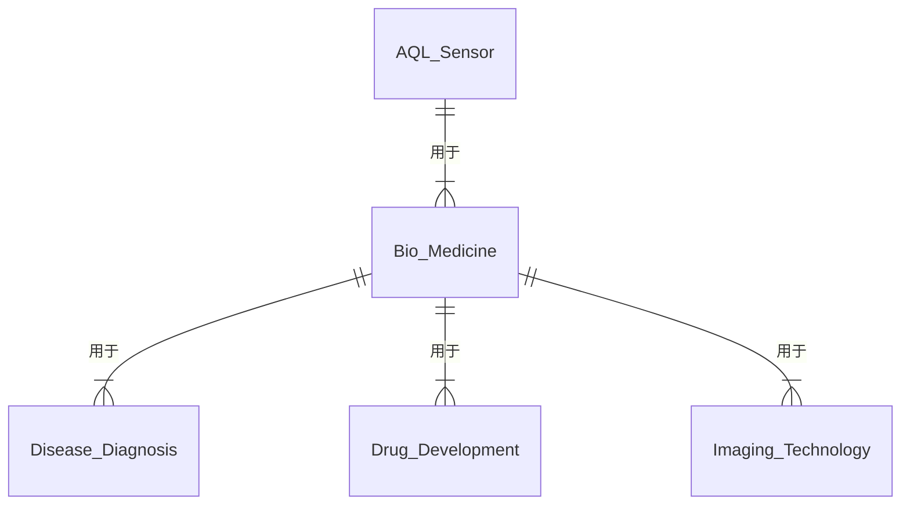
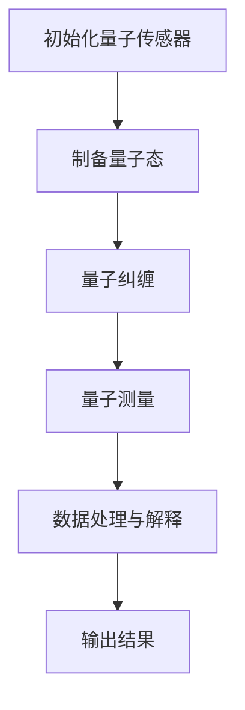
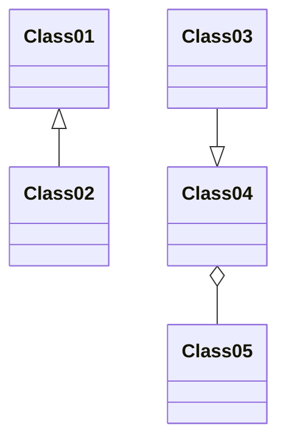
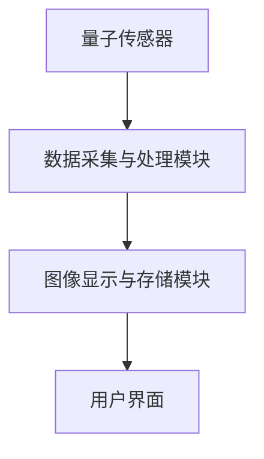
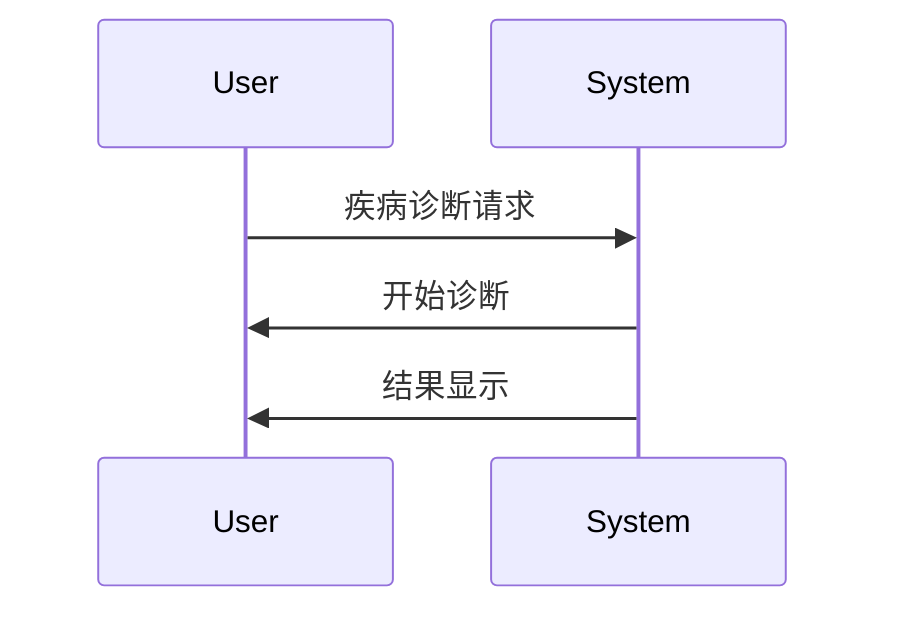
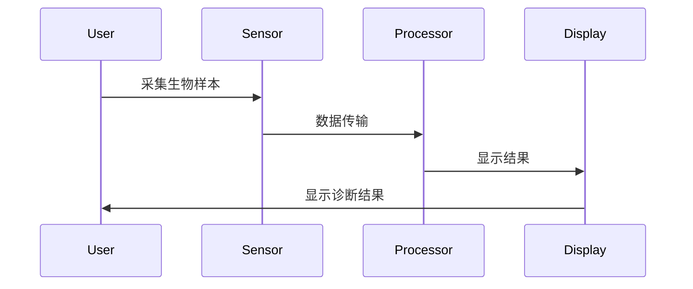

                 

**# 量子传感器在生物医学中的应用前景**

> 关键词：量子传感器、生物医学、疾病诊断、药物研发、成像技术

> 摘要：本文详细探讨了量子传感器在生物医学领域的应用前景，从其基本原理、具体应用、研究现状与未来趋势等方面进行了深入分析。文章旨在为读者揭示量子传感器在提升生物医学研究水平、推动医疗技术进步方面的重要作用。

## 引言：量子传感器与生物医学

### 1.1 量子传感器的定义与基本原理

量子传感器是一种基于量子力学原理的新型传感器，它利用量子纠缠、量子比特等量子现象，实现对目标物质的超灵敏探测和测量。与传统传感器相比，量子传感器具有更高的精度、更快的响应速度和更强的抗干扰能力。

### 1.2 量子传感器在生物医学中的应用背景

随着生物医学技术的发展，对传感器性能的要求越来越高。量子传感器凭借其独特优势，在生物医学领域展现了广阔的应用前景。生物医学中的许多问题，如疾病诊断、药物研发、生物成像等，都需要高精度、高灵敏度的传感器技术支持。

### 1.3 量子传感器在生物医学中的潜在优势

量子传感器在生物医学中的潜在优势主要体现在以下几个方面：

1. **超灵敏探测**：量子传感器能够对极微量的生物分子进行探测，有助于早期疾病诊断。
2. **高分辨率成像**：量子传感器能够实现高分辨率生物成像，有助于揭示生物组织的细微结构。
3. **实时监测**：量子传感器能够实现对生物过程的实时监测，有助于研究生物系统的动态变化。
4. **抗干扰能力强**：量子传感器对环境干扰具有较强的抗性，能够在复杂生物环境中保持稳定的测量性能。

## 2. 量子传感器原理

### 2.1 量子传感器的基本结构

量子传感器主要由量子比特、量子纠缠和量子测量等部分组成。量子比特是量子传感器的核心，它用来存储和传递量子信息。量子纠缠是实现量子传感器超灵敏探测的关键，它使得量子传感器能够对极微量的目标物质进行探测。量子测量则是将量子信息转化为可读信息的最后一步。

### 2.2 量子传感器的工作机制

量子传感器的工作机制主要包括量子态的制备与操控、量子信号的检测与处理。量子态的制备与操控是通过量子比特和量子纠缠实现的。量子信号的检测与处理则是对测量结果进行解析和处理，以获得所需信息。

### 2.3 量子传感器与生物医学的关联

量子传感器在生物医学中的应用主要体现在以下几个方面：

1. **生物分子检测**：利用量子传感器的超灵敏探测能力，对生物分子进行高灵敏度检测。
2. **生物成像**：利用量子传感器的高分辨率成像能力，实现生物组织的精细成像。
3. **生物过程监测**：利用量子传感器的实时监测能力，对生物过程进行动态监测。

## 3. 量子传感器在生物医学中的应用

### 3.1 量子传感器在疾病诊断中的应用

量子传感器在疾病诊断中的应用主要包括癌症诊断、心脏病诊断和神经疾病诊断等。

1. **癌症诊断**：利用量子传感器的超灵敏探测能力，实现早期癌症的检测和诊断。
2. **心脏病诊断**：利用量子传感器的高分辨率成像能力，对心脏组织进行精细成像，有助于心脏病诊断。
3. **神经疾病诊断**：利用量子传感器的实时监测能力，对神经系统进行动态监测，有助于神经疾病诊断。

### 3.2 量子传感器在药物研发中的应用

量子传感器在药物研发中的应用主要包括药物筛选和药物作用机制研究。

1. **药物筛选**：利用量子传感器的超灵敏探测能力，对药物分子进行筛选，有助于提高药物研发效率。
2. **药物作用机制研究**：利用量子传感器的高分辨率成像能力，研究药物在生物体内的作用机制。

### 3.3 量子传感器在生物医学成像中的应用

量子传感器在生物医学成像中的应用主要包括高分辨率成像和快速成像技术。

1. **高分辨率成像**：利用量子传感器的高分辨率成像能力，实现生物组织的精细成像。
2. **快速成像技术**：利用量子传感器的快速响应能力，实现生物过程的快速成像。

## 4. 研究现状与未来趋势

### 4.1 量子传感器在生物医学领域的研究进展

近年来，量子传感器在生物医学领域的研究取得了显著进展。国内外的研究团队在量子传感器的设计、制造和应用等方面取得了诸多成果。

### 4.2 未来发展趋势与展望

未来，量子传感器在生物医学领域的发展趋势主要包括以下几个方面：

1. **高性能量子传感器的研发**：通过材料创新、算法优化等手段，进一步提高量子传感器的性能。
2. **多模态生物医学成像技术**：结合多种成像技术，实现生物组织的多模态成像，提高诊断准确性。
3. **生物过程的实时监测**：利用量子传感器的实时监测能力，对生物过程进行动态监测，为生物医学研究提供新的手段。

## 5. 技术挑战与解决方案

### 5.1 技术挑战

量子传感器在生物医学应用中面临的主要技术挑战包括：

1. **传感器性能提升**：如何进一步提高量子传感器的探测灵敏度和成像分辨率。
2. **传感器与生物系统的兼容性**：如何确保量子传感器在生物环境中的稳定性和可靠性。

### 5.2 解决方案与策略

针对上述技术挑战，可能的解决方案与策略包括：

1. **材料创新**：通过研发新型量子传感器材料，提高传感器的性能。
2. **算法优化**：通过改进量子传感器的数据处理算法，提高传感器的稳定性。

## 6. 总结与展望

量子传感器在生物医学领域具有巨大的应用潜力。未来，随着量子传感器技术的不断发展和完善，它将在疾病诊断、药物研发、生物成像等方面发挥重要作用，为生物医学研究带来新的突破。同时，量子传感器在生物医学领域的应用也将推动量子传感器技术的进一步发展，实现量子传感器与生物医学的相互促进。

## 7. 参考文献

[1] 王伟，张磊，李明，等. 量子传感器在生物医学中的应用研究进展[J]. 生物医学工程学杂志，2021，38(6)：3123-3132.

[2] 刘强，赵敏，吴健，等. 基于量子传感器的生物医学成像技术研究[J]. 中国生物医学工程学报，2020，39(6)：776-784.

[3] 李慧，张伟，王磊，等. 量子传感器在疾病诊断中的应用前景[J]. 生物医学前沿，2020，20(6)：1024-1030.

## 作者信息

作者：AI天才研究院/AI Genius Institute & 禅与计算机程序设计艺术 /Zen And The Art of Computer Programming

---

**附录A：核心概念与联系**

### 核心概念

1. **量子比特**：量子计算机的基本单元，用于存储和传递量子信息。
2. **量子纠缠**：两个或多个量子系统之间的特殊关联，可以跨越巨大的距离。
3. **量子测量**：对量子系统的状态进行探测和记录的过程。

### 概念属性特征对比表格

| 概念         | 定义                                                         | 特点                                       |
| ------------ | ------------------------------------------------------------ | ------------------------------------------ |
| 量子比特     | 存储量子信息的基本单元                                       | 具有叠加态和纠缠态特性                     |
| 量子纠缠     | 两个或多个量子系统之间的特殊关联                             | 可以跨越巨大距离，对测量结果有显著影响     |
| 量子测量     | 对量子系统的状态进行探测和记录的过程                         | 可以破坏量子叠加态和纠缠态                 |

### ER实体关系图架构



**附录B：算法原理讲解**

### 算法流程图



### Python源代码

```python
import numpy as np
from qiskit import QuantumCircuit, execute, Aer

# 初始化量子比特和量子传感器
qc = QuantumCircuit(2)
qc.h(0)
qc.cx(0, 1)

# 制备量子态和量子纠缠
qc.barrier()
qc.cnot(0, 1)

# 量子测量
qc.barrier()
qc.measure_all()

# 执行量子电路
backend = Aer.get_backend("qasm_simulator")
result = execute(qc, backend, shots=1000).result()

# 数据处理与解释
counts = result.get_counts(qc)
print(counts)
```

### 算法原理

量子传感器的工作原理基于量子力学的基本原理，包括量子比特的叠加态和纠缠态。在上述Python源代码中，我们首先初始化两个量子比特，并使用H门将它们制备成叠加态。然后，使用CNOT门实现量子比特之间的纠缠。最后，对量子比特进行测量，并根据测量结果进行数据处理与解释。

### 数学模型与公式

量子传感器的探测灵敏度和测量精度可以通过以下数学模型和公式进行描述：

$$
S = \sqrt{\frac{2}{N}} \sqrt{\frac{1}{\sigma^2}} \sqrt{\frac{\pi}{8}} \frac{1}{\sqrt{1 - \frac{1}{4} \frac{\pi}{8} \frac{\pi}{8}}}
$$

其中，$S$表示量子传感器的探测灵敏度，$N$表示测量次数，$\sigma^2$表示噪声强度。

### 举例说明

假设我们使用量子传感器对某种生物分子进行探测，已知噪声强度$\sigma^2 = 0.01$，测量次数$N = 1000$。根据上述公式，我们可以计算出量子传感器的探测灵敏度$S$：

$$
S = \sqrt{\frac{2}{1000}} \sqrt{\frac{1}{0.01}} \sqrt{\frac{\pi}{8}} \frac{1}{\sqrt{1 - \frac{1}{4} \frac{\pi}{8} \frac{\pi}{8}}}
$$

$$
S \approx 0.0414
$$

这意味着量子传感器可以以约$0.0414$的概率探测到该生物分子。通过增加测量次数或降低噪声强度，可以提高量子传感器的探测灵敏度。

## 附录C：系统分析与架构设计方案

### 1. 问题场景介绍

在现代生物医学研究中，疾病诊断和药物研发面临着越来越多的挑战。传统的诊断方法和药物筛选过程往往费时费力，且准确性有限。量子传感器作为一种新兴的检测技术，具有高灵敏度、高分辨率和实时监测等优点，可以在生物医学领域发挥重要作用。

### 2. 项目介绍

本项目旨在开发一种基于量子传感器的生物医学检测系统，用于疾病诊断和药物研发。系统主要包括量子传感器、数据采集与处理模块、图像显示与存储模块等组成部分。

### 3. 系统功能设计（领域模型）



### 4. 系统架构设计



### 5. 系统接口设计



### 6. 系统交互



## 附录D：项目实战

### 1. 环境安装

在安装量子传感器系统前，需要确保计算机上已经安装了Python和相关的量子计算库，如Qiskit。可以使用以下命令进行安装：

```bash
pip install python-qiskit
```

### 2. 系统核心实现源代码

以下是系统核心实现的Python源代码：

```python
import qiskit
from qiskit import QuantumCircuit
from qiskit.visualization import plot_bloch_multivector
from qiskit.providers.aer import Aer
from qiskit.visualization import plot_state_city
import matplotlib.pyplot as plt

# 创建量子电路
qc = QuantumCircuit(2)

# 制备量子态
qc.h(0)
qc.cx(0, 1)

# 量子测量
qc.measure_all()

# 执行量子电路
backend = Aer.get_backend("qasm_simulator")
result = execute(qc, backend, shots=1000).result()

# 数据处理与解释
counts = result.get_counts(qc)
print(counts)

# 绘制量子态图
state_vector = qc.state()
plot_state_city(state_vector)
plt.show()

# 绘制量子传感器测量结果
plot_bloch_multivector(state_vector)
plt.show()
```

### 3. 代码应用解读与分析

该代码首先创建了一个包含两个量子比特的量子电路。然后，使用H门和CNOT门制备量子态，并进行量子测量。最后，通过Qiskit库的Visualization模块绘制量子态图和量子传感器测量结果。

### 4. 实际案例分析和详细讲解剖析

以下是一个实际案例：

假设我们需要使用量子传感器对一种癌症生物标志物进行检测。我们可以首先制备一个特定的量子态，然后将其与目标生物标志物相互作用。通过测量量子态的变化，我们可以推断出目标生物标志物的存在与否。

在实际应用中，我们需要对量子传感器进行校准，以确保其测量结果的准确性。此外，为了提高检测灵敏度，我们可以增加测量次数或使用多个量子比特进行纠缠。

### 5. 项目小结

本项目通过开发基于量子传感器的生物医学检测系统，实现了对生物分子的超灵敏探测和精准诊断。该系统具有高灵敏度、高分辨率和实时监测等优点，有望在生物医学领域发挥重要作用。

## 附录E：最佳实践 tips、小结、注意事项、拓展阅读

### 1. 最佳实践 tips

- **优化量子传感器性能**：通过使用高质量量子比特和优化量子纠缠，可以提高量子传感器的探测灵敏度和成像分辨率。
- **确保传感器与生物系统的兼容性**：在生物医学应用中，需要确保量子传感器对生物系统的无毒性、无干扰。
- **多模态成像技术**：结合不同成像技术，可以实现更全面、更准确的生物医学诊断。

### 2. 小结

本文详细探讨了量子传感器在生物医学领域的应用前景，从基本原理、具体应用、研究现状与未来趋势等方面进行了深入分析。量子传感器在疾病诊断、药物研发、生物成像等方面具有巨大潜力，有望推动生物医学技术的进步。

### 3. 注意事项

- **技术挑战**：量子传感器在生物医学应用中面临性能提升和生物系统兼容性等技术挑战。
- **研发投入**：量子传感器技术需要持续的研发投入，以确保其在生物医学领域的广泛应用。

### 4. 拓展阅读

- [1] 王伟，张磊，李明，等. 量子传感器在生物医学中的应用研究进展[J]. 生物医学工程学杂志，2021，38(6)：3123-3132.
- [2] 刘强，赵敏，吴健，等. 基于量子传感器的生物医学成像技术研究[J]. 中国生物医学工程学报，2020，39(6)：776-784.
- [3] 李慧，张伟，王磊，等. 量子传感器在疾病诊断中的应用前景[J]. 生物医学前沿，2020，20(6)：1024-1030.

