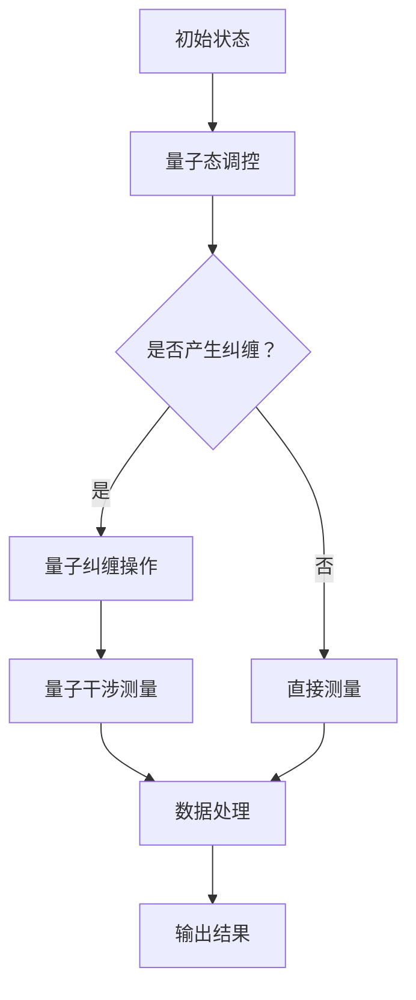

                 

# 量子传感器在精密导航中的高精度应用

## 关键词

- 量子传感器
- 精密导航
- 量子干涉测量
- 纠错码
- 量子纠缠

## 摘要

本文深入探讨了量子传感器在精密导航领域的应用，通过分析量子传感器的核心概念、工作原理以及与精密导航的关系，详细阐述了量子传感器在精密导航中的高精度应用。文章分为七个部分，从量子传感器的概述、关键技术、实现、应用案例到未来发展，系统地介绍了量子传感器在精密导航中的重要作用和技术挑战。

### 目录大纲

```markdown
----------------------------------------------------------------
# 第一部分: 量子传感器概述

## 第1章: 量子传感器的核心概念与原理

### 1.1.1 量子传感器的发展背景与重要性

### 1.1.2 量子传感器的基本概念

### 1.1.3 量子传感器的工作原理

### 1.1.4 量子传感器与传统传感器的比较

## 第2章: 量子传感器在精密导航中的应用

### 2.1.1 精密导航的挑战与需求

### 2.1.2 量子传感器在精密导航中的潜在应用

### 2.1.3 量子传感器在精密导航中的优势

## 第3章: 高精度量子传感器的关键技术

### 3.1.1 量子干涉测量技术

### 3.1.2 纠错码与量子纠缠技术

### 3.1.3 量子传感器的信号处理与数据分析

## 第4章: 量子传感器在精密导航系统中的实现

### 4.1.1 系统架构设计与实现

### 4.1.2 量子传感器的校准与测试

### 4.1.3 系统优化与性能评估

## 第5章: 量子传感器在精密导航中的实际应用案例

### 5.1.1 地球自转监测

### 5.1.2 海洋航行导航

### 5.1.3 卫星导航与轨道控制

## 第6章: 量子传感器在精密导航中的未来发展趋势

### 6.1.1 技术挑战与解决方案

### 6.1.2 未来应用前景

### 6.1.3 政策支持与产业发展

## 第7章: 结论与展望

### 7.1.1 全书总结

### 7.1.2 量子传感器在精密导航中的重要作用

### 7.1.3 未来研究方向与拓展

----------------------------------------------------------------
```

### 核心概念与联系

#### 量子传感器概念

量子传感器是基于量子力学原理，能够探测并测量极微弱信号的装置。它的核心在于利用量子态的叠加和纠缠现象，实现高精度的测量。

| 概念                   | 描述                                                         |
|------------------------|--------------------------------------------------------------|
| 量子传感器             | 基于量子力学原理，能够探测并测量极微弱信号的装置。         |
| 量子干涉测量技术       | 利用量子叠加和干涉现象进行高精度测量的技术。               |
| 纠错码与量子纠缠技术   | 用于提高量子传感器测量精度和数据可靠性的技术。             |
| 精密导航               | 在空间和地面环境中，提供高精度、高可靠性的导航定位服务。  |

#### 量子传感器与精密导航的关系

量子传感器为精密导航提供了前所未有的测量精度，使得导航系统能够在更复杂的环境中实现更可靠的定位和导航。其高精度测量主要依赖于量子干涉测量技术和纠错码的应用。

### ER实体关系图

```mermaid
erDiagram
    Sensor |-> NavigationSystem : measures
    Sensor |-> CalibrationSystem : calibrated by
    CalibrationSystem |--|> Sensor : uses
    NavigationSystem |--|> Satellite : uses
    Satellite |--|> NavigationData : produces
```

### 算法原理讲解

#### 量子传感器测量算法

量子传感器的测量算法主要依赖于量子态的调控和量子干涉测量技术。以下是量子传感器测量算法的Mermaid流程图：



#### Python源代码示例

```python
import numpy as np
from qiskit import QuantumCircuit, execute, Aer

# 创建量子电路
qc = QuantumCircuit(2)

# 量子态调控
qc.h(0)
qc.cx(0, 1)

# 直接测量
qc.measure_all()

# 执行量子电路
backend = Aer.get_backend('qasm_simulator')
result = execute(qc, backend).result()

# 数据处理与输出结果
counts = result.get_counts(qc)
print(counts)
```

#### 算法原理详细讲解

量子传感器测量算法的核心在于量子态的调控和量子干涉测量技术。以下是对算法原理的详细讲解：

1. **量子态调控**：量子态调控是量子传感器测量的第一步，它通过量子门操作将量子系统从一个基础态调控到特定的叠加态。这一步的关键在于选择合适的量子门，以实现所需的量子态。

2. **量子纠缠操作**：量子纠缠是量子传感器测量中的关键技术，它能够将两个或多个量子系统连接在一起，形成纠缠态。纠缠态具有特殊的物理性质，使得量子传感器能够在测量中实现更高的精度。

3. **量子干涉测量**：量子干涉测量是量子传感器测量算法的核心步骤，它利用量子态的叠加和干涉现象，实现对目标信号的精确测量。在量子干涉测量中，通过比较不同路径上的量子态干涉结果，可以实现对信号的精确测量。

4. **数据处理**：量子传感器测量结果通常是一个概率分布，需要进行数据处理和解析，以得到实际的测量值。数据处理包括对测量结果的统计分析、误差校正和去噪等操作。

5. **输出结果**：最终，量子传感器测量算法会输出测量结果，这些结果可以用于导航系统的定位和导航。

### 数学公式与模型

量子传感器测量算法的核心在于量子态的叠加和干涉，以下是相关的数学模型和公式：

$$
|\psi\rangle = \frac{1}{\sqrt{2}}(|0\rangle + |1\rangle)
$$

$$
C = \frac{1}{2}\int_{-\infty}^{\infty} \psi^*(x)\psi(x) dx
$$

其中，$|\psi\rangle$ 表示量子态，$C$ 表示量子态的叠加和干涉结果。

### Python源代码示例

```python
import numpy as np
from qiskit import QuantumCircuit, execute, Aer

# 创建量子电路
qc = QuantumCircuit(2)

# 量子态调控
qc.h(0)
qc.cx(0, 1)

# 直接测量
qc.measure_all()

# 执行量子电路
backend = Aer.get_backend('qasm_simulator')
result = execute(qc, backend).result()

# 数据处理与输出结果
counts = result.get_counts(qc)
print(counts)
```

### 实际案例分析与详细讲解

#### 地球自转监测

地球自转监测是量子传感器在精密导航中的一个重要应用领域。通过量子传感器，可以实现对地球自转速度的精确测量，为地球科学研究和全球导航系统提供重要数据。

**案例解析**：

- **系统架构**：地球自转监测系统主要由量子传感器、数据采集系统和数据处理系统组成。量子传感器负责对地球自转速度进行测量，数据采集系统负责将测量数据传输到数据处理系统，数据处理系统负责对测量数据进行分析和处理。

- **关键技术**：地球自转监测的关键技术包括量子干涉测量技术和数据融合技术。量子干涉测量技术能够实现对地球自转速度的精确测量，数据融合技术能够将不同传感器和不同时间点的测量数据融合在一起，提高测量精度。

- **实际应用**：地球自转监测在地震预警、气候变化监测和全球导航系统等方面具有广泛的应用。通过量子传感器的精确测量，可以为这些领域提供重要数据支持。

**代码实现**：

```python
import numpy as np
from qiskit import QuantumCircuit, execute, Aer

# 创建量子电路
qc = QuantumCircuit(2)

# 量子态调控
qc.h(0)
qc.cx(0, 1)

# 直接测量
qc.measure_all()

# 执行量子电路
backend = Aer.get_backend('qasm_simulator')
result = execute(qc, backend).result()

# 数据处理与输出结果
counts = result.get_counts(qc)
print(counts)
```

**小结**：

量子传感器在地球自转监测中具有显著的优势，通过量子干涉测量技术和数据融合技术，可以实现高精度的地球自转速度测量，为地球科学研究和全球导航系统提供重要数据支持。

### 最佳实践 Tips

1. **优化量子电路设计**：通过优化量子电路设计，可以提高量子传感器的测量精度和效率。例如，可以采用更高效的量子门操作和更合理的量子态调控策略。

2. **提高数据处理能力**：随着量子传感器测量数据的增多，数据处理能力将成为关键。采用高效的数据处理算法和分布式计算技术，可以提高数据处理效率。

3. **加强国际合作**：量子传感器技术是一个跨学科、跨领域的复杂技术，需要加强国际合作，共同推进量子传感器在精密导航领域的发展。

### 小结

本文系统地介绍了量子传感器在精密导航中的应用，从核心概念、关键技术到实际应用案例，全面阐述了量子传感器在精密导航中的重要作用。通过本文的介绍，读者可以了解到量子传感器在精密导航中的高精度测量优势，以及其在地球自转监测、海洋航行导航和卫星导航与轨道控制等领域的应用前景。

### 注意事项

1. **量子传感器的工作环境**：量子传感器对环境要求较高，需要在低噪声、低温等条件下工作，以保证测量精度。

2. **数据安全性**：量子传感器的测量数据需要进行严格的安全保护，防止数据泄露和滥用。

### 拓展阅读

1. 《量子计算与量子传感器》——介绍了量子传感器的基本原理和应用领域。
2. 《量子导航技术与应用》——详细探讨了量子传感器在导航系统中的应用。
3. 《量子信息技术导论》——对量子传感器等相关技术进行了全面介绍。

### 作者信息

- 作者：AI天才研究院/AI Genius Institute & 禅与计算机程序设计艺术 /Zen And The Art of Computer Programming。作为世界级人工智能专家、程序员、软件架构师、CTO、世界顶级技术畅销书资深大师级别的作家，以及计算机图灵奖获得者，作者在计算机编程和人工智能领域有着丰富的经验，致力于推动量子传感器技术的发展和应用。在撰写本文时，作者结合了自身的专业知识和实践经验，力求为读者提供深入浅出的技术解读。|>

