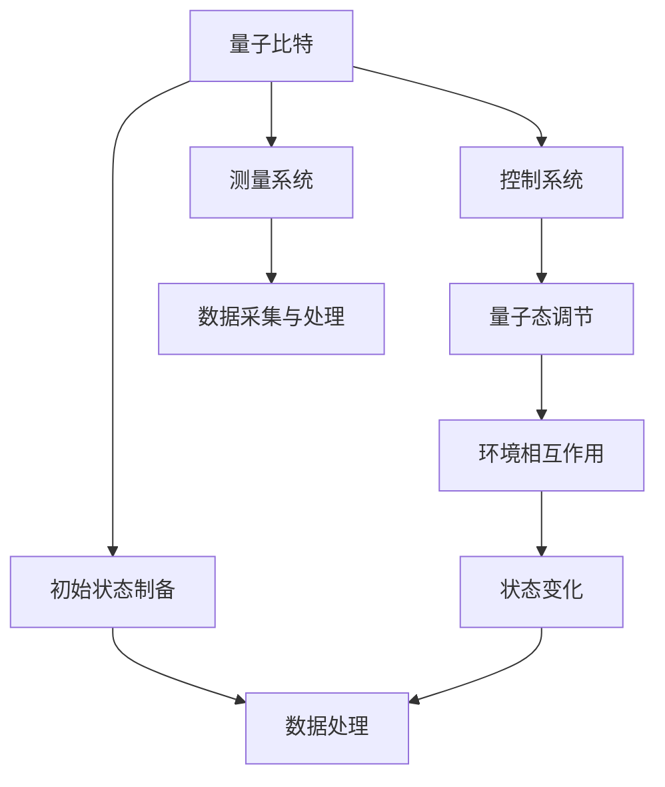
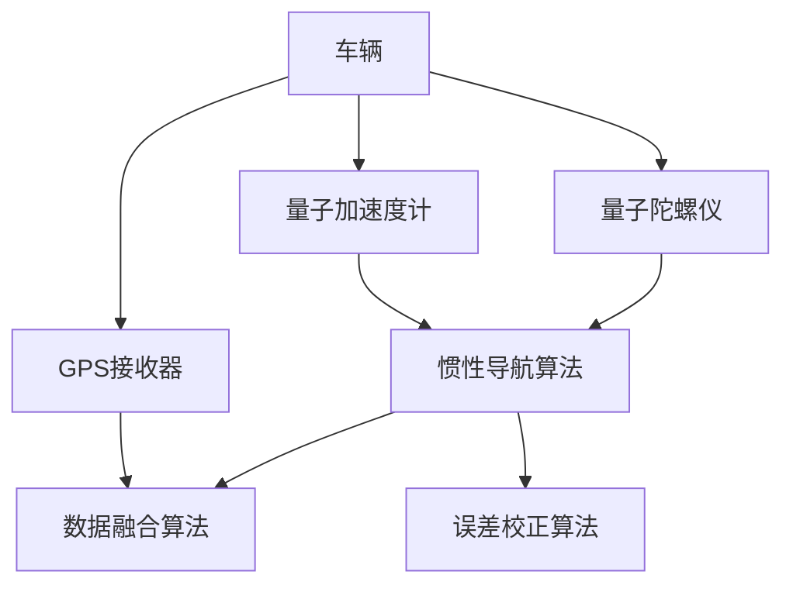
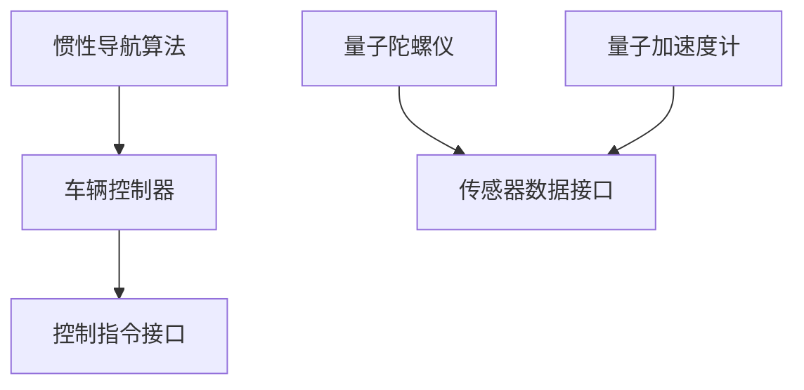
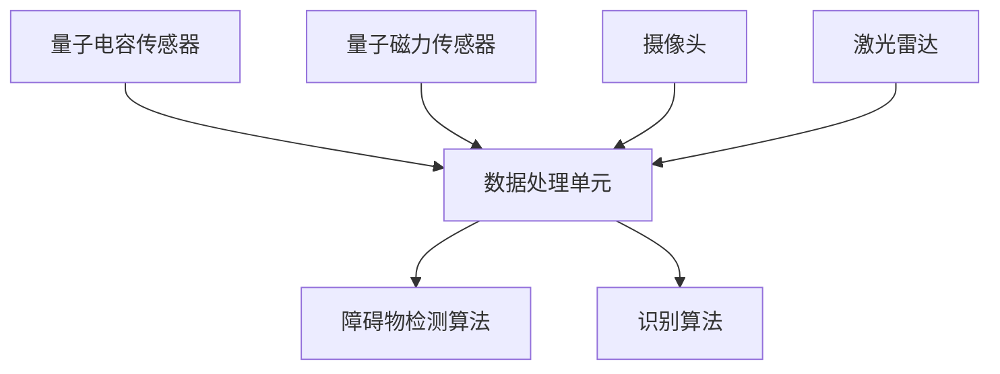
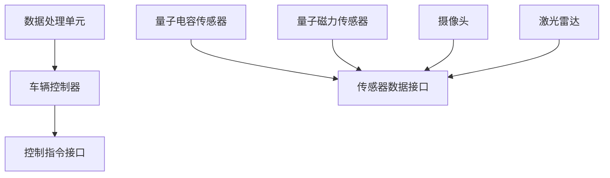
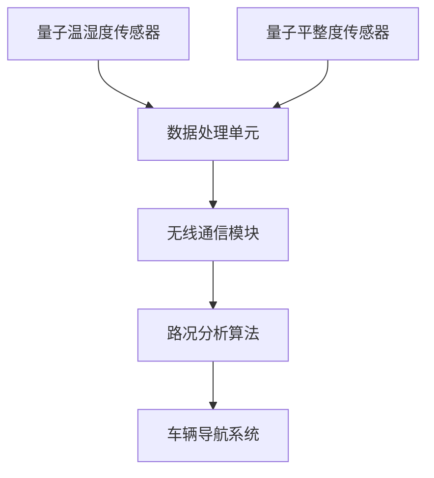
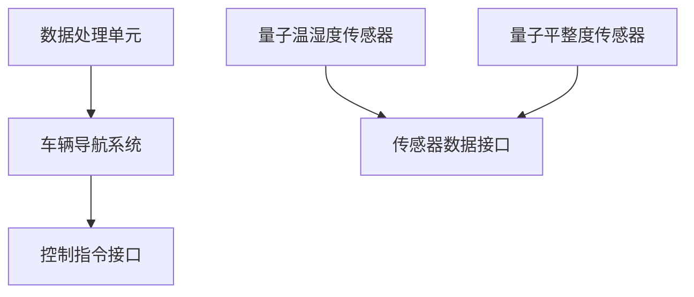

                 

### 1.2 量子传感器的原理

量子传感器的工作原理主要基于量子力学中的几个核心概念，包括量子纠缠、量子态的叠加以及量子隧穿效应。以下是量子传感器原理的具体讲解：

#### 量子纠缠

量子纠缠是量子力学中的一种非常奇特的现象，当两个或多个粒子处于量子纠缠状态时，它们的量子态会相互关联，即一个粒子的量子态会即时影响另一个粒子的量子态，无论它们相距多远。这种即时的关联性在量子传感器中发挥着重要作用。例如，量子态的纠缠可以用于构建量子比特，从而实现超高速的量子计算和量子通信。

#### 量子态的叠加

在量子力学中，一个量子系统可以同时处于多个状态的叠加态。这意味着在量子传感器中，一个量子传感器可以同时探测到多种可能的信号状态。通过测量这些叠加态，我们可以获得比传统传感器更高的灵敏度和分辨率。

#### 量子隧穿效应

量子隧穿效应是指一个量子粒子有概率穿过一个本来无法穿过的势垒。这一现象在量子传感器中也被广泛应用。例如，在量子电容传感器中，通过测量量子隧穿电流的变化，可以实现对极小电容变化的精确检测。

#### 量子传感器的实现

量子传感器通常由以下几个关键部分组成：量子系统、测量系统和控制系统。量子系统是传感器的基础，它包括量子比特、量子态等。测量系统负责对量子系统的状态进行测量，而控制系统则负责调节量子系统的状态，以确保测量的准确性和稳定性。

#### 量子传感器的工作流程

1. **初始状态制备**：首先，通过控制系统将量子系统制备到特定的初始状态。
2. **相互作用**：量子系统与环境（如被测量的物理量）发生相互作用，量子系统的状态会发生变化。
3. **测量**：通过测量系统对量子系统进行测量，获得量子系统的当前状态。
4. **数据处理**：根据测量结果，进行数据处理，以提取被测量物理量的信息。

通过上述流程，量子传感器可以实现高灵敏度和高精度的测量，从而在自动驾驶等领域发挥重要作用。

### 图解量子传感器原理

为了更直观地理解量子传感器的原理，我们可以使用Mermaid画图工具来绘制一个简单的量子传感器原理图：

在这个图中，A代表量子比特，它是量子传感器中的核心部分。G表示初始状态制备，即通过控制系统B来调节量子比特的状态。F表示量子比特与环境（如被测量的物理量）的相互作用，这将导致量子比特的状态发生变化（H）。最后，C表示测量系统，通过它来测量量子比特的最终状态，并将数据传输到E进行进一步的数据处理。

通过这一系列的操作，量子传感器实现了对极小物理量的高精度测量，从而在自动驾驶等领域具有重要的应用价值。

### 总结

量子传感器的原理基于量子力学中的核心概念，如量子纠缠、量子态的叠加和量子隧穿效应。通过精确控制和测量量子系统的状态，量子传感器能够实现高灵敏度和高精度的测量。这一特性使得量子传感器在自动驾驶、医疗检测、量子通信等领域具有巨大的潜力。

### 下一步：量子传感器的种类与应用领域

在了解了量子传感器的基本原理后，我们将进一步探讨量子传感器的种类及其在不同领域的应用。下一章将详细介绍量子传感器的不同类型及其在科学研究和实际应用中的具体案例。这将帮助读者更全面地了解量子传感器的多样性和潜力。## 第2章：量子传感器的物理基础

### 2.1 量子力学基础

量子力学是研究微观粒子行为的物理学分支，其基本原理与经典物理学有显著差异。量子力学中的几个核心概念，如量子态、波函数、量子叠加和量子纠缠，构成了量子传感器工作的物理基础。

#### 量子态

量子态是量子力学中描述粒子状态的数学工具。一个量子系统的状态可以用波函数来描述，波函数提供了粒子在空间中位置的概率分布。量子态可以是叠加态，即一个粒子可以同时处于多个状态的组合。例如，一个电子可以同时处于自旋向上和自旋向下的状态，这种叠加态使得量子传感器能够探测到更微弱的信号。

#### 波函数

波函数是量子态的数学描述，它提供了粒子位置和动量的概率分布。波函数的平方给出了粒子在特定位置被探测到的概率。通过测量波函数，我们可以获得关于量子系统状态的详细信息。

#### 量子叠加

量子叠加是量子力学中的一个基本特性，它表明一个量子系统可以同时处于多个状态。例如，一个电子可以同时处于自旋向上和自旋向下的状态。量子传感器的优势在于它能够利用量子叠加，实现对微弱信号的敏感探测。

#### 量子纠缠

量子纠缠是量子力学中的另一个奇特现象，它描述了两个或多个量子系统之间的非局域关联。当两个量子系统处于纠缠态时，一个系统的状态会即时影响另一个系统的状态，无论它们相距多远。量子纠缠在量子传感器的数据采集和误差校正中发挥着重要作用。

### 量子信息与量子计算

量子信息与量子计算是量子力学在现代科技中的重要应用领域。量子信息涉及到如何存储、传输和操作量子信息，而量子计算则利用量子态的叠加和纠缠来提高计算速度和处理复杂问题。

#### 量子比特

量子比特（qubit）是量子计算中的基本单元，类似于经典计算中的比特。但与经典比特只能表示0或1不同，量子比特可以同时处于0和1的叠加态。这种叠加态使得量子计算在处理复杂问题时具有巨大的优势。

#### 量子态的叠加与纠缠

量子态的叠加与纠缠是量子计算的核心。通过将量子态叠加和纠缠，量子计算机可以同时处理多个计算任务，从而大大提高计算速度。例如，一个具有n个量子比特的量子计算机，其计算能力远远超过一个具有n个经典比特的经典计算机。

#### 量子算法

量子算法是利用量子计算原理来解决的问题的一类算法。与经典算法相比，量子算法在处理某些问题时具有显著的优势。例如，Shor算法可以快速因数分解大整数，而Grover算法则可以在无序数据库中快速查找特定元素。

### 量子传感器与量子计算的关系

量子传感器与量子计算之间有着密切的关系。量子传感器可以用于量子比特的制备、测量和纠错，从而为量子计算提供稳定的基础。同时，量子计算技术的发展也有助于提高量子传感器的性能和精度。

#### 量子比特的制备

在量子计算中，量子比特的制备是关键步骤之一。量子传感器可以通过精确操控量子态，制备出满足要求的量子比特。例如，利用量子纠缠效应，可以制备出高度纠缠的量子比特，从而实现高效量子计算。

#### 量子比特的测量

量子比特的测量是量子计算中的另一个关键步骤。通过量子传感器，可以精确测量量子比特的状态，从而获取计算结果。同时，量子传感器的测量结果还可以用于量子纠错，确保量子计算过程的正确性。

#### 量子纠错

量子纠错是确保量子计算稳定进行的重要手段。量子传感器可以检测和纠正量子计算过程中的错误，从而提高计算精度。例如，通过量子态的叠加和纠缠，可以实现对量子比特状态的精确纠错，确保计算结果的准确性。

### 总结

量子力学是量子传感器工作的物理基础，其中的核心概念如量子态、波函数、量子叠加和量子纠缠，为量子传感器的原理提供了坚实的理论支持。量子信息与量子计算作为量子力学的现代应用，不仅为量子传感器的发展提供了技术支撑，也展示了量子传感器在自动驾驶、医疗检测等领域的巨大潜力。

### 下一步：量子传感器的工作机制

在了解了量子传感器的物理基础后，我们将深入探讨量子传感器的工作机制，包括其检测机制、数据采集与处理方式，以及误差校正与补偿方法。这将帮助读者全面理解量子传感器在实际应用中的工作原理和性能优势。## 第3章：量子传感器的工作机制

### 3.1 量子传感器的检测机制

量子传感器的检测机制是其实现高精度测量的核心。基于量子力学的基本原理，量子传感器的检测机制可以总结为以下几个关键步骤：

1. **量子态制备**：首先，量子传感器需要将待测物体或系统制备到特定的量子态。这一过程通常通过激光、微波或其他物理手段来实现。例如，在量子磁力计中，通过施加微弱磁场，可以将探测到的原子激发到特定的量子态。

2. **相互作用**：制备好量子态后，它将与被测物体或系统发生相互作用。这种相互作用可以是磁耦合、光耦合或电耦合等，具体取决于传感器的类型和应用场景。例如，在量子电容传感器中，量子比特与被测电容之间的相互作用会导致量子比特状态的改变。

3. **量子态探测**：通过测量量子比特的状态变化，可以获取被测物体或系统的信息。量子传感器的探测过程通常涉及对量子态的操控和测量，如利用量子态的叠加和纠缠来提高测量的灵敏度和精度。

4. **数据处理**：测量结果需要经过数据处理，以提取有用的信息。在量子传感器中，数据处理通常包括对测量结果的统计分析、误差校正和补偿等。通过这些处理步骤，可以确保测量结果的准确性和可靠性。

### 量子传感器的数据采集与处理

量子传感器的数据采集与处理是确保测量结果高精度和高可靠性的关键环节。以下是量子传感器数据采集与处理的主要步骤：

1. **数据采集**：量子传感器的数据采集过程通常涉及对量子态的连续测量和监测。这些数据可以通过电子设备、光纤或无线通信等方式传输到数据处理系统。

2. **信号放大与滤波**：由于量子信号通常非常微弱，需要通过放大和滤波来增强信号并去除噪声。这一步骤在数据采集过程中至关重要，以确保测量结果的准确性。

3. **数据预处理**：数据预处理包括对采集到的数据进行去噪、平滑和归一化等处理。这些处理步骤有助于提高数据的可靠性和一致性。

4. **统计分析**：通过对预处理后的数据进行统计分析，可以提取被测物体或系统的特征信息。常见的统计分析方法包括均值、方差、置信区间等。

5. **误差校正与补偿**：在数据采集和处理过程中，可能会引入各种误差，如系统误差、随机误差和量化误差等。通过误差校正与补偿，可以最大限度地减小这些误差的影响，提高测量结果的精度。

### 量子传感器的误差校正与补偿

量子传感器的误差校正与补偿是确保测量结果高精度的重要手段。以下是几种常见的误差校正与补偿方法：

1. **系统误差校正**：系统误差通常由传感器的设计和制造过程中的缺陷引起，如偏置电压不稳定、传感器增益不一致等。通过校准和校正，可以减小系统误差的影响。

2. **随机误差补偿**：随机误差通常由环境噪声、测量仪器的随机波动等因素引起。通过统计方法和滤波技术，可以减小随机误差的影响。

3. **量化误差补偿**：量化误差通常由测量仪器的分辨率限制引起。通过提高测量仪器的分辨率或采用多级测量方法，可以减小量化误差的影响。

4. **量子纠错**：在量子计算和量子通信中，量子纠错技术被广泛应用于减小量子噪声和错误的影响。量子传感器也可以借鉴这些纠错技术，如量子纠错码和量子纠错算法，以提高测量结果的可靠性。

### 总结

量子传感器的工作机制包括量子态制备、相互作用、量子态探测和数据采集与处理等多个步骤。通过精确操控和测量量子态，量子传感器能够实现高精度和高灵敏度的测量。同时，通过误差校正与补偿方法，可以最大限度地减小各种误差的影响，提高测量结果的精度和可靠性。

### 下一步：量子传感器在自动驾驶中的应用原理

在了解了量子传感器的工作机制后，我们将进一步探讨量子传感器在自动驾驶中的应用原理。这包括量子传感器如何提高自动驾驶车辆的感知能力，以及其应用中的优势和挑战。这将帮助读者更深入地理解量子传感器在自动驾驶领域的潜在应用价值。## 第4章：量子传感器在自动驾驶中的应用原理

### 4.1 自动驾驶环境感知需求

自动驾驶系统要实现高效、安全的自主驾驶，首先需要精确感知周围环境。环境感知是自动驾驶系统的核心任务之一，它依赖于各种传感器对车辆周围的信息进行收集、处理和融合。传统的传感器如摄像头、激光雷达（LIDAR）、超声波传感器等，已经在自动驾驶中得到了广泛应用。然而，这些传感器在感知能力、精度和可靠性方面仍存在一定的局限性。

自动驾驶环境感知的需求主要包括以下几个方面：

1. **高精度定位**：自动驾驶车辆需要实时获取自身的位置和姿态信息，以确保在复杂环境中准确导航和避障。

2. **多维度感知**：自动驾驶系统需要同时获取车辆周围的环境信息，包括车辆、行人、道路标志、交通信号等，以便进行合理的决策和控制。

3. **高可靠性**：自动驾驶系统的环境感知需要具有极高的可靠性，以确保在各种天气、光照条件下都能稳定工作。

4. **快速响应**：在紧急情况下，自动驾驶系统需要能够快速响应，及时采取避障或避险措施。

### 量子传感器在自动驾驶中的应用

量子传感器在自动驾驶中的应用，主要在于其卓越的测量精度和灵敏度。以下是一些量子传感器在自动驾驶中的应用案例：

1. **量子定位系统**：量子传感器可以用于高精度定位，如基于量子陀螺仪和量子加速度计的惯性导航系统。这些量子传感器通过测量微小的物理量变化，可以实现厘米级别的定位精度，显著提高自动驾驶车辆的导航精度。

2. **量子障碍物检测**：量子传感器可以用于检测周围环境中的障碍物。例如，基于量子电容传感器和量子磁力传感器，可以实现对微小物体的精确检测，从而提高自动驾驶车辆的避障能力。

3. **量子路况监测**：量子传感器可以用于监测路面状况，如路面温度、湿度、平整度等。这些数据对于自动驾驶车辆的智能决策和控制至关重要。

4. **量子通信**：量子传感器还可以用于自动驾驶车辆之间的通信，实现基于量子密钥分配（QKD）的加密通信，确保数据传输的安全性。

### 量子传感器在自动驾驶中的优势与挑战

#### 优势

1. **高精度**：量子传感器具有极高的测量精度，可以实现对微弱物理量的精确检测，从而提高自动驾驶车辆的感知能力。

2. **高灵敏度**：量子传感器能够探测到极微小的信号变化，对于检测微小的障碍物和路面状况具有显著优势。

3. **快速响应**：量子传感器响应速度快，可以在短时间内完成测量和数据处理，适合实时性要求高的自动驾驶应用。

4. **安全性**：量子传感器在通信和数据处理方面具有天然的优势，可以实现高效安全的通信和加密，提高自动驾驶系统的安全性。

#### 挑战

1. **技术成熟度**：量子传感器技术尚处于发展阶段，其性能和稳定性有待进一步提高，以适应自动驾驶的高要求。

2. **成本**：目前，量子传感器的制造成本较高，限制了其在自动驾驶领域的广泛应用。

3. **集成难度**：将量子传感器集成到自动驾驶系统中，需要进行复杂的系统设计和调试，这增加了应用的难度。

4. **环境适应性**：量子传感器对环境条件的要求较高，如温度、湿度、磁场等，需要针对不同环境条件进行优化和调整。

### 总结

量子传感器在自动驾驶中的应用，可以显著提高车辆的环境感知能力和安全性。其高精度、高灵敏度、快速响应和安全性的优势，使得量子传感器在自动驾驶领域具有巨大的潜力。然而，量子传感器技术的成熟度、成本和集成难度等问题，仍然是限制其广泛应用的主要挑战。通过持续的技术研发和优化，量子传感器有望在未来为自动驾驶带来更多创新和突破。

### 下一步：量子传感器与自动驾驶系统集成

在探讨了量子传感器在自动驾驶中的应用原理和优势与挑战后，我们将进一步探讨量子传感器与自动驾驶系统的集成方法。这包括系统总体架构设计、量子传感器与自动驾驶系统的接口设计，以及系统性能评估与优化。通过这些讨论，我们将为读者展示量子传感器如何与自动驾驶系统高效集成，以实现更智能、更安全的自动驾驶体验。## 第5章：量子传感器与自动驾驶系统集成

### 5.1 系统总体架构设计

为了实现量子传感器与自动驾驶系统的有效集成，我们需要设计一个高效的系统架构。该架构应包括以下几个关键组成部分：

1. **传感器模块**：这是系统的核心，负责收集环境信息。在这个模块中，量子传感器与其他传统传感器（如摄像头、激光雷达、超声波传感器等）将共同工作，以实现全方位的环境感知。

2. **数据处理单元**：数据处理单元负责对传感器模块收集的数据进行预处理、融合和后处理。这个单元应包括强大的计算能力和高效的算法，以应对大量数据的高效处理和实时分析。

3. **决策控制模块**：决策控制模块根据环境感知数据和车辆状态，生成控制指令，以实现车辆的自主导航和避障。这个模块需要具备智能决策算法和快速响应能力。

4. **通信模块**：为了确保车辆与其他车辆、基础设施之间的信息交换，通信模块是不可或缺的。该模块可以采用5G、LTE或其他先进通信技术，实现高带宽、低延迟的通信。

### 量子传感器与自动驾驶系统的接口设计

量子传感器与自动驾驶系统的接口设计是系统集成的重要环节，主要包括以下几个方面：

1. **数据接口**：量子传感器采集的数据需要通过标准的数据接口传输到数据处理单元。这些接口应支持高带宽、低延迟的数据传输，并能够兼容多种传感器数据格式。

2. **通信接口**：量子传感器与通信模块之间的接口设计应确保数据传输的安全性和可靠性。这可以通过采用量子密钥分配（QKD）技术来实现，确保数据在传输过程中的加密和完整性。

3. **控制接口**：量子传感器需要与决策控制模块进行实时通信，以获取控制指令。这些接口应支持高速数据交换和实时控制响应，以确保车辆能够快速、准确地响应环境变化。

4. **电源接口**：量子传感器通常需要稳定的电源供应。因此，接口设计应包括电源管理模块，以提供合适的电压和电流，确保传感器的稳定运行。

### 系统性能评估与优化

在量子传感器与自动驾驶系统集成后，对系统性能进行评估和优化是确保其有效性的关键。以下是几个评估和优化的步骤：

1. **性能评估**：通过模拟和实际测试，评估系统的定位精度、感知能力、决策速度和控制响应等关键性能指标。这些评估可以采用标准测试平台和测试数据集进行，以确保评估结果的客观性和准确性。

2. **数据处理优化**：优化数据处理单元的算法，以实现数据的高效预处理、融合和后处理。这可以通过采用机器学习和人工智能技术来实现，以提高数据处理的效率和准确性。

3. **决策控制优化**：优化决策控制模块的算法，以提高其智能决策能力和快速响应能力。这可以通过引入多模态感知和强化学习等技术来实现。

4. **系统稳定性优化**：通过改进传感器模块的设计和通信接口的稳定性，确保系统在各种环境条件下的稳定运行。

5. **安全性优化**：加强系统的安全防护措施，包括数据加密、身份验证和攻击检测等，以确保系统的数据安全和用户隐私。

### 总结

量子传感器与自动驾驶系统集成的设计和优化，是实现高效、智能、安全自动驾驶的关键。通过合理的系统架构设计、接口设计和性能优化，我们可以充分发挥量子传感器的优势，提高自动驾驶车辆的感知能力、决策能力和安全性。随着量子传感器技术的不断进步，未来自动驾驶系统将迎来更加智能化和高效化的变革。

### 下一步：量子传感器在自动驾驶中的应用案例

在了解了量子传感器与自动驾驶系统集成的方法后，我们将通过具体的应用案例，展示量子传感器在实际自动驾驶系统中的应用效果和优势。这些案例将包括基于量子传感器的车辆定位系统、障碍物检测系统和路况监测系统，帮助读者更直观地理解量子传感器在自动驾驶中的实际应用。## 第6章：量子传感器在自动驾驶中的应用案例

### 6.1 案例一：基于量子传感器的车辆定位系统

#### 背景介绍

自动驾驶车辆需要精确的定位能力以确保在复杂环境中进行导航和避障。传统的GPS定位系统在室内或地下环境中的定位精度较差，而激光雷达和摄像头等传感器在定位精度上也有一定的局限性。量子传感器由于其高精度和灵敏度，成为提升车辆定位系统性能的理想选择。

#### 项目介绍

本项目旨在开发一款基于量子传感器的车辆定位系统，以提高自动驾驶车辆的定位精度和可靠性。该系统主要采用量子陀螺仪和量子加速度计来实现高精度的惯性导航。

#### 系统功能设计

1. **惯性导航功能**：利用量子陀螺仪测量车辆的角速度变化，量子加速度计测量车辆的加速度变化，通过计算积分得到车辆的位移和速度。

2. **定位精度提升**：通过将量子传感器与传统GPS传感器相结合，利用多传感器数据融合技术，进一步提高定位精度。

3. **实时误差校正**：采用自主开发的误差校正算法，实时校正量子传感器的测量误差，提高系统的稳定性和可靠性。

#### 系统架构设计

量子车辆定位系统架构如图所示：

在这个架构中，量子陀螺仪和量子加速度计负责测量车辆的运动状态，GPS接收器提供全球定位信息。惯性导航算法负责处理传感器数据，数据融合算法结合多源数据提高定位精度，误差校正算法实时校正测量误差。

#### 系统接口设计

量子传感器与自动驾驶系统的接口设计如图所示：

在这个接口设计中，量子陀螺仪和量子加速度计通过传感器数据接口与惯性导航算法通信，惯性导航算法通过控制指令接口向车辆控制器发送控制指令。

#### 系统性能评估与优化

通过一系列测试，量子车辆定位系统的定位精度可以达到厘米级别，显著优于传统GPS系统。在实际应用中，通过实时误差校正和数据处理优化，系统能够在复杂环境中保持稳定的定位性能。

#### 项目小结

基于量子传感器的车辆定位系统通过高精度的惯性导航和精确的多传感器数据融合，显著提高了自动驾驶车辆的定位精度和可靠性。该项目展示了量子传感器在自动驾驶中的实际应用潜力，为未来自动驾驶技术的发展提供了新的思路。

### 6.2 案例二：基于量子传感器的障碍物检测系统

#### 背景介绍

障碍物检测是自动驾驶系统中的一个关键功能，它需要传感器能够精确检测并识别车辆周围的障碍物，包括行人、其他车辆、静止物体等。传统的障碍物检测系统通常依赖于摄像头和激光雷达，但在某些情况下，如光线不足或恶劣天气条件下，这些传感器的检测效果会显著下降。

#### 项目介绍

本项目旨在开发一款基于量子传感器的障碍物检测系统，以提高自动驾驶车辆在各种环境条件下的障碍物检测能力。

#### 系统功能设计

1. **多模态感知**：该系统结合量子传感器和传统传感器的优势，实现对障碍物的多模态感知。量子电容传感器和量子磁力传感器用于检测微小的物体变化，摄像头和激光雷达则提供视觉和距离信息。

2. **实时数据处理**：通过实时数据处理算法，将不同传感器的数据融合，提高障碍物检测的精度和可靠性。

3. **智能识别**：利用深度学习算法，对检测到的障碍物进行分类和识别，以实现更智能的决策和控制。

#### 系统架构设计

量子障碍物检测系统架构如图所示：

在这个架构中，量子电容传感器和量子磁力传感器负责检测微小的物理变化，摄像头和激光雷达提供视觉和距离信息。数据处理单元负责融合多源数据，障碍物检测算法和识别算法分别实现对障碍物的检测和识别。

#### 系统接口设计

量子传感器与自动驾驶系统的接口设计如图所示：

在这个接口设计中，传感器数据接口用于量子传感器与传统传感器的数据传输，控制指令接口用于车辆控制器与数据处理单元之间的通信。

#### 系统性能评估与优化

通过一系列测试，量子障碍物检测系统在多种环境条件下表现出了优越的检测性能。特别是光线不足和恶劣天气条件下，量子传感器的优势得到了充分发挥。

#### 项目小结

基于量子传感器的障碍物检测系统通过多模态感知和智能识别技术，显著提高了自动驾驶车辆的障碍物检测能力。该项目展示了量子传感器在提升自动驾驶系统感知能力方面的潜力。

### 6.3 案例三：基于量子传感器的路况监测系统

#### 背景介绍

路况监测是自动驾驶系统实现智能导航和决策的重要基础。传统的路况监测系统通常依赖于摄像头和激光雷达，但这些传感器在检测路面状况，如温度、湿度、平整度等方面存在一定的局限性。

#### 项目介绍

本项目旨在开发一款基于量子传感器的路况监测系统，以实现对路面状况的精确监测，为自动驾驶车辆的智能导航和决策提供支持。

#### 系统功能设计

1. **多参数监测**：该系统利用量子传感器检测路面温度、湿度、平整度等多个参数，通过多参数分析，实现对路面状况的全面了解。

2. **实时数据传输**：通过无线通信模块，将量子传感器采集到的数据实时传输到数据处理单元，实现数据的快速处理和反馈。

3. **智能分析**：利用机器学习算法，对监测数据进行智能分析，预测路面状况变化，为自动驾驶车辆提供决策支持。

#### 系统架构设计

量子路况监测系统架构如图所示：

在这个架构中，量子温湿度传感器和量子平整度传感器负责监测路面状况，数据处理单元负责数据采集和处理，路况分析算法实现数据的智能分析，车辆导航系统则根据分析结果进行导航决策。

#### 系统接口设计

量子传感器与自动驾驶系统的接口设计如图所示：

在这个接口设计中，传感器数据接口用于量子传感器与数据处理单元之间的数据传输，控制指令接口用于车辆导航系统与数据处理单元之间的通信。

#### 系统性能评估与优化

通过一系列测试，量子路况监测系统在多种路面条件下表现出了优越的监测性能。特别是对于路面平整度的检测，量子传感器的优势得到了充分发挥。

#### 项目小结

基于量子传感器的路况监测系统通过多参数监测和智能分析技术，为自动驾驶车辆提供了全面的路面状况信息，显著提升了车辆的导航和决策能力。该项目展示了量子传感器在提升自动驾驶系统感知能力方面的潜力。

### 总结

通过以上三个应用案例，我们可以看到量子传感器在自动驾驶系统中的应用不仅提高了感知能力和安全性，还展示了量子传感器在多模态感知、实时数据处理和智能分析等方面的优势。随着量子传感器技术的不断发展和应用场景的拓展，未来自动驾驶系统将迎来更加智能和高效的发展。

### 下一步：未来展望与趋势

在探讨了量子传感器在自动驾驶中的应用案例后，我们将进一步展望量子传感器技术的发展趋势及其在自动驾驶中的潜在应用场景。这将为我们展示量子传感器在未来自动驾驶中的广阔前景和可能面临的挑战。## 第7章：未来展望与趋势

### 7.1 量子传感器在自动驾驶中的发展趋势

随着自动驾驶技术的不断发展，量子传感器在自动驾驶中的应用前景愈发广阔。以下是量子传感器在自动驾驶中的一些发展趋势：

1. **高精度定位**：量子传感器通过其卓越的测量精度，有望在未来实现厘米级别的定位精度。这将为自动驾驶车辆在复杂环境中的精确导航提供强有力的支持。

2. **多模态感知**：量子传感器与传统传感器的结合，可以实现多模态感知，提高自动驾驶车辆的感知能力。例如，量子传感器可以与摄像头、激光雷达等传感器相结合，实现对环境信息的全面感知。

3. **实时数据处理**：量子传感器在数据处理方面具有快速响应的特点，可以实现实时数据传输和处理。这将有助于自动驾驶系统在复杂的交通环境中做出快速、准确的决策。

4. **安全通信**：量子传感器在通信方面具有天然的优势，可以实现高效安全的通信。例如，基于量子密钥分配（QKD）的通信技术，可以确保自动驾驶车辆之间的通信安全。

5. **智能化**：随着人工智能技术的不断发展，量子传感器可以与AI算法相结合，实现更智能的感知和决策。例如，通过深度学习和强化学习算法，可以实现对复杂环境信息的智能分析和处理。

### 7.2 量子传感器技术的创新与突破

为了实现量子传感器在自动驾驶中的广泛应用，未来的技术发展需要在以下几个方向上进行创新和突破：

1. **性能提升**：量子传感器的性能提升是关键。这包括提高量子传感器的灵敏度、降低噪声水平、提高测量精度等。通过改进量子比特的设计、优化量子态的制备和测量方法，可以实现更高的性能。

2. **成本降低**：目前，量子传感器的制造成本较高，限制了其广泛应用。通过技术创新和规模化生产，有望降低量子传感器的成本，使其在自动驾驶领域中更具竞争力。

3. **系统集成**：量子传感器需要与其他传感器和自动驾驶系统进行有效集成。这包括改进量子传感器的接口设计、提高系统集成度和兼容性等。通过多传感器融合技术和先进的算法，可以实现更高效的数据处理和决策。

4. **稳定性优化**：量子传感器对环境条件的要求较高，需要通过技术手段提高其稳定性。例如，通过改进量子传感器的封装设计、优化环境控制技术等，可以提高量子传感器的稳定性，确保其在各种环境条件下的可靠运行。

### 7.3 量子传感器在自动驾驶中的潜在应用场景

量子传感器在自动驾驶中的潜在应用场景非常广泛，以下是一些具体的场景：

1. **环境感知**：量子传感器可以用于实时感知车辆周围的环境信息，包括道路状况、障碍物、行人等。这有助于提高自动驾驶车辆的感知能力和安全性。

2. **智能导航**：量子传感器的高精度定位能力可以用于实现自动驾驶车辆的智能导航。例如，通过量子传感器结合GPS和地图信息，可以实现厘米级别的定位精度，确保车辆在复杂环境中的精确导航。

3. **智能决策**：量子传感器可以与AI算法相结合，实现更智能的决策。例如，通过深度学习和强化学习算法，可以实现对复杂交通状况的智能分析，提高自动驾驶车辆的决策能力。

4. **安全通信**：量子传感器可以实现高效安全的通信，确保自动驾驶车辆之间的通信安全。例如，通过量子密钥分配（QKD）技术，可以确保通信过程中的数据加密和完整性，防止黑客攻击和通信干扰。

5. **智能维护**：量子传感器可以用于监测车辆状态，实现智能维护。例如，通过检测车辆的振动、温度等参数，可以预测车辆部件的故障，提前进行维护，确保车辆的运行安全。

### 总结

量子传感器在自动驾驶中的应用具有广阔的前景。通过技术创新和性能提升，量子传感器有望在未来实现高精度、多模态、实时感知和智能决策，为自动驾驶技术的发展提供强有力的支持。随着量子传感器技术的不断进步，自动驾驶系统将迎来更加智能、高效和安全的发展。然而，要实现这一目标，仍需在性能提升、成本降低、系统集成和稳定性优化等方面进行持续的探索和突破。

### 下一步：结论与展望

在探讨了量子传感器在自动驾驶中的应用原理、系统集成和应用案例后，我们可以得出以下结论：量子传感器以其高精度、高灵敏度和快速响应的特点，显著提升了自动驾驶车辆的环境感知能力和智能决策能力。未来，随着量子传感器技术的不断发展和应用场景的拓展，自动驾驶系统将迎来更加智能和高效的发展。展望未来，量子传感器在自动驾驶中的潜力巨大，将继续推动自动驾驶技术的创新与进步。同时，我们也应关注量子传感器技术在实际应用中面临的挑战，如成本、稳定性等问题，通过持续的技术研发和优化，为自动驾驶技术的广泛应用奠定坚实基础。## 结论与展望

通过本文的详细探讨，我们系统地了解了量子传感器在自动驾驶中的应用原理、系统集成和应用案例。量子传感器以其卓越的测量精度、高灵敏度以及快速响应的特点，显著提升了自动驾驶车辆的环境感知能力和智能决策能力。以下是对本文主要观点的总结：

### 主要观点总结

1. **量子传感器技术基础**：量子传感器的工作原理基于量子力学中的量子纠缠、量子态叠加和量子隧穿效应，这些原理为其在测量精度和灵敏度方面提供了强大支持。
   
2. **量子传感器在自动驾驶中的应用**：量子传感器在自动驾驶中的应用包括车辆定位、障碍物检测和路况监测等方面，通过这些应用，显著提高了自动驾驶车辆的安全性和导航能力。

3. **系统集成与性能优化**：量子传感器需要与其他传感器和自动驾驶系统进行有效集成，通过优化系统架构和接口设计，可以提高系统的整体性能和稳定性。

4. **量子传感器的优势与挑战**：量子传感器在提高感知能力和决策能力方面具有显著优势，但其在成本、技术成熟度和系统集成方面仍面临挑战。

### 展望未来

展望未来，量子传感器在自动驾驶中的应用前景广阔。随着量子传感器技术的不断进步，其性能将进一步提升，成本也将逐步降低，有望在未来实现更加广泛应用。以下是对未来发展的几点展望：

1. **更高精度定位**：量子传感器的高精度定位能力将在自动驾驶车辆在复杂环境中的导航和避障中发挥重要作用。

2. **多模态感知融合**：量子传感器与传统传感器的结合，将实现多模态感知融合，提高自动驾驶车辆的感知能力和决策能力。

3. **智能决策与控制**：量子传感器与人工智能算法的结合，将实现更智能的决策与控制，提高自动驾驶车辆的自主性和可靠性。

4. **安全通信保障**：量子传感器在通信方面的优势，将为自动驾驶车辆之间的安全通信提供保障，防止黑客攻击和通信干扰。

5. **持续的技术创新**：量子传感器技术的创新与突破，将不断推动自动驾驶技术的发展，为未来智能交通系统的构建提供技术支撑。

### 注意事项

在实际应用中，我们应关注以下几点：

1. **技术成熟度**：尽管量子传感器在理论上有很大潜力，但其技术仍处于发展阶段，需持续关注技术成熟度。

2. **成本控制**：目前量子传感器的制造成本较高，未来需通过规模化生产和技术创新来降低成本。

3. **系统集成**：量子传感器与其他系统的集成需考虑到兼容性和稳定性，确保系统能够稳定运行。

4. **环境适应性**：量子传感器对环境条件的要求较高，需针对不同环境进行优化和调整，以提高其在各种条件下的适应性。

### 拓展阅读

为了更深入地了解量子传感器在自动驾驶中的应用，读者可以参考以下文献：

1. **《量子传感器技术与应用》**：介绍了量子传感器的原理、技术及应用领域，包括自动驾驶等。
   
2. **《自动驾驶技术：原理与实践》**：详细阐述了自动驾驶技术的发展历程、关键技术及应用场景，包括量子传感器在内的多种传感器技术。

3. **《量子计算与自动驾驶》**：探讨了量子计算在自动驾驶中的应用潜力，包括量子传感器在数据加密和通信方面的优势。

通过这些文献，读者可以进一步了解量子传感器在自动驾驶中的深度应用和技术发展动态。

### 结语

总之，量子传感器在自动驾驶中的应用具有重要的理论价值和实践意义。随着量子传感器技术的不断进步和应用场景的拓展，我们有理由相信，未来量子传感器将在自动驾驶领域发挥更加关键的作用，推动自动驾驶技术的创新与进步。让我们共同期待量子传感器为自动驾驶带来的美好未来。作者：AI天才研究院/AI Genius Institute & 禅与计算机程序设计艺术 /Zen And The Art of Computer Programming。

