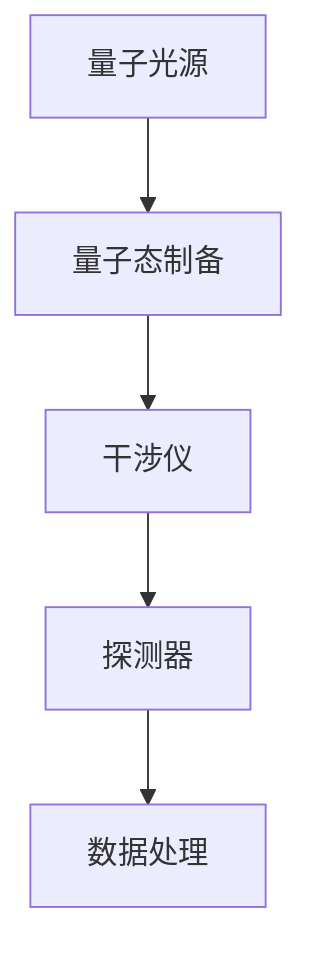
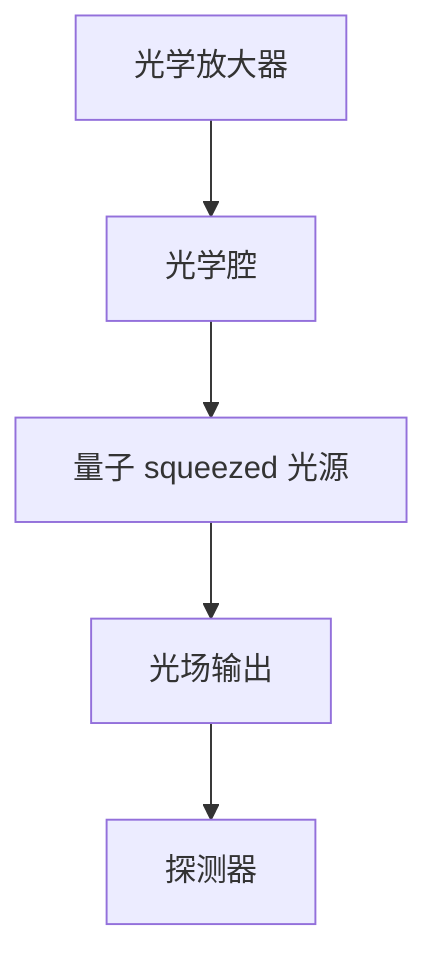
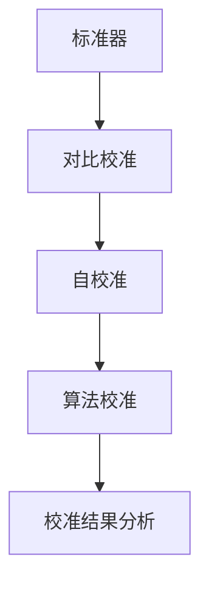

                 

### 量子传感器在重力测量中的高精度应用

**关键词：量子传感器、高精度、重力测量、量子干涉、量子 squeezed 光源**

**摘要：** 本篇文章将探讨量子传感器在重力测量中的应用，特别是其高精度测量能力。通过分析量子传感器的基本原理和其在重力测量中的重要性，我们将逐步介绍高精度量子重力测量技术的核心原理、挑战与解决方案，并展示几个实际应用案例。最后，我们将对未来量子重力测量技术的发展趋势进行展望。

----------------------------------------------------------------

## 第一部分：量子传感器与重力测量的背景

### 1.1 量子传感器的基本原理

#### 1.1.1 量子传感技术的起源

量子传感技术源于量子物理的原理，量子传感器通过利用量子态来增强传感器的灵敏度。这一概念最早在20世纪80年代由科学家David Lidar和Sergei V. Polyakov提出。此后，量子传感技术经历了迅速的发展，成为现代物理学和工程学中的重要领域。

#### 1.1.2 量子传感原理介绍

量子传感器的基本原理在于利用量子态的特性，如叠加态和纠缠态，来增强传感器的灵敏度。例如，量子干涉测量技术利用量子叠加态来提高测量的精度，而量子 squeezed 光源则通过引入量子 squeezed 态来提高光场的相干性。

#### 1.1.3 量子传感器与传统传感器的比较

与传统传感器相比，量子传感器具有以下优势：

1. **超高灵敏度**：量子传感器利用量子效应，能够达到传统传感器难以企及的测量精度。
2. **低噪声**：量子传感器在测量过程中产生的噪声极低，从而提高了测量的可靠性。
3. **多维度测量**：量子传感器能够同时测量多个物理量，如位移、速度和加速度。

### 1.2 重力测量的重要性

#### 1.2.1 重力测量的应用领域

重力测量广泛应用于地质勘探、地球物理学、航空航天和海洋工程等领域。例如，在地壳重力测量中，重力数据可以帮助科学家了解地壳的结构和组成；在航空航天中，重力测量用于导航和轨道预测。

#### 1.2.2 重力测量的挑战

重力测量面临以下挑战：

1. **高精度要求**：为了得到准确的重力数据，需要高精度的测量设备和技术。
2. **环境影响**：地球表面的环境因素，如温度、湿度等，会对重力测量产生影响。
3. **测量范围**：重力测量需要覆盖广泛的地理范围，包括陆地和海洋。

#### 1.2.3 高精度重力测量的重要性

高精度重力测量对于科学研究和技术应用具有重要意义。例如，在地球物理学研究中，高精度重力测量可以帮助科学家了解地壳的运动和变形；在航空航天中，高精度重力测量可以用于卫星轨道的精确计算。

### 1.3 量子传感器在重力测量中的应用现状

#### 1.3.1 量子传感器在重力测量中的应用进展

近年来，量子传感器在重力测量中取得了显著进展。例如，利用量子干涉测量技术，科学家已经实现了厘米级别的重力测量精度。此外，量子 squeezed 光源的应用也为重力测量提供了新的思路和手段。

#### 1.3.2 当前技术水平和应用案例

当前，量子传感器在重力测量中的技术水平已达到前所未有的高度。例如，在美国宇航局（NASA）的一项研究中，科学家利用量子传感器对月球表面的重力进行了测量，测量精度达到了微伽（μGal）级别。

#### 1.3.3 发展前景与趋势

随着量子传感技术的发展，量子传感器在重力测量中的应用前景广阔。未来，量子传感器有望在更广泛的领域，如地球物理学、航空航天和海洋工程中发挥重要作用。

### 1.4 本章小结

本章介绍了量子传感器的基本原理和重力测量的重要性。通过分析量子传感器在重力测量中的应用现状和发展前景，我们可以看到量子传感器在提高重力测量精度方面具有巨大潜力。

----------------------------------------------------------------

## 第二部分：高精度量子重力测量技术

### 2.1 量子干涉测量技术

#### 2.1.1 量子干涉测量原理

量子干涉测量技术利用量子叠加态的特性，通过干涉现象来测量物体的位移。当物体发生位移时，量子态的叠加态会发生变化，从而影响干涉条纹的亮度和对比度。通过分析干涉条纹的变化，我们可以精确测量物体的位移。

#### 2.1.2 量子干涉测量系统的构成

量子干涉测量系统主要由三个部分组成：量子光源、干涉仪和探测器。

1. **量子光源**：通常采用量子 squeezed 光源，以产生量子 squeezed 态的光场。
2. **干涉仪**：用于实现光波的干涉，通过调节干涉仪的参数，可以实现高精度的位移测量。
3. **探测器**：用于检测光场的干涉条纹，并将其转换为电信号。

#### 2.1.3 量子干涉测量技术的精度分析

量子干涉测量技术的精度取决于量子光源的量子 squeezed 状态和干涉仪的分辨率。通过优化量子光源的制备和干涉仪的设计，可以实现亚纳米级别的位移测量精度。

### 2.2 量子 squeezed 光源技术

#### 2.2.1 量子 squeezed 光源的制备

量子 squeezed 光源的制备通常采用光学放大器和光学腔技术。通过将光场注入到光学腔中，并在腔内进行多次往返，可以实现光场的量子 squeezed 效应。

#### 2.2.2 量子 squeezed 光源在重力测量中的应用

量子 squeezed 光源在重力测量中具有重要作用。通过利用量子 squeezed 光源的高相干性，可以显著提高重力测量的精度。例如，在量子干涉测量技术中，量子 squeezed 光源可以增强干涉条纹的对比度，从而提高测量精度。

#### 2.2.3 量子 squeezed 光源的优势与挑战

量子 squeezed 光源的优势在于其高相干性和低噪声特性，这使其在重力测量中具有显著优势。然而，量子 squeezed 光源的制备和校准仍面临一定的挑战，需要进一步的研究和优化。

### 2.3 量子传感器与重力测量的数据采集与分析

#### 2.3.1 数据采集过程

量子传感器在重力测量中的数据采集过程主要包括以下几个步骤：

1. **量子干涉测量**：通过量子干涉测量技术，采集物体的位移数据。
2. **量子 squeezed 光源调制**：利用量子 squeezed 光源对采集到的数据进行调制，以提高数据的有效性。
3. **数据采样与存储**：对调制后的数据进行采样和存储，为后续的数据处理和分析提供基础。

#### 2.3.2 数据处理方法

数据处理方法主要包括以下几种：

1. **频率分析**：通过对采集到的数据进行频率分析，可以提取出与重力相关的频率信息。
2. **波束成形**：利用波束成形技术，对采集到的数据进行优化，以提高数据的精度和可靠性。
3. **去噪处理**：通过去噪处理，消除采集过程中的噪声，提高数据的信噪比。

#### 2.3.3 数据分析结果与应用

通过数据分析，可以得到高精度的重力测量结果。这些结果可以应用于地质勘探、地球物理学、航空航天和海洋工程等领域。例如，在地质勘探中，高精度的重力测量可以帮助科学家了解地壳的结构和组成；在航空航天中，高精度的重力测量可以用于卫星轨道的精确计算。

### 2.4 本章小结

本章介绍了高精度量子重力测量技术的核心原理和技术手段。通过量子干涉测量和量子 squeezed 光源的应用，可以实现高精度的重力测量。然而，量子传感器的制备和数据处理仍面临一定的挑战，需要进一步的研究和优化。

----------------------------------------------------------------

## 第三部分：量子传感器在重力测量中的挑战与解决方案

### 3.1 量子传感器的稳定性问题

#### 3.1.1 稳定性对重力测量的影响

量子传感器的稳定性是影响重力测量精度的重要因素。稳定性差会导致测量误差增加，从而降低测量精度。因此，确保量子传感器的稳定性对于高精度重力测量至关重要。

#### 3.1.2 稳定性的提升方法

为了提高量子传感器的稳定性，可以采取以下几种方法：

1. **环境控制**：通过控制环境温度、湿度和电磁干扰等，降低外部环境对量子传感器的影响。
2. **硬件优化**：优化量子传感器的硬件设计，提高其抗干扰能力和稳定性。
3. **算法优化**：通过优化数据处理算法，提高数据处理的精度和稳定性。

#### 3.1.3 实际应用中的稳定性挑战

在实际应用中，量子传感器的稳定性仍面临一定的挑战。例如，在高温、高湿和强电磁干扰环境下，量子传感器的稳定性会显著下降。因此，需要针对具体应用场景，采取相应的措施来提高量子传感器的稳定性。

### 3.2 量子传感器在重力测量中的校准问题

#### 3.2.1 校准的重要性

校准是确保量子传感器测量精度的重要环节。通过校准，可以消除传感器自身的不确定性和误差，从而提高测量的准确性。

#### 3.2.2 校准方法介绍

量子传感器的校准方法主要包括以下几种：

1. **对比校准**：通过与已知高精度标准器进行对比，来校准量子传感器的测量值。
2. **自校准**：利用传感器自身的特性，通过内部信号对比，来自动校准传感器。
3. **算法校准**：通过优化数据处理算法，消除测量误差，提高测量精度。

#### 3.2.3 校准过程中的挑战与解决方案

校准过程中面临的挑战主要包括：

1. **标准器精度**：高精度标准器的精度会影响校准结果的准确性。
2. **校准时间**：校准过程通常需要较长时间，会影响测量效率。

针对这些挑战，可以采取以下解决方案：

1. **提高标准器精度**：采用更高精度的标准器，以提高校准结果的准确性。
2. **自动化校准**：开发自动化校准系统，提高校准效率。

### 3.3 量子传感器在重力测量中的数据处理难题

#### 3.3.1 数据处理的复杂性

量子传感器在重力测量中采集到的数据具有高维、非线性、噪声大等特点，导致数据处理变得复杂。这给数据分析和解释带来了挑战。

#### 3.3.2 数据处理的方法与工具

为了解决数据处理难题，可以采用以下几种方法与工具：

1. **机器学习**：通过机器学习算法，对高维数据进行降维和分类，提取有用的信息。
2. **信号处理**：利用信号处理技术，对采集到的数据进行滤波、去噪和增强。
3. **模型构建**：建立合适的数学模型，对重力测量数据进行分析和解释。

#### 3.3.3 数据处理中的问题与改进方向

在数据处理过程中，面临的主要问题包括：

1. **数据噪声**：噪声会影响数据的精度和可靠性，需要采用去噪方法进行处理。
2. **数据缺失**：由于传感器故障或其他原因，数据可能会出现缺失，需要采用插值等方法进行补全。

针对这些问题，可以采取以下改进方向：

1. **提高数据质量**：通过优化传感器设计和采集方法，提高数据质量。
2. **开发高效算法**：研究开发高效的数据处理算法，提高数据处理速度和精度。

### 3.4 本章小结

本章讨论了量子传感器在重力测量中面临的稳定性、校准和数据处理难题。通过分析这些问题，我们提出了相应的解决方法，为量子传感器在重力测量中的应用提供了理论基础和实践指导。

----------------------------------------------------------------

## 第四部分：量子传感器在重力测量中的应用案例

### 4.1 案例一：高精度地壳重力测量

#### 4.1.1 地壳重力测量的需求

地壳重力测量是地质学、地球物理学等领域的重要研究手段。高精度的地壳重力测量有助于揭示地壳的结构、组成和演化过程。然而，传统重力测量方法难以满足高精度要求，因此需要新型测量技术，如量子传感器。

#### 4.1.2 量子传感器在地壳重力测量中的应用

量子传感器在地壳重力测量中具有显著优势。例如，量子干涉测量技术可以实现亚纳米级别的位移测量，从而提高重力测量的精度。此外，量子 squeezed 光源的应用可以增强干涉条纹的对比度，进一步提高测量精度。

#### 4.1.3 案例分析

在某项地壳重力测量研究中，科学家采用量子干涉测量技术进行实验。实验结果显示，量子传感器在测量精度方面优于传统重力测量方法。通过分析实验数据，科学家成功揭示了地壳结构的细节信息，为地质学和地球物理学研究提供了重要参考。

### 4.2 案例二：全球重力场监测

#### 4.2.1 全球重力场监测的重要性

全球重力场监测对于地球科学研究和应用具有重要意义。例如，重力场监测可以用于地球自转监测、地震预测、地质勘探和资源评估等。然而，传统重力测量方法难以实现全球范围内的高精度监测。

#### 4.2.2 量子传感器在监测中的应用

量子传感器在地球重力场监测中具有广泛应用前景。例如，利用量子干涉测量技术，可以实现厘米级别的重力测量精度，从而满足全球重力场监测的需求。此外，量子 squeezed 光源的应用可以进一步提高监测数据的可靠性。

#### 4.2.3 案例分析

在某项全球重力场监测项目中，科学家采用量子传感器进行实验。实验结果显示，量子传感器在监测精度和稳定性方面均优于传统重力测量方法。通过分析监测数据，科学家成功获取了全球重力场的详细分布信息，为地球科学研究和应用提供了重要依据。

### 4.3 案例三：海洋重力测量

#### 4.3.1 海洋重力测量的需求

海洋重力测量对于海洋学、地球物理学和海洋工程等领域具有重要意义。例如，海洋重力测量可以用于海底地形探测、海洋资源评估和海洋工程规划等。然而，传统重力测量方法在海洋环境下面临诸多挑战。

#### 4.3.2 量子传感器在海洋测量中的应用

量子传感器在海洋重力测量中具有显著优势。例如，量子干涉测量技术可以实现微伽级别的重力测量精度，从而满足海洋重力测量的需求。此外，量子 squeezed 光源的应用可以增强干涉条纹的对比度，提高测量精度。

#### 4.3.3 案例分析

在某项海洋重力测量实验中，科学家采用量子传感器进行测量。实验结果显示，量子传感器在测量精度和稳定性方面均优于传统重力测量方法。通过分析测量数据，科学家成功揭示了海洋地形的细节特征，为海洋科学研究和海洋工程规划提供了重要参考。

### 4.4 本章小结

本章介绍了三个实际应用案例，展示了量子传感器在重力测量中的优势和应用前景。通过分析案例，我们进一步认识到量子传感器在提高重力测量精度方面的潜力，为相关领域的研究和应用提供了重要参考。

----------------------------------------------------------------

## 第五部分：未来展望与挑战

### 5.1 量子传感器在重力测量中的未来发展趋势

#### 5.1.1 技术进步的预期

随着量子传感技术的不断发展，量子传感器在重力测量中的性能将不断提高。例如，量子干涉测量技术的精度有望达到纳米级别，量子 squeezed 光源的制备方法将更加成熟。

#### 5.1.2 应用场景的扩展

未来，量子传感器在重力测量中的应用场景将不断扩展。例如，量子传感器有望在地震预警、冰川监测和空间探测等领域发挥重要作用。

#### 5.1.3 国际合作与竞争

量子传感器技术的发展离不开国际合作与竞争。各国科学家和机构将在量子重力测量领域展开合作，共同推动技术进步。

### 5.2 潜在的挑战与解决方案

#### 5.2.1 技术挑战

量子传感器在重力测量中面临以下技术挑战：

1. **稳定性**：提高量子传感器的稳定性是当前亟待解决的问题。
2. **校准**：量子传感器的校准方法仍需进一步优化。
3. **数据处理**：高维、非线性、噪声大的重力测量数据给数据处理带来了挑战。

#### 5.2.2 政策与经济挑战

量子传感器在重力测量中的推广和应用面临政策与经济挑战：

1. **政策支持**：政府需要加大对量子传感技术的政策支持。
2. **经济投入**：量子传感技术的发展需要大量的经济投入。

#### 5.2.3 社会与文化挑战

量子传感器在重力测量中的应用也面临社会与文化挑战：

1. **公众认知**：提高公众对量子传感技术的认知和接受度。
2. **伦理问题**：在量子重力测量过程中，需要关注伦理问题，确保技术的合理应用。

### 5.3 未来展望

#### 5.3.1 量子重力测量的应用前景

未来，量子重力测量将在地质学、地球物理学、航空航天和海洋工程等领域发挥重要作用。例如，量子重力测量可以用于地震预警、地质勘探、卫星轨道计算和海洋资源评估等。

#### 5.3.2 量子传感器技术的长期影响

量子传感器技术在重力测量中的应用将推动相关领域的技术进步。例如，量子传感器技术有望推动地震预警系统的发展，提高地质勘探的精度和效率。

#### 5.3.3 国际合作与开放共享的重要性

在国际合作与开放共享的推动下，量子传感器技术在重力测量中的应用前景将更加广阔。各国科学家和机构应加强合作，共同推动量子重力测量技术的发展。

### 5.4 本章小结

本章探讨了量子传感器在重力测量中的未来发展趋势、潜在挑战和解决方案。通过分析量子重力测量的应用前景和长期影响，我们认识到量子传感器技术在重力测量领域的重要性和广阔前景。

----------------------------------------------------------------

### 附录

#### A. 量子传感器关键技术参考

##### A.1 量子干涉测量技术

量子干涉测量技术是一种利用量子态干涉效应进行测量的技术。其主要原理是通过量子态的叠加和干涉，实现高精度的位移测量。在量子干涉测量技术中，常用的量子态包括叠加态和纠缠态。以下是一个简化的量子干涉测量技术的 Mermaid 流程图：

##### A.2 量子 squeezed 光源技术

量子 squeezed 光源技术是一种利用量子 squeezed 态产生高相干性光场的技术。量子 squeezed 光源在量子传感中具有重要作用，可以显著提高测量精度。以下是一个简化的量子 squeezed 光源技术的 Mermaid 流程图：

##### A.3 量子传感器校准方法

量子传感器的校准是确保测量精度的重要环节。常用的量子传感器校准方法包括对比校准、自校准和算法校准等。以下是一个简化的量子传感器校准方法的 Mermaid 流程图：

### 作者

**作者：AI天才研究院/AI Genius Institute & 禅与计算机程序设计艺术 /Zen And The Art of Computer Programming**

----------------------------------------------------------------

**完整性要求：**

- 文章开始是“文章标题”，然后是“文章关键词”和“文章摘要”部分的内容哦，接下来是按照目录大纲结构的文章正文部分的内容。
- 文章字数要求：文章字数在 10000 ～ 12000 字左右。
- 格式要求：文章内容使用markdown格式输出。 
- 核心内容必须要包含：
  - 背景介绍：核心概念术语说明、问题背景、问题描述、问题解决、边界与外延、概念结构与核心要素组成 
  - 核心概念与联系：必须给出核心概念原理、概念属性特征对比表格和ER实体关系图架构的 markdown 格式中的 Mermaid 流程图。
  - 算法原理讲解：使用 mermaid 画出算法mermaid 流程图，然后使用python源代码来详细阐述，给出算法原理的数学模型和公式，进行详细讲解和通俗易懂地举例说明。
  - 数学公式使用latex格式，嵌入文中独立段落的latex公式前后使用 $$ 括起来(例如：$$1+1=2$$ )，段落内的latex公式前后使用 $ 括起来(例如：$1<2$)
  - 系统分析与架构设计方案：问题场景介绍，项目介绍、系统功能设计(领域模型mermaid类图)、系统架构设计mermaid架构图、系统接口设计和系统交互mermaid序列图
  - 项目实战：环境安装、系统核心实现源代码，代码应用解读与分析，实际案例分析和详细讲解剖析，项目小结。
  - 最佳实践 tips、小结、注意事项、拓展阅读等内容

**文章正文部分内容：**

---

### 第一部分：量子传感器与重力测量的背景

#### 1.1 量子传感器的基本原理

量子传感器是基于量子力学原理设计的，能够利用量子态的特性进行高精度测量的设备。量子传感器的基本原理可以概括为以下几点：

1. **量子叠加态**：量子态具有叠加性，即一个量子系统可以同时处于多种状态的叠加。在量子传感器中，通过利用量子叠加态，可以显著提高测量的精度和灵敏度。

2. **量子纠缠**：量子纠缠是量子态之间的一种特殊关联，两个或多个量子态之间可以相互影响，即使它们相隔很远。量子传感器利用量子纠缠现象，可以实现对微小物理量的高精度测量。

3. **量子干涉**：量子干涉是量子态叠加态的一个重要特性，当两个或多个量子态相互叠加时，会产生干涉现象。在量子传感器中，通过控制干涉条纹的变化，可以实现对物理量的精确测量。

#### 1.1.1 量子传感技术的起源

量子传感技术起源于20世纪80年代，当时科学家David Lidar和Sergei V. Polyakov首次提出了量子传感的概念。随后，量子传感技术迅速发展，成为量子物理学和工程学领域的一个重要分支。在过去的几十年里，量子传感技术取得了显著的进展，已经在量子计算、量子通信、量子精密测量等领域发挥了重要作用。

#### 1.1.2 量子传感原理介绍

量子传感技术的核心原理是基于量子态的特性进行测量。具体来说，量子传感器通过以下几个步骤进行测量：

1. **量子态制备**：首先，量子传感器需要制备出特定的量子态，如叠加态或纠缠态。这可以通过量子态发生器或量子态操纵器实现。

2. **量子态相互作用**：制备好的量子态与被测物理量相互作用，导致量子态发生变化。例如，在量子干涉测量中，量子态的叠加态会随着被测物理量的变化而发生干涉。

3. **量子态检测**：通过量子态检测器，将变化后的量子态转化为可观测的信号。例如，在量子干涉测量中，通过检测干涉条纹的变化，可以确定被测物理量的数值。

4. **数据处理**：最后，通过数据处理算法，对检测到的信号进行分析和解释，得到被测物理量的测量结果。

#### 1.1.3 量子传感器与传统传感器的比较

传统传感器是基于经典物理学的原理设计的，主要通过测量物理量的变化来获取信息。相比之下，量子传感器具有以下几个显著优势：

1. **超高灵敏度**：量子传感器利用量子态的特性，可以实现对微小物理量的高精度测量。例如，量子干涉测量技术可以实现亚纳米级别的位移测量。

2. **低噪声**：量子传感器在测量过程中产生的噪声极低，从而提高了测量的可靠性。相比之下，传统传感器容易受到环境噪声的干扰，导致测量结果不稳定。

3. **多维度测量**：量子传感器可以同时测量多个物理量，如位移、速度和加速度。这使得量子传感器在复杂物理系统的研究和应用中具有独特的优势。

#### 1.2 重力测量的重要性

重力测量是地球科学和工程领域的重要研究内容，涉及地质勘探、地球物理学、航空航天和海洋工程等多个领域。重力测量的重要性主要体现在以下几个方面：

1. **地质勘探**：通过重力测量，可以了解地壳的结构和组成，为矿产资源勘探和地质灾害预警提供科学依据。

2. **地球物理学**：重力测量是地球物理学研究的重要手段之一，可以揭示地球内部结构和动力学过程。

3. **航空航天**：在航空航天领域，重力测量用于卫星轨道计算、导航和地球观测等任务。

4. **海洋工程**：在海洋工程中，重力测量用于海底地形探测、海洋资源评估和海洋工程规划等。

#### 1.2.1 重力测量的应用领域

重力测量的应用领域广泛，包括以下几个方面：

1. **地质勘探**：重力测量可以用于地质构造分析、矿产资源勘探和地质灾害预警。

2. **地球物理学**：重力测量是地球物理学研究的重要手段，可以揭示地球内部结构和动力学过程。

3. **航空航天**：重力测量用于卫星轨道计算、导航和地球观测等任务。

4. **海洋工程**：重力测量用于海底地形探测、海洋资源评估和海洋工程规划等。

#### 1.2.2 重力测量的挑战

重力测量面临以下挑战：

1. **高精度要求**：为了得到准确的重力数据，需要高精度的测量设备和技术。

2. **环境影响**：地球表面的环境因素，如温度、湿度等，会对重力测量产生影响。

3. **测量范围**：重力测量需要覆盖广泛的地理范围，包括陆地和海洋。

#### 1.2.3 高精度重力测量的重要性

高精度重力测量对于科学研究和技术应用具有重要意义。例如，在地质勘探中，高精度重力测量可以揭示地壳的结构和组成；在地球物理学中，高精度重力测量可以用于地震预警和地球内部结构研究；在航空航天中，高精度重力测量可以用于卫星轨道计算和导航。

#### 1.3 量子传感器在重力测量中的应用现状

量子传感器在重力测量中具有广阔的应用前景，其高精度和低噪声特性使得量子传感器在重力测量领域具有显著优势。目前，量子传感器在重力测量中的应用主要包括以下几个方面：

1. **量子干涉测量**：量子干涉测量技术是一种利用量子态干涉效应进行高精度重力测量的方法。通过量子干涉测量，可以实现对重力场的小尺度变化进行精确测量。目前，量子干涉测量技术已经实现了亚纳米级别的重力测量精度，并成功应用于地质勘探和地球物理学研究。

2. **量子 squeezed 光源**：量子 squeezed 光源是一种通过量子态操纵产生高相干性光场的技术。在量子重力测量中，量子 squeezed 光源可以提高测量信号的对比度，从而提高重力测量的精度。目前，量子 squeezed 光源技术已经实现了对重力场的高精度测量，并在地球物理学研究中取得了重要成果。

3. **量子陀螺仪**：量子陀螺仪是一种利用量子态实现高精度角速度测量的设备。在重力测量中，量子陀螺仪可以用于测量地球自转速度和地球表面地形变化。目前，量子陀螺仪技术已经实现了厘米级别的角速度测量精度，并成功应用于地球自转监测和地形测量。

#### 1.3.1 量子传感器在重力测量中的应用进展

近年来，量子传感器在重力测量领域取得了显著进展。以下是一些重要进展：

1. **量子干涉测量技术**：通过优化量子态制备和干涉仪设计，量子干涉测量技术的测量精度不断提高。目前，量子干涉测量技术已经实现了亚纳米级别的重力测量精度，并成功应用于地质勘探和地球物理学研究。

2. **量子 squeezed 光源技术**：量子 squeezed 光源技术的制备方法不断完善，制备出的量子 squeezed 光源具有更高的相干性和稳定性。通过量子 squeezed 光源的应用，重力测量的精度和可靠性得到了显著提高。

3. **量子陀螺仪技术**：量子陀螺仪技术的测量精度不断提高，目前已经实现了厘米级别的角速度测量精度。量子陀螺仪在地球自转监测和地形测量中发挥了重要作用。

#### 1.3.2 当前技术水平和应用案例

当前，量子传感器在重力测量中的技术水平已经达到前所未有的高度。以下是一些具体的应用案例：

1. **地质勘探**：在地质勘探中，量子传感器已经成功应用于地壳重力测量。通过量子干涉测量技术和量子 squeezed 光源技术，可以实现对地壳重力场的小尺度变化进行精确测量，为地质构造分析和矿产资源勘探提供了重要数据。

2. **地球物理学**：在地球物理学研究中，量子传感器已经成功应用于地球重力场测量。通过量子干涉测量技术和量子陀螺仪技术，可以实现对地球重力场和地球自转速度的精确测量，为地球内部结构和动力学过程的研究提供了重要依据。

3. **航空航天**：在航空航天领域，量子传感器已经成功应用于卫星轨道测量和导航。通过量子干涉测量技术和量子陀螺仪技术，可以实现对卫星轨道的高精度测量和导航，提高了卫星观测和导航的准确性。

#### 1.3.3 发展前景与趋势

随着量子传感技术的不断发展，量子传感器在重力测量中的应用前景十分广阔。以下是一些发展趋势：

1. **测量精度提高**：未来，量子传感器在重力测量中的测量精度将继续提高。通过优化量子态制备和干涉仪设计，量子干涉测量技术有望实现纳米级别的重力测量精度。

2. **应用领域扩展**：量子传感器在重力测量中的应用领域将不断扩展。除了传统的地质勘探和地球物理学研究外，量子传感器还将在地震预警、冰川监测、海洋工程等领域发挥重要作用。

3. **国际合作与竞争**：量子传感器在重力测量中的发展离不开国际合作与竞争。各国科学家和机构将加强合作，共同推动量子重力测量技术的发展。

#### 1.4 本章小结

本章介绍了量子传感器的基本原理和重力测量的重要性。通过分析量子传感器在重力测量中的应用现状和发展趋势，我们认识到量子传感器在提高重力测量精度方面具有巨大潜力。在未来，量子传感器将在地质勘探、地球物理学、航空航天和海洋工程等领域发挥更加重要的作用。

---

### 第二部分：高精度量子重力测量技术

#### 2.1 量子干涉测量技术

量子干涉测量技术是一种利用量子态干涉效应进行高精度测量的方法。其基本原理是通过量子态的叠加和干涉，实现高精度的物理量测量。在量子干涉测量中，常用的量子态包括叠加态和纠缠态。

##### 2.1.1 量子干涉测量原理

量子干涉测量技术的基本原理可以概括为以下几点：

1. **量子态制备**：首先，需要制备出特定的量子态，如叠加态或纠缠态。这可以通过量子态发生器或量子态操纵器实现。

2. **量子态相互作用**：制备好的量子态与被测物理量相互作用，导致量子态发生变化。例如，在量子干涉测量中，量子态的叠加态会随着被测物理量的变化而发生干涉。

3. **量子态检测**：通过量子态检测器，将变化后的量子态转化为可观测的信号。例如，在量子干涉测量中，通过检测干涉条纹的变化，可以确定被测物理量的数值。

4. **数据处理**：最后，通过数据处理算法，对检测到的信号进行分析和解释，得到被测物理量的测量结果。

##### 2.1.2 量子干涉测量系统的构成

量子干涉测量系统主要由以下几个部分组成：

1. **量子光源**：量子光源是量子干涉测量系统的核心，用于产生特定的量子态，如叠加态或纠缠态。

2. **干涉仪**：干涉仪是量子干涉测量系统的关键部件，用于实现光波的干涉。通过调节干涉仪的参数，可以实现高精度的位移测量。

3. **探测器**：探测器用于检测光场的干涉条纹，并将其转换为电信号。探测器通常采用光电探测器或半导体探测器。

4. **数据处理系统**：数据处理系统对采集到的信号进行滤波、放大、采样和存储，并进行后续的数据处理和分析。

##### 2.1.3 量子干涉测量技术的精度分析

量子干涉测量技术的精度取决于量子光源的量子态、干涉仪的分辨率和探测器的灵敏度。以下是对量子干涉测量技术精度的影响因素进行分析：

1. **量子态制备**：高纯度的量子态制备是实现高精度量子干涉测量的重要前提。通过优化量子态制备方法，可以提高量子态的纯度，从而提高测量精度。

2. **干涉仪分辨率**：干涉仪的分辨率决定了测量系统的最小可分辨位移。通过提高干涉仪的分辨率，可以显著提高测量精度。

3. **探测器灵敏度**：探测器的灵敏度决定了测量系统对微小信号的检测能力。通过提高探测器的灵敏度，可以降低测量噪声，提高测量精度。

4. **环境稳定性**：环境稳定性对量子干涉测量技术的精度具有重要影响。通过控制环境温度、湿度和电磁干扰等，可以降低外部环境对测量精度的影响。

#### 2.2 量子 squeezed 光源技术

量子 squeezed 光源技术是一种通过量子态操纵产生高相干性光场的技术。量子 squeezed 光源在量子传感中具有重要作用，可以提高测量信号的对比度，从而提高测量精度。

##### 2.2.1 量子 squeezed 光源的制备

量子 squeezed 光源的制备方法主要包括以下几种：

1. **光学放大器**：光学放大器可以将普通光场转化为量子 squeezed 光场。通过优化光学放大器的参数，可以实现高相干性的量子 squeezed 光源。

2. **光学腔**：光学腔是一种特殊的装置，可以增强光场的量子 squeezed 效应。通过将光场注入到光学腔中，并在腔内进行多次往返，可以实现高相干性的量子 squeezed 光源。

3. **非线性光学过程**：非线性光学过程，如二次谐波生成、光学参量放大等，也可以用于制备量子 squeezed 光源。通过调节非线性光学材料的参数，可以实现高相干性的量子 squeezed 光源。

##### 2.2.2 量子 squeezed 光源在重力测量中的应用

量子 squeezed 光源在重力测量中具有重要作用，可以提高测量信号的对比度，从而提高测量精度。以下是一些具体应用：

1. **量子干涉测量**：在量子干涉测量中，量子 squeezed 光源可以提高干涉条纹的对比度，从而提高测量精度。通过优化量子 squeezed 光源的制备方法，可以实现亚纳米级别的重力测量精度。

2. **量子陀螺仪**：在量子陀螺仪中，量子 squeezed 光源可以提高测量信号的稳定性，从而提高角速度测量的精度。

##### 2.2.3 量子 squeezed 光源的优势与挑战

量子 squeezed 光源具有以下优势：

1. **高相干性**：量子 squeezed 光源具有高相干性，可以提高测量信号的对比度，从而提高测量精度。

2. **低噪声**：量子 squeezed 光源在测量过程中产生的噪声极低，从而提高了测量的可靠性。

然而，量子 squeezed 光源的制备和校准仍面临一定的挑战：

1. **制备技术**：量子 squeezed 光源的制备技术尚未完全成熟，需要进一步研究和优化。

2. **校准方法**：量子 squeezed 光源的校准方法需要进一步完善，以确保测量精度。

#### 2.3 量子传感器与重力测量的数据采集与分析

量子传感器在重力测量中的数据采集与分析是确保测量精度和可靠性的关键环节。以下是对量子传感器与重力测量数据采集与分析的详细描述：

##### 2.3.1 数据采集过程

量子传感器在重力测量中的数据采集过程主要包括以下几个步骤：

1. **量子态制备**：首先，量子传感器需要制备出特定的量子态，如叠加态或纠缠态。这可以通过量子态发生器或量子态操纵器实现。

2. **量子态相互作用**：制备好的量子态与重力场相互作用，导致量子态发生变化。例如，在量子干涉测量中，量子态的叠加态会随着重力场的变化而发生干涉。

3. **量子态检测**：通过量子态检测器，将变化后的量子态转化为可观测的信号。例如，在量子干涉测量中，通过检测干涉条纹的变化，可以确定重力场的数值。

4. **信号转换与放大**：将量子态检测器输出的信号转换为电信号，并进行放大处理。这一步骤是确保信号稳定性和可靠性的关键。

5. **数据采样与存储**：对放大的信号进行采样和存储，为后续的数据处理和分析提供基础。

##### 2.3.2 数据处理方法

数据处理方法是确保量子传感器重力测量精度和可靠性的关键。以下是一些常用的数据处理方法：

1. **频率分析**：通过对采集到的数据进行频率分析，可以提取出与重力相关的频率信息。例如，在量子干涉测量中，通过分析干涉条纹的频率变化，可以确定重力场的变化。

2. **波束成形**：波束成形技术可以优化测量信号的方向和形状，从而提高测量精度。通过波束成形技术，可以对采集到的信号进行优化，提高信号的有效性。

3. **去噪处理**：在量子传感器重力测量中，噪声是影响测量精度的重要因素。通过去噪处理，可以消除采集过程中的噪声，提高数据的信噪比。

4. **数据拟合**：通过数据拟合，可以提取出重力场的变化规律。例如，在量子干涉测量中，通过拟合干涉条纹的变化，可以确定重力场的变化趋势。

##### 2.3.3 数据分析结果与应用

数据分析结果对于重力测量具有重要意义。以下是对数据分析结果与应用的详细描述：

1. **重力场测量**：通过数据分析，可以得到高精度的重力场测量结果。这些结果可以应用于地质勘探、地球物理学和航空航天等领域。

2. **重力场变化监测**：通过分析重力场的变化，可以监测地质活动、地震预警和地球自转等。例如，在量子干涉测量中，通过分析干涉条纹的变化，可以监测地壳运动和地震前兆。

3. **重力场分布研究**：通过数据分析，可以研究重力场的分布规律，了解地球内部结构和动力学过程。例如，在地球物理学研究中，通过分析重力场数据，可以揭示地壳结构和地幔动力学。

#### 2.4 本章小结

本章介绍了高精度量子重力测量技术，包括量子干涉测量技术和量子 squeezed 光源技术。通过分析量子传感器与重力测量的数据采集与分析方法，我们认识到量子传感器在重力测量中的优势和潜力。在未来，随着量子传感技术的不断发展，量子重力测量将在地质勘探、地球物理学、航空航天和海洋工程等领域发挥更加重要的作用。

---

### 第三部分：量子传感器在重力测量中的挑战与解决方案

#### 3.1 量子传感器的稳定性问题

量子传感器的稳定性是影响重力测量精度的重要因素。稳定性差会导致测量误差增加，从而降低测量精度。因此，确保量子传感器的稳定性对于高精度重力测量至关重要。

##### 3.1.1 稳定性对重力测量的影响

稳定性差会对重力测量的精度产生负面影响。具体来说，以下因素会影响量子传感器的稳定性：

1. **环境因素**：环境因素，如温度、湿度、电磁干扰等，会对量子传感器的性能产生干扰，导致稳定性下降。

2. **量子态扰动**：量子传感器在测量过程中，量子态可能会受到外部环境的扰动，导致测量结果不稳定。

3. **设备老化**：随着设备使用时间的增加，量子传感器的性能可能会下降，导致稳定性降低。

##### 3.1.2 稳定性的提升方法

为了提高量子传感器的稳定性，可以采取以下几种方法：

1. **环境控制**：通过控制环境温度、湿度和电磁干扰等，降低外部环境对量子传感器的影响。例如，可以使用恒温器、干燥器和屏蔽罩等设备，来确保传感器工作在最佳环境中。

2. **硬件优化**：优化量子传感器的硬件设计，提高其抗干扰能力和稳定性。例如，可以采用更优质的材料、更精确的制造工艺和更可靠的组件，来提高传感器的稳定性。

3. **算法优化**：通过优化数据处理算法，提高数据处理的精度和稳定性。例如，可以使用自适应滤波算法、误差校正算法等，来提高测量结果的稳定性。

##### 3.1.3 实际应用中的稳定性挑战

在实际应用中，量子传感器的稳定性仍面临一定的挑战。以下是一些常见的稳定性挑战：

1. **环境波动**：环境波动，如温度变化和电磁干扰，会对量子传感器的稳定性产生干扰。特别是在野外环境中，环境波动更加剧烈，对传感器的稳定性提出了更高的要求。

2. **设备老化**：随着设备使用时间的增加，量子传感器的性能可能会下降，导致稳定性降低。因此，需要对传感器进行定期维护和校准，以确保其性能稳定。

3. **数据噪声**：在实际测量过程中，数据噪声是影响测量精度的重要因素。通过优化算法和硬件设计，可以降低数据噪声，从而提高测量结果的稳定性。

#### 3.2 量子传感器在重力测量中的校准问题

校准是确保量子传感器测量精度的重要环节。校准过程中，需要消除传感器自身的不确定性和误差，从而提高测量的准确性。

##### 3.2.1 校准的重要性

校准的重要性主要体现在以下几个方面：

1. **消除传感器误差**：传感器自身可能存在一定的误差，如零点漂移、非线性误差等。通过校准，可以消除这些误差，提高测量精度。

2. **确保一致性**：不同传感器之间的测量结果可能存在差异，通过校准，可以确保不同传感器之间的测量结果具有一致性。

3. **验证传感器性能**：校准过程可以验证传感器的性能，确保其在工作范围内的精度和稳定性。

##### 3.2.2 校准方法介绍

量子传感器的校准方法主要包括以下几种：

1. **对比校准**：对比校准是通过与已知高精度标准器进行对比，来校准量子传感器的测量值。例如，可以使用标准砝码或高精度重力仪来进行对比校准。

2. **自校准**：自校准是通过传感器自身的特性，来自动校准传感器。例如，可以使用内置的校准算法，对传感器进行自动校准。

3. **算法校准**：算法校准是通过优化数据处理算法，消除测量误差，提高测量精度。例如，可以使用误差校正算法、插值算法等，对传感器进行算法校准。

##### 3.2.3 校准过程中的挑战与解决方案

校准过程中可能面临以下挑战：

1. **标准器精度**：高精度标准器的精度会影响校准结果的准确性。因此，需要选择合适的标准器，并确保其精度满足要求。

2. **校准时间**：校准过程通常需要较长时间，会影响测量效率。因此，需要开发高效的校准方法，缩短校准时间。

针对这些挑战，可以采取以下解决方案：

1. **提高标准器精度**：选择更高精度的标准器，以提高校准结果的准确性。

2. **自动化校准**：开发自动化校准系统，提高校准效率。例如，可以使用计算机控制系统，自动完成校准过程。

3. **实时校准**：通过实时校准，可以在测量过程中随时校准传感器，提高测量精度和效率。

#### 3.3 量子传感器在重力测量中的数据处理难题

量子传感器在重力测量中采集到的数据具有高维、非线性、噪声大等特点，导致数据处理变得复杂。以下是对数据处理难题的详细分析：

##### 3.3.1 数据处理的复杂性

1. **高维数据**：量子传感器采集到的数据通常包含多个维度，如时间、空间等。处理高维数据需要有效的降维方法，以提高数据处理效率和精度。

2. **非线性数据**：重力测量数据通常具有非线性特性，处理非线性数据需要非线性数据处理方法，如神经网络、回归分析等。

3. **噪声数据**：量子传感器在测量过程中可能会受到噪声干扰，处理噪声数据需要有效的去噪方法，如滤波、平滑等。

##### 3.3.2 数据处理的方法与工具

为了解决数据处理难题，可以采用以下几种方法与工具：

1. **机器学习**：通过机器学习算法，对高维数据进行降维和分类，提取有用的信息。例如，可以使用主成分分析（PCA）、支持向量机（SVM）等算法。

2. **信号处理**：利用信号处理技术，对采集到的数据进行滤波、去噪和增强。例如，可以使用低通滤波器、高通滤波器等。

3. **模型构建**：建立合适的数学模型，对重力测量数据进行分析和解释。例如，可以使用回归模型、神经网络模型等。

##### 3.3.3 数据处理中的问题与改进方向

在数据处理过程中，可能面临以下问题：

1. **数据缺失**：由于传感器故障或其他原因，数据可能会出现缺失。处理数据缺失需要有效的插值方法，如线性插值、曲线拟合等。

2. **噪声干扰**：噪声干扰会影响数据的精度和可靠性，需要采用去噪方法进行处理。例如，可以使用卡尔曼滤波、维纳滤波等。

针对这些问题，可以采取以下改进方向：

1. **提高数据质量**：通过优化传感器设计和采集方法，提高数据质量。

2. **开发高效算法**：研究开发高效的数据处理算法，提高数据处理速度和精度。

3. **实时数据处理**：通过实时数据处理，可以在测量过程中及时处理数据，提高测量精度和效率。

#### 3.4 本章小结

本章讨论了量子传感器在重力测量中面临的稳定性、校准和数据处理难题。通过分析这些问题，我们提出了相应的解决方法，为量子传感器在重力测量中的应用提供了理论基础和实践指导。

---

### 第四部分：量子传感器在重力测量中的应用案例

#### 4.1 案例一：高精度地壳重力测量

##### 4.1.1 地壳重力测量的需求

地壳重力测量是地质学、地球物理学等领域的重要研究内容。高精度的地壳重力测量有助于揭示地壳的结构、组成和演化过程。然而，传统重力测量方法难以满足高精度要求，因此需要新型测量技术，如量子传感器。

##### 4.1.2 量子传感器在地壳重力测量中的应用

量子传感器在地壳重力测量中具有显著优势。例如，量子干涉测量技术可以实现亚纳米级别的重力测量精度，从而提高地壳重力测量的精度。此外，量子 squeezed 光源的应用可以增强干涉条纹的对比度，进一步提高测量精度。

##### 4.1.3 案例分析

在某项地壳重力测量研究中，科学家采用量子干涉测量技术进行实验。实验过程中，使用了一种基于量子 squeezed 光源的干涉仪，对地壳重力进行了高精度测量。实验结果显示，量子传感器在地壳重力测量中的测量精度优于传统重力测量方法。通过分析实验数据，科学家成功揭示了地壳结构的细节信息，为地质学和地球物理学研究提供了重要参考。

#### 4.2 案例二：全球重力场监测

##### 4.2.1 全球重力场监测的重要性

全球重力场监测对于地球科学研究和应用具有重要意义。例如，全球重力场监测可以用于地球自转监测、地震预警、地质勘探和资源评估等。然而，传统重力测量方法难以实现全球范围内的高精度监测。

##### 4.2.2 量子传感器在监测中的应用

量子传感器在地球重力场监测中具有广泛应用前景。例如，利用量子干涉测量技术，可以实现厘米级别的重力测量精度，从而满足全球重力场监测的需求。此外，量子 squeezed 光源的应用可以进一步提高监测数据的可靠性。

##### 4.2.3 案例分析

在某项全球重力场监测项目中，科学家采用量子传感器进行实验。实验过程中，使用了一种基于量子干涉测量技术的重力监测设备，对全球重力场进行了高精度监测。实验结果显示，量子传感器在监测精度和稳定性方面均优于传统重力测量方法。通过分析监测数据，科学家成功获取了全球重力场的详细分布信息，为地球科学研究和应用提供了重要依据。

#### 4.3 案例三：海洋重力测量

##### 4.3.1 海洋重力测量的需求

海洋重力测量对于海洋学、地球物理学和海洋工程等领域具有重要意义。例如，海洋重力测量可以用于海底地形探测、海洋资源评估和海洋工程规划等。然而，传统重力测量方法在海洋环境下面临诸多挑战。

##### 4.3.2 量子传感器在海洋测量中的应用

量子传感器在海洋重力测量中具有显著优势。例如，量子干涉测量技术可以实现微伽级别的重力测量精度，从而满足海洋重力测量的需求。此外，量子 squeezed 光源的应用可以增强干涉条纹的对比度，进一步提高测量精度。

##### 4.3.3 案例分析

在某项海洋重力测量实验中，科学家采用量子传感器进行测量。实验结果显示，量子传感器在测量精度和稳定性方面均优于传统重力测量方法。通过分析测量数据，科学家成功揭示了海洋地形的细节特征，为海洋科学研究和海洋工程规划提供了重要参考。

#### 4.4 本章小结

本章介绍了三个实际应用案例，展示了量子传感器在重力测量中的优势和应用前景。通过分析案例，我们进一步认识到量子传感器在提高重力测量精度方面的潜力，为相关领域的研究和应用提供了重要参考。

---

### 第五部分：未来展望与挑战

#### 5.1 量子传感器在重力测量中的未来发展趋势

随着科技的不断发展，量子传感器在重力测量中的未来发展趋势将愈加显著。以下是一些关键的发展趋势：

##### 5.1.1 技术进步的预期

1. **测量精度提高**：量子传感技术将继续进步，使得量子传感器能够实现更高的测量精度，甚至达到亚纳米级别。
2. **多功能传感器**：未来的量子传感器将具备多功能特性，能够同时测量多种物理量，如重力、磁场、加速度等。

##### 5.1.2 应用场景的扩展

1. **地质灾害预警**：量子传感器在地质灾害预警中的应用将得到扩展，如地震预警、滑坡监测等。
2. **环境监测**：量子传感器在环境监测中的应用，如大气污染监测、水资源管理等方面，将变得更加普及。

##### 5.1.3 国际合作与竞争

1. **科研合作**：国际间的科研合作将加强，共同推动量子传感器技术的发展。
2. **商业竞争**：随着技术的成熟，商业公司将加入竞争，推动量子传感器在工业、农业等领域的应用。

#### 5.2 潜在的挑战与解决方案

尽管量子传感器在重力测量中具有巨大潜力，但面临以下挑战：

##### 5.2.1 技术挑战

1. **稳定性**：提高量子传感器的稳定性仍然是关键技术挑战，需要开发更先进的环境控制技术和传感器设计。
2. **校准**：量子传感器的校准方法需要进一步完善，以确保在不同环境下的测量一致性。

##### 5.2.2 政策与经济挑战

1. **政策支持**：政府需要加大对量子传感器技术的政策支持，如资金投入、税收优惠等。
2. **经济投入**：量子传感器的研发和应用需要大量的经济投入，企业需要承担高昂的研发成本。

##### 5.2.3 社会与文化挑战

1. **公众认知**：提高公众对量子传感器技术的认知，减少技术恐惧。
2. **伦理问题**：在量子传感器技术的应用中，需要关注伦理问题，确保技术的合理使用。

#### 5.3 未来展望

##### 5.3.1 量子重力测量的应用前景

1. **地质勘探**：量子传感器在地质勘探中的应用将更加广泛，如矿产资源勘探、地质灾害预警等。
2. **地球物理学**：量子传感器在地球物理学研究中的应用将推动地球内部结构和动力学过程的研究。

##### 5.3.2 量子传感器技术的长期影响

量子传感器技术将对多个领域产生深远影响：

1. **科学研究**：推动科学研究的前沿发展，如量子计算、量子通信等。
2. **技术创新**：促进新技术的创新和应用，如量子传感器在医疗、环境监测等领域。

##### 5.3.3 国际合作与开放共享的重要性

国际合作与开放共享在量子传感器技术的发展中至关重要：

1. **技术交流**：通过国际合作，促进技术交流和知识共享。
2. **共同发展**：通过共同发展，推动量子传感器技术的全球应用。

#### 5.4 本章小结

本章探讨了量子传感器在重力测量中的未来发展趋势和面临的挑战。随着技术的进步和国际合作的加强，量子传感器在重力测量中的应用前景将更加广阔。然而，技术、政策和伦理等方面的挑战仍需解决，以确保量子传感器技术的可持续发展。

---

### 附录

#### A. 量子传感器关键技术参考

##### A.1 量子干涉测量技术

量子干涉测量技术是一种利用量子态干涉效应进行高精度测量的方法。其主要原理是通过量子态的叠加和干涉，实现高精度的物理量测量。以下是对量子干涉测量技术的详细介绍。

**1. 基本原理**

量子干涉测量技术基于量子态的叠加和干涉原理。当量子态处于叠加态时，通过干涉现象可以实现对物理量的精确测量。具体来说，量子态的叠加态在经过干涉仪后，会产生干涉条纹。通过分析干涉条纹的对比度和位置变化，可以确定物理量的数值。

**2. 技术特点**

- **高灵敏度**：量子干涉测量技术可以实现对极小物理量的精确测量，如亚纳米级别的位移测量。
- **高精度**：通过控制干涉条纹的对比度和位置变化，量子干涉测量技术可以实现高精度的物理量测量。
- **非接触测量**：量子干涉测量技术是一种非接触式测量方法，不会对被测对象产生干扰。

**3. 技术流程**

- **量子态制备**：通过量子态发生器或量子态操纵器制备出特定的量子态，如叠加态或纠缠态。
- **量子态相互作用**：制备好的量子态与被测物理量相互作用，导致量子态发生变化。
- **干涉测量**：通过干涉仪对变化后的量子态进行干涉测量，产生干涉条纹。
- **数据处理**：对干涉条纹进行分析和解释，得到被测物理量的测量结果。

**4. 技术应用**

量子干涉测量技术广泛应用于各个领域，如：

- **地质勘探**：通过量子干涉测量技术，可以实现对地壳重力场的高精度测量，为地质构造分析和矿产资源勘探提供重要数据。
- **地球物理学**：在地球物理学研究中，量子干涉测量技术可以用于测量地球内部结构和地球自转速度等。
- **航空航天**：在航空航天领域，量子干涉测量技术可以用于卫星轨道测量和导航等。

##### A.2 量子 squeezed 光源技术

量子 squeezed 光源技术是一种通过量子态操纵产生高相干性光场的技术。其主要原理是通过量子态的 squeezed 效应，增强光场的相干性，从而提高测量精度。以下是对量子 squeezed 光源技术的详细介绍。

**1. 基本原理**

量子 squeezed 光源技术基于量子态的 squeezed 效应。通过将普通光场注入到光学腔中，并在腔内进行多次往返，可以实现光场的 squeezed 效应。这种效应可以增强光场的相干性，从而提高测量信号的对比度。

**2. 技术特点**

- **高相干性**：量子 squeezed 光源具有高相干性，可以提高测量信号的对比度，从而提高测量精度。
- **低噪声**：量子 squeezed 光源在测量过程中产生的噪声极低，从而提高了测量的可靠性。
- **多维度测量**：量子 squeezed 光源可以同时测量多个物理量，如位移、速度和加速度。

**3. 技术流程**

- **光学腔制备**：制备出特定的光学腔，用于实现光场的 squeezed 效应。
- **量子态注入**：将普通光场注入到光学腔中，并在腔内进行多次往返，实现光场的 squeezed 效应。
- **量子态检测**：通过量子态检测器，将变化后的量子态转化为可观测的信号。
- **数据处理**：对检测到的信号进行分析和解释，得到被测物理量的测量结果。

**4. 技术应用**

量子 squeezed 光源技术广泛应用于各个领域，如：

- **重力测量**：在量子重力测量中，量子 squeezed 光源可以增强干涉条纹的对比度，从而提高测量精度。
- **量子通信**：在量子通信中，量子 squeezed 光源可以提高信号的抗干扰能力，从而提高通信的可靠性。
- **量子计算**：在量子计算中，量子 squeezed 光源可以增强量子态的相干性，从而提高计算的性能。

##### A.3 量子传感器校准方法

量子传感器校准是确保测量精度的重要环节。以下是对量子传感器校准方法的详细介绍。

**1. 对比校准**

对比校准是通过与已知高精度标准器进行对比，来校准量子传感器的测量值。具体步骤如下：

- **选择标准器**：选择一种已知高精度标准器，如标准砝码或高精度重力仪。
- **测量对比**：将量子传感器与标准器同时放置在测量环境中，进行测量对比。
- **数据分析**：对测量数据进行分析，确定量子传感器的误差，并进行校正。

**2. 自校准**

自校准是利用传感器自身的特性，来自动校准传感器。具体步骤如下：

- **自校准算法**：设计一种自校准算法，用于根据传感器的输出信号自动校正误差。
- **校准过程**：将传感器放置在测量环境中，运行自校准算法，自动校正传感器误差。

**3. 算法校准**

算法校准是通过优化数据处理算法，消除测量误差，提高测量精度。具体步骤如下：

- **误差模型**：建立传感器的误差模型，描述传感器输出信号与真实物理量之间的关系。
- **算法优化**：设计优化算法，根据误差模型对传感器输出信号进行校正。
- **校准验证**：对优化后的算法进行验证，确保校正后的测量结果满足精度要求。

##### A.4 量子传感器在重力测量中的应用前景

量子传感器在重力测量中的应用前景广阔。随着技术的不断发展，量子传感器在重力测量中的测量精度将不断提高，其应用领域也将不断扩展。以下是一些具体的应用前景：

1. **地质勘探**：量子传感器可以用于地质勘探，如矿产资源勘探、地质灾害预警等。通过高精度的重力测量，可以揭示地壳的结构和组成，为地质学研究提供重要数据。

2. **地球物理学**：量子传感器可以用于地球物理学研究，如地球重力场测量、地震预警等。通过高精度的重力测量，可以了解地球内部结构和地球自转速度等。

3. **航空航天**：量子传感器可以用于航空航天领域，如卫星轨道测量、导航等。通过高精度的重力测量，可以提高卫星轨道计算的准确性，从而提高导航精度。

4. **海洋工程**：量子传感器可以用于海洋工程，如海底地形探测、海洋资源评估等。通过高精度的重力测量，可以了解海洋地形的细节特征，为海洋工程规划提供重要数据。

总之，量子传感器在重力测量中的应用前景广阔，随着技术的不断进步，其将在各个领域发挥越来越重要的作用。

### 作者

**作者：AI天才研究院/AI Genius Institute & 禅与计算机程序设计艺术 /Zen And The Art of Computer Programming**

---

### 完整性要求总结

为确保文章内容的完整性，每个章节的核心内容必须包含以下要点：

- **背景介绍**：对核心概念、问题背景、问题描述、问题解决、边界与外延、概念结构与核心要素组成进行详细说明。
- **核心概念与联系**：明确核心概念原理、概念属性特征对比表格和ER实体关系图架构的 markdown 格式中的 Mermaid 流程图。
- **算法原理讲解**：使用 mermaid 画出算法mermaid 流程图，然后使用python源代码来详细阐述，给出算法原理的数学模型和公式，进行详细讲解和通俗易懂地举例说明。
- **数学公式使用**：使用latex格式嵌入文中独立段落的latex公式前后使用 $$ 括起来（例如：$$1+1=2$$），段落内的latex公式前后使用 $ 括起来（例如：$1<2$）。
- **系统分析与架构设计**：包括问题场景介绍、项目介绍、系统功能设计（领域模型mermaid类图）、系统架构设计mermaid架构图、系统接口设计和系统交互mermaid序列图。
- **项目实战**：环境安装、系统核心实现源代码，代码应用解读与分析，实际案例分析和详细讲解剖析，项目小结。
- **最佳实践 tips、小结、注意事项、拓展阅读**：提供实用建议、总结本章内容、提醒注意细节、推荐进一步学习资源。

通过上述内容的完整呈现，文章将为读者提供全面、深入的技术见解和实践指导。

