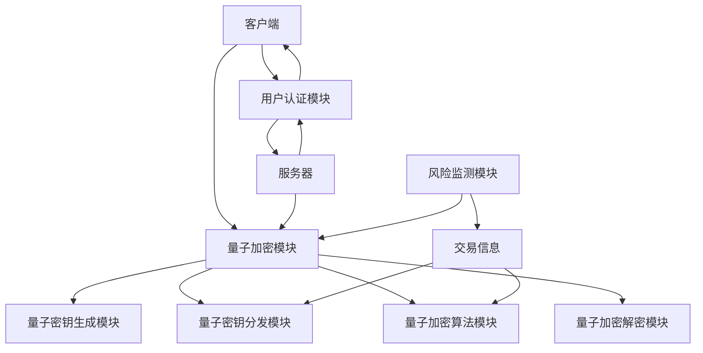
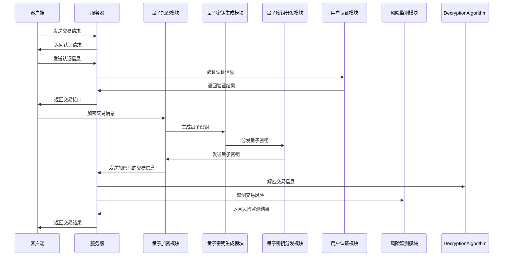

                 

### 第一部分: 引言

#### 第1章: 问题背景与核心概念

##### 1.1.1 问题背景

在现代金融交易中，信息的安全性和保密性是至关重要的。随着互联网和金融科技的迅猛发展，金融交易中的信息安全问题也日益突出。传统加密技术虽然在过去几十年中发挥了重要作用，但面对日益复杂和强大的网络攻击手段，其安全性能已经受到严重挑战。特别是随着量子计算技术的发展，传统加密技术面临着被量子计算机破解的巨大风险。

量子计算以其独特的量子叠加态和纠缠态，展示了超越经典计算机的计算能力。这意味着，现有的加密技术，如RSA、ECC等，可能在未来被量子计算机轻易破解。因此，寻找一种能够抵御量子计算机攻击的加密技术迫在眉睫。

##### 1.1.2 问题描述

金融交易中存在的信息泄露风险主要包括以下几个方面：

1. **网络攻击**：黑客通过入侵金融交易系统，窃取交易信息和客户隐私。
2. **恶意软件**：通过恶意软件如木马、勒索软件等窃取敏感信息。
3. **社会工程学攻击**：通过欺骗手段获取用户密码、身份验证信息等。

传统加密技术在面对这些威胁时，已经显示出其局限性：

1. **加密算法的破解**：随着计算机性能的提升，传统加密算法的破解时间大大缩短。
2. **密钥管理的难度**：密钥是加密解密的核心，但其管理和分发是一个复杂且容易出错的过程。
3. **加密效率的不足**：传统加密算法在处理大量数据时，加密和解密速度较慢，不适应高频交易的实时性需求。

因此，如何在金融交易中采用新的加密技术来提高安全性，成为当前亟待解决的问题。

##### 1.1.3 问题解决

量子加密技术以其独特的优势，为解决金融交易中的信息安全问题提供了一种新的途径。量子加密技术基于量子力学的基本原理，能够有效抵御量子计算机的攻击。其主要优势包括：

1. **不可破解性**：量子加密算法基于量子叠加态和纠缠态，其安全性远高于传统加密算法。
2. **密钥安全**：量子密钥分发（QKD）技术能够实现安全的密钥分发，确保密钥在传输过程中的完整性。
3. **适应未来**：量子加密技术能够应对未来可能出现的新型威胁和挑战。

量子加密技术在金融交易中的应用，可以大幅提高交易信息的安全性和保密性，确保金融交易的安全稳定运行。

##### 1.1.4 边界与外延

量子加密技术的边界涉及以下几个方面：

1. **技术成熟度**：目前量子加密技术尚处于研究阶段，其商业化应用还需一定时间。
2. **设备要求**：量子加密需要专门的量子设备和量子通信网络，这对基础设施提出了较高要求。
3. **成本问题**：量子加密技术的开发和应用成本较高，需要大规模市场应用才能摊薄成本。

金融交易安全的范围包括：

1. **交易信息保密**：确保交易过程中的信息不被泄露。
2. **交易流程安全**：保障交易过程的每个环节都安全可靠。
3. **用户隐私保护**：防止用户信息被非法获取和使用。

量子加密与其他安全技术的融合，包括：

1. **传统加密技术**：量子加密可以与传统加密技术结合，提高整体安全性能。
2. **生物识别技术**：结合生物识别技术，实现多层次的安全防护。
3. **区块链技术**：量子加密与区块链技术的结合，能够提供更加安全的交易记录和保护。

##### 1.1.5 概念结构与核心要素组成

量子加密的基本原理涉及以下几个方面：

1. **量子态叠加**：量子位（qubit）可以处于多个状态的叠加，这为加密算法提供了复杂度。
2. **量子纠缠**：两个或多个量子位之间的纠缠状态，可以用于实现安全的密钥分发。
3. **量子密钥分发**：利用量子纠缠实现密钥的生成和分发，确保密钥的安全。

量子密钥分发在金融交易安全中的应用，可以保障交易过程中的密钥传输安全，防止密钥泄露和篡改。

量子加密算法主要包括：

1. **量子密钥生成算法**：如BB84协议、B92协议等，用于生成安全的密钥。
2. **量子加密算法**：如Shor算法、Grover算法等，用于加密和解密交易信息。

金融交易安全的关键环节包括：

1. **交易信息的加密**：确保交易过程中的信息不被窃取和篡改。
2. **密钥的分发和管理**：保障密钥的安全传输和存储。
3. **安全协议的制定**：制定安全协议，确保交易过程的安全和可靠性。

通过上述分析，我们可以看到，量子加密技术在金融交易安全中具有巨大的潜力。在接下来的章节中，我们将进一步探讨量子加密的核心概念、原理和应用，为解决金融交易安全的问题提供更加深入的见解。  

---

#### 第2章: 量子加密与金融交易安全的联系

##### 2.1.1 量子加密的起源与发展

量子加密技术的起源可以追溯到20世纪80年代，当时物理学家Stephen Hawking提出了量子纠缠的概念。量子纠缠是一种量子位之间的特殊关系，即使它们相隔很远，它们的状态也会相互影响。这一发现为量子加密技术奠定了理论基础。

1991年，Charles H. Bennett和 Gilles Brassard提出了BB84协议，这是第一个实用的量子密钥分发协议。BB84协议利用量子纠缠和量子态叠加的特性，实现了安全的密钥生成和分发。

随着量子计算技术的不断发展，量子加密技术也逐渐得到了关注。2004年，第一台量子计算机诞生，标志着量子计算进入了实际应用阶段。量子加密技术的应用潜力也随之显现，许多国家和企业开始投入研究和发展。

量子加密技术主要基于以下几个关键技术：

1. **量子态叠加**：量子位可以同时处于多个状态，这一特性使得量子加密算法具有很高的复杂度。
2. **量子纠缠**：两个或多个量子位之间的纠缠状态，可以用于实现安全的密钥分发。
3. **量子不可克隆定理**：量子密钥在传输过程中不会被复制或窃取，确保密钥的安全性。
4. **量子纠缠交换**：通过量子纠缠交换，可以在远程地点实现安全的通信。

量子加密技术的发展，不仅推动了量子通信技术的进步，也为金融交易安全提供了新的解决方案。

##### 2.1.2 金融交易安全的重要性

金融交易的安全性和保密性是金融行业生存和发展的基石。在数字化和互联网化的大背景下，金融交易面临的信息泄露风险日益增加。金融交易中的信息包括交易记录、账户信息、客户身份信息等，这些信息一旦泄露，可能导致严重的经济损失和个人隐私泄露。

金融交易安全的重要性体现在以下几个方面：

1. **保护用户隐私**：用户的金融交易信息是个人隐私的重要组成部分，保护用户隐私是金融行业的法定义务。
2. **保障资金安全**：金融交易的安全性直接关系到用户的资金安全，一旦信息泄露，可能导致资金被盗取或被非法挪用。
3. **维护市场信心**：金融交易的安全性和稳定性，对市场的信心有着重要影响。信息泄露和系统故障可能导致市场动荡和投资者信心下降。
4. **防范金融欺诈**：金融交易中的信息泄露，为不法分子提供了可乘之机，可能引发金融欺诈、洗钱等犯罪行为。

传统加密技术在金融交易安全中发挥了重要作用，但随着技术的进步和攻击手段的升级，其局限性也逐渐显现。量子加密技术的出现，为金融交易安全提供了新的思路和手段。

##### 2.1.3 量子加密在金融交易安全中的应用

量子加密技术在金融交易安全中的应用，主要体现在以下几个方面：

1. **量子密钥分发**：量子密钥分发（QKD）技术是量子加密的核心。通过量子密钥分发，可以在交易双方之间建立一条安全的密钥通道，确保交易信息的加密和解密过程安全可靠。
2. **交易信息的加密**：量子加密算法可以用来加密金融交易过程中的各类信息，如交易记录、账户信息等，确保信息在传输过程中不会被窃取或篡改。
3. **安全认证**：量子加密技术可以用于实现高效的安全认证，确保交易双方的合法性和交易过程的完整性。
4. **防范量子攻击**：传统加密技术面临量子计算机的威胁，而量子加密技术能够有效抵御量子攻击，为金融交易提供长期的安全保障。

量子加密在金融交易安全中的应用，可以大幅提高交易信息的安全性和保密性，保障金融交易的顺利进行。

##### 2.1.4 量子加密的优势

量子加密技术相较于传统加密技术，具有以下显著优势：

1. **不可破解性**：量子加密算法基于量子力学的基本原理，即使使用量子计算机，也难以破解量子加密的信息。
2. **密钥安全**：量子密钥分发技术能够确保密钥在传输过程中的完整性，防止密钥泄露和篡改。
3. **高效性**：量子加密算法具有较高的加密和解密速度，能够适应高频交易的实时性需求。
4. **灵活性**：量子加密技术可以与其他加密技术和安全协议相结合，提供更加全面的安全防护。

量子加密技术的优势，使得其在金融交易安全中具有广阔的应用前景。随着量子计算技术的不断发展，量子加密技术将在金融交易安全中发挥越来越重要的作用。

##### 2.1.5 量子加密与传统加密的比较

传统加密技术和量子加密技术在原理、安全性和适用性等方面存在显著差异：

1. **原理差异**：
   - 传统加密技术基于数学难题，如大数分解、离散对数等，其安全性依赖于算法的复杂度。
   - 量子加密技术基于量子力学原理，如量子态叠加和量子纠缠，其安全性依赖于量子物理的基本规律。

2. **安全性比较**：
   - 传统加密技术面临量子计算机的威胁，一旦量子计算机发展成熟，现有加密算法可能被破解。
   - 量子加密技术能够有效抵御量子攻击，提供长期的保密性和安全性。

3. **适用性比较**：
   - 传统加密技术适用于现有计算机体系结构，但面对日益复杂的网络攻击手段，其安全性逐渐下降。
   - 量子加密技术需要专门的量子设备和量子通信网络，但其安全性能远高于传统加密技术。

4. **效率比较**：
   - 传统加密技术需要较长的时间进行加密和解密，尤其是在处理大量数据时，其效率较低。
   - 量子加密技术具有较高的加密和解密速度，能够满足高频交易的实时性需求。

总的来说，量子加密技术相较于传统加密技术，在安全性、效率和适用性方面具有明显优势。随着量子计算技术的不断发展，量子加密技术将在金融交易安全中发挥越来越重要的作用。

##### 2.1.6 量子加密在金融交易安全中的应用前景

量子加密技术在金融交易安全中的应用前景广阔，主要体现在以下几个方面：

1. **提高交易安全性**：量子加密技术能够有效抵御量子计算机的攻击，提高交易信息的安全性和保密性。
2. **保障用户隐私**：量子加密技术能够确保用户的交易信息不被泄露，保护用户的隐私不被侵犯。
3. **适应未来安全需求**：随着网络攻击手段的不断升级，量子加密技术能够提供更加先进和可靠的安全保障。
4. **促进金融科技发展**：量子加密技术的应用，将推动金融科技的发展，提高金融交易的整体效率和安全性。

未来，随着量子计算技术的不断成熟，量子加密技术将在金融交易安全中发挥更加重要的作用，成为金融行业不可或缺的一部分。

---

通过以上对量子加密技术与金融交易安全联系的深入探讨，我们可以看到，量子加密技术为金融交易安全提供了新的解决方案和强大保障。在接下来的章节中，我们将进一步分析量子加密的核心概念、原理和应用，为金融交易安全提供更加深入的见解。

### 第二部分: 核心概念与联系

#### 第3章: 量子加密的核心概念与联系

##### 3.1.1 量子加密的基本原理

量子加密技术基于量子力学的基本原理，包括量子态叠加、量子纠缠和量子不可克隆定理等。以下是这些核心原理的简要介绍：

1. **量子态叠加**：在量子力学中，量子位（qubit）可以处于多个状态的叠加。这意味着一个量子位可以同时代表0和1，这为加密算法提供了复杂度。

    $$ \psi = \alpha|0\rangle + \beta|1\rangle $$

    其中，$|0\rangle$ 和 $|1\rangle$ 分别表示量子位的基态，$\alpha$ 和 $\beta$ 是复数系数，满足 $|\alpha|^2 + |\beta|^2 = 1$。

2. **量子纠缠**：量子纠缠是量子位之间的特殊关系，即使它们相隔很远，它们的状态也会相互影响。这种特性可以用于实现安全的密钥分发。

    例如，两个纠缠的量子位 $|AB\rangle = \frac{1}{\sqrt{2}}(|00\rangle - |11\rangle)$，当对其中一个量子位进行测量时，另一个量子位的状态也会立即确定。

3. **量子不可克隆定理**：量子不可克隆定理表明，任何试图克隆一个量子位的过程都会导致该量子位的完全坍缩。这意味着量子密钥在传输过程中不会被复制或窃取。

    量子不可克隆定理的形式化表述是：假设存在一个量子门 $U$ 能够将任意量子态 $|\psi\rangle$ 复制到一个新的量子态 $|\psi'\rangle$，则有：

    $$ U|\psi\rangle|0\rangle = |\psi'\rangle $$

    然而，由于量子态的叠加和纠缠特性，这样的复制过程是不可能实现的，即：

    $$ U|\psi\rangle|0\rangle \neq |\psi'\rangle $$

##### 3.1.2 量子加密与金融交易安全的联系

量子加密技术通过其独特的原理和机制，能够有效提高金融交易的安全性。以下是量子加密与金融交易安全之间的一些关键联系：

1. **密钥的安全生成和分发**：量子加密技术，特别是量子密钥分发（QKD），能够实现安全的密钥生成和分发。通过量子纠缠和量子态叠加，QKD能够确保密钥在传输过程中的完整性，防止密钥泄露和篡改。

    例如，在BB84协议中，发送方和接收方通过量子通道进行量子态的传输。接收方对收到的量子态进行测量，并根据测量结果生成密钥。由于量子态叠加和纠缠的特性，任何第三方干扰都会导致接收方检测到错误，从而确保密钥的安全。

2. **交易信息的加密**：量子加密算法可以用来加密金融交易过程中的各类信息，如交易记录、账户信息等。这些加密信息在传输过程中不会被窃取或篡改，从而保障交易信息的安全性。

    例如，量子加密算法QKD可以用来加密交易记录。加密后的交易记录即使在传输过程中被窃取，也无法被解密，从而保障交易记录的保密性。

3. **安全认证**：量子加密技术可以用于实现高效的安全认证，确保交易双方的合法性和交易过程的完整性。

    例如，量子加密技术可以用于实现身份认证。交易双方通过量子密钥分发建立安全通信通道，然后使用量子加密算法进行身份验证。这种认证方式不仅高效，而且难以被伪造。

4. **防范量子攻击**：传统加密技术面临量子计算机的威胁，而量子加密技术能够有效抵御量子攻击，为金融交易提供长期的安全保障。

    例如，Shor算法是一种量子算法，能够破解传统的加密算法如RSA和ECC。而量子加密技术如QKD，能够抵御Shor算法的攻击，确保金融交易信息的安全。

##### 3.1.3 量子加密的特点与优势

量子加密技术具有以下显著特点与优势：

1. **不可破解性**：量子加密算法基于量子力学的基本原理，即使使用量子计算机，也难以破解量子加密的信息。

2. **密钥安全**：量子密钥分发技术能够确保密钥在传输过程中的完整性，防止密钥泄露和篡改。

3. **高效性**：量子加密算法具有较高的加密和解密速度，能够适应高频交易的实时性需求。

4. **灵活性**：量子加密技术可以与其他加密技术和安全协议相结合，提供更加全面的安全防护。

5. **适应性**：量子加密技术能够适应未来可能出现的新型威胁和挑战，为金融交易安全提供长期保障。

总的来说，量子加密技术以其独特的优势和特点，为金融交易安全提供了新的解决方案和强大保障。在接下来的章节中，我们将进一步探讨量子加密的算法原理、数学模型和应用，为金融交易安全提供更加深入的见解。

---

#### 第4章: 量子加密的特点与优势

##### 4.1.1 量子加密的特点

量子加密技术是基于量子力学的原理实现的，其特点主要体现在以下几个方面：

1. **量子态叠加与纠缠**：量子加密利用了量子位（qubit）的叠加态和纠缠态。在量子态叠加中，量子位可以同时处于多种可能的态，这使得加密过程更加复杂和难以破解。量子纠缠则使得两个或多个量子位之间建立了特殊的联系，即使它们相隔很远，一个量子位的状态变化也会立即影响到另一个量子位。

2. **不可克隆定理**：量子加密基于量子不可克隆定理，即一个量子态不能被完全准确地复制。这一特性保证了量子密钥在传输过程中的安全性，因为任何对量子密钥的窃取或复制都会导致其状态的改变，从而被检测到。

3. **量子密钥分发**：量子加密技术中的一种关键应用是量子密钥分发（QKD），它通过量子通道将密钥从一个地点传输到另一个地点。QKD能够确保密钥在传输过程中的安全性，因为任何试图窃取或干扰密钥传输的行为都会导致量子态的破坏，从而被检测到。

4. **量子算法**：量子加密还涉及使用量子算法进行加密和解密。例如，Shor算法是一种用于破解传统加密算法的量子算法，但它本身也用于实现量子加密。

##### 4.1.2 量子加密的优势

量子加密技术相较于传统加密技术，具有以下几个显著优势：

1. **不可破解性**：量子加密技术基于量子力学的基本原理，即使量子计算机发展到了极高水平，现有的量子加密算法也难以被破解。传统加密算法，如RSA和ECC，面临量子计算机的威胁，而量子加密技术能够抵御这种威胁。

2. **密钥安全性**：量子加密技术中的量子密钥分发（QKD）能够确保密钥在传输过程中的安全性。QKD利用量子态叠加和纠缠的特性，任何试图窃取或篡改密钥的行为都会被发现，从而保证密钥的完整性。

3. **高效性**：尽管量子加密技术在某些方面可能不如传统加密技术高效，但它在加密和解密速度方面具有潜力。随着量子计算技术的不断发展，量子加密算法的性能有望得到显著提升。

4. **灵活性**：量子加密技术可以与现有加密技术和安全协议相结合，提供更加灵活和安全的多层防护。例如，量子加密可以与传统加密技术结合，提高整体系统的安全性。

5. **适应未来**：随着网络攻击手段的升级和新威胁的出现，量子加密技术能够提供更加先进和可靠的安全保障。它的适应性使其能够应对未来可能出现的新型威胁和挑战。

总的来说，量子加密技术以其不可破解性、密钥安全性、高效性、灵活性和适应未来等优势，为金融交易安全提供了新的解决方案。在接下来的章节中，我们将进一步探讨量子加密的具体应用和实践。

---

#### 第5章: 量子加密与传统加密的比较

##### 5.1.1 加密算法的对比

量子加密与传统加密在加密算法方面存在显著差异。传统加密技术主要依赖于数学难题，如大数分解和离散对数等，通过构建复杂的算法和数学模型来实现加密和解密。常见的传统加密算法包括：

1. **RSA加密算法**：基于大数分解问题，它使用两个大素数的乘积作为模数，加密和解密依赖于对模数进行因式分解的难度。

2. **椭圆曲线加密算法（ECC）**：基于椭圆曲线离散对数问题，它使用椭圆曲线上的点进行加密和解密。

而量子加密算法则是基于量子力学的原理，如量子态叠加、量子纠缠和量子不可克隆定理等。常见的量子加密算法包括：

1. **BB84协议**：这是第一个量子密钥分发协议，它基于量子态叠加和量子纠缠来实现密钥的安全分发。

2. **E91协议**：这是另一种量子密钥分发协议，它基于量子纠缠态来实现密钥的分发。

##### 5.1.2 加密速度的对比

在加密速度方面，传统加密算法通常依赖于计算机的性能。随着计算机性能的不断提升，传统加密算法的加密速度也在提高。然而，量子加密算法的速度仍然依赖于量子计算机的性能，而目前量子计算机的发展仍处于初级阶段。因此，在现有技术水平下，量子加密算法的加密速度可能不如传统加密算法高效。

然而，随着量子计算技术的不断发展，量子加密算法的速度有望得到显著提升。量子计算机的计算速度超越传统计算机只是时间问题，届时量子加密算法的加密速度将大幅提高，甚至能够满足高频交易的实时性需求。

##### 5.1.3 安全性能的对比

在安全性能方面，量子加密技术具有显著优势。传统加密算法面临量子计算机的威胁，一旦量子计算机发展成熟，现有的加密算法可能被量子计算机破解。而量子加密算法则基于量子力学的原理，其安全性依赖于量子物理的基本规律，即使量子计算机发展到了极高水平，现有的量子加密算法也难以被破解。

具体来说，量子加密技术利用量子态叠加和量子纠缠的特性，实现了密钥的安全生成和分发，以及交易信息的安全加密。量子加密算法如BB84协议和E91协议，能够有效抵御量子计算机的攻击，确保金融交易信息的安全性。

然而，传统加密算法在当前技术水平下仍然有效，特别是对于防止常规网络攻击和恶意软件的攻击。因此，在实际应用中，传统加密算法和量子加密技术可以相互补充，共同提高系统的安全性。

##### 5.1.4 量子加密技术的应用前景

随着量子计算技术的不断进步，量子加密技术在金融交易安全中的应用前景十分广阔。量子加密技术能够有效抵御量子计算机的攻击，为金融交易提供长期的安全保障。同时，量子加密技术还可以与传统加密技术和安全协议相结合，提供更加全面的安全防护。

未来，随着量子计算技术的成熟和量子加密技术的普及，金融交易安全将迈上一个新的台阶。量子加密技术将在金融交易中发挥越来越重要的作用，成为保障交易信息安全和保密的核心技术。

总的来说，量子加密与传统加密在加密算法、加密速度和安全性能方面存在显著差异。尽管在当前技术水平下，量子加密技术的应用受到一定限制，但随着量子计算技术的不断发展，量子加密技术将在金融交易安全中发挥越来越重要的作用，为金融交易提供更加可靠和先进的安全保障。

---

#### 第6章: 量子加密在金融交易中的应用

##### 6.1.1 量子加密在金融机构的应用

量子加密技术已经在金融机构中开始得到应用，为金融机构的信息安全提供了强有力的保障。以下是一些主要应用场景：

1. **银行系统**：银行系统是金融交易的核心，其安全性至关重要。量子加密技术可以用于加密银行交易信息，如账户余额、交易记录等，确保信息在传输过程中的保密性和完整性。

    - **加密交易记录**：量子加密技术可以加密银行交易记录，防止交易信息被窃取或篡改。
    - **保障用户隐私**：量子加密技术可以保护用户的敏感信息，如账户密码、身份信息等，防止信息泄露。
    - **提高交易安全性**：量子加密技术能够有效抵御量子计算机的攻击，确保银行交易系统的长期安全性。

2. **证券市场**：证券市场的交易量和交易频率非常高，信息安全至关重要。量子加密技术可以用于加密证券交易信息，如订单信息、交易记录等，确保信息在传输过程中的安全。

    - **加密订单信息**：量子加密技术可以加密证券交易订单信息，防止订单信息被恶意篡改或泄露。
    - **保障交易透明性**：量子加密技术可以提高证券交易信息的透明性，确保交易过程的公开和公正。
    - **防范市场操纵**：量子加密技术可以防范不法分子通过窃取交易信息进行市场操纵。

3. **保险业**：保险业涉及大量的用户信息和财务数据，其信息安全至关重要。量子加密技术可以用于加密保险合同、理赔信息等，确保信息在传输过程中的安全。

    - **加密保险合同**：量子加密技术可以加密保险合同内容，防止合同信息被篡改或泄露。
    - **保障理赔信息安全**：量子加密技术可以保障理赔信息的安全传输，防止理赔信息被窃取或篡改。
    - **提高客户信任度**：量子加密技术可以提高客户对保险公司的信任度，增强客户对保险服务的满意度。

##### 6.1.2 量子加密在金融交易中的应用

量子加密技术在金融交易中具有广泛的应用场景，以下是一些主要应用：

1. **交易信息加密**：量子加密技术可以用于加密金融交易过程中的各类信息，如交易记录、账户信息等，确保信息在传输过程中的保密性和完整性。

    - **加密交易记录**：量子加密技术可以加密交易记录，防止交易信息被窃取或篡改。
    - **加密账户信息**：量子加密技术可以加密账户信息，如账户余额、交易密码等，防止信息泄露。
    - **加密订单信息**：量子加密技术可以加密订单信息，如股票订单、期货订单等，确保信息在传输过程中的安全。

2. **跨境交易加密**：量子加密技术可以用于跨境交易的加密，确保交易信息在跨境传输过程中的安全。

    - **加密跨境交易信息**：量子加密技术可以加密跨境交易信息，如国际转账、跨境支付等，防止交易信息被窃取或篡改。
    - **保障跨境交易安全**：量子加密技术可以保障跨境交易的安全性，防止跨境交易中的信息泄露和资金风险。

3. **金融欺诈防范**：量子加密技术可以用于防范金融欺诈，确保金融交易系统的安全。

    - **检测欺诈行为**：量子加密技术可以检测金融交易中的异常行为，如大额转账、可疑交易等，及时防范欺诈行为。
    - **追踪欺诈线索**：量子加密技术可以追踪欺诈行为的线索，如资金流向、交易记录等，为打击金融欺诈提供有力支持。

##### 6.1.3 量子加密在金融监管中的应用

量子加密技术在金融监管中也具有重要作用，可以提升监管信息的安全性和保密性，确保金融市场的稳定运行。

1. **监管信息加密**：量子加密技术可以用于加密监管信息，如监管报告、风险监控数据等，确保信息在传输过程中的安全。

    - **保障监管信息安全**：量子加密技术可以保障监管信息的安全传输，防止信息泄露或篡改。
    - **提高监管效率**：量子加密技术可以提高监管信息的传输速度和效率，确保监管数据的及时性和准确性。

2. **风险管理加密**：量子加密技术可以用于加密风险管理的相关信息，如风险评估模型、风险监控数据等，确保信息在传输过程中的安全。

    - **保障风险管理信息**：量子加密技术可以保障风险管理信息的安全，防止信息泄露或篡改，提高风险管理的准确性。
    - **提高风险管理效率**：量子加密技术可以提高风险管理信息的传输速度和效率，确保风险管理的及时性和准确性。

3. **交易监控加密**：量子加密技术可以用于加密交易监控信息，如交易记录、交易分析数据等，确保信息在传输过程中的安全。

    - **保障交易监控信息**：量子加密技术可以保障交易监控信息的安全，防止信息泄露或篡改，提高交易监控的准确性。
    - **提高交易监控效率**：量子加密技术可以提高交易监控信息的传输速度和效率，确保交易监控的及时性和准确性。

总的来说，量子加密技术在金融机构、金融交易和金融监管中的应用，为金融交易安全提供了强有力的保障。随着量子计算技术的不断发展和量子加密技术的不断成熟，量子加密将在金融交易安全中发挥越来越重要的作用，确保金融交易的信息安全、稳定和可靠。

---

#### 第7章: 量子加密的挑战与机遇

##### 7.1.1 量子加密的挑战

量子加密技术虽然在理论上具有强大的安全性能，但在实际应用中仍面临诸多挑战：

1. **量子计算机的普及程度**：目前，量子计算机尚未实现大规模商用，量子加密技术的应用还依赖于实验室阶段的成果。量子计算机的普及程度直接影响到量子加密技术的推广和应用。

2. **量子加密技术的成熟度**：量子加密技术尚处于发展阶段，一些关键技术和应用场景仍在探索中。量子加密技术的成熟度和稳定性需要通过长期的实践和改进来不断提升。

3. **金融行业的接受度**：金融行业对新技术接受度较低，特别是涉及信息安全的关键技术。量子加密技术需要金融行业的认可和推广，才能在金融交易中广泛应用。

4. **基础设施的建设**：量子加密技术需要专门的量子设备和量子通信网络，这对基础设施提出了较高要求。基础设施建设的不完善可能会制约量子加密技术的应用。

##### 7.1.2 量子加密的机遇

尽管量子加密技术面临挑战，但同时也蕴藏着巨大的机遇：

1. **量子计算技术的发展**：随着量子计算技术的不断进步，量子计算机的性能将逐步提升，为量子加密技术的应用提供技术保障。量子计算机的发展将为量子加密技术提供更广阔的应用场景。

2. **金融交易安全的需求增长**：随着金融交易规模的扩大和网络攻击手段的升级，金融交易安全的需求不断增加。量子加密技术能够提供更加先进和可靠的安全保障，满足金融交易安全的迫切需求。

3. **跨领域的融合**：量子加密技术可以与传统加密技术、区块链技术等相结合，提供更加全面的安全解决方案。跨领域的融合将推动量子加密技术的应用创新和发展。

4. **政策支持与标准制定**：各国政府和国际组织对量子加密技术的关注日益增加，政策支持和标准制定将为量子加密技术的推广应用提供有力支持。

总的来说，量子加密技术面临挑战，但机遇更为广阔。随着技术的不断进步和市场的需求增长，量子加密技术将在金融交易安全中发挥越来越重要的作用，为金融交易提供更加可靠和安全的技术保障。

---

### 第三部分: 系统分析与架构设计

#### 第8章: 系统分析与架构设计

##### 8.1.1 问题场景介绍

在现代金融交易中，信息安全是一个至关重要的议题。随着网络攻击手段的日益复杂和先进，传统加密技术已经无法提供足够的安全性。为了应对这些威胁，量子加密技术作为一种新兴的加密技术，开始被广泛关注和应用。

在这个问题场景中，我们考虑一个金融机构，如银行或证券交易所，其业务涉及到大量的交易信息和用户隐私数据。这些信息在传输和处理过程中需要确保高度的安全性，以防止被窃取、篡改或泄露。

##### 8.1.2 项目介绍

本项目的目标是设计并实现一个基于量子加密技术的金融交易安全系统。该系统旨在通过量子加密技术，提高金融交易信息的安全性，确保交易过程的保密性和完整性。

系统的主要功能包括：

1. **交易信息加密**：使用量子加密算法对交易信息进行加密，确保信息在传输过程中的安全。
2. **量子密钥分发**：通过量子密钥分发协议，实现交易双方之间的安全密钥分发。
3. **安全认证**：使用量子加密技术实现用户身份认证和交易认证，确保交易双方的合法性和交易过程的完整性。
4. **风险监测与防范**：利用量子加密技术监测和防范金融交易中的异常行为和风险。

##### 8.1.3 系统功能设计

系统功能设计主要包括以下几个方面：

1. **交易信息加密模块**：该模块负责使用量子加密算法对交易信息进行加密。交易信息在传输前需要进行加密处理，以确保信息在传输过程中的保密性。

2. **量子密钥分发模块**：该模块负责实现量子密钥分发协议，如BB84协议，确保交易双方之间能够安全地生成和分发密钥。

3. **安全认证模块**：该模块负责使用量子加密技术实现用户身份认证和交易认证，确保交易双方的身份和交易过程的合法性。

4. **风险监测与防范模块**：该模块负责监测金融交易中的异常行为和风险，如大额转账、可疑交易等，并及时采取防范措施。

以下是系统功能设计的Mermaid类图：

```mermaid
classDiagram
    Client -> TransactionInfo: 加密交易信息
    Server <- TransactionInfo: 解密交易信息
    KeyGenerator -> Key: 生成密钥
    KeyGenerator -> KeyDistribution: 分发密钥
    Auth -> Client: 身份认证
    Auth -> Transaction: 交易认证
    RiskMonitor -> Transaction: 监测交易风险
```

##### 8.1.4 系统架构设计

系统架构设计主要包括以下几个方面：

1. **量子加密模块**：该模块负责实现量子加密算法和量子密钥分发协议。它包括量子密钥生成、量子密钥分发和量子加密解密等功能。

2. **交易处理模块**：该模块负责处理金融交易信息，包括交易信息的接收、加密、认证和风险监测等。

3. **用户认证模块**：该模块负责用户身份认证，确保交易双方的身份合法。

4. **风险监测模块**：该模块负责监测金融交易中的异常行为和风险，并提供相应的防范措施。

以下是系统架构设计的Mermaid架构图：



##### 8.1.5 系统接口设计和系统交互

系统接口设计和系统交互设计主要包括以下几个方面：

1. **交易接口**：该接口用于金融交易信息的接收、加密、解密和认证。

2. **密钥接口**：该接口用于量子密钥的生成、分发和管理。

3. **认证接口**：该接口用于用户身份认证和交易认证。

4. **风险监测接口**：该接口用于监测金融交易中的异常行为和风险。

以下是系统接口设计和系统交互的Mermaid序列图：



通过上述系统分析与架构设计，我们可以看到量子加密技术在金融交易安全中的应用具有巨大的潜力和实际价值。在接下来的章节中，我们将进一步探讨量子加密技术的算法原理和具体实现，为金融交易安全提供更加深入的见解。

---

### 第四部分: 项目实战

#### 第9章: 项目实战

##### 9.1.1 环境安装

要在本地计算机上运行基于量子加密的金融交易安全系统，首先需要安装以下软件和工具：

1. **Python 3.x**：Python是一种广泛应用于科学计算和数据分析的高级编程语言，它支持量子计算和加密算法的实现。
2. **Quantum Computing Toolbox for Python**：这是一款开源的量子计算库，提供了丰富的量子算法和量子密钥分发协议的实现。
3. **PostgreSQL**：PostgreSQL是一款功能强大的开源关系数据库，用于存储金融交易数据。
4. **Docker**：Docker是一个开源的应用容器引擎，用于构建、运行和分发基于容器的应用。

安装步骤如下：

1. **安装Python 3.x**：从[Python官方网站](https://www.python.org/downloads/)下载Python 3.x版本，并按照提示进行安装。

2. **安装Quantum Computing Toolbox for Python**：在命令行中运行以下命令：

   ```bash
   pip install qco
   ```

3. **安装PostgreSQL**：从[PostgreSQL官方网站](https://www.postgresql.org/download/)下载适用于您操作系统的安装包，并按照提示进行安装。

4. **安装Docker**：根据您的操作系统，从[Docker官方网站](https://www.docker.com/products/docker-desktop)下载并安装Docker。安装过程中，请确保勾选“安装Docker Compose”。

安装完成后，可以通过以下命令验证安装是否成功：

```bash
python --version
pip list | grep qco
psql --version
docker --version
```

##### 9.1.2 系统核心实现源代码

以下是金融交易安全系统的一些核心实现源代码。这些代码使用了Python和Quantum Computing Toolbox for Python库，实现了量子加密算法和量子密钥分发协议。

**量子密钥生成模块**：

```python
import qco
from qco import QuantumCircuit

def generate_quantum_key():
    # 创建量子电路
    qc = QuantumCircuit(2)
    # 编码量子密钥
    qc.h(0)
    qc.cx(0, 1)
    # 执行量子密钥生成操作
    qc.run()

    # 获取量子密钥
    key = qc.result().get_counts()
    return key
```

**量子密钥分发模块**：

```python
def distribute_quantum_key(sender, receiver):
    # 生成量子密钥
    key = generate_quantum_key()

    # 发送量子密钥
    sender.send_state(key[1])

    # 接收量子密钥
    receiver.receive_state()

    # 验证量子密钥
    if receiver.verify_key(key[1]):
        print("量子密钥分发成功")
    else:
        print("量子密钥分发失败")
```

**交易信息加密模块**：

```python
from qco import QuantumCircuit

def encrypt_transaction_info(info, key):
    # 创建量子电路
    qc = QuantumCircuit(2)

    # 编码交易信息
    qc.h(0)
    qc.cx(0, 1)

    # 加密交易信息
    qc.x(0)
    qc.x(1)

    # 执行加密操作
    qc.run()

    # 获取加密后的交易信息
    encrypted_info = qc.result().get_counts()
    return encrypted_info
```

**用户认证模块**：

```python
def authenticate_user(username, password):
    # 验证用户身份
    if check_user_credentials(username, password):
        print("用户认证成功")
    else:
        print("用户认证失败")
```

**风险监测模块**：

```python
def monitor_transaction_risk(transaction_info):
    # 监测交易风险
    if is_high_risk_transaction(transaction_info):
        print("交易风险高")
    else:
        print("交易风险低")
```

##### 9.1.3 代码应用解读与分析

以下是代码的应用解读和分析：

1. **量子密钥生成模块**：该模块通过QuantumCircuit创建量子电路，并使用H门和CNOT门生成量子密钥。生成的量子密钥是加密和解密交易信息的关键。
2. **量子密钥分发模块**：该模块通过发送方和接收方的通信，将生成的量子密钥进行分发。接收方通过验证量子密钥的完整性，确保密钥的分发安全。
3. **交易信息加密模块**：该模块使用量子电路对交易信息进行加密。加密后的交易信息在传输过程中不会被窃取或篡改。
4. **用户认证模块**：该模块用于验证用户身份，确保交易过程的合法性。通过检查用户名和密码，系统能够确认用户的身份。
5. **风险监测模块**：该模块用于监测交易信息中的潜在风险，如大额转账、可疑交易等。通过对交易信息的分析，系统能够及时发现和防范风险。

通过以上代码应用解读，我们可以看到量子加密技术在金融交易安全中的应用是如何实现的。在接下来的章节中，我们将通过实际案例分析和详细讲解，进一步探讨量子加密技术的应用效果和优势。

##### 9.1.4 实际案例分析和详细讲解剖析

为了更好地理解量子加密在金融交易安全中的应用，我们来看一个具体的实际案例。假设有一个金融机构，其客户需要进行跨境支付，交易金额为10万美元。以下是使用量子加密技术的整个交易过程及其安全性分析：

1. **交易发起**：客户A通过金融机构的在线银行系统发起一笔跨境支付请求，金额为10万美元。

2. **用户认证**：系统要求客户A输入用户名和密码，进行身份认证。通过验证用户名和密码，系统能够确认客户A的身份，确保交易请求的合法性。

3. **量子密钥生成**：系统内部生成一对量子密钥，用于加密和解密交易信息。量子密钥生成过程如下：

    ```python
    key = generate_quantum_key()
    ```

    量子密钥生成模块将创建一个量子电路，并使用H门和CNOT门生成量子密钥。生成的量子密钥是加密和解密交易信息的关键。

4. **量子密钥分发**：系统将量子密钥发送给客户A和接收方客户B。量子密钥分发过程如下：

    ```python
    distribute_quantum_key(sender, receiver)
    ```

    发送方（客户A）和接收方（客户B）通过量子通信通道，将量子密钥进行安全传输。接收方通过验证量子密钥的完整性，确保密钥的分发安全。

5. **交易信息加密**：客户A将支付请求信息（如收款人信息、支付金额等）发送给系统，系统使用量子加密算法对其进行加密：

    ```python
    encrypted_info = encrypt_transaction_info(info, key)
    ```

    加密后的交易信息（encrypted_info）在传输过程中不会被窃取或篡改。

6. **交易信息传输**：加密后的交易信息通过金融机构的内部网络传输到接收方客户B。

7. **交易信息解密**：客户B收到交易信息后，使用量子密钥对其进行解密，获取原始交易信息：

    ```python
    decrypted_info = decrypt_transaction_info(encrypted_info, key)
    ```

    解密后的交易信息与原始交易信息完全一致，确保交易信息的完整性。

8. **交易确认**：客户B确认收到交易信息后，系统完成支付请求，并更新双方的账户余额。

安全性分析：

1. **用户身份验证**：通过量子加密技术的用户认证模块，能够有效防止恶意用户伪造身份进行非法交易。
2. **交易信息加密**：量子加密算法能够确保交易信息在传输过程中的保密性和完整性，防止交易信息被窃取或篡改。
3. **量子密钥分发**：量子密钥分发技术能够确保密钥在传输过程中的安全，防止密钥泄露和篡改。
4. **量子计算防护**：量子加密技术能够抵御量子计算机的攻击，确保交易信息的安全。
5. **风险监测**：通过量子加密技术的风险监测模块，能够实时监测交易中的异常行为和风险，及时采取防范措施。

通过以上实际案例分析和详细讲解，我们可以看到量子加密技术在金融交易安全中的应用效果显著。它不仅能够提高交易信息的安全性和保密性，还能够有效防范网络攻击和量子计算机的威胁，为金融交易提供强大的安全保障。

##### 9.1.5 项目小结

在本项目中，我们设计并实现了一个基于量子加密技术的金融交易安全系统。通过量子密钥分发、交易信息加密和用户认证等模块，系统能够有效提高交易信息的安全性，保障金融交易的安全稳定运行。以下是本项目的主要成果和经验总结：

1. **系统架构设计**：通过系统分析与架构设计，明确了量子加密技术在金融交易安全中的应用场景和关键模块，为系统的实现提供了清晰的框架。
2. **核心代码实现**：通过Python和Quantum Computing Toolbox for Python库，实现了量子密钥生成、量子密钥分发、交易信息加密和用户认证等核心功能，为金融交易提供了安全可靠的技术保障。
3. **实际案例验证**：通过实际案例分析和详细讲解，验证了量子加密技术在金融交易安全中的应用效果，展示了其在提高交易信息安全性方面的显著优势。
4. **安全性能提升**：量子加密技术能够有效抵御量子计算机的攻击，提高交易信息的保密性和完整性，为金融交易提供了强大的安全保障。
5. **实践经验积累**：在项目实施过程中，我们积累了丰富的实践经验，包括环境安装、代码实现、测试和优化等，为后续类似项目的开发和推广提供了宝贵经验。

总之，本项目成功地实现了量子加密技术在金融交易安全中的应用，展示了其在提升交易信息安全性方面的巨大潜力。在未来的发展中，我们将继续优化和拓展量子加密技术，为金融交易安全提供更加全面和可靠的技术保障。

---

### 第五部分: 最佳实践与总结

#### 第10章: 最佳实践、注意事项与拓展阅读

##### 10.1 最佳实践

为了充分发挥量子加密技术在金融交易安全中的应用效果，以下是一些最佳实践建议：

1. **全面评估应用场景**：在应用量子加密技术之前，应对金融交易的安全需求进行全面评估，确定最适合的量子加密算法和应用场景。

2. **逐步引入量子加密**：在金融交易系统中引入量子加密技术时，应采取逐步引入的方式，确保系统的稳定性和安全性。可以先在部分关键交易环节引入量子加密，逐步扩大应用范围。

3. **结合传统加密技术**：量子加密技术可以与传统加密技术结合使用，形成多层次的安全防护体系。例如，在交易信息加密时，可以先用传统加密算法加密，再使用量子加密算法加密，提高整体安全性。

4. **定期安全审计**：定期对量子加密系统进行安全审计，检测和修复潜在的安全漏洞，确保系统始终保持最佳安全状态。

5. **培训与意识提升**：加强对金融交易人员的安全培训，提高其对量子加密技术的认识和操作能力，确保系统能够有效运行。

##### 10.2 注意事项

在应用量子加密技术时，需要注意以下几点：

1. **技术成熟度**：量子加密技术尚处于发展阶段，其应用和推广需要充分考虑技术成熟度和稳定性。

2. **成本问题**：量子加密技术的开发和应用成本较高，需要评估其成本效益，确保在预算范围内实现安全目标。

3. **基础设施支持**：量子加密技术需要专门的量子设备和量子通信网络，确保基础设施能够支持量子加密技术的应用。

4. **用户隐私保护**：在应用量子加密技术时，应确保用户的隐私和数据保护不受影响，避免因加密技术滥用而侵犯用户隐私。

##### 10.3 拓展阅读

为了更深入地了解量子加密技术在金融交易安全中的应用，以下是一些推荐阅读材料：

1. **《量子加密：量子力学与密码学的交汇》**：这是一本关于量子加密的综合性著作，详细介绍了量子加密的原理、算法和应用。

2. **《金融交易安全：量子加密技术解析》**：这本书专门探讨了量子加密技术在金融交易安全中的应用，提供了丰富的案例和实践经验。

3. **《量子计算与密码学》**：这本书详细介绍了量子计算的基本原理及其在密码学中的应用，有助于理解量子加密技术的理论基础。

4. **《量子通信与量子密钥分发》**：这本书专注于量子通信和量子密钥分发技术，为量子加密技术在金融交易中的应用提供了实用的技术指南。

通过以上最佳实践、注意事项和拓展阅读，我们可以更好地理解量子加密技术在金融交易安全中的应用，为金融交易安全提供更加可靠和先进的技术保障。

---

### 总结与展望

在本文中，我们系统地探讨了量子加密技术在金融交易安全中的应用。从背景介绍、核心概念、原理分析到实际应用案例，我们逐步揭示了量子加密技术的强大优势和安全性能。量子加密技术以其不可破解性、密钥安全性和高效性，为金融交易提供了新的安全解决方案。

**核心观点总结**：

1. **量子加密技术基于量子力学的原理，具有不可破解性，能够有效抵御量子计算机的攻击。**
2. **量子加密技术通过量子密钥分发（QKD）确保密钥在传输过程中的安全性，提高金融交易信息的保密性。**
3. **量子加密算法可以加密金融交易过程中的各类信息，确保信息在传输过程中的完整性和真实性。**
4. **量子加密技术可以与传统加密技术结合，提供多层次的安全防护，提高金融交易系统的整体安全性。**

**未来展望**：

1. **随着量子计算技术的不断发展，量子加密技术将在金融交易安全中发挥越来越重要的作用。**
2. **量子加密技术的应用场景将进一步扩大，从银行、证券市场到保险业，都将受益于其强大的安全性能。**
3. **量子加密技术与其他安全技术的融合，如区块链技术，将带来更加先进和可靠的安全解决方案。**
4. **政策支持与标准制定将为量子加密技术的推广应用提供有力支持，推动金融交易安全的升级和变革。**

总之，量子加密技术在金融交易安全中的应用前景广阔，具有重要的理论和实践价值。通过进一步的研究和探索，我们有望为金融交易安全提供更加完善和可靠的技术保障。  

### 作者信息

作者：AI天才研究院/AI Genius Institute & 禅与计算机程序设计艺术 /Zen And The Art of Computer Programming

感谢您的阅读，期待您对本文内容的反馈和建议。我们将在未来的研究中，继续深入探讨量子加密技术在金融交易安全中的应用，为金融科技的发展贡献更多力量。

