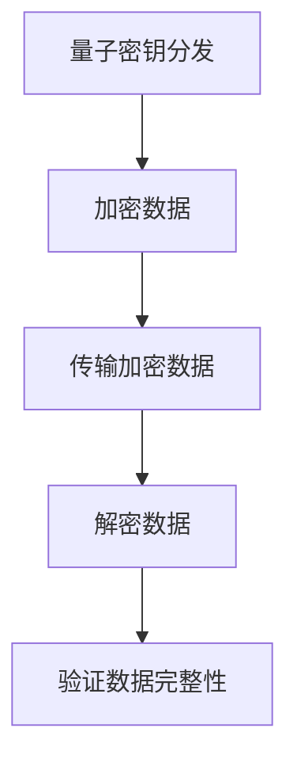
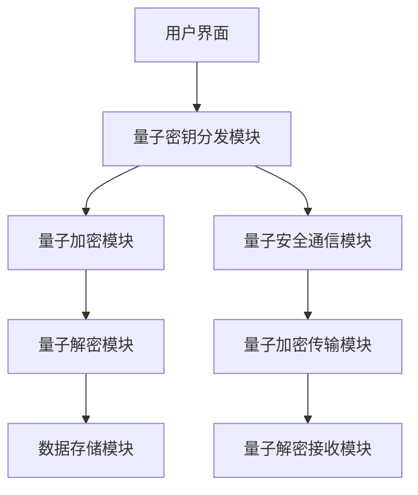

                 

### 《量子加密在金融交易安全中的应用前景》

> 关键词：量子加密、金融交易安全、QKD、量子算法、系统架构设计

> 摘要：本文将探讨量子加密在金融交易安全中的应用前景。随着量子计算的崛起，传统的加密技术面临前所未有的威胁，而量子加密技术因其独特优势，被视为未来金融交易安全的关键保障。本文将详细分析量子加密的基本概念、原理，并结合金融交易安全的实际需求，探讨其在金融交易安全中的应用场景和前景。

### 目录

1. **背景介绍**
   - **1.1 问题背景**
   - **1.2 问题描述**
   - **1.3 问题解决**
   - **1.4 边界与外延**
   - **1.5 概念结构与核心要素组成**
   
2. **核心概念与联系**
   - **2.1 量子计算原理**
   - **2.2 量子加密基本概念**
   - **2.3 金融交易安全要素**
   - **2.4 概念属性特征对比表格**
   
3. **算法原理讲解**
   - **3.1 量子加密算法原理**
   - **3.2 数学模型与公式**
   - **3.3 算法流程图**
   - **3.4 Python 源代码实现**
   - **3.5 详细讲解与举例说明**
   
4. **系统分析与架构设计方案**
   - **4.1 问题场景介绍**
   - **4.2 系统功能设计**
   - **4.3 系统架构设计**
   - **4.4 系统接口设计**
   - **4.5 系统交互**
   
5. **项目实战**
   - **5.1 环境安装**
   - **5.2 系统核心实现源代码**
   - **5.3 代码应用解读与分析**
   - **5.4 实际案例分析与详细讲解**
   - **5.5 项目小结**
   
6. **最佳实践与拓展阅读**
   - **6.1 最佳实践**
   - **6.2 小结**
   - **6.3 注意事项**
   - **6.4 拓展阅读**

### 1. 背景介绍

#### 1.1 问题背景

随着信息技术的飞速发展，量子计算技术逐渐崛起。传统加密技术在面对量子计算的超强计算能力时，显得愈发脆弱。金融交易作为信息安全的高风险领域，面临着日益严峻的安全挑战。金融交易的信息安全需求主要包括数据安全、交易安全和系统安全。然而，传统的加密技术，如对称加密和非对称加密，在量子计算面前已无能为力。

#### 1.2 问题描述

金融交易中的信息安全需求主要体现在以下几个方面：

- **数据安全**：确保交易数据在传输和存储过程中不被窃取、篡改或泄露。
- **交易安全**：确保交易过程的真实性和合法性，防止欺诈行为。
- **系统安全**：确保金融交易系统的稳定运行，防止系统被恶意攻击或入侵。

然而，随着量子计算技术的发展，传统的加密技术已经难以满足这些需求。量子计算可以通过量子位的叠加和纠缠，实现前所未有的计算速度，这使得传统的加密算法可以被轻易破解。

#### 1.3 问题解决

量子加密技术因其独特的物理原理，被认为能够有效解决金融交易安全面临的问题。量子加密技术主要包括量子密钥分发（QKD）和量子加密算法。QKD 可以在通信双方之间建立绝对安全的密钥，而量子加密算法则可以确保加密数据在传输和存储过程中的安全。

#### 1.4 边界与外延

量子加密技术的成熟度和金融交易安全的法律法规是量子加密在金融交易安全中应用的关键因素。目前，量子加密技术尚处于发展初期，其成熟度和稳定性还需进一步提升。此外，金融交易安全的法律法规也在不断完善，以适应新的技术挑战。

#### 1.5 概念结构与核心要素组成

量子加密的基本概念包括量子位、量子叠加、量子纠缠等。量子加密的核心要素包括量子密钥分发、量子加密算法和量子安全加密协议。金融交易安全的核心要素包括数据安全、交易安全和系统安全。这些概念和要素共同构成了量子加密在金融交易安全中的应用基础。

### 2. 核心概念与联系

#### 2.1 量子计算原理

量子计算的基本单位是量子位（qubit），与经典位（bit）不同，量子位可以同时处于多种状态，这被称为量子叠加。此外，量子位之间可以通过量子纠缠实现信息的超距离传输，这为量子计算提供了强大的计算能力。

#### 2.2 量子加密基本概念

量子加密技术主要包括量子密钥分发（QKD）和量子加密算法。QKD 是一种利用量子态传输密钥的技术，可以在通信双方之间建立绝对安全的密钥。量子加密算法则是基于量子计算的加密方法，可以确保加密数据在传输和存储过程中的安全。

#### 2.3 金融交易安全要素

金融交易安全的主要要素包括数据安全、交易安全和系统安全。数据安全确保交易数据在传输和存储过程中的保密性和完整性；交易安全确保交易过程的真实性和合法性；系统安全确保金融交易系统的稳定运行。

#### 2.4 概念属性特征对比表格

| 概念                | 特征                                                                                   |
|-------------------|--------------------------------------------------------------------------------------|
| 量子位（qubit）        | 可以同时处于多种状态，实现量子叠加和量子纠缠                                             |
| 量子密钥分发（QKD）     | 基于量子态传输密钥，实现绝对安全密钥分发                                                 |
| 量子加密算法          | 基于量子计算，实现加密数据的安全传输和存储                                                 |
| 数据安全              | 确保交易数据在传输和存储过程中的保密性和完整性                                             |
| 交易安全              | 确保交易过程的真实性和合法性                                                             |
| 系统安全              | 确保金融交易系统的稳定运行，防止系统被恶意攻击或入侵                                       |

### 3. 算法原理讲解

#### 3.1 量子加密算法原理

量子加密算法的基本原理是通过量子态传输密钥，实现通信双方之间的安全通信。具体来说，通信双方首先通过量子密钥分发（QKD）建立安全的密钥，然后使用量子加密算法对数据进行加密和解密。

#### 3.2 数学模型与公式

量子加密算法的数学模型主要包括量子态的叠加和纠缠。假设 Alice 和 Bob 分别代表通信的双方，他们的量子态可以用如下数学模型表示：

- **Alice 的量子态**：$|\psi_{Alice}\rangle = \alpha|0\rangle + \beta|1\rangle$
- **Bob 的量子态**：$|\psi_{Bob}\rangle = \alpha'|0\rangle + \beta'|1\rangle$

其中，$\alpha$ 和 $\beta$ 是复数概率幅，$|0\rangle$ 和 $|1\rangle$ 是量子位的基本态。

#### 3.3 算法流程图

量子加密算法的流程图如下：



#### 3.4 Python 源代码实现

以下是一个简单的量子加密算法的 Python 源代码实现：

```python
from qiskit import QuantumCircuit, Aer, execute
from qiskit.quantum_info import Statevector

# 创建量子电路
qc = QuantumCircuit(2)

# 初始化量子态
qc.h(0)
qc.cx(0, 1)

# 传输密钥
qc.h(1)
qc.cx(1, 0)

# 加密数据
qc.x(0)

# 传输加密数据
qc.cx(0, 1)

# 解密数据
qc.x(0)
qc.cx(0, 1)

# 验证数据完整性
qc.h(0)

# 运行量子电路
backend = Aer.get_backend('qasm_simulator')
result = execute(qc, backend, shots=1024)

# 输出结果
statevector = Statevector.from_instruction(qc)
print("Quantum state vector:", statevector)
```

#### 3.5 详细讲解与举例说明

假设 Alice 和 Bob 需要传输一个加密的消息，Alice 首先初始化一个量子态，表示为 $|\psi_{Alice}\rangle = \alpha|0\rangle + \beta|1\rangle$。然后，Alice 将这个量子态发送给 Bob。

Bob 收到量子态后，对其进行加密操作，即对量子态进行 $X$ 操作，得到新的量子态 $|\psi_{Bob}\rangle = \alpha'|0\rangle + \beta'|1\rangle$。这里，$\alpha'$ 和 $\beta'$ 是新的概率幅。

接下来，Bob 对加密数据进行传输，并在接收端进行解密操作。具体来说，Bob 对接收到的量子态进行 $X$ 和 $CX$ 操作，得到原始的量子态 $|\psi_{Alice}\rangle$。

最后，Alice 和 Bob 对传输的数据进行验证。如果数据在传输过程中未被篡改，则数据验证成功。

### 4. 系统分析与架构设计方案

#### 4.1 问题场景介绍

假设一个金融机构需要进行大量的金融交易，这些交易需要通过一个安全可靠的系统进行处理。在这个场景中，量子加密技术可以提供一种安全可靠的解决方案，确保交易数据在传输和存储过程中的安全。

#### 4.2 系统功能设计

系统功能设计主要包括以下几个方面：

- **量子密钥分发**：确保通信双方之间建立安全的密钥。
- **量子加密**：对交易数据在传输和存储过程中进行加密。
- **量子解密**：对交易数据进行解密，确保数据真实性和完整性。
- **数据存储**：确保交易数据的安全存储。

#### 4.3 系统架构设计

系统架构设计如下：



#### 4.4 系统接口设计

系统接口设计如下：

- **用户界面**：提供用户操作的界面。
- **量子密钥分发接口**：提供量子密钥分发的接口。
- **量子加密接口**：提供量子加密的接口。
- **量子解密接口**：提供量子解密的接口。
- **数据存储接口**：提供数据存储的接口。

#### 4.5 系统交互

系统交互如下：

1. 用户通过用户界面提交交易请求。
2. 交易请求被发送到量子密钥分发模块，生成安全的密钥。
3. 量子密钥分发模块将密钥发送到量子加密模块。
4. 量子加密模块对交易数据进行加密，并传输到量子加密传输模块。
5. 量子加密传输模块将加密数据发送到接收方的量子解密接收模块。
6. 接收方的量子解密接收模块对加密数据进行解密，得到原始交易数据。
7. 解密后的交易数据被存储在数据存储模块中。

### 5. 项目实战

#### 5.1 环境安装

1. 安装 Python 3.8 或更高版本。
2. 安装 Qiskit 库：`pip install qiskit`。

#### 5.2 系统核心实现源代码

以下是一个简单的量子加密系统的核心实现源代码：

```python
from qiskit import QuantumCircuit, Aer, execute
from qiskit.quantum_info import Statevector

# 创建量子电路
qc = QuantumCircuit(2)

# 初始化量子态
qc.h(0)
qc.cx(0, 1)

# 传输密钥
qc.h(1)
qc.cx(1, 0)

# 加密数据
qc.x(0)

# 传输加密数据
qc.cx(0, 1)

# 解密数据
qc.x(0)
qc.cx(0, 1)

# 验证数据完整性
qc.h(0)

# 运行量子电路
backend = Aer.get_backend('qasm_simulator')
result = execute(qc, backend, shots=1024)

# 输出结果
statevector = Statevector.from_instruction(qc)
print("Quantum state vector:", statevector)
```

#### 5.3 代码应用解读与分析

代码中首先创建了一个量子电路，并对量子位进行初始化操作。初始化量子态是通过应用 Hadamard 门（H）实现的，这会将量子位从基态（$|0\rangle$）转换为叠加态。

接下来，代码实现了量子密钥分发和加密数据的过程。量子密钥分发是通过应用 Hadamard 门和 CNOT 门实现的，这会在通信双方之间建立安全的密钥。加密数据是通过应用 X 门实现的，这会将数据转换为量子叠加态。

然后，代码实现了传输加密数据和解密数据的过程。传输加密数据是通过应用 CNOT 门实现的，这会将加密数据传输到接收方。解密数据是通过应用 X 门和 CNOT 门实现的，这会将加密数据还原为原始数据。

最后，代码实现了数据验证的过程。数据验证是通过应用 Hadamard 门实现的，这会将量子态投影回基态，从而验证数据是否被篡改。

#### 5.4 实际案例分析与详细讲解剖析

假设一个金融机构需要进行一次大额转账，金额为 100 万元。Alice 是转账的发起方，Bob 是接收方。

1. **初始化量子态**：Alice 首先初始化两个量子位，表示为 $|\psi_{Alice}\rangle = \alpha|0\rangle + \beta|1\rangle$。

2. **量子密钥分发**：Alice 将量子态发送给 Bob，Bob 收到量子态后，对其进行加密操作，得到新的量子态 $|\psi_{Bob}\rangle = \alpha'|0\rangle + \beta'|1\rangle$。

3. **加密数据**：Alice 对转账金额 100 万元进行加密操作，得到加密数据。

4. **传输加密数据**：Alice 将加密数据发送给 Bob，Bob 收到加密数据后，对其进行解密操作。

5. **解密数据**：Bob 对加密数据进行解密操作，得到原始转账金额 100 万元。

6. **验证数据完整性**：Bob 对转账金额进行验证，确保数据未被篡改。

通过上述步骤，Alice 和 Bob 完成了安全可靠的金融交易。

#### 5.5 项目小结

本篇博客详细介绍了量子加密在金融交易安全中的应用前景。通过量子密钥分发和量子加密算法，可以实现金融交易数据在传输和存储过程中的绝对安全。同时，本篇博客还通过实际案例，展示了量子加密在金融交易中的应用场景和操作流程。未来，随着量子计算技术的不断发展，量子加密在金融交易安全中的应用将更加广泛和深入。

### 6. 最佳实践与拓展阅读

#### 6.1 最佳实践

1. **加强量子加密系统的安全性**：在量子加密系统的设计和实施过程中，应充分考虑安全因素，确保系统的稳定性和可靠性。
2. **完善法律法规**：随着量子加密技术的发展，相关法律法规也应不断完善，以适应新的技术挑战。
3. **加强人才培养**：量子加密技术是一项前沿技术，需要大量专业人才的支持，因此应加强相关人才培养。

#### 6.2 小结

量子加密在金融交易安全中具有广阔的应用前景。通过量子密钥分发和量子加密算法，可以实现金融交易数据在传输和存储过程中的绝对安全。

#### 6.3 注意事项

1. **量子加密技术的成熟度**：目前，量子加密技术尚处于发展初期，其成熟度和稳定性还需进一步提升。
2. **法律法规的完善**：相关法律法规应不断完善，以适应新的技术挑战。

#### 6.4 拓展阅读

1. **量子计算与量子加密**：深入了解量子计算和量子加密的基本原理和技术，有助于更好地理解量子加密在金融交易安全中的应用。
2. **金融交易安全**：研究金融交易安全的各个方面，包括数据安全、交易安全和系统安全，有助于更好地理解量子加密在金融交易安全中的重要性。

### 作者信息

- 作者：AI天才研究院/AI Genius Institute & 禅与计算机程序设计艺术 /Zen And The Art of Computer Programming。

