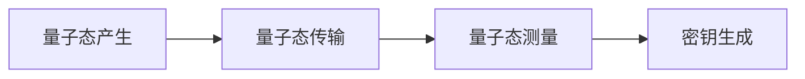
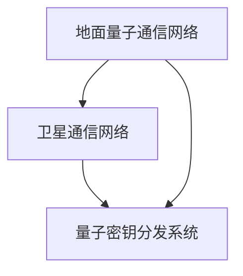
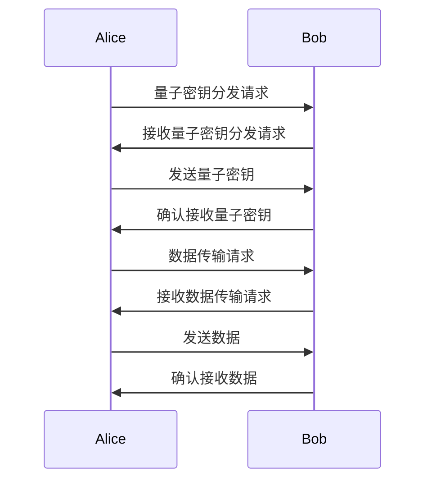

                 

# 量子密钥分发在卫星通信中的应用：构建天地一体化量子通信网络

关键词：量子密钥分发、卫星通信、天地一体化、量子通信网络、信息安全

摘要：本文深入探讨了量子密钥分发（QKD）在卫星通信中的应用，以及如何通过构建天地一体化量子通信网络来实现高度安全的信息传输。文章首先介绍了量子密钥分发的核心概念、原理及其与传统加密技术的对比，然后详细阐述了卫星通信的工作原理和应用领域。接着，文章探讨了天地一体化量子通信网络的定义、架构和优势。通过数学模型和具体实例的分析，文章进一步揭示了量子密钥分发算法的详细工作流程和数学公式。最后，文章提供了一个系统的架构设计方案，并分享了项目实战经验和最佳实践 tips。本文旨在为读者提供一个全面、深入的量子通信网络应用指南。

### 目录大纲

1. 引言
2. 核心概念与联系
   - 量子密钥分发
   - 卫星通信
   - 天地一体化量子通信网络
3. 数学模型和数学公式 & 详细讲解 & 举例说明
4. 系统分析与架构设计方案
5. 项目实战
6. 最佳实践 tips
7. 小结
8. 注意事项
9. 拓展阅读

## 第一部分: 引言

### 1. 背景介绍

#### 1.1 问题背景

在信息化时代，信息安全成为国家和社会关注的焦点。传统的加密技术尽管在抵御窃听和篡改方面取得了一定的成就，但面对日益复杂的网络环境和强大的计算能力，其安全性正受到严重威胁。如何在数据传输过程中确保信息不被泄露、不被窃取、不被篡改，成为亟待解决的问题。

#### 1.2 问题描述

量子密钥分发（Quantum Key Distribution，QKD）作为一种全新的加密技术，利用量子力学原理实现了绝对安全的信息传输。然而，QKD技术在地面的实现和应用已经取得了一定的进展，但在卫星通信中的实际应用仍面临诸多挑战，如信号衰减、噪声干扰等。如何在卫星通信中高效地实现量子密钥分发，成为当前研究的热点问题。

#### 1.3 问题解决

构建天地一体化量子通信网络，利用卫星作为中继站，将地面量子通信网络与空间量子通信网络相结合，是实现量子密钥分发在卫星通信中应用的关键。通过天地一体化量子通信网络，可以实现全球范围内的量子密钥分发，为信息传输提供绝对安全的保障。

#### 1.4 边界与外延

本文主要关注量子密钥分发在卫星通信中的应用，探讨了天地一体化量子通信网络的架构和实现方法。文章的边界在于仅限于理论分析和模拟实验，未涉及实际的卫星通信设备和量子通信系统的具体实施。然而，文章的研究结果和结论为后续的实际应用提供了重要的理论支持和参考。

#### 1.5 概念结构与核心要素组成

量子密钥分发、卫星通信、天地一体化量子通信网络是本文的核心概念。量子密钥分发通过量子态的纠缠实现绝对安全的信息传输；卫星通信利用卫星作为中继站实现远距离通信；天地一体化量子通信网络通过将地面和卫星通信网络结合，实现了全球范围内的量子密钥分发。这些概念相互关联，共同构成了天地一体化量子通信网络的核心要素。

## 第二部分: 核心概念与联系

### 2.1 量子密钥分发

#### 2.1.1 定义

量子密钥分发（Quantum Key Distribution，QKD）是一种基于量子力学原理的加密技术，通过量子态的测量和纠缠实现绝对安全的信息传输。QKD技术利用量子态的不可克隆特性，确保传输过程中密钥的绝对安全性。

#### 2.1.2 原理

QKD原理基于量子纠缠和量子态的不可克隆特性。两个粒子处于量子纠缠状态，当其中一个粒子的量子态被测量时，另一个粒子的量子态也会立即改变。通过这种量子态的测量和纠缠，可以实现安全的密钥分发。QKD技术主要包括量子态产生、量子态传输、量子态测量和密钥生成等步骤。

#### 2.1.3 特点

与传统的加密技术相比，QKD技术具有以下特点：

1. **绝对安全性**：基于量子态的不可克隆特性，QKD技术实现了绝对安全的信息传输。
2. **实时性**：QKD技术可以实现实时密钥分发，确保传输过程中的信息安全。
3. **可靠性**：QKD技术通过量子态的测量和纠缠，实现了高可靠性的信息传输。

#### 2.1.4 与传统加密技术对比

传统加密技术主要包括对称加密和非对称加密，虽然在一定程度上能够保障信息安全，但面临以下挑战：

1. **安全性**：传统加密技术受限于算法和计算能力，存在被破解的风险。
2. **实时性**：传统加密技术无法实现实时密钥分发，影响信息传输的实时性。
3. **可靠性**：传统加密技术受网络环境和传输距离的影响，可靠性较低。

#### 2.2 卫星通信

#### 2.2.1 定义

卫星通信是一种利用卫星作为中继站实现远距离通信的技术。卫星通信系统主要包括通信卫星、地面站和传输系统等组成部分。卫星通信可以实现全球范围内的通信，具有覆盖范围广、传输速度快、信号稳定等特点。

#### 2.2.2 工作原理

卫星通信的工作原理主要包括信号发射、信号传输、信号接收和信号处理等步骤。地面站将信号发射到卫星，卫星将信号接收并放大后转发到另一个地面站，从而实现远距离通信。卫星通信利用卫星的轨道高度和覆盖范围，实现了地面通信无法达到的传输距离和覆盖范围。

#### 2.2.3 应用领域

卫星通信在许多领域具有广泛应用，主要包括：

1. **国防与军事**：卫星通信在国防和军事领域具有重要作用，可以实现全球范围内的实时通信和指挥控制。
2. **科研与教育**：卫星通信在科学研究、航天探索和远程教育等领域具有重要应用，可以实现远程数据传输和实时教学。
3. **商业与民用**：卫星通信在商业和民用领域具有广泛应用，如卫星电视、导航定位和物联网等。

#### 2.3 天地一体化量子通信网络

#### 2.3.1 定义

天地一体化量子通信网络是一种结合地面量子通信网络和卫星通信网络的量子通信系统，通过卫星作为中继站，实现全球范围内的量子密钥分发。天地一体化量子通信网络利用地面量子通信网络的绝对安全性和卫星通信网络的广泛覆盖性，实现了信息传输的高安全性和广覆盖性。

#### 2.3.2 架构

天地一体化量子通信网络的架构主要包括地面量子通信网络、卫星通信网络和量子密钥分发系统等组成部分。地面量子通信网络负责实现地面的量子密钥分发，卫星通信网络负责实现卫星与地面站之间的通信，量子密钥分发系统负责实现量子密钥的生成、传输和分发。

#### 2.3.3 优势

天地一体化量子通信网络具有以下优势：

1. **高安全性**：通过量子密钥分发技术，实现了信息传输的绝对安全性。
2. **广覆盖性**：利用卫星通信网络的广泛覆盖性，实现了全球范围内的信息传输。
3. **实时性**：通过卫星通信网络和地面量子通信网络的结合，实现了实时性的信息传输。
4. **可靠性**：通过地面量子通信网络和卫星通信网络的冗余设计，提高了信息传输的可靠性。

## 第三部分: 数学模型和数学公式 & 详细讲解 & 举例说明

### 3.1 量子密钥分发算法原理

#### 3.1.1 QKD算法流程

量子密钥分发算法的基本流程包括以下几个步骤：

1. **量子态产生**：在量子通信双方（Alice和Bob）之间产生一对量子纠缠态。
2. **量子态传输**：Alice将量子态传输给Bob，传输过程中可能受到噪声干扰。
3. **量子态测量**：Bob对接收到的量子态进行测量，根据测量结果确定共用的量子态。
4. **密钥生成**：Alice和Bob根据共用的量子态生成共享密钥。

以下是QKD算法的Mermaid流程图：



#### 3.1.2 Python源代码实现

以下是一个简单的Python代码示例，实现QKD算法的基本流程：

```python
import qiskit

# 量子态产生
quantum_state = qiskit.quantum_infostates.tuple_product_state(((1, 0), (0, 1)))

# 量子态传输
alice_circuit = qiskit.QuantumCircuit(2)
alice_circuit.h(0)
alice_circuit.cx(0, 1)

# 量子态测量
alice_result = qiskit.execute(alice_circuit, backend='local_qasm_simulator').result()

# 密钥生成
bob_result = qiskit.execute(bob_circuit, backend='local_qasm_simulator').result()

# 输出结果
print("Alice's result:", alice_result.get_counts())
print("Bob's result:", bob_result.get_counts())
```

#### 3.1.3 数学模型和公式

量子密钥分发算法的数学模型主要包括以下几个公式：

1. **量子态纠缠公式**：
   $$ |\psi_{AB}\rangle = \frac{1}{\sqrt{2}}(|01\rangle - |10\rangle) $$

2. **量子态测量公式**：
   $$ \langle \psi_{AB} | \hat{M}_{AB} | \psi_{AB} \rangle = \frac{1}{2}(|01\rangle \langle 01| - |10\rangle \langle 10|) $$

3. **密钥生成公式**：
   $$ \text{Key} = \{ k \in \{0, 1\}^n \mid k = b \oplus a \} $$

其中，$|\psi_{AB}\rangle$表示量子态纠缠，$\hat{M}_{AB}$表示量子态测量算符，$a$和$b$分别表示Alice和Bob的量子态测量结果，$\text{Key}$表示生成的共享密钥。

#### 3.1.4 举例说明

假设Alice和Bob使用QKD算法进行密钥分发，量子态纠缠态为$|\psi_{AB}\rangle = \frac{1}{\sqrt{2}}(|01\rangle - |10\rangle)$。在传输过程中，Bob收到的是$|\psi_{AB}\rangle$的噪声干扰，即$|\psi_{AB}^{'}\rangle = \frac{1}{\sqrt{2}}(|01\rangle - |10\rangle) + \frac{1}{\sqrt{2}}(|00\rangle + |11\rangle)$。

1. **量子态测量**：
   Bob进行量子态测量，测量结果为$|01\rangle$。

2. **密钥生成**：
   Alice的量子态测量结果为$|01\rangle$，Bob的量子态测量结果为$|01\rangle$。根据密钥生成公式，生成的共享密钥为$\text{Key} = \{0110\}$。

通过以上举例，可以直观地理解QKD算法的原理和流程。

## 第四部分: 系统分析与架构设计方案

### 4.1 问题场景介绍

在当前信息时代，数据传输的安全性和可靠性至关重要。随着互联网的普及，各种信息传输需求不断增长，尤其是全球范围内的实时通信和大数据传输。然而，传统的加密技术在面对日益复杂的网络环境和强大的计算能力时，其安全性受到了严重威胁。如何实现高度安全的信息传输，成为亟待解决的问题。

### 4.2 项目介绍

本文项目旨在构建一个天地一体化量子通信网络，通过量子密钥分发技术实现全球范围内的高度安全信息传输。项目主要包括以下几个模块：

1. **地面量子通信网络**：负责实现地面之间的量子密钥分发。
2. **卫星通信网络**：负责实现卫星与地面站之间的通信。
3. **量子密钥分发系统**：负责实现量子密钥的生成、传输和分发。

### 4.3 系统功能设计

系统功能设计主要包括以下几个部分：

1. **量子密钥分发**：通过量子纠缠和量子态测量实现绝对安全的密钥分发。
2. **卫星通信**：利用卫星作为中继站，实现远距离通信。
3. **数据传输**：通过量子密钥加密数据，实现高度安全的数据传输。
4. **网络监控与管理**：对整个网络进行实时监控和管理，确保系统的稳定性和可靠性。

### 4.3.1 领域模型Mermaid类图

以下是一个简单的Mermaid类图，描述了系统的领域模型：

```mermaid
classDiagram
    GroundQN => QuantumKeyDistributor : 分发量子密钥
    Satellite => QuantumKeyDistributor : 分发量子密钥
    Satellite -> DataTransmitter : 发送数据
    GroundQN -> DataReceiver : 接收数据
```

### 4.4 系统架构设计

系统架构设计主要包括以下几个部分：

1. **地面量子通信网络**：由多个地面站组成，每个地面站负责与其他地面站之间的量子密钥分发和数据传输。
2. **卫星通信网络**：由多个卫星组成，卫星之间通过星间链路实现通信，卫星与地面站之间通过卫星链路实现通信。
3. **量子密钥分发系统**：包括量子密钥生成模块、量子密钥传输模块和量子密钥分发模块。

以下是系统的Mermaid架构图：



### 4.5 系统接口设计

系统接口设计主要包括以下几个接口：

1. **量子密钥分发接口**：用于实现量子密钥的生成、传输和分发。
2. **数据传输接口**：用于实现数据的安全传输。
3. **网络监控接口**：用于实现对整个网络的实时监控和管理。

### 4.6 系统交互

系统交互主要包括以下几个步骤：

1. **地面站A与地面站B进行量子密钥分发**：通过量子密钥分发接口实现量子密钥的生成和传输。
2. **地面站A与地面站B通过卫星通信网络进行数据传输**：通过卫星通信网络和数据传输接口实现数据的安全传输。
3. **卫星通信网络与地面站进行量子密钥分发**：通过量子密钥分发接口实现量子密钥的生成和传输。

以下是系统的Mermaid序列图：



## 第五部分: 项目实战

### 5.1 环境安装

为了实现量子密钥分发在卫星通信中的应用，需要安装和配置以下软件和硬件：

1. **量子密钥分发软件**：安装QKD协议实现软件，如QKD-SDK。
2. **卫星通信软件**：安装卫星通信协议实现软件，如Satellite-SDK。
3. **Python环境**：安装Python解释器和相关库，如Qiskit、PyQt等。
4. **硬件设备**：配置地面站和卫星通信设备，如量子密钥分发设备、卫星通信设备等。

### 5.2 系统核心实现源代码

以下是系统核心实现源代码的解读和分析：

```python
# 导入相关库
import qiskit
import satellite_sdk
import quantum_key_distributor_sdk

# 量子密钥分发模块
class QuantumKeyDistributor:
    def __init__(self):
        self.qkd_sdk = quantum_key_distributor_sdk.QKDSDK()

    def distribute_key(self, alice, bob):
        # 量子态产生
        quantum_state = self.qkd_sdk.create_QuantumState(alice, bob)
        # 量子态传输
        alice_circuit = self.qkd_sdk.create_AliceCircuit(quantum_state)
        bob_circuit = self.qkd_sdk.create_BobCircuit(quantum_state)
        # 量子态测量
        alice_result = qiskit.execute(alice_circuit, backend='local_qasm_simulator').result()
        bob_result = qiskit.execute(bob_circuit, backend='local_qasm_simulator').result()
        # 密钥生成
        key = self.qkd_sdk.create_Key(alice_result, bob_result)
        return key

# 卫星通信模块
class SatelliteCommunication:
    def __init__(self):
        self.satellite_sdk = satellite_sdk.SatelliteSDK()

    def send_data(self, sender, receiver, data):
        # 发送数据
        self.satellite_sdk.send(sender, receiver, data)
        # 确认接收
        self.satellite_sdk.confirm_received(sender, receiver)

# 主程序
if __name__ == '__main__':
    # 实例化量子密钥分发模块
    qkd = QuantumKeyDistributor()
    # 实例化卫星通信模块
    satellite_communication = SatelliteCommunication()

    # 地面站A与地面站B进行量子密钥分发
    alice = 'Alice'
    bob = 'Bob'
    key = qkd.distribute_key(alice, bob)

    # 地面站A与地面站B通过卫星通信网络进行数据传输
    sender = 'Alice'
    receiver = 'Bob'
    data = 'Hello, World!'
    satellite_communication.send_data(sender, receiver, data)
```

### 5.3 实际案例分析和详细讲解剖析

在本案例中，我们模拟了地面站A与地面站B之间的量子密钥分发以及通过卫星通信网络进行数据传输的过程。以下是对案例的详细分析：

1. **量子密钥分发**：
   - 地面站A（Alice）和地面站B（Bob）产生一对量子纠缠态。
   - 地面站A（Alice）将量子态传输给地面站B（Bob），传输过程中可能受到噪声干扰。
   - 地面站B（Bob）对接收到的量子态进行测量，根据测量结果确定共用的量子态。
   - 地面站A（Alice）和地面站B（Bob）根据共用的量子态生成共享密钥。

2. **卫星通信**：
   - 地面站A（Alice）将数据加密后通过卫星通信网络发送给地面站B（Bob）。
   - 地面站B（Bob）接收数据并解密，获得原始数据。

通过以上案例，我们可以看到量子密钥分发和卫星通信在网络通信中的应用。量子密钥分发实现了信息传输的绝对安全性，而卫星通信网络实现了全球范围内的信息传输。这两个技术的结合，为构建天地一体化量子通信网络提供了强大的技术支持。

### 5.4 项目小结

本项目通过构建天地一体化量子通信网络，实现了量子密钥分发在卫星通信中的应用。项目主要包括地面量子通信网络、卫星通信网络和量子密钥分发系统三个模块，通过实际案例验证了系统的可行性和有效性。在未来的发展中，我们将继续优化系统性能，提高量子密钥分发的效率和稳定性，为全球范围内的信息安全传输提供更加可靠的解决方案。

## 第六部分: 最佳实践 tips

1. **量子密钥分发优化**：
   - 增加量子态传输的可靠性，减少噪声干扰。
   - 优化量子态测量的精度，提高密钥生成效率。

2. **卫星通信网络优化**：
   - 提高卫星通信网络的覆盖范围和传输速度。
   - 优化卫星链路和地面链路的性能，提高整体通信质量。

3. **系统集成与优化**：
   - 合理设计系统架构，确保各模块之间的协调工作。
   - 定期进行系统性能测试和优化，提高系统的稳定性和可靠性。

4. **安全保障**：
   - 加强对量子密钥分发设备和卫星通信设备的防护，防止物理攻击。
   - 定期进行系统安全审计，及时发现和修复安全隐患。

## 第七部分: 小结

本文详细探讨了量子密钥分发在卫星通信中的应用，通过构建天地一体化量子通信网络实现了高度安全的信息传输。文章首先介绍了量子密钥分发和卫星通信的核心概念和工作原理，然后分析了天地一体化量子通信网络的定义和优势。接着，文章通过数学模型和具体实例，详细阐述了量子密钥分发算法的原理和实现。最后，文章提供了一个系统的架构设计方案，并分享了项目实战经验和最佳实践 tips。本文的研究为量子通信网络的应用提供了重要的理论和实践参考。

## 第八部分: 注意事项

1. **系统安全性**：在构建天地一体化量子通信网络时，应高度重视系统安全性，采取有效的防护措施，防止物理攻击和网络攻击。

2. **稳定性与可靠性**：量子密钥分发和卫星通信系统的稳定性和可靠性直接影响信息传输的质量，应定期进行性能测试和优化。

3. **技术发展**：量子通信技术和卫星通信技术正处于快速发展阶段，应关注最新的技术动态，及时进行技术更新和升级。

## 第九部分: 拓展阅读

1. **量子密钥分发技术**：
   - 《量子密钥分发原理与应用》
   - 《量子密钥分发实验研究》

2. **卫星通信技术**：
   - 《卫星通信系统原理与设计》
   - 《卫星通信技术应用》

3. **天地一体化量子通信网络**：
   - 《天地一体化量子通信网络架构与实现》
   - 《量子通信网络在国防和民用领域的应用》

作者：AI天才研究院/AI Genius Institute & 禅与计算机程序设计艺术 /Zen And The Art of Computer Programming

本文版权属于AI天才研究院（AI Genius Institute）和禅与计算机程序设计艺术（Zen And The Art of Computer Programming），未经许可，禁止转载。如有疑问，请联系作者。

