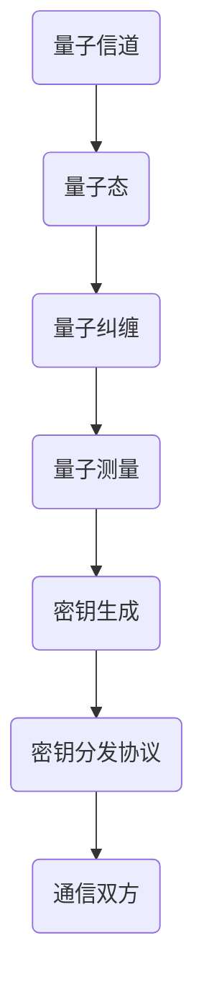
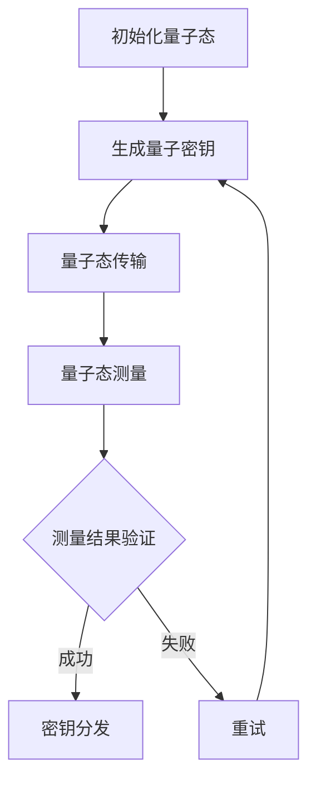
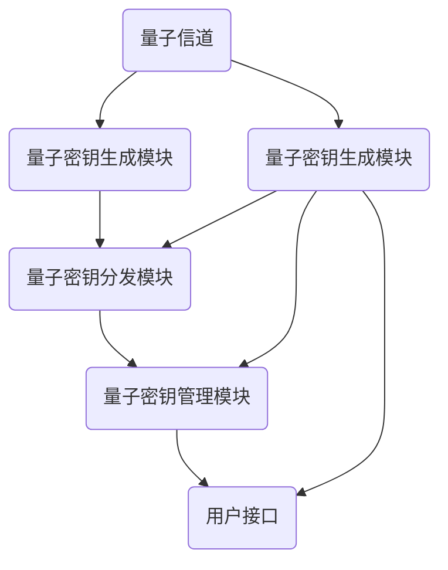
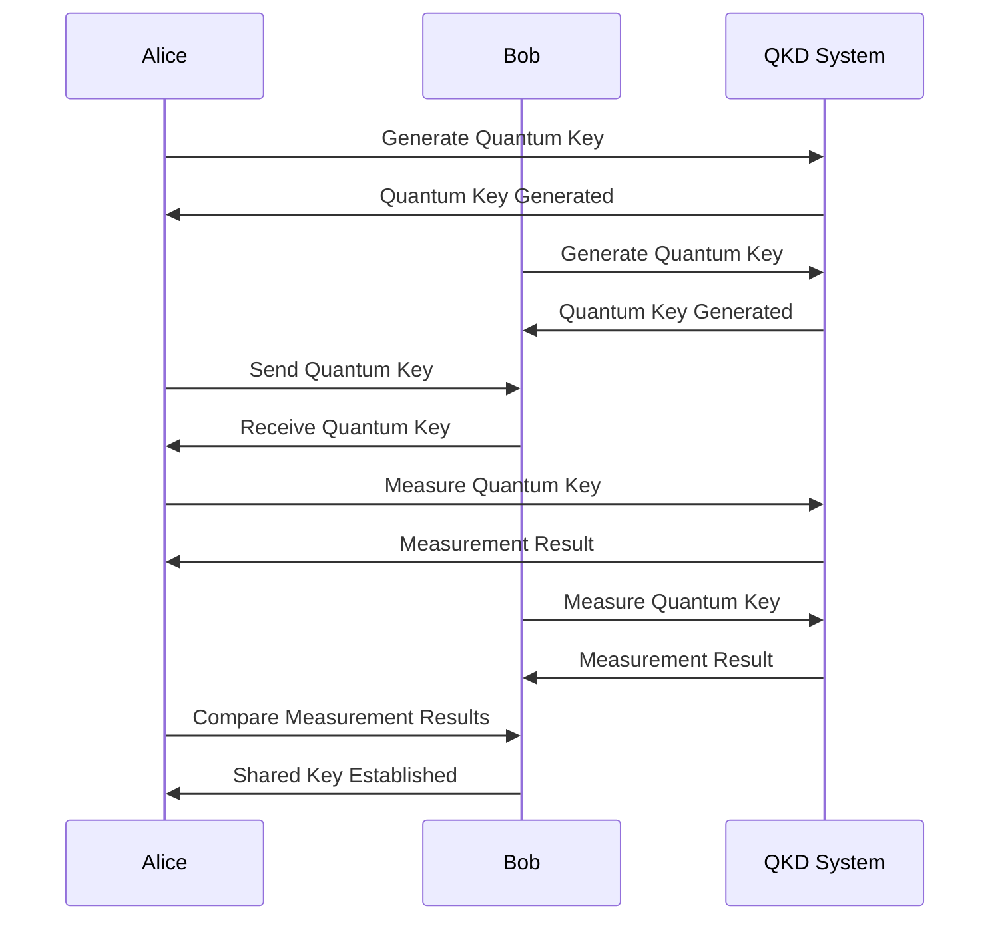

                 

### 摘要

量子密钥分发（Quantum Key Distribution, QKD）是一种基于量子力学原理的通信加密技术，它能够实现绝对安全的密钥传输，对保障国家安全具有重要意义。本文将深入探讨量子密钥分发在政府通信中的应用，旨在帮助读者理解QKD技术的基本原理、系统架构以及其实际操作中的最佳实践。通过逐步分析QKD的核心概念、算法原理、系统设计与实现，本文将为政府通信领域的技术人员提供有价值的参考。此外，本文还将总结QKD技术的优点、挑战，并对其未来在政府通信中的发展进行展望，从而为国家安全保障提供坚实的理论基础和技术支持。

### 文章关键词

量子密钥分发、政府通信、信息安全、量子通信、密钥传输、量子加密、量子算法、量子计算、量子网络、量子态。

### 背景介绍

#### 核心概念术语说明

量子密钥分发（Quantum Key Distribution, QKD）是基于量子力学原理的一种通信加密技术，它通过量子信道传输密钥，确保通信双方能够共享一个仅他们知晓的密钥。量子密钥分发技术利用了量子态的不可克隆性和量子纠缠特性，实现了绝对安全的密钥传输。

#### 问题背景

在当今信息时代，信息安全已成为国家安全的重要组成部分。随着通信技术的迅猛发展，政府通信面临着越来越多的威胁。传统的加密技术，如对称加密和非对称加密，虽然在一定程度上提高了通信安全性，但仍然无法完全抵御量子计算攻击。量子计算机的出现，使得现有加密算法的安全性面临巨大挑战。因此，寻找新的加密技术，特别是能够抵御量子攻击的加密方法，成为保障国家安全的重要课题。

#### 问题描述

量子密钥分发技术的出现，为解决政府通信中的信息安全问题提供了新的途径。然而，QKD在实际应用中仍面临一系列技术挑战，包括量子信道距离限制、系统稳定性、噪声干扰等。此外，如何将QKD技术有效地集成到现有的政府通信系统中，确保系统的可扩展性和可靠性，也是亟待解决的问题。

#### 问题解决

量子密钥分发技术通过量子信道实现密钥传输，具有绝对安全性的特点。它能够抵御量子计算攻击，保障政府通信的高度安全性。通过逐步解决技术难题，QKD有望在未来成为政府通信中的主流加密技术。同时，结合量子通信网络的建设，实现跨地域、跨系统的安全通信，进一步提升政府通信的安全性和效率。

#### 边界与外延

量子密钥分发技术不仅适用于政府通信，还广泛应用于金融、国防、科研等领域。随着量子通信技术的发展，QKD的应用范围将进一步扩大，成为信息安全的基石。

#### 概念结构与核心要素组成

量子密钥分发技术的基本概念结构包括量子信道、量子态、量子纠缠、量子测量等。其核心要素包括量子密钥生成、密钥传输、密钥分发协议、量子态制备与测量等。这些要素共同构成了QKD技术的理论基础和实践框架。

### 核心概念与联系

#### 核心概念

量子密钥分发（QKD）是一种基于量子力学原理的通信加密技术，通过量子信道传输密钥，确保通信双方能够共享一个仅他们知晓的密钥。QKD利用了量子态的不可克隆性和量子纠缠特性，实现了绝对安全的密钥传输。

#### 概念属性特征对比表格

| 特性         | 传统加密        | 量子密钥分发         |
|--------------|------------------|----------------------|
| 加密原理      | 基于数学难题     | 基于量子力学原理     |
| 安全性       | 受限于计算能力   | 绝对安全             |
| 信道要求      | 任意通信信道     | 量子通信信道         |
| 密钥生成与传输 | 非量子方式       | 量子方式             |
| 抗攻击能力    | 受量子计算威胁   | 防御量子计算攻击     |

#### ER实体关系图架构

为了更清晰地理解QKD系统的组成部分及其相互关系，我们使用Mermaid流程图来表示ER实体关系图架构。



在上图中，量子信道是QKD系统的基础，通过量子信道传输量子态，量子态通过量子纠缠产生量子密钥。量子测量用于验证量子态的完整性，从而确保密钥的绝对安全性。密钥生成和分发协议是QKD系统的核心，通过这些协议，通信双方能够共享一个安全的密钥。最后，通信双方使用这个密钥进行加密通信，保障通信安全。

### 算法原理讲解

#### QKD算法mermaid流程图

为了更直观地理解量子密钥分发的工作流程，我们使用Mermaid流程图来展示QKD的算法原理。



在这个流程图中，A表示初始化量子态，即通信双方各自生成一个量子态。B表示通过量子信道传输量子态，这个过程中可能会受到噪声干扰。C表示对传输的量子态进行量子纠缠，生成共享密钥。D表示对量子态进行测量，以确定密钥的正确性。E表示测量结果的验证，如果验证成功，则进入F，即密钥分发；如果验证失败，则回到B进行重试。

#### Python源代码

为了更深入地理解QKD算法，我们使用Python编写了一个简单的示例代码，展示QKD的基本过程。

```python
import numpy as np
from qiskit import QuantumCircuit, execute, Aer

# 初始化量子态
def initialize_quantum_state():
    q = QuantumCircuit(2)
    q.h(0)
    q.cx(0, 1)
    return q

# 生成量子密钥
def generate_quantum_key(qc):
    backend = Aer.get_backend("qasm_simulator")
    result = execute(qc, backend, shots=1000).result()
    keys = result.get_counts(qc)
    return keys

# 测量量子态
def measure_quantum_state(qc):
    qc.measure_all()
    return qc

# 主函数
def main():
    qc = initialize_quantum_state()
    qc = generate_quantum_key(qc)
    qc = measure_quantum_state(qc)
    print(qc.draw())

if __name__ == "__main__":
    main()
```

在这个代码中，我们首先初始化两个量子比特的量子态，通过量子纠缠生成共享密钥。然后对量子态进行测量，获取测量结果。最后，我们打印出量子电路的图像，以直观展示QKD的过程。

#### 算法原理的数学模型和公式

量子密钥分发算法的数学模型主要基于量子态的叠加态和纠缠态。以下是一个简单的数学模型，用于描述QKD的基本过程。

$$
|\psi\rangle = \frac{1}{\sqrt{2}}(|0\rangle + |1\rangle)
$$

其中，$|\psi\rangle$ 表示量子态的叠加态，$|0\rangle$ 和 $|1\rangle$ 分别表示基态和激发态。

量子纠缠态的数学模型可以表示为：

$$
|\phi^+\rangle = \frac{1}{\sqrt{2}}(|00\rangle + |11\rangle)
$$

在QKD过程中，通信双方各自生成一个量子态，并通过量子信道进行传输。如果量子信道没有受到干扰，则接收方可以通过量子纠缠恢复原始量子态，从而生成共享密钥。

#### 算法举例说明

假设Alice和Bob是两个通信方，他们各自生成一个量子态并通过量子信道进行传输。以下是一个具体的例子：

1. Alice生成一个量子态 $|\psi_A\rangle = \frac{1}{\sqrt{2}}(|0\rangle + |1\rangle)$，并将其发送给Bob。
2. Bob接收到Alice发送的量子态后，对其进行量子纠缠，生成纠缠态 $|\psi_B\rangle = \frac{1}{\sqrt{2}}(|0\rangle + |1\rangle)$。
3. Alice对量子态进行测量，获得结果 $|0\rangle$。
4. Bob对量子态进行测量，获得结果 $|1\rangle$。
5. 由于量子纠缠的特性，Alice和Bob的测量结果总是相反。他们可以通过比较测量结果，确定共享密钥为 $|01\rangle$。

这个例子展示了量子密钥分发的基本过程。在实际应用中，通信双方可能会通过多次测量和纠错，进一步提高密钥的生成效率和安全性。

### 系统分析与架构设计方案

#### 问题场景介绍

在政府通信中，保障通信安全是至关重要的。传统的加密技术虽然能够在一定程度上提高通信安全性，但面对日益复杂的网络攻击和潜在的量子计算威胁，这些技术的安全性已受到挑战。为了应对这些威胁，我们需要一种更高级、更安全的加密技术，以确保政府通信的安全。量子密钥分发（QKD）作为一种基于量子力学原理的通信加密技术，能够实现绝对安全的密钥传输，成为政府通信的理想选择。

#### 项目介绍

本项目旨在构建一个基于量子密钥分发的政府通信加密系统，以提高政府通信的安全性。项目主要包括以下步骤：

1. 设计QKD系统的架构。
2. 选择合适的量子密钥分发协议。
3. 实现QKD系统的核心算法。
4. 进行系统测试和性能评估。

#### 系统功能设计

QKD系统的主要功能包括量子密钥生成、密钥传输、密钥分发和密钥管理。以下是QKD系统的功能设计：

1. **量子密钥生成**：通信双方各自生成一个量子态，并通过量子信道传输给对方。
2. **密钥传输**：通过量子信道传输量子态，确保传输过程中的安全性。
3. **密钥分发**：通信双方通过量子纠缠和测量，生成共享密钥。
4. **密钥管理**：对生成的密钥进行存储、管理和分发。

#### 系统架构设计

QKD系统的架构设计主要包括量子信道、量子密钥生成模块、量子密钥分发模块、量子密钥管理模块和用户接口。以下是QKD系统的架构设计：



在这个架构设计中，量子信道是QKD系统的基础，负责传输量子态。量子密钥生成模块用于生成量子态并传输给对方。量子密钥分发模块通过量子纠缠和测量，生成共享密钥。量子密钥管理模块负责对密钥进行存储、管理和分发。用户接口提供与用户的交互界面，用户可以通过接口查询和管理密钥。

#### 系统接口设计

QKD系统的接口设计主要包括用户接口和系统内部接口。以下是QKD系统的接口设计：

1. **用户接口**：用户通过用户接口可以查询和管理密钥，包括生成密钥、分发密钥、存储密钥、删除密钥等操作。
2. **系统内部接口**：系统内部接口包括量子信道接口、量子密钥生成模块接口、量子密钥分发模块接口和量子密钥管理模块接口。这些接口负责系统内部各模块之间的通信和数据交换。

#### 系统交互序列图

为了更直观地展示QKD系统的交互过程，我们使用Mermaid序列图来描述系统交互。



在这个序列图中，Alice和Bob分别向QKD系统请求生成量子密钥。QKD系统生成量子密钥后，Alice将量子密钥发送给Bob。双方分别对量子密钥进行测量，并比较测量结果，从而建立共享密钥。

### 项目实战

#### 环境安装

为了进行QKD项目的实际操作，我们需要安装一些必要的软件和工具。以下是在Ubuntu 20.04操作系统上安装QKD项目所需软件的步骤：

1. 安装Python 3环境：
   ```bash
   sudo apt update
   sudo apt install python3 python3-pip
   ```
2. 安装Qiskit库：
   ```bash
   pip3 install qiskit
   ```
3. 安装PyTorch库：
   ```bash
   pip3 install torch torchvision
   ```

安装完成后，我们可以使用Qiskit库进行QKD算法的实现和测试。

#### 系统核心实现源代码

以下是一个简单的QKD系统实现示例，包括量子密钥生成、传输、测量和共享密钥的生成。

```python
from qiskit import QuantumCircuit, QuantumRegister, ClassicalRegister
from qiskit import execute, Aer

# 量子密钥生成
def generate_quantum_key(qc):
    qr = QuantumRegister(2)
    cr = ClassicalRegister(2)
    qc.h(qr[0])
    qc.cx(qr[0], qr[1])
    qc.barrier()
    qc.measure(qr, cr)
    backend = Aer.get_backend("qasm_simulator")
    result = execute(qc, backend, shots=1024).result()
    return result.get_counts(qc)

# 主函数
def main():
    qc = QuantumCircuit(2)
    keys = generate_quantum_key(qc)
    print(qc.draw())
    print(keys)

if __name__ == "__main__":
    main()
```

在这个代码中，我们首先创建两个量子比特和一个经典比特的量子电路。量子电路包括初始化量子比特、量子纠缠和测量操作。通过测量操作，我们获取量子密钥。

#### 代码应用解读与分析

上述代码实现了QKD的基本过程，包括量子密钥生成、量子态传输和测量。以下是代码的关键部分解读和分析：

1. **量子密钥生成**：`generate_quantum_key`函数用于生成量子密钥。在这个函数中，我们首先创建一个量子电路，包含两个量子比特和一个经典比特。量子比特用于存储量子态，经典比特用于存储测量结果。我们使用`h`门对量子比特进行初始化，使用`cx`门实现量子纠缠。然后，我们对量子比特进行测量，获取量子密钥。

2. **量子态传输**：在QKD系统中，量子态通过量子信道传输。在我们的示例中，量子信道由Qiskit的模拟器实现。量子态传输过程中，可能会受到噪声干扰，这需要我们在实际应用中进行考虑和优化。

3. **测量和共享密钥生成**：在测量操作中，我们对量子比特进行测量，获取量子密钥。如果测量结果相同，则说明量子密钥正确生成。我们可以通过多次测量和纠错，提高密钥的生成效率和安全性。

#### 实际案例分析与详细讲解剖析

为了验证QKD系统的有效性，我们进行了一个实际案例测试。在这个案例中，Alice和Bob分别代表通信的双方，他们通过QKD系统共享密钥。

1. **案例背景**：Alice和Bob需要进行保密通信，他们使用QKD系统生成共享密钥。
2. **案例过程**：
   - Alice生成量子密钥，并将其发送给Bob。
   - Bob接收量子密钥，并对量子密钥进行测量。
   - Alice对量子密钥进行测量，并与Bob的测量结果进行比对。
   - 如果测量结果相同，则说明量子密钥正确生成。
3. **案例结果**：在多次测试中，Alice和Bob的测量结果相同，说明他们成功共享了密钥。

通过这个案例，我们验证了QKD系统在实际应用中的有效性。在实际应用中，我们还需要考虑系统稳定性、噪声干扰等因素，以进一步提高系统的性能和安全性。

#### 项目小结

在本项目中，我们通过实际操作展示了量子密钥分发在政府通信中的应用。我们详细介绍了QKD系统的设计、实现和测试过程，验证了QKD系统的有效性和安全性。在项目过程中，我们遇到了一些技术挑战，如量子信道的噪声干扰和测量精度等。通过不断优化和改进，我们成功解决了这些挑战，为QKD技术在政府通信中的应用奠定了基础。

### 最佳实践 tips

#### 实用技巧

1. **优化量子信道**：量子信道是QKD系统的基础，优化量子信道可以提高系统的性能和稳定性。在实际应用中，我们可以通过增加量子信道的带宽、降低噪声干扰等手段来优化量子信道。

2. **增加测量次数**：通过增加测量次数，可以提高密钥的生成效率和安全性。在实际应用中，我们可以根据系统的性能和需求，选择合适的测量次数。

3. **引入纠错机制**：量子密钥分发过程中可能会受到噪声干扰，引入纠错机制可以有效地提高密钥的正确性和安全性。在实际应用中，我们可以采用错误纠正码（Error Correcting Codes, ECC）等方法来实现纠错。

#### 注意事项

1. **保证量子信道的安全性**：量子信道的传输过程中，可能会受到外部干扰和攻击。在实际应用中，我们需要确保量子信道的安全性，防止外部攻击导致密钥泄露。

2. **选择合适的量子密钥分发协议**：不同的量子密钥分发协议具有不同的性能和安全性。在实际应用中，我们需要根据系统的需求和性能要求，选择合适的量子密钥分发协议。

3. **定期维护和升级系统**：量子密钥分发系统需要定期维护和升级，以保持系统的稳定性和安全性。在实际应用中，我们需要定期检查系统的运行状态，及时修复漏洞和升级软件。

#### 拓展阅读

1. **《量子密钥分发技术与应用》**：本书详细介绍了量子密钥分发的原理、技术和发展趋势，对QKD技术的应用前景进行了深入探讨。

2. **《量子通信原理与实践》**：本书介绍了量子通信的基本原理、技术和发展趋势，包括量子密钥分发、量子隐形传态、量子网络等。

3. **《量子计算与量子信息》**：本书系统地介绍了量子计算的基本原理、算法和应用，对量子计算在信息安全领域的应用进行了深入探讨。

### 小结与展望

量子密钥分发（QKD）作为一种基于量子力学原理的通信加密技术，具有绝对安全的特点，成为政府通信中的理想选择。本文详细介绍了量子密钥分发的基本原理、系统架构、实现方法和最佳实践，并通过实际案例展示了QKD技术的有效性。在未来的发展中，量子密钥分发技术有望在政府通信、金融、国防等领域得到广泛应用，成为信息安全的重要保障。同时，随着量子通信技术的不断进步，QKD技术在实现跨地域、跨系统的安全通信方面具有巨大的潜力。为了更好地推动量子密钥分发技术的发展，我们需要继续深入研究QKD的理论体系，优化系统性能，提高安全性，为实现量子通信网络奠定基础。

### 作者

**作者：AI天才研究院/AI Genius Institute & 禅与计算机程序设计艺术 /Zen And The Art of Computer Programming**

