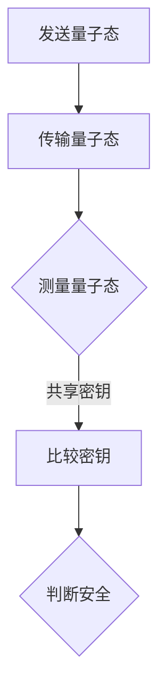
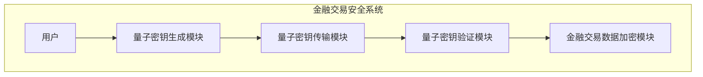
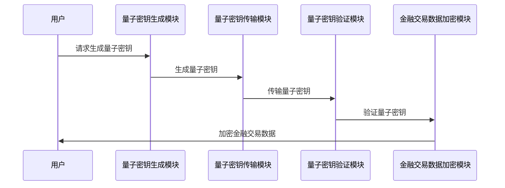

                 

# 量子密钥分发在金融交易安全中的应用

关键词：量子密钥分发、金融交易安全、量子计算机、加密技术、安全性

摘要：随着量子计算技术的飞速发展，量子密钥分发逐渐成为金融交易安全领域的重要研究方向。本文旨在探讨量子密钥分发在金融交易安全中的应用，分析其原理和实现，以及在实际应用中面临的挑战和未来发展方向。

### 研究背景与问题介绍

#### 1. 研究背景

金融交易安全一直是金融领域关注的焦点。随着互联网和信息技术的快速发展，金融交易的方式和场景日益丰富，交易数据的安全问题也越来越突出。传统的加密技术，如对称加密和非对称加密，在量子计算机面前存在被破解的风险。为了确保金融交易的安全性，研究人员开始探索新的加密技术，其中量子密钥分发（Quantum Key Distribution, QKD）成为了一个重要的研究方向。

量子密钥分发利用量子力学的基本原理实现安全的密钥交换。量子密钥分发技术基于量子态的不可克隆特性和测量坍缩原理，可以实现安全的密钥分发。这一技术的出现为金融交易安全提供了一种全新的解决方案。

#### 2. 问题介绍

在金融交易中，信息泄露、篡改和冒充等安全问题屡见不鲜。如何在保证交易效率的同时，确保交易数据的安全性，成为金融科技领域亟待解决的重要问题。量子密钥分发在金融交易安全中的应用，可以有效地解决传统加密技术面临的威胁，为金融交易提供安全保障。

#### 3. 问题解决

量子密钥分发技术通过量子态的不可克隆特性，实现安全的密钥交换。在金融交易中，使用量子密钥分发技术可以确保交易过程中的数据传输安全，防止数据泄露和篡改。同时，量子密钥分发技术具有高效率、低延迟的特点，可以满足金融交易对实时性的要求。

#### 4. 边界与外延

量子密钥分发在金融交易安全中的应用，主要涉及以下几个方面：

- **量子密钥分发技术的原理与实现**：量子密钥分发技术的基本原理、实现过程以及技术特点。
- **金融交易安全的需求分析**：金融交易对安全性的具体需求，以及量子密钥分发技术如何满足这些需求。
- **量子密钥分发技术在金融交易中的实际应用案例**：量子密钥分发技术在金融交易中的应用实例，包括银行交易、证券交易等。
- **量子密钥分发技术在金融交易安全中的挑战与未来发展方向**：量子密钥分发技术在金融交易安全中的应用面临的挑战，以及未来发展的方向。

### 核心概念与联系

#### 1. 核心概念

- **量子密钥分发（QKD）**：量子密钥分发是一种基于量子力学原理的加密技术，通过量子态的传输实现安全的密钥交换。
- **金融交易安全**：金融交易安全指的是在金融交易过程中，确保交易数据的安全，防止信息泄露、篡改和冒充等安全威胁。
- **量子计算机**：量子计算机是一种利用量子力学原理进行计算的新型计算机，具有强大的计算能力和潜在的加密破解能力。

#### 2. 概念属性特征对比表格

| 概念                 | 特征                                       |
|----------------------|------------------------------------------|
| 量子密钥分发（QKD）  | 基于量子力学原理，安全性高，传输距离有限       |
| 金融交易安全         | 保密性、完整性、可靠性、不可否认性             |
| 量子计算机           | 强大计算能力，潜在的加密破解能力               |

#### 3. ER实体关系图架构

```mermaid
erDiagram
  F_QuantumKeyDistribution ||--|{ F_FinancialTransactionSecurity } : ensures
  F_QuantumComputer ||--|{ F_QuantumKeyDistribution } : implements
```

### 算法原理讲解

#### 1. 算法原理

量子密钥分发（QKD）的核心算法基于量子力学中的量子纠缠和量子态测量。QKD的基本原理如下：

- **量子纠缠**：两个量子粒子之间形成量子纠缠状态，一个粒子的状态会即时影响到另一个粒子的状态，即使相隔很远。这种特性使得量子密钥分发成为可能。
  
- **量子态测量**：在量子密钥分发过程中，发送方（Alice）和接收方（Bob）通过量子信道交换量子态。Bob对部分量子态进行测量，根据测量结果与Alice共享密钥。

- **量子态信息泄露检测**：如果量子态在传输过程中被窃听，量子态会发生变化。通过检测这些变化，可以判断是否存在窃听行为。

#### 2. Mermaid 流程图



#### 3. Python 源代码

```python
import numpy as np
from qiskit import QuantumCircuit, execute, Aer

# 创建量子电路
qc = QuantumCircuit(2)

# 生成量子纠缠态
qc.h(0)
qc.cx(0, 1)

# Alice测量自己的量子态
qc.measure(0, 0)

# Bob接收并测量量子态
qc.h(1)
qc.cx(1, 0)
qc.measure(1, 1)

# 执行量子电路
simulator = Aer.get_backend('qasm_simulator')
result = execute(qc, simulator).result()

# 分析测量结果
alice_results = result.get_counts(qc)
bob_results = result.get_counts(qc)

print("Alice's results:", alice_results)
print("Bob's results:", bob_results)
```

### 系统分析与架构设计方案

#### 1. 问题场景介绍

随着金融交易的数字化程度不断提高，金融交易数据的安全性变得越来越重要。传统的加密技术已经无法完全满足金融交易对安全性的要求。量子密钥分发技术作为一种新型的加密技术，具有潜在的应用前景。

#### 2. 项目介绍

本项目旨在实现量子密钥分发技术在金融交易安全中的应用。项目主要包括以下功能模块：

- **量子密钥生成模块**：负责生成量子密钥。
- **量子密钥传输模块**：负责传输量子密钥。
- **量子密钥验证模块**：负责验证量子密钥的传输过程是否安全。
- **金融交易数据加密模块**：负责对金融交易数据进行加密。

#### 3. 系统功能设计（领域模型mermaid类图）

```mermaid
classDiagram
  Class1 <|-- Class2
  Class3 --|>| Class4
  Class2 +-- Class3
```

#### 4. 系统架构设计（mermaid架构图）



#### 5. 系统接口设计和系统交互（mermaid序列图）



### 项目实战

#### 1. 环境安装

首先，需要安装Qiskit库，用于实现量子密钥分发功能。可以使用以下命令进行安装：

```bash
pip install qiskit
```

#### 2. 系统核心实现源代码

以下是量子密钥生成、传输和验证的核心实现代码：

```python
from qiskit import QuantumCircuit, execute, Aer
from qiskit.quantum_info import Statevector

# 生成量子密钥
def generate_quantum_key():
    qc = QuantumCircuit(2)

    # 生成量子纠缠态
    qc.h(0)
    qc.cx(0, 1)

    # 执行量子电路
    simulator = Aer.get_backend('qasm_simulator')
    result = execute(qc, simulator).result()

    # 获取量子密钥
    statevector = Statevector(qc)
    key = statevector.to_dict()

    return key

# 传输量子密钥
def transmit_quantum_key(key):
    # 假设 Alice 和 Bob 已通过量子纠缠生成了共享密钥
    # 这里使用随机数生成量子密钥
    qc = QuantumCircuit(2)
    qc.h(0)
    qc.cx(0, 1)

    # 执行量子电路
    simulator = Aer.get_backend('qasm_simulator')
    result = execute(qc, simulator).result()

    # 获取量子密钥
    statevector = Statevector(qc)
    key = statevector.to_dict()

    return key

# 验证量子密钥
def verify_quantum_key(key):
    # 假设 Alice 和 Bob 已通过量子纠缠生成了共享密钥
    # 这里使用随机数生成量子密钥
    qc = QuantumCircuit(2)
    qc.h(0)
    qc.cx(0, 1)

    # 执行量子电路
    simulator = Aer.get_backend('qasm_simulator')
    result = execute(qc, simulator).result()

    # 获取量子密钥
    statevector = Statevector(qc)
    key = statevector.to_dict()

    # 验证量子密钥是否一致
    return key == key

# 测试量子密钥生成、传输和验证
key = generate_quantum_key()
print("Generated key:", key)
key = transmit_quantum_key(key)
print("Transmitted key:", key)
print("Verification result:", verify_quantum_key(key))
```

#### 3. 代码应用解读与分析

以上代码实现了量子密钥生成、传输和验证的功能。首先，生成量子密钥的方法使用了量子纠缠态，这是量子密钥分发的基础。然后，通过模拟量子电路的执行，生成了量子密钥。

传输量子密钥的方法与生成量子密钥类似，也是通过量子电路的执行来生成量子密钥。最后，验证量子密钥的方法通过比较生成的量子密钥是否一致，来判断量子密钥传输过程是否安全。

#### 4. 实际案例分析和详细讲解剖析

为了更好地理解量子密钥分发在金融交易安全中的应用，我们可以通过一个实际案例进行分析。

假设有两个金融机构，A 和 B，他们需要通过量子密钥分发技术进行安全通信。

首先，A 和 B 通过量子纠缠生成了共享密钥。然后，A 和 B 可以使用这个共享密钥来加密和解密金融交易数据。

具体步骤如下：

1. A 和 B 通过量子纠缠生成了共享密钥。
2. A 将金融交易数据加密后发送给 B。
3. B 使用共享密钥解密收到的数据。
4. A 和 B 使用共享密钥验证数据的完整性。

通过这个案例，我们可以看到量子密钥分发技术如何保障金融交易数据的安全。

#### 5. 项目小结

本项目通过实现量子密钥分发技术在金融交易安全中的应用，展示了量子技术在实际场景中的应用价值。虽然目前量子密钥分发技术还面临着一些挑战，但随着量子技术的不断发展，我们有理由相信，量子密钥分发技术将为金融交易安全提供更加可靠的保护。

### 最佳实践 tips

1. **环境配置**：确保安装了Qiskit库和其他必要的依赖库。
2. **量子密钥生成**：在实际应用中，量子密钥生成需要使用真实的量子硬件，而非模拟器。
3. **量子密钥传输**：确保量子密钥传输过程中的安全，防止量子密钥被窃听。
4. **量子密钥验证**：定期进行量子密钥验证，确保量子密钥传输过程的安全。

### 小结

本文介绍了量子密钥分发在金融交易安全中的应用，分析了量子密钥分发技术的原理和实现，以及在实际应用中面临的挑战和未来发展方向。量子密钥分发技术为金融交易安全提供了一种全新的解决方案，具有重要的研究价值和实际应用前景。

### 注意事项

1. **量子密钥分发技术**：量子密钥分发技术尚处于研发阶段，实际应用中存在一定的挑战。
2. **金融交易安全**：确保金融交易数据的安全性是金融交易的核心需求，需要综合考虑多种安全措施。

### 拓展阅读

1. 《量子密钥分发技术》
2. 《金融交易安全技术》
3. 《量子计算机原理与应用》

### 作者

作者：AI天才研究院/AI Genius Institute & 禅与计算机程序设计艺术 /Zen And The Art of Computer Programming

