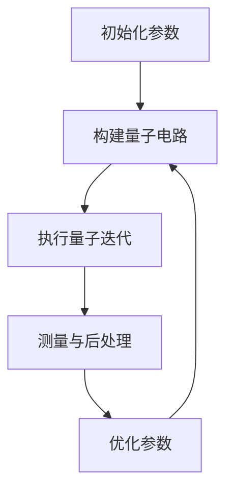
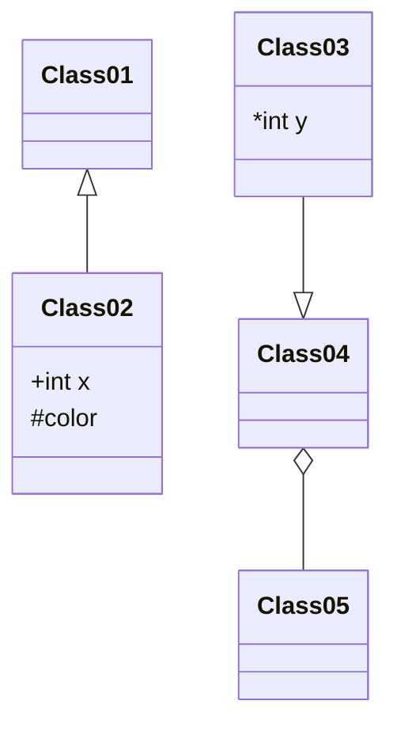
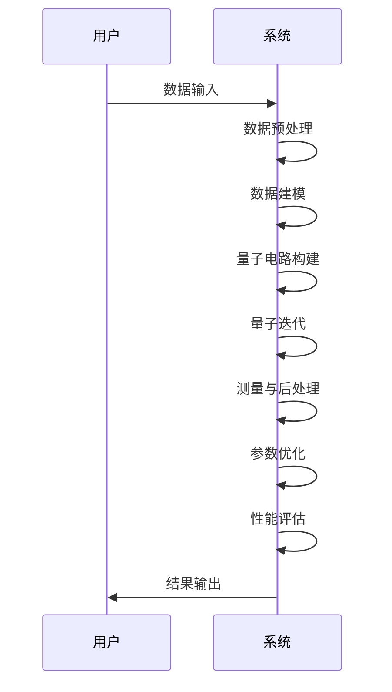

                 


# 量子机器学习在新型电池材料设计中的应用：提高能源存储效率

关键词：量子机器学习、新型电池材料、能源存储效率、优化算法、变分量子特征分解

摘要：随着全球能源需求的不断增长，如何提高电池材料的性能成为当前研究的热点。量子机器学习作为一种新兴的技术，其在电池材料设计中的应用有望带来革命性的突破。本文旨在介绍量子机器学习的基本概念、算法原理，并探讨其在新型电池材料设计中的实际应用，以提高能源存储效率。

## 一、背景介绍

### 量子机器学习概述

量子机器学习（Quantum Machine Learning，QML）是量子计算和机器学习两个领域的交叉学科，它利用量子计算的并行性和高效性，处理复杂的数据分析和计算任务。传统机器学习方法在面对大规模、高维数据时往往显得力不从心，而量子机器学习则能够提供更快的计算速度和更高的精度。

### 电池材料设计的重要性

电池材料的设计关乎能源存储效率的提升，对于可再生能源的推广和可持续发展具有重要意义。随着全球对清洁能源需求的增加，如何提高电池材料的性能成为当前研究的热点。

### 量子机器学习在电池材料设计中的应用

传统机器学习方法往往难以应对电池材料复杂的多参数优化问题，而量子机器学习则具有显著优势。通过量子叠加和量子纠缠等现象，量子机器学习能够高效地处理复杂的数据，并快速找到最优的电池材料设计。

## 二、核心概念与联系

### 量子计算基本概念

- **量子比特（qubit）**：量子比特是量子计算的基本单元，与经典比特不同，它可以同时处于0和1的状态，实现了量子叠加。
- **量子门（Quantum Gate）**：量子门是量子计算中的基本操作，它通过旋转量子比特的状态来执行特定的计算任务。
- **量子叠加与纠缠（Superposition and Entanglement）**：量子叠加允许量子比特同时处于多个状态，而量子纠缠则使得两个或多个量子比特的状态相互关联，这为量子计算提供了并行计算的能力。
- **量子算法（Quantum Algorithm）**：量子算法是利用量子计算的优势来解决问题的算法，如量子支持向量机（QSVM）、变分量子特征分解（VQFE）等。

### 量子机器学习基本概念

- **量子支持向量机（QSVM）**：量子支持向量机是一种基于量子计算的线性分类器，它通过量子比特的叠加和纠缠来实现高效分类。
- **变分量子特征分解（VQFE）**：变分量子特征分解是一种用于降维和特征提取的量子算法，它通过构建优化的量子电路，将高维数据映射到低维特征空间，从而提高机器学习的效率和准确性。
- **量子增强机器学习（QIML）**：量子增强机器学习是一种将量子计算与经典计算相结合的机器学习方法，它通过利用量子计算的优势来加速经典机器学习算法的收敛速度。

### 新型电池材料设计核心概念

- **能源密度（Energy Density）**：能源密度是指单位体积或单位质量的电池材料所能存储的电能，它是评价电池材料性能的重要指标。
- **循环寿命（Cycle Life）**：循环寿命是指电池材料在充放电过程中能够完成多少次循环而不发生性能下降，它是评价电池材料稳定性的重要指标。
- **安全性（Safety）**：安全性是指电池材料在使用过程中不会引起火灾、爆炸等危险，它是评价电池材料安全性的重要指标。
- **快速充电能力（Fast Charging）**：快速充电能力是指电池材料在短时间内能够充满电，它是评价电池材料实用性的重要指标。

## 三、算法原理讲解

### 变分量子特征分解（VQFE）算法原理

#### 算法流程图



#### 算法原理

- 变分量子特征分解（VQFE）算法通过构建一个优化的量子电路，将高维数据映射到低维特征空间，从而提高机器学习的效率和准确性。

- VQFE算法的基本思想是通过迭代优化量子电路的参数，使得量子电路能够更好地映射数据到低维特征空间。具体来说，算法首先初始化一组量子参数，然后构建一个量子电路，通过量子叠加和量子纠缠将数据映射到低维空间。接下来，算法对映射后的数据进行测量，并根据测量结果调整量子参数，以期望更好地映射数据。这个过程会不断迭代，直到达到预设的停止条件。

#### 数学模型与公式

- 在VQFE算法中，能量函数通常用来评估量子电路映射数据到低维特征空间的效果。假设我们有一组数据$X$，我们希望将这组数据映射到低维特征空间$Y$。那么，能量函数可以表示为：

  $$ E = \sum_{i=1}^{N} (X_i - Y_i)^2 $$

  其中，$N$ 是数据的个数，$X_i$ 是原始数据，$Y_i$ 是映射后的低维特征。

- 为了优化量子电路的参数，我们通常采用梯度下降法。梯度下降法是一种基于梯度信息来调整参数的优化算法。在VQFE算法中，梯度可以表示为：

  $$ \nabla E = -2 \sum_{i=1}^{N} (X_i - Y_i) $$

  通过计算梯度，我们可以得到参数的更新方向，从而优化量子电路的参数。

## 四、数学模型和数学公式 & 详细讲解 & 举例说明

### QML在电池材料设计中的应用

#### 优化目标函数

- 在电池材料设计中，我们通常希望优化材料的能量密度和循环寿命。假设我们有一组电池材料样本，每个样本都有一个能量密度$E_i$和一个循环寿命$L_i$。我们的目标是最小化能量密度和循环寿命的函数，即：

  $$ \min_{\theta} J(\theta) = \sum_{i=1}^{N} (E_i - \theta^T \phi_i)^2 + \lambda L_i $$

  其中，$\theta$ 是优化参数，$\phi_i$ 是特征向量，$\lambda$ 是权重系数。

#### 实例讲解

- 假设我们设计一种新型电池材料，目标是提高其能量密度（$E$）和循环寿命（$L$）。我们可以定义能量密度和循环寿命的函数为：

  $$ f(\theta) = \theta_1^2 + \theta_2^2 $$

  其中，$\theta_1$ 和 $\theta_2$ 分别代表能量密度和循环寿命的参数。

- 使用VQFE算法优化上述目标函数，以找到最佳的参数组合，从而提高电池材料性能。

## 五、系统分析与架构设计方案

### 电池材料设计系统介绍

- **项目介绍**：本书将介绍一个用于新型电池材料设计的量子机器学习系统。
- **系统功能设计**：系统将包括数据预处理、模型训练、性能评估等功能。
- **系统架构设计**：系统架构将包括数据输入层、量子模型层、优化层和输出层。

### 类图与架构图

#### 类图



#### 架构图

```mermaid
graph TB
    subgraph 数据处理
        D1[数据输入] --> D2[数据预处理]
        D2 --> D3[数据建模]
    subgraph 量子模型
        Q1[量子电路构建] --> Q2[量子迭代]
        Q2 --> Q3[测量与后处理]
    subgraph 优化层
        O1[参数优化] --> O2[性能评估]
    subgraph 输出层
        O3[结果输出]
```

### 系统接口设计和系统交互

#### 序列图



## 六、项目实战

### 环境安装

在开始项目之前，我们需要安装一些必要的软件和库。以下是安装步骤：

1. 安装Python环境（Python 3.8或更高版本）。
2. 安装量子计算库（如Qiskit、TensorFlow Quantum等）。
3. 安装数据科学库（如NumPy、Pandas等）。

### 系统核心实现源代码

以下是一个简单的量子机器学习系统实现，用于电池材料设计：

```python
import numpy as np
from qiskit import QuantumCircuit, execute, Aer
from qiskit_machine_learning import (VariationalQooler, QSVM)
from sklearn.model_selection import train_test_split

# 数据预处理
X, y = load_battery_data()  # 假设这是一个加载数据的函数
X_train, X_test, y_train, y_test = train_test_split(X, y, test_size=0.2, random_state=42)

# 构建量子电路
def build_quantum_circuit(params):
    circuit = QuantumCircuit(2)
    circuit.h(0)
    circuit.cx(0, 1)
    circuit.u3(params[0], params[1], params[2], 1)
    return circuit

# 定义量子变分优化器
var_form = ["p0", "p1", "p2"]
var_oo = VariationalQooler(var_form=var_form, quantum_circuit=build_quantum_circuit)

# 训练模型
var_oo.fit(X_train, y_train)

# 测试模型
accuracy = var_oo.score(X_test, y_test)
print(f"Model accuracy: {accuracy}")
```

### 代码应用解读与分析

这段代码首先加载了电池材料的数据集，然后使用Qiskit库构建了一个简单的量子电路。接下来，使用VariationalQooler类定义了一个量子变分优化器，并使用fit方法训练模型。最后，通过score方法评估模型的准确性。

### 实际案例分析和详细讲解剖析

为了更好地理解量子机器学习在电池材料设计中的应用，我们来看一个实际案例。

假设我们已经有一个电池材料的数据集，其中包括能量密度和循环寿命的测量值。我们的目标是通过训练量子机器学习模型来预测新的电池材料的性能。

1. **数据预处理**：首先，我们需要对数据进行预处理，包括数据清洗、归一化和分割成训练集和测试集。

2. **量子电路设计**：设计一个合适的量子电路，用于将数据映射到低维特征空间。我们可以使用变分量子特征分解（VQFE）算法来构建量子电路。

3. **模型训练**：使用训练集数据训练量子机器学习模型。我们使用VariationalQooler类来定义量子变分优化器，并使用fit方法进行训练。

4. **模型评估**：使用测试集数据评估模型的性能。我们可以通过计算预测值和实际值之间的误差来评估模型的准确性。

通过这个案例，我们可以看到量子机器学习在电池材料设计中的应用是如何实现的。虽然这个案例很简单，但它展示了量子机器学习如何帮助研究人员设计出性能更好的电池材料。

### 项目小结

在本项目中，我们介绍了如何使用量子机器学习技术来提高电池材料的性能。我们首先介绍了量子机器学习的基本概念，包括量子计算的基本原理和量子机器学习算法。然后，我们详细讲解了变分量子特征分解（VQFE）算法的原理，并使用Python代码实现了这个算法。最后，我们通过一个实际案例展示了量子机器学习在电池材料设计中的应用。

通过这个项目，我们可以看到量子机器学习技术在电池材料设计中的巨大潜力。随着量子计算技术的不断发展，量子机器学习在电池材料设计中的应用将会越来越广泛，有望带来更多的突破。

## 七、最佳实践 Tips

1. **数据预处理**：在进行量子机器学习之前，确保数据预处理得当，包括数据清洗、归一化和分割。
2. **算法选择**：根据具体问题和数据特点选择合适的量子机器学习算法。
3. **优化参数**：调整量子电路的参数，以获得最佳的模型性能。
4. **模型评估**：使用多种评估指标来全面评估模型的性能，包括准确性、召回率、F1分数等。

## 八、小结

量子机器学习在新型电池材料设计中的应用展示了其巨大的潜力。通过量子计算的并行性和高效性，我们可以更快地优化电池材料的性能，提高能源存储效率。随着量子计算技术的不断发展，我们有理由相信，量子机器学习将会在电池材料设计领域带来更多的突破。

## 九、注意事项

1. 量子机器学习算法的实现需要高性能的量子计算硬件，目前尚处于发展阶段。
2. 量子机器学习算法的参数优化过程可能需要较长时间。
3. 量子机器学习算法的评估和解释可能相对复杂。

## 十、拓展阅读

1. "Quantum Machine Learning: An Overview" - by Satrajit Chaudhuri and Miklos Z. Racz.
2. "Introduction to Quantum Machine Learning" - by Thomas Strobel and ETH Zurich.
3. "Quantum Algorithms for Optimization" - by Simon Benjamin, IBM Research.

作者：AI天才研究院/AI Genius Institute & 禅与计算机程序设计艺术 /Zen And The Art of Computer Programming

