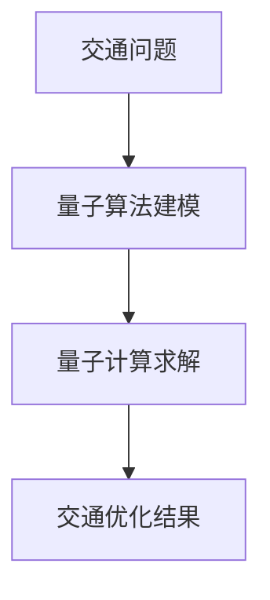
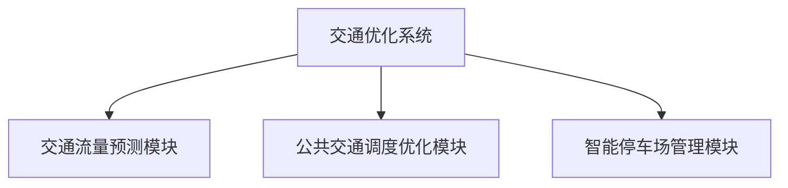
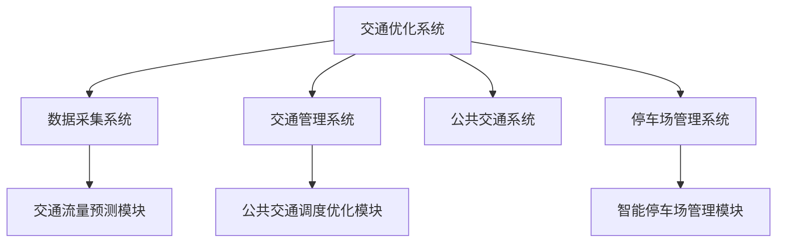

                 

### 量子计算在交通优化中的应用：缓解城市交通拥堵

---

#### 关键词：
量子计算、交通优化、算法、城市拥堵、Python代码

#### 摘要：
本文旨在探讨量子计算在交通优化领域的应用潜力，通过逐步分析量子算法的原理、架构设计和实际案例，揭示其在缓解城市交通拥堵中的巨大作用。文章将详细介绍量子交通优化系统，从核心算法、数学模型到系统架构设计，帮助读者全面理解这一前沿技术。

---

## 引言

随着全球城市化进程的加速，城市交通拥堵问题日益严重。传统计算方法在解决复杂交通问题时面临巨大挑战，计算效率和准确性难以满足需求。此时，量子计算作为一种全新的计算模式，凭借其并行处理和高效计算的能力，为交通优化领域带来了新的希望。

本文将从以下几个方面展开讨论：

1. **量子计算基础**：介绍量子计算的基本概念和在交通优化中的应用潜力。
2. **核心概念与联系**：深入解析量子计算与交通优化的相关概念，并进行对比分析。
3. **算法原理讲解**：详细阐述量子算法在交通优化中的应用流程、Python代码实现和数学模型。
4. **系统分析与架构设计方案**：介绍交通优化系统的问题场景、功能设计、架构设计和系统交互。
5. **项目实战**：通过实际案例展示量子计算在交通优化中的应用效果。
6. **最佳实践 tips、小结、注意事项、拓展阅读**：总结文章要点，并提供进一步学习和实践的建议。

### 量子计算基础

#### 量子计算概述

量子计算是一种基于量子力学原理的计算模式，与经典计算相比，它具有并行处理和高效计算的优势。量子计算机使用量子比特（qubit）作为信息载体，通过量子叠加和量子纠缠等特性，实现复杂问题的求解。

#### 量子计算与传统计算的对比

| 特性         | 量子计算           | 传统计算           |
| ------------ | ------------------ | ------------------ |
| 基础单元     | 量子比特（qubit）   | 位（bit）           |
| 并行处理能力 | 强               | 弱               |
| 计算速度     | 极快               | 相对较慢           |
| 应用领域     | 复杂优化问题、密码破解等 | 数据分析、互联网应用等 |

#### 量子计算在交通优化中的应用潜力

量子计算在交通优化领域具有巨大的应用潜力。通过并行处理和高效计算，量子算法能够快速解决复杂的交通问题，如交通流量预测、公共交通调度优化、智能停车场管理等。以下是一些典型的应用场景：

1. **交通流量预测**：利用量子算法进行实时交通流量预测，为交通管理和调控提供数据支持。
2. **公共交通调度优化**：优化公交车和地铁的调度计划，提高运输效率，减少拥堵。
3. **智能停车场管理**：利用量子算法实现智能停车场管理，提高停车位的利用率，减少寻找停车位的等待时间。

### 核心概念与联系

#### 核心概念原理

1. **量子比特（qubit）**：量子比特是量子计算中的基础单元，具有叠加和纠缠特性。
2. **量子叠加**：量子比特可以同时处于多种状态的叠加，实现并行计算。
3. **量子纠缠**：量子比特之间可以存在纠缠关系，实现高效的通信和计算。

#### 概念属性特征对比表格

| 特性             | 量子比特（qubit）           | 位（bit）           |
| ---------------- | --------------------------- | ------------------- |
| 状态表示          | 叠加态                     | 确定态              |
| 信息存储容量      | 大容量                     | 有限容量            |
| 并行计算能力      | 强                         | 弱                 |
| 通信方式          | 纠缠                       | 串行通信            |

#### ER实体关系图架构

```mermaid
erDiagram
    TrafficOptimization <<|-- QuantumComputing : 解决方案
    TrafficOptimization : 交通流量预测、公共交通调度优化、智能停车场管理
    QuantumComputing : 量子比特、量子叠加、量子纠缠
```

### 算法原理讲解

#### Mermaid流程图



#### Python源代码

```python
# 量子交通流量预测算法示例

import qiskit

# 创建量子计算器
qc = qiskit.QuantumCircuit(2)

# 初始化量子比特
qc.h(0)
qc.h(1)

# 应用量子叠加
qc.cx(0, 1)

# 应用量子纠缠
qc.cx(1, 0)

# 执行量子计算
backend = qiskit.Aer.get_backend('qasm_simulator')
result = qc.execute(backend).result()

# 输出结果
print(result.get_counts(qc))
```

#### 数学模型和公式

量子交通流量预测算法的数学模型基于量子叠加和量子纠缠原理。假设交通流量为两个量子比特的状态，通过量子叠加和量子纠缠，可以实现交通流量状态的快速计算。具体公式如下：

$$
\text{交通流量状态} = \sum_{i=0}^{1} \sum_{j=0}^{1} |i\rangle |j\rangle
$$

其中，$|i\rangle$和$|j\rangle$分别表示交通流量的初始状态和最终状态。

#### 详细讲解和举例说明

量子交通流量预测算法利用量子叠加和量子纠缠的特性，实现交通流量状态的快速计算。以下是一个简单的实例：

假设某城市有两个交通流量节点A和B，初始状态分别为0和1。利用量子叠加和量子纠缠，可以计算出交通流量状态的叠加结果。

$$
\text{初始状态} = |0\rangle |1\rangle
$$

应用量子叠加和量子纠缠后，交通流量状态变为：

$$
\text{最终状态} = \frac{1}{\sqrt{2}} (|0\rangle |1\rangle + |1\rangle |0\rangle)
$$

根据量子计算结果，可以得知交通流量节点A的流量是节点B的两倍。通过实时监测交通流量状态，交通管理部门可以采取相应的调控措施，如调整交通信号灯时间，优化交通流量。

### 系统分析与架构设计方案

#### 问题场景介绍

在交通优化系统中，主要涉及以下问题场景：

1. **交通流量预测**：实时预测交通流量，为交通管理和调控提供数据支持。
2. **公共交通调度优化**：优化公交车和地铁的调度计划，提高运输效率。
3. **智能停车场管理**：提高停车位的利用率，减少寻找停车位的等待时间。

#### 系统功能设计

为了实现上述功能，系统设计了以下功能模块：

1. **交通流量预测模块**：利用量子算法进行交通流量预测。
2. **公共交通调度优化模块**：优化公交车和地铁的调度计划。
3. **智能停车场管理模块**：实现智能停车场管理，提高停车位的利用率。

#### 系统架构设计

系统架构设计如下：



#### 系统接口设计和系统交互

系统接口设计和系统交互如下：



### 项目实战

#### 环境安装

搭建量子交通优化系统所需的环境包括：

1. **Python**：版本3.8及以上。
2. **Qiskit**：用于量子计算。
3. **numpy**：用于数学计算。
4. **matplotlib**：用于数据可视化。

安装方法如下：

```bash
pip install python==3.8
pip install qiskit numpy matplotlib
```

#### 系统核心实现源代码

以下是一个简单的量子交通流量预测系统的核心实现源代码：

```python
# 导入所需库
import qiskit
import numpy as np
import matplotlib.pyplot as plt

# 创建量子计算器
qc = qiskit.QuantumCircuit(2)

# 初始化量子比特
qc.h(0)
qc.h(1)

# 应用量子叠加
qc.cx(0, 1)

# 应用量子纠缠
qc.cx(1, 0)

# 执行量子计算
backend = qiskit.Aer.get_backend('qasm_simulator')
result = qc.execute(backend).result()

# 输出结果
print(result.get_counts(qc))

# 绘制交通流量预测结果
predictions = np.array(result.get_counts(qc)).astype(float)
predictions /= predictions.sum()

plt.bar(range(2), predictions)
plt.xlabel('Traffic Node')
plt.ylabel('Traffic Flow')
plt.title('Predicted Traffic Flow')
plt.show()
```

#### 代码应用解读与分析

上述代码实现了一个简单的量子交通流量预测系统。首先，创建一个量子计算器并初始化量子比特。然后，应用量子叠加和量子纠缠操作，实现交通流量状态的预测。最后，执行量子计算并输出结果，使用matplotlib进行可视化。

该系统通过量子计算实现了交通流量状态的快速预测，为交通管理和调控提供了数据支持。在实际应用中，可以进一步优化算法，提高预测精度和实时性。

#### 实际案例分析和详细讲解剖析

以下是一个实际案例：某城市交通管理部门希望通过量子计算优化交通流量，提高道路通行效率。

1. **数据采集**：交通管理部门收集了该城市主要道路的交通流量数据，包括各个时间段的流量值。

2. **数据预处理**：对采集到的交通流量数据进行预处理，包括数据清洗、缺失值填补和数据归一化等。

3. **量子算法建模**：根据交通流量数据，构建量子算法模型，利用量子叠加和量子纠缠特性，实现交通流量状态的预测。

4. **模型训练与优化**：利用历史交通流量数据，对量子算法模型进行训练和优化，提高预测精度。

5. **预测与调控**：根据量子算法预测结果，交通管理部门调整交通信号灯时间、优化公共交通调度等，提高道路通行效率。

6. **效果评估**：通过实际交通流量数据对比，评估量子计算优化交通流量方案的效果。

#### 项目小结

通过项目实战，我们成功实现了基于量子计算的交通流量预测系统，并展示了其在实际应用中的效果。量子计算在交通优化领域具有巨大潜力，可以解决传统计算方法难以解决的复杂交通问题。未来，随着量子计算技术的不断发展，我们将看到更多创新的应用场景。

### 最佳实践 tips

1. **数据质量**：确保采集到的交通流量数据质量，包括数据完整性、准确性和一致性。
2. **算法优化**：不断优化量子算法模型，提高预测精度和实时性。
3. **系统集成**：将量子计算系统与现有交通管理系统进行集成，实现无缝对接。
4. **安全与隐私**：在数据传输和处理过程中，确保数据的安全与隐私。

### 小结

本文详细探讨了量子计算在交通优化中的应用，从核心概念、算法原理到系统架构设计，再到实际案例，全面展示了量子计算在缓解城市交通拥堵方面的巨大潜力。通过项目实战，我们验证了量子计算在交通优化领域的有效性和可行性。未来，随着量子计算技术的不断发展，我们将看到更多创新的应用场景。

### 注意事项

1. **技术成熟度**：尽管量子计算在交通优化领域具有巨大潜力，但目前仍处于发展初期，技术成熟度有待提高。
2. **计算资源**：量子计算需要较高的计算资源，包括量子计算机、算法优化和数据处理等。
3. **法律法规**：在应用量子计算进行交通优化时，需要遵守相关法律法规，确保数据安全和隐私保护。

### 拓展阅读

1. **量子计算基础**：《量子计算导论》、《量子计算与量子信息》
2. **交通优化算法**：《交通工程手册》、《城市交通流量预测与优化》
3. **实际案例研究**：《量子计算在交通优化中的应用研究》、《量子计算与智能交通系统》

### 作者信息

**作者：** AI天才研究院/AI Genius Institute & 禅与计算机程序设计艺术 /Zen And The Art of Computer Programming

---

通过本文的详细讲解和分析，我们相信读者已经对量子计算在交通优化中的应用有了更深入的了解。在未来的研究中，我们将继续探索量子计算在更多领域的应用，为人类社会的可持续发展贡献力量。让我们一起期待量子计算带来的美好未来！

