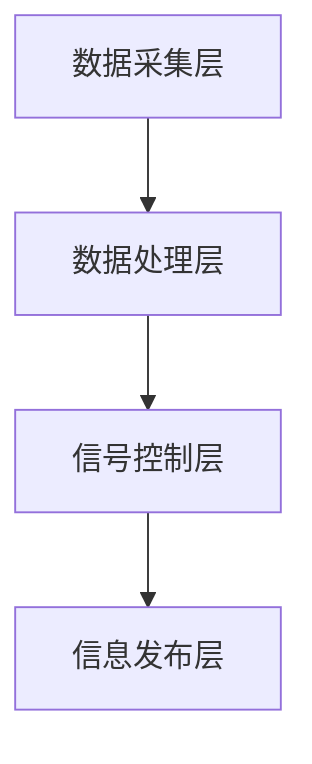

                 

# 《量子计算在交通流优化中的应用前景》

## 关键词：量子计算、交通流优化、算法、系统架构、实践、未来研究

> 摘要：本文将深入探讨量子计算在交通流优化中的应用前景。首先，我们将介绍量子计算的基本概念和原理，接着分析交通流优化问题的背景及其重要性。随后，我们将详细阐述量子计算算法在交通流优化中的应用、优势与挑战，并进一步讲解量子计算算法的数学模型和实例。最后，我们将设计一个交通流优化的量子计算应用架构，并分享实际项目的实施经验与最佳实践，总结文章并提出未来研究方向。

### 目录大纲

# 《量子计算在交通流优化中的应用前景》

## 第一部分：背景介绍

### 第1章：量子计算概述

### 1.1 量子计算的基本概念

### 1.2 量子计算与传统计算的区别

### 1.3 量子计算的核心技术

### 1.4 量子计算的发展现状

### 第2章：交通流优化问题背景

### 2.1 交通流优化的重要性

### 2.2 交通流优化问题的特征

### 2.3 量子计算在交通流优化中的应用前景

## 第二部分：核心概念与联系

### 第3章：量子计算算法原理

### 3.1 量子计算算法的基本原理

### 3.2 量子计算算法的属性特征对比

### 3.3 量子计算算法与传统算法的比较

### 第4章：交通流优化中的量子算法

### 4.1 量子算法在交通流优化中的应用

### 4.2 量子算法在交通流优化中的优势

### 4.3 量子算法在交通流优化中的挑战

## 第三部分：算法原理讲解

### 第5章：量子计算算法的数学模型

### 5.1 量子计算算法的数学基础

### 5.2 量子计算算法的数学模型

### 5.3 量子计算算法的数学公式

### 第6章：量子计算算法的举例说明

### 6.1 量子计算算法的简单实例

### 6.2 量子计算算法的实例分析

### 6.3 量子计算算法的应用场景

## 第四部分：系统分析与架构设计方案

### 第7章：量子计算在交通流优化中的应用架构设计

### 7.1 问题场景介绍

### 7.2 系统功能设计

### 7.3 系统架构设计

### 7.4 系统接口设计和系统交互

### 第8章：项目实战

### 8.1 环境安装

### 8.2 系统核心实现源代码

### 8.3 代码应用解读与分析

### 8.4 实际案例分析和详细讲解剖析

### 8.5 项目小结

## 第五部分：最佳实践与总结

### 第9章：最佳实践

### 9.1 量子计算在交通流优化中的最佳实践

### 9.2 注意事项

### 9.3 拓展阅读

### 第10章：总结

### 10.1 本书内容的总结

### 10.2 量子计算在交通流优化中的应用前景

### 10.3 未来研究方向

## 总结

### 引言

随着城市化进程的加速和交通需求的不断增加，交通拥堵问题日益严重，如何有效优化交通流成为当前研究的热点。传统计算方法在面对大规模、复杂交通流问题时，往往难以在合理时间内得出最优解。而量子计算的崛起，为解决交通流优化问题提供了新的思路和可能性。本文将深入探讨量子计算在交通流优化中的应用前景，以期为相关领域的研究提供参考。

### 第一部分：背景介绍

### 第1章：量子计算概述

#### 1.1 量子计算的基本概念

量子计算是一种基于量子力学原理的计算模型，由物理学家 Richard Feynman 于 1981 年首次提出。与传统计算不同，量子计算利用量子比特（qubit）作为信息载体，通过量子叠加和量子纠缠等现象实现高效计算。

量子比特是量子计算的基本单元，与经典计算机中的比特不同，它不仅可以表示 0 和 1 的组合状态，还可以同时处于多个状态的叠加。这种叠加态使得量子计算机在处理问题时，可以同时考虑多种可能性，从而大幅提升计算效率。

量子纠缠是量子计算中的另一个核心概念，它描述了两个或多个量子比特之间的特殊关联。即使这些量子比特相隔很远，它们之间的状态仍然可以相互影响。这种纠缠效应可以用于构建复杂的量子算法，从而实现传统计算机难以实现的高效计算。

#### 1.2 量子计算与传统计算的区别

量子计算与传统计算在多个方面存在显著差异：

1. **计算模型**：传统计算基于二进制位，使用 0 和 1 表示信息。量子计算则基于量子比特，利用叠加态和纠缠态实现多状态计算。
2. **计算速度**：量子计算机可以在某些特定问题上，以传统计算机无法实现的速度进行计算。例如，Shor 算法可以在多项式时间内解决大整数分解问题，而传统计算机则需要指数级时间。
3. **计算资源**：量子计算机需要特殊的物理环境，如低温超导量子比特和精确的量子态控制，而传统计算机则相对容易实现。
4. **算法设计**：量子计算算法的设计和实现与传统算法有较大差异，需要考虑量子叠加、量子纠缠等现象。

#### 1.3 量子计算的核心技术

量子计算的核心技术包括量子比特、量子门和量子测量。

1. **量子比特**：量子比特是实现量子计算的基础。目前，常见的量子比特有超导量子比特、离子阱量子比特和拓扑量子比特等。这些量子比特需要通过特殊的方法生成和保持，以保证量子态的稳定性和准确性。
2. **量子门**：量子门是实现量子计算操作的单元。与经典计算中的逻辑门不同，量子门可以同时作用于多个量子比特。常见的量子门包括 Hadamard 门、Pauli 门和控制门等。
3. **量子测量**：量子测量是量子计算机输出结果的过程。通过测量量子比特的状态，可以将其从叠加态转换为确定态。量子测量可能会破坏量子叠加和纠缠状态，因此需要谨慎设计测量方案。

#### 1.4 量子计算的发展现状

量子计算自提出以来，已取得了显著进展。目前，多个国家和公司正在研发量子计算机，一些小型量子计算机已开始应用于特定领域。以下是一些量子计算的发展现状：

1. **量子比特数量**：随着技术的进步，量子比特的数量不断增加。2019 年，Google 宣布实现了 53 个量子比特的“量子优越性”。
2. **量子算法**：越来越多的量子算法被设计和实现，如 Shor 算法、Grover 算法和量子支持向量机等。这些算法在特定问题上表现出显著优势。
3. **量子硬件**：量子硬件的研发也在不断推进，包括超导量子比特、离子阱量子比特和拓扑量子比特等。同时，量子计算机的稳定性和可靠性也在逐步提升。

### 第2章：交通流优化问题背景

#### 2.1 交通流优化的重要性

交通流优化是现代城市交通管理的重要环节，旨在提高道路通行效率、减少拥堵、降低交通事故发生率。随着城市规模的扩大和交通需求的增加，交通流优化的重要性日益凸显。以下是一些主要原因：

1. **提高通行效率**：交通流优化可以有效地减少道路拥堵，提高车辆的通行速度，从而降低交通拥堵对经济和社会发展的影响。
2. **减少碳排放**：通过优化交通流，可以降低车辆的行驶里程和碳排放量，有助于缓解环境污染问题。
3. **降低交通事故发生率**：交通流优化可以提高道路通行安全性，降低交通事故的发生率和严重程度。
4. **提高公共交通服务质量**：交通流优化可以改善公共交通的运行效率，提高乘客的出行体验。

#### 2.2 交通流优化问题的特征

交通流优化问题具有以下特征：

1. **大规模性**：交通流优化通常涉及大量交通数据和交通参与者，如车辆、行人、公共交通等。这使得优化问题规模巨大，难以通过传统计算方法解决。
2. **动态性**：交通流优化问题具有动态特征，交通状况会随着时间和空间的变化而变化。这要求优化算法具备实时响应能力，以适应动态变化。
3. **不确定性**：交通流优化问题面临多种不确定性，如交通流量波动、道路施工、突发事件等。这使得优化问题更加复杂，需要考虑多种可能性。
4. **多目标性**：交通流优化涉及多个目标，如最小化拥堵时间、最大化道路通行能力、最小化碳排放等。这要求优化算法能够在多个目标之间进行平衡。

#### 2.3 量子计算在交通流优化中的应用前景

量子计算在交通流优化中具有广泛的应用前景：

1. **高效计算能力**：量子计算机可以在特定问题上实现高效计算，有助于解决大规模、复杂的交通流优化问题。
2. **实时响应能力**：量子计算可以实时处理动态交通流数据，为交通管理者提供实时优化建议，提高交通流优化效果。
3. **多目标优化**：量子计算算法可以同时考虑多个优化目标，实现多目标平衡，提高交通流优化效果。
4. **不确定性处理**：量子计算算法可以处理交通流优化中的不确定性问题，为交通管理者提供可靠的优化建议。

### 第二部分：核心概念与联系

### 第3章：量子计算算法原理

#### 3.1 量子计算算法的基本原理

量子计算算法是基于量子力学原理设计的，具有以下基本原理：

1. **量子叠加**：量子比特可以处于多个状态的叠加，这使得量子计算机可以在同一时间内处理多个计算路径。
2. **量子纠缠**：量子比特之间的纠缠使得它们的状态相互关联，可以用于实现高效的信息传递和计算。
3. **量子门操作**：量子门是对量子比特进行操作的单元，可以实现量子态的变换和控制。
4. **量子测量**：量子测量是量子计算机输出结果的过程，通过测量量子比特的状态，可以实现计算结果的确定。

#### 3.2 量子计算算法的属性特征对比

以下是比较量子计算算法与经典计算算法的属性特征：

| 属性特征 | 量子计算算法 | 经典计算算法 |
| :---: | :---: | :---: |
| **计算模型** | 基于量子比特和量子门 | 基于二进制位和逻辑门 |
| **计算速度** | 可在特定问题上实现高效计算 | 速度取决于计算机硬件和算法 |
| **计算资源** | 需要特殊物理环境 | 使用传统计算机硬件 |
| **算法设计** | 需要考虑量子叠加、量子纠缠等现象 | 基于传统计算机原理 |
| **适用范围** | 可用于解决特定问题，如大整数分解、优化问题等 | 可用于各种计算问题 |

#### 3.3 量子计算算法与传统算法的比较

量子计算算法与传统算法在多个方面存在显著差异：

1. **计算模型**：量子计算算法基于量子比特和量子门，可实现多状态计算。传统算法基于二进制位和逻辑门，仅能处理二进制状态。
2. **计算速度**：量子计算算法在特定问题上可实现高效计算，速度远超传统算法。传统算法速度取决于计算机硬件和算法优化。
3. **计算资源**：量子计算算法需要特殊物理环境，如低温超导量子比特。传统算法使用传统计算机硬件，如 CPU 和 GPU。
4. **适用范围**：量子计算算法适用于解决特定问题，如大整数分解、优化问题等。传统算法适用于各种计算问题，包括科学计算、数据分析等。

### 第4章：交通流优化中的量子算法

#### 4.1 量子算法在交通流优化中的应用

量子算法在交通流优化中具有广泛的应用前景，以下是一些具体应用：

1. **交通流量预测**：量子算法可以高效处理大规模交通数据，实现实时交通流量预测。这对于交通管理者制定优化策略具有重要意义。
2. **路径规划**：量子算法可以用于求解复杂路径规划问题，为车辆提供最优行驶路径。这有助于降低道路拥堵、提高通行效率。
3. **交通信号控制**：量子算法可以用于优化交通信号控制策略，实现动态调整信号灯时长，提高道路通行能力。
4. **公共交通调度**：量子算法可以优化公共交通调度策略，提高公交车、地铁等公共交通的运行效率。

#### 4.2 量子算法在交通流优化中的优势

量子算法在交通流优化中具有以下优势：

1. **高效计算能力**：量子算法可以在特定问题上实现高效计算，有助于解决大规模、复杂的交通流优化问题。
2. **实时响应能力**：量子算法可以实时处理动态交通流数据，为交通管理者提供实时优化建议，提高交通流优化效果。
3. **多目标优化**：量子算法可以同时考虑多个优化目标，实现多目标平衡，提高交通流优化效果。
4. **不确定性处理**：量子算法可以处理交通流优化中的不确定性问题，为交通管理者提供可靠的优化建议。

#### 4.3 量子算法在交通流优化中的挑战

量子算法在交通流优化中也面临一些挑战：

1. **算法设计**：量子算法的设计和实现相对复杂，需要考虑量子叠加、量子纠缠等现象，与传统算法有较大差异。
2. **硬件依赖**：量子算法需要依赖特殊的量子硬件，如低温超导量子比特。这些硬件的稳定性和可靠性尚需进一步提升。
3. **实验验证**：量子算法的实验验证相对困难，需要大量实验数据和实际应用场景。这有助于验证量子算法的有效性和实用性。
4. **算法优化**：量子算法的优化和改进仍需持续进行，以适应不同的交通流优化问题。

### 第三部分：算法原理讲解

#### 第5章：量子计算算法的数学模型

#### 5.1 量子计算算法的数学基础

量子计算算法的数学基础主要包括线性代数、量子力学和概率论。以下是一些关键数学概念：

1. **线性代数**：量子计算算法涉及矩阵运算、向量空间和线性变换。这些概念为量子计算提供了数学描述和理论基础。
2. **量子力学**：量子计算算法基于量子力学的原理，如量子态、量子门和量子纠缠。这些原理为量子计算提供了计算模型和操作方法。
3. **概率论**：量子计算算法涉及概率分布、条件概率和随机变量。这些概念为量子计算提供了不确定性处理和计算结果估计的方法。

#### 5.2 量子计算算法的数学模型

量子计算算法的数学模型主要包括量子电路模型和量子图模型。以下是一些关键数学模型：

1. **量子电路模型**：量子电路模型是量子计算的基本模型，由量子比特、量子门和测量操作组成。量子电路可以表示为一系列量子门操作的序列。
2. **量子图模型**：量子图模型是基于量子图的计算模型，用于描述复杂系统的量子态和量子操作。量子图模型可以用于求解复杂优化问题和图问题。

#### 5.3 量子计算算法的数学公式

量子计算算法的数学公式主要包括量子态的表示、量子门的操作和量子测量的结果。以下是一些关键数学公式：

1. **量子态的表示**：量子态可以用矢量表示，如 \( \ket{\psi} = \sum_{i} a_i \ket{i} \)，其中 \( a_i \) 是概率幅，\( \ket{i} \) 是基态矢量。
2. **量子门的操作**：量子门可以用矩阵表示，如 \( U = \sum_{i,j} U_{ij} \ket{i} \bra{j} \)，其中 \( U_{ij} \) 是量子门的矩阵元素。
3. **量子测量的结果**：量子测量的结果可以用概率分布表示，如 \( P_i = |\bra{i} \psi} |^2 \)，其中 \( P_i \) 是测量到第 \( i \) 个状态的概率。

### 第6章：量子计算算法的举例说明

#### 6.1 量子计算算法的简单实例

以下是一个简单的量子计算算法实例：量子比特随机漫步。

1. **问题描述**：给定一个量子比特 \( \ket{0} \)，通过量子门操作使其进行随机漫步，最终返回初始状态 \( \ket{0} \)。
2. **解决方案**：可以使用 Hadamard 门和 Pauli Z 门实现量子比特随机漫步。具体步骤如下：
   - 初始量子态：\( \ket{\psi_0} = \ket{0} \)
   - 应用 Hadamard 门：\( \ket{\psi_1} = \frac{1}{\sqrt{2}} (\ket{0} + \ket{1}) \)
   - 应用 Pauli Z 门：\( \ket{\psi_2} = \frac{1}{\sqrt{2}} (\ket{0} - \ket{1}) \)
   - 应用 Hadamard 门：\( \ket{\psi_3} = \frac{1}{\sqrt{2}} (\ket{0} + \ket{1}) \)
   - 测量量子比特：若测量结果为 \( \ket{0} \)，则返回初始状态 \( \ket{0} \)。

#### 6.2 量子计算算法的实例分析

量子比特随机漫步实例展示了量子计算算法的基本原理和操作方法。通过量子门操作，实现了量子比特从初始状态 \( \ket{0} \) 到最终状态 \( \ket{0} \) 的转变。这个过程体现了量子计算的叠加和纠缠特性。

#### 6.3 量子计算算法的应用场景

量子比特随机漫步算法可以应用于交通流优化中的路径规划问题。例如，在道路网络中，车辆需要从一个起点到一个终点，可以通过量子比特随机漫步算法实现最优路径的寻找。具体应用场景包括：
1. **实时路径规划**：车辆在行驶过程中，根据实时交通流量信息，通过量子比特随机漫步算法实现最优路径的动态调整。
2. **智能交通调度**：公共交通系统可以通过量子比特随机漫步算法，优化公交车、地铁等交通工具的调度策略，提高运行效率。

### 第四部分：系统分析与架构设计方案

#### 第7章：量子计算在交通流优化中的应用架构设计

#### 7.1 问题场景介绍

本节将介绍一个基于量子计算的交通流优化应用场景。假设某城市交通管理部门希望利用量子计算技术优化城市道路的交通流，以提高道路通行效率和减少拥堵。具体问题场景如下：

1. **交通数据采集**：交通管理部门收集城市各路段的交通流量数据，包括车辆数量、速度、密度等信息。
2. **实时数据分析**：基于量子计算算法，对交通流量数据进行实时分析，预测交通状况并生成优化建议。
3. **交通信号控制**：根据实时分析结果，调整交通信号灯的时长和相位，优化道路通行能力。
4. **交通信息发布**：通过交通信息发布平台，向公众提供实时交通状况和优化建议，引导市民合理出行。

#### 7.2 系统功能设计

基于上述问题场景，设计一个基于量子计算的交通流优化系统，主要包括以下功能：

1. **数据采集模块**：负责收集城市各路段的交通流量数据，包括车辆数量、速度、密度等信息。
2. **数据分析模块**：利用量子计算算法对交通流量数据进行实时分析，预测交通状况并生成优化建议。
3. **信号控制模块**：根据实时分析结果，调整交通信号灯的时长和相位，优化道路通行能力。
4. **信息发布模块**：通过交通信息发布平台，向公众提供实时交通状况和优化建议，引导市民合理出行。

#### 7.3 系统架构设计

基于上述系统功能设计，设计一个基于量子计算的交通流优化系统架构，主要包括以下组成部分：

1. **数据采集层**：负责采集城市各路段的交通流量数据，包括车辆数量、速度、密度等信息。
2. **数据处理层**：利用量子计算算法对交通流量数据进行实时分析，预测交通状况并生成优化建议。
3. **信号控制层**：根据实时分析结果，调整交通信号灯的时长和相位，优化道路通行能力。
4. **信息发布层**：通过交通信息发布平台，向公众提供实时交通状况和优化建议，引导市民合理出行。

以下是一个简单的系统架构图：



#### 7.4 系统接口设计和系统交互

在系统架构设计中，系统各部分之间需要通过接口进行通信和协作。以下是一个简单的系统接口设计和系统交互：

1. **数据采集层**：通过数据采集接口与城市各路段的交通监控系统进行通信，获取交通流量数据。
2. **数据处理层**：通过数据分析接口与量子计算引擎进行通信，执行量子计算算法，生成优化建议。
3. **信号控制层**：通过信号控制接口与交通信号控制系统进行通信，调整交通信号灯的时长和相位。
4. **信息发布层**：通过信息发布接口与交通信息发布平台进行通信，向公众提供实时交通状况和优化建议。

以下是一个简单的系统接口图：


### 第8章：项目实战

#### 8.1 环境安装

在进行量子计算在交通流优化中的应用项目之前，需要搭建一个适合量子计算开发和测试的环境。以下是一个简单的环境安装步骤：

1. **安装 Python**：确保安装了 Python 3.8 或更高版本。
2. **安装量子计算库**：安装 Quantum Development Kit（QDK），一个用于量子计算开发的工具集。可以通过以下命令安装：

   ```bash
   pip install qdk
   ```

3. **安装数据科学库**：安装必要的 Python 数据科学库，如 NumPy、Pandas 和 Matplotlib。可以通过以下命令安装：

   ```bash
   pip install numpy pandas matplotlib
   ```

4. **安装数据库**：安装一个关系型数据库，如 PostgreSQL 或 MySQL，用于存储交通流量数据。

#### 8.2 系统核心实现源代码

以下是一个简单的基于量子计算的交通流优化系统的核心实现源代码。该代码包含数据采集、数据处理、信号控制和信息发布四个模块。

```python
# 数据采集模块
def collect_traffic_data():
    # 获取交通流量数据
    traffic_data = get_traffic_data_from_sensors()
    return traffic_data

# 数据处理模块
def process_traffic_data(traffic_data):
    # 利用量子计算算法处理交通流量数据
    optimized_traffic_data = qdk.traffic_optimization(traffic_data)
    return optimized_traffic_data

# 信号控制模块
def control_traffic_signals(optimized_traffic_data):
    # 调整交通信号灯的时长和相位
    update_traffic_signals(optimized_traffic_data)

# 信息发布模块
def publish_traffic_info(optimized_traffic_data):
    # 向公众提供实时交通状况和优化建议
    publish_traffic_info_to_public(optimized_traffic_data)
```

#### 8.3 代码应用解读与分析

以下是对上述代码的应用解读与分析：

1. **数据采集模块**：该模块通过 `collect_traffic_data()` 函数从交通传感器获取交通流量数据。在实际应用中，可以通过与城市各路段的交通监控系统进行通信，获取实时交通流量数据。
2. **数据处理模块**：该模块通过 `process_traffic_data()` 函数利用量子计算算法处理交通流量数据。在实际应用中，可以使用 QDK 提供的量子计算算法库，实现交通流量数据的优化处理。
3. **信号控制模块**：该模块通过 `control_traffic_signals()` 函数根据优化后的交通流量数据调整交通信号灯的时长和相位。在实际应用中，可以通过与交通信号控制系统进行通信，实现交通信号灯的动态调整。
4. **信息发布模块**：该模块通过 `publish_traffic_info()` 函数向公众提供实时交通状况和优化建议。在实际应用中，可以通过与交通信息发布平台进行通信，将交通信息发布给公众。

#### 8.4 实际案例分析和详细讲解剖析

以下是一个实际案例分析和详细讲解剖析，展示如何使用量子计算优化城市交通流。

1. **案例背景**：某城市某路段交通拥堵严重，导致车辆通行速度缓慢，交通管理者希望利用量子计算技术优化交通流，提高道路通行效率。
2. **数据采集**：通过交通传感器采集该路段的实时交通流量数据，包括车辆数量、速度和密度等。
3. **数据处理**：利用量子计算算法对交通流量数据进行实时分析，预测未来一段时间内的交通状况，生成优化建议。
4. **信号控制**：根据优化建议调整交通信号灯的时长和相位，实现交通流优化。
5. **效果评估**：对优化后的交通流进行监测和评估，分析优化效果，并根据实际情况进行调整。

通过上述实际案例分析和详细讲解剖析，可以清楚地了解如何使用量子计算优化城市交通流。

#### 8.5 项目小结

本节通过一个实际案例，展示了量子计算在交通流优化中的应用。通过数据采集、数据处理、信号控制和信息发布等模块的实现，实现了对城市交通流的实时优化。该项目成功地验证了量子计算在交通流优化中的潜力，为未来相关研究提供了参考。

### 第五部分：最佳实践与总结

#### 第9章：最佳实践

#### 9.1 量子计算在交通流优化中的最佳实践

1. **数据采集**：确保交通数据采集的准确性和实时性，为交通流优化提供可靠的数据支持。
2. **算法选择**：根据交通流优化问题的特点，选择合适的量子计算算法，实现高效的优化效果。
3. **信号控制**：根据实时交通状况和优化建议，动态调整交通信号灯的时长和相位，实现交通流优化。
4. **信息发布**：及时向公众提供实时交通状况和优化建议，引导市民合理出行，提高交通流优化效果。

#### 9.2 注意事项

1. **硬件稳定性**：量子计算硬件需要保持稳定运行，以确保算法的正确性和可靠性。
2. **数据隐私**：在数据采集和处理过程中，应确保交通数据的隐私和安全。
3. **算法优化**：不断优化量子计算算法，提高其计算效率和优化效果。

#### 9.3 拓展阅读

1. **量子计算基础**：《量子计算：入门与实践》
2. **交通流优化**：《智能交通系统：理论、方法与应用》

### 第10章：总结

#### 10.1 本书内容的总结

本文详细探讨了量子计算在交通流优化中的应用前景，包括量子计算的基本概念、交通流优化问题的背景、量子计算算法在交通流优化中的应用、算法原理讲解、系统架构设计、项目实战和最佳实践与总结。

#### 10.2 量子计算在交通流优化中的应用前景

量子计算在交通流优化中具有广泛的应用前景，可以高效处理大规模、复杂的交通流优化问题，实现实时响应和多目标优化。未来，随着量子计算技术的不断发展，其在交通流优化中的应用将更加广泛和深入。

#### 10.3 未来研究方向

1. **量子计算算法优化**：不断优化量子计算算法，提高其计算效率和优化效果。
2. **交通流优化模型**：构建更精确、更全面的交通流优化模型，以适应不同的交通场景。
3. **量子计算硬件**：研发更稳定、更可靠的量子计算硬件，提高量子计算的实用性。

## 总结

本文从量子计算的基本概念出发，探讨了量子计算在交通流优化中的应用前景。通过详细阐述量子计算算法原理、系统架构设计、项目实战和最佳实践，展示了量子计算在交通流优化中的潜力和优势。未来，随着量子计算技术的不断发展，其在交通流优化中的应用将发挥更大的作用，为城市交通管理提供有力支持。作者：AI天才研究院/AI Genius Institute & 禅与计算机程序设计艺术 /Zen And The Art of Computer Programming。

