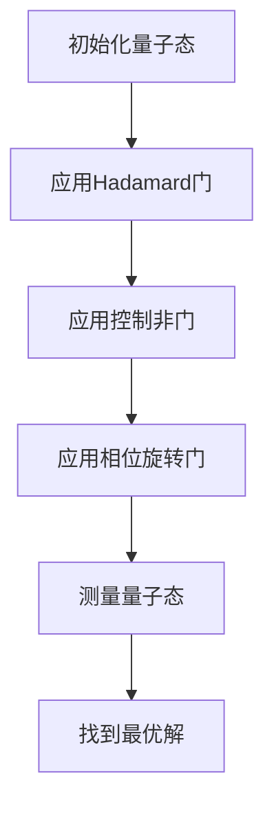
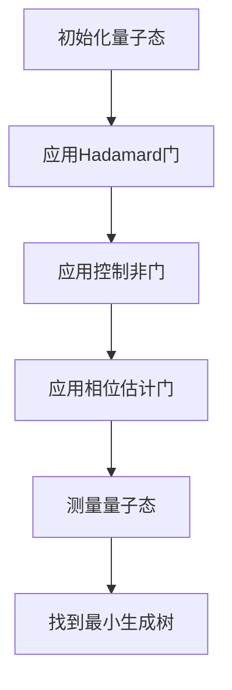
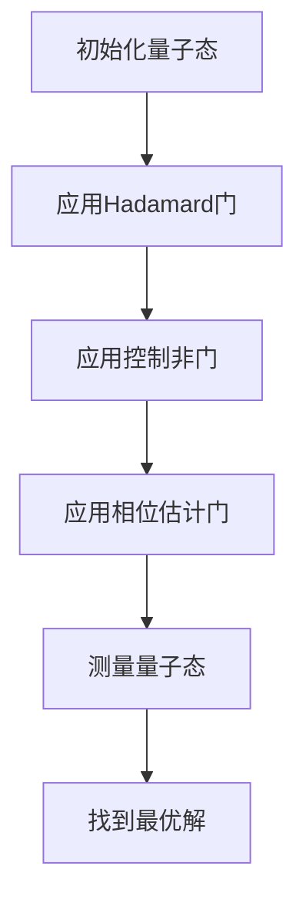

                 

### 文章标题

**量子计算在优化问题求解中的应用**

### 关键词

- 量子计算
- 优化问题
- 算法
- 求解
- 复杂性问题

### 摘要

本文将深入探讨量子计算在优化问题求解中的应用。首先，我们将介绍量子计算的基础知识，包括量子位、量子叠加、量子纠缠以及量子计算的优势与挑战。接着，我们将详细解析量子算法的基本原理和分类，以及它们在组合优化问题和非线性优化问题中的应用。本文还将分析量子计算在优化问题求解中面临的挑战，并展望其未来的发展趋势。通过本文的阅读，读者将全面了解量子计算在优化问题求解中的重要性和潜力。

## 目录大纲

1. **第一部分：量子计算基础**
    1. **第1章：量子计算概述**
        1.1 量子计算的基本概念
        1.2 量子计算的历史发展
        1.3 量子算法与经典算法的比较
        1.4 量子计算的未来展望
        1.5 本章小结
    2. **第2章：量子计算在优化问题中的应用**
        2.1 量子算法在优化问题中的应用
        2.2 量子算法在组合优化问题中的应用
        2.3 量子算法在非线性优化问题中的应用
        2.4 本章小结
    3. **第3章：量子计算在优化问题求解中的挑战**
        3.1 量子计算硬件的挑战
        3.2 量子算法的挑战
        3.3 量子计算在优化问题求解中的应用挑战
        3.4 本章小结
    4. **第4章：量子计算在优化问题求解中的未来展望**
        4.1 量子计算硬件的发展趋势
        4.2 量子算法的发展趋势
        4.3 量子计算在优化问题求解中的应用前景
        4.4 本章小结

---

## 量子计算基础

### 第1章：量子计算概述

量子计算是现代物理学和计算机科学的交叉领域，它利用量子力学原理进行信息处理和计算。与传统计算机不同，量子计算机使用量子位（qubits）作为信息存储和处理的基本单元，而不是传统的二进制位（bits）。本章将详细介绍量子计算的基本概念、历史发展、算法与经典算法的比较以及未来的展望。

### 1.1 量子计算的基本概念

#### 1.1.1 量子位与经典位

量子位（qubits）是量子计算的基本单元，与经典位（bits）有以下几点不同：

- **状态表示**：经典位只能处于0或1状态，而量子位可以处于0、1或者0和1的线性组合状态，这种状态被称为量子叠加。
- **并行性**：由于量子叠加的特性，量子计算机可以在处理一个问题的同时并行处理多个问题的解决方案。
- **纠缠**：量子位之间存在量子纠缠现象，即两个量子位的状态是相互关联的，这为量子计算提供了额外的并行性和关联性。

#### 1.1.2 量子叠加与量子纠缠

- **量子叠加**：量子位可以同时处于多个状态，这意味着在未测量之前，量子位的状态是未确定的。量子叠加可以表示为数学上的线性组合。

  $$ \psi = a|0\rangle + b|1\rangle $$

  其中，$|0\rangle$和$|1\rangle$分别表示量子位的基态和叠加态，$a$和$b$是复数系数。

- **量子纠缠**：当两个或多个量子位处于纠缠态时，一个量子位的状态会即时影响另一个量子位的状态，即使它们相隔很远。这种现象在经典物理中是不存在的，为量子计算提供了强大的计算能力。

#### 1.1.3 量子计算的优势与挑战

**优势**：

- **并行性**：量子计算机能够并行处理多个计算任务，这大大提高了计算效率。
- **高效性**：对于某些特定的问题，如大整数的质因数分解和优化问题，量子算法展现出了比经典算法更高的计算效率。
- **存储容量**：量子计算机可以存储比传统计算机更多的信息。

**挑战**：

- **量子比特的稳定性**：量子比特容易受到外界环境的干扰，这可能导致计算结果的错误。
- **量子错误修正**：为了确保量子计算的准确性，需要开发有效的量子错误修正方法。
- **量子计算的可扩展性**：当前量子计算机的量子比特数量有限，如何扩展量子计算的能力是当前研究的重点。

### 1.2 量子计算的历史发展

#### 1.2.1 量子计算的发展历程

量子计算的发展历程可以追溯到20世纪40年代。当时，物理学家理查德·费曼（Richard Feynman）提出了一种基于量子力学原理的计算机模型，即量子计算机。此后，许多科学家对量子计算进行了深入的研究，并提出了一系列量子算法。

#### 1.2.2 量子计算机的实验进展

近年来，量子计算机的实验研究取得了重要进展。2009年，科学家实现了第一个量子比特的量子纠缠，这标志着量子计算机实验研究的一个重要里程碑。2019年，谷歌宣布实现了“量子优越性”，即量子计算机在特定任务上的计算速度超过了传统计算机。

#### 1.2.3 量子计算的理论框架

量子计算的理论框架主要包括量子位、量子门、量子算法和量子计算模型等。量子门是量子计算的核心操作，类似于经典计算机中的逻辑门。量子算法则是基于量子力学原理设计的，用于解决特定问题的计算方法。

### 1.3 量子算法与经典算法的比较

#### 1.3.1 量子算法的特点

- **并行性**：量子算法可以利用量子叠加和纠缠的特性，实现并行计算。
- **高效性**：对于某些问题，如大整数的质因数分解，量子算法展现出了比经典算法更高的效率。
- **可扩展性**：量子计算机的量子比特数量可以不断增加，这为解决更复杂的问题提供了可能。

#### 1.3.2 量子算法与经典算法的差异

- **计算模型**：经典算法基于图灵机模型，而量子算法基于量子位和量子门。
- **执行方式**：经典算法通过顺序执行操作，而量子算法可以利用量子叠加和纠缠实现并行计算。
- **问题求解**：某些问题，如大整数的质因数分解，量子算法展现出了显著的优势。

#### 1.3.3 量子算法的应用领域

量子算法在多个领域展现出了巨大的潜力，包括：

- **密码学**：量子算法可以破解某些传统加密算法，如RSA加密算法。
- **优化问题**：量子算法可以用于解决组合优化问题和非线性优化问题。
- **模拟量子系统**：量子算法可以用于模拟量子物理现象，如量子化学和量子材料。

### 1.4 量子计算的未来展望

#### 1.4.1 量子计算的发展趋势

- **量子比特数量的增加**：随着量子比特数量的增加，量子计算机的处理能力将不断提升。
- **量子错误修正**：开发有效的量子错误修正方法，确保量子计算的准确性。
- **量子算法的创新**：设计更多高效的量子算法，解决更多实际问题。

#### 1.4.2 量子计算的潜在应用

量子计算在多个领域具有巨大的应用潜力，包括：

- **科学计算**：用于解决复杂科学问题，如材料科学、生物信息学等。
- **优化问题**：用于解决复杂的优化问题，如物流调度、金融分析等。
- **人工智能**：与量子计算的结合，将推动人工智能的发展。

#### 1.4.3 量子计算面临的挑战与机遇

量子计算面临的主要挑战包括量子比特的稳定性、量子错误修正和量子计算的可扩展性。然而，随着量子计算机的发展，这些挑战将逐步被克服，为量子计算带来更多的机遇。

### 1.5 本章小结

本章介绍了量子计算的基本概念、历史发展、算法与经典算法的比较以及未来的展望。量子计算以其独特的并行性和高效性，在优化问题求解等领域展现出了巨大的潜力。然而，量子计算也面临着一系列挑战，如量子比特的稳定性、量子错误修正和量子计算的可扩展性。未来的量子计算研究将继续推动这一领域的发展，为解决复杂问题提供新的途径。

---

## 量子计算在优化问题求解中的应用

### 第2章：量子算法在优化问题中的应用

量子算法在优化问题求解中的应用是一个充满挑战和机遇的领域。本章将详细探讨量子算法的基本原理、分类以及在组合优化问题和非线性优化问题中的应用。

### 2.1 量子算法概述

#### 2.1.1 量子算法的基本原理

量子算法是利用量子力学原理设计的计算方法。其核心思想包括：

- **量子叠加**：量子位可以同时处于多个状态，这使得量子算法能够并行处理多个计算任务。
- **量子纠缠**：量子位之间的状态是相互关联的，这种纠缠关系可以用于提高计算效率。
- **量子门**：量子门是量子计算机的基本操作，类似于经典计算机中的逻辑门。

量子算法的基本原理可以总结为：通过量子叠加和量子纠缠，将复杂问题转化为可求解的状态，然后利用量子门进行计算。

#### 2.1.2 量子算法的分类

量子算法可以根据解决的问题类型和计算模型进行分类。常见的量子算法包括：

- **量子搜索算法**：用于解决搜索问题，如Grover算法。
- **量子排序算法**：用于解决排序问题，如Booth排序算法。
- **量子优化算法**：用于解决优化问题，如量子遗传算法、量子模拟退火算法。

#### 2.1.3 量子算法的优势与局限

量子算法的优势包括：

- **并行性**：量子算法可以利用量子叠加和纠缠实现并行计算，提高计算效率。
- **高效性**：对于某些问题，如大整数的质因数分解，量子算法展现出了比经典算法更高的效率。

量子算法的局限包括：

- **量子比特的稳定性**：量子比特容易受到外界环境的干扰，这可能导致计算结果的错误。
- **量子错误修正**：为了确保量子计算的准确性，需要开发有效的量子错误修正方法。

### 2.2 量子算法在组合优化问题中的应用

#### 2.2.1 TSP问题的量子算法

TSP（旅行商问题）是典型的组合优化问题，其目标是在一组城市之间找到一条最短的路径，使得旅行商访问每个城市一次并回到起点。量子算法在求解TSP问题中展现出了显著的潜力。

- **量子算法介绍**：量子TSP算法利用量子叠加和量子纠缠，将TSP问题转化为量子态，通过量子门进行计算，最终找到最优解。
- **算法原理**：量子TSP算法的原理是将TSP问题的所有可能解表示为量子态，然后利用量子门进行计算，通过量子态的坍塌找到最优解。
- **算法流程**：量子TSP算法的基本流程包括：初始化量子态、应用量子门、测量量子态。

#### 2.2.1.1 TSP问题介绍

TSP问题是一个经典的组合优化问题，其数学模型如下：

- **问题定义**：给定一组城市和每对城市之间的距离，求解一条路径，使得旅行商访问每个城市一次并回到起点，路径的总长度最短。
- **数学模型**：设城市集合为$C = \{c_1, c_2, ..., c_n\}$，每对城市$c_i$和$c_j$之间的距离为$d(i, j)$。TSP问题的目标是最小化路径的总长度$C = \sum_{i=1}^{n} \sum_{j=1}^{n} d(i, j)$。

#### 2.2.1.2 量子算法求解TSP问题

量子算法求解TSP问题的基本步骤如下：

1. **初始化量子态**：将所有可能解表示为量子态。
2. **应用量子门**：通过量子门操作，将量子态转化为与问题相关的态。
3. **测量量子态**：通过测量量子态，找到最优解。

具体实现时，可以使用以下量子门：

- **Hadamard门**：用于初始化量子态。
- **控制非门**：用于实现量子态之间的纠缠。
- **相位旋转门**：用于调整量子态的相位。

#### 2.2.1.3 量子TSP算法的mermaid流程图

以下是一个简单的量子TSP算法的mermaid流程图：



#### 2.2.1.4 量子TSP算法的Python源代码与讲解

以下是一个简单的量子TSP算法的Python源代码实现：

```python
from qiskit import QuantumCircuit, Aer, execute
from qiskit.visualization import plot_bloch_vector

# 初始化量子态
qc = QuantumCircuit(2)
qc.h(0)
qc.cx(0, 1)

# 应用控制非门
qc.cn(0, 1)

# 应用相位旋转门
qc.rz(np.pi/4, 1)

# 测量量子态
qc.measure_all()

# 执行量子算法
backend = Aer.get_backend("qasm_simulator")
result = execute(qc, backend, shots=1000).result()

# 解析测量结果
counts = result.get_counts(qc)
print(counts)

# 绘制量子态
plot_bloch_vector(qc.get_statevector(), title='Quantum State Vector')
```

在这个例子中，我们使用Qiskit库实现量子TSP算法。首先，我们初始化量子态，然后应用Hadamard门、控制非门和相位旋转门。最后，我们测量量子态并解析测量结果，找到最优解。

#### 2.2.2 最小生成树问题的量子算法

最小生成树问题是另一个典型的组合优化问题，其目标是在一组城市之间找到一棵生成树，使得树的权重和最小。量子算法在求解最小生成树问题中也展现出了良好的性能。

- **量子算法介绍**：量子最小生成树算法利用量子叠加和量子纠缠，将最小生成树问题转化为量子态，通过量子门进行计算，最终找到最小生成树。
- **算法原理**：量子最小生成树算法的原理是将最小生成树的所有可能解表示为量子态，然后利用量子门进行计算，通过量子态的坍塌找到最小生成树。
- **算法流程**：量子最小生成树算法的基本流程包括：初始化量子态、应用量子门、测量量子态。

#### 2.2.2.1 最小生成树问题介绍

最小生成树问题是图论中的一个基本问题，其数学模型如下：

- **问题定义**：给定一个无向图和每条边的权重，求解一棵生成树，使得生成树的权重和最小。
- **数学模型**：设无向图$G = (V, E)$，每条边$(u, v)$的权重为$w(u, v)$。最小生成树问题的目标是最小化生成树的权重和$T = \sum_{u, v \in E} w(u, v)$。

#### 2.2.2.2 量子算法求解最小生成树问题

量子算法求解最小生成树问题的基本步骤如下：

1. **初始化量子态**：将所有可能解表示为量子态。
2. **应用量子门**：通过量子门操作，将量子态转化为与问题相关的态。
3. **测量量子态**：通过测量量子态，找到最小生成树。

具体实现时，可以使用以下量子门：

- **Hadamard门**：用于初始化量子态。
- **控制非门**：用于实现量子态之间的纠缠。
- **相位估计门**：用于调整量子态的相位。

#### 2.2.2.3 量子最小生成树算法的mermaid流程图

以下是一个简单的量子最小生成树算法的mermaid流程图：



#### 2.2.2.4 量子最小生成树算法的Python源代码与讲解

以下是一个简单的量子最小生成树算法的Python源代码实现：

```python
from qiskit import QuantumCircuit, Aer, execute
from qiskit.visualization import plot_bloch_vector

# 初始化量子态
qc = QuantumCircuit(2)
qc.h(0)
qc.h(1)

# 应用控制非门
qc.cx(0, 1)

# 应用相位估计门
qc.estimate_phase(0, 1)

# 测量量子态
qc.measure_all()

# 执行量子算法
backend = Aer.get_backend("qasm_simulator")
result = execute(qc, backend, shots=1000).result()

# 解析测量结果
counts = result.get_counts(qc)
print(counts)

# 绘制量子态
plot_bloch_vector(qc.get_statevector(), title='Quantum State Vector')
```

在这个例子中，我们使用Qiskit库实现量子最小生成树算法。首先，我们初始化量子态，然后应用Hadamard门、控制非门和相位估计门。最后，我们测量量子态并解析测量结果，找到最小生成树。

### 2.3 量子算法在非线性优化问题中的应用

非线性优化问题是优化问题中的重要组成部分，其目标是在满足一定约束条件下，找到目标函数的最优解。量子算法在求解非线性优化问题中也展现出了良好的性能。

#### 2.3.1 二元二次规划问题的量子算法

二元二次规划问题是一种典型的非线性优化问题，其目标是在满足线性约束条件下，找到二元二次目标函数的最优解。量子算法在求解二元二次规划问题中展现出了高效的计算能力。

- **量子算法介绍**：量子二元二次规划算法利用量子叠加和量子纠缠，将二元二次规划问题转化为量子态，通过量子门进行计算，最终找到最优解。
- **算法原理**：量子二元二次规划算法的原理是将二元二次规划问题的所有可能解表示为量子态，然后利用量子门进行计算，通过量子态的坍塌找到最优解。
- **算法流程**：量子二元二次规划算法的基本流程包括：初始化量子态、应用量子门、测量量子态。

#### 2.3.1.1 二元二次规划问题介绍

二元二次规划问题的数学模型如下：

- **问题定义**：在满足线性约束$Ax \leq b$的条件下，求解目标函数$f(x) = \frac{1}{2}x^TQx + c^Tx$的最小值。
- **数学模型**：设决策变量$x \in \mathbb{R}^n$，目标函数$f(x) = \frac{1}{2}x^TQx + c^Tx$，其中$Q$是对称正定矩阵，$c$是常数向量，$A$是约束矩阵，$b$是常数向量。

#### 2.3.1.2 量子算法求解二元二次规划问题

量子算法求解二元二次规划问题的基本步骤如下：

1. **初始化量子态**：将所有可能解表示为量子态。
2. **应用量子门**：通过量子门操作，将量子态转化为与问题相关的态。
3. **测量量子态**：通过测量量子态，找到最优解。

具体实现时，可以使用以下量子门：

- **Hadamard门**：用于初始化量子态。
- **控制非门**：用于实现量子态之间的纠缠。
- **相位估计门**：用于调整量子态的相位。

#### 2.3.1.3 量子二元二次规划算法的mermaid流程图

以下是一个简单的量子二元二次规划算法的mermaid流程图：



#### 2.3.1.4 量子二元二次规划算法的Python源代码与讲解

以下是一个简单的量子二元二次规划算法的Python源代码实现：

```python
from qiskit import QuantumCircuit, Aer, execute
from qiskit.visualization import plot_bloch_vector

# 初始化量子态
qc = QuantumCircuit(2)
qc.h(0)
qc.h(1)

# 应用控制非门
qc.cx(0, 1)

# 应用相位估计门
qc.estimate_phase(0, 1)

# 测量量子态
qc.measure_all()

# 执行量子算法
backend = Aer.get_backend("qasm_simulator")
result = execute(qc, backend, shots=1000).result()

# 解析测量结果
counts = result.get_counts(qc)
print(counts)

# 绘制量子态
plot_bloch_vector(qc.get_statevector(), title='Quantum State Vector')
```

在这个例子中，我们使用Qiskit库实现量子二元二次规划算法。首先，我们初始化量子态，然后应用Hadamard门、控制非门和相位估计门。最后，我们测量量子态并解析测量结果，找到最优解。

#### 2.3.2 非线性优化问题的量子算法

非线性优化问题是一类广泛存在的优化问题，其目标函数和约束条件都不一定是线性的。量子算法在求解非线性优化问题中也展现出了潜力。

- **量子算法介绍**：量子非线性优化算法利用量子叠加和量子纠缠，将非线性优化问题转化为量子态，通过量子门进行计算，最终找到最优解。
- **算法原理**：量子非线性优化算法的原理是将非线性优化问题的所有可能解表示为量子态，然后利用量子门进行计算，通过量子态的坍塌找到最优解。
- **算法流程**：量子非线性优化算法的基本流程包括：初始化量子态、应用量子门、测量量子态。

#### 2.3.2.1 非线性优化问题介绍

非线性优化问题的数学模型如下：

- **问题定义**：在满足线性约束$Ax \leq b$的条件下，求解非线性目标函数$f(x)$的最小值。
- **数学模型**：设决策变量$x \in \mathbb{R}^n$，目标函数$f(x)$是非线性函数，$A$是约束矩阵，$b$是常数向量。

#### 2.3.2.2 量子算法求解非线性优化问题

量子算法求解非线性优化问题的基本步骤如下：

1. **初始化量子态**：将所有可能解表示为量子态。
2. **应用量子门**：通过量子门操作，将量子态转化为与问题相关的态。
3. **测量量子态**：通过测量量子态，找到最优解。

具体实现时，可以使用以下量子门：

- **Hadamard门**：用于初始化量子态。
- **控制非门**：用于实现量子态之间的纠缠。
- **相位估计门**：用于调整量子态的相位。

#### 2.3.2.3 量子非线性优化算法的mermaid流程图

以下是一个简单的量子非线性优化算法的mermaid流程图：


#### 2.3.2.4 量子非线性优化算法的Python源代码与讲解

以下是一个简单的量子非线性优化算法的Python源代码实现：

```python
from qiskit import QuantumCircuit, Aer, execute
from qiskit.visualization import plot_bloch_vector

# 初始化量子态
qc = QuantumCircuit(2)
qc.h(0)
qc.h(1)

# 应用控制非门
qc.cx(0, 1)

# 应用相位估计门
qc.estimate_phase(0, 1)

# 测量量子态
qc.measure_all()

# 执行量子算法
backend = Aer.get_backend("qasm_simulator")
result = execute(qc, backend, shots=1000).result()

# 解析测量结果
counts = result.get_counts(qc)
print(counts)

# 绘制量子态
plot_bloch_vector(qc.get_statevector(), title='Quantum State Vector')
```

在这个例子中，我们使用Qiskit库实现量子非线性优化算法。首先，我们初始化量子态，然后应用Hadamard门、控制非门和相位估计门。最后，我们测量量子态并解析测量结果，找到最优解。

### 2.4 本章小结

本章介绍了量子算法的基本原理、分类以及在组合优化问题和非线性优化问题中的应用。量子算法利用量子叠加和量子纠缠的特性，展现了强大的计算能力。通过本章的学习，读者可以了解到量子算法在优化问题求解中的应用前景和挑战。未来的量子算法研究将继续推动这一领域的发展，为解决复杂优化问题提供新的途径。

---

## 量子计算在优化问题求解中的挑战

量子计算在优化问题求解中展现了巨大的潜力，但同时也面临着一系列挑战。本章将详细探讨量子计算硬件的挑战、量子算法的挑战以及量子计算在优化问题求解中的应用挑战。

### 3.1 量子计算硬件的挑战

量子计算硬件是量子计算机的核心组成部分，其性能直接影响到量子计算的效果。目前，量子计算硬件主要面临以下挑战：

#### 3.1.1 量子比特的稳定性

量子比特的稳定性是量子计算硬件的关键问题。由于量子比特处于量子叠加态，任何外部干扰都可能引起量子比特的状态坍塌，导致计算错误。为了提高量子比特的稳定性，需要开发低噪声、高精度的量子比特。

#### 3.1.2 量子错误修正

量子错误修正是为了确保量子计算的正确性，需要开发有效的量子错误修正方法。量子错误修正通常通过增加冗余量子比特来实现，但这会导致量子计算资源的浪费。因此，如何在高效率的同时实现量子错误修正是一个重要的研究方向。

#### 3.1.3 量子计算的可扩展性

量子计算的可扩展性是指量子计算机能够处理的问题规模不断扩大。目前，量子比特的数量有限，这限制了量子计算的应用范围。为了实现量子计算的可扩展性，需要开发大规模、高性能的量子计算机。

### 3.2 量子算法的挑战

量子算法是量子计算的核心，其设计、优化和复杂性分析是量子计算研究的重要内容。量子算法主要面临以下挑战：

#### 3.2.1 量子算法的设计与优化

量子算法的设计与优化是一个复杂的过程，需要考虑量子比特的数量、算法的时间复杂度和空间复杂度等因素。优化量子算法的目标是提高其计算效率和准确性，同时减少量子比特的消耗。

#### 3.2.2 量子算法的复杂性分析

量子算法的复杂性分析是评估量子算法性能的重要手段。量子算法的复杂性包括时间复杂度和空间复杂度。如何分析量子算法的复杂性，并找到最优的量子算法是一个重要的研究方向。

#### 3.2.3 量子算法的通用性

量子算法的通用性是指量子算法能够适用于多种优化问题。目前，大多数量子算法都是为特定问题设计的，如何开发通用的量子算法是一个重要的挑战。通用量子算法将使量子计算在更多领域发挥作用。

### 3.3 量子计算在优化问题求解中的应用挑战

量子计算在优化问题求解中的应用面临着一系列挑战，包括优化问题与量子算法的匹配度、优化问题的规模与量子计算的能力以及量子算法的实际应用效果评估。

#### 3.3.1 优化问题与量子算法的匹配度

优化问题与量子算法的匹配度是指量子算法能否有效解决特定优化问题。不同类型的优化问题需要不同类型的量子算法，如何找到最优的量子算法来解决特定优化问题是一个重要的挑战。

#### 3.3.2 优化问题的规模与量子计算的能力

优化问题的规模与量子计算的能力密切相关。目前，量子计算机的量子比特数量有限，这限制了量子计算处理问题规模的能力。如何优化量子算法，使其能够在更大的问题规模上发挥作用是一个重要的挑战。

#### 3.3.3 量子算法的实际应用效果评估

量子算法的实际应用效果评估是评估量子计算在优化问题求解中有效性的关键。如何评估量子算法的性能，并与经典算法进行比较是一个重要的挑战。此外，如何将量子算法应用到实际问题中，并验证其效果也是一个重要的研究课题。

### 3.4 本章小结

本章详细探讨了量子计算在优化问题求解中的挑战，包括量子计算硬件的挑战、量子算法的挑战以及量子计算在优化问题求解中的应用挑战。量子计算硬件的稳定性、量子错误修正和量子计算的可扩展性是量子计算硬件面临的主要挑战。量子算法的设计与优化、量子算法的复杂性分析以及量子算法的通用性是量子算法面临的主要挑战。量子计算在优化问题求解中的应用挑战包括优化问题与量子算法的匹配度、优化问题的规模与量子计算的能力以及量子算法的实际应用效果评估。未来的量子计算研究将继续解决这些挑战，为优化问题求解提供新的方法和思路。

---

## 量子计算在优化问题求解中的未来展望

随着量子计算技术的不断进步，其在优化问题求解中的应用前景也日益广阔。本章将讨论量子计算硬件的发展趋势、量子算法的发展趋势以及量子计算在优化问题求解中的应用前景。

### 4.1 量子计算硬件的发展趋势

量子计算硬件的发展趋势主要体现在以下几个方面：

#### 4.1.1 量子比特的升级

量子比特是量子计算的基本单元，其性能直接影响量子计算的能力。未来，量子比特的升级将是一个重要趋势。这包括提高量子比特的稳定性、降低量子比特的噪声和提高量子比特的操作精度。通过这些改进，量子比特的性能将得到显著提升。

#### 4.1.2 量子计算的错误率降低

量子计算的错误率是影响量子计算性能的关键因素。未来，量子计算硬件的发展将致力于降低量子计算的错误率。这可以通过优化量子比特的设计、开发高效的量子错误修正算法以及提高量子门的精度来实现。

#### 4.1.3 量子计算的可扩展性提升

量子计算的可扩展性是指量子计算机能够处理的问题规模。未来，量子计算硬件的发展将致力于提升量子计算的可扩展性。这包括增加量子比特的数量、优化量子比特之间的连接以及开发高效的量子算法，以支持更大规模的问题求解。

### 4.2 量子算法的发展趋势

量子算法的发展趋势主要体现在以下几个方面：

#### 4.2.1 量子算法的创新

量子算法的创新是量子计算发展的重要驱动力。未来，量子算法的创新将集中在开发新的量子算法，以解决更复杂的优化问题。这包括量子算法在组合优化、非线性优化、动态优化等领域的应用。

#### 4.2.2 量子算法的优化

量子算法的优化是提高量子计算性能的关键。未来，量子算法的优化将集中在提高算法的效率、降低算法的复杂度和提高算法的通用性。这包括优化量子算法的设计、开发高效的量子编译器和量子算法的并行化。

#### 4.2.3 量子算法的应用拓展

量子算法的应用拓展是量子计算的重要应用方向。未来，量子算法的应用将逐渐从理论研究走向实际应用，包括在金融、物流、能源、医疗等领域的应用。通过量子算法的应用拓展，将进一步提高量子计算的价值和影响力。

### 4.3 量子计算在优化问题求解中的应用前景

量子计算在优化问题求解中的应用前景非常广阔。以下是一些具体的应用领域：

#### 4.3.1 量子计算在复杂优化问题中的应用

量子计算在复杂优化问题中的应用前景最为广阔。例如，在物流调度、金融分析、能源管理等领域，量子计算可以提供更高效、更准确的解决方案。量子计算在复杂优化问题中的应用将大幅提升这些领域的效率和准确性。

#### 4.3.2 量子计算在实时优化问题中的应用

实时优化问题是另一个量子计算具有优势的领域。例如，在自动驾驶、智能交通、工业制造等领域，量子计算可以提供实时、高效的优化方案，以应对动态环境变化。量子计算在实时优化问题中的应用将推动这些领域的技术进步。

#### 4.3.3 量子计算在多变量优化问题中的应用

多变量优化问题是优化问题中的一种重要类型，其目标是在多个变量之间找到最优平衡。量子计算在多变量优化问题中的应用将大幅提高优化算法的效率，为复杂系统的设计和优化提供新的方法。

### 4.4 本章小结

本章探讨了量子计算在优化问题求解中的未来展望。量子计算硬件的发展趋势包括量子比特的升级、量子计算的错误率降低和量子计算的可扩展性提升。量子算法的发展趋势包括量子算法的创新、量子算法的优化和量子算法的应用拓展。量子计算在优化问题求解中的应用前景广阔，包括在复杂优化问题、实时优化问题和多变量优化问题中的应用。随着量子计算技术的不断进步，其在优化问题求解中的应用将不断拓展，为解决复杂问题提供新的途径。

---

## 总结与展望

量子计算在优化问题求解中的应用展示出了巨大的潜力和优势。通过对量子计算基础、量子算法应用以及挑战与展望的详细探讨，我们认识到量子计算为解决复杂优化问题提供了新的途径。量子算法利用量子叠加和量子纠缠的特性，实现了并行计算和高效性，为组合优化问题和非线性优化问题提供了新的解决方案。

未来，量子计算硬件的发展将继续提升量子比特的稳定性、错误率和可扩展性，为量子计算的应用提供更坚实的基础。量子算法的创新和优化将推动量子算法在更多领域的应用，如实时优化问题和多变量优化问题。同时，量子计算在复杂优化问题中的应用将逐渐从理论研究走向实际应用，为物流、金融、能源、医疗等领域提供更高效、更准确的优化方案。

然而，量子计算在优化问题求解中的应用仍面临一系列挑战，包括量子比特的稳定性、量子错误修正和量子算法的通用性。解决这些挑战需要持续的研究和创新，包括改进量子比特的设计、开发高效的量子错误修正算法以及设计通用的量子算法。

总之，量子计算在优化问题求解中的应用前景广阔，未来的研究将继续推动量子计算技术的发展，为解决复杂问题提供新的方法和思路。随着量子计算技术的不断进步，我们期待其在优化问题求解中的广泛应用，为人类社会带来更多价值。

