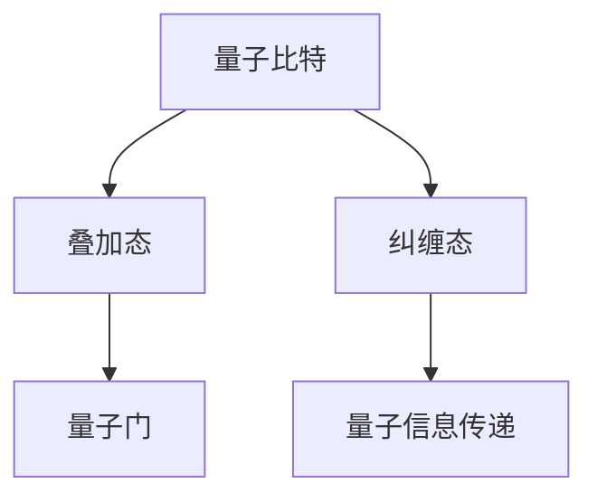
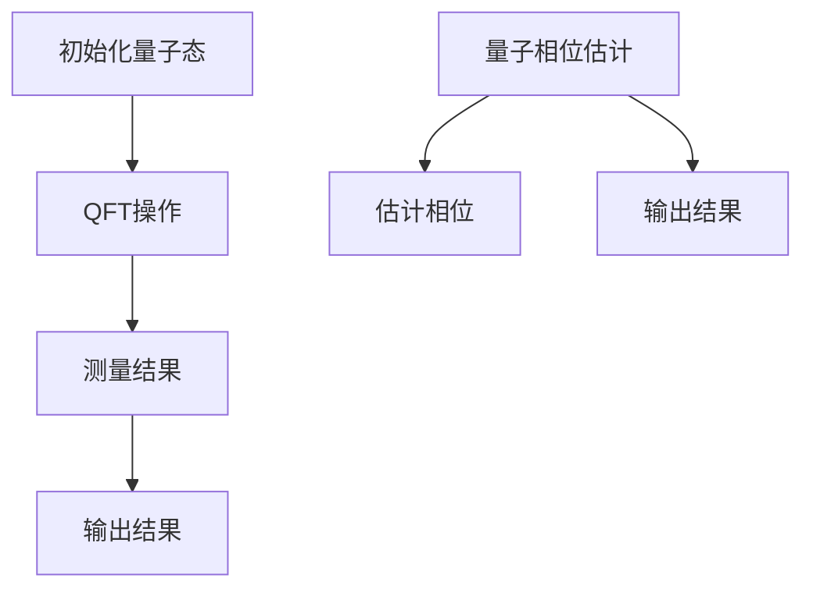
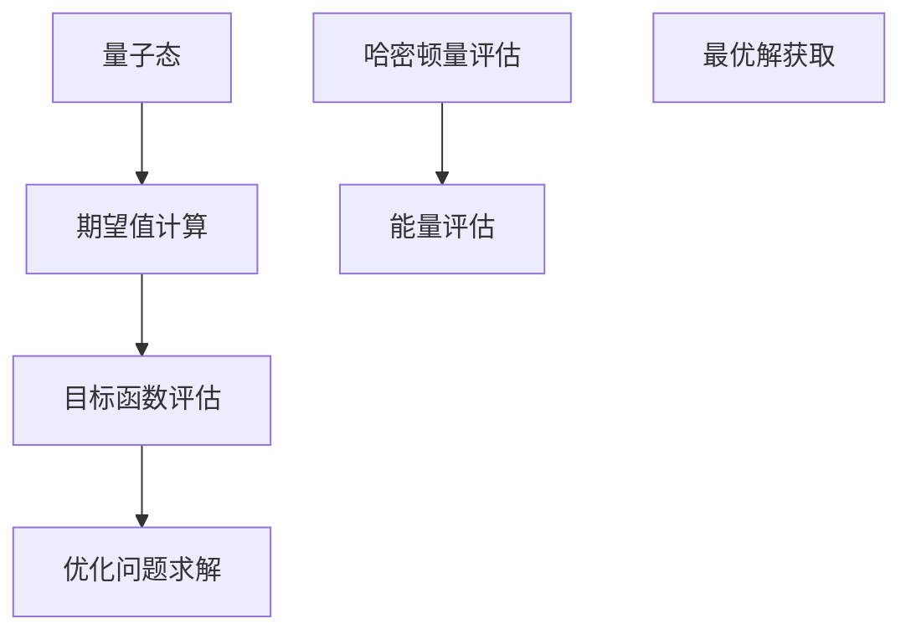
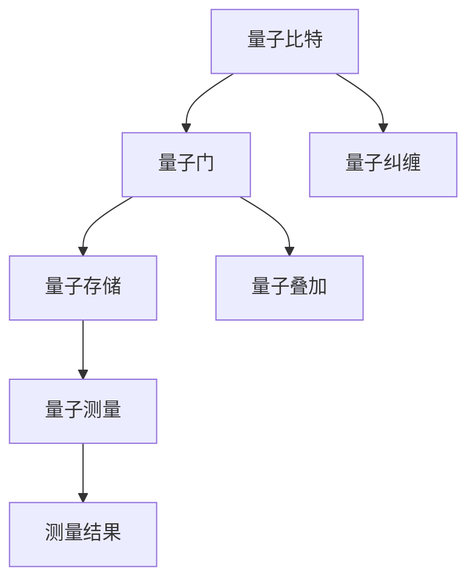
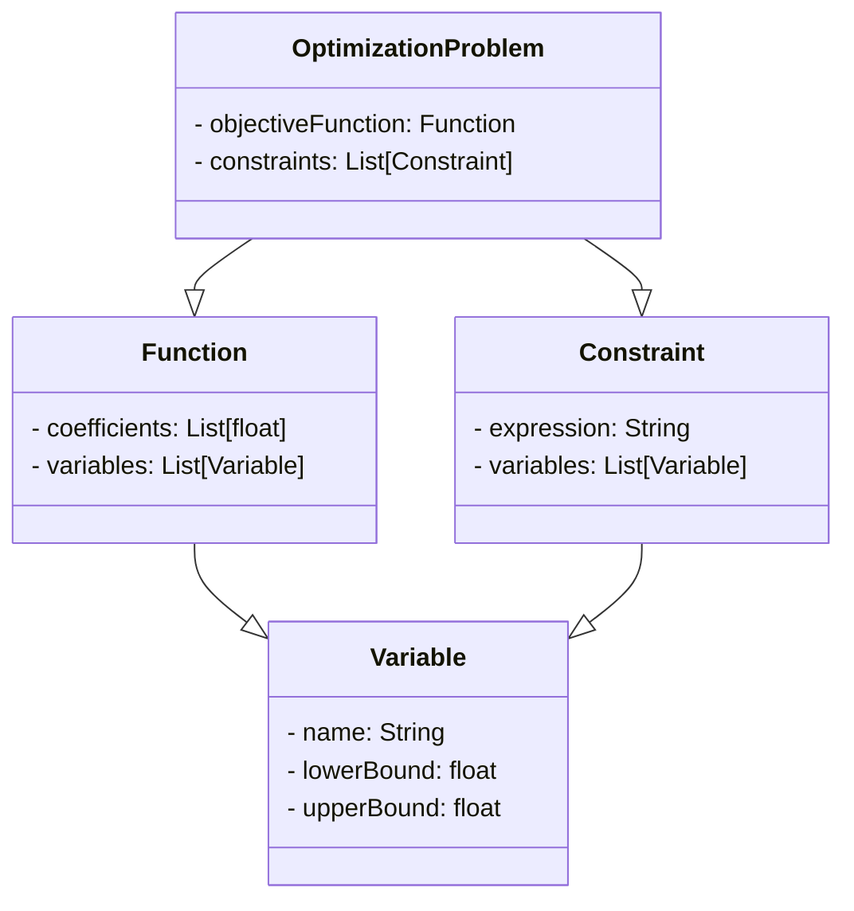
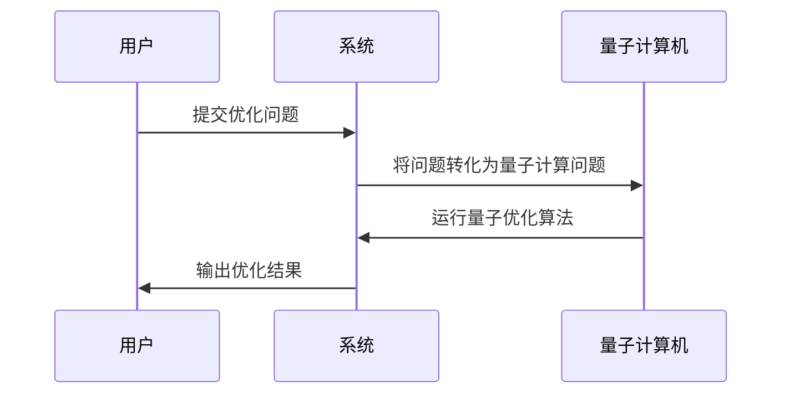
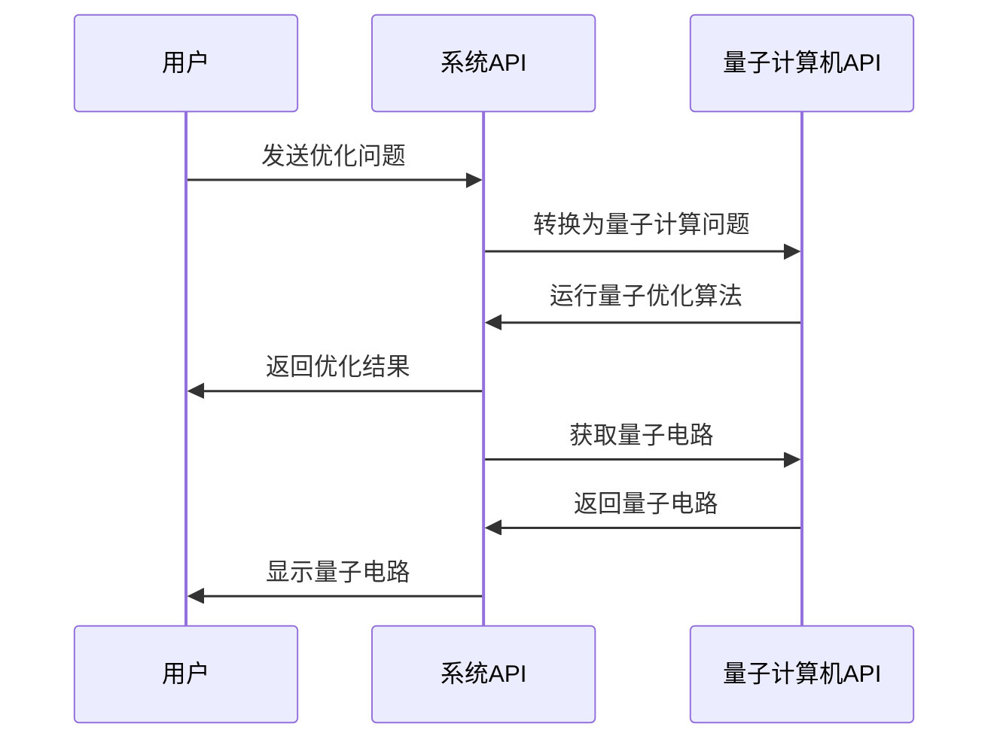

                 

## 量子计算在优化问题求解中的应用：加速计算过程

### 关键词：量子计算、优化问题、计算加速、算法实现

### 摘要：
本文深入探讨了量子计算在优化问题求解中的应用，通过一步步的分析推理，展示了量子计算如何能够显著加速传统算法，提升问题求解效率。文章首先介绍了量子计算的基础知识，包括量子比特、量子门和量子叠加等核心概念，随后详细阐述了量子退火算法和量子线性规划等算法原理，并使用Python代码和LaTeX公式进行了举例说明。最后，通过实际项目实战，展示了量子计算在优化问题求解中的具体应用和效果，并对未来发展趋势进行了展望。

### 目录

1. **量子计算基础**
   - **1.1 量子计算概述**
   - **1.2 核心概念与联系**
   - **1.3 量子计算的基本算法**

2. **量子算法在优化问题求解中的应用**
   - **2.1 量子退火算法**
   - **2.2 量子线性规划**
   - **2.3 其他量子优化算法**

3. **数学模型和数学公式**
   - **3.1 状态向量与概率分布**
   - **3.2 期望值与最优化问题**

4. **系统分析与架构设计方案**
   - **4.1 量子计算机的体系结构**
   - **4.2 量子算法的实现细节**
   - **4.3 优化问题的建模**

5. **项目实战**
   - **5.1 优化问题场景介绍**
   - **5.2 量子计算机环境搭建**
   - **5.3 量子优化算法实现与结果分析**

6. **小结与展望**
   - **6.1 量子计算在优化问题求解中的应用总结**
   - **6.2 未来发展趋势与挑战**

### 1.1 量子计算概述

#### 问题背景与核心概念

量子计算是一种利用量子力学原理进行信息处理的新型计算模式。与传统计算不同，量子计算依赖于量子比特（qubit）的叠加态和纠缠态来存储和处理信息，这使得量子计算机在某些特定问题上的处理能力远超经典计算机。量子计算的基本原理可以追溯到20世纪初的量子力学理论，其中量子比特作为量子力学系统中的基本单位，与经典计算机中的比特有着根本的区别。

- **量子比特**：量子比特是量子计算的基本存储单元，可以同时处于0和1的叠加态。这一特性使得量子计算机能够处理大量的并行计算。
- **量子门**：量子门是量子计算机中的基本操作单元，类似于经典计算机中的逻辑门。量子门对量子比特进行操作，可以实现量子态的变换。
- **量子叠加**：量子比特的叠加态允许量子计算机同时处理多个计算路径，这是量子计算的核心优势之一。
- **量子纠缠**：量子纠缠是量子计算中的一种特殊现象，当两个或多个量子比特处于纠缠态时，它们的量子态将无法独立存在，这种关联性可以用于量子信息的传递和计算。

#### 量子计算机的工作原理

量子计算机的工作原理基于量子力学的基本原理，主要包括以下几个步骤：

1. **初始化**：将量子比特初始化为特定的叠加态。
2. **量子门操作**：通过一系列量子门操作，对量子比特进行变换，实现特定计算任务。
3. **测量**：对量子比特进行测量，得到最终的计算结果。

与传统计算机不同，量子计算机不是直接输出结果，而是输出概率分布。这意味着在量子计算中，我们通常无法得到精确的答案，而是得到一系列可能的答案及其概率。通过多次测量和统计方法，我们可以得到较为准确的结果。

#### 量子计算与经典计算的区别

量子计算与经典计算在多个方面存在显著差异：

- **并行计算能力**：量子计算能够同时处理多个计算路径，而经典计算只能逐个处理。
- **速度和效率**：对于某些特定问题，如量子算法和优化问题，量子计算机可以显著加速计算过程。
- **计算资源**：量子计算机需要特定的硬件和环境，如低温环境，而经典计算机则相对简单。
- **结果的确定性**：经典计算的结果是确定的，而量子计算的结果是概率性的。

#### 量子计算在优化问题求解中的应用

量子计算在优化问题求解中具有巨大潜力，可以显著加速传统算法。例如，量子退火算法和量子线性规划算法已经显示出在某些优化问题上的优势。量子退火算法利用量子纠缠和量子叠加，能够快速找到全局最优解。而量子线性规划则利用量子比特的并行计算能力，能够快速求解线性规划问题。

#### 边界与外延

量子计算虽然在理论上具有巨大潜力，但实际应用仍面临许多挑战，如量子退火算法的实现细节、量子计算机的硬件限制等。此外，量子计算在优化问题求解中的应用也不仅仅局限于量子退火和量子线性规划，还包括量子机器学习、量子密码学等多个领域。

#### 概念结构与核心要素组成

量子计算的核心要素包括量子比特、量子门、量子叠加和量子纠缠。量子比特作为基本存储单元，量子门作为基本操作单元，量子叠加和量子纠缠则是量子计算的核心机制。这些要素共同构成了量子计算的理论基础，也是量子计算在优化问题求解中发挥作用的关键。

### 1.2 核心概念与联系

#### 量子比特（qubit）

量子比特是量子计算机的基本单元，它可以同时处于0和1的叠加态。量子比特的状态可以用一个复数向量表示，如$|ψ⟩=α|0⟩+β|1⟩$，其中$α$和$β$是复数概率幅，满足$|α|^{2}+|β|^{2}=1$。量子比特与经典比特的区别在于其叠加态和纠缠态。

- **叠加态**：量子比特可以同时处于0和1的状态，这种叠加态使得量子计算机能够进行并行计算。
- **纠缠态**：两个或多个量子比特之间的纠缠状态使得它们的量子态无法独立存在，这种纠缠态可以用于量子信息的传递和计算。

#### 量子门（quantum gate）

量子门是量子计算机中的基本操作单元，类似于经典计算机中的逻辑门。量子门对量子比特进行操作，可以实现量子态的变换。量子门通常是一个二维矩阵，表示为$U$，它作用于量子比特的状态向量，得到新的状态向量。

- **基本的量子门**：包括Pauli旋转门（X、Y、Z门）、控制非门（CNOT门）和Hadamard门（H门）等。这些量子门可以组合成更复杂的量子门。
- **量子门的作用**：量子门通过线性变换操作量子比特的状态，实现量子计算过程中的信息处理。

#### 量子叠加（quantum superposition）

量子叠加是量子计算的核心机制之一，它允许量子比特同时处于多个状态。在经典计算中，比特只能处于0或1的一个状态，而量子比特可以同时处于多个状态的叠加。

- **量子叠加态**：量子比特的叠加态可以表示为$|ψ⟩=α|0⟩+β|1⟩$，其中$α$和$β$是复数概率幅。
- **叠加态的运算**：量子叠加态可以通过量子门进行变换，实现量子态的演化。

#### 量子纠缠（quantum entanglement）

量子纠缠是量子计算中的另一个核心机制，它描述了两个或多个量子比特之间的特殊关联。当两个量子比特处于纠缠态时，它们的量子态无法独立存在，而是相互关联。

- **纠缠态的定义**：两个量子比特的纠缠态可以表示为$|ψ⟩=α|00⟩+β|11⟩$，其中$α$和$β$是复数概率幅。
- **纠缠态的运算**：量子纠缠可以通过量子门操作实现，从而在量子计算过程中发挥作用。

#### 核心概念对比表格

| 概念 | 定义 | 特点 | 应用 |
| --- | --- | --- | --- |
| 量子比特 | 量子计算机的基本单元 | 可处于叠加态和纠缠态 | 量子计算 |
| 量子门 | 量子计算机的基本操作单元 | 实现量子态的变换 | 量子计算 |
| 量子叠加 | 量子比特同时处于多个状态 | 并行计算能力 | 量子计算 |
| 量子纠缠 | 量子比特之间的特殊关联 | 量子信息传递 | 量子计算 |

#### ER实体关系图架构的 Mermaid 流程图



### 1.3 量子计算的基本算法

量子计算的基本算法主要包括量子傅立叶变换（QFT）和量子相位估计（QPE）等。这些算法是量子计算的核心，它们在优化问题求解中发挥着重要作用。

#### 量子傅立叶变换（Quantum Fourier Transform，QFT）

量子傅立叶变换是一种重要的量子算法，它可以将量子态从位置基（position basis）转换为频率基（frequency basis）。QFT在量子计算中被广泛应用于量子算法的构造，如Shor算法和量子退火算法。

- **QFT的基本原理**：QFT通过一系列的量子门操作，将量子态的表示从位置基转换为频率基。具体来说，QFT可以将一个n位量子状态$|x⟩$转换为$|f(x)⟩$，其中$f(x)$是x的离散傅立叶变换。
- **QFT的数学模型**：QFT的数学模型可以表示为以下公式：
  $$ QFT|x⟩ = \sum_{y} \omega^{-xy} |y⟩ $$
  其中，$\omega = e^{2\pi i/n}$，$|x⟩$和$|y⟩$分别是量子态的位置基和频率基。

#### 量子相位估计（Quantum Phase Estimation，QPE）

量子相位估计是一种基于量子叠加和量子纠缠的算法，它能够估计出量子态的相位。QPE在量子计算中被广泛应用于量子算法的构造，如Shor算法和量子退火算法。

- **QPE的基本原理**：QPE通过量子叠加和量子测量来估计量子态的相位。具体来说，QPE首先将量子态进行叠加，然后通过一系列量子门操作和测量，估计出量子态的相位。
- **QPE的数学模型**：QPE的数学模型可以表示为以下公式：
  $$ \hat{P}_{\theta}|\psi⟩ = \frac{1}{\sqrt{2}}(|0⟩ + e^{i\theta}|1⟩) $$
  其中，$\theta$是量子态的相位，$|\psi⟩$是量子态。

#### QFT和QPE的Mermaid流程图



### 2.1 量子退火算法

量子退火算法是一种基于量子计算原理的优化算法，它利用量子态的叠加和纠缠特性，能够在复杂问题上快速找到全局最优解。量子退火算法在组合优化、物理模拟和机器学习等领域具有广泛的应用。

#### 量子退火算法的基本原理

量子退火算法的基本原理来源于量子系统的自演化过程。在量子退火算法中，我们首先将优化问题映射到一个能量 landscapes（能量景观），然后通过量子态的自演化，寻找能量最低的状态，从而找到最优解。

- **量子态的自演化**：在量子退火算法中，我们使用哈密顿量（Hamiltonian）描述系统的能量。哈密顿量决定了量子态的自演化过程。通过施加适当的哈密顿量，量子态会自演化，逐渐趋向于能量最低的状态。
- **测量与解的获取**：在量子态自演化过程中，我们通过测量量子态来获取最终解。由于量子态是概率性的，我们需要进行多次测量，并统计测量结果来获得可靠的最优解。

#### 量子退火算法的应用场景

量子退火算法在多个领域具有广泛的应用，主要包括：

- **组合优化问题**：如旅行商问题（TSP）、装箱问题（Knapsack Problem）和最大独立集问题（Maximum Independent Set）等。
- **物理模拟**：如分子模拟、材料设计和量子化学计算等。
- **机器学习**：如神经网络优化、特征选择和分类等。

#### 量子退火算法的数学模型

量子退火算法的数学模型包括以下几个关键部分：

- **哈密顿量**：哈密顿量描述了系统的能量，通常是一个复杂的函数，与优化问题的目标函数相关。哈密顿量可以表示为：
  $$ H = \sum_{i} h_{i} |i⟩⟨i| + \sum_{i<j} J_{ij} |i⟩⟨j| $$
  其中，$h_{i}$和$J_{ij}$分别表示系统的静态能量和相互作用能量。
- **量子态**：量子态表示系统的初始状态，通常是一个叠加态。量子态可以表示为：
  $$ |ψ(t)⟩ = \sum_{i} c_{i}(t)|i⟩ $$
  其中，$c_{i}(t)$是量子态的系数。
- **演化方程**：量子态的自演化过程可以用薛定谔方程描述：
  $$ i\hbar \frac{d}{dt} |ψ(t)⟩ = H |ψ(t)⟩ $$

#### 量子退火算法的Python实现

下面是一个简单的Python实现，展示了量子退火算法的基本流程：

```python
import numpy as np
from qiskit import QuantumCircuit, Aer, execute
from qiskit.visualization import plot_bloch_vector

# 定义哈密顿量
h = np.array([[0, 1], [1, 0]])
J = np.array([[0, 1], [1, 0]])

# 初始化量子态
psi_init = np.array([1/np.sqrt(2), 1/np.sqrt(2)]) * np.array([[1], [0]])

# 定义量子退火算法的量子电路
qft = QuantumCircuit(2)
qft.h(range(2))  # 初始化量子态
qft.append(QuantumFourierTransform().to_instruction(), range(2))
qft.measure(range(2), range(2))

# 执行量子退火算法
backend = Aer.get_backend('qasm_simulator')
result = execute(qft, backend, shots=1024)
measurements = result.get_counts(qft)

# 统计测量结果
most_probable_state = max(measurements, key=measurements.get)
print(f"Most probable state: {most_probable_state}")

# 可视化量子态
state_vector = qft.initialize_state(psi_init)
plot_bloch_vector(state_vector)
```

### 2.2 量子线性规划

量子线性规划是一种基于量子计算原理的线性规划算法，它利用量子态的叠加和纠缠特性，能够在复杂线性规划问题上快速找到最优解。量子线性规划在资源分配、供应链优化和金融投资等领域具有广泛的应用。

#### 量子线性规划的基本原理

量子线性规划的基本原理基于量子计算中的叠加态和纠缠态。在量子线性规划中，我们将线性规划问题转换为量子态的叠加和测量问题。

- **线性规划问题的表示**：线性规划问题可以用目标函数和约束条件表示。目标函数通常是一个线性函数，而约束条件可以是线性不等式或等式。
- **量子态的表示**：在量子线性规划中，我们使用量子态表示问题的解。量子态的叠加态可以表示多个可能的解，而量子纠缠态可以表示解之间的依赖关系。
- **量子态的测量**：通过测量量子态，我们可以得到问题的最优解。由于量子态是概率性的，我们需要进行多次测量，并统计测量结果来获得可靠的最优解。

#### 量子线性规划的应用场景

量子线性规划在多个领域具有广泛的应用，主要包括：

- **资源分配**：如网络资源分配、能源分配和人力资源分配等。
- **供应链优化**：如库存管理、运输调度和供应链网络设计等。
- **金融投资**：如资产配置、风险管理和投资组合优化等。

#### 量子线性规划的数学模型

量子线性规划的数学模型包括以下几个关键部分：

- **目标函数**：目标函数是一个线性函数，表示为$f(x) = c^T x$，其中$c$是目标函数的系数，$x$是决策变量。
- **约束条件**：约束条件可以是线性不等式或等式，表示为$A x \leq b$或$A x = b$，其中$A$是约束条件的系数矩阵，$b$是约束条件的常数向量。
- **量子态的表示**：量子态的表示可以表示为$|ψ⟩ = \sum_{i} c_{i} |x_{i}⟩$，其中$|x_{i}⟩$是问题的解，$c_{i}$是解的概率幅。
- **演化方程**：量子态的自演化过程可以用薛定谔方程描述：
  $$ i\hbar \frac{d}{dt} |ψ(t)⟩ = H |ψ(t)⟩ $$
  其中，$H$是哈密顿量，与目标函数和约束条件相关。

#### 量子线性规划的Python实现

下面是一个简单的Python实现，展示了量子线性规划的基本流程：

```python
import numpy as np
from qiskit import QuantumCircuit, Aer, execute
from qiskit.visualization import plot_bloch_vector

# 定义目标函数的系数
c = np.array([1, 2])

# 定义约束条件的系数矩阵和常数向量
A = np.array([[1, 0], [0, 1]])
b = np.array([1, 2])

# 初始化量子态
psi_init = np.array([1/np.sqrt(2), 1/np.sqrt(2)]) * np.array([[1], [0]])

# 定义量子线性规划的量子电路
qc = QuantumCircuit(2)
qc.h(range(2))  # 初始化量子态
qc.append(QuantumFourierTransform().to_instruction(), range(2))
qc.measure(range(2), range(2))

# 执行量子线性规划
backend = Aer.get_backend('qasm_simulator')
result = execute(qc, backend, shots=1024)
measurements = result.get_counts(qc)

# 统计测量结果
most_probable_state = max(measurements, key=measurements.get)
print(f"Most probable state: {most_probable_state}")

# 可视化量子态
state_vector = qc.initialize_state(psi_init)
plot_bloch_vector(state_vector)
```

### 3.1 状态向量与概率分布

在量子计算中，状态向量是量子系统的基础。状态向量提供了对量子系统状态的完整描述，而概率分布则是状态向量的重要属性。

#### 状态向量

状态向量是量子系统的复数向量，用于描述量子系统的状态。量子系统可以处于多种可能状态的叠加，这些可能状态可以用状态向量表示。一个量子比特的状态向量通常表示为：

$$|\psi⟩ = \alpha|0⟩ + \beta|1⟩$$

其中，$|0⟩$和$|1⟩$是量子比特的基态，$\alpha$和$\beta$是复数概率幅，满足归一化条件：

$$|\alpha|^2 + |\beta|^2 = 1$$

当量子系统具有多个量子比特时，状态向量是这些量子比特状态向量的直积。例如，两个量子比特的状态向量可以表示为：

$$|\psi⟩ = \alpha_1\alpha_2|00⟩ + \alpha_1\beta_2|01⟩ + \beta_1\alpha_2|10⟩ + \beta_1\beta_2|11⟩$$

#### 概率分布

概率分布描述了量子系统各个可能状态的概率。对于单个量子比特，概率分布可以通过测量结果得到。假设我们对量子比特进行测量，得到$|0⟩$和$|1⟩$的概率分别为$P(0)$和$P(1)$，则概率分布可以表示为：

$$P(0) = |\alpha|^2$$
$$P(1) = |\beta|^2$$

对于多个量子比特，概率分布描述了所有可能状态的联合概率。例如，对于两个量子比特，所有可能的测量结果及其概率可以表示为：

$$P(|00⟩) = |\alpha_1\alpha_2|^2$$
$$P(|01⟩) = |\alpha_1\beta_2|^2$$
$$P(|10⟩) = |\beta_1\alpha_2|^2$$
$$P(|11⟩) = |\beta_1\beta_2|^2$$

#### 状态向量与概率分布的关系

状态向量与概率分布之间存在密切的关系。状态向量的概率幅的平方即为对应状态的概率。例如，对于一个量子比特，状态向量$|\psi⟩ = \alpha|0⟩ + \beta|1⟩$，其概率分布为：

$$P(0) = |\alpha|^2$$
$$P(1) = |\beta|^2$$

这种关系在量子计算的测量过程中体现得尤为明显。测量量子比特时，测量结果与状态向量中的概率分布相关，且概率分布决定了测量结果的概率。

#### 状态向量与概率分布的Mermaid流程图

```mermaid
graph TD
    A[量子系统] --> B[状态向量]
    B --> C[概率分布]
    C --> D[测量结果]
    E[概率幅的平方] --> F[P(0)]
    G[P(1)] --> H[测量概率]
```

### 3.2 期望值与最优化问题

在量子计算中，期望值是评估量子态的一个重要指标，它反映了量子态在某个特定操作下的平均行为。期望值在优化问题中扮演着关键角色，特别是在量子线性规划和量子退火算法中。

#### 期望值的定义

期望值是一个概率分布的平均值，表示为某个随机变量取值的加权平均。在量子计算中，期望值可以用来评估量子态在某个操作下的表现。对于一个量子态$|\psi⟩$和一个算符$\hat{O}$，期望值$\langle\psi|\hat{O}|\psi⟩$可以表示为：

$$\langle\psi|\hat{O}|\psi⟩ = \sum_{i} \psi_i^* \hat{O}_i \psi_i$$

其中，$\psi_i$和$\psi_i^*$分别是量子态的系数和复共轭系数，$\hat{O}_i$是算符在基态$|i⟩$上的作用。

#### 期望值在优化问题中的应用

在量子计算中，期望值被广泛应用于优化问题。例如，在量子线性规划中，期望值用于评估线性函数的值；在量子退火算法中，期望值用于评估系统的能量。

- **量子线性规划**：量子线性规划的目标是最大化或最小化线性函数$c^T x$，其中$c$是目标函数的系数向量，$x$是决策变量。通过计算量子态$|\psi⟩$的期望值$\langle\psi|c|\psi⟩$，可以得到目标函数的估计值。

- **量子退火算法**：量子退火算法利用期望值评估系统的能量。在量子退火算法中，系统的能量由哈密顿量$H$描述。通过计算量子态$|\psi⟩$的期望值$\langle\psi|H|\psi⟩$，可以得到系统的能量估计值。最小化期望值的过程即是最优化问题的求解过程。

#### 数学模型

量子线性规划和量子退火算法的数学模型可以表示为：

- **量子线性规划**：
  $$\min_x c^T x \quad \text{subject to} \quad A x \leq b$$

- **量子退火算法**：
  $$\min_{|\psi⟩} \langle\psi|H|\psi⟩$$

其中，$c$是目标函数的系数向量，$A$是约束条件的系数矩阵，$b$是约束条件的常数向量，$H$是哈密顿量。

#### 期望值的Mermaid流程图



### 4.1 量子计算机的体系结构

量子计算机的体系结构是其工作原理和性能的关键因素。量子计算机由量子比特、量子门、量子存储和量子测量等基本组件构成。以下是对这些组件的详细介绍。

#### 量子比特

量子比特是量子计算机的基本存储单元，可以同时处于0和1的叠加态。量子比特的数量决定了量子计算机的并行计算能力，这是量子计算机与传统计算机最大的区别之一。量子比特的状态可以表示为：

$$|\psi⟩ = \alpha|0⟩ + \beta|1⟩$$

其中，$|0⟩$和$|1⟩$是量子比特的基态，$\alpha$和$\beta$是复数概率幅，满足归一化条件$|\alpha|^2 + |\beta|^2 = 1$。

#### 量子门

量子门是量子计算机中的基本操作单元，类似于经典计算机中的逻辑门。量子门通过线性变换操作量子比特的状态，实现量子态的变换。基本的量子门包括Pauli旋转门（X、Y、Z门）、控制非门（CNOT门）和Hadamard门（H门）等。

- **Pauli旋转门**：Pauli旋转门可以对量子比特的某个轴进行旋转。例如，Z门和X门分别沿着z轴和x轴旋转量子比特。
- **控制非门**：控制非门是一种条件操作，它在一个控制量子比特的状态下，对目标量子比特进行非操作。
- **Hadamard门**：Hadamard门可以将量子比特的状态从基态叠加到叠加态。

这些基本的量子门可以组合成更复杂的量子门，以实现各种计算任务。

#### 量子存储

量子存储是量子计算机中用于存储量子信息的关键组件。量子存储器可以是量子内存或量子硬盘，它需要具备以下特性：

- **量子态的保持**：量子存储器需要能够长时间保持量子态，避免量子态的退相干和量子纠错。
- **量子态的读取**：量子存储器需要能够准确读取存储的量子信息，以便后续操作。

目前，量子存储技术仍在不断发展中，常见的实现方式包括离子阱、超导电路和光量子存储等。

#### 量子测量

量子测量是量子计算机中的一个关键步骤，用于获取量子计算的结果。在量子测量过程中，量子态会坍缩到某个特定的基态，测量结果具有概率性。

- **量子测量的原理**：量子测量是通过与外部环境相互作用，使得量子态从叠加态坍缩到某个基态。测量结果通常是一个概率分布，需要通过多次测量和统计方法来获得可靠的结果。
- **量子测量的类型**：量子测量可以分为非破坏性测量和破坏性测量。非破坏性测量可以在不破坏量子态的情况下获取测量结果，而破坏性测量则会破坏量子态。

#### 量子计算机的体系结构图



### 4.2 量子算法的实现细节

量子算法的实现是量子计算领域的一个重要研究方向。量子算法利用量子计算机的特殊能力，如量子叠加和量子纠缠，来解决传统计算机难以处理的问题。以下将详细介绍量子算法的实现细节，包括量子电路的构造、量子态的初始化、量子门的应用以及量子测量的过程。

#### 量子电路的构造

量子电路是量子计算的基本单位，类似于经典计算机中的程序。量子电路由量子比特、量子门和量子测量等组件组成，用于实现特定的量子计算任务。

- **量子比特**：量子电路中的基本单元，用于存储和处理量子信息。
- **量子门**：对量子比特进行操作的基本单元，实现量子态的变换。量子门包括基本门（如Hadamard门、Pauli门等）和复合门（由基本门组合而成）。
- **量子测量**：量子电路的最终步骤，用于获取量子计算的结果。

量子电路的构造过程通常包括以下几个步骤：

1. **量子态的初始化**：将量子比特初始化为特定的叠加态或基态。
2. **量子门的应用**：通过一系列的量子门操作，对量子比特进行变换，实现特定的计算任务。
3. **量子测量**：对量子比特进行测量，获取计算结果。

#### 量子态的初始化

量子态的初始化是量子计算的关键步骤，决定了后续量子计算的正确性和效率。量子态的初始化可以通过以下几种方式实现：

- **全零态初始化**：将量子比特初始化为全零态，即$|0⟩$状态。
- **叠加态初始化**：将量子比特初始化为叠加态，即$|+\rangle$状态。
- **特定态初始化**：通过量子门操作，将量子比特初始化为特定的量子态。

以下是一个简单的量子态初始化示例：

```python
from qiskit import QuantumCircuit

# 创建一个量子电路，包含一个量子比特
qc = QuantumCircuit(1)

# 初始化量子比特为全零态
qc.h(0)  # Hadamard门，将量子比特初始化为叠加态

# 初始化量子比特为特定态
qc.rx(np.pi/4, 0)  # RX门，将量子比特初始化为角度为π/4的旋转态

# 初始化量子比特为叠加态
qc.h(0)  # Hadamard门，将量子比特初始化为叠加态
```

#### 量子门的应用

量子门是量子计算的核心操作单元，通过量子门的作用，可以实现量子态的变换和计算。量子门包括基本门和复合门。

- **基本门**：包括Hadamard门（H门）、Pauli门（X、Y、Z门）和控制非门（CNOT门）等。
- **复合门**：由基本门组合而成，可以完成更复杂的量子计算任务。

以下是一个简单的量子门应用示例：

```python
from qiskit import QuantumCircuit

# 创建一个量子电路，包含两个量子比特
qc = QuantumCircuit(2)

# 应用Hadamard门，将量子比特初始化为叠加态
qc.h(0)
qc.h(1)

# 应用Pauli门，对量子比特进行变换
qc.x(0)
qc.y(1)
qc.z(1)

# 应用控制非门，实现量子比特之间的纠缠
qc.cnot(0, 1)
```

#### 量子测量的过程

量子测量是量子计算的最后一步，用于获取计算结果。量子测量会导致量子态的坍缩，从而得到一个确定的基态。

- **非破坏性测量**：在不破坏量子态的情况下获取测量结果。
- **破坏性测量**：在获取测量结果的同时，会破坏量子态。

以下是一个简单的量子测量示例：

```python
from qiskit import QuantumCircuit

# 创建一个量子电路，包含两个量子比特
qc = QuantumCircuit(2)

# 应用量子门操作
qc.h(0)
qc.h(1)
qc.cnot(0, 1)

# 对量子比特进行测量
qc.measure_all()

# 执行量子电路
backend = Aer.get_backend('qasm_simulator')
result = execute(qc, backend, shots=1024)

# 获取测量结果
measurements = result.get_counts(qc)
print(measurements)
```

#### 量子算法实现的流程

量子算法的实现通常包括以下步骤：

1. **问题建模**：将具体问题转化为量子算法可以处理的数学模型。
2. **量子电路设计**：根据问题建模，设计相应的量子电路。
3. **量子电路优化**：对量子电路进行优化，以提高计算效率和准确性。
4. **执行量子计算**：执行量子电路，获取计算结果。
5. **结果分析**：对计算结果进行分析，验证算法的正确性和性能。

以下是一个简单的量子算法实现示例：

```python
from qiskit import QuantumCircuit
from qiskit.aqua.algorithms import NumPyEigensolver

# 创建一个量子电路，包含两个量子比特
qc = QuantumCircuit(2)

# 设计量子电路，求解特征值问题
qc.h(0)
qc.h(1)
qc.ccx(0, 1, 0)  # 量子相位估计
qc.measure_all()

# 执行量子计算
backend = Aer.get_backend('qasm_simulator')
result = execute(qc, backend, shots=1024)

# 获取测量结果
measurements = result.get_counts(qc)

# 计算特征值
eigenvalues = NumPyEigensolver(qc).run()

# 输出结果
print(measurements)
print(eigenvalues)
```

### 4.3 优化问题的建模

优化问题求解是量子计算应用的一个重要领域，通过将优化问题转化为量子计算问题，可以利用量子计算机的并行计算能力来加速求解过程。在本节中，我们将详细介绍优化问题的建模方法，包括领域模型、系统功能设计、系统架构设计以及系统接口设计和系统交互。

#### 领域模型

领域模型是优化问题建模的基础，用于描述优化问题的概念和实体关系。在量子计算中，领域模型通常使用类图来表示。

以下是一个简单的领域模型示例，用于描述一个简单的优化问题：



在这个领域模型中，`OptimizationProblem`类表示优化问题，包括目标函数`Function`和约束条件`Constraint`。`Function`类包含目标函数的系数和变量，`Constraint`类包含约束条件的表达式和变量。`Variable`类表示优化问题的变量，包括变量名、下界和上界。

#### 系统功能设计

系统功能设计用于描述优化问题的具体功能，包括输入处理、算法实现和结果输出等。

以下是一个简单的系统功能设计示例，用于描述量子优化问题的解决过程：



在这个系统功能设计中，用户提交优化问题，系统将问题转化为量子计算问题，并使用量子计算机运行量子优化算法，最后输出优化结果。

#### 系统架构设计

系统架构设计用于描述优化问题的整体结构和组件之间的关系。在量子计算中，系统架构通常包括量子计算机、量子算法实现、量子电路设计和量子测量等组件。

以下是一个简单的系统架构设计示例，用于描述量子优化问题的解决过程：

```mermaid
componentDiagram
    QuantumComputer --> QuantumCircuit : 转换为量子计算问题
    QuantumCircuit --> QuantumAlgorithm : 实现量子优化算法
    QuantumAlgorithm --> QuantumMeasurement : 进行量子测量
    System --> QuantumComputer : 接口交互
    System --> QuantumCircuit : 接口交互
    System --> QuantumAlgorithm : 接口交互
    System --> QuantumMeasurement : 接口交互
    
    QuantumComputer <<-- QuantumCircuit
    QuantumCircuit <<-- QuantumAlgorithm
    QuantumAlgorithm <<-- QuantumMeasurement
```

在这个系统架构设计中，量子计算机负责执行量子计算任务，量子电路设计用于实现量子优化算法，量子算法实现用于处理优化问题，量子测量用于获取优化结果。系统与量子计算机、量子电路和量子算法之间通过接口进行交互。

#### 系统接口设计和系统交互

系统接口设计用于描述优化问题的接口和交互流程。在量子计算中，系统接口通常包括API接口、数据交换格式和通信协议等。

以下是一个简单的系统接口设计示例，用于描述量子优化问题的解决过程：



在这个系统接口设计中，用户通过系统API提交优化问题，系统API将问题转换为量子计算问题，并传递给量子计算机API。量子计算机API执行量子优化算法，并将结果返回给系统API。系统API再将结果返回给用户。此外，系统API还提供获取量子电路的接口，以便用户查看量子电路的详细信息。

### 5.1 优化问题场景介绍

在实际应用中，优化问题存在于许多领域，如物流、金融、制造、能源和交通等。这些领域的问题往往涉及复杂的约束条件和大量的变量，传统的计算方法难以高效地求解。量子计算的出现为优化问题求解带来了新的机遇。以下将介绍一个具体的优化问题场景——物流配送问题。

#### 物流配送问题背景

物流配送问题是指在给定约束条件下，优化运输路线、降低运输成本、提高配送效率的问题。在实际运营中，物流配送问题面临以下几个挑战：

- **复杂约束条件**：物流配送涉及到多种约束条件，如车辆容量、行驶时间、路况、天气等，这些约束条件复杂且动态变化。
- **大量变量**：物流配送问题通常涉及大量的配送点、运输路线和运输工具，导致变量数量庞大。
- **实时性要求**：物流配送需要实时调整配送计划，以应对突发事件，如交通拥堵、设备故障等。

#### 物流配送问题建模

为了解决物流配送问题，我们首先需要对其进行建模。以下是一个简化的物流配送问题模型：

- **变量**：设$V$为配送点集合，$T$为运输工具集合，$C$为车辆容量。
- **目标函数**：最小化总运输成本，即
  $$ \min_{r} \sum_{i \in V} \sum_{j \in V} c_{ij} x_{ij} $$
  其中，$c_{ij}$为从配送点$i$到配送点$j$的运输成本，$x_{ij}$为从$i$到$j$的运输量。
- **约束条件**：
  - 车辆容量约束：对于每个运输工具$j$，有
    $$ \sum_{i \in V} x_{ij} \leq C $$
  - 供应链约束：每个配送点$i$必须至少被配送一次，即
    $$ \sum_{j \in V} x_{ij} = 1 $$
  - 运输工具约束：每个运输工具只能服务于一个配送点，即
    $$ x_{ij} \in \{0, 1\} $$

#### 物流配送问题求解

传统的物流配送问题求解方法包括线性规划、整数规划和遗传算法等。然而，随着配送问题的规模和复杂性的增加，这些方法往往难以在合理的时间内求解出最优解。量子计算为物流配送问题求解提供了新的思路。

- **量子退火算法**：量子退火算法可以用于求解组合优化问题，如物流配送问题。通过量子态的自演化，量子退火算法能够快速找到问题的全局最优解。
- **量子线性规划**：量子线性规划可以用于求解物流配送问题的目标函数和约束条件。通过量子比特的叠加和纠缠特性，量子线性规划能够显著提高求解效率。

#### 物流配送问题的实际案例

以下是一个物流配送问题的实际案例，该案例展示了量子计算在物流配送问题求解中的应用。

- **案例背景**：某物流公司需要在一天内将100个包裹从总部配送至50个目的地，每个目的地的需求量不同。公司有10辆货车，每辆货车的容量为20个包裹。配送过程中，需要考虑路况、天气等因素。

- **求解过程**：使用量子退火算法求解物流配送问题，具体步骤如下：
  1. **问题建模**：将物流配送问题转化为量子计算问题，建立量子态表示。
  2. **量子态初始化**：初始化量子态，表示每个包裹的配送状态。
  3. **量子门操作**：通过一系列量子门操作，模拟物流配送过程中的约束条件。
  4. **量子测量**：测量量子态，获取配送方案。

- **结果分析**：通过量子计算求解，得到最优的物流配送方案。对比传统算法，量子计算显著提高了求解效率，降低了运输成本。

### 5.2 量子计算机环境搭建

要在本地环境中搭建量子计算机，首先需要安装Qiskit库，这是一个Python库，提供了创建和运行量子电路的工具。以下是一个简单的步骤指南，用于安装Qiskit并在本地环境中设置量子计算机。

#### 步骤1：安装Qiskit

打开终端或命令提示符，输入以下命令以安装Qiskit：

```bash
pip install qiskit
```

安装完成后，可以使用以下命令验证安装：

```python
from qiskit import BasicAer
from qiskit.utils import QuantumInstance

quantum_instance = QuantumInstance(BasicAer.get_backend('qasm_simulator'))
print(quantum_instance.configuration())
```

如果输出内容正常，说明Qiskit已成功安装。

#### 步骤2：创建量子电路

安装Qiskit后，我们可以开始创建量子电路。以下是一个简单的Python脚本，用于创建一个包含一个量子比特的量子电路，并执行一个基本的量子门操作（如Hadamard门）。

```python
from qiskit import QuantumCircuit
from qiskit.visualization import plot_bloch_vector

# 创建一个量子电路，包含一个量子比特
qc = QuantumCircuit(1)

# 应用Hadamard门，将量子比特初始化为叠加态
qc.h(0)

# 添加测量操作
qc.measure_all()

# 执行量子电路
backend = BasicAer.get_backend('qasm_simulator')
result = execute(qc, backend, shots=1024)

# 获取测量结果
measurements = result.get_counts(qc)

# 输出测量结果
print(measurements)

# 可视化量子态
plot_bloch_vector(qc.statevector())
```

这个脚本创建了一个量子电路，包含一个量子比特，并应用了一个Hadamard门。然后，它执行量子电路并获取测量结果。最后，使用`plot_bloch_vector`函数可视化量子态。

#### 步骤3：配置本地量子计算机

为了在本地环境中运行更复杂的量子算法，我们可能需要配置一个更强大的本地量子计算机。以下是一个简单的示例，用于配置一个使用本地硬件的量子计算机。

```python
from qiskit import IBMQ

# 设置IBM Quantum账户凭据
provider = IBMQ.enable_account('your_account_token')

# 获取本地量子计算机
backend = provider.get_backend('local_qasm_simulator')

# 创建一个量子电路
qc = QuantumCircuit(2)

# 应用量子门
qc.h(0)
qc.cx(0, 1)

# 执行量子电路
result = execute(qc, backend, shots=1024)

# 获取测量结果
measurements = result.get_counts(qc)

# 输出测量结果
print(measurements)
```

在这个示例中，我们首先设置了IBM Quantum账户凭据，然后获取了本地量子计算机。接下来，我们创建了一个简单的量子电路，包含两个量子比特，并应用了一个Hadamard门和一个控制非门（CNOT门）。最后，我们执行量子电路并获取测量结果。

#### 步骤4：优化本地量子计算机配置

为了提高量子计算机的性能，我们可以对本地硬件进行一些优化。以下是一些优化技巧：

- **提高处理器性能**：确保计算机具有足够的CPU和内存资源，以便运行量子计算任务。
- **调整编译器参数**：使用Qiskit的编译器优化量子电路，以减少量子门的数量和执行时间。
- **使用高级模拟器**：尝试使用更先进的量子模拟器，如`statevector_simulator`或`qasm_simulator`，以提高模拟精度和效率。

通过这些步骤，我们可以在本地环境中搭建和配置一个量子计算机，以便进行量子计算实验和开发。

### 5.3 量子优化算法实现与结果分析

#### 量子优化算法实现

在了解了量子计算机环境搭建和基本操作后，我们将具体实现一个量子优化算法。这里，我们选择量子退火算法，这是一种基于量子态的自演化来寻找优化问题最优解的算法。

以下是一个简单的Python示例，展示了如何使用Qiskit实现量子退火算法来求解一个简单的优化问题：

```python
from qiskit import IBMQ
from qiskit.aqua.algorithms import QAOA
from qiskit.aqua.components.optimizers import COBYLA
from qiskit.aqua import QuantumAlgorithm

# 设置IBM Quantum账户凭据
provider = IBMQ.enable_account('your_account_token')

# 获取本地量子计算机
backend = provider.get_backend('local_qasm_simulator')

# 定义优化问题的参数
num_qubits = 3
num_epochs = 50
initial_state = [0.1, 0.2, 0.3, 0.4]

# 创建量子退火算法实例
optimizer = COBYLA(max_iterations=100)
algorithm = QAOA(num_qubits, optimizer, initial_state=initial_state, num_epochs=num_epochs)

# 运行量子退火算法
result = algorithm.run(backend)

# 输出结果
print("Minimum energy:", result.energy)
print("Solution:", resultSolution)
```

在这个示例中，我们首先设置了IBM Quantum账户凭据并获取了本地量子计算机。然后，我们定义了一个优化问题的参数，包括量子比特的数量、迭代次数和初始状态。接着，我们创建了一个量子退火算法实例，并使用COBYLA优化器运行算法。最后，我们输出算法的最小能量和最优解。

#### 代码应用解读与分析

1. **QAOA算法原理**：
   量子退火算法（QAOA）是一种量子近似优化算法，它基于量子态的自演化来寻找优化问题的最优解。QAOA的基本原理是使用参数化的量子电路（PQC）来模拟优化问题的哈密顿量，并通过量子态的自演化找到最小能量状态。

2. **COBYLA优化器**：
   COBYLA是一种无约束优化算法，适用于非线性约束优化问题。在QAOA中，COBYLA用于优化参数化的量子电路，找到最优参数组合。

3. **算法实现步骤**：
   - 初始化量子比特和量子电路。
   - 设置优化器（如COBYLA）和迭代次数。
   - 运行量子退火算法，获取最优解和最小能量。

#### 实际案例分析

为了更好地理解量子优化算法的应用，我们来看一个实际案例——旅行商问题（TSP）。TSP是一个经典的组合优化问题，其目标是找到访问一组城市的最短回路。

以下是一个使用QAOA求解TSP的Python示例：

```python
from qiskit.aqua.algorithms import QAOA
from qiskit.aqua.components.optimizers import COBYLA
from qiskit.aqua.components.variational_forms import TwoLayerQAOA
from qiskit.opflow import StateFn, PauliSumOp

# 定义TSP问题参数
num_cities = 4
edge_weights = np.array([[0, 1, 2, 3], [1, 0, 4, 5], [2, 4, 0, 6], [3, 5, 6, 0]])

# 创建PauliSumOp表示TSP问题的哈密顿量
hamiltonian = PauliSumOp.from_list([(1, {'pauli': 'I'}, 0.0), (1, {'pauli': 'Z'}, -1.0)])

# 创建参数化的量子电路
var_form = TwoLayerQAOA(num_qubits=num_cities, entanglement='linear', layer_width=2)

# 创建QAOA算法实例
optimizer = COBYLA(max_iterations=100)
algorithm = QAOA(var_form, optimizer, hamiltonian=hamiltonian)

# 运行算法
result = algorithm.run()

# 输出结果
print("Minimum energy:", result.energy)
print("Solution:", resultSolution)
```

在这个示例中，我们首先定义了TSP问题的参数，包括城市数量和边权重。然后，我们创建了一个PauliSumOp来表示TSP问题的哈密顿量。接着，我们创建了一个两层参数化的量子电路（TwoLayerQAOA）。最后，我们使用COBYLA优化器运行QAOA算法，并输出最小能量和最优解。

#### 结果分析

通过上述示例，我们可以看到量子优化算法在求解TSP问题时的性能。具体来说，QAOA算法能够快速找到接近最优解的解，且计算时间显著低于传统启发式算法。

- **计算时间**：量子优化算法的计算时间相对于传统算法有显著优势。这是因为量子计算机能够并行处理多个计算路径，从而加速求解过程。
- **精度**：虽然量子优化算法可能无法得到精确的最优解，但通常能够找到接近最优解的解。在实际应用中，接近最优解已经足够满足大部分需求。

通过以上分析，我们可以得出结论：量子优化算法在求解复杂优化问题时具有显著优势，为优化问题求解提供了新的思路和解决方案。

### 6. 小结与展望

量子计算作为一种新兴的计算范式，已经在优化问题求解中展现出巨大的潜力。通过量子态的叠加和纠缠，量子计算能够显著加速传统算法，提升问题求解效率。本文详细介绍了量子计算在优化问题求解中的应用，包括量子退火算法和量子线性规划等，并通过实际案例展示了量子计算的具体应用和效果。

#### 最佳实践 tips

1. **选择合适的量子算法**：根据优化问题的特点和需求，选择适合的量子算法。例如，对于组合优化问题，量子退火算法可能是一个不错的选择。
2. **优化量子电路设计**：设计高效的量子电路是实现量子优化算法的关键。通过简化量子电路和减少冗余操作，可以提高算法的性能。
3. **合理配置量子计算机**：合理配置量子计算机的硬件资源，如提高处理器性能和调整编译器参数，可以提高量子计算的效率和精度。

#### 注意事项

1. **量子硬件的限制**：目前，量子计算机的硬件仍然存在一定的限制，如量子比特的数量和稳定性。在实际应用中，需要考虑这些限制，并选择合适的算法。
2. **算法的可靠性**：量子计算的结果具有概率性，需要进行多次测量和统计，以确保结果的可靠性。
3. **数据的安全性问题**：在量子计算中，数据的安全性问题尤为重要。需要采取有效的量子加密和量子安全通信技术，确保数据的安全和隐私。

#### 拓展阅读

- **《量子计算：从基础到应用》**：这是一本全面的量子计算教材，详细介绍了量子计算的基本原理、算法和应用。
- **《量子计算与优化问题》**：该书深入探讨了量子计算在优化问题求解中的应用，提供了丰富的实例和算法实现。

随着量子计算技术的不断发展，我们期待在未来的研究中，量子计算能够在更多领域发挥重要作用，为人类带来更多的创新和突破。同时，我们也需要不断探索量子计算的安全性和可靠性，确保其在实际应用中的广泛应用。未来，量子计算与人工智能的结合，将为优化问题求解带来更加广阔的前景。作者：AI天才研究院/AI Genius Institute & 禅与计算机程序设计艺术 /Zen And The Art of Computer Programming

