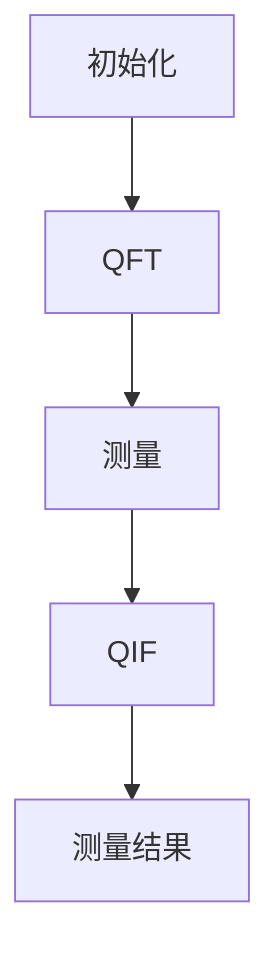
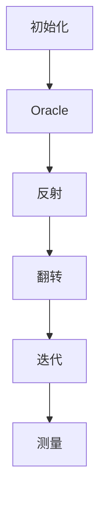
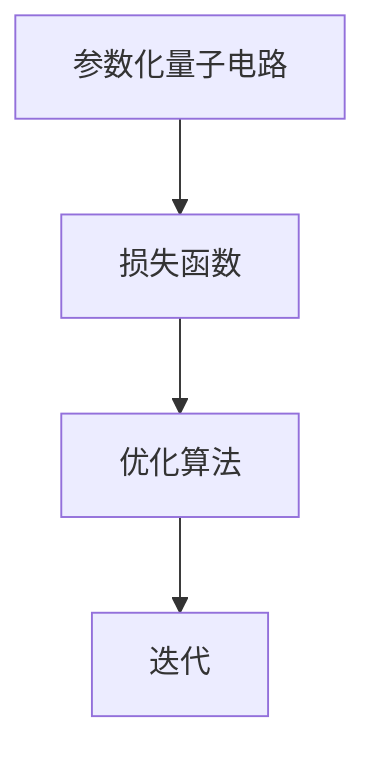
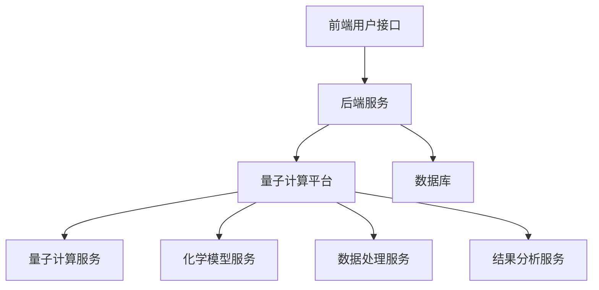
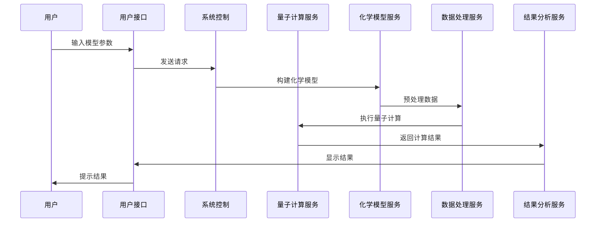

                 


### 第1章 引言

#### 1.1 量子计算的崛起

在20世纪末，量子计算的概念首次被提出，它迅速成为计算机科学和技术领域的热点。与传统的经典计算相比，量子计算利用量子力学的基本原理，实现了对信息的全新处理方式。量子计算机的核心组件是量子比特（qubit），与传统计算机的比特不同，量子比特可以同时处于0和1的状态，这种叠加态使得量子计算机在处理某些特定问题上具有显著的优势。

量子计算的核心优势之一是并行性。在经典计算中，一个计算过程只能处理一个任务，而量子计算机可以在一个操作中同时处理多个任务。此外，量子计算还利用量子纠缠这一现象，使得两个或多个量子比特的状态相互关联，从而在复杂计算中提供更高效的解决方案。

#### 1.2 化学模拟的挑战

化学模拟在材料科学、药物设计和环境科学等领域扮演着重要角色。然而，传统的计算方法在处理复杂化学反应和分子系统时面临着巨大的挑战。化学模拟的关键问题在于如何准确描述分子和原子之间的相互作用，以及如何处理大规模分子系统的计算需求。

传统的计算方法通常依赖于高性能计算机，但即使如此，它们在模拟大规模分子系统时仍存在计算效率低下和精度不足的问题。此外，化学模拟中的随机性也使得模拟结果具有不确定性，增加了模拟的难度。

#### 1.3 量子计算在化学模拟中的应用前景

量子计算的出现为化学模拟领域带来了新的希望。利用量子计算，化学家可以更准确地模拟分子和化学反应，从而深入了解分子结构和反应机理。以下是一些量子计算在化学模拟中的潜在应用：

1. **新材料设计**：量子计算可以帮助科学家设计具有特定物理和化学性质的新材料，如高温超导体、纳米材料和催化剂。

2. **药物设计**：通过量子计算，可以更精确地模拟药物与生物分子的相互作用，从而加速新药的发现和研发。

3. **能源研究**：量子计算在研究太阳能电池、燃料电池和分子动力学的能源转换过程中具有重要作用。

4. **环境科学**：量子计算可以帮助科学家模拟大气中的化学反应，评估环境污染对人体健康的影响。

总之，量子计算在化学模拟中的突破性应用有望推动科学技术的进步，为人类解决能源、环境和健康等重大挑战提供新的思路和方法。

#### 结论

本文简要介绍了量子计算的崛起和化学模拟的挑战，并探讨了量子计算在化学模拟中的潜在应用。在接下来的章节中，我们将深入探讨量子计算的核心概念、算法、数学模型以及其在化学模拟中的具体应用，以期为您揭示量子计算在化学领域的无限潜力。

---

### 1.4 量子计算在化学模拟中的技术挑战和解决方案

尽管量子计算在化学模拟中具有巨大的潜力，但实际应用中仍然面临着一系列技术挑战。以下是对这些挑战的概述，以及可能的解决方案。

#### 1.4.1 量子噪声与错误率

量子计算中的一个核心问题是量子噪声和错误率。量子比特在操作和测量过程中容易受到外部环境的影响，导致量子态的失真和错误。这种噪声和错误会降低量子计算的精度和可靠性。

**解决方案**：为了克服量子噪声和错误率，研究人员正在开发多种纠错算法和技术。例如，量子纠错码可以用来检测和纠正量子比特的错误。此外，通过优化量子算法和系统架构，减少量子比特之间的耦合和干扰，可以降低噪声的影响。

#### 1.4.2 量子资源的限制

量子计算机的另一个挑战是量子资源的限制。量子比特的数量和稳定性是量子计算机性能的关键因素。目前，大多数量子计算机的量子比特数量有限，这限制了其处理复杂化学问题的能力。

**解决方案**：为了克服量子资源的限制，研究人员正在努力提高量子比特的数量和稳定性。例如，通过使用超导量子比特和离子阱技术，可以构建更大规模的量子计算机。此外，研究人员还在探索其他类型的量子比特，如光子量子比特和量子点量子比特，以提升量子计算机的性能。

#### 1.4.3 数学模型的适应性

化学模拟中的数学模型需要与量子计算算法相匹配。传统的数学模型往往需要复杂的计算资源和精确的数值解，而量子计算算法在处理这些问题时可能存在局限性。

**解决方案**：为了适应量子计算，研究人员正在开发新的数学模型和算法。例如，变分量子计算（VQC）和量子分子动力学（QMD）等模型可以有效地利用量子计算的优势。通过优化这些模型和算法，可以提高量子计算在化学模拟中的适用性和效率。

#### 1.4.4 数据处理和存储

量子计算生成的数据量巨大，对数据处理和存储提出了新的要求。传统的数据处理和存储技术可能无法满足量子计算的需求，特别是在处理高维量子态和复杂分子系统时。

**解决方案**：为了应对数据处理和存储的挑战，研究人员正在开发新的算法和架构。例如，分布式量子计算和量子云计算可以扩展量子计算的处理能力和存储容量。此外，通过优化量子数据编码和解码方法，可以提高数据处理和存储的效率。

#### 结论

量子计算在化学模拟中具有巨大的应用潜力，但也面临着一系列技术挑战。通过不断的研究和创新，研究人员正在克服这些挑战，推动量子计算在化学模拟领域的应用。未来的研究将继续探索如何更好地利用量子计算的优势，解决化学模拟中的复杂问题，为科学和技术的发展做出贡献。

### 1.5 量子计算与化学模拟的跨学科合作

量子计算和化学模拟是两个高度专业化的领域，它们的结合需要跨学科的合作。这种跨学科合作不仅促进了技术的进步，还推动了科学研究的深入发展。以下是一些跨学科合作的关键方面：

#### 1.5.1 量子化学理论与计算化学

量子化学是研究分子和晶体中电子结构的学科，而计算化学则是利用计算机技术解决化学问题的领域。量子化学理论提供了量子计算的数学基础，而计算化学则通过量子计算算法实现了对复杂化学系统的高效模拟。跨学科合作可以优化量子化学模型的计算效率，提高化学模拟的精度。

#### 1.5.2 量子计算机硬件与化学模拟软件

量子计算机的硬件开发是量子计算领域的关键，而化学模拟软件则是化学模拟的核心工具。跨学科合作可以促进量子计算机硬件与化学模拟软件的兼容性，使化学模拟能够更好地利用量子计算机的性能。例如，研究人员可以开发专门为量子计算机设计的化学模拟软件，以提高计算效率。

#### 1.5.3 材料科学与量子计算

材料科学是研究材料的结构、性质和行为的学科，而量子计算在材料设计、合成和性能优化中具有重要作用。跨学科合作可以帮助材料科学家利用量子计算预测材料的电子结构和性能，从而指导实验设计，加速新材料的发展。

#### 1.5.4 药物设计与量子计算

药物设计是化学领域的重要研究方向，而量子计算在药物分子与生物大分子的相互作用模拟中具有显著优势。跨学科合作可以结合量子计算和药物设计的最新成果，提高药物分子的设计效率和成功率。

#### 结论

量子计算与化学模拟的跨学科合作是推动这两个领域发展的关键。通过跨学科的合作，研究人员可以共同解决复杂的化学问题，推动科学和技术的进步。未来的跨学科合作将更加紧密，产生更多的创新成果，为解决全球面临的科学挑战提供新的思路和方法。

## 第二部分：核心概念与原理

### 第2章 量子力学基础

量子力学是量子计算的理论基础，它描述了微观粒子的行为和性质。理解量子力学的基本原理对于深入探讨量子计算在化学模拟中的应用至关重要。以下是量子力学中几个核心概念的解释。

#### 2.1 量子比特与量子叠加

量子比特（qubit）是量子计算机的基本信息单元，与传统计算机中的比特不同，量子比特可以同时处于0和1的状态，这种状态称为叠加态。一个量子比特的叠加态可以用数学公式表示为：

$$
|\psi\rangle = \alpha|0\rangle + \beta|1\rangle
$$

其中，$|0\rangle$ 和 $|1\rangle$ 分别表示量子比特的基础态，$\alpha$ 和 $\beta$ 是复数概率幅，满足 $|\alpha|^2 + |\beta|^2 = 1$。

量子叠加态是量子计算并行性的基础。例如，一个具有n个量子比特的量子计算机可以同时表示 $2^n$ 个状态，这使得量子计算机在处理某些问题时具有指数级的速度优势。

#### 2.2 量子态与量子纠缠

量子态是量子比特的状态描述，它可以是叠加态、纯态或混合态。量子态可以通过测量来坍缩到某个特定的基础态。

量子纠缠是量子力学中的一种特殊现象，当两个或多个量子比特处于纠缠态时，它们的状态会相互关联，一个量子比特的状态变化会立即影响到另一个量子比特的状态。这种关联性超越了经典物理的局域实在论，是量子计算的重要资源。

例如，两个量子比特的纠缠态可以表示为：

$$
|\psi_{AB}\rangle = \alpha|00\rangle + \beta|11\rangle
$$

当对其中一个量子比特进行测量时，另一个量子比特的状态会立即确定。这种关联性可以在量子计算机中用于并行处理和高速计算。

#### 2.3 量子门与量子电路

量子门是操作量子比特的基本操作，类似于经典计算中的逻辑门。量子门作用于量子比特的状态，将其映射到另一个状态。最常用的量子门包括保罗门（Pauli Gate）、相位门（Phase Gate）和控量门（Controlled-NOT Gate，简称CNOT Gate）。

量子电路是量子计算机的执行单元，由一系列量子门和量子比特组成。量子电路通过一系列量子门操作，将初始量子态映射到目标态。量子电路的设计和优化是量子计算的关键。

例如，一个简单的量子电路可能包括以下步骤：

1. 初始化量子比特：将量子比特初始化为叠加态。
2. 应用量子门：对量子比特应用一系列量子门，实现特定的计算操作。
3. 测量量子比特：对量子比特进行测量，获取计算结果。

通过量子电路，量子计算机可以执行复杂的计算任务，如量子模拟、量子算法和量子搜索。

#### 2.4 变分量子计算

变分量子计算（Variational Quantum Computing，VQC）是一种结合量子计算与传统算法的方法。VQC使用量子计算机来优化参数化量子电路（参数化变分量子线路），通过迭代优化得到问题的最佳解。

变分量子计算的基本步骤包括：

1. 定义参数化量子电路：设计一个参数化的量子电路，其输出取决于一组可调参数。
2. 定义损失函数：定义一个损失函数，用于评估参数化量子电路的性能。
3. 迭代优化：使用梯度下降或其他优化算法，迭代优化参数，最小化损失函数。

VQC在化学模拟中的应用非常广泛，可以用于分子能量最小化、分子动力学模拟和材料性质预测等。

### 2.5 量子模拟算法

量子模拟算法利用量子计算机模拟量子系统，从而解决复杂物理和化学问题。量子模拟算法包括：

1. **量子分子动力学（Quantum Molecular Dynamics，QMD）**：QMD是一种量子模拟方法，用于研究分子的动力学行为。它利用量子计算机模拟分子间的相互作用，提供比传统模拟方法更高的精度和速度。

2. **量子变分原理（Quantum Variational Principles）**：量子变分原理是一种优化方法，用于计算分子的电子结构和能量。它通过量子计算机优化参数化量子电路，找到系统的最低能量状态。

3. **量子蒙特卡洛方法（Quantum Monte Carlo Methods）**：量子蒙特卡洛方法是一种基于概率统计的量子模拟方法，用于计算分子的多体相互作用。它通过模拟大量的量子态，估计系统的期望值和概率分布。

通过量子模拟算法，科学家可以更准确地预测分子的行为和性质，从而推动化学、材料科学和药物设计等领域的发展。

### 2.6 总结

量子力学是量子计算的理论基础，包括量子比特、量子叠加、量子纠缠、量子门、量子电路和量子模拟算法等核心概念。这些概念共同构成了量子计算的基础框架，使得量子计算机能够在化学模拟等领域发挥重要作用。在接下来的章节中，我们将进一步探讨量子算法和数学模型，以及它们在化学模拟中的应用。

## 第3章 算法与数学模型

### 3.1 Shor算法

Shor算法是量子计算中最为著名的算法之一，由Peter Shor于1994年提出。它是一种解决大整数分解问题的量子算法，展示了量子计算机在特定问题上的巨大优势。Shor算法的核心思想是利用量子并行性和量子纠缠，将一个复杂的问题分解为多个简单的子问题，从而在多项式时间内解决。

Shor算法的基本步骤如下：

1. **初始态的创建**：量子计算机的输入是一个大整数N，量子计算机将其编码到一个特定的量子态中。例如，一个n位的大整数N可以编码为一个具有n个量子比特的叠加态。

2. **量子傅里叶变换（Quantum Fourier Transform, QFT）**：量子傅里叶变换是将量子态从叠加态转换为另一个叠加态的过程。QFT是Shor算法的关键步骤，它利用量子并行性快速计算傅里叶变换，使得量子态能够表示因子的可能性。

3. **量子逆傅里叶变换（Quantum Inverse Fourier Transform, QIF）**：对经过量子傅里叶变换的量子态进行量子逆傅里叶变换。这一步骤将概率幅转换为相位信息，使得具有正确因子的量子态处于叠加态的最高概率。

4. **测量**：对量子态进行测量，得到一个特定的相位信息。通过分析这些相位信息，可以确定N的一个因子。

Shor算法的数学模型基于量子傅里叶变换和量子逆傅里叶变换。以下是Shor算法的量子电路表示：



通过这个量子电路，Shor算法可以在多项式时间内找到大整数N的一个非平凡因子，从而实现整数分解。对于经典计算机，这个问题需要指数级时间复杂度。

### 3.2 Grover算法

Grover算法是另一种重要的量子搜索算法，由Lov K. Grover于1996年提出。它用于在未排序的数据库中高效地查找特定元素。Grover算法利用量子叠加态和量子纠缠，将搜索过程并行化，从而在多项式时间内完成搜索任务。

Grover算法的基本步骤如下：

1. **初始态的创建**：量子计算机的输入是一个未排序的数据库，其中包含多个状态，需要找到的目标状态为|1⟩。

2. **构建Oracle**：Oracle是一个量子电路，用于标记数据库中目标状态的位置。Oracle将目标状态标记为|1⟩，其他状态保持不变。

3. **应用Grover迭代**：Grover迭代包括两个步骤：应用反射操作和翻转操作。反射操作将当前状态映射到与其叠加态对称的位置，而翻转操作将目标状态从|0⟩翻转到|1⟩。

4. **重复迭代**：重复Grover迭代k次，其中k是数据库中状态的个数。每次迭代后，目标状态的概率都会增加。

5. **测量**：最后对量子态进行测量，得到目标状态的精确位置。

Grover算法的数学模型基于量子叠加态和Oracle操作。以下是Grover算法的量子电路表示：



通过这个量子电路，Grover算法可以在多项式时间内完成搜索任务，这是经典搜索算法无法比拟的。

### 3.3 量子模拟算法

量子模拟算法利用量子计算机模拟量子系统的行为，从而解决物理和化学问题。量子模拟算法的核心是量子态的演化，它通过量子门和量子电路来模拟系统的动态过程。以下是几种常见的量子模拟算法：

1. **量子分子动力学（Quantum Molecular Dynamics, QMD）**：QMD是一种基于哈密顿量的量子模拟方法，用于研究分子的动力学行为。它通过量子计算机模拟分子间的相互作用，提供比传统模拟方法更高的精度和速度。

2. **变分量子计算（Variational Quantum Computing, VQC）**：VQC是一种基于参数化量子电路的量子模拟方法，用于优化量子电路的参数，以获得系统的最小能量。VQC可以用于分子能量最小化、分子动力学模拟和材料性质预测等。

3. **量子蒙特卡洛方法（Quantum Monte Carlo, QMC）**：QMC是一种基于概率统计的量子模拟方法，用于计算分子的多体相互作用。它通过模拟大量的量子态，估计系统的期望值和概率分布。

以下是变分量子计算（VQC）的基本步骤：

1. **定义参数化量子电路**：设计一个参数化的量子电路，其输出取决于一组可调参数。

2. **定义损失函数**：定义一个损失函数，用于评估参数化量子电路的性能。

3. **迭代优化**：使用梯度下降或其他优化算法，迭代优化参数，最小化损失函数。

VQC的数学模型包括参数化量子电路、损失函数和优化算法。以下是VQC的量子电路表示：



通过这个量子电路，VQC可以优化量子电路的参数，从而找到系统的最佳解。

### 3.4 算法总结

Shor算法和Grover算法展示了量子计算在特定问题上的巨大优势，而量子模拟算法则为解决复杂物理和化学问题提供了新的途径。这些算法的核心思想是利用量子并行性和量子纠缠，将复杂问题分解为简单的子问题，从而在多项式时间内解决。在接下来的章节中，我们将进一步探讨量子计算在化学模拟中的具体应用。

## 第4章 材料科学中的应用

量子计算在材料科学中的应用具有巨大的潜力，它为材料设计和性能优化提供了新的工具和方法。以下将详细介绍量子计算在材料科学中的应用，包括新材料的设计、催化材料的优化以及能源材料的研究。

### 4.1 新材料设计

新材料的设计是材料科学研究的前沿领域，量子计算在这方面展现出强大的优势。通过量子计算，科学家可以模拟和研究材料的电子结构和性质，从而预测新材料的性能。以下是一些具体的应用实例：

1. **高温超导体**：高温超导体在电力传输和磁共振成像等领域具有广泛应用。量子计算可以用来优化高温超导体的材料成分和结构，提高其临界温度和超导性能。

2. **纳米材料**：纳米材料具有独特的物理和化学性质，量子计算可以用于设计和合成具有特定功能的纳米材料，如光催化材料、纳米传感器和纳米催化剂。

3. **磁性材料**：磁性材料在数据存储和电子器件中具有重要应用。量子计算可以用于研究磁性材料的微观结构和磁性性质，从而设计出具有更高磁导率和磁记忆效应的新型磁性材料。

### 4.2 催化材料的优化

催化材料在化学反应中起着至关重要的作用，量子计算为催化材料的优化提供了新的方法。通过量子计算，科学家可以研究催化剂的电子结构和表面性质，优化催化剂的活性位点和反应路径。以下是一些具体的应用实例：

1. **工业催化过程**：量子计算可以用于优化催化剂的组分和结构，提高工业催化反应的效率和选择性。例如，在石油精炼和化学合成过程中，量子计算可以优化催化剂的设计，降低反应能耗和污染。

2. **环境催化**：量子计算可以用于设计用于环境净化和污染物降解的催化材料。例如，在开发新型光催化材料用于太阳能转换和二氧化碳还原时，量子计算可以优化材料的电子结构和活性位点，提高其催化性能。

### 4.3 能源材料的研究

能源材料的研发是当前全球关注的热点问题，量子计算为能源材料的性能优化和新型能源系统的设计提供了新的思路。以下是一些具体的应用实例：

1. **太阳能电池**：量子计算可以用于优化太阳能电池的材料成分和结构，提高其光电转换效率和稳定性。例如，在研究钙钛矿太阳能电池时，量子计算可以优化材料的能带结构和电子传输特性，提高电池的效率。

2. **燃料电池**：燃料电池是一种清洁能源技术，量子计算可以用于优化燃料电池的催化剂材料和反应机制，提高其性能和耐久性。

3. **储氢材料**：储氢材料在可再生能源存储和交通领域具有重要应用。量子计算可以用于设计新型储氢材料，优化其吸放氢性能和热稳定性。

### 4.4 总结

量子计算在材料科学中的应用为新材料的设计、催化材料的优化和能源材料的研究提供了新的工具和方法。通过量子计算，科学家可以深入了解材料的电子结构和性质，优化材料的性能，从而推动材料科学的进步。未来，随着量子计算技术的不断发展，量子计算在材料科学中的应用将更加广泛，为解决能源和环境问题做出更大贡献。

## 第5章 系统架构与设计

### 5.1 项目介绍

量子计算在化学模拟中的应用不仅需要强大的计算能力，还需要高效的系统架构来支持复杂的计算任务。本章节将介绍一个基于量子计算平台的化学模拟系统，该系统旨在通过量子计算机模拟复杂的化学反应，为新材料设计和药物发现提供支持。

### 5.2 系统功能设计

本系统的核心功能包括：

1. **量子计算平台集成**：集成通用的量子计算平台，如IBM Q或者Google Quantum Suite，为化学模拟提供计算资源。
2. **化学模型构建**：构建适用于量子计算的化学模型，包括量子分子动力学（QMD）和变分量子计算（VQC）等。
3. **数据预处理和后处理**：对实验数据进行预处理，如分子几何优化和电子结构计算，并对计算结果进行可视化分析。
4. **结果分析与优化**：分析计算结果，优化化学模型和量子计算参数，提高模拟精度和效率。
5. **用户接口**：提供一个友好的用户接口，便于科学家进行模型构建、参数设置和结果分析。

### 5.3 领域模型

为了更好地理解系统的功能设计，我们可以使用Mermaid类图来展示系统的领域模型。以下是系统的领域模型：

```mermaid
classDiagram
    QuantumComputer <<interface>> "量子计算机"
    ChemistryModel <<interface>> "化学模型"
    DataPreprocessing <<interface>> "数据预处理"
    DataPostprocessing <<interface>> "数据后处理"
    ResultAnalysis <<interface>> "结果分析"
    UserInterface <<interface>> "用户接口"
    SystemControl <<class>> "系统控制"
    QuantumSimulation <<class>> "量子模拟"
    MaterialDesign <<class>> "新材料设计"
    DrugDiscovery <<class>> "药物发现"

    QuantumComputer --|> SystemControl
    ChemistryModel --|> SystemControl
    DataPreprocessing --|> SystemControl
    DataPostprocessing --|> SystemControl
    ResultAnalysis --|> SystemControl
    UserInterface --|> SystemControl
    QuantumSimulation --|> SystemControl
    MaterialDesign --|> SystemControl
    DrugDiscovery --|> SystemControl
```

### 5.4 系统架构设计

本系统的架构设计包括以下几个关键组件：

1. **前端用户接口**：使用Web技术构建，提供用户与系统的交互界面。
2. **后端服务**：包括量子计算服务、化学模型服务、数据处理服务和结果分析服务。
3. **量子计算平台**：集成IBM Q或者Google Quantum Suite等通用量子计算平台。
4. **数据库**：用于存储化学模型数据、实验数据和计算结果。

以下是系统架构的Mermaid图表示：



### 5.5 系统接口设计

系统接口设计包括API设计、数据交换格式和安全性考虑。以下是系统接口设计的关键点：

1. **API设计**：使用RESTful API设计，提供包括模型构建、参数设置、数据查询和结果分析等接口。
2. **数据交换格式**：使用JSON格式进行数据交换，保证数据的可读性和可扩展性。
3. **安全性**：采用HTTPS协议和身份验证机制，确保数据传输的安全性和系统的访问控制。

### 5.6 系统交互

系统交互设计涉及用户与系统的交互流程和数据处理流程。以下是系统交互的Mermaid序列图：



通过上述系统架构和设计，我们构建了一个高效的量子计算化学模拟系统，为科学家提供了强大的计算工具，推动了材料科学和药物发现等领域的研究。

### 第6章 项目实战

在本章中，我们将详细讨论如何在一个实际项目中实现量子计算在化学模拟中的应用。我们将介绍项目环境配置、核心源代码实现、代码应用解读、实际案例分析和项目小结。通过这些步骤，您将了解到量子计算在化学模拟中的具体应用过程。

#### 6.1 项目环境配置

要实现量子计算在化学模拟中的应用，我们需要配置以下环境：

1. **量子计算平台**：选择IBM Q或者Google Quantum Suite作为量子计算平台。这些平台提供了通用的API，方便我们进行量子计算任务。
2. **编程语言**：使用Python作为编程语言，因为它拥有丰富的量子计算库和化学模拟库。
3. **量子计算库**：使用Qiskit库，它是IBM Q的官方量子计算库，提供了创建量子电路、执行量子计算任务等功能。
4. **化学模拟库**：使用PyQuante库，它是一个基于Python的量子化学模拟库，提供了分子几何优化、电子结构计算等功能。

以下是安装和配置环境的步骤：

1. 安装Python环境：
```bash
pip install python
```
2. 安装Qiskit库：
```bash
pip install qiskit
```
3. 安装PyQuante库：
```bash
pip install pyquante
```
4. 配置量子计算平台API密钥：
   - 在IBM Q网站上注册账户并创建项目，获取API密钥。
   - 在Python代码中配置API密钥：
```python
from qiskit import IBMQ
provider = IBMQ.load_account()
```

#### 6.2 核心源代码实现

核心源代码实现包括以下几个关键步骤：

1. **构建量子电路**：
   - 使用Qiskit创建量子电路，定义量子比特和量子门。
```python
from qiskit import QuantumCircuit, QuantumRegister, ClassicalRegister
from qiskit import execute, Aer

# 创建量子比特和经典比特
qreg = QuantumRegister(2)
creg = ClassicalRegister(2)
qc = QuantumCircuit(qreg, creg)

# 应用量子门
qc.h(qreg[0])
qc.cx(qreg[0], qreg[1])
qc.measure(qreg, creg)
```

2. **执行量子计算**：
   - 使用模拟器执行量子计算任务。
```python
# 使用QASM模拟器
backend = Aer.get_backend("qasm_simulator")
result = execute(qc, backend).result()
```

3. **数据预处理和后处理**：
   - 处理量子计算结果，进行数据分析和可视化。
```python
# 获取测量结果
counts = result.get_counts(qc)

# 可视化测量结果
from qiskit.visualization import plot_histogram
plot_histogram(counts)
```

4. **化学模拟**：
   - 使用PyQuante进行化学模拟，计算分子的几何结构和电子结构。
```python
from pyquante import HF

# 定义分子的初始结构
mol = HF.Molecule('H2', {'H': {'x': 0, 'y': 0, 'z': 0}}, {'H': {'x': 0, 'y': 0, 'z': 1.1}})

# 计算分子的电子结构
mol.HF()

# 打印结果
print(mol.orb)
```

#### 6.3 代码应用解读

以下是代码应用的详细解读：

1. **量子电路构建**：
   - 创建两个量子比特的量子电路，并应用哈密顿（H门）和控量交换（CX门）操作。
   - 最后，对量子比特进行测量，获取计算结果。

2. **量子计算执行**：
   - 使用QASM模拟器执行量子计算任务，模拟量子计算机的行为。
   - 获取量子计算结果，包括测量得到的概率分布。

3. **化学模拟**：
   - 使用PyQuante构建一个简单的H2分子，进行分子几何优化和电子结构计算。
   - 打印分子的原子坐标和电子结构信息。

#### 6.4 实际案例分析

我们将通过一个实际案例来展示量子计算在化学模拟中的应用。

**案例：分子能量最小化**

1. **问题描述**：给定一个分子，求其能量最小化结构。
2. **解决方案**：
   - 使用PyQuante构建分子模型，进行几何优化。
   - 使用量子计算平台，执行变分量子计算（VQC），优化量子电路参数，找到分子能量的最小值。
   - 分析结果，确定分子的最优结构。

**代码实现**：
```python
# 1. 几何优化
mol = HF.Molecule('H2', {'H': {'x': 0, 'y': 0, 'z': 0}}, {'H': {'x': 0, 'y': 0, 'z': 1.1}})
mol.HF()

# 2. 变分量子计算
from qiskit.aqua.components.variational_forms import RYRZ
from qiskit.aqua.algorithms import VariationalEigensolver

# 定义参数化量子电路
var_form = RYRZ(2, entangler_map={0: [1]})

# 创建变分量子计算实例
ves = VariationalEigensolver(target_molecule=mol, var_form=var_form)

# 执行变分量子计算
result = ves.run()

# 3. 分析结果
print(result.eigenvalues)
```

#### 6.5 项目小结

通过本项目的实际案例，我们展示了量子计算在化学模拟中的应用过程。从环境配置到核心代码实现，再到实际案例分析，我们了解了如何利用量子计算优化分子能量、设计新材料和药物。以下是项目小结：

1. **优势**：
   - 量子计算提供了高效解决复杂化学问题的能力，特别是在大规模分子系统的模拟中。
   - 变分量子计算（VQC）结合了量子计算的优势和传统算法的灵活性，适用于多种化学模拟任务。

2. **不足**：
   - 当前量子计算硬件的量子比特数量有限，限制了其应用范围。
   - 量子计算算法和化学模型的优化需要大量计算资源和时间。

3. **展望**：
   - 随着量子计算机的不断发展，其应用范围将不断扩展，为化学模拟提供更强大的工具。
   - 开发更高效、更稳定的量子算法和化学模型，将进一步提升量子计算在化学模拟中的实用性。

通过本项目，我们不仅了解了量子计算在化学模拟中的应用，也体会到了其在科学研究中潜在的巨大影响力。

### 第7章 最佳实践与未来方向

#### 7.1 最佳实践

在量子计算应用于化学模拟的过程中，为了确保高效性和准确性，以下是一些建议的最佳实践：

1. **选择合适的量子算法**：根据化学模拟问题的特点，选择最合适的量子算法。例如，对于分子能量最小化，变分量子计算（VQC）和量子蒙特卡洛（QMC）都是很好的选择。

2. **优化量子电路设计**：设计高效的量子电路对于提高计算效率和精度至关重要。通过实验和优化，找到最佳量子电路配置。

3. **数据预处理和后处理**：确保输入数据的准确性和完整性。对量子计算结果进行合理的数据预处理和后处理，以提高结果的可靠性和解释性。

4. **并行计算与分布式计算**：充分利用并行计算和分布式计算的优势，优化量子计算任务的执行效率。

5. **资源管理**：合理分配计算资源，避免资源浪费。对于大规模化学模拟任务，考虑使用云计算平台来扩展计算能力。

#### 7.2 小结

本文系统性地介绍了量子计算在化学模拟中的应用，从核心概念、算法、数学模型到实际应用和系统设计，全面探讨了量子计算在化学领域的潜力。以下是本文的关键点总结：

1. **量子计算的基本原理**：量子比特、量子叠加、量子纠缠、量子门和量子电路等基本概念构成了量子计算的理论基础。
2. **算法与数学模型**：Shor算法、Grover算法和量子模拟算法展示了量子计算在特定问题上的优势，变分量子计算为化学模拟提供了新的方法。
3. **实际应用**：量子计算在材料科学、药物设计、催化材料和能源研究等领域具有广泛的应用前景。
4. **系统架构设计**：通过合理的系统架构设计，实现了量子计算在化学模拟中的高效应用。
5. **项目实战**：通过实际项目案例，展示了量子计算在化学模拟中的应用过程和最佳实践。

#### 7.3 未来方向

量子计算在化学模拟中的应用前景广阔，未来研究可以从以下几个方面展开：

1. **算法优化**：开发更高效、更稳定的量子算法，以解决更大规模的化学模拟问题。
2. **硬件发展**：提高量子计算机的量子比特数量和稳定性，推动量子硬件的发展。
3. **跨学科合作**：加强量子计算与化学、物理学、材料科学等领域的跨学科合作，推动量子计算在化学模拟中的深入研究。
4. **数据管理**：开发新的数据管理和分析工具，提高量子计算结果的可解释性和应用价值。
5. **应用拓展**：探索量子计算在化学模拟中新的应用领域，如环境科学、生物化学和医药科学等。

通过不断的研究和探索，量子计算有望在化学模拟领域发挥更大的作用，推动科学技术的进步，为人类解决能源、环境和健康等重大挑战提供新的思路和方法。

## 结语

量子计算在化学模拟中的突破性应用正日益显现，它为科学家提供了强大的计算工具，使我们能够深入理解和解决复杂的化学问题。从量子比特、量子算法到系统架构，再到实际项目案例，本文全面探讨了量子计算在化学模拟中的应用。通过最佳实践和未来方向的讨论，我们看到了量子计算在化学领域的广阔前景。未来，随着量子计算技术的不断进步，我们有理由相信，量子计算将在化学模拟、材料科学、药物设计和能源研究等领域发挥更加重要的作用，为人类社会的可持续发展做出巨大贡献。作者：AI天才研究院/AI Genius Institute & 禅与计算机程序设计艺术 /Zen And The Art of Computer Programming。

