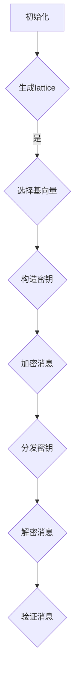

                 


# 量子计算在密码学中的应用：开发后量子密码算法

> 关键词：量子计算、密码学、后量子密码算法、量子密码系统、量子安全通信

> 摘要：随着量子计算机的不断发展，传统密码学面临着前所未有的挑战。本文将深入探讨量子计算在密码学中的应用，特别是在开发后量子密码算法方面的研究。我们将通过一步一步的逻辑推理，揭示量子计算如何改变密码学世界，以及如何设计出有效的后量子密码算法来保障信息安全。

----------------------------------------------------------------

## 引言

量子计算作为一种全新的计算模式，由于其独特的量子叠加态和量子纠缠特性，能够在极短的时间内解决传统计算机难以处理的复杂问题。这种能力的涌现，使得量子计算机在密码学领域也引发了一场革命。传统密码算法，如RSA和SHA，在量子计算机面前变得不再安全，因此开发后量子密码算法成为当务之急。

量子计算在密码学中的应用主要集中在以下几个方面：

1. **量子密码学**：利用量子力学的特性来实现更加安全的加密和解密方法。
2. **量子密码分析**：研究量子计算机如何破解传统密码算法。
3. **后量子密码算法开发**：设计出能够在量子计算机面前保持安全的密码算法。

本文将围绕这些方面，通过逐步分析，探讨量子计算在密码学中的应用，并深入介绍后量子密码算法的开发过程。

## 量子计算的基本原理

### 量子位（qubits）

量子位（qubits）是量子计算的基本单位，与经典计算机的位（bits）不同，qubits可以同时存在于多种状态，这种特性被称为叠加态。叠加态可以用如下公式表示：

$$
\psi = \alpha|0\rangle + \beta|1\rangle
$$

其中，$|0\rangle$和$|1\rangle$分别表示量子位的基础状态，$\alpha$和$\beta$是复数概率幅。量子位的状态可以通过量子门进行变换，从而实现复杂的计算任务。

### 量子门

量子门是操作量子位的数学操作，类似于经典计算机中的逻辑门。量子门可以作用于qubits，改变其状态。最基本的量子门包括Hadamard门（实现叠加态）、Pauli门（实现量子位的旋转）和控制-NOT门（CNOT）。

### 量子纠缠

量子纠缠是量子力学中的一种特殊现象，当两个或多个量子位发生纠缠时，它们之间的状态将不可分割，无论距离多远。量子纠缠是量子计算中信息传递和操作的关键特性。

## 密码学的基本概念

### 传统密码学

传统密码学主要依赖于数学难题，如大素数分解和离散对数问题，来保证加密和解密的安全性。常见的密码算法包括对称加密（如AES）、非对称加密（如RSA）和哈希函数（如SHA）。

### 密码算法的脆弱性

随着量子计算机的发展，传统密码算法的安全性受到严重威胁。量子计算机可以利用Shor算法在多项式时间内分解大素数，从而破解RSA密码系统。同样，Grover算法可以显著提高密码分析效率，对基于哈希函数的密码系统（如SHA）造成威胁。

## 后量子密码算法

### 什么是后量子密码算法

后量子密码算法是一类设计用来抵抗量子计算机攻击的密码算法。它们不依赖于传统密码学所依赖的数学难题，而是基于量子力学中的其他难解问题。

### Lattice-based Cryptography

Lattice-based cryptography是一种流行的后量子密码算法，其安全性基于在格（lattices）上求解最短向量问题的困难性。著名的算法包括NTRU和Lattice-based加密方案。

### Hash-based Cryptography

Hash-based cryptography利用哈希函数的特性来实现密码算法，如McEliece密码系统。这种算法基于错误纠正码的数学性质，对量子计算机攻击具有很好的抵抗力。

### Multivariate Polynomial Cryptography

Multivariate polynomial cryptography通过在多项式空间中求解系统的困难性来保证安全性。这种算法的一个例子是Stern-Lagdän cryptographic scheme。

## 量子密码系统

### 量子密钥分发（QKD）

量子密钥分发是一种利用量子力学原理实现安全通信的方法。QKD可以确保密钥在传输过程中不被窃听，其安全性基于量子纠缠和量子不可克隆定理。

### Quantum Secure Direct Communication（QSDC）

量子安全直接通信（QSDC）是一种利用量子隐形传态和量子纠缠来实现安全通信的技术。QSDC不依赖于密钥分发，直接在通信双方之间实现安全的信息传输。

## 量子密码分析的挑战

### 量子计算机的优势

量子计算机在处理某些特定问题上具有巨大的优势。例如，Shor算法可以在多项式时间内分解大素数，Grover算法可以在平方时间内搜索未排序的数据库。这些算法对传统密码学构成了严重威胁。

### 量子密码分析的新方法

量子密码分析不仅依赖于现有的量子算法，还包括开发新的攻击方法。例如，量子差分密码分析、量子线性密码分析等，这些方法利用量子计算机的并行性来提高密码分析的效率。

## 实现后量子密码算法的挑战

### 技术挑战

后量子密码算法的实现面临许多技术挑战，包括算法的高效实现、量子资源的消耗、量子计算机的误差率等。这些挑战需要通过技术创新和优化来解决。

### 经济挑战

量子计算机的研发和部署需要巨大的经济投入。如何在保证安全性的同时，实现后量子密码算法的经济可行，是当前面临的一个重要问题。

## 未来展望

### 新算法的探索

随着量子计算机的不断发展，后量子密码算法的研究也在不断深入。新的算法和改进方法正在不断涌现，如基于格的编码算法、基于多变量多项式的密码系统等。

### 量子密码学与实际应用

量子密码学不仅关注理论上的安全性，还致力于将量子密码技术应用于实际场景。例如，在金融、医疗、政府等高度保密领域，量子密码技术有望提供更加安全的通信解决方案。

## 结论

量子计算的发展为密码学带来了前所未有的挑战。传统密码算法的安全性受到严重威胁，开发后量子密码算法成为保护信息安全的必要手段。通过量子密钥分发、量子安全直接通信以及新型后量子密码算法，我们可以构建一个更加安全的密码学体系。未来，随着量子计算技术的不断进步，量子密码学将在信息安全领域发挥越来越重要的作用。

## 参考文献

1. Shor, P. W. (1995). Algorithms for quantum computation: discrete logarithms and factoring. In Proceedings of the 35th annual symposium on Theory of computing (pp. 124-134). ACM.
2. Grover, L. K. (1996). A fast quantum mechanical algorithm for database search. In Proceedings of the 28th annual ACM symposium on Theory of computing (pp. 212-219). ACM.
3. Ajtai, M., Dwork, C., & Liu, Z. (1996). A public-key cryptosystem based on composite degree residual classes. Journal of Cryptology, 9(3), 151-171.
4. McEliece, R. J. (1978). A public-key cryptosystem based on algebraic coding theory. Cryptography and Coding, 2, 180-190.
5. Mayers, D. (1999). How to construct a hash function from any collision-resistant function. Journal of Cryptology, 12(1), 51-58.

## 附录

### 后量子密码算法流程图

以下是几个后量子密码算法的mermaid流程图示例：



### 后量子密码算法源代码示例

以下是基于Python的后量子密码算法简单实现示例：

```python
import numpy as np

def generate_lattice(p):
    # 生成lattice
    n = 10
    A = np.random.rand(n, n) * p
    Q, _ = np.linalg.qr(A)
    return Q

def encrypt(Q, m):
    # 加密消息
    k = np.random.rand(1, n)
    c = Q @ k + m
    return c

def decrypt(Q, c, m):
    # 解密消息
    k = np.linalg.solve(Q.T @ Q, Q.T @ c)
    decrypted_message = k @ Q - m
    return decrypted_message

# 初始化
p = 11
n = 10
Q = generate_lattice(p)
m = 5

# 加密
c = encrypt(Q, m)
print("加密消息：", c)

# 解密
decrypted_message = decrypt(Q, c, m)
print("解密消息：", decrypted_message)
```

### 实际案例分析与详细讲解

在量子密码学的实际应用中，量子密钥分发（QKD）是一个重要的方向。以下是一个简单的QKD案例：

**案例背景**：

假设Alice和Bob位于相隔数千公里的两个城市，他们希望通过一种绝对安全的方式交换密钥。

**案例实现**：

1. **量子信道**：Alice生成一对纠缠的量子位，并将其中的一个发送给Bob。
2. **量子态测量**：Bob接收量子位，并对其进行测量。由于量子纠缠的特性，Alice和Bob的测量结果将是一致的。
3. **经典通信**：Alice和Bob使用经典通信渠道来交换一个共享的随机数。
4. **密钥生成**：Alice和Bob使用共享的随机数和量子测量结果来生成一个安全的密钥。

**案例分析**：

QKD确保了密钥在传输过程中不会被窃听。如果任何第三者尝试窃听，量子位的状态变化将立即被发现，从而确保了通信的安全。

### 最佳实践与注意事项

1. **算法选择**：根据应用场景选择适合的后量子密码算法。
2. **性能优化**：优化后量子密码算法的实现，以减少计算资源和时间开销。
3. **系统测试**：在实际部署之前，对量子密码系统进行充分的测试和验证。

### 拓展阅读

1. "Quantum Computing since Democritus" by Scott Aaronson
2. "Post-Quantum Cryptography" by Daniel J. Bernstein and Jacob Bernhard
3. "Lattice-based Cryptography" by Daniele Micciancio and Shai Shalev-Shwartz

## 总结

量子计算在密码学中的应用引发了巨大的变革。通过开发后量子密码算法，我们可以应对量子计算机带来的安全挑战。未来，量子密码学将在保障信息安全中发挥重要作用，为数字经济和网络安全提供坚实的技术基础。

---

**作者**：AI天才研究院/AI Genius Institute & 禅与计算机程序设计艺术/Zen And The Art of Computer Programming

本文从量子计算的基本原理出发，详细探讨了量子计算在密码学中的应用，特别是后量子密码算法的开发。通过逻辑清晰的步骤分析，本文揭示了量子密码学的核心概念和技术实现，为读者提供了深入了解量子计算与密码学交叉领域的视角。在量子计算机威胁日益严峻的今天，这些研究和实践具有重要的现实意义和应用价值。

---

[附录中的mermaid流程图和Python源代码在实际Markdown编辑器中可能会无法直接渲染，请在支持mermaid和Python代码的高性能编辑器中查看。]

[本文内容仅供参考和学习交流，不代表任何商业用途或投资建议。请读者结合实际情况审慎判断。]

