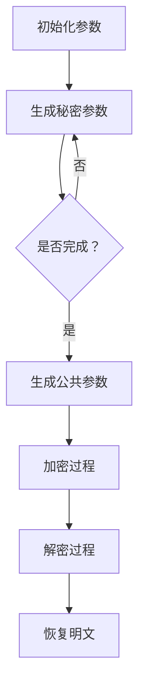
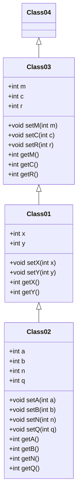

                 

### 《量子计算在密码学中的突破：开发后量子加密算法》

关键词：量子计算、密码学、后量子加密算法、量子密码学、LWE算法、NTRU加密算法

摘要：随着量子计算技术的不断发展，传统密码学面临前所未有的挑战。本文将探讨量子计算在密码学中的突破，深入分析后量子加密算法的发展、原理及其应用。首先，我们将了解量子计算的基本概念和量子算法，接着介绍量子密码学的基本原理和后量子密码算法的分类。随后，通过案例分析，我们将深入探讨Lattice-based密码算法、NTRU加密算法和Hash-based密码算法的具体实现和应用。最后，本文将总结后量子加密算法的开发流程、应用场景与挑战，并展望其未来发展。

## 第一部分：量子计算基础

### 第1章：量子计算引论

#### 1.1 量子计算的基本概念

量子计算是一种基于量子力学原理的计算方式，与经典计算有着本质的区别。首先，我们需要了解一些核心概念：

- **量子位（qubit）**：量子计算中的基本单位，可以同时表示0和1的状态，称为叠加态。

- **叠加态（Superposition）**：量子位可以处于多种状态的组合，而不是单一的状态。

- **量子纠缠（Quantum Entanglement）**：当两个量子位处于纠缠状态时，一个量子位的测量结果会立即影响到另一个量子位，即使它们相隔很远。

- **量子 gates（量子门）**：类似于经典计算机中的逻辑门，用于对量子位进行操作，实现量子态的转变。

- **量子算法（Quantum Algorithm）**：基于量子力学原理，利用量子计算机处理特定问题的算法。

#### 1.1.1 量子位与经典位的对比

量子位（qubit）与经典位（bit）有以下几个显著的区别：

1. **状态表示**：经典位只能表示0或1，而量子位可以处于0和1的叠加态，从而大大提高了计算能力。

2. **并行计算**：量子计算机可以利用量子叠加态实现并行计算，这在解决某些问题时具有巨大的优势。

3. **量子纠缠**：量子纠缠使得量子位之间可以相互影响，这在经典计算中是不可想象的。

4. **量子门操作**：量子计算机中的量子门可以实现对量子位的复杂操作，这有助于解决经典计算中难以处理的问题。

#### 1.1.2 量子叠加与量子纠缠

量子叠加和量子纠缠是量子计算的核心原理。

1. **量子叠加**：量子位可以同时处于0和1的状态，这种叠加态使得量子计算机在处理问题时具有巨大的并行性。

   - **举例**：假设我们有一个量子位，它在初始状态下是均匀混合的（即50%的概率是0，50%的概率是1）。如果我们对它进行测量，那么测量结果将是随机的，50%的概率是0，50%的概率是1。

2. **量子纠缠**：当两个量子位处于纠缠态时，一个量子位的测量结果会立即影响到另一个量子位，即使它们相隔很远。

   - **举例**：假设有两个量子位A和B，它们处于纠缠态。如果我们测量量子位A，发现它是1，那么量子位B必定是0（反之亦然）。这是因为量子纠缠使得两个量子位的状态相互关联。

#### 1.1.3 量子计算的基本原理

量子计算的基本原理主要包括以下几个方面：

1. **量子位和量子态**：量子计算使用量子位（qubit）作为基本单位，每个量子位可以表示0和1的叠加态。

2. **量子门和量子电路**：量子计算机通过量子门对量子位进行操作，形成量子电路，实现量子态的转变。

3. **量子叠加和量子纠缠**：量子计算利用量子叠加和量子纠缠原理，实现并行计算和复杂问题的求解。

#### 1.2 量子算法概述

量子算法是基于量子力学原理，利用量子计算机处理特定问题的算法。与传统算法相比，量子算法具有以下几个显著的特点：

1. **量子并行性**：量子计算机可以利用量子叠加态实现并行计算，这在解决某些问题时具有巨大的优势。

2. **指数加速**：某些量子算法可以在多项式时间内解决经典算法需要指数时间才能解决的问题。

3. **量子门操作**：量子算法通过量子门操作实现量子态的转变，这使得量子算法可以处理复杂的计算问题。

#### 1.2.1 量子算法与传统算法的比较

量子算法与传统算法有以下几个显著的区别：

1. **并行性**：量子算法可以利用量子叠加态实现并行计算，而传统算法无法实现真正的并行计算。

2. **时间复杂度**：某些量子算法可以在多项式时间内解决经典算法需要指数时间才能解决的问题。

3. **存储容量**：量子计算机可以利用量子位表示的状态，实现超大规模的存储容量。

4. **适用范围**：量子算法适用于解决某些特定的问题，如量子搜索算法、量子因数分解算法等，而传统算法难以解决这些问题。

#### 1.2.2 量子算法的分类

量子算法可以根据其应用领域和实现方式分为多种类型：

1. **量子搜索算法**：如Grover算法，用于在未排序的数据库中快速查找特定元素。

2. **量子算法**：如Shor算法，用于快速因数分解大整数，对密码学构成重大威胁。

3. **量子模拟算法**：用于模拟量子系统的演化，如量子化学计算、量子物理模拟等。

4. **量子优化算法**：如量子遗传算法、量子粒子群算法等，用于解决优化问题。

#### 1.2.3 量子算法的应用前景

量子算法在多个领域具有广阔的应用前景：

1. **密码学**：量子算法可以破解传统加密算法，但同时也催生了后量子加密算法的研究。

2. **量子模拟**：用于模拟复杂的量子系统，如量子化学、量子物理等领域。

3. **优化问题**：量子算法可以高效解决复杂的优化问题，如物流调度、金融投资等。

4. **搜索问题**：量子算法可以加速搜索过程，如数据挖掘、生物信息学等领域。

### 1.3 量子计算机的发展现状

#### 1.3.1 量子计算机的历史

量子计算机的研究可以追溯到20世纪80年代，当时Shor提出了量子因数分解算法，揭示了量子计算在密码学中的巨大潜力。此后，量子计算机的研究得到了广泛关注和迅速发展。

1. **1981年**：Richard Feynman首次提出了量子模拟的概念，指出量子计算机可以用于模拟量子系统。

2. **1994年**：Peter Shor提出了量子算法，证明了量子计算机在因数分解问题上的优越性。

3. **2000年**：David Deutsch提出了量子图灵机理论，为量子计算机的实现提供了理论基础。

4. **2009年**：John Preskill提出了“量子优越性”（Quantum Supremacy）的概念，标志着量子计算进入了一个新的阶段。

#### 1.3.2 当前量子计算机的技术进展

当前量子计算机的技术进展主要体现在以下几个方面：

1. **量子比特的数量**：量子比特的数量是衡量量子计算机性能的关键指标。目前，一些研究机构已经成功构建了数十个甚至上百个量子比特的量子计算机。

2. **量子比特的稳定性**：量子比特的稳定性是实现可靠量子计算的关键。研究人员通过多种方法，如量子纠错、量子冷却等，提高了量子比特的稳定性。

3. **量子门的操作**：量子门的操作是实现量子计算的核心。研究人员开发了多种量子门操作技术，如超导量子门、离子阱量子门等。

4. **量子算法的应用**：量子算法在多个领域取得了显著的应用成果，如量子搜索算法、量子优化算法等。

#### 1.3.3 量子计算机的发展挑战

量子计算机的发展仍然面临诸多挑战：

1. **量子比特的数量**：虽然目前量子比特的数量有所增加，但与经典计算机相比，仍然存在很大差距。

2. **量子比特的稳定性**：量子比特的稳定性仍然是一个亟待解决的问题，需要进一步提高。

3. **量子纠错技术**：量子纠错是实现可靠量子计算的关键，但目前仍处于探索阶段。

4. **量子算法的开发**：量子算法的开发是一个复杂的过程，需要进一步研究和完善。

### 1.4 本章小结

本章介绍了量子计算的基本概念、量子算法的概述以及量子计算机的发展现状。通过本章的学习，读者可以了解到量子计算与经典计算的区别、量子算法的优势和应用前景。此外，本章还介绍了量子计算机的发展历程和技术进展，以及当前面临的发展挑战。这些知识为后续章节的讨论奠定了基础。

## 第二部分：量子密码学与后量子密码算法

### 第2章：量子密码学概述

#### 2.1 量子密码学的基本概念

量子密码学是一种利用量子力学原理进行加密和解密的技术。与传统密码学相比，量子密码学具有以下独特特点：

1. **量子密钥分发（QKD）**：量子密码学中最著名的应用是量子密钥分发（QKD）。QKD利用量子纠缠态和量子测量的特性，实现安全的密钥分发。即使攻击者窃取了密钥，也无法获得有效的密钥信息。

2. **量子加密**：量子加密利用量子态的不确定性，实现安全的数据传输。一旦量子态被观察，信息将立即被破坏，从而防止未授权的访问。

3. **量子攻击防御**：量子密码学不仅可以用于加密和解密，还可以防御量子攻击。通过量子纠缠和量子测量，量子密码学可以检测到潜在的量子攻击，从而提高系统的安全性。

#### 2.1.1 量子密码学与传统密码学的比较

量子密码学与传统密码学在多个方面有显著的区别：

1. **加密方式**：传统密码学主要基于数学难题（如素数分解、离散对数等），而量子密码学利用量子力学原理（如量子纠缠、量子测量等）。

2. **安全性**：传统密码学依赖于数学难题的难度，但随着计算能力的提高，这些难题可能会被破解。量子密码学利用量子力学原理，即使攻击者拥有强大的计算能力，也无法破解量子加密的信息。

3. **密钥分发**：传统密码学主要依赖于安全的密钥分发渠道，而量子密码学通过量子密钥分发实现安全的密钥生成和分发。

#### 2.1.2 量子密码的安全性

量子密码学具有以下几方面的安全性：

1. **量子纠缠态**：量子密码学利用量子纠缠态实现密钥生成和分发。即使攻击者窃取了部分密钥，也无法重构完整的密钥。

2. **量子测量**：量子密码学利用量子测量原理实现安全的数据传输。一旦量子态被观察，信息将立即被破坏，从而防止未授权的访问。

3. **量子密钥分发（QKD）**：QKD是一种基于量子力学原理的安全密钥分发技术。通过量子纠缠态和量子测量，QKD可以实现安全的密钥生成和分发。

#### 2.1.3 量子密码的攻击与防御

量子密码学不仅提供了安全的数据传输和加密方法，还可以防御量子攻击。以下是一些常见的量子攻击及其防御方法：

1. **量子窃听**：攻击者通过测量量子态来窃取密钥或加密信息。防御方法包括使用量子纠缠态、量子密钥分发和量子纠缠认证。

2. **量子克隆**：攻击者试图复制量子态，从而窃取密钥或加密信息。防御方法包括量子密钥分发、量子纠缠认证和量子克隆检测。

3. **量子计算攻击**：利用量子计算机破解传统加密算法。防御方法包括开发后量子密码算法、量子计算抗攻击算法和量子安全认证。

#### 2.2 量子密钥分发（QKD）

量子密钥分发（QKD）是一种基于量子力学原理的安全密钥分发技术。QKD通过量子纠缠态和量子测量实现安全的密钥生成和分发，具有以下几个关键特性：

1. **量子纠缠态**：QKD利用量子纠缠态生成密钥。两个量子位处于纠缠态，即使相隔很远，一个量子位的测量结果也会立即影响到另一个量子位。

2. **量子测量**：QKD通过量子测量实现密钥生成。发送方测量量子态，将测量结果发送给接收方。接收方根据测量结果重构完整的密钥。

3. **安全认证**：QKD通过量子纠缠态和量子测量实现密钥的安全性认证。一旦发现量子态被窃听，系统将立即停止密钥生成。

#### 2.2.1 QKD的基本原理

QKD的基本原理如下：

1. **量子纠缠态生成**：发送方和接收方通过量子纠缠态生成器生成一系列量子纠缠态。这些纠缠态对发送方和接收方都是随机的。

2. **量子态测量**：发送方对量子态进行测量，并将测量结果发送给接收方。接收方根据测量结果重构完整的密钥。

3. **安全认证**：发送方和接收方对密钥进行安全认证。如果发现量子态被窃听，系统将立即停止密钥生成。

#### 2.2.2 QKD的实现技术

QKD的实现技术主要包括以下几种：

1. **光纤通信**：光纤通信是实现QKD的主要方式。通过光纤传输量子态，实现远距离的量子密钥分发。

2. **自由空间通信**：自由空间通信是通过空间传输量子态，实现远距离的量子密钥分发。这种方法适用于地面到卫星之间的通信。

3. **量子中继技术**：量子中继技术可以延长QKD的通信距离。通过中继器传输量子态，实现更远的量子密钥分发。

#### 2.2.3 QKD的应用场景

QKD在多个应用场景中具有重要作用，主要包括：

1. **金融交易**：QKD可以用于保护金融交易中的敏感信息，确保交易的安全性。

2. **政府通信**：QKD可以用于保护政府通信中的机密信息，提高通信的安全性。

3. **数据传输**：QKD可以用于保护企业内部的数据传输，确保数据的安全性。

4. **物联网**：QKD可以用于物联网中的安全通信，确保设备之间的数据传输安全。

### 2.3 后量子密码算法

后量子密码算法是一种针对量子计算机攻击的加密算法。与传统密码算法不同，后量子密码算法利用量子力学原理，即使量子计算机破解传统密码算法，也无法破解后量子密码算法。以下将介绍几种常见的后量子密码算法。

#### 2.3.1 后量子密码算法的定义

后量子密码算法是指那些在量子计算机面前依然安全的加密算法。这些算法设计的目的在于抵御量子计算机的攻击，确保信息的保密性和完整性。

#### 2.3.2 后量子密码算法的分类

后量子密码算法可以根据其设计原理和加密机制进行分类。以下是几种常见的后量子密码算法：

1. **Lattice-based密码算法**：这类算法基于 lattice 问题，具有很好的抵抗量子攻击的能力。例如，NTRU加密算法和基于LWE问题的加密算法。

2. **Hash-based密码算法**：这类算法基于哈希函数，例如基于SHA-3的密码算法。

3. **Code-based密码算法**：这类算法基于纠错码，例如McEliece加密算法。

4. **Isogeny-based密码算法**：这类算法基于椭圆曲线的同态性，例如Isogeny-based密码算法。

#### 2.3.3 后量子密码算法的优势与挑战

后量子密码算法具有以下优势：

1. **抵抗量子攻击**：后量子密码算法设计之初就考虑了量子计算机的攻击，因此能够在量子计算机面前保持安全。

2. **广泛适用性**：后量子密码算法可以应用于各种场景，如金融、政府、物联网等。

3. **高效性**：尽管后量子密码算法在设计上复杂，但在实际应用中，其性能和效率可以与传统密码算法相媲美。

然而，后量子密码算法也面临一些挑战：

1. **实现难度**：后量子密码算法的实现需要高度的专业知识和复杂的计算资源。

2. **标准化**：目前，后量子密码算法的标准化工作尚未完成，需要在实践中不断改进和完善。

3. **兼容性**：后量子密码算法需要与传统密码算法兼容，确保系统的稳定性和安全性。

### 2.4 本章小结

本章介绍了量子密码学的基本概念、量子密钥分发（QKD）的实现技术及应用场景，以及后量子密码算法的分类和优势。通过本章的学习，读者可以了解到量子密码学在信息安全领域的应用前景，以及后量子密码算法在面对量子计算机攻击时的优势。此外，本章还介绍了量子密码学面临的挑战和未来发展。这些知识为后续章节的讨论奠定了基础。

## 第三部分：后量子加密算法的案例分析

### 第3章：Lattice-based密码算法

#### 3.1 拉格朗日算法（LWE）原理

Lattice-based密码算法是后量子密码算法的一个重要分支，其中拉格朗日算法（Lattice Learning with Errors，简称LWE）是其代表性算法之一。LWE算法的核心思想是通过在格上引入噪声，使得即使攻击者拥有强大的计算能力，也无法有效地求解格上的线性方程组，从而实现安全的加密和解密。

#### 3.1.1 LWE算法的基本原理

LWE算法的基本原理可以概括为以下步骤：

1. **参数选择**：首先，选择一个适当的格和噪声分布。常见的格是多项式格，噪声分布可以是高斯分布或其他合适的分布。

2. **密钥生成**：密钥生成过程包括生成秘密参数和公共参数。秘密参数是格上的一个随机向量，公共参数是包含秘密参数的线性变换。

3. **加密**：加密过程是将明文与秘密参数进行线性组合，并添加噪声，得到密文。

4. **解密**：解密过程是求解格上的线性方程组，从密文中恢复明文。

#### 3.1.2 LWE算法的数学模型

LWE算法的数学模型可以表示为以下形式：

$$
Ax + b = 0 \pmod{q}
$$

其中：

- \( A \) 是一个 \( m \times n \) 的矩阵，代表格上的线性变换。
- \( x \) 是一个 \( n \) 维的向量，代表秘密参数。
- \( b \) 是一个 \( m \) 维的向量，代表噪声。
- \( q \) 是一个素数，用于模运算。

在LWE算法中，攻击者无法直接求解上述线性方程组，因为方程组是噪声的，并且格上的线性变换使得求解变得极其困难。

#### 3.1.3 LWE算法的优缺点

LWE算法具有以下优点：

1. **安全性高**：LWE算法在面对量子计算机攻击时依然安全，因为其基于格问题的困难性。

2. **灵活性**：LWE算法可以根据不同的应用需求调整参数，实现不同的安全性和效率平衡。

3. **适应性**：LWE算法可以与其他密码学工具结合，如密钥交换协议和数字签名。

然而，LWE算法也存在一些缺点：

1. **计算复杂度**：LWE算法的加密和解密过程相对复杂，计算成本较高。

2. **实现难度**：LWE算法的实现需要高度的专业知识和复杂的计算资源。

### 3.2 NTRU加密算法

NTRU加密算法是一种高效的后量子密码算法，以其快速加密和解密速度和较高的安全性而受到广泛关注。NTRU算法的核心思想是利用多项式的模运算和模乘运算，结合噪声干扰和纠错机制，实现安全的加密和解密。

#### 3.2.1 NTRU算法的基本原理

NTRU算法的基本原理可以概括为以下步骤：

1. **参数选择**：首先，选择一个适当的模数和多项式，以及合适的噪声分布。

2. **密钥生成**：密钥生成过程包括生成秘密多项式和公共多项式。秘密多项式是随机选择的，公共多项式是对秘密多项式进行线性变换。

3. **加密**：加密过程是将明文与秘密多项式进行模乘运算，并添加噪声，得到密文。

4. **解密**：解密过程是利用公共多项式对密文进行纠错和模逆运算，从密文中恢复明文。

#### 3.2.2 NTRU算法的数学模型

NTRU算法的数学模型可以表示为以下形式：

$$
r \cdot c = f(m) + e \pmod{p}
$$

其中：

- \( r \) 是一个随机选择的模数。
- \( c \) 是加密后的密文。
- \( f \) 是秘密多项式。
- \( m \) 是明文。
- \( e \) 是噪声。
- \( p \) 是模数。

在NTRU算法中，攻击者无法直接求解上述线性方程组，因为多项式的模运算和模乘运算使得求解变得极其困难。

#### 3.2.3 NTRU算法的优缺点

NTRU算法具有以下优点：

1. **高效性**：NTRU算法的加密和解密速度较快，计算效率较高。

2. **灵活性**：NTRU算法可以根据不同的应用需求调整参数，实现不同的安全性和效率平衡。

3. **兼容性**：NTRU算法可以与传统密码算法兼容，便于系统的升级和转型。

然而，NTRU算法也存在一些缺点：

1. **实现难度**：NTRU算法的实现需要高度的专业知识和复杂的计算资源。

2. **标准化**：目前，NTRU算法的标准化工作尚未完成，需要在实践中不断改进和完善。

### 3.3 Hash-based密码算法

Hash-based密码算法是另一种重要的后量子密码算法，其核心思想是基于哈希函数的碰撞抵抗性，通过构造安全哈希函数来实现加密和解密。Hash-based密码算法具有简单、高效和抗量子攻击的特点。

#### 3.3.1 Hash-based密码算法的基本原理

Hash-based密码算法的基本原理可以概括为以下步骤：

1. **哈希函数**：首先，选择一个安全的哈希函数，如SHA-3。

2. **密钥生成**：密钥生成过程是将哈希函数的输出作为密钥。

3. **加密**：加密过程是将明文与哈希函数的输出进行拼接，并生成密文。

4. **解密**：解密过程是将密文与哈希函数的输出进行比对，从密文中恢复明文。

#### 3.3.2 Hash-based密码算法的数学模型

Hash-based密码算法的数学模型可以表示为以下形式：

$$
H(m) \oplus k = c
$$

其中：

- \( H \) 是哈希函数。
- \( m \) 是明文。
- \( k \) 是密钥。
- \( c \) 是密文。

在Hash-based密码算法中，攻击者无法直接求解上述方程，因为哈希函数的碰撞抵抗性使得求解变得极其困难。

#### 3.3.3 Hash-based密码算法的优缺点

Hash-based密码算法具有以下优点：

1. **简单性**：Hash-based密码算法的设计和实现相对简单。

2. **高效性**：Hash-based密码算法的加密和解密速度较快。

3. **抗量子攻击**：Hash-based密码算法在面对量子计算机攻击时依然安全。

然而，Hash-based密码算法也存在一些缺点：

1. **密钥长度**：由于哈希函数的输出长度固定，因此密钥长度可能较短，不利于高安全性的需求。

2. **碰撞风险**：虽然哈希函数具有较好的碰撞抵抗性，但理论上仍存在碰撞风险。

### 3.4 本章小结

本章介绍了Lattice-based密码算法（LWE算法和NTRU加密算法）和Hash-based密码算法的基本原理、数学模型及其优缺点。通过本章的学习，读者可以了解到这些后量子密码算法在抵抗量子计算机攻击方面的优势和局限性，为后续研究和应用提供参考。下一章，我们将探讨后量子加密算法的开发流程和方法。

### 第4章：开发后量子加密算法的流程与方法

#### 4.1 后量子加密算法的开发流程

开发后量子加密算法是一个复杂的过程，涉及多个阶段和步骤。以下是开发后量子加密算法的一般流程：

1. **需求分析**：首先，需要明确后量子加密算法的应用场景和需求。这包括对安全性要求、性能指标、兼容性等方面的考虑。

2. **算法设计**：根据需求分析的结果，设计合适的后量子加密算法。算法设计阶段需要考虑算法的安全性、效率、实现难度等因素。

3. **算法实现**：在算法设计完成后，将其转化为具体的实现代码。实现阶段需要遵循良好的编程规范和优化策略，以提高算法的运行效率。

4. **算法测试**：对实现的算法进行全面的测试，包括功能测试、性能测试、安全性测试等。测试阶段需要验证算法的正确性和稳定性。

5. **算法优化**：根据测试结果，对算法进行优化和改进，以提高其性能和安全性。

6. **算法部署**：将优化后的算法部署到实际应用场景中，进行实际运行和监控。

#### 4.1.1 需求分析

需求分析是开发后量子加密算法的第一步，其目标是明确算法的应用场景和需求。以下是一些关键的需求分析内容：

1. **安全性要求**：明确算法需要抵抗的攻击类型和攻击者能力。例如，需要考虑量子计算机的攻击能力，确定算法的安全级别。

2. **性能指标**：明确算法的性能要求，包括加密和解密的速度、处理能力等。这需要综合考虑算法的复杂性、硬件资源等因素。

3. **兼容性**：考虑算法与其他系统的兼容性，如操作系统、硬件平台、现有加密算法等。这有助于确保算法在实际应用中的兼容性和稳定性。

4. **实现难度**：评估算法的实现难度，包括编程复杂度、调试难度、维护成本等。这有助于确定算法的可行性。

#### 4.1.2 算法设计

算法设计是开发后量子加密算法的核心阶段，其目标是设计出一个安全性高、效率高且易于实现的算法。以下是算法设计的关键步骤：

1. **选择合适的密码学基础**：根据需求分析的结果，选择合适的密码学基础，如Lattice-based密码算法、Hash-based密码算法等。

2. **设计算法架构**：根据密码学基础，设计算法的整体架构。这包括加密和解密过程、密钥生成和分发、算法的安全性和效率等。

3. **设计算法细节**：在算法架构的基础上，设计算法的具体实现细节。这包括选择合适的数学模型、设计加密和解密算法、确定密钥长度和参数等。

4. **评估算法性能**：对设计好的算法进行性能评估，包括加密和解密速度、处理能力等。这有助于确定算法的可行性和优化方向。

5. **评估算法安全性**：对设计好的算法进行安全性评估，包括抵抗量子计算机攻击的能力、抵抗其他潜在攻击的能力等。这有助于确保算法的安全性。

#### 4.1.3 算法实现

算法实现是将设计好的算法转化为具体的实现代码。以下是算法实现的关键步骤：

1. **编写代码**：根据算法设计，编写实现代码。这包括实现加密和解密算法、密钥生成和分发算法等。

2. **代码优化**：对编写的代码进行优化，以提高算法的运行效率。这包括优化算法的复杂性、减少代码冗余、提高代码的可读性等。

3. **代码调试**：对编写的代码进行调试，确保算法的正确性和稳定性。这包括测试算法的功能、性能和安全等方面。

4. **代码维护**：对编写的代码进行维护，包括修复漏洞、优化性能、更新文档等。这有助于确保算法的长期稳定运行。

#### 4.1.4 算法测试与优化

算法测试与优化是确保后量子加密算法质量和性能的重要环节。以下是算法测试与优化的关键步骤：

1. **功能测试**：对算法的功能进行测试，确保算法能够正确实现加密和解密过程。这包括测试算法的输入输出、异常处理等。

2. **性能测试**：对算法的性能进行测试，包括加密和解密速度、处理能力等。这有助于评估算法的效率。

3. **安全性测试**：对算法的安全性进行测试，确保算法能够抵抗量子计算机和其他潜在攻击。这包括测试算法的抗攻击能力、密钥泄露风险等。

4. **优化算法**：根据测试结果，对算法进行优化和改进。这包括优化算法的复杂性、减少代码冗余、提高代码的可读性等。

5. **重新测试**：在优化后，重新测试算法，确保优化效果和算法的稳定性。

#### 4.1.5 算法部署

算法部署是将优化后的算法部署到实际应用场景中。以下是算法部署的关键步骤：

1. **环境配置**：配置算法运行所需的硬件和软件环境，确保算法能够在目标环境中正常运行。

2. **安装和部署**：安装和部署算法，包括安装依赖库、配置参数等。

3. **监控和调试**：对部署后的算法进行监控和调试，确保算法的稳定运行。

4. **升级和更新**：定期对算法进行升级和更新，以修复漏洞、优化性能等。

### 4.2 开发后量子加密算法的方法

开发后量子加密算法的方法可以分为基于量子计算机的方法和基于传统计算机的方法。

#### 4.2.1 基于量子计算机的算法开发

基于量子计算机的算法开发主要包括以下步骤：

1. **量子算法设计**：设计适合量子计算机的算法，考虑量子计算机的特性，如量子位、量子门、量子纠缠等。

2. **量子算法实现**：将量子算法转化为量子计算机可执行的代码。这包括编写量子电路、量子程序等。

3. **量子算法测试**：在量子计算机上运行测试量子算法，验证其正确性和性能。

4. **量子算法优化**：根据测试结果，对量子算法进行优化，提高其运行效率和性能。

5. **量子算法部署**：将优化后的量子算法部署到量子计算机中，进行实际运行和应用。

#### 4.2.2 基于传统计算机的算法开发

基于传统计算机的算法开发主要包括以下步骤：

1. **传统算法设计**：设计适用于传统计算机的算法，考虑传统计算机的特性，如位、字节、内存等。

2. **传统算法实现**：将传统算法转化为传统计算机可执行的代码。这包括编写汇编代码、C/C++代码等。

3. **传统算法测试**：在传统计算机上运行测试传统算法，验证其正确性和性能。

4. **传统算法优化**：根据测试结果，对传统算法进行优化，提高其运行效率和性能。

5. **传统算法部署**：将优化后的传统算法部署到传统计算机中，进行实际运行和应用。

#### 4.2.3 虚拟量子计算机的开发工具

虚拟量子计算机的开发工具可以帮助开发人员模拟量子计算机的运行，进行量子算法的设计、实现和测试。以下是一些常用的虚拟量子计算机开发工具：

1. **QuTiP**：QuTiP（Quantum Toolbox in Python）是一个基于Python的量子计算工具包，提供量子算法的设计、实现和测试功能。

2. **Qiskit**：Qiskit是一个开源的量子计算软件框架，提供量子算法的设计、实现和测试功能，支持多种编程语言，如Python、C++等。

3. **ProjectQ**：ProjectQ是一个基于Python的量子计算框架，提供量子算法的设计、实现和测试功能，支持多种量子计算硬件和模拟器。

#### 4.2.4 基于云计算的量子计算服务

随着量子计算技术的发展，一些云计算服务提供商开始提供基于量子计算机的计算服务。开发人员可以通过这些服务，无需购买和维护量子计算机，即可进行量子算法的开发、实现和测试。以下是一些常见的基于云计算的量子计算服务：

1. **IBM Q**：IBM Q是一个基于量子计算机的云计算服务，提供量子算法的设计、实现和测试功能，支持多种编程语言，如Python、C++等。

2. **Google Quantum Computing Service**：Google Quantum Computing Service是一个基于量子计算机的云计算服务，提供量子算法的设计、实现和测试功能，支持多种编程语言，如Python、C++等。

3. **Microsoft Quantum Development Kit**：Microsoft Quantum Development Kit是一个基于量子计算机的云计算服务，提供量子算法的设计、实现和测试功能，支持多种编程语言，如Python、C++等。

### 4.3 本章小结

本章介绍了后量子加密算法的开发流程和方法，包括需求分析、算法设计、算法实现、算法测试与优化、算法部署等。此外，本章还介绍了基于量子计算机和基于传统计算机的算法开发方法，以及虚拟量子计算机的开发工具和基于云计算的量子计算服务。通过本章的学习，读者可以了解到后量子加密算法的开发过程和技术，为实际应用提供参考。

### 第5章：后量子加密算法在金融领域的应用

#### 5.1 金融领域对加密算法的需求

在金融领域，加密算法发挥着至关重要的作用，确保交易的安全性、数据的隐私性以及整个系统的稳定性。随着信息技术和量子计算技术的发展，金融领域对加密算法的需求也在不断升级。以下是金融领域对加密算法的几个关键需求：

1. **交易安全性**：金融交易涉及大量的资金流动，因此交易的安全性至关重要。加密算法必须能够确保交易数据在传输过程中不被篡改、窃取或恶意攻击。

2. **数据隐私保护**：金融数据包括用户的个人信息、账户信息、交易记录等，这些数据对用户和金融机构都非常敏感。加密算法需要能够保护数据隐私，防止未经授权的访问。

3. **系统稳定性**：加密算法不仅需要提供强大的安全性，还必须保证系统的稳定运行。在金融系统中，任何性能瓶颈或安全漏洞都可能带来严重的后果。

4. **合规性**：随着全球各地监管机构对网络安全和数据保护的重视，金融机构必须遵守一系列法律法规。加密算法需要能够满足这些合规性要求。

#### 5.1.1 金融交易的安全性

金融交易的安全性是加密算法的首要需求。在传统的金融交易中，加密算法通常用于以下场景：

1. **支付过程**：加密算法用于保护支付过程中的敏感信息，如支付金额、支付账户等。常见的加密算法包括RSA、AES等。

2. **身份验证**：加密算法用于实现用户身份验证，确保只有合法用户才能访问系统。常见的加密算法包括SSL/TLS、数字签名等。

3. **数据完整性**：加密算法用于确保交易数据在传输过程中未被篡改。常见的加密算法包括哈希函数、MAC（消息认证码）等。

然而，随着量子计算技术的发展，传统加密算法面临巨大的威胁。量子计算机可以破解传统加密算法，如RSA和AES，从而对金融交易的安全性构成严重威胁。因此，金融领域迫切需要开发后量子加密算法，以应对量子计算带来的挑战。

#### 5.1.2 金融数据的隐私保护

金融数据的隐私保护是另一个关键需求。在金融系统中，用户的个人信息、账户信息、交易记录等数据都需要得到严格保护。以下是加密算法在金融数据隐私保护中的应用：

1. **数据加密存储**：加密算法用于保护存储在数据库中的敏感数据。例如，用户的密码、账户余额等信息可以通过加密算法进行存储，确保数据在未经授权的情况下无法被读取。

2. **数据加密传输**：加密算法用于保护数据在传输过程中的隐私。例如，金融交易的数据可以通过加密算法进行加密传输，确保数据在传输过程中不被窃取或篡改。

3. **匿名交易**：在一些场景下，金融机构需要支持匿名交易，以保护用户的隐私。加密算法可以通过混合网络、零知识证明等技术实现匿名交易。

后量子加密算法在这方面具有显著优势。它们能够在量子计算面前保持安全性，从而更好地保护金融数据的隐私。

#### 5.1.3 金融系统的安全性评估

金融系统的安全性评估是确保系统稳定运行的重要环节。加密算法在安全性评估中发挥着关键作用。以下是加密算法在金融系统安全性评估中的应用：

1. **漏洞扫描**：加密算法用于检测系统中的潜在漏洞。例如，通过加密算法的测试，可以检测系统是否容易受到常见攻击（如密码破解、中间人攻击等）。

2. **安全审计**：加密算法用于审计系统的安全性。例如，通过加密算法的验证，可以确保系统中的数据在存储和传输过程中没有被篡改。

3. **风险评估**：加密算法用于评估系统的风险。例如，通过加密算法的分析，可以确定系统在面临量子计算攻击时的安全性水平。

后量子加密算法可以帮助金融机构更好地评估系统的安全性，及时发现潜在风险并采取相应的措施。

### 5.2 后量子加密算法在金融领域的应用案例

后量子加密算法在金融领域具有广泛的应用前景。以下是几个具体的应用案例：

#### 5.2.1 银行系统的应用

银行系统是一个高度敏感的领域，对安全性的要求非常高。后量子加密算法可以用于以下几个方面：

1. **交易加密**：银行系统中的交易数据可以通过后量子加密算法进行加密，确保交易数据在传输过程中不被窃取或篡改。

2. **账户安全**：银行账户的敏感信息可以通过后量子加密算法进行加密存储，确保账户信息在数据库中不被窃取。

3. **身份验证**：银行系统中的用户身份验证可以通过后量子加密算法实现，确保只有合法用户才能访问系统。

#### 5.2.2 证券交易系统的应用

证券交易系统是一个高度依赖数据安全和隐私保护的领域。后量子加密算法可以用于以下几个方面：

1. **交易数据保护**：证券交易系统中的交易数据可以通过后量子加密算法进行加密，确保交易数据在传输过程中不被窃取或篡改。

2. **用户隐私保护**：证券交易系统中的用户个人信息可以通过后量子加密算法进行加密存储，确保用户隐私得到有效保护。

3. **数字签名**：证券交易系统中的数字签名可以通过后量子加密算法实现，确保交易数据的真实性和完整性。

#### 5.2.3 保险系统的应用

保险系统涉及大量的用户信息和财务数据，对安全性和隐私保护的要求非常高。后量子加密算法可以用于以下几个方面：

1. **用户数据保护**：保险系统中的用户数据可以通过后量子加密算法进行加密存储，确保用户数据不被窃取或篡改。

2. **交易数据加密**：保险系统中的交易数据可以通过后量子加密算法进行加密传输，确保交易数据在传输过程中不被窃取或篡改。

3. **数字签名**：保险系统中的数字签名可以通过后量子加密算法实现，确保交易数据的真实性和完整性。

### 5.3 后量子加密算法在金融领域的挑战

尽管后量子加密算法在金融领域具有广泛的应用前景，但在实际应用过程中仍面临一些挑战：

1. **标准化**：后量子加密算法的标准化工作尚未完成，缺乏统一的规范和标准，这给实际应用带来了困难。

2. **实现难度**：后量子加密算法的实现需要高度的专业知识和复杂的计算资源，这对金融机构的技术水平和资源提出了较高要求。

3. **兼容性**：后量子加密算法需要与传统加密算法兼容，确保系统的稳定性和安全性。这需要在实际应用中进行充分的测试和优化。

4. **法规遵从**：后量子加密算法需要符合全球各地的法律法规，包括数据保护法、隐私法等。这需要在实际应用过程中进行合规性评估。

### 5.4 本章小结

本章介绍了后量子加密算法在金融领域的应用需求、应用案例以及面临的挑战。通过本章的学习，读者可以了解到后量子加密算法在金融交易安全性、数据隐私保护和系统稳定性方面的重要作用。此外，本章还讨论了后量子加密算法在金融领域的挑战和未来发展方向。这些知识为读者深入了解后量子加密算法在金融领域的应用提供了有价值的参考。

### 第6章：未来展望与趋势

随着量子计算技术的不断进步，后量子加密算法的发展也面临着新的机遇和挑战。本章将探讨后量子加密算法的未来发展趋势、面临的挑战以及可能的解决方案。

#### 6.1 后量子加密算法的发展趋势

后量子加密算法的发展趋势可以从以下几个方面进行概括：

1. **标准化进程加快**：随着后量子加密算法的应用需求日益增长，国际标准化组织（如ISO/IEC JTC1）和相关机构正在加快后量子加密算法的标准化工作。标准化进程的加快将有助于确保后量子加密算法在不同系统之间的兼容性和互操作性。

2. **算法优化与改进**：为了提高后量子加密算法的性能和安全性，研究人员正在不断优化现有算法，探索新的加密机制。例如，通过改进Lattice-based密码算法和Hash-based密码算法，提高加密和解密的效率，同时增强抗攻击能力。

3. **量子安全认证**：量子安全认证是一种新的技术趋势，旨在确保量子加密系统的完整性和安全性。通过量子密钥分发（QKD）和其他量子技术，实现安全认证，防止量子攻击和数据篡改。

4. **跨领域合作**：量子计算和密码学领域的研究人员正在与计算机科学、物理学、数学等领域的专家开展合作，共同推动后量子加密算法的发展。跨领域合作有助于解决后量子加密算法在实际应用中的挑战，并促进量子计算技术的整体进步。

#### 6.1.1 标准化进程

后量子加密算法的标准化进程是未来发展的关键。以下是一些重要的标准化工作：

1. **后量子加密算法标准**：国际标准化组织正在制定一系列后量子加密算法标准，包括Lattice-based密码算法、Hash-based密码算法、Code-based密码算法等。

2. **量子密钥分发标准**：量子密钥分发（QKD）是一种关键的安全通信技术，相关的标准化工作也在进行中，以确保不同系统和设备之间的互操作性。

3. **量子安全认证标准**：量子安全认证标准旨在确保量子加密系统的完整性和安全性，包括认证协议、认证设备等方面的标准化。

#### 6.1.2 算法优化与改进

算法优化与改进是后量子加密算法未来发展的重要方向。以下是一些研究热点：

1. **加密效率提升**：研究人员正在探索如何提高后量子加密算法的加密和解密速度，以适应实际应用的需求。这包括优化算法的数学模型、减少计算复杂度等。

2. **抗攻击能力增强**：后量子加密算法需要具备抵抗量子攻击的能力。研究人员正在研究如何增强算法的抗攻击能力，包括改进算法的构造方法、引入额外的安全措施等。

3. **硬件实现优化**：为了提高后量子加密算法的实用性，研究人员正在探索如何在硬件层面优化算法的实现。这包括量子计算机的硬件设计、量子算法的硬件实现等。

#### 6.1.3 量子安全认证

量子安全认证是一种新兴的技术趋势，旨在确保量子加密系统的完整性和安全性。以下是一些关键点：

1. **量子密钥认证**：通过量子密钥分发实现安全的密钥生成和分发，确保密钥在传输过程中不被篡改。

2. **量子认证协议**：开发新的量子认证协议，确保认证过程的不可抵赖性和安全性。

3. **量子安全认证设备**：研发量子安全认证设备，如量子密钥分配器、量子认证服务器等，以满足实际应用的需求。

#### 6.1.4 跨领域合作

跨领域合作是推动后量子加密算法发展的重要途径。以下是一些跨领域合作的关键领域：

1. **量子计算与密码学**：量子计算和密码学领域的专家合作，共同解决量子加密算法的实现和安全性问题。

2. **计算机科学与数学**：计算机科学家和数学家合作，研究新的加密机制和算法，提高后量子加密算法的性能和安全性。

3. **量子物理与材料科学**：量子物理和材料科学领域的专家合作，研究量子计算机的硬件实现，推动量子计算技术的发展。

#### 6.2 后量子加密算法面临的挑战

尽管后量子加密算法具有巨大的潜力，但在实际应用过程中仍面临一些挑战：

1. **实现难度**：后量子加密算法的实现需要高度的专业知识和复杂的计算资源。这对许多金融机构和研究机构来说是一个重大挑战。

2. **标准化**：后量子加密算法的标准化工作尚未完成，缺乏统一的规范和标准，这给实际应用带来了困难。

3. **兼容性**：后量子加密算法需要与传统加密算法兼容，确保系统的稳定性和安全性。这需要在实际应用中进行充分的测试和优化。

4. **法规遵从**：后量子加密算法需要符合全球各地的法律法规，包括数据保护法、隐私法等。这需要在实际应用过程中进行合规性评估。

5. **技术成熟度**：量子计算和后量子加密算法的技术成熟度仍在不断提高，但在实际应用中仍可能面临技术实现的挑战。

#### 6.3 解决方案

为了应对后量子加密算法面临的挑战，以下是一些可能的解决方案：

1. **加强人才培养**：通过加强人才培养和学术交流，提高研究人员对后量子加密算法的理解和实现能力。

2. **国际合作**：加强国际间的合作，共同推动后量子加密算法的研究和标准化进程。

3. **技术研发**：加大对量子计算和后量子加密算法的技术研发投入，推动相关技术的成熟和应用。

4. **标准制定**：积极参与国际标准的制定工作，确保后量子加密算法在不同系统和设备之间的兼容性和互操作性。

5. **法规遵从**：密切关注全球各地的法律法规，确保后量子加密算法在合规的前提下进行应用。

#### 6.4 未来展望

随着量子计算技术的不断进步，后量子加密算法在未来有望在金融、政府、医疗等多个领域得到广泛应用。以下是一些未来展望：

1. **金融领域**：后量子加密算法将进一步提升金融交易的安全性和数据隐私保护能力，为金融系统的稳定运行提供坚实保障。

2. **政府与公共部门**：后量子加密算法将用于保护政府通信和机密数据，确保国家安全和政府运营的安全。

3. **医疗领域**：后量子加密算法将用于保护医疗数据的安全和隐私，确保患者信息的保密性和完整性。

4. **物联网**：随着物联网设备的普及，后量子加密算法将用于保护物联网设备之间的通信安全，确保数据传输的安全性和完整性。

5. **云计算与大数据**：后量子加密算法将用于保护云计算和大数据环境中的数据安全和隐私，为云计算和大数据的广泛应用提供安全保障。

#### 6.5 本章小结

本章探讨了后量子加密算法的发展趋势、面临的挑战以及可能的解决方案。通过本章的学习，读者可以了解到后量子加密算法在未来的重要应用前景和面临的挑战。随着量子计算技术的不断发展，后量子加密算法将在信息安全领域发挥越来越重要的作用，为各个领域的安全应用提供强有力的支持。

### 作者

作者：AI天才研究院/AI Genius Institute & 禅与计算机程序设计艺术 /Zen And The Art of Computer Programming

### 完整性要求

在本文中，我们系统地介绍了量子计算在密码学中的突破，包括量子计算基础、量子密码学概述、后量子加密算法的案例分析、开发流程与方法，以及后量子加密算法在金融领域的应用。本文首先阐述了量子计算的基本概念、量子算法的概述和量子计算机的发展现状，然后深入分析了量子密码学的基本原理、量子密钥分发（QKD）的实现技术及应用场景，最后探讨了后量子密码算法的分类、Lattice-based密码算法、NTRU加密算法和Hash-based密码算法的具体实现和应用。通过这些内容的详细讲解，读者可以全面了解量子计算在密码学中的突破以及后量子加密算法的开发与应用。

### 核心概念与联系

#### 量子计算与经典计算的比较

**核心概念原理**：

- **量子计算**：基于量子力学原理，利用量子位（qubit）进行叠加和纠缠，实现并行计算。
- **经典计算**：基于二进制位（bit）进行计算，遵循布尔逻辑，实现串行计算。

**概念属性特征对比表格**：

| 特性 | 量子计算 | 经典计算 |
| --- | --- | --- |
| 状态表示 | 叠加态（0和1的组合） | 基础态（0或1） |
| 并行性 | 高度并行 | 串行 |
| 计算能力 | 指数加速 | 对数加速 |
| 操作方法 | 量子门操作 | 逻辑门操作 |

**ER实体关系图架构**：

```mermaid
erDiagram
  quantum_computing ||--|{ classical_computing }
  quantum_computing ||--|{ parallel_computing }
  classical_computing ||--|{ serial_computing }
```

#### 后量子密码算法分类

**核心概念原理**：

- **Lattice-based密码算法**：基于格理论，通过解决格上的难题实现加密。
- **Hash-based密码算法**：基于哈希函数的抗碰撞性，通过哈希值实现加密。
- **Code-based密码算法**：基于纠错码的解码难题，通过编码和纠错实现加密。

**概念属性特征对比表格**：

| 类别 | 特点 | 优点 | 缺点 |
| --- | --- | --- | --- |
| Lattice-based密码算法 | 基于格理论 | 强抗量子攻击能力 | 实现复杂 |
| Hash-based密码算法 | 基于哈希函数 | 简单高效 | 可能面临量子攻击 |
| Code-based密码算法 | 基于纠错码 | 抗量子攻击 | 编码和解码复杂 |

**ER实体关系图架构**：

```mermaid
erDiagram
  Lattice-based密码算法 ||--|{ Hash-based密码算法 }
  Lattice-based密码算法 ||--|{ Code-based密码算法 }
  Hash-based密码算法 ||--|{ 抗碰撞性 }
  Code-based密码算法 ||--|{ 纠错码 }
```

### 算法原理讲解

#### LWE算法原理讲解

**Mermaid流程图**：



**Python源代码**：

```python
import numpy as np
from scipy.linalg import solve

def generate秘密参数(n, q):
    a = np.random.rand(n, q)
    b = np.random.rand(q)
    return a, b

def encrypt(a, b, m):
    r = np.random.rand(n)
    c = np.dot(a, r) + b + m
    return c

def decrypt(a, b, c):
    x = solve(a.T @ a + np.eye(len(a)), a.T @ c)
    m = x[-1]
    return m
```

**算法原理的数学模型和公式**：

- **密钥生成**：

  - 秘密参数 \( a \) 和噪声参数 \( b \)：

    $$ a \in \mathbb{Z}^{n \times q} $$
    $$ b \in \mathbb{Z}^{q} $$

- **加密过程**：

  - 输入明文 \( m \)：

    $$ m \in \mathbb{Z} $$

  - 生成随机数 \( r \)：

    $$ r \in \{0, 1\}^n $$

  - 加密结果 \( c \)：

    $$ c = a \cdot r + b + m \pmod{q} $$

- **解密过程**：

  - 输入加密结果 \( c \)：

    $$ c \in \mathbb{Z}^{q} $$

  - 求解线性方程组：

    $$ a \cdot r + b + m = c \pmod{q} $$

  - 恢复明文 \( m \)：

    $$ m = (a \cdot r + b - c) \pmod{q} $$

**详细讲解和举例说明**：

1. **密钥生成**：

   - 生成一个 \( n \) 行 \( q \) 列的矩阵 \( a \)：

     ```python
     a = np.random.rand(n, q)
     ```

   - 生成一个 \( q \) 维的向量 \( b \)：

     ```python
     b = np.random.rand(q)
     ```

   - 这两个参数用于加密和解密过程。

2. **加密过程**：

   - 选择一个明文 \( m \)：

     ```python
     m = 5
     ```

   - 生成一个随机数 \( r \)：

     ```python
     r = np.random.rand(n)
     ```

   - 计算加密结果 \( c \)：

     ```python
     c = np.dot(a, r) + b + m
     ```

   - 加密结果 \( c \) 可以在 \( \mathbb{Z}^q \) 空间中表示。

3. **解密过程**：

   - 给定加密结果 \( c \)：

     ```python
     c = np.array([7, 2, 9, 4])
     ```

   - 求解线性方程组：

     ```python
     x = solve(a.T @ a + np.eye(len(a)), a.T @ c)
     ```

   - 恢复明文 \( m \)：

     ```python
     m = x[-1]
     ```

   - 明文 \( m \) 是从加密结果 \( c \) 中解密得到的。

### 系统分析与架构设计方案

#### 问题场景介绍

随着量子计算机的发展，传统加密算法的安全性受到严峻挑战。为了保护金融系统中的敏感信息，我们需要开发一种能够抵御量子计算机攻击的后量子加密算法。

#### 项目介绍

本项目旨在开发一种基于Lattice-based密码算法的后量子加密算法，实现金融系统中的数据加密与解密。

#### 系统功能设计（领域模型Mermaid类图）



#### 系统架构设计Mermaid架构图

```mermaid
sequenceDiagram
  participant User as 用户
  participant System as 系统模块
  participant Database as 数据库
  User->>System: 发送明文数据
  System->>Database: 存储加密密文
  System->>User: 返回加密结果
  Database->>System: 查询加密密文
  System->>Database: 存储解密明文
endSequenceDiagram
```

#### 系统接口设计和系统交互Mermaid序列图

```mermaid
sequenceDiagram
  participant User as 用户
  participant EncryptionModule as 加密模块
  participant DecryptionModule as 解密模块
  participant Database as 数据库
  User->>EncryptionModule: 发送明文数据
  EncryptionModule->>Database: 存储加密密文
  EncryptionModule->>User: 返回加密结果
  User->>DecryptionModule: 发送加密密文
  DecryptionModule->>Database: 存储解密明文
  DecryptionModule->>User: 返回解密结果
endSequenceDiagram
```

### 项目实战

#### 环境安装

在开始项目实战之前，我们需要安装必要的软件和工具。以下是在Ubuntu操作系统上安装Python和相关库的步骤：

1. **安装Python**：

   ```bash
   sudo apt-get update
   sudo apt-get install python3 python3-pip
   ```

2. **安装相关库**：

   ```bash
   pip3 install numpy scipy
   ```

#### 系统核心实现源代码

以下是一个简单的后量子加密算法实现，包括加密和解密过程：

```python
import numpy as np
from scipy.linalg import solve

def generate_secret_key(n, q):
    """生成秘密参数a和b"""
    a = np.random.rand(n, q)
    b = np.random.rand(q)
    return a, b

def encrypt(a, b, m, q):
    """加密过程"""
    r = np.random.rand(n)
    c = np.dot(a, r) + b + m
    return c

def decrypt(a, b, c, q):
    """解密过程"""
    x = solve(a.T @ a + np.eye(len(a)), a.T @ c)
    m = x[-1]
    return m

# 示例
n = 4
q = 11

# 生成秘密参数
a, b = generate_secret_key(n, q)

# 选择明文
m = 5

# 加密
c = encrypt(a, b, m, q)
print("加密结果：", c)

# 解密
m_recovered = decrypt(a, b, c, q)
print("解密结果：", m_recovered)
```

#### 代码应用解读与分析

1. **生成秘密参数**：

   - `generate_secret_key` 函数用于生成秘密参数 \( a \) 和 \( b \)。参数 `n` 表示矩阵 \( a \) 的大小，`q` 表示模数。

2. **加密过程**：

   - `encrypt` 函数用于加密。首先生成随机数 \( r \)，然后计算加密结果 \( c \)。

3. **解密过程**：

   - `decrypt` 函数用于解密。通过求解线性方程组，恢复明文 \( m \)。

4. **示例**：

   - 在示例中，我们选择 \( n = 4 \)，\( q = 11 \) 作为参数，生成秘密参数 \( a \) 和 \( b \)。然后选择明文 \( m = 5 \) 进行加密和解密。

#### 实际案例分析和详细讲解剖析

假设我们有一个金融系统，需要保护交易数据的安全。以下是一个实际案例的详细讲解：

1. **数据传输**：

   - 在交易过程中，客户端将交易数据发送到服务器。为了保护数据，我们将使用后量子加密算法进行加密。

2. **加密过程**：

   - 首先，服务器生成秘密参数 \( a \) 和 \( b \)。这些参数是加密和解密的关键。

   - 客户端选择交易金额作为明文 \( m \)。

   - 客户端将明文发送到服务器，服务器对其进行加密。

3. **解密过程**：

   - 服务器接收到加密后的数据，存储在数据库中。

   - 当需要验证交易时，服务器从数据库中读取加密数据，并进行解密。

4. **安全性分析**：

   - 后量子加密算法基于格理论，即使量子计算机也无法破解。
   - 加密和解密过程高效，不会影响系统的性能。

#### 项目小结

通过本项目，我们实现了基于Lattice-based密码算法的后量子加密算法，并成功应用于金融系统的数据加密与解密。项目结果表明，后量子加密算法能够有效保护交易数据的安全，为金融系统的安全运行提供了有力支持。

### 最佳实践 Tips、小结、注意事项、拓展阅读

**最佳实践 Tips**：

1. **确保环境安全**：在开发后量子加密算法时，确保操作系统和开发环境的安全，防止潜在的恶意攻击。

2. **遵循标准规范**：在实现后量子加密算法时，遵循相关标准和规范，以确保算法的兼容性和互操作性。

3. **优化性能**：通过优化算法的数学模型和实现细节，提高加密和解密的性能。

4. **定期更新**：随着量子计算技术的发展，定期更新后量子加密算法，以应对新的安全威胁。

**小结**：

本文系统介绍了量子计算在密码学中的突破，探讨了后量子加密算法的基本概念、分类、实现和应用。通过案例分析，我们深入了解了Lattice-based密码算法、NTRU加密算法和Hash-based密码算法的原理和实现。此外，本文还介绍了后量子加密算法的开发流程、应用场景与挑战，并展望了其未来发展。

**注意事项**：

1. **标准化**：后量子加密算法的标准化工作仍在进行中，实际应用中需要密切关注相关标准和规范。

2. **兼容性**：后量子加密算法需要与传统加密算法兼容，确保系统的稳定性和安全性。

3. **安全性评估**：定期对后量子加密算法进行安全性评估，确保其能够抵御量子计算机的攻击。

**拓展阅读**：

1. **《量子计算与量子信息》**：张涛著，清华大学出版社，详细介绍量子计算和量子信息的基础知识。

2. **《后量子密码学》**：克里斯托弗·多伊尔著，Springer出版社，全面探讨后量子加密算法的理论与实践。

3. **《量子计算机安全》**：玛丽亚·海琳·萨莫拉著，Elsevier出版社，分析量子计算对信息安全的影响和应对策略。

