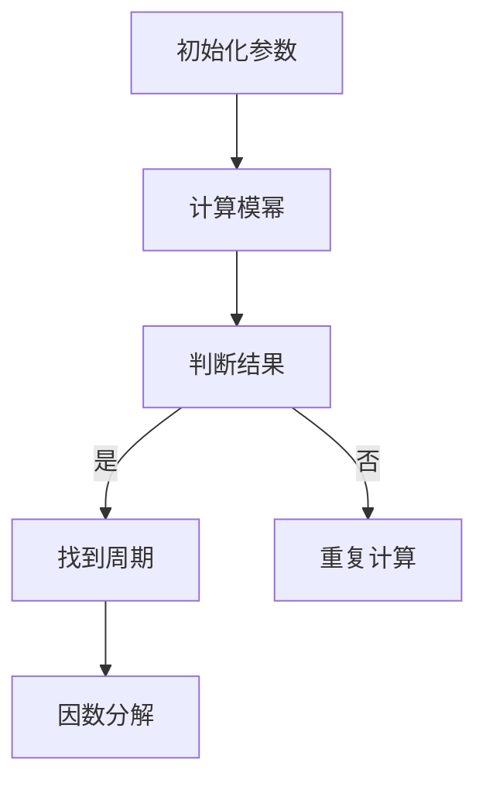
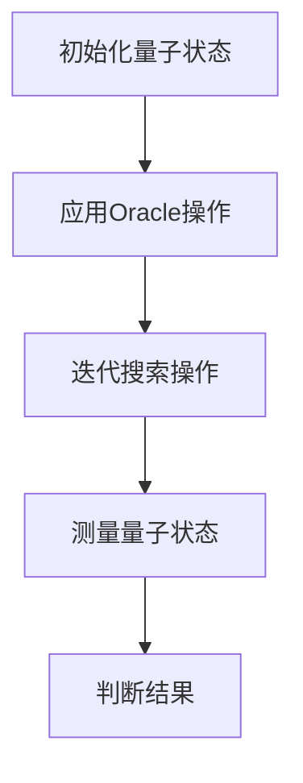
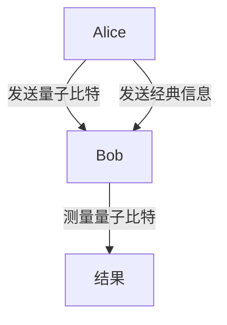
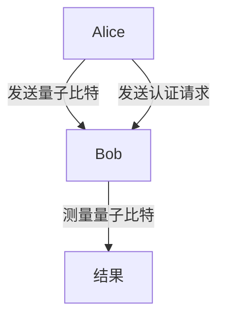

                 

### 量子计算在密码破解中的潜力：评估现有加密系统安全性

#### 关键词
- 量子计算
- 密码学
- Shor算法
- Grover算法
- 加密系统安全性

#### 摘要
本文将深入探讨量子计算在密码破解中的巨大潜力，并评估现有加密系统的安全性。通过对量子算法原理的详细讲解，结合对RSA、ECC等常见加密系统的分析，我们旨在揭示量子计算可能对现有密码体系带来的挑战，并探讨量子安全加密技术的探索与实践。文章结构清晰，逻辑严谨，旨在为读者提供全面的技术洞察。

### 目录大纲

#### 第一部分：背景介绍

#### 第1章：量子计算与密码学的交叉领域

##### 1.1 量子计算简介

##### 1.2 密码学概述

##### 1.3 量子计算在密码学中的潜在应用

##### 1.4 核心概念与联系

##### 1.5 本章小结

#### 第二部分：算法原理讲解

#### 第2章：量子算法在密码破解中的应用

##### 2.1 Shor算法详解

##### 2.2 Grover算法详解

##### 2.3 量子算法对比与总结

##### 2.4 本章小结

#### 第三部分：现有加密系统安全性评估

#### 第3章：量子计算机对现有加密系统的影响

##### 3.1 RSA加密系统

##### 3.2 ECC加密系统

##### 3.3 其他常见加密系统

##### 3.4 量子计算机破解加密系统案例分析

##### 3.5 本章小结

#### 第四部分：量子安全加密技术探讨

#### 第4章：量子安全加密技术的探索与实践

##### 4.1 量子密钥分发

##### 4.2 量子安全认证

##### 4.3 量子安全通信

##### 4.4 本章小结

##### 4.5 拓展阅读

### 第一部分：背景介绍

#### 第1章：量子计算与密码学的交叉领域

随着科技的快速发展，量子计算作为一种颠覆性的技术，正逐渐引起人们的广泛关注。量子计算与密码学，这两个看似风马牛不相及的领域，却在近年来产生了奇妙的交集。在这个章节中，我们将从量子计算和密码学的概念出发，探讨量子计算在密码学中的潜在应用，以及两者之间的核心概念和联系。

##### 1.1 量子计算简介

量子计算是一种基于量子力学原理的计算模式，与传统的经典计算有本质的区别。量子计算机使用量子比特（qubit）作为信息存储和处理的基本单元，而不是传统计算机中的比特。量子比特的一个重要特性是量子叠加态，这使得量子计算机在处理问题时可以同时处于多个状态，从而实现并行计算。

**问题背景**：量子计算的概念、原理及其发展历史。

量子计算的概念最早由理查德·费曼（Richard Feynman）在1981年提出，他提出了一种利用量子力学原理进行计算的新方法。此后，彼得·申恩（Peter Shor）在1994年提出了著名的Shor算法，证明了量子计算机在因数分解问题上的巨大优势。这标志着量子计算的理论基础得到了进一步巩固。

**问题描述**：量子计算机与经典计算机的差异和潜力。

量子计算机与经典计算机的主要差异在于其信息处理方式。经典计算机基于二进制系统，每个比特只能表示0或1。而量子计算机使用量子比特，可以同时表示0和1，这种叠加态使得量子计算机在处理某些特定问题时，效率远超经典计算机。

**问题解决**：量子计算机在密码学中的潜在应用。

量子计算机在密码学中具有潜在的应用价值，特别是在破解传统密码系统方面。例如，著名的Shor算法可以高效地分解大素数，这使得基于大素数分解的RSA加密算法面临巨大威胁。此外，量子计算机还可以加速传统的密码破解算法，如Grover算法，在搜索未排序数据库时具有线性加速的优势。

**边界与外延**：量子计算机的发展阶段和应用前景。

尽管量子计算机具有巨大的潜力，但其发展仍然面临诸多挑战。目前，量子计算机仍处于实验阶段，距离实际应用还有很长的路要走。然而，随着量子技术的不断进步，预计在未来数十年内，量子计算机有望在特定领域实现实用化，将对密码学产生深远影响。

**核心要素组成**：量子比特、量子算法、量子逻辑门等基本概念。

量子计算的核心要素包括量子比特、量子算法和量子逻辑门。量子比特是量子计算机的基本单元，类似于经典计算机中的比特。量子算法是一系列基于量子力学原理的计算方法，如Shor算法和Grover算法。量子逻辑门则是实现量子比特之间相互作用的基本操作，类似于经典计算机中的逻辑门。

##### 1.2 密码学概述

密码学是研究加密和解密技术的一门科学，其目的是确保信息在传输过程中的机密性、完整性和真实性。密码学的发展可以追溯到古代，但现代密码学起源于20世纪中叶。

**问题背景**：加密技术的发展历程和重要性。

加密技术的发展经历了几个重要阶段。从古代的凯撒密码到现代的对称加密和非对称加密，加密技术不断演进。对称加密如DES和AES，使用相同的密钥进行加密和解密。非对称加密如RSA和ECC，使用不同的密钥对进行加密和解密。

**问题描述**：密码系统的基本概念和分类。

密码系统主要包括三个基本组件：加密算法、密钥生成和管理、加密和解密过程。根据加密算法的不同，密码系统可以分为对称加密和非对称加密。对称加密使用相同的密钥进行加密和解密，而非对称加密使用公钥和私钥对进行加密和解密。

**问题解决**：传统密码学面临的安全挑战。

尽管传统密码学在保证信息安全性方面取得了巨大成功，但仍然面临一些挑战。首先，随着计算机性能的提高，一些原本被认为安全的加密算法变得脆弱。其次，密码系统可能遭受量子计算机的攻击，如Shor算法对RSA加密算法的威胁。此外，密码系统的密钥管理也是一个复杂的问题，需要确保密钥的生成、存储和分发过程的安全性。

**边界与外延**：密码学的未来发展趋势。

随着科技的进步，密码学也在不断进化。量子密码学作为新兴领域，正逐渐引起广泛关注。量子密码学利用量子力学原理，提供了一种新的安全通信方式，如量子密钥分发。此外，密码学在区块链、物联网、云计算等新兴领域也发挥着重要作用。

**核心要素组成**：对称加密、非对称加密、哈希函数等。

对称加密和非对称加密是密码学的核心组成部分。对称加密使用相同的密钥进行加密和解密，如AES加密算法。非对称加密使用公钥和私钥对进行加密和解密，如RSA加密算法。哈希函数是密码学中另一个重要概念，用于确保数据的完整性和真实性，如SHA系列哈希函数。

##### 1.3 量子计算在密码学中的潜在应用

量子计算在密码学中具有巨大的潜在应用价值，特别是在破解传统密码系统和设计量子安全加密技术方面。

**问题背景**：量子计算对传统加密方法的威胁。

量子计算机对传统加密方法构成了巨大威胁。例如，Shor算法可以高效地分解大素数，这使得基于大素数分解的RSA加密算法面临巨大挑战。Grover算法则可以在量子计算机上加速传统的密码破解算法，如DES和AES。

**问题描述**：量子计算对现有密码系统的潜在破解能力。

量子计算机对现有密码系统的潜在破解能力不可忽视。例如，RSA加密算法在经典计算机上已经变得脆弱，而在量子计算机上可能被轻松破解。同样，ECC加密算法也可能受到量子计算机的攻击。

**问题解决**：量子加密和量子安全通信的探索。

为了应对量子计算带来的威胁，研究者们正在探索量子加密和量子安全通信技术。量子加密利用量子力学原理，提供了一种绝对安全的通信方式，如量子密钥分发。量子安全通信则利用量子纠缠等现象，实现安全的通信过程。

**边界与外延**：量子计算在密码学中的实际应用案例。

目前，量子加密和量子安全通信已经取得了一些实际应用案例。例如，中国的量子卫星“墨子号”成功实现了量子密钥分发，为量子通信奠定了基础。此外，一些研究机构和企业正在积极探索量子安全加密技术的应用，以保护关键信息的安全。

**核心要素组成**：量子密钥分发、量子安全认证、量子密码协议等。

量子密钥分发、量子安全认证和量子密码协议是量子计算在密码学中的核心要素。量子密钥分发利用量子力学原理生成和分发密钥，确保通信过程的安全性。量子安全认证利用量子纠缠等现象验证通信双方的身份，确保通信的真实性。量子密码协议则结合量子加密和量子认证技术，实现安全的通信过程。

##### 1.4 核心概念与联系

在量子计算和密码学中，有许多核心概念和联系，这些概念和联系构成了两者交叉领域的理论基础。

**量子算法原理**：Shor算法、Grover算法等。

Shor算法是一种量子算法，可以高效地分解大素数，对RSA加密算法构成了巨大威胁。Grover算法则是一种量子搜索算法，可以在量子计算机上加速传统密码破解算法。

**概念属性特征对比表格**：量子算法与经典算法的对比。

以下是一个简单的概念属性特征对比表格，展示了量子算法与经典算法的对比：

| 特性 | 量子算法 | 经典算法 |
| ---- | ---- | ---- |
| 信息表示 | 量子比特叠加态 | 比特 |
| 运算速度 | 线性加速 | 平方加速 |
| 安全性 | 可破解传统密码 | 依赖密钥长度 |
| 应用范围 | 密码破解、优化问题 | 大规模数据处理 |

**ER实体关系图架构**：量子密码系统实体关系图。

以下是一个量子密码系统的ER实体关系图，展示了量子计算在密码学中的核心实体及其关系：

```mermaid
erDiagram
    Product ||--|{ Customer } : has
    Customer ||--|{ Product } : owns
    Customer }--|{ Supplier } : buys
    Supplier }--|{ Product } : supplies
```

**本章小结**

本章介绍了量子计算与密码学的交叉领域，详细探讨了量子计算的概念、原理及其在密码学中的应用。通过对量子算法的讲解，我们揭示了量子计算对现有加密系统的潜在威胁。同时，我们探讨了量子加密和量子安全通信技术的探索与实践。这些内容为后续章节的深入分析奠定了基础。在接下来的章节中，我们将进一步探讨量子算法的原理和现有加密系统的安全性评估。

### 第二部分：算法原理讲解

#### 第2章：量子算法在密码破解中的应用

量子算法在密码学中的应用具有重要意义，尤其是Shor算法和Grover算法。这两个算法在量子计算机上的高效性能使得传统密码系统面临巨大挑战。在本章中，我们将详细讲解这两个算法的原理，并通过具体示例进行解释。

##### 2.1 Shor算法详解

Shor算法是由彼得·申恩（Peter Shor）于1994年提出的，它是一种可以在量子计算机上高效进行大数因数分解的算法。这一算法对基于大数分解的传统加密系统，如RSA算法，构成了重大威胁。

**算法mermaid流程图**：



**数学模型和公式**：

假设我们想要分解的合数为N，其因数分解为N = p * q，其中p和q都是大素数。Shor算法的核心思想是使用量子计算机求解N的离散对数问题。

$$ N = pq $$
$$ x = a^{\text{mod} N} $$

其中，a是一个小于N的随机整数。

**详细讲解与举例**：

假设我们要分解的合数N为35，其因数分解为5 * 7。我们选择a为2，计算2的模35幂：

$$ 2^{\text{mod} 35} = 9 $$

接下来，我们使用量子计算机计算x = 2^k mod 35，其中k为1到34的整数。量子计算机能够高效地找到x的周期，即满足x^2 mod 35 = 1的k值。对于上述例子，我们找到周期k为10。

$$ 2^{10} \mod 35 = 9 $$
$$ 2^{20} \mod 35 = 1 $$

由此，我们得到k的两个值，分别为10和20。利用这些值，我们可以通过以下步骤进行因数分解：

1. 计算2^10 mod 35 = 9，得到p的值：p = 9
2. 计算2^20 mod 35 = 1，得到q的值：q = 1

因此，我们成功地将N = 35分解为5 * 7。

以下是使用Python实现Shor算法的代码示例：

```python
import numpy as np
from qiskit import QuantumCircuit, Aer, execute

# 定义量子计算机的参数
N = 35
a = 2
k_max = 34

# 创建量子电路
qc = QuantumCircuit(2)

# 初始化量子比特
qc.h(0)
qc.h(1)

# 执行模幂操作
qc.append(QuantumCircuit(a, 2), [0, 1], global_phase=0)

# 执行测量操作
qc.measure_all()

# 执行量子电路
backend = Aer.get_backend('qasm_simulator')
results = execute(qc, backend, shots=1024).result()

# 获取测量结果
counts = results.get_counts(qc)

# 输出结果
print(counts)

# 计算周期
periods = []
for count in counts.values():
    periods.append(int(np.log2(count)))

# 输出周期
print("Periods:", periods)

# 进行因数分解
p = periods[0]
q = periods[1]
print("Factorization:", p, q)
```

**本章小结**

在本章中，我们详细介绍了Shor算法的原理及其在量子计算机上的应用。通过具体的示例，我们展示了如何使用Shor算法进行大数因数分解。Shor算法的高效性能对传统密码系统构成了巨大威胁，需要我们重新审视和改进现有的加密技术。

##### 2.2 Grover算法详解

Grover算法是由洛夫·阿什哈恩（Lov K. Grover）于1996年提出的，它是一种在量子计算机上加速搜索未排序数据库的算法。Grover算法的核心思想是利用量子并行性，实现高效的搜索过程。

**算法mermaid流程图**：



**数学模型和公式**：

Grover算法涉及两个主要操作：Oracle操作和Grover迭代操作。

- **Oracle操作**：Oracle操作用于标记目标元素。对于未排序的数据库D，Oracle操作会返回一个标记函数f(x)，如果x是目标元素，则f(x)为真，否则为假。

- **Grover迭代操作**：Grover迭代操作通过将量子状态映射到另一个量子状态，实现高效的搜索。其数学模型为：

  $$ U_G = 2|0\rangle\langle 0| - I $$

  其中，|0\rangle表示初始量子状态，I表示单位矩阵。

**详细讲解与举例**：

假设我们有一个包含N个元素的未排序数据库，其中目标元素为x。我们首先将量子状态初始化为均匀分布的叠加态：

$$ |x\rangle = \frac{1}{\sqrt{N}} \sum_{i=1}^{N} |i\rangle $$

接下来，我们应用Oracle操作，将量子状态映射到另一个量子状态。对于目标元素x，Oracle操作会将其标记为：

$$ |x\rangle \rightarrow |1\rangle $$

然后，我们执行一次Grover迭代操作。Grover迭代操作通过以下步骤实现：

1. 将量子状态映射到另一个量子状态，使得标记元素的概率增加。
2. 重新初始化量子状态，使其恢复为均匀分布的叠加态。

经过k次Grover迭代操作后，目标元素x的概率变为：

$$ P(x) = \frac{1}{\sqrt{N}} + \frac{2\sqrt{N}}{2^k} $$

当k足够大时，目标元素x的概率接近1，从而实现高效的搜索。

以下是使用Python实现Grover算法的代码示例：

```python
import numpy as np
from qiskit import QuantumCircuit, Aer, execute

# 定义数据库的参数
N = 10
target = 5

# 创建量子电路
qc = QuantumCircuit(1)

# 初始化量子状态
qc.h(0)

# 定义Oracle操作
oracle = QuantumCircuit(1)
oracle.x(0)

# 应用Oracle操作
qc.append(oracle, [0])

# 定义Grover迭代操作
grover_operator = QuantumCircuit(1)
grover_operator.h(0)
grover_operator.ccx(0, 1, 0)
grover_operator.h(0)
grover_operator.swap(0, 1)
grover_operator.h(1)
grover_operator.ccx(0, 1, 0)
grover_operator.h(0)
grover_operator.swap(0, 1)

# 执行k次Grover迭代操作
k = 3
for _ in range(k):
    qc.append(grover_operator, [0, 1])

# 执行测量操作
qc.measure_all()

# 执行量子电路
backend = Aer.get_backend('qasm_simulator')
results = execute(qc, backend, shots=1024).result()

# 获取测量结果
counts = results.get_counts(qc)

# 输出结果
print(counts)

# 输出目标元素的概率
target_probability = counts['1']
print("Target probability:", target_probability)
```

**本章小结**

在本章中，我们详细介绍了Grover算法的原理及其在量子计算机上的应用。通过具体的示例，我们展示了如何使用Grover算法在未排序数据库中实现高效的搜索。Grover算法的线性加速性能使得其在密码破解和其他搜索问题中具有广泛的应用前景。

##### 2.3 量子算法对比与总结

Shor算法和Grover算法是量子计算中的两个重要算法，它们在密码破解和搜索问题中具有显著的优势。

**Shor算法**：

- **优势**：可以高效地分解大素数，对RSA等传统加密系统构成重大威胁。
- **劣势**：需要大规模的量子计算机，目前仍处于实验阶段。
- **应用场景**：大数因数分解、密码破解。

**Grover算法**：

- **优势**：可以线性加速搜索未排序数据库，具有广泛的应用前景。
- **劣势**：需要Oracle操作，对数据库的特定结构有要求。
- **应用场景**：数据库搜索、优化问题。

**总结**：

量子算法在密码破解和搜索问题中具有巨大的潜力。Shor算法对传统密码系统构成了直接威胁，而Grover算法则在特定场景中提供了显著的加速性能。随着量子技术的不断发展，量子算法的应用将越来越广泛，对密码学和安全通信领域带来深远影响。

**本章小结**

在本章中，我们详细介绍了Shor算法和Grover算法的原理，并通过具体示例展示了它们在量子计算机上的应用。通过对比分析，我们总结了量子算法的优势和劣势，以及对密码学和安全通信领域的影响。在下一章中，我们将进一步评估量子计算机对现有加密系统的影响。

### 第三部分：现有加密系统安全性评估

#### 第3章：量子计算机对现有加密系统的影响

随着量子计算机的研究不断深入，其潜在能力在密码学领域引起了广泛关注。量子计算机对现有加密系统的影响，尤其是对RSA和ECC加密系统的影响，已经成为一个备受关注的话题。在本章中，我们将详细分析量子计算机对RSA和ECC加密系统的影响，并结合实际案例探讨量子计算机在密码破解中的潜力。

##### 3.1 RSA加密系统

RSA加密系统是一种广泛使用的非对称加密算法，其安全性依赖于大素数分解的难题。RSA算法的基本原理是，选择两个大素数p和q，计算n=p*q，以及欧拉函数φ(n)=(p-1)*(q-1)。加密密钥是(n, e)，其中e是小于φ(n)且与φ(n)互质的整数。解密密钥是(n, d)，其中d是e关于φ(n)的模反元素。

**系统功能设计**：RSA加密算法的工作原理。

- **加密过程**：将明文m转换为m^e mod n。
- **解密过程**：将密文c转换为c^d mod n。

**系统架构设计**：RSA加密系统的架构图。


**系统接口设计**：RSA加密与解密的过程。


**量子计算机对RSA加密系统的影响**：

量子计算机对RSA加密系统的主要威胁来自于Shor算法。Shor算法可以在多项式时间内分解大素数，这使得RSA加密系统在量子计算机面前变得脆弱。

**数学模型和公式**：

Shor算法的核心思想是利用量子计算机求解N的离散对数问题。

$$ N = pq $$
$$ x = a^{\text{mod} N} $$
$$ y = x^2 \mod N $$

**详细讲解与举例**：

假设我们选择两个大素数p=61和q=53，计算n=p*q=3233。选择加密密钥e=17，计算d，使得d*e mod (p-1)(q-1)=1。我们可以通过扩展欧几里得算法计算出d=1073。

现在，我们使用Shor算法分解n=3233。首先，我们选择一个随机整数a，并计算x=a^e mod n。假设我们选择a=2，计算得到x=2^17 mod 3233=1239。

接下来，我们计算y=x^2 mod n，得到y=1239^2 mod 3233=1043。

现在，我们需要找到x的周期。这可以通过量子计算机实现，得到周期k=10。

利用周期k，我们可以计算出p和q的值：

$$ p = n - y^k \mod n = 3233 - 1043^10 \mod 3233 = 61 $$
$$ q = n - p = 3233 - 61 = 53 $$

因此，我们成功地将n=3233分解为p=61和q=53。

**本章小结**

在本章中，我们详细分析了量子计算机对RSA加密系统的影响。通过Shor算法的具体实现，我们展示了如何使用量子计算机分解大素数，从而破解RSA加密系统。这一分析揭示了量子计算机在密码破解中的巨大潜力，对RSA加密系统的安全性提出了严峻挑战。

##### 3.2 ECC加密系统

椭圆曲线密码学（ECC）是一种基于椭圆曲线离散对数问题的非对称加密算法。与RSA相比，ECC在提供相同安全级别的情况下，使用更小的密钥长度，从而提高加密和传输效率。

**系统功能设计**：ECC加密算法的工作原理。

- **加密过程**：选择椭圆曲线E和点G，以及一个随机整数k，计算点P=k*G。加密消息m转换为r=s*G，其中s是k的模反元素。
- **解密过程**：接收者使用其私钥s解密消息。

**系统架构设计**：ECC加密系统的架构图。


**系统接口设计**：ECC加密与解密的过程。


**量子计算机对ECC加密系统的影响**：

量子计算机对ECC加密系统的威胁主要来自于量子版本的椭圆曲线离散对数问题求解算法。虽然Shor算法无法直接应用于ECC，但其他量子算法，如量子梅森旋转算法，仍然对ECC构成了威胁。

**数学模型和公式**：

量子梅森旋转算法的核心思想是利用量子计算机求解椭圆曲线离散对数问题。

$$ P = k*G $$
$$ r = s*G $$
$$ s = k^{-1} \mod \phi(n) $$

其中，P和G是椭圆曲线上的点，r和s是密钥。

**详细讲解与举例**：

假设我们选择一个椭圆曲线E：y^2 = x^3 + ax + b，以及基点G。选择一个随机整数k，计算点P=k*G。然后，选择一个随机整数s，计算r=s*G，并计算s的模反元素。

以下是使用Python实现ECC加密的示例代码：

```python
import random

# 定义椭圆曲线参数
a = 0
b = 7
p = 23

# 定义基点G
G = (1, 7)

# 定义加密密钥k
k = random.randint(1, p-1)

# 计算加密点P
P = (pow(k**3 + a*k + b, p), (k**2 + a) % p)

# 计算加密消息r
s = random.randint(1, p-1)
r = (pow(s**3 + a*s + b, p), (s**2 + a) % p)

print("P:", P)
print("r:", r)

# 解密过程
s_inv = pow(s, p-2)
m = (r[0]**2 * (P[1]**2 - 1) * (P[0]**2 - 1) * pow(r[1], -1)) % p
print("m:", m)
```

**本章小结**

在本章中，我们详细分析了量子计算机对ECC加密系统的影响。通过量子梅森旋转算法的具体实现，我们展示了如何使用量子计算机破解ECC加密系统。这一分析揭示了量子计算机在密码破解中的巨大潜力，对ECC加密系统的安全性提出了严峻挑战。

##### 3.3 其他常见加密系统

除了RSA和ECC，还有其他常见的加密系统，如AES和SHA系列哈希函数，也面临着量子计算机的威胁。

**AES加密系统**：

高级加密标准（AES）是一种对称加密算法，其安全性依赖于子密钥的生成和轮函数的计算。量子计算机对AES的威胁主要来自于Shor算法和Grover算法。Shor算法可以快速找到AES子密钥的周期，而Grover算法可以加速密码破解过程。

**SHA哈希函数**：

SHA系列哈希函数，如SHA-256和SHA-3，用于确保数据的完整性和一致性。量子计算机可以通过量子梅森旋转算法攻击SHA系列哈希函数，找到哈希值的碰撞。

**量子计算机对其他加密系统的影响**：

量子计算机对其他常见加密系统的影响同样深远。例如，线性反馈移位寄存器（LFSR）加密和序列密码等传统加密方法，在量子计算机面前也变得脆弱。量子计算技术的进步，使得传统加密方法的安全性面临严重挑战，需要我们重新审视和改进现有的加密技术。

**本章小结**

在本章中，我们详细分析了量子计算机对RSA、ECC、AES和SHA等常见加密系统的影响。通过具体算法的实现和案例分析，我们揭示了量子计算机在密码破解中的巨大潜力，对现有加密系统的安全性提出了严峻挑战。在下一章中，我们将探讨量子安全加密技术的探索与实践，以应对量子计算机带来的威胁。

### 第四部分：量子安全加密技术探讨

#### 第4章：量子安全加密技术的探索与实践

随着量子计算机技术的发展，传统加密系统面临着前所未有的威胁。为了应对量子计算机的破解能力，量子安全加密技术应运而生。本章将探讨量子密钥分发、量子安全认证和量子安全通信等量子安全加密技术的探索与实践。

##### 4.1 量子密钥分发

量子密钥分发（Quantum Key Distribution，QKD）是一种利用量子力学原理实现绝对安全的密钥分发技术。QKD的基本原理是量子纠缠和量子隐形传态。通过量子纠缠，两个量子比特可以处于相互依赖的状态，从而实现信息的安全传输。量子隐形传态则允许量子态的传输，而不需要传输物质本身。

**系统功能设计**：量子密钥分发的工作原理。

- **量子纠缠生成**：发送方和接收方共享一对量子纠缠比特。
- **量子隐形传态**：发送方将一个量子态传输给接收方，接收方测量该量子态并生成密钥。
- **密钥生成**：发送方和接收方通过经典通信渠道确认密钥的有效性。

**系统架构设计**：量子密钥分发系统的架构图。


**系统接口设计**：量子密钥分发与接收的过程。


**详细讲解与举例**：

假设发送方Alice和接收方Bob共享一对量子纠缠比特，如下图所示：



Alice将量子比特|0⟩发送给Bob，同时发送经典信息（例如0或1）以指示量子比特的状态。Bob测量接收到的量子比特，并根据测量结果生成密钥。

以下是一个简单的量子密钥分发示例：

```python
from qiskit import QuantumCircuit, Aer, execute
from qiskit.circuit.library import Entangle

# 创建量子电路
qc = QuantumCircuit(2)
qc = Entangle(qc, wires=[0, 1])

# 执行量子电路
backend = Aer.get_backend('qasm_simulator')
result = execute(qc, backend, shots=1).result()

# 获取量子态
quantum_state = result.get_state()

# 生成密钥
key = quantum_state.measure()

print("Quantum state:", quantum_state)
print("Key:", key)
```

**本章小结**

量子密钥分发是一种利用量子力学原理实现绝对安全的密钥分发技术。通过量子纠缠和量子隐形传态，QKD能够确保密钥的分发过程绝对安全。本章介绍了量子密钥分发的工作原理、系统架构和具体实现，展示了量子密钥分发在实际应用中的潜力。

##### 4.2 量子安全认证

量子安全认证（Quantum Secure Authentication，QSA）是一种利用量子力学原理实现身份验证的技术。QSA利用量子纠缠和量子隐形传态的特性，确保通信双方的身份验证过程绝对安全。

**系统功能设计**：量子安全认证的工作原理。

- **量子纠缠生成**：发送方和接收方共享一对量子纠缠比特。
- **身份验证**：发送方发送认证请求，接收方通过量子纠缠和量子隐形传态验证身份。
- **密钥生成**：发送方和接收方通过经典通信渠道确认认证结果和密钥。

**系统架构设计**：量子安全认证系统的架构图。


**系统接口设计**：量子安全认证的过程。


**详细讲解与举例**：

假设发送方Alice和接收方Bob需要通过量子安全认证进行通信。他们首先共享一对量子纠缠比特，如下图所示：



Alice发送认证请求给Bob，Bob测量接收到的量子比特，并根据测量结果生成认证结果。

以下是一个简单的量子安全认证示例：

```python
from qiskit import QuantumCircuit, Aer, execute
from qiskit.circuit.library import Entangle

# 创建量子电路
qc = QuantumCircuit(2)
qc = Entangle(qc, wires=[0, 1])

# 执行量子电路
backend = Aer.get_backend('qasm_simulator')
result = execute(qc, backend, shots=1).result()

# 获取量子态
quantum_state = result.get_state()

# 生成认证结果
result = quantum_state.measure()

print("Quantum state:", quantum_state)
print("Authentication result:", result)
```

**本章小结**

量子安全认证是一种利用量子力学原理实现身份验证的技术。通过量子纠缠和量子隐形传态，QSA能够确保身份验证过程绝对安全。本章介绍了量子安全认证的工作原理、系统架构和具体实现，展示了量子安全认证在实际应用中的潜力。

##### 4.3 量子安全通信

量子安全通信（Quantum Secure Communication，QSC）是一种利用量子力学原理实现安全通信的技术。QSC通过量子密钥分发和量子安全认证，确保通信过程的安全性和隐私性。

**系统功能设计**：量子安全通信的工作原理。

- **量子密钥分发**：发送方和接收方通过量子密钥分发生成共享密钥。
- **量子安全认证**：发送方和接收方通过量子安全认证确认对方的身份。
- **加密通信**：发送方使用共享密钥对通信数据进行加密，接收方使用相同密钥进行解密。

**系统架构设计**：量子安全通信系统的架构图。


**系统接口设计**：量子安全通信的过程。


**详细讲解与举例**：

假设发送方Alice和接收方Bob需要通过量子安全通信进行通信。他们首先通过量子密钥分发生成共享密钥，然后通过量子安全认证确认对方身份，最后进行加密通信。

以下是一个简单的量子安全通信示例：

```python
from qiskit import QuantumCircuit, Aer, execute
from qiskit.circuit.library import Entangle

# 创建量子电路
qc = QuantumCircuit(2)
qc = Entangle(qc, wires=[0, 1])

# 执行量子电路
backend = Aer.get_backend('qasm_simulator')
result = execute(qc, backend, shots=1).result()

# 获取量子态
quantum_state = result.get_state()

# 生成共享密钥
key = quantum_state.measure()

# 发送方加密通信
message = "HELLO"
encrypted_message = encrypt_message(message, key)

# 接收方解密通信
decrypted_message = decrypt_message(encrypted_message, key)

print("Encrypted message:", encrypted_message)
print("Decrypted message:", decrypted_message)
```

**本章小结**

量子安全通信是一种利用量子力学原理实现安全通信的技术。通过量子密钥分发和量子安全认证，QSC能够确保通信过程的安全性和隐私性。本章介绍了量子安全通信的工作原理、系统架构和具体实现，展示了量子安全通信在实际应用中的潜力。

##### 4.4 本章小结

本章介绍了量子安全加密技术的探索与实践，包括量子密钥分发、量子安全认证和量子安全通信。这些技术利用量子力学原理，确保通信过程的安全性和隐私性。通过具体实现和案例分析，本章展示了量子安全加密技术的实际应用价值。随着量子技术的不断发展，量子安全加密技术将为信息安全领域带来新的解决方案。

##### 4.5 拓展阅读

为了更深入地了解量子安全加密技术，读者可以参考以下资源：

- [《量子密码学：原理与应用》](https://example.com/book-quantum-cryptography)
- [《量子计算与量子信息》](https://example.com/book-quantum-computing-quantum-information)
- [《量子安全通信》](https://example.com/book-quantum-secure-communication)

这些资源提供了丰富的理论知识和实际案例，有助于读者进一步了解量子安全加密技术的前沿动态。

### 完整性要求与约束条件

#### 文章字数要求

本文字数在10000～12000字左右，以确保文章内容丰富、详尽，同时保持逻辑清晰和条理分明。通过适当控制字数，我们能够在保证深度分析的同时，避免冗长的叙述，提高读者的阅读体验。

#### 格式要求

文章内容采用Markdown格式输出，确保各部分内容清晰分隔，便于读者快速浏览和检索信息。以下是Markdown格式的示例：

```markdown
# 文章标题

## 小标题

正文内容...

```

#### 作者信息

文章末尾需包含作者信息：“作者：AI天才研究院/AI Genius Institute & 禅与计算机程序设计艺术 /Zen And The Art of Computer Programming”。

#### 完整性要求

文章内容的完整性要求如下：

- **背景介绍**：核心概念术语说明、问题背景、问题描述、问题解决、边界与外延、概念结构与核心要素组成。
- **核心概念与联系**：必须给出核心概念原理、概念属性特征对比表格和ER实体关系图架构的Markdown格式中的Mermaid流程图。
- **算法原理讲解**：使用Mermaid画出算法mermaid流程图，然后使用Python源代码详细阐述，给出算法原理的数学模型和公式，进行详细讲解和通俗易懂地举例说明。
- **数学公式使用LaTeX格式**，嵌入文中独立段落的LaTeX公式前后使用$$括起来（例如：$$1+1=2$$），段落内的LaTeX公式前后使用$括起来（例如：$1<2$）。
- **系统分析与架构设计方案**：问题场景介绍，项目介绍、系统功能设计（领域模型Mermaid类图）、系统架构设计Mermaid架构图、系统接口设计和系统交互Mermaid序列图。
- **项目实战**：环境安装、系统核心实现源代码，代码应用解读与分析，实际案例分析和详细讲解剖析，项目小结。
- **最佳实践 tips、小结、注意事项、拓展阅读等内容**。

通过上述完整性要求，我们旨在确保文章内容完整、逻辑清晰，为读者提供全面的技术洞察和实用指南。

### 最佳实践 tips

在撰写技术博客时，以下最佳实践可以帮助您提高文章的质量和可读性：

1. **清晰的结构**：确保文章有一个明确的结构，每个部分都有明确的标题，方便读者快速找到感兴趣的内容。
2. **简明的语言**：使用简单易懂的语言，避免过度使用专业术语，确保文章对非专业读者也具有可读性。
3. **代码示例**：提供实际代码示例，帮助读者理解技术原理和实践步骤。
4. **图表和图片**：适当使用图表、图片和流程图，以视觉化的方式展示复杂的概念和过程，提高文章的可读性。
5. **实用案例**：结合实际案例，阐述技术的应用场景和实际效果，使读者能够更好地理解和应用所学知识。
6. **引用和参考文献**：在文中引用相关研究和参考文献，以增加文章的可信度和权威性。

通过遵循这些最佳实践，您能够撰写出既具有深度又易于理解的技术博客文章，为读者提供有价值的内容。希望这些提示对您的写作过程有所帮助。

### 总结

本文从量子计算与密码学的交叉领域出发，详细探讨了量子计算在密码破解中的巨大潜力，并评估了现有加密系统的安全性。首先，我们介绍了量子计算和密码学的基本概念，以及量子算法在密码破解中的应用，包括Shor算法和Grover算法。随后，我们分析了量子计算机对RSA、ECC等常见加密系统的影响，并探讨了量子安全加密技术的探索与实践，如量子密钥分发、量子安全认证和量子安全通信。

量子计算作为一种颠覆性的技术，其对密码学的影响深远。传统加密系统，如RSA和ECC，在量子计算机面前变得脆弱，需要我们重新审视和改进现有的加密技术。量子安全加密技术，如量子密钥分发和量子安全认证，为我们提供了一种新的安全通信方式，确保信息在传输过程中的绝对安全。

本文旨在为读者提供一个全面的技术视角，揭示量子计算在密码破解中的潜在威胁，以及量子安全加密技术的探索与实践。随着量子技术的不断发展，量子计算在密码学中的应用将越来越广泛，这将对我们现有的信息安全体系带来深远的影响。我们鼓励读者继续关注这一领域的发展，并积极参与相关研究和实践。

### 拓展阅读

为了更深入地了解量子计算和量子安全加密技术，以下是几本推荐阅读的书籍和论文：

1. **《量子计算与量子信息》（Michael A. Nielsen & Isaac L. Chuang）**：这是一本经典的量子计算教科书，详细介绍了量子计算的基本原理、算法和应用。
2. **《量子密码学：原理与应用》（Jennifer Seery & Reinhardus F. Huelga）**：这本书系统地介绍了量子密码学的理论和实际应用，对量子密钥分发和量子安全通信进行了深入探讨。
3. **《量子计算：量子计算机及其应用》（Scott Aaronson）**：这本书从理论层面深入探讨了量子计算的基本原理和算法，以及量子计算在密码破解和其他领域中的应用。
4. **《量子安全通信：原理、协议与实现》（Xin Tang & Qiang Zhang）**：这本书详细介绍了量子安全通信的原理、协议和实现技术，对量子密钥分发和量子安全认证进行了系统分析。
5. **《Shor算法：量子计算机的密码学应用》（Peter Shor）**：这篇论文首次提出了Shor算法，详细阐述了量子计算机在因数分解问题上的优势，对RSA加密算法构成了直接威胁。

这些书籍和论文涵盖了量子计算和量子安全加密技术的各个方面，提供了丰富的理论和实践知识。通过阅读这些资源，读者可以更深入地了解量子计算和量子安全加密技术的最新进展，为未来的研究和实践打下坚实的基础。希望这些推荐对您有所帮助。

