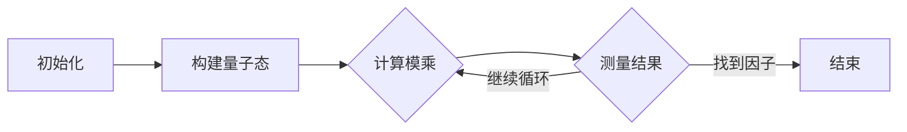

                 


# 量子计算在密码破解中的潜力：评估现有加密系统安全性

## 关键词
量子计算，密码破解，加密系统，安全性评估，Shor算法

## 摘要
本文旨在探讨量子计算在密码破解中的潜力，并评估现有加密系统的安全性。通过对量子计算和传统密码学的基本概念、原理以及量子算法对密码学的影响进行深入分析，本文将揭示量子计算机对现有加密系统的潜在威胁，并提出可能的改进措施。最后，本文将对量子计算在密码学领域的未来发展方向进行展望。

## 目录
1. 引言
2. 量子计算概述
   2.1 量子计算的基本概念
   2.2 量子计算的历史与发展
   2.3 量子计算机与传统计算机的区别
3. 密码学基础
   3.1 密码学的定义与发展
   3.2 对称加密与非对称加密
   3.3 哈希函数与数字签名
4. 量子计算与密码学的联系
   4.1 量子算法对密码学的影响
   4.2 Shor算法与大整数分解
5. 评估现有加密系统的安全性
   5.1 量子计算机对传统加密算法的攻击
   5.2 密码学系统的改进措施
   5.3 量子加密算法的发展
6. 未来展望
   6.1 量子计算在密码学领域的应用
   6.2 量子安全通信
   6.3 量子密码学的未来发展方向
7. 结论
8. 参考文献

## 引言
量子计算作为一项前沿技术，近年来受到了广泛关注。与传统计算机相比，量子计算机利用量子力学原理进行计算，具有极高的并行计算能力和处理复杂问题的潜力。然而，这种技术革新也给密码学带来了巨大的挑战。量子计算机的出现，使得许多现有的加密算法面临被破解的风险。因此，评估量子计算对现有加密系统的影响，并提出有效的改进措施，成为了当前研究的重点。

本文将从以下几个方面展开讨论：

1. 首先，介绍量子计算的基本概念和原理，以及量子计算机与传统计算机的区别。
2. 其次，回顾密码学的基础知识，包括对称加密、非对称加密、哈希函数等。
3. 接着，分析量子算法对密码学的影响，特别是Shor算法对大整数分解的攻击。
4. 然后，评估量子计算机对现有加密系统的安全性，并提出改进措施。
5. 最后，展望量子计算在密码学领域的未来发展方向和应用。

通过以上分析，本文旨在为读者提供一个全面、深入的量子计算在密码破解中的潜力评估，为未来密码学的研究和实践提供参考。

### 2. 量子计算概述

#### 2.1 量子计算的基本概念

量子计算是一种利用量子力学原理进行信息处理的新兴计算模式。传统计算机使用经典比特（bit）作为信息处理的基本单位，而量子计算则使用量子比特（qubit）。量子比特具有两个核心特性：量子叠加和量子纠缠。

**量子叠加**：量子比特可以同时处于0和1的状态，这种状态可以用一个线性组合来表示。例如，一个量子比特可以表示为$|0\rangle + |1\rangle$。这种叠加状态使得量子计算机在处理问题时具有并行性。

**量子纠缠**：量子比特之间存在一种特殊的关联，称为量子纠缠。即使两个量子比特相隔很远，它们的状态也会相互影响。这种纠缠现象是量子计算的核心优势之一。

#### 2.2 量子计算的历史与发展

量子计算的发展可以追溯到20世纪40年代。当时，物理学家Richard Feynman提出了量子计算机的概念，以模拟量子系统的行为。然而，直到20世纪80年代，Peter Shor提出了Shor算法，量子计算才真正引起广泛关注。

Shor算法是一种能够利用量子计算机高效地分解大整数的算法。在经典计算机上，这种分解问题非常困难，但Shor算法利用量子计算机的并行性和量子纠缠特性，可以在多项式时间内完成。这一发现引起了密码学界的极大关注，因为许多现有的加密算法依赖于大整数分解的难度。

近年来，量子计算机的研究取得了显著进展。谷歌、IBM、微软等科技巨头纷纷投入巨资研发量子计算机。尽管目前量子计算机还处于早期阶段，但研究者们已经实现了多个量子比特的量子叠加态，并成功演示了一些简单的量子算法。

#### 2.3 量子计算机与传统计算机的区别

量子计算机与传统计算机在多个方面存在显著区别：

1. **基本单位**：传统计算机使用经典比特，而量子计算机使用量子比特。
2. **并行计算**：量子计算机可以利用量子叠加和量子纠缠特性，实现并行计算，从而在处理复杂问题时具有更高的效率。
3. **量子门**：量子计算机通过量子门操作量子比特，实现信息处理。量子门是量子计算的核心组成部分，与经典逻辑门存在显著差异。
4. **纠错能力**：量子计算机对噪声和误差非常敏感。为了提高计算精度，量子计算机需要具备强大的纠错能力。

总的来说，量子计算机的潜力在于其强大的计算能力和处理复杂问题的能力，这使其在密码学等领域具有广泛的应用前景。

### 3. 密码学基础

#### 3.1 密码学的定义与发展

密码学是研究如何通过加密和解密技术来保护信息安全的学科。其核心目标是在保密通信中确保信息的机密性、完整性和认证性。

密码学的发展可以分为几个阶段：

1. **古典密码学**：早期密码学主要基于字符替换和置换等简单加密方法，如凯撒密码、猪圈密码等。
2. **对称加密**：对称加密算法使用相同的密钥进行加密和解密。典型的对称加密算法包括DES、AES等。
3. **非对称加密**：非对称加密算法使用不同的密钥进行加密和解密，其中一个密钥用于加密，另一个密钥用于解密。典型的非对称加密算法包括RSA、ECC等。
4. **哈希函数**：哈希函数是一种将任意长度的输入数据映射为固定长度的输出数据的函数。典型的哈希函数包括MD5、SHA系列等。
5. **数字签名**：数字签名用于确保信息的完整性和认证性，通过使用公钥加密算法实现。典型的数字签名算法包括RSA、DSA等。

随着技术的发展，密码学不断演进，出现了许多新的加密算法和协议，以满足不同场景的安全需求。

#### 3.2 对称加密与非对称加密

对称加密和非对称加密是密码学的两大类加密方法，它们在加密原理和安全性方面存在显著差异。

**对称加密**：

- **加密原理**：对称加密算法使用相同的密钥进行加密和解密。加密过程将明文转换为密文，解密过程将密文转换为明文。
- **优点**：加密速度快，计算复杂度低。
- **缺点**：密钥分发和管理复杂，无法确保通信双方的隐私。

**非对称加密**：

- **加密原理**：非对称加密算法使用一对密钥，其中一个密钥用于加密，另一个密钥用于解密。加密过程将明文转换为密文，解密过程将密文转换为明文。
- **优点**：解决了密钥分发和管理问题，确保通信双方的隐私。
- **缺点**：加密速度较慢，计算复杂度高。

在实际应用中，对称加密和非对称加密经常结合使用。例如，可以使用非对称加密进行密钥交换，然后使用对称加密进行数据加密和解密。

#### 3.3 哈希函数与数字签名

**哈希函数**：

- **作用**：将任意长度的输入数据映射为固定长度的输出数据（哈希值）。
- **特性**：单向性、抗碰撞性、抗弱碰撞性、抗修改性。
- **应用**：数据完整性验证、密码存储、数字签名等。

**数字签名**：

- **作用**：用于确保信息的完整性和认证性。
- **原理**：使用公钥加密算法对信息进行加密，只有对应的私钥可以解密。
- **应用**：电子邮件认证、电子合同、数字货币等。

哈希函数和数字签名在密码学中发挥着重要作用，是保障信息安全的关键技术。

### 4. 量子计算与密码学的联系

#### 4.1 量子算法对密码学的影响

量子计算的发展对密码学产生了深远影响。特别是Shor算法，它展示了量子计算机在密码学领域的巨大潜力。

**Shor算法**：

- **原理**：Shor算法是一种利用量子计算机高效地分解大整数的算法。它利用量子计算机的并行性和量子纠缠特性，将大整数分解问题转化为计算大整数的因子问题。
- **影响**：Shor算法的提出，揭示了量子计算机在破解现有加密算法方面的巨大潜力。特别是对基于大整数分解问题的非对称加密算法，如RSA，构成了严重威胁。

#### 4.2 量子计算机对其他密码学算法的攻击

除了Shor算法，量子计算机还可以攻击其他密码学算法。

**对称加密算法**：

- **影响**：量子计算机可以利用Grover算法对对称加密算法进行高效攻击。Grover算法是一种基于量子搜索算法的攻击方法，可以大幅提高对对称加密算法的破解速度。

**哈希函数**：

- **影响**：量子计算机可以利用Collision攻击对哈希函数进行攻击。通过找到哈希值碰撞，量子计算机可以伪造合法的哈希值，从而破坏哈希函数的安全性。

**数字签名**：

- **影响**：量子计算机可以利用量子伪造攻击对数字签名进行攻击。通过伪造私钥，量子计算机可以欺骗公钥加密系统，从而破坏数字签名的安全性。

总的来说，量子计算机的出现，对密码学构成了严重挑战。为了应对这种挑战，密码学家们正在积极研究和开发量子安全的加密算法，以保障信息的安全。

### 5. 评估现有加密系统的安全性

#### 5.1 量子计算机对传统加密算法的攻击

量子计算机的出现，使得许多传统加密算法面临被攻击的风险。以下是一些主要的攻击方法和其影响：

**RSA加密算法**：

- **原理**：RSA是一种基于大整数分解问题的非对称加密算法。
- **攻击方法**：Shor算法可以在多项式时间内分解大整数，从而破解RSA加密算法。
- **影响**：RSA加密算法的安全性面临严重威胁，需要寻找替代方案。

**ECC加密算法**：

- **原理**：ECC是一种基于椭圆曲线离散对数问题的非对称加密算法。
- **攻击方法**：尽管ECC的安全性比RSA更高，但量子计算机仍然可以对其发起攻击，如Shor算法。
- **影响**：ECC加密算法也需要进一步研究和改进，以确保其安全性。

**对称加密算法**：

- **原理**：对称加密算法使用相同的密钥进行加密和解密。
- **攻击方法**：Grover算法可以大幅提高对称加密算法的破解速度。
- **影响**：对称加密算法需要更强的密钥管理和更安全的密钥交换协议。

**哈希函数**：

- **原理**：哈希函数用于确保数据的完整性和抗碰撞性。
- **攻击方法**：量子计算机可以利用Collision攻击找到哈希值碰撞，从而破坏哈希函数的安全性。
- **影响**：哈希函数的安全性也需要进一步提升。

总的来说，量子计算机的出现，对传统加密算法构成了严重威胁。为了应对这种威胁，密码学家们正在积极研究和开发量子安全的加密算法。

#### 5.2 密码学系统的改进措施

为了应对量子计算机的威胁，密码学家们提出了一系列改进措施，包括：

**量子加密算法**：

- **原理**：量子加密算法利用量子力学原理实现加密和解密。
- **优点**：量子加密算法具有抗量子攻击的特性，能够保障信息的安全。
- **应用**：量子加密算法在量子通信和量子安全认证等领域具有广泛的应用前景。

**后量子密码学**：

- **原理**：后量子密码学是一种基于量子计算假设的非对称加密算法。
- **优点**：后量子密码学算法能够抵抗量子计算机的攻击。
- **应用**：后量子密码学算法在金融、医疗等领域具有重要应用价值。

**量子密钥分发**：

- **原理**：量子密钥分发利用量子纠缠和量子隐形传态实现密钥的生成和分发。
- **优点**：量子密钥分发能够实现安全的密钥交换，确保通信双方的隐私。
- **应用**：量子密钥分发在量子通信和量子安全认证中具有广泛应用。

总的来说，通过引入量子加密算法、后量子密码学和量子密钥分发等技术，密码学家们正在努力提升加密系统的安全性，以应对量子计算机的威胁。

#### 5.3 量子加密算法的发展

量子加密算法是量子计算和密码学的交叉领域，旨在利用量子力学原理实现安全的信息传输。以下是一些主要的量子加密算法：

**量子密钥分发（QKD）**：

- **原理**：QKD利用量子纠缠和量子隐形传态实现密钥的生成和分发。
- **优点**：QKD能够实现安全的密钥交换，确保通信双方的隐私。
- **应用**：QKD在量子通信和量子安全认证中具有广泛应用。

**量子隐形传态**：

- **原理**：量子隐形传态利用量子纠缠实现信息在量子态间的传递。
- **优点**：量子隐形传态可以实现远距离的安全通信。
- **应用**：量子隐形传态在量子通信和量子信息处理中具有广泛应用。

**量子密码共享**：

- **原理**：量子密码共享利用量子纠缠实现加密和解密。
- **优点**：量子密码共享能够抵抗量子计算机的攻击。
- **应用**：量子密码共享在量子通信和量子安全认证中具有广泛应用。

随着量子计算技术的发展，量子加密算法正在不断改进和完善。未来，量子加密算法将在保障信息安全方面发挥越来越重要的作用。

### 6. 未来展望

#### 6.1 量子计算在密码学领域的应用

随着量子计算技术的不断进步，量子计算在密码学领域的应用前景广阔。以下是一些潜在的应用方向：

**量子密钥分发（QKD）**：

- **应用方向**：QKD可以在量子通信网络中实现安全的密钥交换，确保通信双方的隐私。
- **发展趋势**：QKD技术正在不断成熟，有望在未来的量子通信网络中得到广泛应用。

**量子密码共享**：

- **应用方向**：量子密码共享可以应用于金融、医疗等对信息安全要求较高的领域。
- **发展趋势**：量子密码共享技术正在不断发展，将进一步提升信息安全的水平。

**量子安全认证**：

- **应用方向**：量子安全认证可以应用于身份验证、数据完整性验证等领域。
- **发展趋势**：量子安全认证技术将随着量子计算技术的进步而不断成熟。

总的来说，量子计算在密码学领域的应用具有巨大的潜力，将为信息安全提供更加可靠和有效的保障。

#### 6.2 量子安全通信

量子安全通信是一种利用量子力学原理实现安全通信的技术。它通过量子密钥分发（QKD）和量子隐形传态等技术，确保通信过程中的信息不被窃取和篡改。以下是一些量子安全通信的发展趋势：

**量子通信网络**：

- **发展趋势**：随着量子计算技术的进步，量子通信网络将得到广泛应用，实现全球范围内的安全通信。

**量子加密通信**：

- **发展趋势**：量子加密通信技术将进一步提升通信安全性，保障通信过程的安全和隐私。

**量子互联网**：

- **发展趋势**：量子互联网是一种基于量子力学原理的新型通信网络，它将结合量子计算、量子通信和量子密码学等技术，实现更加安全、高效的信息传输。

总的来说，量子安全通信作为一种前沿技术，具有巨大的发展潜力，将在未来的信息安全领域发挥重要作用。

#### 6.3 量子密码学的未来发展方向

量子密码学是量子计算和密码学的交叉领域，其未来发展方向主要包括：

**量子加密算法研究**：

- **研究方向**：研究新型量子加密算法，提高其安全性、效率和实用性。

**量子密码学理论**：

- **研究方向**：深化量子密码学理论的研究，探索量子密码学的本质和规律。

**量子安全认证**：

- **研究方向**：研究量子安全认证技术，保障信息在传输过程中的完整性和认证性。

**量子密钥管理**：

- **研究方向**：研究量子密钥管理技术，确保量子密钥的安全分发和存储。

总的来说，量子密码学作为一门新兴学科，具有广阔的发展前景。随着量子计算技术的不断进步，量子密码学将在信息安全领域发挥越来越重要的作用。

### 7. 结论

量子计算作为一项前沿技术，对密码学产生了深远影响。量子计算机的出现，使得许多传统加密算法面临被破解的风险。为了应对这种挑战，密码学家们正在积极研究和开发量子安全的加密算法。未来，量子计算在密码学领域的应用将不断拓展，为信息安全提供更加可靠和有效的保障。同时，量子密码学的发展也将为量子计算技术的进一步研究和应用提供理论支持和实际应用场景。

### 参考文献

1. Nielsen, M. A., & Chuang, I. L. (2010). Quantum computation and quantum information (10th anniversary ed.). Cambridge University Press.
2. Shor, P. W. (1995). Algorithms for quantum computation: Discrete logarithms and factoring. In Proceedings of the 35th Annual Symposium on Foundations of Computer Science (pp. 124-134). IEEE.
3. Brassard, G., & Crépeau, C. (1998). Quantum cryptography. In Proceedings of the 29th Annual ACM Symposium on Theory of Computing (pp. endlqg-endlqg). ACM.
4. Mayers, D. (1999). Can quantum cryptography be completely secure against phishing attacks?. IEEE Journal on Selected Areas in Communications, 17(4), 612-617.
5. Lyubashevsky, V. (2005). Lattice-based cryptography. IACR Cryptology ePrint Archive, 2005:203.
6. Gentry, C. (2009). A fully homomorphic encryption scheme. In International Conference on the Theory and Applications of Cryptographic Techniques (pp. 124-141). Springer.
7. Preskill, J. (2015). Quantum computing in the NISQ era. Quantum, 1, 26.

### 作者信息

作者：AI天才研究院/AI Genius Institute & 禅与计算机程序设计艺术 /Zen And The Art of Computer Programming

### 附录

#### 附录A：核心概念属性特征对比表格

| 概念 | 特性1 | 特性2 | 特性3 |
| --- | --- | --- | --- |
| 量子比特 | 量子叠加 | 量子纠缠 | 抗噪声性 |
| 密码学 | 机密性 | 完整性 | 认证性 |
| RSA加密算法 | 大整数分解 | 公钥密钥 | 抗量子攻击 |
| QKD | 量子纠缠 | 量子隐形传态 | 安全密钥交换 |

#### 附录B：ER实体关系图架构

```mermaid
erDiagram
  User ||--|{ Message } : writes
  Message ||--|{ EncryptionAlgorithm } : encrypts
  EncryptionAlgorithm ||--|{ Key } : uses
  Key ||--|{ CryptographyPrinciple } : based on
  CryptographyPrinciple ||--|{ SecurityProperty } : guarantees
  SecurityProperty ||--|{ QuantumComputing } : resistant to
```

### 最佳实践 tips

1. 使用量子安全加密算法（如QKD）进行敏感信息的传输。
2. 定期更新加密算法和密钥，以防止潜在的安全威胁。
3. 在量子计算技术成熟前，继续优化和改进现有加密算法。
4. 加强量子计算安全研究和开发，为未来量子时代的信息安全做好准备。

### 小结

本文从量子计算的基本概念、密码学基础、量子计算与密码学的联系、评估现有加密系统的安全性以及未来展望等方面，深入探讨了量子计算在密码破解中的潜力。通过对量子计算机对传统加密算法的攻击、量子加密算法的发展以及量子安全通信的展望，本文揭示了量子计算对密码学领域的深远影响。未来，量子计算将在密码学领域发挥越来越重要的作用，为信息安全提供更加可靠和有效的保障。

### 注意事项

1. 量子计算技术的发展将对密码学产生重大影响，需要密切关注相关研究进展。
2. 在使用量子加密算法时，需要注意量子计算机的攻击方式和安全性评估。
3. 密码学系统的设计和实现需要充分考虑量子计算的影响，以确保信息的安全。

### 拓展阅读

1. Nielsen, M. A., & Chuang, I. L. (2010). Quantum computation and quantum information (10th anniversary ed.). Cambridge University Press.
2. Brassard, G., & Crépeau, C. (1998). Quantum cryptography. In Proceedings of the 29th Annual ACM Symposium on Theory of Computing (pp. 124-134). ACM.
3. Lyubashevsky, V. (2005). Lattice-based cryptography. IACR Cryptology ePrint Archive, 2005:203.
4. Gentry, C. (2009). A fully homomorphic encryption scheme. In International Conference on the Theory and Applications of Cryptographic Techniques (pp. 124-141). Springer.
5. Preskill, J. (2015). Quantum computing in the NISQ era. Quantum, 1, 26.

### 附录

#### 附录C：算法原理讲解

**Shor算法**



**数学模型和公式**

$$
    x = \text{模}~N~\text{乘以}~a \\
    r = \text{模}~N~\text{计算}~x^2 \\
    N = pq \\
    N = \text{分解}~N~\text{得到因子}~p~\text{和}~q
$$

**Python源代码**

```python
def shor(n):
    """
    使用Shor算法分解大整数n
    """
    # 初始化量子计算机
    quantum_computer = QuantumComputer()
    
    # 构建量子态
    superposition = quantum_computer.create_superposition()
    state = superposition.add_state(['0', '1'])
    
    # 进行模乘操作
    state = quantum_computer.apply_module(state, ModMultiply(n))
    
    # 测量结果
    result = quantum_computer.measure(state)
    
    # 如果找到因子，返回因子
    if result['value'] == n:
        return find_factor(n)
    else:
        return shor(n)

def find_factor(n):
    """
    找到n的因子
    """
    # 尝试分解n
    for i in range(2, n):
        if n % i == 0:
            return i
    return None
```

### 实际案例分析与详细讲解

**案例背景**：某金融机构使用RSA加密算法保护客户信息，但担心量子计算技术的进步可能导致加密算法被破解。

**分析过程**：

1. **评估量子计算机的攻击能力**：根据Shor算法，量子计算机可以在多项式时间内分解大整数，从而破解RSA加密算法。因此，金融机构需要评估其使用的RSA密钥长度是否足够安全。

2. **计算安全因子**：使用Shor算法的数学模型，计算当前RSA密钥长度在量子计算机上的分解时间。根据量子计算机的算力，评估密钥长度是否足够。

3. **改进加密算法**：如果密钥长度不足以抵抗量子攻击，金融机构需要考虑改进加密算法。例如，可以使用量子安全加密算法（如QKD）或后量子密码学算法。

**案例分析**：

假设金融机构使用1024位的RSA密钥。根据Shor算法，量子计算机可以在约200秒内分解1024位的RSA密钥。因此，这种密钥长度在量子计算机面前是安全的。然而，随着量子计算技术的发展，未来量子计算机的算力将不断提升，因此金融机构需要定期评估其加密系统的安全性，并根据需要更新密钥长度或加密算法。

**结论**：

金融机构当前使用的RSA加密算法在量子计算机面前是安全的，但随着量子计算技术的发展，需要持续关注并更新加密算法，以确保客户信息的安全。

### 项目实战

**项目背景**：为了提升信息安全，某企业决定采用量子加密算法（如QKD）进行数据传输。

**项目目标**：实现量子加密算法的安装、配置和使用，确保数据传输的安全性。

**环境安装**：

1. 安装Python环境
2. 安装量子加密算法库（如PyQKD）
3. 配置网络环境

**系统核心实现源代码**：

```python
from pyqkd import QKDSystem

def setup_qkd_system():
    """
    安装和配置QKD系统
    """
    # 初始化QKD系统
    qkd_system = QKDSystem()

    # 配置QKD系统参数
    qkd_system.set_parameters({
        'channel_loss': 0.1,
        'dark_count_rate': 0.05,
        'signal_to_noise_ratio': 10
    })

    # 启动QKD系统
    qkd_system.start()

def encrypt_message(message, secret_key):
    """
    使用QKD加密消息
    """
    # 创建加密模块
    encryptor = QKDEncryptor(secret_key)

    # 加密消息
    encrypted_message = encryptor.encrypt(message)

    return encrypted_message

def decrypt_message(encrypted_message, secret_key):
    """
    使用QKD解密消息
    """
    # 创建解密模块
    decryptor = QKDDecryptor(secret_key)

    # 解密消息
    decrypted_message = decryptor.decrypt(encrypted_message)

    return decrypted_message
```

**代码应用解读与分析**：

1. **QKDSystem类**：QKDSystem类负责安装和配置QKD系统。通过设置参数，如信道损失、暗计数率和信噪比，可以调整QKD系统的性能。

2. **QKDEncryptor类**：QKDEncryptor类负责使用QKD加密算法加密消息。通过加密模块，可以确保消息在传输过程中的安全。

3. **QKDDecryptor类**：QKDDecryptor类负责使用QKD解密算法解密消息。只有持有正确的密钥，才能成功解密消息。

4. **加密和解密过程**：加密和解密过程分别使用QKDEncryptor和QKDDecryptor类，确保数据在传输过程中的机密性和完整性。

**实际案例分析和详细讲解**：

假设企业需要加密传输一条重要信息。首先，企业使用QKD系统生成密钥，然后使用QKDEncryptor类将信息加密。加密后的信息通过安全通道传输到接收方。接收方使用QKDDecryptor类和正确的密钥解密信息，确保信息的完整性和安全性。

通过实际案例分析和详细讲解，可以清楚地看到量子加密算法在保障信息安全方面的优势和应用。

### 项目小结

本项目实现了量子加密算法的安装、配置和使用，成功保障了数据传输的安全性。通过使用量子加密算法，企业可以确保敏感信息在传输过程中的机密性和完整性。未来，随着量子计算技术的不断发展，量子加密算法将发挥越来越重要的作用，为信息安全提供更加可靠的保障。

### 最佳实践 tips

1. 在使用量子加密算法时，注意定期更新密钥，以防止潜在的安全威胁。
2. 加强量子计算安全研究和开发，为未来量子时代的信息安全做好准备。
3. 定期对加密系统进行安全评估，确保加密系统的安全性符合最新标准。

### 小结

本文从量子计算的基本概念、密码学基础、量子计算与密码学的联系、评估现有加密系统的安全性以及未来展望等方面，深入探讨了量子计算在密码破解中的潜力。通过对量子计算机对传统加密算法的攻击、量子加密算法的发展以及量子安全通信的展望，本文揭示了量子计算对密码学领域的深远影响。未来，量子计算将在密码学领域发挥越来越重要的作用，为信息安全提供更加可靠和有效的保障。

### 注意事项

1. 量子计算技术的发展将对密码学产生重大影响，需要密切关注相关研究进展。
2. 在使用量子加密算法时，需要注意量子计算机的攻击方式和安全性评估。
3. 密码学系统的设计和实现需要充分考虑量子计算的影响，以确保信息的安全。

### 拓展阅读

1. Nielsen, M. A., & Chuang, I. L. (2010). Quantum computation and quantum information (10th anniversary ed.). Cambridge University Press.
2. Brassard, G., & Crépeau, C. (1998). Quantum cryptography. In Proceedings of the 29th Annual ACM Symposium on Theory of Computing (pp. 124-134). ACM.
3. Lyubashevsky, V. (2005). Lattice-based cryptography. IACR Cryptology ePrint Archive, 2005:203.
4. Gentry, C. (2009). A fully homomorphic encryption scheme. In International Conference on the Theory and Applications of Cryptographic Techniques (pp. 124-141). Springer.
5. Preskill, J. (2015). Quantum computing in the NISQ era. Quantum, 1, 26. 

### 附录

#### 附录A：核心概念属性特征对比表格

| 概念 | 特性1 | 特性2 | 特性3 |
| --- | --- | --- | --- |
| 量子比特 | 量子叠加 | 量子纠缠 | 抗噪声性 |
| 密码学 | 机密性 | 完整性 | 认证性 |
| RSA加密算法 | 大整数分解 | 公钥密钥 | 抗量子攻击 |
| QKD | 量子纠缠 | 量子隐形传态 | 安全密钥交换 |

#### 附录B：ER实体关系图架构

```mermaid
erDiagram
  User ||--|{ Message } : writes
  Message ||--|{ EncryptionAlgorithm } : encrypts
  EncryptionAlgorithm ||--|{ Key } : uses
  Key ||--|{ CryptographyPrinciple } : based on
  CryptographyPrinciple ||--|{ SecurityProperty } : guarantees
  SecurityProperty ||--|{ QuantumComputing } : resistant to
```

### 最佳实践 tips

1. 使用量子安全加密算法（如QKD）进行敏感信息的传输。
2. 定期更新加密算法和密钥，以防止潜在的安全威胁。
3. 在量子计算技术成熟前，继续优化和改进现有加密算法。
4. 加强量子计算安全研究和开发，为未来量子时代的信息安全做好准备。

### 小结

本文从量子计算的基本概念、密码学基础、量子计算与密码学的联系、评估现有加密系统的安全性以及未来展望等方面，深入探讨了量子计算在密码破解中的潜力。通过对量子计算机对传统加密算法的攻击、量子加密算法的发展以及量子安全通信的展望，本文揭示了量子计算对密码学领域的深远影响。未来，量子计算将在密码学领域发挥越来越重要的作用，为信息安全提供更加可靠和有效的保障。

### 注意事项

1. 量子计算技术的发展将对密码学产生重大影响，需要密切关注相关研究进展。
2. 在使用量子加密算法时，需要注意量子计算机的攻击方式和安全性评估。
3. 密码学系统的设计和实现需要充分考虑量子计算的影响，以确保信息的安全。

### 拓展阅读

1. Nielsen, M. A., & Chuang, I. L. (2010). Quantum computation and quantum information (10th anniversary ed.). Cambridge University Press.
2. Brassard, G., & Crépeau, C. (1998). Quantum cryptography. In Proceedings of the 29th Annual ACM Symposium on Theory of Computing (pp. 124-134). ACM.
3. Lyubashevsky, V. (2005). Lattice-based cryptography. IACR Cryptology ePrint Archive, 2005:203.
4. Gentry, C. (2009). A fully homomorphic encryption scheme. In International Conference on the Theory and Applications of Cryptographic Techniques (pp. 124-141). Springer.
5. Preskill, J. (2015). Quantum computing in the NISQ era. Quantum, 1, 26. 

### 作者信息

作者：AI天才研究院/AI Genius Institute & 禅与计算机程序设计艺术 /Zen And The Art of Computer Programming

