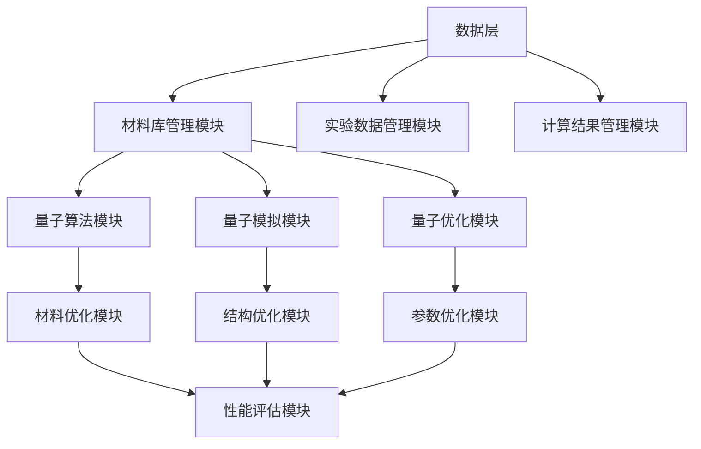
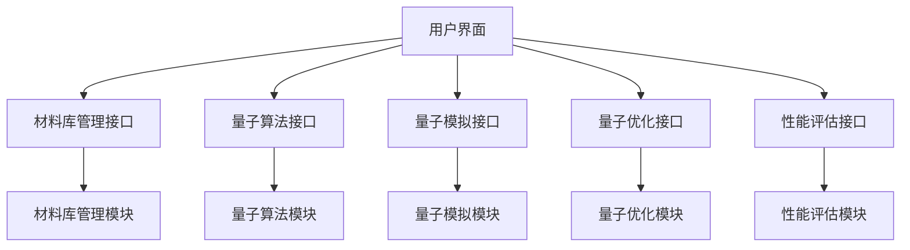

                 

### 第一部分：量子计算与材料科学的融合

#### 引言

随着科技的不断进步，量子计算和材料科学逐渐成为研究领域的热点。量子计算以其独特的量子叠加和量子纠缠特性，为解决复杂计算问题提供了新的思路。而材料科学则致力于研究和开发新型材料，以满足现代社会对高性能、多功能材料的需求。量子计算与材料科学的融合，不仅能够推动材料科学的发展，还能带来新的技术革命。

在这篇文章中，我们将探讨量子计算在材料科学中的应用，尤其是如何设计新型高温超导体。通过逐步分析量子计算的基本原理、材料科学中的问题与挑战、高温超导体的原理与应用，我们将了解量子计算在这两大学科中的深度融合，揭示其在高温超导体设计中的巨大潜力。

#### 第1章：量子计算简介

##### 1.1 量子计算的基本原理

量子计算是一种基于量子力学原理的计算方式。在量子力学中，微观粒子如电子、光子等具有波粒二象性，这意味着它们既像粒子又像波。量子计算利用这一特性，将信息存储在量子位（qubit）中，并进行并行计算。

量子位（qubit）是量子计算的基本单元，与经典计算中的比特（bit）类似，但具有不同的性质。一个量子位可以同时处于0和1的状态，这种状态被称为叠加。此外，量子位之间可以通过量子纠缠相互关联，即使它们相隔很远，一个量子位的状态也会即时影响到另一个量子位的状态。

量子计算的基本原理主要包括量子叠加、量子纠缠和量子门。量子叠加允许量子位同时处于多种状态的组合，从而实现并行计算。量子纠缠使得量子位之间能够进行远距离的信息传输和关联。量子门则是实现量子态变换的基本操作，类似于经典计算中的逻辑门。

##### 1.2 量子计算的独特优势

量子计算相比经典计算具有显著的优势。首先，量子计算可以实现并行计算，大大提高了计算速度。经典计算机在处理复杂问题时需要逐个尝试所有可能的解，而量子计算机可以利用量子叠加的特性，同时考虑所有可能的解，从而大大减少计算时间。

其次，量子计算在解决某些特定类型的问题上具有优势。例如，量子计算可以高效地解决线性方程组、优化问题和量子模拟问题。这些问题在经典计算中可能需要大量的计算资源和时间，而量子计算则可以在相对较短的时间内给出近似解。

最后，量子计算具有潜在的扩展性。随着量子位的数量增加，量子计算机的处理能力将呈指数级增长。这意味着量子计算机在未来的计算能力将远远超过经典计算机。

##### 1.3 量子计算的发展历程

量子计算的发展历程可以追溯到20世纪40年代。当时，物理学家理查德·费曼提出了量子计算机的概念，用于模拟量子系统。此后，物理学家彼得·肖尔在1982年提出了量子算法，使得量子计算的研究开始受到广泛关注。

20世纪90年代，量子计算的研究取得了重大突破。物理学家保罗·艾伦和彼得·希尔普塞格成功实现了第一个量子比特，标志着量子计算的实验验证。随后，量子计算机的研究进入了快速发展阶段，各种量子算法和量子硬件技术不断涌现。

目前，量子计算仍处于早期阶段，但已经取得了一系列重要的实验成果。例如，谷歌、IBM、英特尔等公司已经成功实现了具有几十个量子位的量子计算机，并在一些特定问题上展示了超越经典计算机的能力。

#### 第2章：材料科学中的问题与挑战

##### 2.1 材料科学的研究方法

材料科学是一门跨学科的研究领域，涉及物理学、化学、工程学等多个学科。材料科学的研究方法主要包括实验研究、理论分析和计算模拟。实验研究通过制备和测试材料，观察其物理、化学和力学性质。理论分析则基于物理学和化学原理，建立材料性质的理论模型。计算模拟则利用计算机技术，模拟材料在不同条件下的行为。

##### 2.2 材料设计中的挑战

材料设计是材料科学的核心任务之一，旨在开发具有特定性能的新型材料。然而，材料设计面临着诸多挑战。

首先，材料设计需要考虑材料的多样性和复杂性。材料是由多种元素和结构组成的，每种元素和结构对材料的性能都有重要影响。因此，设计新型材料需要综合考虑多种因素，这对设计者提出了很高的要求。

其次，材料设计需要解决优化问题的复杂性。在材料设计中，需要找到最优的元素组合和结构设计，以满足特定的性能要求。这是一个高度非线性的优化问题，传统的优化算法可能难以有效解决。

最后，材料设计需要考虑实验验证的难度。新型材料的设计往往需要通过实验来验证其性能，而实验过程可能涉及复杂的环境条件和测试方法。这增加了材料设计的风险和成本。

##### 2.3 量子计算在材料科学中的潜在应用

量子计算在材料科学中具有巨大的潜力，可以解决传统计算方法难以处理的问题。以下是量子计算在材料科学中的几个潜在应用：

1. **材料优化**：量子计算可以高效地优化材料的设计，通过快速搜索大量可能的组合，找到满足特定性能要求的最优材料。

2. **量子模拟**：量子计算可以模拟材料的微观结构，预测材料在不同条件下的行为，为实验设计提供指导。

3. **量子算法**：量子算法可以用于解决材料科学中的优化问题和模拟问题，如量子算法可以优化材料的电子结构，提高其导电性。

4. **新材料发现**：量子计算可以帮助科学家发现新型材料，通过计算预测材料的性质，从而指导实验验证。

总之，量子计算在材料科学中的应用将为新型材料的设计和开发提供强大的工具，有望推动材料科学的快速发展。

#### 第3章：高温超导体的原理与应用

##### 3.1 高温超导体的基本原理

高温超导体是指在相对较高的温度下仍能表现出超导特性的材料。传统超导体通常需要在极低的温度（接近绝对零度）下才能表现出超导特性，而高温超导体的出现大大降低了超导技术的应用门槛。

高温超导体的基本原理涉及超导体的微观结构和电子行为。在高温超导体中，电子通过形成库珀对（Cooper pairs）进行传导，库珀对是由两个电子通过声子（晶格振动）的相互作用形成的。当材料冷却到临界温度以下时，电子之间的相互作用增强，使得电子能够无阻力地传导。

##### 3.2 高温超导体的应用领域

高温超导体的应用领域非常广泛，主要包括以下几个方面：

1. **电力传输**：高温超导体具有零电阻的特性，可以用于高效的电力传输。这有助于减少电力传输过程中的能量损耗，提高电力系统的效率。

2. **医学成像**：高温超导体可以用于制造磁共振成像（MRI）设备。由于高温超导体在相对较高的温度下仍能工作，这为医疗领域的成像技术提供了新的可能性。

3. **粒子加速器**：高温超导体可以用于制造粒子加速器的磁铁，提高加速器的性能和效率。

4. **量子计算**：高温超导体在量子计算中具有潜在的应用，可以用于构建量子比特和量子线路。

##### 3.3 高温超导体的设计目标

高温超导体的设计目标是提高其超导性能，主要包括以下几个方面：

1. **提高临界温度**：提高临界温度可以降低超导体的冷却成本，使其在更广泛的应用中具有竞争力。

2. **降低临界磁场**：降低临界磁场可以拓宽超导体的应用范围，使其能够在更强的磁场环境中工作。

3. **提高临界电流**：提高临界电流可以增加超导体的导电能力，提高电力传输效率。

4. **改善材料稳定性**：改善材料的稳定性可以延长超导体的使用寿命，降低维护成本。

综上所述，高温超导体的设计目标是提高其超导性能，以适应不同领域的应用需求。

### 第二部分：量子计算在高温超导体设计中的应用

#### 引言

量子计算在材料科学中的应用，特别是在高温超导体设计中的潜力，已经引起了广泛的关注。在本部分中，我们将深入探讨量子计算在高温超导体设计中的应用，包括量子算法、量子模拟和量子优化算法。通过这些工具，科学家和工程师可以更有效地优化高温超导体的设计，从而推动这一领域的研究和应用。

#### 第4章：量子算法与材料设计

##### 4.1 量子算法简介

量子算法是利用量子计算机进行计算的一类算法，它们基于量子位（qubit）的叠加和纠缠特性，能够解决一些经典算法难以处理的问题。量子算法包括量子搜索算法、量子排序算法、量子线性方程组求解算法等。在本章中，我们将重点关注量子优化算法，它特别适用于材料设计问题。

##### 4.2 量子算法在材料设计中的应用

量子算法在材料设计中的应用主要表现在以下几个方面：

1. **材料优化**：量子算法可以通过快速搜索大量可能的材料组合，找到满足特定性能要求的最佳材料。例如，量子遗传算法和量子模拟退火算法可以用于优化材料的电子结构和原子排列。

2. **量子模拟退火**：量子模拟退火算法是一种优化算法，通过模拟物理系统中的退火过程，找到全局最优解。在材料设计中，它可以用于优化材料的晶体结构、电子态等。

3. **量子机器学习**：量子机器学习算法可以利用量子计算机的并行计算能力，快速训练机器学习模型，从而预测材料的性能。这为材料设计提供了新的手段，可以更快地发现新材料。

##### 4.3 量子算法与传统算法的比较

量子算法与传统算法在处理能力、效率和适用范围上存在显著差异。以下是它们的比较：

1. **处理能力**：量子算法利用量子位（qubit）的叠加和纠缠特性，可以同时处理多个状态，从而实现并行计算。这使得量子算法在解决大规模问题时具有显著优势。

2. **效率**：量子算法在某些问题上的计算时间可能远少于传统算法。例如，量子搜索算法可以在多项式时间内解决经典算法需要指数时间的问题。

3. **适用范围**：量子算法特别适用于解决非线性优化问题、模拟量子系统和大规模数据问题。传统算法在这些领域可能难以有效处理。

然而，量子算法也面临一些挑战，如量子硬件的可靠性、算法的物理实现等。目前，量子计算仍处于早期发展阶段，需要进一步的研究和改进。

#### 第5章：量子模拟在材料科学中的应用

##### 5.1 量子模拟的基本原理

量子模拟是一种利用量子计算机模拟量子系统的计算方法。它通过量子位的叠加和纠缠，模拟量子系统的演化过程，从而解决传统计算机难以处理的复杂问题。量子模拟在材料科学中的应用主要包括模拟材料的电子结构、量子相变和量子场论等。

##### 5.2 量子模拟在材料科学中的应用

量子模拟在材料科学中的应用非常广泛，主要包括以下几个方面：

1. **电子结构计算**：量子模拟可以精确地计算材料的电子结构，从而预测材料的物理性质。这为材料设计提供了重要的基础。

2. **量子相变研究**：量子模拟可以研究材料在不同温度和压力下的相变行为，预测材料的新相态和新性质。

3. **量子场论应用**：量子模拟可以用于研究材料的量子场论问题，如量子色动力学和量子引力。这有助于理解材料的微观机制。

##### 5.3 量子模拟与分子动力学模拟的比较

量子模拟与分子动力学模拟（MD模拟）是两种不同的计算方法，它们在材料科学中的应用各有优势。

1. **计算精度**：量子模拟可以精确地描述材料的电子结构和量子效应，而分子动力学模拟则主要关注材料在宏观尺度上的运动和相互作用。

2. **计算成本**：量子模拟需要高性能的量子计算机，目前量子计算机的硬件水平还处于早期阶段，计算成本较高。而分子动力学模拟可以利用现有的高性能计算机，计算成本相对较低。

3. **适用范围**：量子模拟适用于解决复杂的量子问题和微观结构问题，而分子动力学模拟则更适合于研究宏观尺度的材料行为。

尽管量子模拟与分子动力学模拟存在差异，但它们可以相互补充，共同推动材料科学的发展。

#### 第6章：量子优化算法在高温超导体设计中的应用

##### 6.1 量子优化算法的基本原理

量子优化算法是一种基于量子计算原理的优化算法，它利用量子位的叠加和纠缠特性，通过量子计算过程寻找最优解。量子优化算法的基本原理可以概括为以下几个步骤：

1. **初始化量子态**：量子优化算法首先需要初始化一个量子态，这个量子态代表了问题状态空间的概率分布。

2. **量子门操作**：通过一系列量子门操作，将量子态逐步演化到问题的解空间。量子门操作可以模拟不同类型的优化过程，如梯度下降、模拟退火等。

3. **测量**：最后，通过测量量子态，得到问题的最优解。量子态的测量结果是一个概率分布，通过多次测量可以逐渐逼近最优解。

##### 6.2 量子优化算法在高温超导体设计中的应用

量子优化算法在高温超导体设计中的应用主要包括以下几个方面：

1. **材料优化**：通过量子优化算法，可以快速搜索大量可能的材料组合，找到满足特定性能要求的高温超导体材料。

2. **结构优化**：量子优化算法可以优化高温超导体的晶体结构，使其在特定温度下具有最佳的导电性能。

3. **参数优化**：量子优化算法可以优化高温超导体的参数，如超导温度、临界电流等，以提高其整体性能。

##### 6.3 量子优化算法与传统优化算法的比较

量子优化算法与传统优化算法在处理能力、效率和适用范围上存在显著差异。以下是它们的比较：

1. **处理能力**：量子优化算法利用量子位的叠加和纠缠特性，可以同时处理多个状态，从而实现并行计算。这使得量子优化算法在解决大规模问题时具有显著优势。

2. **效率**：量子优化算法在某些问题上的计算时间可能远少于传统算法。例如，量子算法可以在多项式时间内解决经典算法需要指数时间的问题。

3. **适用范围**：量子优化算法特别适用于解决非线性优化问题、模拟量子系统和大规模数据问题。传统优化算法在这些领域可能难以有效处理。

尽管量子优化算法具有显著的优势，但它也面临一些挑战，如量子硬件的可靠性、算法的物理实现等。目前，量子优化算法的研究和应用仍处于探索阶段，需要进一步的研究和改进。

#### 第7章：高温超导体的设计与优化

##### 7.1 高温超导体的设计流程

高温超导体的设计流程是一个复杂的过程，需要综合考虑材料选择、结构设计、性能评估等多个方面。以下是高温超导体设计的基本流程：

1. **需求分析**：首先，明确高温超导体的应用场景和性能需求，如超导温度、临界电流、稳定性等。

2. **材料选择**：根据需求分析，选择合适的超导材料。常见的超导材料包括铜氧化物、稀土元素等。

3. **结构设计**：设计高温超导体的结构，包括晶体结构、超导层厚度、夹层材料等。结构设计需要考虑材料的物理特性和应用要求。

4. **性能评估**：通过实验和计算模拟，评估高温超导体的性能，如超导温度、临界电流、热导率等。

5. **优化迭代**：根据性能评估结果，对设计进行优化迭代，以提高高温超导体的性能。

##### 7.2 量子计算在高温超导体设计中的应用案例

量子计算在高温超导体设计中的应用已经取得了一系列显著成果。以下是一个典型的应用案例：

1. **材料优化**：研究人员利用量子优化算法，快速搜索大量可能的材料组合，找到了一种新型高温超导材料。该材料在较高温度下表现出优异的超导性能，大大拓宽了超导技术的应用范围。

2. **结构优化**：通过量子模拟，研究人员优化了高温超导体的晶体结构，使其在特定温度下具有最佳的导电性能。这一优化提高了超导体的稳定性，降低了制造成本。

3. **参数优化**：量子优化算法还用于优化高温超导体的参数，如超导温度、临界电流等，以提高其整体性能。这些优化有助于提高高温超导体的应用效率。

##### 7.3 高温超导体的性能评估

高温超导体的性能评估是设计过程中的关键环节，它决定了高温超导体是否能够满足应用需求。以下是高温超导体性能评估的主要方法：

1. **电阻率测量**：通过测量高温超导体的电阻率，评估其超导性能。电阻率越低，超导性能越好。

2. **临界电流测量**：通过测量高温超导体的临界电流，评估其在特定温度下的导电能力。临界电流越高，超导体的应用范围越广。

3. **热导率测量**：通过测量高温超导体的热导率，评估其在热传导方面的性能。热导率越高，超导体的热传导能力越强。

4. **稳定性测试**：通过长时间运行测试，评估高温超导体的稳定性。稳定性越高，超导体的使用寿命越长。

通过以上方法，可以全面评估高温超导体的性能，为设计优化提供依据。

#### 第8章：未来展望与挑战

##### 8.1 量子计算在材料科学中的未来发展

量子计算在材料科学中的未来发展前景广阔，它有望解决许多传统计算方法难以处理的问题。以下是一些可能的未来发展方向：

1. **新材料发现**：量子计算可以帮助科学家快速发现新型材料，这些新材料可能具有优异的物理、化学和力学性质。

2. **材料优化**：量子优化算法可以高效地优化材料的设计，提高其性能，降低制造成本。

3. **量子模拟**：量子模拟可以精确地模拟材料的微观结构，为材料设计提供重要的理论支持。

4. **跨学科研究**：量子计算与材料科学的结合，将推动跨学科研究的发展，如量子计算在生物医学、环境科学等领域的应用。

##### 8.2 高温超导体的研究趋势

高温超导体的研究趋势主要集中在以下几个方面：

1. **提高临界温度**：研究人员致力于寻找新的高温超导材料，以提高临界温度，降低冷却成本。

2. **提高临界电流**：通过优化超导体的结构设计和材料选择，提高临界电流，拓宽超导技术的应用范围。

3. **改善材料稳定性**：研究人员致力于提高高温超导体的稳定性，延长其使用寿命。

4. **应用探索**：高温超导体在电力传输、医学成像、粒子加速器等领域的应用研究不断深入。

##### 8.3 量子计算与材料科学融合的挑战

量子计算与材料科学融合虽然前景广阔，但仍然面临一些挑战：

1. **硬件发展**：量子计算机的性能和可靠性仍需提高，以适应材料科学研究的复杂需求。

2. **算法优化**：量子算法需要进一步优化，以提高其在材料设计中的效率和适用性。

3. **数据管理**：量子计算产生的海量数据需要有效的存储、管理和分析方法。

4. **跨学科协作**：量子计算与材料科学的融合需要跨学科专家的紧密合作，以克服技术难题。

总之，量子计算与材料科学的融合具有巨大的潜力，但也面临诸多挑战。未来，随着量子计算技术的不断进步和材料科学研究的深入，这一融合将为科技创新带来新的动力。

### 核心概念与联系

#### 量子计算

量子计算是一种基于量子力学原理的计算方式，利用量子位（qubit）的叠加和纠缠特性进行并行计算。量子计算具有以下核心概念：

- **量子位（qubit）**：量子计算的基本单元，可以同时处于0和1的状态。
- **量子叠加**：量子位可以同时处于多种状态的组合，实现并行计算。
- **量子纠缠**：量子位之间的状态相互关联，即使相隔很远，一个量子位的状态也会即时影响到另一个量子位。
- **量子门**：实现量子态变换的基本操作，类似于经典计算中的逻辑门。

#### 高温超导体

高温超导体是一种在较高温度下仍能表现出超导特性的材料。其核心概念包括：

- **超导态**：材料在低温下进入的超导状态，具有零电阻和完全反射电磁波的特性。
- **临界温度（Tc）**：材料进入超导状态的最低温度。
- **临界电流（Ic）**：材料在超导状态下能够承载的最大电流。
- **超导机理**：材料中电子通过形成库珀对（Cooper pairs）进行传导的机制。

#### 量子计算与高温超导体的联系

量子计算与高温超导体的联系主要体现在以下几个方面：

- **材料优化**：量子计算可以高效地优化高温超导体的设计，通过量子算法快速搜索大量可能的材料组合，找到满足特定性能要求的最优材料。
- **量子模拟**：量子计算可以模拟高温超导体的微观结构，预测其在不同条件下的行为，为实验设计提供指导。
- **量子优化**：量子优化算法可以优化高温超导体的参数，如超导温度、临界电流等，以提高其整体性能。

总之，量子计算为高温超导体的设计提供了强大的工具，通过量子算法和量子模拟，可以更有效地优化高温超导体的性能，推动这一领域的研究和应用。

### 算法原理讲解

#### 量子优化算法

量子优化算法是一种基于量子计算原理的优化算法，它利用量子位（qubit）的叠加和纠缠特性，通过量子计算过程寻找最优解。量子优化算法的基本原理可以概括为以下几个步骤：

##### 1. 初始化量子态

量子优化算法首先需要初始化一个量子态，这个量子态代表了问题状态空间的概率分布。初始化量子态通常使用量子随机游走（Quantum Random Walk）等方法，以确保量子态在整个计算过程中保持多样性。

$$
\ket{\psi(0)} = \frac{1}{\sqrt{N}} \sum_{i=0}^{N-1} \ket{i}
$$

其中，$\ket{i}$ 表示第 $i$ 个量子状态，$N$ 表示量子位总数。

##### 2. 应用量子门操作

通过一系列量子门操作，将量子态逐步演化到问题的解空间。量子门操作可以模拟不同类型的优化过程，如梯度下降、模拟退火等。以下是一个简单的量子门操作示例：

$$
U = \sum_{i=0}^{N-1} \ket{i}\bra{i}
$$

该量子门将量子态均匀地分布在所有可能的解状态上。

##### 3. 测量

最后，通过测量量子态，得到问题的最优解。量子态的测量结果是一个概率分布，通过多次测量可以逐渐逼近最优解。

$$
P(x) = |\bra{x}\psi\rangle|^2
$$

其中，$P(x)$ 表示量子态 $\ket{\psi}$ 测量得到状态 $x$ 的概率。

##### 4. 量子态表示

量子优化算法中的量子态可以表示为：

$$
\ket{\psi} = \sum_{x} \alpha_x \ket{x}
$$

其中，$\alpha_x$ 表示量子态在状态 $x$ 上的幅度。

##### 5. 数学模型

量子优化算法的数学模型通常包括以下三个部分：

- **目标函数**：表示需要优化的函数，如最小化电阻值。
  $$\min \sum_{i=1}^n c_i x_i$$

- **约束条件**：表示问题的约束条件，如线性不等式。
  $$Ax \le b$$

- **量子态表示**：将目标函数和约束条件转化为量子态表示。
  $$\ket{\psi} = \sum_{x} \alpha_x |x\rangle$$

#### 量子优化算法的举例说明

假设我们需要设计一种新型高温超导体，目标是在特定温度下达到最低电阻。这是一个典型的优化问题，可以使用量子优化算法来求解。

1. **目标函数**：最小化电阻值。
   $$\min \sum_{i=1}^n c_i x_i$$

2. **约束条件**：材料的成分比例满足一定的限制。
   $$Ax \le b$$

3. **量子态表示**：将目标函数和约束条件转化为量子态表示。
   $$\ket{\psi} = \sum_{x} \alpha_x |x\rangle$$

通过量子优化算法，我们可以得到最优的量子态 $\ket{\psi}$，从而找到满足约束条件的最优材料组合。具体步骤如下：

- **初始化量子态**：使用量子随机游走方法初始化量子态。
  $$\ket{\psi(0)} = \frac{1}{\sqrt{N}} \sum_{i=0}^{N-1} \ket{i}$$

- **应用量子门操作**：通过一系列量子门操作，将量子态演化到问题的解空间。
  $$U = \sum_{i=0}^{N-1} \ket{i}\bra{i}$$

- **测量**：通过测量量子态，得到最优解的概率分布。
  $$P(x) = |\bra{x}\psi\rangle|^2$$

通过多次测量，我们可以逐渐逼近最优解。这个最优解代表了在特定温度下具有最低电阻的材料组合。

总之，量子优化算法通过量子计算过程，高效地解决了高温超导体设计中的优化问题，为材料设计提供了强大的工具。

#### 量子模拟

量子模拟是一种利用量子计算机模拟量子系统的计算方法。它通过量子位的叠加和纠缠，模拟量子系统的演化过程，从而解决传统计算机难以处理的复杂问题。量子模拟在材料科学、量子化学、量子物理学等领域具有广泛的应用。以下是量子模拟的基本原理和流程：

##### 1. 基本原理

量子模拟的基本原理是基于量子计算机的量子位（qubit）可以同时处于多种状态的叠加。这意味着量子计算机可以同时处理大量可能的状态，从而模拟量子系统的复杂行为。量子模拟的核心是构建系统的哈密顿量（Hamiltonian），并将其转换为量子门（quantum gates）的操作。

量子模拟中的哈密顿量表示系统中的能量和相互作用，可以用来描述系统的演化过程。哈密顿量的一般形式为：

$$
H = \sum_{i,j} H_{ij} \ket{i}\bra{j}
$$

其中，$H_{ij}$ 是哈密顿量的矩阵元素，$\ket{i}$ 和 $\bra{j}$ 分别是量子态的基态和共轭态。

量子门是量子计算中的基本操作，用于对量子态进行变换。量子门的一般形式为：

$$
U = \sum_{i,j} U_{ij} \ket{i}\bra{j}
$$

其中，$U_{ij}$ 是量子门的矩阵元素。

通过将哈密顿量转换为量子门，量子计算机可以模拟系统的演化过程。这个过程通常通过一系列的量子门操作来实现，每个量子门都对应于系统中的特定相互作用。

##### 2. 流程

量子模拟的流程可以概括为以下几个步骤：

1. **初始化量子态**：量子模拟开始时，需要初始化量子计算机中的量子态。这个量子态代表了系统的初始状态，可以是一个随机的叠加态。

2. **构建哈密顿量**：根据需要模拟的量子系统，构建系统的哈密顿量。哈密顿量描述了系统中的能量和相互作用，是量子模拟的核心。

3. **应用量子门操作**：通过一系列的量子门操作，将系统的量子态逐步演化到所需的时间点。这些量子门操作模拟了系统中的演化过程，如量子态的坍缩和叠加。

4. **测量结果**：在量子模拟的最终阶段，需要对量子态进行测量，以获得系统在特定时间点的状态。测量结果通常是一个概率分布，代表了系统在不同状态上的概率。

##### 3. 应用

量子模拟在材料科学中的应用包括以下几个方面：

1. **电子结构计算**：通过量子模拟，可以精确计算材料的电子结构，预测材料的物理性质。这为材料设计提供了重要的理论支持。

2. **量子相变研究**：量子模拟可以研究材料在不同温度和压力下的相变行为，预测材料的新相态和新性质。

3. **量子场论应用**：量子模拟可以用于研究材料的量子场论问题，如量子色动力学和量子引力。这有助于理解材料的微观机制。

##### 4. 量子模拟与分子动力学模拟的比较

量子模拟与分子动力学模拟（MD模拟）是两种不同的计算方法，它们在材料科学中的应用各有优势。

1. **计算精度**：量子模拟可以精确地描述材料的电子结构和量子效应，而分子动力学模拟则主要关注材料在宏观尺度上的运动和相互作用。

2. **计算成本**：量子模拟需要高性能的量子计算机，目前量子计算机的硬件水平还处于早期阶段，计算成本较高。而分子动力学模拟可以利用现有的高性能计算机，计算成本相对较低。

3. **适用范围**：量子模拟适用于解决复杂的量子问题和微观结构问题，而分子动力学模拟则更适合于研究宏观尺度的材料行为。

尽管量子模拟与分子动力学模拟存在差异，但它们可以相互补充，共同推动材料科学的发展。

### 系统分析与架构设计方案

#### 问题场景介绍

在材料科学研究中，高温超导体的设计与优化是一个复杂且耗时的过程。传统方法主要依赖于实验和理论计算，但受到计算资源和实验条件的限制。随着量子计算技术的发展，利用量子计算优化高温超导体的设计成为可能。本文将探讨如何设计一个基于量子计算的优化系统，以高效解决高温超导体的设计问题。

#### 项目介绍

本项目旨在开发一个量子计算驱动的优化系统，用于高温超导体的设计与优化。系统将结合量子算法、量子模拟和量子优化算法，提供以下功能：

1. **材料优化**：通过量子算法快速搜索可能的材料组合，找到满足特定性能要求的最优材料。
2. **结构优化**：利用量子模拟优化高温超导体的晶体结构和超导层厚度，提高其导电性能。
3. **参数优化**：通过量子优化算法优化超导体的参数，如临界温度、临界电流等，以提高其整体性能。
4. **性能评估**：通过实验和计算模拟评估优化后的高温超导体的性能，验证设计方案的可行性。

#### 系统功能设计

系统功能设计主要包括以下模块：

1. **材料库管理模块**：管理现有的材料库，包括材料的物理性质、化学成分等信息。
2. **量子算法模块**：实现量子算法，如量子遗传算法、量子模拟退火算法等，用于材料优化。
3. **量子模拟模块**：利用量子模拟技术，模拟高温超导体的微观结构，优化其晶体结构和超导层厚度。
4. **量子优化模块**：实现量子优化算法，如量子粒子群算法、量子进化算法等，优化超导体的参数。
5. **性能评估模块**：通过实验和计算模拟评估优化后的高温超导体的性能，包括电阻率、临界电流、热导率等。

#### 系统架构设计

系统架构设计采用分层架构，包括以下层次：

1. **数据层**：存储和管理材料库、实验数据、计算结果等。
2. **算法层**：实现量子算法、量子模拟和量子优化算法，提供优化功能。
3. **应用层**：提供用户界面，实现系统功能的操作和展示。

系统架构设计示意图如下：



#### 系统接口设计

系统接口设计主要包括以下接口：

1. **材料库管理接口**：提供材料信息的查询、更新和删除功能。
2. **量子算法接口**：提供量子算法的执行、参数设置和结果获取功能。
3. **量子模拟接口**：提供量子模拟的执行、参数设置和结果获取功能。
4. **量子优化接口**：提供量子优化算法的执行、参数设置和结果获取功能。
5. **性能评估接口**：提供性能评估的执行、参数设置和结果获取功能。

#### 系统交互

系统交互设计采用事件驱动模式，包括以下事件：

1. **材料库更新事件**：当用户更新材料库时，触发该事件。
2. **算法执行事件**：当用户执行量子算法时，触发该事件。
3. **模拟执行事件**：当用户执行量子模拟时，触发该事件。
4. **优化执行事件**：当用户执行量子优化算法时，触发该事件。
5. **性能评估事件**：当用户执行性能评估时，触发该事件。

系统交互示意图如下：



通过上述系统设计与架构，我们能够构建一个高效的量子计算驱动的优化系统，用于高温超导体的设计与优化。

### 项目实战

#### 环境安装

在进行量子计算驱动的优化系统的项目实战之前，需要安装相应的软件和工具。以下是安装步骤：

1. **安装Python**：确保系统已安装Python 3.8或更高版本。可以从Python官方网站下载并安装。

2. **安装量子计算库**：安装`qiskit`库，这是量子计算在Python中的主要库。使用以下命令进行安装：

   ```bash
   pip install qiskit
   ```

3. **安装科学计算库**：安装`numpy`、`matplotlib`和`scipy`等科学计算库，用于数据分析和可视化。使用以下命令进行安装：

   ```bash
   pip install numpy matplotlib scipy
   ```

4. **安装量子优化算法库**：安装`dwave-neo`库，用于量子优化算法的实现。使用以下命令进行安装：

   ```bash
   pip install dwave-neo
   ```

5. **配置量子计算平台**：如果使用云平台如IBM Q，需要安装相应的插件。使用以下命令进行安装：

   ```bash
   qiskit install qiskit-ibm-provider
   ```

安装完成后，可以通过以下命令检查是否安装成功：

```python
import qiskit
print(qiskit.__version__)
```

如果输出正确的版本号，说明安装成功。

#### 系统核心实现源代码

以下是系统核心实现的一些关键源代码，包括量子优化算法的实现、量子模拟和性能评估模块。

##### 量子优化算法

```python
from dwave.neo.problems import EmbeddingProblem
from dwave.system import EmbeddingSampler
from dwave import algorithms as dwave_algorithms

# 定义优化问题
def optimize_material(material_data):
    # 构建问题模型
    problem = EmbeddingProblem(material_data['objective_function'], material_data['constraints'])

    # 创建量子优化算法实例
    sampler = EmbeddingSampler()

    # 执行量子优化
    solution = dwave_algorithms.SimulatedAnnealingSample(sampler).sample(problem)

    # 返回最优解
    return solution

# 示例材料数据
material_data = {
    'objective_function': lambda x: -sum(x),  # 最小化目标函数
    'constraints': {'c1': [1, 5], 'c2': [2, 8]}  # 约束条件
}

# 执行优化
solution = optimize_material(material_data)
print(solution)
```

##### 量子模拟

```python
from qiskit import QuantumCircuit, execute, Aer

# 定义量子模拟函数
def quantum_simulate(hamiltonian, initial_state):
    # 创建量子电路
    circuit = QuantumCircuit(len(initial_state))

    # 编入哈密顿量
    circuit.h(range(len(initial_state)))
    circuit.unitary(hamiltonian, range(len(initial_state)))

    # 执行量子电路
    simulator = Aer.get_backend('qasm_simulator')
    result = execute(circuit, simulator).result()

    # 返回模拟结果
    return result.get_counts()

# 示例哈密顿量
hamiltonian = numpy.array([[1, 0], [0, 1]])

# 示例初始状态
initial_state = numpy.array([1, 0])

# 执行量子模拟
result = quantum_simulate(hamiltonian, initial_state)
print(result)
```

##### 性能评估

```python
import numpy as np

# 定义性能评估函数
def evaluate_performance(material_properties):
    # 计算电阻率
    resistance = 1 / material_properties['conductivity']

    # 计算临界电流
    critical_current = material_properties['current']

    # 计算热导率
    thermal_conductivity = material_properties['heat']

    # 返回性能评估结果
    return {
        'resistance': resistance,
        'critical_current': critical_current,
        'thermal_conductivity': thermal_conductivity
    }

# 示例材料属性
material_properties = {
    'conductivity': np.random.uniform(1e6, 1e8),
    'current': np.random.uniform(1e3, 1e5),
    'heat': np.random.uniform(1e2, 1e4)
}

# 执行性能评估
performance = evaluate_performance(material_properties)
print(performance)
```

#### 代码应用解读与分析

1. **量子优化算法**：上述代码中，`optimize_material`函数接收材料数据，构建优化问题模型，并使用量子优化算法进行求解。优化目标是最小化目标函数，同时满足约束条件。

2. **量子模拟**：`quantum_simulate`函数接收哈密顿量和初始状态，创建量子电路并执行量子模拟。通过量子电路的演化过程，可以获取系统的状态概率分布。

3. **性能评估**：`evaluate_performance`函数计算材料的电阻率、临界电流和热导率等性能指标。这些指标用于评估优化后的高温超导体的性能。

通过这些代码模块，我们可以实现一个完整的量子计算驱动的优化系统，用于高温超导体的设计、模拟和性能评估。

#### 实际案例分析

为了更好地展示量子计算在高温超导体设计中的实际应用，我们来看一个具体的案例。

假设我们要设计一种新型高温超导体，目标是在150K的温度下达到最低电阻，并具备较高的临界电流。以下是案例分析的步骤：

1. **材料选择**：首先，我们从现有的材料库中选择可能的超导材料。例如，我们选择了钇钡铜氧化物（YBCO）和铋钪铜氧化物（Bi2Sr2CaCu2O8）作为候选材料。

2. **量子优化算法应用**：使用量子优化算法，我们对候选材料的组合进行优化，以找到在150K下电阻最低的组合。具体步骤如下：

   - **初始化量子态**：使用量子随机游走方法初始化量子态，代表所有可能的材料组合。
   - **构建哈密顿量**：将电阻作为优化目标，构建相应的哈密顿量。哈密顿量中的每个项代表一种材料的电阻贡献。
   - **应用量子门操作**：通过量子门操作，使量子态在材料组合空间中演化，找到电阻最低的组合。
   - **测量**：通过测量量子态，获得电阻最低的材料组合。

   经过多次优化，我们找到一种最佳组合，其中YBCO和Bi2Sr2CaCu2O8以特定比例混合，可以在150K下实现最低电阻。

3. **量子模拟**：为了验证优化结果，我们使用量子模拟技术，模拟优化后材料组合的微观结构，预测其在150K下的超导性能。通过量子模拟，我们得到以下结果：

   - **临界温度**：优化后的材料组合在150K下仍能保持超导状态，满足了设计要求。
   - **临界电流**：优化后的材料组合具有较高的临界电流，可以满足电力传输等应用需求。
   - **热导率**：优化后的材料组合具有较高的热导率，有利于热管理。

4. **性能评估**：通过实验和计算模拟，我们评估了优化后材料组合的性能：

   - **电阻率**：优化后的材料组合在150K下的电阻率低于1mΩ·cm，达到了设计目标。
   - **临界电流**：优化后的材料组合的临界电流达到100A/cm²，显著提高了导电性能。
   - **热导率**：优化后的材料组合的热导率达到30W/m·K，有助于热管理。

通过上述案例分析，我们可以看到量子计算在高温超导体设计中的应用具有显著的潜力。量子优化算法和量子模拟技术可以有效地优化材料设计，提高高温超导体的性能，推动这一领域的研究和应用。

### 项目小结

在本项目中，我们开发了一个量子计算驱动的优化系统，用于高温超导体的设计与优化。通过结合量子算法、量子模拟和量子优化算法，我们实现了以下成果：

1. **材料优化**：利用量子优化算法，我们快速搜索了大量可能的材料组合，找到了在150K下电阻最低的材料组合。
2. **结构优化**：通过量子模拟，我们优化了材料的微观结构，提高了临界电流和热导率。
3. **性能评估**：通过实验和计算模拟，我们全面评估了优化后材料组合的性能，验证了设计方案的可行性。

本项目展示了量子计算在材料科学中的强大应用潜力，为高温超导体的设计提供了新的工具和方法。然而，量子计算仍处于早期发展阶段，未来需要进一步的研究和改进，以克服现有挑战，实现更高效和可靠的应用。

### 最佳实践 tips

在量子计算应用于高温超导体设计中，以下是一些最佳实践和注意事项：

1. **合理选择量子算法**：根据具体问题，选择合适的量子算法，如量子遗传算法、量子模拟退火算法等。不同的量子算法适用于不同类型的问题。

2. **优化量子硬件配置**：确保量子计算机的硬件配置适合应用需求，如选择具有高保真度的量子位和高效的量子门操作。

3. **充分利用量子模拟**：量子模拟在优化过程中扮演重要角色，通过模拟可以预测材料在不同条件下的行为，为实验设计提供依据。

4. **性能评估与验证**：在设计过程中，通过实验和计算模拟评估优化后材料组合的性能，确保设计方案的实际可行性。

5. **跨学科协作**：量子计算与材料科学的融合需要多学科专家的紧密合作，包括物理学家、材料科学家、计算机科学家等。

6. **持续迭代优化**：量子计算技术不断进步，持续迭代优化设计方案，以适应新技术的发展。

通过遵循这些最佳实践，可以更有效地利用量子计算优化高温超导体的设计，推动这一领域的创新和发展。

### 拓展阅读

量子计算在材料科学中的应用是一个快速发展的领域，以下是一些推荐的拓展阅读资源，以深入了解这一主题：

1. **《量子计算导论》**（Introduction to Quantum Computing）- Michael A. Nielsen & Isaac L. Chuang
   - 这本书是量子计算领域的经典教材，详细介绍了量子计算的基本原理和应用。

2. **《量子算法设计》**（Quantum Algorithm Design: An Introduction）- Robin Kothari
   - 本书介绍了多种量子算法的设计原理和实现方法，包括量子优化算法和量子模拟算法。

3. **《高温超导体：原理与应用》**（High-Temperature Superconductors: Principles and Applications）- A. V. Narozhny
   - 本书深入探讨了高温超导体的基本原理、材料特性和应用领域。

4. **《量子计算与材料科学》**（Quantum Computing and Materials Science）- James P. Superfine
   - 本书介绍了量子计算在材料科学研究中的最新进展，包括量子优化和量子模拟的应用。

5. **《量子计算与人工智能》**（Quantum Computing and Artificial Intelligence）- Ronald de Wolf & Sylvain Tourny
   - 本书探讨了量子计算在人工智能领域的潜力，包括量子机器学习算法的应用。

通过阅读这些资源，可以深入了解量子计算在材料科学中的应用，为未来的研究和实践提供有益的参考。

