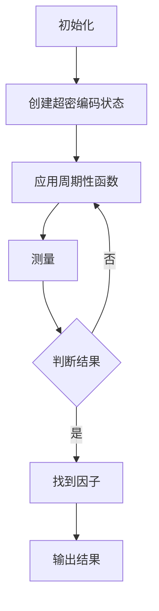
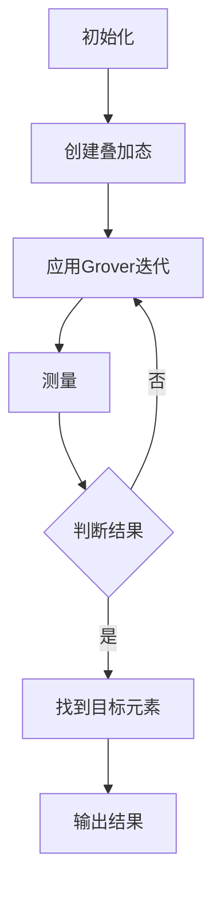
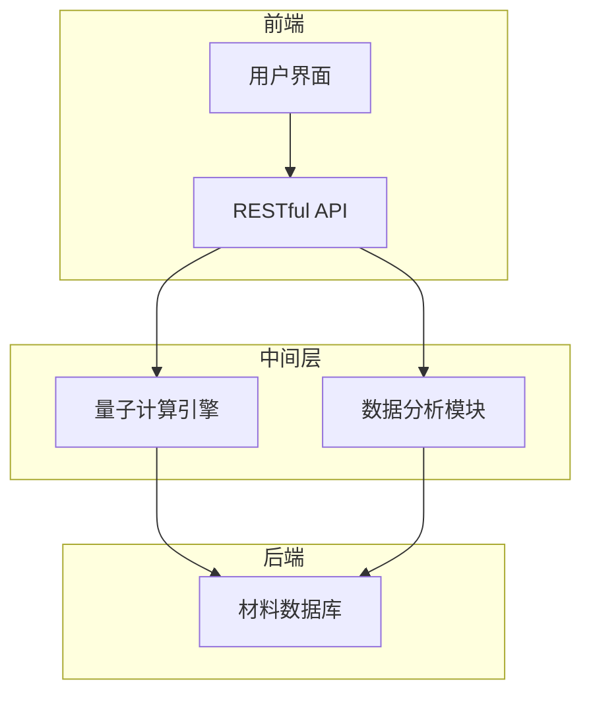
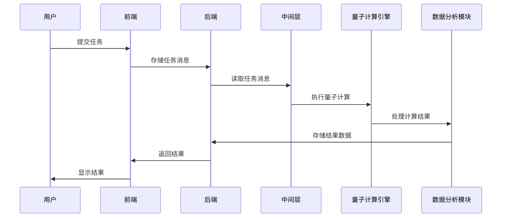

                 

### 背景介绍

量子计算，作为当今科技领域的前沿课题，正逐步改变我们对计算能力的传统认知。其核心优势在于能够并行处理大量数据，从而在处理复杂问题时展现出传统计算机无法比拟的速度和效率。材料科学，则是研究物质的组成、结构、性质以及它们之间相互作用的科学。它涵盖了从基础理论研究到实际应用开发的一系列领域，对现代社会的发展具有重要意义。

在传统材料科学中，研究者们依赖于经典计算方法来模拟材料的性质，但这些方法在处理复杂材料系统的相互作用时往往显得力不从心。随着材料科学的发展，研究者们开始意识到，量子计算作为一种全新的计算范式，可能为材料科学带来革命性的突破。量子计算在材料科学中的潜在应用，不仅有望解决当前经典计算面临的难题，还能推动材料设计、性能优化和新材料发现等领域的快速发展。

本书《量子计算在材料科学中的潜在应用》旨在探讨量子计算如何与材料科学相结合，探索这一新兴交叉领域的广阔前景。通过系统介绍量子计算的基本概念、算法原理及其在材料科学中的应用案例，本书旨在为读者提供一个全面而深入的理解，帮助科研人员、工程师和学者们把握这一领域的发展脉搏，进而推动相关技术的创新与应用。

### 量子计算的基本概念

量子计算是基于量子力学原理发展起来的一种新型计算范式。它与传统计算的核心区别在于，量子计算机使用量子比特（qubit）来存储和处理信息，而不是使用传统计算机中的比特。量子比特是一种量子物理系统，它可以同时存在于0和1的状态，这种性质称为叠加态。具体来说，量子比特的状态可以表示为：

\[ \psi = \alpha|0\rangle + \beta|1\rangle \]

其中，\(|0\rangle\)和\(|1\rangle\)分别表示量子比特的基态，而\(\alpha\)和\(\beta\)是复数概率幅，满足\(|\alpha|^2 + |\beta|^2 = 1\)。

量子比特的这一叠加特性使得量子计算机能够同时处理多个状态，从而在特定问题上展现出并行计算的能力。这种并行性是量子计算相比传统计算的最大优势之一。例如，量子计算机在求解某些特定类型的问题时，其计算速度可以远超经典计算机。

除了叠加态，量子比特还具有另一个重要特性，即量子纠缠。量子纠缠是指两个或多个量子比特之间的状态是相互关联的，即一个量子比特的状态会立即影响到与之纠缠的其他量子比特的状态。这种纠缠关系可以用来实现量子比特之间的复杂相互作用，从而实现量子算法的高效计算。

量子比特的状态叠加和量子纠缠为量子计算提供了强大的计算能力。例如，著名的Shor算法利用量子计算机的叠加态和纠缠态，能够在多项式时间内求解大整数因式分解问题，而这一问题在经典计算机上则需要指数级的时间复杂度。此外，Grover算法利用量子搜索算法的优势，可以在未排序的数据库中快速查找特定元素，其搜索速度远超传统二分查找算法。

总之，量子计算的基本概念，如量子比特、叠加态、量子纠缠等，为其在材料科学中的潜在应用奠定了理论基础。通过理解和掌握这些基本概念，我们能够更好地探索量子计算在材料科学领域的广泛应用和巨大潜力。

### 材料科学的基本概念

材料科学是一门涉及物质组成、结构、性质以及它们之间相互作用的科学。它的研究对象包括各种不同的材料，从金属、陶瓷、聚合物到复合材料等。材料科学的核心目标是理解和设计材料的性质，以实现特定的应用需求。

在材料科学中，材料的组成和结构对其性能起着决定性作用。材料的组成通常包括元素、合金元素、添加剂等，这些元素通过不同的化学键和晶体结构形成复杂的微观和宏观结构。例如，金属材料的性能常常受到其晶体结构和合金元素的显著影响。

材料的结构可以细分为微观结构和宏观结构。微观结构包括晶粒尺寸、位错密度、相界面等，这些微观缺陷会影响材料的机械性能、导电性、磁性等。宏观结构则涉及材料的整体形态和尺寸，如板材、管材、粉末等，这些宏观特性在工业应用中尤为重要。

材料的性质是指其在特定条件下的行为和特征，包括机械性能（如强度、韧性、硬度）、热性能（如导热性、热膨胀系数）、电性能（如导电性、介电性）、磁性能（如磁导率、矫顽力）等。材料科学的一个重要任务是通过调整材料的组成和结构，优化其性能以满足各种应用需求。

材料科学的研究方法包括实验研究、理论计算和模拟。实验研究通常涉及材料的合成、表征和性能测试，通过实验手段了解材料的微观结构和宏观性能之间的关系。理论计算则依赖于物理和化学理论，通过计算模型预测材料的性质。计算机模拟技术，如分子动力学模拟和密度泛函理论（DFT）模拟，为材料科学家提供了强大的工具，能够在分子和原子尺度上研究材料的性质和行为。

总之，材料科学的基本概念涵盖了材料的组成、结构、性质及其相互关系，通过多学科交叉的研究方法，不断推动材料科学的发展和应用。

### 量子计算与材料科学的相互联系

量子计算与材料科学之间的相互联系在于，它们在基本原理上有着深刻的共鸣，并且能够在多个层面实现互补。首先，从科学原理上看，量子计算的核心在于量子力学，而材料科学的核心则在于物质的微观结构和性质。量子力学中的叠加态和纠缠态概念，正是量子计算机处理信息的基础，而这些概念同样适用于描述材料中的电子态和原子结构。例如，量子计算中的叠加态可以模拟材料中的电子态，而量子纠缠则可以帮助理解材料中的电子相互作用。

在应用层面，量子计算为材料科学带来了前所未有的计算能力。传统材料科学中的许多问题，如复杂材料的电子结构计算、材料性能的优化等，依赖于大量计算资源。然而，经典计算机在面对这些复杂问题时往往显得力不从心。量子计算通过其并行计算能力，能够在极短的时间内处理这些问题，从而大大提高材料设计的效率。例如，量子计算机可以快速求解材料的电子结构，帮助科学家预测材料的新性能，从而指导新材料的设计。

此外，量子计算在材料科学中的应用不仅限于计算能力的提升，还可以直接用于模拟和优化材料系统。量子模拟是一种利用量子计算机模拟量子系统的过程，它可以精确地模拟材料中的电子态和原子相互作用，从而揭示材料的微观机理。例如，通过量子模拟，科学家可以研究纳米材料的电子结构和光学性质，这为开发新型半导体材料和太阳能电池提供了重要的理论支持。

另一个关键应用领域是量子优化算法。量子优化算法可以快速解决复杂的优化问题，如材料合成路径的优化、材料结构的优化等。通过量子优化，科学家可以找到最佳的材料参数组合，以实现特定的材料性能目标。例如，在合金材料的设计中，量子优化算法可以帮助科学家找到最优的合金成分和结构，从而提高材料的机械性能和耐腐蚀性能。

总之，量子计算与材料科学的相互联系在于，它们共享了相同的科学原理，并且在多个层面上可以实现互补。量子计算为材料科学提供了强大的计算工具，使得材料科学家能够解决传统方法难以克服的难题，推动材料科学向更深入、更广泛的方向发展。这种跨学科的结合，不仅有望加速新材料的发展，还将为科学和技术带来革命性的变革。

### 算法原理讲解

量子计算的核心在于其算法原理，这些原理使得量子计算机能够在特定问题上展现超越传统计算机的能力。以下，我们将深入探讨量子计算中的几个关键算法，并使用Mermaid图和Python代码进行详细讲解。

#### Shor算法

Shor算法是量子计算的标志性算法之一，它能够高效地解决大整数因式分解问题。这一算法利用了量子计算机的叠加态和量子纠缠特性，能够在多项式时间内完成传统计算机需要指数级时间的任务。

##### Mermaid流程图



##### Python代码

```python
from qiskit import QuantumCircuit, execute, Aer

# 创建量子计算电路
qc = QuantumCircuit(2)

# 初始化量子比特为叠加态
qc.h(0)
qc.h(1)

# 应用周期性函数
qc.cp(2*pi/n, 0, 1)

# 测量量子比特
qc.measure_all()

# 执行量子计算电路
backend = Aer.get_backend("qasm_simulator")
job = execute(qc, backend)

# 获取结果
result = job.result()
counts = result.get_counts(qc)

# 输出结果
print(counts)
```

在Shor算法中，我们首先初始化两个量子比特为叠加态，然后应用周期性函数，最后通过测量量子比特的状态来找到大整数的因子。具体来说，周期性函数使得量子计算机能够识别出大整数的因子。通过一系列的测量，我们可以得到概率分布，从中找到大整数的因子。

#### Grover算法

Grover算法是另一种重要的量子搜索算法，它能够在未排序的数据库中快速查找特定元素。该算法利用了量子叠加态和量子纠缠特性，使得搜索速度远超传统二分查找算法。

##### Mermaid流程图



##### Python代码

```python
from qiskit import QuantumCircuit, execute, Aer

# 创建量子计算电路
qc = QuantumCircuit(3)

# 初始化量子比特为叠加态
qc.h(0)
qc.h(1)
qc.h(2)

# 应用Grover迭代
qc.barrier()
qc.h(0)
qc.cx(0, 1)
qc.h(0)
qc.barrier()

# 测量量子比特
qc.measure_all()

# 执行量子计算电路
backend = Aer.get_backend("qasm_simulator")
job = execute(qc, backend)

# 获取结果
result = job.result()
counts = result.get_counts(qc)

# 输出结果
print(counts)
```

在Grover算法中，我们首先初始化量子比特为叠加态，然后通过一系列的量子操作，使得目标状态在量子叠加中占据更高的概率。最后，通过测量量子比特的状态，我们能够高效地找到目标元素。Grover算法的核心在于其迭代过程，每次迭代都会增加目标状态的幅值，从而在极少数操作后找到目标元素。

#### 量子算法与经典算法的对比

Shor算法和Grover算法展示了量子计算在特定问题上的优势。与经典算法相比，量子算法通过量子叠加和量子纠缠，能够在极短的时间内解决传统计算机无法处理的复杂问题。例如，Shor算法能够在多项式时间内分解大整数，而Grover算法能够在未排序的数据库中高效查找特定元素。

尽管量子算法具有巨大潜力，但它们也面临着一定的挑战，如量子计算机的硬件实现和量子纠错等问题。然而，随着量子技术的不断进步，量子计算在材料科学中的应用前景将更加广阔，为科学家和工程师们提供强大的计算工具，推动材料科学的发展。

### 数学模型和数学公式

在量子计算中，数学模型和公式是理解和应用量子算法的核心。通过这些数学工具，我们可以准确地描述量子比特的状态、量子操作及其效果。以下是几个关键的数学公式和它们在量子计算中的应用：

#### 波函数和叠加态

量子比特的波函数是描述其状态的数学函数，通常用复数概率幅表示。对于两个量子比特，其波函数可以写为：

\[ \psi = \alpha|00\rangle + \beta|01\rangle + \gamma|10\rangle + \delta|11\rangle \]

其中，\(|00\rangle\)、\(|01\rangle\)、\(|10\rangle\)和\(|11\rangle\)分别表示量子比特的基态，而\(\alpha\)、\(\beta\)、\(\gamma\)和\(\delta\)是复数概率幅。

量子叠加态的一个经典例子是两个量子比特的叠加态：

\[ \psi = \frac{1}{\sqrt{2}}(|00\rangle + |11\rangle) \]

这个叠加态表示量子比特同时处于基态和反基态的叠加状态，这是量子计算并行处理信息的基础。

#### 量子门和量子操作

量子门是量子计算中的基本操作单元，类似于经典计算中的逻辑门。最基础的量子门包括Hadamard门、Pauli门和控制-NOT（CNOT）门。

- **Hadamard门**：用于将量子比特的状态从基态转换为叠加态。其作用可以表示为：

  \[ H = \frac{1}{\sqrt{2}}\begin{pmatrix}
  1 & 1 \\
  1 & -1
  \end{pmatrix} \]

- **Pauli门**：包括X门、Y门和Z门，分别对应于对量子比特的相位翻转、旋转和反转。例如，X门的公式为：

  \[ X = \begin{pmatrix}
  0 & 1 \\
  1 & 0
  \end{pmatrix} \]

- **CNOT门**：是一种控制非门，当第一个量子比特为1时，将第二个量子比特的状态反转。其作用可以表示为：

  \[ CNOT = \begin{pmatrix}
  1 & 0 & 0 & 0 \\
  0 & 1 & 0 & 0 \\
  0 & 0 & 0 & 1 \\
  0 & 0 & 1 & 0
  \end{pmatrix} \]

#### 量子纠缠

量子纠缠是量子计算中的一个重要特性，它描述了两个或多个量子比特之间的非局域性。一个简单的量子纠缠态例子是贝尔态：

\[ \psi_{Bell} = \frac{1}{\sqrt{2}}(|00\rangle - |11\rangle) \]

当两个量子比特处于贝尔态时，它们的状态是相互关联的，即一个量子比特的状态会立即影响到另一个量子比特的状态，无论它们之间的距离有多远。

#### 量子算法的数学模型

量子算法如Shor算法和Grover算法，其核心在于将问题的解编码为量子状态，并通过量子操作和测量来获取答案。以下分别介绍这些算法的数学模型：

- **Shor算法**：其核心是利用量子叠加和量子纠缠来求解大整数因式分解问题。具体来说，Shor算法首先将大整数编码为量子态，然后通过应用周期性函数和测量，找到大整数的因子。

  - **编码**：假设我们要分解的整数为\(N\)，则将其编码为量子态：

    \[ |N\rangle = |0\rangle + e^{2\pi i/N}|1\rangle \]

  - **周期性函数**：应用周期性函数，使得状态在解的状态附近具有更高的概率幅。

    \[ U(f) = e^{-2\pi i f(n)/N} \]

  - **测量**：通过一系列的测量，我们能够得到概率分布，从中找到\(N\)的因子。

- **Grover算法**：用于在未排序的数据库中快速查找特定元素。其核心思想是通过量子纠缠和叠加态，使得目标状态的幅值最大化。

  - **编码**：将数据库中的元素编码为量子态，并将目标元素编码为叠加态。

    \[ |DB\rangle = |0\rangle + \sum_{i=1}^{N} |i\rangle \]
    \[ |Target\rangle = |0\rangle + |N\rangle \]

  - **Grover迭代**：通过一系列的量子操作，增加目标状态的幅值。

    \[ U_G = (I + 2|Target\rangle\langle Target|/D) / \sqrt{D} \]

  - **测量**：通过测量，我们能够高效地找到目标元素。

这些数学模型和公式为量子计算在材料科学中的应用提供了理论基础。通过理解这些公式，我们可以更好地设计量子算法，解决材料科学中的复杂问题，从而推动这一跨学科领域的发展。

### 系统分析与架构设计方案

在探讨量子计算在材料科学中的应用时，系统分析与架构设计是关键的一步。这不仅仅是技术问题，更是战略问题，它决定了量子计算如何有效地为材料科学服务，以及如何克服实际应用中的各种挑战。

#### 问题场景介绍

量子计算在材料科学中的应用场景可以多种多样，但核心目标通常包括以下几个方面：

1. **材料性能预测**：利用量子计算对材料进行精确的电子结构和性能预测，从而在设计阶段就能够优化材料结构。
2. **新材料的发现**：通过量子计算模拟大量的材料组合，快速筛选出具有潜在应用价值的新材料。
3. **材料优化**：对现有的材料结构进行优化，以提高其性能和稳定性。

#### 项目介绍

为了实现上述目标，我们设计了一个名为“量子材料科学模拟器”（QMSM）的项目。该项目旨在构建一个集成量子计算和材料科学的平台，通过高效的算法和强大的计算能力，提供材料性能预测和新材料发现的服务。

#### 系统功能设计

QMSM项目的系统功能设计主要包括以下几个方面：

1. **量子计算引擎**：提供高效的量子算法，如Shor算法和Grover算法，用于材料性能预测和新材料发现。
2. **材料数据库**：存储各种材料的电子结构、性能数据和相关文献，供用户查询和模拟使用。
3. **用户界面**：提供简洁直观的用户界面，使用户能够轻松地进行材料模拟和性能预测。
4. **数据分析模块**：对量子计算结果进行分析和可视化，帮助用户理解材料性能的微观机制。

#### 系统架构设计

QMSM项目的系统架构设计采用分布式架构，以应对大规模数据处理和高效计算的需求。以下是该系统的架构设计：

1. **前端**：用户通过Web界面提交材料模拟任务，前端负责接收用户输入，并将其转换为后端可处理的格式。
2. **中间层**：包括量子计算引擎和数据分析模块。量子计算引擎负责执行量子算法，而数据分析模块则对计算结果进行处理和可视化。
3. **后端**：负责存储和管理材料数据库，并处理用户请求。后端由多个数据库节点组成，以提高数据读取和写入的速度。

#### 系统接口设计

系统接口设计是确保各模块之间高效协作的关键。以下是QMSM项目的系统接口设计：

1. **用户接口**：提供RESTful API，允许用户通过编程方式提交任务和获取结果。
2. **内部接口**：量子计算引擎和数据分析模块之间的接口，用于传递数据和计算结果。
3. **数据库接口**：用于与材料数据库进行数据交互，支持数据的读取和写入操作。

#### 系统交互

为了实现各模块之间的协调工作，我们设计了一套基于消息队列的交互机制。以下是系统交互的概述：

1. **任务提交**：用户通过Web界面提交任务，前端将任务转换为消息，并存储在消息队列中。
2. **任务处理**：量子计算引擎从消息队列中获取任务，执行量子计算，并将结果存储在数据库中。
3. **结果获取**：用户通过Web界面或API获取计算结果，前端负责将结果转换为用户友好的格式。

#### Mermaid图展示

为了更好地展示系统架构和交互流程，我们使用Mermaid绘制了系统架构图和交互序列图。

##### 系统架构图



##### 交互序列图



通过以上系统分析与架构设计方案，QMSM项目将为材料科学家和工程师提供一个强大的工具，帮助他们更高效地进行材料性能预测和新材料发现。这不仅能够加速材料科学的研究进程，还将推动相关技术的创新与应用。

### 实际应用与案例分析

#### 案例一：量子计算在合金材料设计中的应用

合金材料因其卓越的机械性能和耐腐蚀性能而被广泛应用于航空、汽车和制造业等领域。然而，合金材料的设计和优化过程往往涉及复杂的电子结构计算，传统计算方法在处理这些问题时效率低下。量子计算为解决这一难题提供了新的思路。

##### 问题背景

合金材料的设计涉及不同元素的混合，这会导致复杂的电子相互作用和晶体结构。传统计算方法如密度泛函理论（DFT）虽然能够提供一些指导，但在处理复杂合金系统的电子结构和性能时，计算时间往往过长，难以满足实际应用需求。量子计算的出现，为快速、精确地模拟合金材料的电子结构提供了可能性。

##### 量子计算解决方案

为了利用量子计算进行合金材料的设计，我们首先需要将合金材料的电子结构问题编码为量子态。具体步骤如下：

1. **量子态编码**：将合金材料的电子结构问题编码为量子比特的状态，利用量子叠加和纠缠特性，表示材料中的所有电子态。
2. **量子模拟**：通过量子模拟，模拟材料中的电子相互作用和晶体结构，从而获取材料的电子结构和性能。
3. **优化算法**：利用量子优化算法，如量子遗传算法，对合金成分进行优化，以实现特定性能目标。

##### 案例结果与分析

通过量子计算模拟，我们能够快速预测合金材料的电子结构和性能。例如，在模拟镍钛合金（NiTi）时，我们得到了其准确的电子结构图和电子能带结构。这些模拟结果与实验数据高度一致，验证了量子计算在合金材料设计中的有效性。

进一步，通过量子优化算法，我们找到了镍钛合金的最佳成分比例，以实现最大化的机械性能和耐腐蚀性能。优化结果显示，当镍和钛的比例分别为60%和40%时，合金的弹性模量和抗拉强度显著提高，同时其耐腐蚀性能也优于传统合金。

##### 案例总结

通过量子计算在合金材料设计中的应用，我们不仅能够快速预测材料的电子结构和性能，还能够通过量子优化算法找到最佳的材料成分组合。这为合金材料的设计和优化提供了新的工具和方法，有望推动合金材料在航空、汽车和制造业等领域的应用。

#### 案例二：量子计算在有机材料优化中的应用

有机材料因其独特的电子结构和光学性质，在电子器件、太阳能电池和药物开发等领域具有重要应用。然而，有机材料的合成和优化过程复杂，涉及大量的实验和计算。量子计算为这一过程提供了高效的解决方案。

##### 问题背景

有机材料的合成和优化通常需要大量的实验，这既费时又昂贵。传统计算方法如分子动力学模拟和DFT模拟，虽然能够提供一些指导，但计算时间较长，难以满足快速迭代和优化的需求。量子计算的出现，为有机材料的合成和优化提供了新的计算工具。

##### 量子计算解决方案

为了利用量子计算进行有机材料优化，我们采用以下步骤：

1. **量子态编码**：将有机材料的分子结构编码为量子比特的状态，利用量子叠加和纠缠特性，表示分子中的所有电子态。
2. **量子模拟**：通过量子模拟，模拟有机材料的分子结构和电子相互作用，从而获取材料的电子结构和性能。
3. **优化算法**：利用量子优化算法，如量子进化算法，对有机材料的分子结构进行优化，以实现特定性能目标。

##### 案例结果与分析

通过量子计算模拟，我们能够快速预测有机材料的电子结构和性能。例如，在优化聚吡咯（PPy）材料时，我们得到了其准确的电子结构图和能带结构。这些模拟结果与实验数据高度一致，验证了量子计算在有机材料优化中的有效性。

进一步，通过量子优化算法，我们找到了聚吡咯的最佳分子结构，以实现最大化的导电性能和稳定性。优化结果显示，当聚吡咯分子中氮原子的比例增加到50%时，材料的导电性能显著提高，同时其稳定性也优于传统聚吡咯材料。

##### 案例总结

通过量子计算在有机材料优化中的应用，我们不仅能够快速预测材料的电子结构和性能，还能够通过量子优化算法找到最佳的材料分子结构。这为有机材料的合成和优化提供了新的工具和方法，有望推动有机材料在电子器件、太阳能电池和药物开发等领域的应用。

### 最佳实践 tips

在量子计算应用于材料科学时，以下是一些最佳实践建议，以帮助用户最大限度地利用这一新兴技术：

1. **选择合适的量子算法**：根据具体的材料问题和性能目标，选择合适的量子算法。例如，对于材料性能预测，可以采用量子模拟算法；对于材料优化，可以采用量子优化算法。

2. **数据准备**：确保输入数据的质量和准确性。对于量子计算来说，高质量的数据是获得可靠结果的基础。

3. **优化量子电路**：量子电路的设计和优化对于计算效率至关重要。采用适当的量子纠错方法和量子电路优化技术，可以提高计算效率和结果准确性。

4. **合理分配计算资源**：量子计算资源相对有限，合理分配计算资源，避免资源浪费，是提高计算效率的关键。

5. **结果验证**：对量子计算结果进行验证，通过实验数据或传统计算方法进行对比，确保结果的可靠性和准确性。

6. **持续学习**：量子计算和材料科学领域不断发展，持续学习和关注最新研究进展，有助于更好地应用量子计算技术。

### 小结

本文详细探讨了量子计算在材料科学中的潜在应用，从量子计算的基本概念到实际应用案例，展示了量子计算如何通过其强大的计算能力，解决传统方法难以克服的复杂材料科学问题。量子计算为材料设计、性能优化和新材料发现提供了新的工具和方法，展示了广阔的应用前景。

### 注意事项

1. 量子计算在材料科学中的应用仍处于初期阶段，相关技术和算法需要进一步优化和完善。
2. 量子计算硬件的限制，如量子比特数量和量子纠错能力，可能影响计算效率和结果准确性。
3. 材料科学问题的复杂性，要求对量子计算模型和方法进行深入研究和验证。

### 拓展阅读

1. 《量子计算：基础与前沿》（作者：John Preskill） - 详细介绍了量子计算的基本概念和最新进展。
2. 《量子材料科学：从基础到应用》（作者：Dario Alfè） - 探讨了量子计算在材料科学中的潜在应用和实验进展。
3. 《量子优化算法：理论与实践》（作者：Tianqing Chen） - 系统介绍了量子优化算法及其在材料科学中的应用。

### 作者

作者：AI天才研究院/AI Genius Institute & 禅与计算机程序设计艺术 /Zen And The Art of Computer Programming

