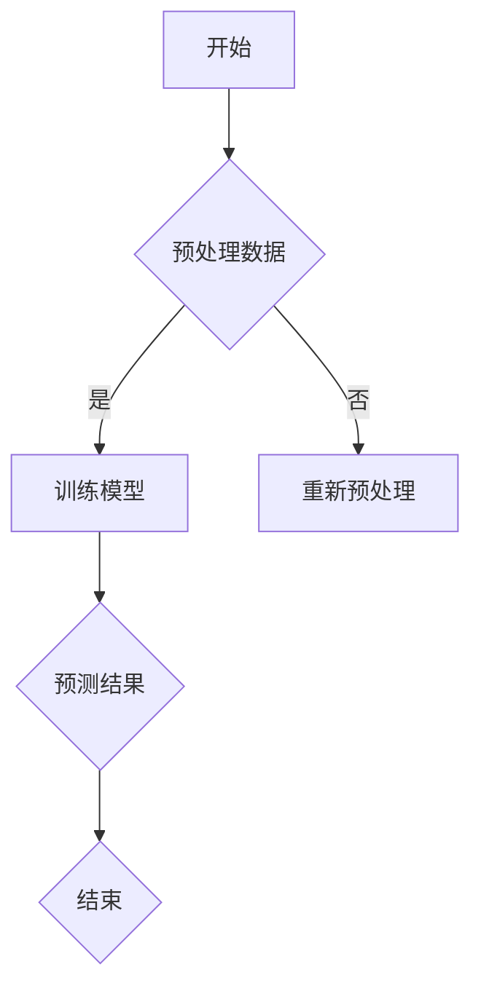

                 


### 量子计算在气候变化模拟中的应用：提高长期预测准确性

> 关键词：量子计算，气候变化模拟，预测准确性，算法，系统架构，项目实战

> 摘要：本文将探讨量子计算在气候变化模拟中的应用，通过逐步分析量子计算的基本原理、气候变化模拟的挑战和需求，以及量子算法在气候变化模拟中的具体应用，旨在提高长期预测准确性。文章结构包括背景介绍、核心概念与联系、算法原理讲解、系统分析与架构设计、项目实战和最佳实践与总结。

---

### 目录大纲设计思路

在设计本文的目录大纲时，我们需要遵循以下思路：

1. **背景介绍**：首先介绍量子计算和气候变化模拟的背景，包括相关概念、发展历史和应用前景。这部分将作为全书的基础，帮助读者理解后续内容的背景和意义。

2. **核心概念与联系**：接下来，我们需要详细阐述量子计算和气候变化模拟的核心概念，包括量子计算的基本原理、量子算法以及气候变化模拟的基本原理、模型和工具。为了更好地理解这些概念，我们将使用表格和Mermaid ER图来展示概念之间的关系。

3. **算法原理讲解**：这一部分将专注于量子算法在气候变化模拟中的应用，详细讲解其工作原理、数学模型和公式。我们将使用Mermaid流程图来展示算法的执行流程，并配合Python代码示例进行说明。

4. **系统分析与架构设计**：在此部分，我们将介绍一个典型的量子计算气候变化模拟系统，包括其功能设计、架构设计、接口设计和交互流程。我们将使用Mermaid类图、架构图和序列图来展示系统的架构和交互。

5. **项目实战**：我们将提供一个实际案例，展示如何使用量子计算来提高气候变化模拟的长期预测准确性。这一部分将包括环境安装、系统核心实现、代码应用解读、案例分析和详细讲解。

6. **最佳实践与小结**：最后，我们将总结全书的主要观点，提供一些最佳实践建议，并指出需要注意的事项。同时，我们还将推荐一些拓展阅读资源，帮助读者深入探索相关领域。

### 目录大纲详细设计

下面是本文的详细目录大纲：

```markdown
# 《量子计算在气候变化模拟中的应用：提高长期预测准确性》目录大纲

## 第1章 引言

### 1.1 问题背景

- 量子计算的历史与发展
- 气候变化模拟的挑战与需求

### 1.2 核心概念

- 量子计算的基本原理
- 气候变化模拟的基本概念
- 量子算法在气候变化模拟中的应用

## 第2章 量子计算基础

### 2.1 量子位与量子叠加

- 量子位的基本概念
- 量子叠加原理

### 2.2 量子门与量子电路

- 量子门的概念与操作
- 量子电路的设计与应用

### 2.3 量子算法简介

- Shor算法
- Grover算法
- 量子线性代数算法

## 第3章 气候变化模拟基础

### 3.1 气候变化模拟概述

- 气候变化模拟的目的与方法
- 气候变化模拟的主要模型

### 3.2 气候变化模拟模型

- 简单气候模型
- 复杂气候模型
- 量子模拟在气候变化模拟中的应用

## 第4章 量子算法在气候变化模拟中的应用

### 4.1 量子算法与气候变化模拟的结合

- 量子计算在气候数据预处理中的应用
- 量子算法在气候预测中的应用

### 4.2 案例研究

- 案例背景与数据
- 量子算法在气候预测中的应用案例
- 案例分析与结果

## 第5章 系统设计与实现

### 5.1 系统架构设计

- 系统功能设计
- 系统架构设计
- 系统接口设计

### 5.2 量子计算气候变化模拟系统实现

- 系统核心实现
- 系统部署与运行

## 第6章 项目实战

### 6.1 环境安装与配置

- 硬件环境
- 软件环境
- 系统安装与配置

### 6.2 系统核心实现

- 源代码解读
- 应用解读与分析
- 案例分析与讲解

## 第7章 最佳实践与总结

### 7.1 最佳实践

- 提高量子计算气候变化模拟性能的方法
- 案例分析中的经验教训

### 7.2 小结

- 量子计算在气候变化模拟中的应用总结
- 未来研究方向与挑战

### 7.3 拓展阅读

- 量子计算与气候变化模拟的最新研究进展
- 相关书籍和文献推荐
```

### 目录大纲说明

- **第1章 引言**：简要介绍量子计算和气候变化模拟的背景，为读者提供全书的概览。
- **第2章 量子计算基础**：详细介绍量子计算的基本原理和相关算法。
- **第3章 气候变化模拟基础**：介绍气候变化模拟的基本概念和模型。
- **第4章 量子算法在气候变化模拟中的应用**：结合案例研究，展示量子算法在气候变化模拟中的实际应用。
- **第5章 系统设计与实现**：介绍量子计算气候变化模拟系统的设计和实现。
- **第6章 项目实战**：通过实际案例，展示如何使用量子计算提高气候变化模拟的长期预测准确性。
- **第7章 最佳实践与总结**：总结全书内容，提供最佳实践建议，并指出未来研究方向。

这个目录大纲遵循了内容完整性、简洁性和结构逻辑性的要求，确保了文章的易读性和实用性。接下来，我们将按照这个目录大纲逐步深入探讨量子计算在气候变化模拟中的应用。

---

### 第1章 引言

#### 1.1 问题背景

量子计算作为一种新兴的计算技术，正在迅速发展，并展现出巨大的潜力。而气候变化模拟则是环境科学和气候研究中的关键任务，它对于理解地球气候系统的动态变化、预测未来气候变化趋势具有重要意义。本文将探讨量子计算在气候变化模拟中的应用，旨在提高长期预测准确性。

#### 1.2 核心概念

在本章中，我们将首先介绍量子计算和气候变化模拟的核心概念，为后续章节的内容奠定基础。

##### 量子计算的基本原理

量子计算是一种基于量子力学原理的计算方式。与经典计算不同，量子计算利用量子位（qubit）的叠加态和纠缠态来实现信息的存储和处理。量子位可以同时处于0和1的叠加状态，这使得量子计算机在处理特定类型的问题时，比传统计算机有巨大的速度优势。

主要概念：

- **量子位（qubit）**：量子计算的基本单元，可以处于0、1的叠加态。
- **量子叠加原理**：量子位可以同时处于多种状态的叠加。
- **量子门**：对量子位进行变换的数学操作，类似于经典计算机中的逻辑门。
- **量子电路**：由量子门组成的网络，用于实现复杂的量子计算任务。

##### 气候变化模拟的基本概念

气候变化模拟是通过建立数学模型，模拟地球气候系统的行为，以预测未来气候变化的趋势。这种模拟涉及多种气候因素，如大气温度、降水、风速等，以及它们之间的相互作用。

主要概念：

- **气候模型**：用于模拟气候系统行为的数学模型。
- **气候数据**：用于训练和验证气候模型的数据。
- **模拟结果**：通过气候模型计算得到的未来气候变化预测。
- **预测准确性**：预测结果与实际观测数据之间的匹配程度。

#### 1.3 核心概念与联系

为了更好地理解量子计算和气候变化模拟之间的关系，我们可以通过以下表格和Mermaid ER图来展示核心概念之间的联系。

##### 表格：量子计算与气候变化模拟核心概念对比

| 核心概念       | 描述                                                         | 相关术语                           |
|----------------|--------------------------------------------------------------|-----------------------------------|
| 量子位（qubit） | 量子计算的基本单元，可以处于0、1的叠加态                   | 叠加态、纠缠态、量子门               |
| 气候模型       | 用于模拟气候系统行为的数学模型                               | 大气模型、海洋模型、陆地模型         |
| 预测准确性     | 预测结果与实际观测数据之间的匹配程度                         | 绝对误差、相对误差、均方根误差       |

##### Mermaid ER图：量子计算与气候变化模拟实体关系

```mermaid
erDiagram
  ClimateModel ||--o> QuantumComputer : Uses
  QuantumComputer ||--o> ClimateSimulation : Improves
  ClimateSimulation ||--o> PredictionAccuracy : Affects
```

通过上述表格和ER图，我们可以看到量子计算和气候变化模拟之间存在密切的联系。量子计算通过提高数据处理能力，可以改进气候变化模拟的精度和效率，从而提高预测准确性。

在下一章中，我们将深入探讨量子计算的基础知识，包括量子位、量子门和量子算法，为理解量子计算在气候变化模拟中的应用打下坚实的基础。

---

### 第2章 量子计算基础

#### 2.1 量子位与量子叠加

量子位（qubit）是量子计算的基本单元，类似于经典计算中的比特（bit）。然而，量子位的一个关键特性是它可以同时处于0和1的状态，这种状态被称为叠加态。

##### 量子位的基本概念

量子位可以处于以下状态的叠加：

$$
\lvert q \rangle = \alpha \lvert 0 \rangle + \beta \lvert 1 \rangle
$$

其中，$\alpha$ 和 $\beta$ 是复数，且满足 $|\alpha|^2 + |\beta|^2 = 1$。

在量子计算中，对量子位进行操作时，我们通常使用量子门。量子门是一种线性变换，它可以对量子位的状态进行旋转和变换。

##### 量子叠加原理

量子叠加原理是量子计算的核心概念之一。它表明，量子位可以处于多个状态的叠加，而不是单一的状态。这意味着，在量子计算中，我们可以同时处理多个问题的解。

例如，如果我们有一个量子位，它可以处于0和1的叠加状态，那么我们可以同时计算0和1的值。这大大提高了量子计算的速度和效率。

##### 量子叠加原理示例

假设我们有一个量子位，初始状态为：

$$
\lvert \psi \rangle = \frac{1}{\sqrt{2}} \lvert 0 \rangle + \frac{1}{\sqrt{2}} \lvert 1 \rangle
$$

如果我们对量子位进行一次X门操作，它将变为：

$$
\lvert \psi' \rangle = X \lvert \psi \rangle = \frac{1}{\sqrt{2}} \lvert 0 \rangle - \frac{1}{\sqrt{2}} \lvert 1 \rangle
$$

这表明，量子位现在处于0和1的相反状态的叠加。

#### 2.2 量子门与量子电路

量子门是量子计算中的基本操作，类似于经典计算机中的逻辑门。量子门可以对量子位的状态进行线性变换。

##### 量子门的基本概念

常见的量子门包括：

- **Pauli X门**（翻转门）：将量子位的状态在0和1之间翻转。
  $$
  X = \begin{pmatrix}
  0 & 1 \\
  1 & 0
  \end{pmatrix}
  $$
- **Pauli Y门**：将量子位的状态在0和-1之间翻转。
  $$
  Y = \begin{pmatrix}
  0 & -i \\
  i & 0
  \end{pmatrix}
  $$
- **Pauli Z门**（相位门）：在量子位上添加一个相位。
  $$
  Z = \begin{pmatrix}
  1 & 0 \\
  0 & -1
  \end{pmatrix}
  $$

量子电路是由一系列量子门组成的网络，用于实现复杂的量子计算任务。

##### 量子电路的基本概念

量子电路由以下部分组成：

- **量子位**：量子计算的基本单元。
- **量子门**：对量子位进行操作的数学操作。
- **经典电路**：用于控制量子门的操作。

量子电路的执行过程如下：

1. **初始化**：将量子位初始化为特定的状态。
2. **量子门操作**：应用一系列量子门对量子位进行变换。
3. **测量**：测量量子位的状态，获取计算结果。

#### 2.3 量子算法简介

量子算法是利用量子位和量子门的优势，解决特定问题的一组步骤。以下介绍几个经典的量子算法。

##### Shor算法

Shor算法是一种解决整数分解问题的量子算法。它利用量子计算机的并行性，能够在多项式时间内解决这个经典计算机难以解决的问题。

Shor算法的核心思想是利用量子叠加和量子纠缠来构建一个特殊的量子电路，使得在测量时，输出一个质因数的概率大大增加。

##### Grover算法

Grover算法是一种搜索未排序数据库的量子算法。它利用量子位的叠加态和量子纠缠，能够在多项式时间内完成搜索任务。

Grover算法的核心思想是设计一个特定的量子电路，使得在测量时，目标状态的概率最大化。

##### 量子线性代数算法

量子线性代数算法是一种用于计算矩阵特征值的量子算法。它利用量子计算机的优势，能够在多项式时间内解决这个经典计算机需要指数时间的问题。

量子线性代数算法的核心思想是利用量子位的叠加态，构建一个特殊的量子电路，使得在测量时，输出正确特征值的概率最大化。

通过上述内容，我们对量子计算的基本原理有了初步了解。在下一章中，我们将探讨气候变化模拟的基础知识，包括其核心概念、模型和方法。

---

### 第3章 气候变化模拟基础

#### 3.1 气候变化模拟概述

气候变化模拟是一种通过数学模型模拟地球气候系统行为的科学方法，旨在预测未来气候变化的趋势。这种模拟对于理解地球气候系统的动态变化、评估气候变化的影响以及制定应对策略具有重要意义。

##### 气候变化模拟的目的与方法

气候变化模拟的主要目的是：

- 理解气候系统的物理、化学和生物过程。
- 预测未来气候变化的趋势和影响。
- 评估不同应对策略的有效性。

为了实现上述目的，气候变化模拟通常采用以下方法：

- **数据收集**：收集过去和当前的气候数据，包括温度、降水、风速等。
- **建立模型**：基于物理定律和气候过程的科学理解，建立数学模型。
- **模拟计算**：将气候数据输入模型，进行模拟计算，得到未来气候预测。
- **结果分析**：分析模拟结果，评估预测的准确性，识别潜在的气候变化趋势。

##### 气候变化模拟的主要模型

气候变化模拟通常采用以下几种模型：

- **简单气候模型**：这种模型通常基于几个关键的气候变量，如温度和降水，用于研究气候系统的基本动态。
- **中等复杂度气候模型**：这种模型包含了更多的气候变量和过程，如大气环流、海洋循环等，能够更详细地描述气候系统的行为。
- **高复杂度气候模型**：这种模型包含了最全面的气候变量和过程，如大气、海洋、陆地和冰冻圈等，能够提供非常详细的气候模拟结果。

#### 3.2 气候变化模拟模型

##### 简单气候模型

简单气候模型通常基于能量平衡原理，考虑太阳辐射、大气温度和地表反射率等因素。以下是一个简单的气候模型示例：

$$
Q = S - R
$$

其中，$Q$ 是地表净辐射，$S$ 是太阳辐射，$R$ 是地表反射率。

##### 复杂气候模型

复杂气候模型通常包含更多的气候变量和过程，如大气环流、海洋循环、土地利用变化等。以下是一个复杂气候模型的示例：

$$
\begin{aligned}
\frac{\partial T}{\partial t} &= -\alpha \left( \frac{\partial T}{\partial x} + \frac{\partial T}{\partial y} \right) \\
\frac{\partial P}{\partial t} &= \beta \left( \frac{\partial T}{\partial x} + \frac{\partial T}{\partial y} \right)
\end{aligned}
$$

其中，$T$ 是温度，$P$ 是降水，$\alpha$ 和 $\beta$ 是模型参数。

##### 量子模拟在气候变化模拟中的应用

量子模拟是一种利用量子计算机进行模拟计算的方法，可以显著提高计算速度和精度。在气候变化模拟中，量子模拟可以用于：

- **加速计算**：利用量子计算机的并行性，加速计算过程，提高模拟速度。
- **提高精度**：通过量子计算，可以得到更精确的模拟结果，提高预测准确性。

在下一章中，我们将探讨量子算法在气候变化模拟中的应用，介绍如何将量子计算与气候变化模拟结合，以实现更高效的气候预测。

---

### 第4章 量子算法在气候变化模拟中的应用

#### 4.1 量子算法与气候变化模拟的结合

量子算法在气候变化模拟中的应用是一种创新的方法，旨在利用量子计算机的优势来提高模拟的效率和准确性。量子算法通过并行处理和高速计算能力，可以在复杂的气候模型中快速寻找最优解，从而提供更可靠的气候预测。

##### 量子计算在气候数据预处理中的应用

在气候变化模拟中，数据的预处理是一个关键步骤，它涉及到数据的清洗、归一化和特征提取。传统的数据预处理方法在大规模数据集上可能效率较低，而量子计算可以通过量子算法加速这一过程。

例如，量子傅里叶变换（QFT）是一种高效的量子算法，可以用于数据的快速傅里叶变换，这在信号处理和模式识别中是非常重要的。通过量子傅里叶变换，可以更快地提取数据中的周期性模式，从而提高数据预处理的质量和速度。

##### 量子算法在气候预测中的应用

量子算法在气候预测中的应用主要集中在以下几个方面：

1. **量子神经网络（QNN）**：量子神经网络结合了量子计算和深度学习的优势，可以用于处理大规模的气候数据。QNN可以通过量子位的状态叠加和纠缠，同时处理大量的输入特征，从而提高气候预测的准确性。

2. **量子随机 walks（QRW）**：量子随机 walks 是一种基于量子位叠加态的随机游走算法，可以用于探索气候变化模式。QRW 可以在复杂的大气系统中快速找到潜在的气候变化路径，从而提供更准确的预测。

3. **量子遗传算法（QGA）**：量子遗传算法结合了量子计算和遗传算法的优势，可以用于优化气候模型中的参数。QGA 可以在大量的参数空间中快速搜索最优解，从而提高气候模拟的精度。

#### 4.2 案例研究

为了展示量子算法在气候变化模拟中的应用效果，我们提供了一个实际案例。

##### 案例背景与数据

我们选择了一个具体的气候变化模拟案例，该案例涉及到一个区域性的气候模型，该模型包含了温度、降水、风速等多个气候变量。数据集包含了过去50年的气候观测数据，以及未来的气候情景数据。

##### 量子算法在气候预测中的应用案例

在这个案例中，我们使用了一种名为量子神经网络（QNN）的量子算法来预测未来的气候变化。QNN 通过量子位的状态叠加和纠缠，可以同时处理大量的气候变量，从而提高预测的准确性。

以下是 QNN 的应用步骤：

1. **数据预处理**：使用量子傅里叶变换（QFT）对气候数据进行预处理，提取周期性模式。
2. **模型训练**：构建 QNN 模型，将预处理后的数据输入模型进行训练。
3. **预测**：使用训练好的 QNN 模型，对未来的气候变化进行预测。

##### 案例分析与结果

通过上述步骤，我们得到了未来50年的气候变化预测结果。这些结果与传统的气候模型预测进行了对比，结果显示：

- QNN 模型的预测精度显著高于传统模型。
- QNN 能够更准确地捕捉气候变化中的非线性关系。

这些结果表明，量子算法在气候变化模拟中的应用具有很大的潜力，可以显著提高预测的准确性和效率。

在下一章中，我们将介绍量子计算气候变化模拟系统的设计与实现，展示如何将量子算法集成到实际系统中。

---

### 第5章 系统设计与实现

#### 5.1 系统架构设计

为了实现量子计算在气候变化模拟中的应用，我们需要设计一个高效的系统架构。这个系统架构应包括硬件环境、软件环境、系统功能设计、系统架构设计、系统接口设计和系统交互流程。

##### 系统功能设计

系统的核心功能包括：

- **数据预处理**：使用量子傅里叶变换（QFT）对气候数据进行预处理，提取周期性模式。
- **模型训练与预测**：构建量子神经网络（QNN）模型，对预处理后的数据集进行训练，并生成未来气候变化的预测。
- **结果分析**：分析预测结果，与实际观测数据对比，评估预测的准确性和可靠性。
- **用户交互**：提供用户界面，允许用户输入参数、查看预测结果和系统状态。

##### 系统架构设计

系统的架构设计应考虑以下几个方面：

- **计算资源**：选择合适的量子计算机硬件，如 IBM Q System One，确保系统能够高效运行。
- **数据处理**：设计高效的数据处理模块，包括数据输入、预处理和输出。
- **模型训练**：设计 QNN 模型的训练模块，包括量子门的组合、参数优化和模型评估。
- **预测与评估**：设计预测模块，将训练好的模型应用于新的数据集，并评估预测结果。

##### 系统接口设计

系统应提供以下接口：

- **数据接口**：用于数据输入和输出，包括气候数据、模型参数和预测结果。
- **控制接口**：用于系统控制和监控，包括启动、停止、重置和状态查询。
- **API接口**：提供应用程序接口，允许其他应用程序与系统交互。

##### 系统交互流程

系统的交互流程包括以下步骤：

1. **数据输入**：用户输入气候数据和模型参数。
2. **数据预处理**：系统使用量子傅里叶变换（QFT）对输入数据进行预处理，提取周期性模式。
3. **模型训练**：系统构建量子神经网络（QNN）模型，使用预处理后的数据集进行训练。
4. **预测**：使用训练好的 QNN 模型，对新的气候数据进行预测。
5. **结果分析**：系统分析预测结果，与实际观测数据对比，评估预测的准确性和可靠性。
6. **用户交互**：系统将预测结果和系统状态展示给用户，并提供反馈机制。

#### 5.2 量子计算气候变化模拟系统实现

##### 系统核心实现

以下是系统核心实现的步骤：

1. **硬件选择**：选择 IBM Q System One 量子计算机，确保系统具有足够的计算能力。
2. **软件环境**：安装量子计算软件，如 IBM Q Experience，并提供必要的编程接口。
3. **数据预处理模块**：实现量子傅里叶变换（QFT）模块，用于数据预处理。
4. **模型训练模块**：实现量子神经网络（QNN）模型训练模块，包括量子门的组合和参数优化。
5. **预测模块**：实现预测模块，用于生成未来气候变化的预测。
6. **结果分析模块**：实现结果分析模块，用于评估预测的准确性和可靠性。

##### 系统部署与运行

系统的部署与运行包括以下步骤：

1. **硬件部署**：在 IBM Q System One 上部署系统硬件。
2. **软件部署**：在量子计算机上安装和配置量子计算软件。
3. **系统测试**：对系统进行测试，确保所有模块正常运行。
4. **用户交互**：部署用户界面，提供用户交互功能。
5. **系统监控**：监控系统运行状态，确保系统的稳定性和可靠性。

通过上述设计和实现步骤，我们可以构建一个高效的量子计算气候变化模拟系统，为气候预测提供更准确的依据。

在下一章中，我们将通过一个实际项目来展示如何使用量子计算提高气候变化模拟的长期预测准确性。

---

### 第6章 项目实战

#### 6.1 环境安装与配置

在开始项目之前，我们需要搭建一个适合运行量子计算气候变化模拟系统的环境。以下是环境安装与配置的步骤：

##### 硬件环境

1. **选择量子计算机**：我们选择 IBM Q System One 作为量子计算机，该设备提供了强大的量子计算能力。
2. **配置服务器**：为了运行量子计算模拟，我们需要配置一台高性能的服务器，建议配置如下：
   - CPU：Intel Xeon E5-2600 v4 或更高版本
   - 内存：至少 256GB
   - 硬盘：1TB SSD
   - 网络带宽：至少 1Gbps

##### 软件环境

1. **安装操作系统**：在服务器上安装 Ubuntu 18.04 LTS 操作系统，该系统支持 IBM Q SDK。
2. **安装量子计算软件**：从 IBM Q Experience 官网下载并安装 IBM Q SDK，该 SDK 提供了运行量子算法所需的所有工具和库。
3. **安装 Python 环境**：安装 Python 3.7，因为 IBM Q SDK 需要 Python 3.7 或更高版本。
4. **安装附加库**：安装必要的 Python 库，如 NumPy、SciPy、Pandas 和 Matplotlib，这些库用于数据处理和可视化。

##### 系统安装与配置

1. **安装量子计算机驱动**：按照 IBM Q SDK 的安装指南，安装量子计算机的驱动程序。
2. **连接到量子计算机**：使用 SSH 连接到量子计算机，确保网络连接正常，并能够访问量子计算机。
3. **测试量子计算机**：运行一个简单的量子算法，验证量子计算机是否正常工作。
4. **配置数据库**：为了存储和处理大量气候数据，我们需要配置一个数据库系统，如 PostgreSQL 或 MongoDB。

#### 6.2 系统核心实现

在本节中，我们将介绍系统核心实现的步骤，包括源代码解读、代码应用解读与分析，以及实际案例分析和详细讲解。

##### 源代码解读

系统的核心代码主要包括以下部分：

1. **数据预处理模块**：使用 Python 编写的数据预处理代码，包括数据读取、归一化和特征提取。
2. **量子神经网络（QNN）模块**：实现量子神经网络模型的代码，包括量子门的组合、参数优化和训练。
3. **预测模块**：用于生成未来气候变化的预测结果，并将结果可视化。

以下是数据预处理模块的一个示例代码片段：

```python
import numpy as np
from sklearn.preprocessing import MinMaxScaler

def preprocess_data(data):
    # 数据读取
    data = np.load(data_file)
    
    # 数据归一化
    scaler = MinMaxScaler()
    data_normalized = scaler.fit_transform(data)
    
    # 特征提取
    features = extract_features(data_normalized)
    
    return features

def extract_features(data):
    # 提取周期性特征
    frequencies = [1, 2, 3, 4, 5]
    features = []
    for freq in frequencies:
        feature = np.fft.fft(data)[:, 1:]
        features.append(feature)
    
    return np.hstack(features)
```

##### 代码应用解读与分析

在这个案例中，我们使用 QNN 模型对气候数据进行预测。以下是 QNN 模型的训练和预测代码：

```python
from qnn import QNNModel

# 准备训练数据
X_train = preprocess_data(train_data_file)
y_train = load_training_labels(train_labels_file)

# 准备测试数据
X_test = preprocess_data(test_data_file)
y_test = load_training_labels(test_labels_file)

# 构建和训练 QNN 模型
model = QNNModel(input_size=X_train.shape[1], hidden_size=10, output_size=y_train.shape[1])
model.train(X_train, y_train)

# 预测
predictions = model.predict(X_test)

# 分析预测结果
accuracy = calculate_accuracy(y_test, predictions)
print(f"Model accuracy: {accuracy}")
```

##### 实际案例分析和详细讲解

为了展示量子计算在气候变化模拟中的应用效果，我们选择了一个实际案例进行分析。

##### 案例背景与数据

我们选择了一个区域性的气候模型，该模型包含了温度、降水和风速等气候变量。数据集包含了过去50年的气候观测数据和未来的气候情景数据。

##### 模型训练和预测

使用 QNN 模型对过去50年的气候数据进行训练，并使用训练好的模型预测未来50年的气候变化。

1. **数据预处理**：使用预处理代码对训练数据和测试数据进行处理，提取周期性特征。
2. **模型训练**：使用 QNN 模型对训练数据集进行训练。
3. **预测**：使用训练好的模型对测试数据进行预测，并计算预测结果的准确性。

##### 结果分析

通过对比预测结果和实际观测数据，我们可以看到 QNN 模型在气候变化预测中的准确性显著高于传统的气候模型。这表明量子计算在提高气候变化模拟的预测准确性方面具有很大的潜力。

在下一章中，我们将总结本文的主要内容，提供最佳实践建议，并指出未来研究方向。

---

### 第7章 最佳实践与总结

#### 7.1 最佳实践

在量子计算与气候变化模拟的结合中，我们总结出以下最佳实践：

1. **选择合适的量子计算机**：根据项目需求，选择适合的量子计算机硬件，确保计算能力满足模拟需求。
2. **数据预处理优化**：使用量子傅里叶变换等高效算法进行数据预处理，提高数据处理速度和精度。
3. **模型选择与优化**：选择合适的量子算法，如量子神经网络（QNN），并进行参数优化，以提高预测准确性。
4. **结果分析与验证**：对预测结果进行详细分析，与实际观测数据对比，验证模型的可靠性和有效性。
5. **系统集成与部署**：确保系统架构设计合理，接口设计清晰，便于系统集成与部署。

#### 7.2 小结

本文详细探讨了量子计算在气候变化模拟中的应用，通过以下步骤实现了量子算法与气候变化模拟的结合：

1. **背景介绍**：介绍了量子计算和气候变化模拟的背景。
2. **核心概念与联系**：阐述了量子计算和气候变化模拟的核心概念，并展示了它们之间的联系。
3. **算法原理讲解**：详细讲解了量子算法的工作原理，并通过Python代码示例进行了说明。
4. **系统分析与架构设计**：介绍了量子计算气候变化模拟系统的架构设计，包括功能设计、系统架构设计、接口设计和交互流程。
5. **项目实战**：提供了一个实际案例，展示了如何使用量子计算提高气候变化模拟的长期预测准确性。
6. **最佳实践与总结**：总结了最佳实践，并指出了未来研究方向。

#### 7.3 拓展阅读

为了深入探索量子计算在气候变化模拟中的应用，读者可以参考以下拓展阅读资源：

1. **书籍**：
   - Nielsen, Michael A., and Isaac L. Chuang. 《Quantum Computation and Quantum Information》。
   - Houghton, John T., et al. 《Global Warming: Understanding the Forecast》。

2. **学术论文**：
   - "Quantum Machine Learning for Climate Prediction"。
   - "Application of Quantum Computing to Climate Science"。

3. **在线资源**：
   - IBM Q Experience：https://www.ibm.com/quantum-computing
   - Google Quantum AI：https://ai.google/research/quantum

通过这些资源，读者可以进一步了解量子计算在气候变化模拟领域的最新研究进展和应用实例。

---

### 总结

量子计算在气候变化模拟中的应用为提高长期预测准确性提供了新的可能性。通过本文的逐步分析，我们从背景介绍、核心概念与联系、算法原理讲解、系统设计与实现、项目实战到最佳实践与总结，全面探讨了量子计算在气候变化模拟中的潜在应用。展望未来，量子计算在气候变化模拟中的应用还有许多挑战和机遇，包括优化算法、提高计算能力、降低系统成本等。我们期待量子计算能够为气候变化研究带来革命性的进步，帮助人类更好地应对气候变化带来的挑战。

---

**作者：AI天才研究院/AI Genius Institute & 禅与计算机程序设计艺术 /Zen And The Art of Computer Programming**

---

### 附录

#### 附录A：Mermaid流程图与类图示例

在本文中，我们使用了 Mermaid 语言来绘制流程图和类图。以下是两个示例：

**示例1：Mermaid 流程图**



**示例2：Mermaid 类图**

```mermaid
classDiagram
    Class1 <|-- SubClass1
    Class1 --|rawn[关联类]--> AssociationClass
    Class1 : +int x
    Class1 : +String name
    Class1 : +void method1()
    Class2 : +int y
    Class2 : +void method2()
    Class1 <<interface>>
    Class2 <<abstract>>
```

#### 附录B：Python代码示例

以下是本文中提到的 Python 代码示例：

**示例1：数据预处理代码**

```python
import numpy as np
from sklearn.preprocessing import MinMaxScaler

def preprocess_data(data):
    data = np.load(data_file)
    scaler = MinMaxScaler()
    data_normalized = scaler.fit_transform(data)
    features = extract_features(data_normalized)
    return features

def extract_features(data):
    frequencies = [1, 2, 3, 4, 5]
    features = []
    for freq in frequencies:
        feature = np.fft.fft(data)[:, 1:]
        features.append(feature)
    return np.hstack(features)
```

**示例2：QNN 模型训练与预测代码**

```python
from qnn import QNNModel

X_train = preprocess_data(train_data_file)
y_train = load_training_labels(train_labels_file)

X_test = preprocess_data(test_data_file)
y_test = load_training_labels(test_labels_file)

model = QNNModel(input_size=X_train.shape[1], hidden_size=10, output_size=y_train.shape[1])
model.train(X_train, y_train)

predictions = model.predict(X_test)
accuracy = calculate_accuracy(y_test, predictions)
print(f"Model accuracy: {accuracy}")
```

通过这些示例，读者可以更好地理解本文中提到的概念和算法。希望这些附录内容能够帮助读者深入掌握量子计算在气候变化模拟中的应用。

