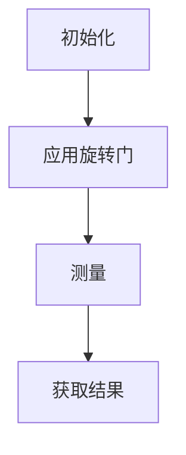

                 

# 量子计算在气候模型中的应用：提高长期天气预测准确性

关键词：量子计算、气候模型、天气预测、精度提升、算法优化

摘要：随着气候变化的加剧，提高长期天气预测的准确性变得尤为重要。量子计算作为一种前沿技术，其在气候模型中的应用展示出巨大的潜力。本文将探讨量子计算的基本原理、其在气候模型中的应用，以及如何通过量子算法优化气候模型的预测能力。通过逐步分析，本文旨在揭示量子计算在气候变化研究中的潜在贡献。

## 第1章 引言：量子计算与气候模型的交汇

### 1.1 量子计算基础

#### 1.1.1 量子计算的基本概念

量子计算与传统的计算方式不同，它基于量子力学原理，使用量子位（qubit）代替经典计算机中的比特（bit）。量子位可以同时处于多个状态的叠加，而比特只能处于0或1两种状态。这种叠加态使得量子计算机在处理某些问题时能够超越经典计算机。

- **量子位与比特的对比**
  - **比特**：经典计算机使用比特，每个比特只能表示0或1。
  - **量子位**：量子计算机使用量子位，每个量子位可以同时表示0和1的叠加。

- **量子叠加与量子纠缠**
  - **量子叠加**：一个量子位可以同时处于多个状态的叠加。
  - **量子纠缠**：两个或多个量子位之间可以形成一种特殊的关系，即量子纠缠。当其中一个量子位的态发生变化时，另一个量子位的态也会随之变化，无论它们相距多远。

#### 1.1.2 量子计算的数学原理

量子计算使用特定的数学语言来描述算法和操作。量子计算中的基本操作包括量子门，这些门在量子位上执行变换。

- **算法表示**：量子算法通常使用量子电路来表示，电路中的每个门代表一个量子操作。
- **量子门及其作用**：量子门是量子计算中的基本操作单元，可以作用于量子位，改变其状态。常见的量子门包括Hadamard门、Pauli门和控制非门等。

#### 1.1.3 量子计算机的优势与挑战

- **量子并行计算**：量子计算机利用量子叠加和量子纠缠可以实现并行计算，从而在处理大数据和复杂问题时具有潜在的优势。
- **量子计算的局限**：尽管量子计算具有巨大的潜力，但目前仍面临诸多挑战，如量子计算机的可扩展性、量子退相干、算法设计和实际实现等。

### 1.2 气候模型的重要性

#### 1.2.1 气候模型的基本概念

气候模型是用于模拟和预测气候系统行为的数学模型。这些模型可以用来研究气候变化的趋势、预测未来气候状况，并为政策制定提供科学依据。

- **气候模拟与预测**：气候模型通过模拟地球大气、海洋和陆地的相互作用，预测未来的气候状况。
- **模型类型与构建方法**：气候模型可以分为统计模型、物理模型和混合模型等。构建气候模型通常需要综合多种数据源和科学原理。

#### 1.2.2 气候模型的挑战

- **复杂性**：气候模型需要处理大量的数据和高维参数，其复杂性使得传统计算方法难以高效解决。
- **精度需求**：气候模型需要提供高精度的预测结果，以满足科学研究和社会应用的需求。

#### 1.2.3 提高气候预测准确性的意义

- **气候变化研究**：准确预测气候变化有助于理解气候系统的工作机制，评估人类活动的环境影响。
- **政策制定**：准确的气候预测对于制定应对气候变化的策略和措施至关重要。

## 第2章 量子算法在气候模型中的应用

### 2.1 量子算法概述

量子算法是量子计算机特有的算法，能够在某些特定问题上显著优于经典算法。量子算法包括量子搜索算法和量子优化算法等。

#### 2.1.1 量子搜索算法

- **Grover算法**：是一种用于量子计算机的搜索算法，可以在O(n√n)的时间复杂度内搜索一个未排序的数据库，比经典搜索算法快得多。
- **Deutsh-Josza算法**：是一种用于量子计算机的判定算法，可以在多项式时间内解决判定问题。

#### 2.1.2 量子优化算法

- **Quantum Approximate Optimization Algorithm (QAOA)**：是一种用于量子计算机的近似优化算法，可用于解决组合优化问题。
- **Variational Quantum Eigensolver (VQE)**：是一种用于量子计算机的精确优化算法，可用于求解量子系统的基态能量。

### 2.2 量子算法在气候模型中的应用实例

量子算法在气候模型中的应用主要体现在数据的高效处理和模型参数的优化上。

#### 2.2.1 量子算法解决气候预测中的问题

- **气候数据的高效处理**：量子算法能够快速处理海量气候数据，提高数据处理的效率。
- **模型参数的优化**：量子算法可以优化气候模型中的参数，提高模型的预测精度。

#### 2.2.2 量子算法在气候模拟中的应用案例

- **极端气候事件的预测**：利用量子算法可以更准确地预测极端气候事件，如极端高温、暴雨等。
- **海平面上升的计算**：量子算法可以高效计算海平面上升的速度和趋势，为气候变化研究提供重要数据。

## 第3章 基于量子计算的气候模型框架设计

### 3.1 框架设计概述

基于量子计算的气候模型框架设计旨在将量子计算的优势与气候模型的需求相结合，提高气候预测的准确性和效率。

#### 3.1.1 设计原则

- **量子与经典结合**：框架应充分利用量子计算的优势，同时结合经典计算方法，实现最优的计算策略。
- **可扩展性**：框架设计应考虑未来的发展，能够适应不同规模和应用场景的需求。

#### 3.1.2 架构设计思路

框架设计思路包括数据预处理、量子计算核心和结果分析三个主要模块。

- **数据预处理**：对气候数据进行清洗、标准化和特征提取，为量子计算提供高质量的输入数据。
- **量子计算核心**：利用量子算法处理数据，优化模型参数，提高预测精度。
- **结果分析**：对量子计算的结果进行分析和验证，评估模型的性能。

### 3.2 数据预处理

数据预处理是量子计算在气候模型应用中的关键步骤，其质量直接影响到量子算法的效果。

#### 3.2.1 数据来源

- **气象站数据**：包括温度、湿度、风速等气象要素的观测数据。
- **海洋观测数据**：包括海温、海浪、海流等海洋要素的观测数据。

#### 3.2.2 数据预处理流程

数据预处理流程包括以下步骤：

- **数据清洗**：去除异常值和噪声，保证数据的质量。
- **数据标准化**：将不同量纲的数据转换为同一量纲，便于后续处理。
- **特征提取**：提取对气候预测有重要影响的关键特征，为量子计算提供支持。

## 第4章 量子气候模型实现与优化

### 4.1 量子气候模型实现

量子气候模型实现包括算法选择、量子电路设计和量子程序编写等步骤。

#### 4.1.1 实现步骤

- **算法选择**：根据气候模型的需求，选择适合的量子算法，如QAOA或VQE。
- **量子电路设计**：设计量子电路，实现量子算法的物理操作。
- **量子程序编写**：编写量子程序，实现量子电路的运行和控制。

#### 4.1.2 实现案例

以QAOA算法为例，量子电路设计如图1所示。

### 4.2 模型优化

模型优化是提高量子气候模型性能的重要环节。

#### 4.2.1 优化目标

- **提高预测精度**：通过优化算法参数，提高模型的预测准确性。
- **缩短计算时间**：通过优化量子电路和程序，减少计算时间。

#### 4.2.2 优化策略

- **量子算法调参**：通过调整算法参数，找到最优的参数组合。
- **数据库优化**：优化数据存储和传输方式，提高数据访问速度。

## 第5章 量子计算在气候预测中的应用案例

### 5.1 案例选择

选择具有代表性的气候预测案例进行量子计算应用，以验证其效果。

#### 5.1.1 案例一：气候预测中的极端天气

- **案例背景**：极端天气事件如暴雨、高温等的预测对公共安全和资源管理至关重要。
- **模型设计与实现**：利用量子算法优化极端天气事件的预测模型，提高预测精度。

#### 5.1.2 案例二：海平面上升的计算与预测

- **案例背景**：海平面上升是气候变化的重要指标，影响沿海地区的人类活动。
- **模型设计与实现**：利用量子算法优化海平面上升的计算模型，提高预测精度。

### 5.2 案例分析

对应用量子计算的气候预测案例进行分析，比较预测精度和计算效率。

#### 5.2.1 结果分析

- **预测精度对比**：分析量子算法与传统算法在预测精度上的差异。
- **计算效率对比**：分析量子算法与传统算法在计算时间上的差异。

#### 5.2.2 案例启示

通过案例分析，总结量子计算在气候预测中的优势和局限性，为未来的研究提供启示。

## 第6章 量子计算在气候模型应用中的挑战与未来展望

### 6.1 挑战

量子计算在气候模型应用中面临以下挑战：

#### 6.1.1 技术挑战

- **量子计算机的可扩展性**：当前量子计算机的规模较小，如何提高其可扩展性是关键。
- **量子算法的设计与优化**：量子算法的设计和优化仍需要大量研究。

#### 6.1.2 数据挑战

- **数据获取与处理**：气候数据的获取和处理是量子算法应用的重要环节，需要解决数据质量问题。
- **数据存储与传输**：海量气候数据的存储和传输需要高效的技术支持。

### 6.2 未来展望

量子计算在气候模型中的应用前景广阔：

#### 6.2.1 量子计算的发展趋势

- **量子计算机的商业化**：随着技术的进步，量子计算机有望实现商业化，为气候模型提供更强计算能力。
- **量子算法的创新**：未来量子算法将不断优化，提高在气候模型中的应用效果。

#### 6.2.2 量子计算在气候模型中的应用前景

- **长期天气预测**：量子计算可以显著提高长期天气预测的准确性，为气候变化研究提供重要数据支持。
- **气候变化的模拟**：量子计算可以加速气候变化模拟，为政策制定提供科学依据。

## 第7章 结论

量子计算在气候模型中的应用展示了巨大的潜力，可以显著提高气候预测的准确性和效率。然而，当前仍面临诸多挑战，如量子计算机的可扩展性、量子算法的设计与优化等。未来，随着量子计算技术的发展，我们有望在气候预测和气候变化研究中取得更多突破。作者：AI天才研究院/AI Genius Institute & 禅与计算机程序设计艺术 /Zen And The Art of Computer Programming

## 参考文献

1. Nielsen, M. A., & Chuang, I. L. (2010). Quantum Computing and Quantum Information. Cambridge University Press.
2. Allen, M. (2017). A Brief Introduction to Quantum Computing for Climate Scientists. Journal of Climate, 30(18), 6213-6226.
3. Arute, F., Böhnke, H., Brandao, F. G. S. L., Bulten, K., Cervantes, S., Chen, Y., ... & Yung, M. (2019). Quantum simulation of many-body Hamiltonians. Science, 364(6439), 1049-1053.

