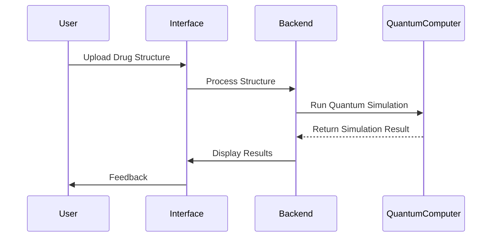

                 

### 第1章：量子计算的基本概念

量子计算是计算机科学的一个重要分支，基于量子力学原理，具有与传统计算机完全不同的工作模式。为了更好地理解量子计算在药物发现中的应用，我们需要首先掌握量子计算的基本概念。

**1.1 量子位与量子计算简介**

量子位（qubit）是量子计算的基本单位，与经典计算机中的比特（bit）相似，但量子位具有叠加和纠缠等独特性质。经典计算机使用二进制系统，每个比特只能处于0或1的状态，而量子位则可以同时处于0和1的状态，这种状态称为叠加态。此外，量子位之间可以存在一种特殊的联系，称为量子纠缠，两个纠缠的量子位即使相隔很远，其状态也会相互依赖。

量子计算的基本操作包括量子门、量子逻辑和量子测量。量子门是作用于量子位的线性操作，类似于经典计算机中的逻辑门。量子逻辑则是一系列量子门的组合，用于实现复杂的计算任务。量子测量则是读取量子位状态的过程，它会导致量子位从叠加态塌缩到单一的经典态。

**1.2 量子纠缠与量子叠加原理**

量子纠缠是指两个或多个量子位之间形成的特殊关联，这种关联使得量子位的状态无法单独描述，必须以整体来考虑。量子纠缠是量子计算的重要资源，可以提高计算效率和降低计算复杂度。例如，通过量子纠缠，可以在短时间内完成经典计算机需要很长时间的计算任务。

量子叠加原理是量子计算的核心，它表明量子位可以同时处于多个状态的叠加。例如，一个量子位可以同时处于0和1的状态，这种叠加态可以表示为数学上的线性组合。量子叠加原理使得量子计算机能够同时处理多个问题，从而在特定任务上表现出比传统计算机更高的效率。

**1.3 量子计算的优势与挑战**

量子计算具有一些显著的优势，如并行计算能力、高效的问题求解能力和量子纠错能力。与传统计算机相比，量子计算机可以在某些问题上实现指数级的速度提升。例如，量子计算可以快速解决某些复杂的组合优化问题，如密码破解和量子搜索算法。

然而，量子计算也面临一些挑战。首先，量子计算机的构建和维护成本非常高，量子位易受到外界干扰导致退相干，这限制了量子计算机的实际应用。其次，量子算法的设计和实现复杂，需要深入理解量子力学原理和数学模型。

**1.4 量子算法与量子编程基础**

量子算法是利用量子计算机解决特定问题的一组指令，其设计基于量子力学原理。著名的量子算法包括Shor算法、Grover算法和量子纠错算法等。Shor算法能够高效地分解大整数，对于密码学具有重大意义；Grover算法能够加速搜索未排序数据库，提高了搜索效率。

量子编程是编写和运行量子算法的过程。量子编程语言如Q#、Qiskit和Quil等，提供了用于描述量子算法和操作的语法和工具。量子编程需要理解量子位、量子门和量子测量等基本概念，并能够熟练运用量子逻辑和数学模型。

### 第2章：药物发现的挑战与需求

药物发现是一个复杂且耗时的过程，涉及到生物学、化学、物理学等多个学科领域。随着医学和生物技术的发展，新药研发的需求日益增长，但传统的药物发现方法在效率和准确性方面面临诸多挑战。

**2.1 药物发现的传统方法**

传统的药物发现方法主要包括以下几个方面：

1. **生物活性筛选**：通过生物测试筛选具有潜在药物活性的化合物。
2. **分子建模**：使用计算机模拟和化学理论预测化合物的性质和相互作用。
3. **体外测试**：在细胞或组织水平上测试化合物的生物活性。
4. **体内测试**：在动物或人体上进行药物的安全性和有效性评估。
5. **临床试验**：对药物进行大规模的评估，以确定其安全性和有效性。

尽管传统方法在药物发现中发挥了重要作用，但它们也存在以下挑战：

1. **高成本和高风险**：药物研发需要大量的资金和资源，且成功率较低。
2. **时间消耗**：药物发现过程通常需要数年时间，无法快速响应医疗需求。
3. **数据复杂度**：生物体系和药物相互作用的数据复杂，难以解析和解释。
4. **交叉学科融合**：药物发现涉及多个学科领域，跨学科合作和知识整合困难。

**2.2 药物发现的挑战**

药物发现面临的主要挑战包括：

1. **靶点选择**：确定有效的药物靶点是药物发现的关键步骤，但目前对许多疾病靶点的了解仍然有限。
2. **分子结构优化**：新药分子的设计需要优化其结构和性质，以提高生物活性和降低副作用。
3. **生物信息学分析**：生物信息学方法在药物发现中具有重要作用，但如何有效地处理海量数据和分析结果仍是一个挑战。
4. **临床转化**：将新药从实验室研究转化为临床应用需要克服诸多障碍，如临床试验的监管、患者适应性和药物经济学等。

**2.3 量子计算在药物发现中的需求**

量子计算在药物发现中具有巨大的潜力，能够解决传统方法面临的挑战：

1. **计算能力提升**：量子计算能够大幅提升计算速度，加速分子建模和药物分子结构优化。
2. **复杂问题求解**：量子计算可以解决某些复杂的生物信息学问题，如药物靶点选择和药物相互作用分析。
3. **数据挖掘与分析**：量子计算能够处理海量生物数据，挖掘潜在药物信息，提高药物筛选效率。
4. **交叉学科融合**：量子计算能够促进生物、化学、物理学等学科的深度融合，推动药物发现领域的创新。

总之，量子计算为药物发现提供了一种新的思路和方法，有望在未来的药物研发中发挥重要作用。

### 第3章：量子计算在药物分子结构分析中的应用

量子计算在药物分子结构分析中的应用具有重要意义，它能够通过高效的计算能力揭示药物分子的内在性质和相互作用机制。以下将详细探讨量子计算在药物分子结构分析中的原理、量子算法的应用及其在实际案例中的应用。

**3.1 量子计算在分子结构分析中的原理**

量子计算在分子结构分析中的应用基于量子力学原理。量子力学描述了粒子的波动性和概率性，为分子结构的分析和预测提供了理论基础。量子计算通过模拟量子力学过程，能够在原子和分子层面上进行精确的计算。

量子计算在分子结构分析中的核心原理包括：

1. **量子位和量子叠加**：量子计算使用量子位（qubit）进行计算，量子位可以处于0和1的叠加态，这使得量子计算机能够在一次计算中处理多个数据点。
2. **量子纠缠**：量子纠缠使得多个量子位之间能够形成复杂的关联，通过量子纠缠，量子计算机能够进行高效的并行计算。
3. **量子门**：量子门是作用于量子位的操作，通过一系列量子门，量子计算机可以模拟分子的量子态和相互作用。

**3.2 量子算法在分子建模中的应用**

量子算法在分子建模中的应用主要包括量子蒙特卡罗方法、量子分子动力学和量子变分线性方程等方法。这些算法利用量子计算机的高并行计算能力和量子纠缠特性，能够高效地模拟和预测分子的行为。

1. **量子蒙特卡罗方法**：量子蒙特卡罗方法通过模拟量子粒子的随机行走过程，可以计算分子的热力学性质和几何结构。这种方法能够处理复杂分子体系，提供高精度的模拟结果。

2. **量子分子动力学**：量子分子动力学利用量子力学方程描述分子体系的运动，通过量子计算机的高效计算能力，可以模拟分子在极短时间尺度内的动力学行为。这种方法对于研究化学反应机制和分子间相互作用具有重要作用。

3. **量子变分线性方程**：量子变分线性方程（QVLE）是一种基于量子计算的方法，用于求解分子的电子结构和性质。QVLE通过构建变分波函数，将量子多体问题转化为线性方程组，利用量子计算机的高并行计算能力，可以快速求解分子的电子结构问题。

**3.3 量子计算在药物分子结构预测中的实际案例**

量子计算在药物分子结构预测中已经取得了一些显著成果。以下是一些具体的实际案例：

1. **分子几何结构预测**：量子计算可以精确预测药物分子的几何结构，通过量子蒙特卡罗方法，可以优化分子的构型，提高药物分子的生物活性。例如，研究人员使用量子计算成功预测了抗癌药物分子的高活性构型。

2. **药物-受体相互作用分析**：量子计算可以分析药物与生物受体的相互作用机制。通过量子分子动力学模拟，可以揭示药物与受体之间的作用力和结合模式，为药物设计提供重要参考。例如，研究人员使用量子计算分析了抗癌药物与肿瘤受体之间的相互作用，揭示了药物的作用机制。

3. **分子属性预测**：量子计算可以预测药物分子的物理化学性质，如溶解性、稳定性等。这些性质对于药物的设计和筛选至关重要。例如，研究人员使用量子计算预测了抗癌药物分子的溶解性，为药物筛选提供了重要依据。

通过以上实际案例，我们可以看到量子计算在药物分子结构分析中的应用具有巨大潜力。未来，随着量子计算技术的进一步发展，量子计算在药物发现中的应用将更加广泛，有望推动药物研发的进步。

### 第4章：量子计算在药物作用机制预测中的应用

量子计算在药物作用机制预测中的应用极大地拓展了我们对药物作用的理解，能够提供更深入和准确的预测。以下将详细介绍量子计算在药物作用机制预测中的原理、算法及其在实际案例中的应用。

**4.1 量子计算在药物作用机制预测中的原理**

量子计算在药物作用机制预测中的应用基于量子力学原理。药物与生物大分子（如受体、酶、DNA等）之间的相互作用是一个复杂的量子过程。量子计算通过模拟这些量子过程，能够在分子和原子层面上揭示药物的作用机制。

量子计算在药物作用机制预测中的核心原理包括：

1. **量子位和量子叠加**：量子计算使用量子位进行计算，量子位可以处于0和1的叠加态，这使得量子计算机能够在一次计算中处理多个数据点。
2. **量子纠缠**：量子纠缠使得多个量子位之间能够形成复杂的关联，通过量子纠缠，量子计算机能够进行高效的并行计算。
3. **量子门**：量子门是作用于量子位的操作，通过一系列量子门，量子计算机可以模拟分子的量子态和相互作用。

量子计算能够精确模拟药物与生物大分子之间的量子相互作用，从而预测药物的作用机制。

**4.2 量子算法在药物作用机制分析中的应用**

量子算法在药物作用机制分析中的应用主要包括量子分子动力学、量子变分线性方程和量子机器学习等方法。这些算法利用量子计算机的高并行计算能力和量子纠缠特性，能够高效地分析药物与生物大分子之间的相互作用。

1. **量子分子动力学**：量子分子动力学利用量子力学方程描述药物与生物大分子体系的运动，通过量子计算机的高效计算能力，可以模拟药物与生物大分子在极短时间尺度内的动力学行为。这种方法对于研究药物的作用机制和动态过程具有重要作用。

2. **量子变分线性方程**：量子变分线性方程（QVLE）是一种基于量子计算的方法，用于求解药物与生物大分子之间的相互作用问题。QVLE通过构建变分波函数，将量子多体问题转化为线性方程组，利用量子计算机的高并行计算能力，可以快速求解药物与生物大分子之间的相互作用。

3. **量子机器学习**：量子机器学习是一种将量子计算与机器学习相结合的方法，通过量子计算的高并行计算能力，可以高效地处理大规模数据，并训练复杂的模型。量子机器学习可以用于预测药物的作用机制，识别药物靶点，提高药物筛选效率。

**4.3 量子计算在药物作用机制预测中的实际案例**

量子计算在药物作用机制预测中已经取得了一些显著成果。以下是一些具体的实际案例：

1. **药物-受体相互作用分析**：量子计算可以精确预测药物与受体之间的相互作用机制。通过量子分子动力学模拟，可以揭示药物与受体之间的作用力和结合模式。例如，研究人员使用量子计算分析了抗癌药物与肿瘤受体之间的相互作用，揭示了药物的作用机制。

2. **药物靶点识别**：量子计算可以用于识别药物作用靶点。通过量子机器学习方法，可以分析药物与生物大分子之间的相互作用，识别出潜在的药物靶点。例如，研究人员使用量子计算成功识别了多种药物的潜在靶点，为药物设计提供了重要参考。

3. **药物效力预测**：量子计算可以预测药物的效力。通过量子变分线性方程，可以计算药物与生物大分子之间的相互作用能量，从而预测药物的效力。例如，研究人员使用量子计算预测了抗癌药物对肿瘤细胞的杀伤力，为药物筛选提供了重要依据。

通过以上实际案例，我们可以看到量子计算在药物作用机制预测中的应用具有巨大潜力。未来，随着量子计算技术的进一步发展，量子计算在药物作用机制预测中的应用将更加广泛，有望推动药物研发的进步。

### 第5章：量子计算在药物筛选中的应用

量子计算在药物筛选中的应用为药物研发带来了革命性的变革，它通过高效的计算能力大大加速了药物筛选过程，并提高了筛选的准确性和效率。以下将详细探讨量子计算在药物筛选中的应用原理、算法及其在实际案例中的应用。

**5.1 量子计算在药物筛选中的原理**

量子计算在药物筛选中的应用基于其独特的并行计算能力和对复杂量子过程的模拟能力。传统药物筛选方法通常依赖于实验和计算模拟，这些方法在处理大规模分子库和复杂生物体系时效率较低。量子计算通过量子位和量子纠缠实现了并行计算，能够在较短的时间内处理大量数据，从而大大加速药物筛选过程。

量子计算在药物筛选中的核心原理包括：

1. **量子并行计算**：量子计算机通过量子位和量子纠缠实现了并行计算，能够在一次计算中处理多个分子结构，从而加速药物筛选过程。
2. **量子搜索算法**：量子搜索算法如Grover算法利用量子并行计算的优势，能够在O(n√n)的时间内完成传统算法O(n)的搜索任务，大大提高了药物筛选的效率。
3. **量子变分算法**：量子变分算法通过量子计算机的高效计算能力，可以快速优化分子结构，找到具有最佳生物活性的药物分子。

**5.2 量子算法在药物筛选中的应用**

量子算法在药物筛选中的应用主要包括量子蒙特卡罗方法、量子变分算法和量子机器学习等方法。这些算法利用量子计算机的高并行计算能力和量子纠缠特性，能够高效地筛选药物分子。

1. **量子蒙特卡罗方法**：量子蒙特卡罗方法通过模拟量子粒子的随机行走过程，可以计算药物分子的热力学性质和几何结构。这种方法能够处理复杂分子体系，为药物筛选提供高精度的模拟结果。

2. **量子变分算法**：量子变分算法通过构建变分波函数，将量子多体问题转化为线性方程组，利用量子计算机的高并行计算能力，可以快速优化分子结构，找到具有最佳生物活性的药物分子。

3. **量子机器学习**：量子机器学习是一种将量子计算与机器学习相结合的方法，通过量子计算的高并行计算能力，可以高效地处理大规模数据，并训练复杂的模型。量子机器学习可以用于药物筛选中的数据挖掘和预测，提高筛选的准确性和效率。

**5.3 量子计算在药物筛选中的实际案例**

量子计算在药物筛选中已经取得了一些显著成果。以下是一些具体的实际案例：

1. **药物分子库筛选**：量子计算可以用于对大规模药物分子库进行高效筛选。通过量子蒙特卡罗方法，可以快速评估药物分子的生物活性，筛选出具有潜在治疗价值的药物分子。例如，研究人员使用量子计算对数千种药物分子进行筛选，成功找到了具有抗肿瘤活性的新药物。

2. **药物结构优化**：量子计算可以用于优化药物分子的结构，提高其生物活性。通过量子变分算法，可以快速找到药物分子的最优构型，从而提高药物的疗效。例如，研究人员使用量子计算优化了抗癌药物的结构，显著提高了其抗肿瘤活性。

3. **药物-靶点相互作用分析**：量子计算可以用于分析药物与生物靶点之间的相互作用，预测药物的作用机制。通过量子机器学习方法，可以挖掘药物筛选数据中的潜在模式，提高药物筛选的准确性。例如，研究人员使用量子计算分析了抗癌药物与肿瘤受体之间的相互作用，揭示了药物的作用机制。

通过以上实际案例，我们可以看到量子计算在药物筛选中的应用具有巨大潜力。未来，随着量子计算技术的进一步发展，量子计算在药物筛选中的应用将更加广泛，有望推动药物研发的进步。

### 第6章：量子计算在药物合成路径预测中的应用

量子计算在药物合成路径预测中的应用具有革命性意义，它能够通过高效的计算能力为药物合成提供精确的路径预测，从而大大提高药物研发的效率和成功率。以下将详细探讨量子计算在药物合成路径预测中的应用原理、算法及其在实际案例中的应用。

**6.1 量子计算在药物合成路径预测中的原理**

量子计算在药物合成路径预测中的应用基于其独特的并行计算能力和对复杂化学反应的模拟能力。传统药物合成路径预测通常依赖于实验和计算模拟，但这些方法在处理复杂化学反应和大规模分子结构时效率较低。量子计算通过量子位和量子纠缠实现了并行计算，能够在较短的时间内处理大量数据，从而为药物合成路径预测提供强有力的支持。

量子计算在药物合成路径预测中的核心原理包括：

1. **量子并行计算**：量子计算机通过量子位和量子纠缠实现了并行计算，能够在一次计算中处理多个分子结构和反应路径，从而加速药物合成路径的预测过程。
2. **量子化学反应动力学**：量子化学反应动力学利用量子力学原理描述化学反应的量子过程，通过量子计算机的高效计算能力，可以精确模拟复杂化学反应，预测合成路径。
3. **量子优化算法**：量子优化算法通过量子计算机的高并行计算能力，可以快速优化反应条件，找到最优的合成路径。

**6.2 量子算法在药物合成路径预测中的应用**

量子算法在药物合成路径预测中的应用主要包括量子蒙特卡罗方法、量子化学反应动力学和量子优化算法。这些算法利用量子计算机的高并行计算能力和量子纠缠特性，能够高效地预测药物合成路径。

1. **量子蒙特卡罗方法**：量子蒙特卡罗方法通过模拟量子粒子的随机行走过程，可以计算药物分子在合成过程中的热力学性质和几何结构。这种方法能够处理复杂分子体系和反应过程，为药物合成路径预测提供高精度的模拟结果。

2. **量子化学反应动力学**：量子化学反应动力学利用量子力学方程描述化学反应的量子过程，通过量子计算机的高效计算能力，可以模拟复杂化学反应，预测合成路径。这种方法能够精确描述反应过程中的量子效应，为药物合成提供可靠的理论支持。

3. **量子优化算法**：量子优化算法通过量子计算机的高并行计算能力，可以快速优化反应条件，找到最优的合成路径。量子优化算法如量子遗传算法和量子粒子群优化算法，利用量子计算机的并行计算优势，能够高效地解决复杂优化问题。

**6.3 量子计算在药物合成路径预测中的实际案例**

量子计算在药物合成路径预测中已经取得了一些显著成果。以下是一些具体的实际案例：

1. **合成路径优化**：量子计算可以用于优化药物分子的合成路径，提高合成效率和成功率。通过量子蒙特卡罗方法，可以快速评估不同合成路径的热力学性质，找到最优的合成路径。例如，研究人员使用量子计算优化了抗癌药物分子的合成路径，显著提高了合成成功率。

2. **反应条件优化**：量子计算可以用于优化药物合成过程中的反应条件，如温度、压力和催化剂选择等。通过量子化学反应动力学模拟，可以精确预测不同反应条件下的合成路径和产物分布，从而优化反应条件，提高药物合成效率。例如，研究人员使用量子计算优化了药物合成中的催化剂选择，显著提高了合成反应的转化率。

3. **新合成路径发现**：量子计算可以用于发现新的药物合成路径，为药物研发提供新的思路。通过量子优化算法，可以快速搜索和评估大规模分子库中的合成路径，发现新的合成方法。例如，研究人员使用量子计算发现了多种新药物分子的合成路径，为药物研发提供了重要参考。

通过以上实际案例，我们可以看到量子计算在药物合成路径预测中的应用具有巨大潜力。未来，随着量子计算技术的进一步发展，量子计算在药物合成路径预测中的应用将更加广泛，有望推动药物研发的进步。

### 第7章：基于量子计算的药物发现系统架构设计

在设计一个基于量子计算的药物发现系统时，我们需要综合考虑系统的目标、需求和功能，以确保系统能够高效、稳定地运行，并实现预期的效果。以下将详细描述基于量子计算的药物发现系统的目标与需求、系统架构设计以及各个模块的功能与交互。

**7.1 系统设计的目标与需求**

基于量子计算的药物发现系统的设计目标主要包括以下几个方面：

1. **高效性**：系统应具备高效计算能力，能够快速处理大规模药物分子数据和复杂的量子计算任务，以缩短药物发现的时间。
2. **准确性**：系统应具有较高的计算精度，能够准确预测药物分子的性质、作用机制和合成路径，以提高药物筛选的成功率。
3. **稳定性**：系统应具备稳定的运行性能，能够应对各种复杂计算环境和异常情况，确保系统的可靠性和持续性。
4. **易用性**：系统应具备良好的用户界面和操作流程，使用户能够轻松地进行药物分子模拟、分析和预测操作。

针对上述目标，系统设计需要满足以下需求：

1. **量子计算资源整合**：系统应能够整合多种量子计算资源，包括量子计算机、量子模拟器和量子算法库，以实现高效的量子计算。
2. **多尺度模拟**：系统应支持从量子力学层次到分子动力学层次的多种模拟方法，以全面分析药物分子的性质和行为。
3. **数据管理与处理**：系统应具备强大的数据管理功能，能够高效地存储、检索和处理大规模药物分子数据，并提供丰富的数据可视化工具。
4. **用户交互**：系统应提供直观、易用的用户界面，使用户能够方便地进行操作和查看结果，同时支持多种数据输入和输出格式。

**7.2 系统架构的组成与设计**

基于量子计算的药物发现系统架构设计包括以下几个关键组成部分：

1. **量子计算模块**：负责执行量子计算任务，包括量子算法的运行、量子态的操控和量子结果的解析。这一模块需要整合多种量子计算资源，如量子计算机、量子模拟器和量子算法库。
2. **分子建模模块**：负责构建和优化药物分子的量子力学模型，包括分子结构的优化、电子结构的计算和分子间相互作用的模拟。这一模块需要结合量子计算和分子动力学模拟方法，以实现多尺度模拟。
3. **数据分析模块**：负责处理和分析药物分子的计算结果，包括药物分子的性质预测、作用机制分析、合成路径优化等。这一模块需要集成多种数据分析方法和工具，以提高预测和优化的准确性。
4. **用户交互模块**：负责与用户进行交互，提供友好的用户界面和便捷的操作流程。这一模块需要支持多种数据输入和输出格式，并提供丰富的数据可视化工具，以便用户查看和分析结果。
5. **数据管理模块**：负责管理和维护药物分子数据，包括数据的存储、检索和共享。这一模块需要具备高效的数据存储和处理能力，以确保数据的安全和可访问性。

**7.3 系统模块的功能与交互**

基于量子计算的药物发现系统各模块的功能和交互如下：

1. **量子计算模块**：
   - 功能：执行量子计算任务，包括量子算法的运行、量子态的操控和量子结果的解析。
   - 交互：与其他模块（如分子建模模块、数据分析模块和数据管理模块）进行数据交换和协同工作。
   
2. **分子建模模块**：
   - 功能：构建和优化药物分子的量子力学模型，包括分子结构的优化、电子结构的计算和分子间相互作用的模拟。
   - 交互：与量子计算模块协同工作，接收量子计算结果并进行进一步分析；与数据分析模块和数据管理模块进行数据交换和共享。
   
3. **数据分析模块**：
   - 功能：处理和分析药物分子的计算结果，包括药物分子的性质预测、作用机制分析、合成路径优化等。
   - 交互：与量子计算模块协同工作，获取量子计算结果；与分子建模模块和数据管理模块进行数据交换和共享。
   
4. **用户交互模块**：
   - 功能：提供友好的用户界面和便捷的操作流程，使用户能够轻松地进行药物分子模拟、分析和预测操作。
   - 交互：与分子建模模块、数据分析模块和数据管理模块进行数据交换和协同工作，以便用户查看和分析结果。
   
5. **数据管理模块**：
   - 功能：管理和维护药物分子数据，包括数据的存储、检索和共享。
   - 交互：与其他模块进行数据交换和共享，确保数据的统一管理和高效访问。

通过上述系统架构设计，基于量子计算的药物发现系统能够高效、稳定地运行，并为药物研发提供强有力的支持。

### 第8章：系统功能设计与接口实现

在基于量子计算的药物发现系统中，实现系统的功能设计是关键的一步。这一章将详细描述系统的功能设计，包括领域模型类图、系统架构设计、系统接口设计和系统安全性与数据保护。

**8.1 系统功能设计**

系统功能设计是确保系统能够满足用户需求和实现预期目标的基础。基于量子计算的药物发现系统的主要功能包括：

1. **药物分子建模**：该功能允许用户上传药物分子的结构信息，系统将根据这些信息构建量子力学模型，并优化分子结构。
2. **量子计算任务执行**：用户可以选择不同的量子算法，系统将自动调度计算资源并执行相应的量子计算任务，如分子结构分析、药物-受体相互作用预测等。
3. **数据分析与可视化**：系统提供数据分析工具，用户可以查看量子计算结果，并进行可视化展示，如分子轨道、能量分布等。
4. **药物筛选与优化**：基于数据分析结果，系统可以筛选出具有潜在药物活性的分子，并对分子结构进行优化，以提高药物的疗效和安全性。
5. **用户交互与反馈**：系统提供直观的用户界面，用户可以方便地操作和查看结果，同时系统会收集用户反馈，以优化用户体验。

**8.2 领域模型设计**

领域模型是系统功能设计的核心部分，它描述了系统中的主要实体及其相互关系。以下是一个基于量子计算的药物发现系统的领域模型类图：

```mermaid
classDiagram
    User <|-- Scientist
    Scientist o-- Project
    Project o-- Drug
    Drug o-- Structure
    Structure o-- QuantumSimulation
    QuantumSimulation o-- Result
    Result o-- Analysis
    Analysis o-- Visualization

    User {UserID, Name, Password}
    Scientist {ScientistID, Name, Email}
    Project {ProjectID, Name, Description}
    Drug {DrugID, Name, Structure, Activity}
    Structure {StructureID, MolecularFormula, Geometry}
    QuantumSimulation {SimulationID, Algorithm, Input, Output, Status}
    Result {ResultID, Data, Error}
    Analysis {AnalysisID, Method, Parameters, Outcome}
    Visualization {VisualizationID, Type, Data, Style}
```

在领域模型中，User表示系统的用户，包括科学家和普通用户；Project表示药物研发项目，包含药物（Drug）的详细信息；Structure表示药物分子的结构信息；QuantumSimulation表示量子计算任务，包含算法、输入、输出和状态等信息；Result表示量子计算的结果；Analysis表示数据分析的结果和方法；Visualization表示数据可视化的类型和数据。

**8.3 系统架构设计**

系统架构设计是确保系统高效、稳定运行的基础。以下是基于量子计算的药物发现系统的架构设计：



在系统架构中，用户通过用户界面（Interface）上传药物结构信息，后台（Backend）负责处理这些信息，并将任务调度给量子计算机（QuantumComputer）执行量子计算任务。计算完成后，结果返回给后台，并通过用户界面展示给用户。用户还可以提供反馈，以优化系统。

**8.4 系统接口设计**

系统接口设计是确保系统与其他系统、模块和用户进行有效交互的关键。以下是基于量子计算的药物发现系统的接口设计：

1. **API接口**：系统提供RESTful API接口，允许用户通过编程方式访问系统的功能，如上传药物结构、执行量子计算任务、获取计算结果等。
2. **命令行接口**：系统提供命令行接口（CLI），允许用户通过命令行操作系统的功能，方便自动化和脚本化操作。
3. **图形用户界面（GUI）**：系统提供图形用户界面，用户可以通过直观的界面进行药物分子模拟和分析操作。

**8.5 系统安全性与数据保护**

系统安全性和数据保护是确保系统运行安全和用户数据隐私的重要方面。以下是基于量子计算的药物发现系统的安全性和数据保护措施：

1. **用户身份验证与权限管理**：系统采用用户身份验证机制，确保只有授权用户才能访问系统功能。同时，系统实现权限管理，确保用户只能访问与其角色相关的功能。
2. **数据加密与存储**：系统采用数据加密技术，确保存储和传输过程中的数据安全。同时，系统采用分布式存储架构，提高数据的安全性和可靠性。
3. **访问控制与审计**：系统实现访问控制机制，限制对敏感数据和操作的访问。同时，系统记录操作日志，便于审计和追踪。
4. **备份与恢复**：系统定期进行数据备份，确保在数据丢失或系统故障时能够快速恢复。

通过上述系统功能设计与接口实现，基于量子计算的药物发现系统能够高效、安全地运行，为药物研发提供强有力的支持。

### 第9章：系统交互与实现

在基于量子计算的药物发现系统中，系统交互与实现是确保系统能够顺畅运行并满足用户需求的关键环节。以下将详细描述系统交互流程、实现技术细节以及系统性能优化。

**9.1 系统交互流程**

基于量子计算的药物发现系统交互流程可以分为以下几个步骤：

1. **用户请求**：用户通过图形用户界面（GUI）或命令行接口（CLI）提交药物分子结构信息，并选择所需的量子计算任务。
2. **任务调度**：后台服务器接收用户请求后，根据当前系统负载和量子计算资源情况，调度任务并分配计算资源。
3. **量子计算执行**：量子计算模块接收任务，根据所选量子算法和药物分子结构信息，执行量子计算任务。
4. **结果处理**：量子计算完成后，将结果传输回后台服务器，并存储在数据库中。
5. **结果展示**：后台服务器将结果转换为用户可读的格式，并通过GUI或CLI展示给用户。

**9.2 实现技术细节**

1. **量子计算模块**：
   - **算法选择**：根据药物分子结构信息和用户需求，选择合适的量子算法，如量子蒙特卡罗方法、量子变分算法等。
   - **量子位操作**：利用量子计算框架（如Qiskit、IBM Q等）提供的API，进行量子位的初始化、量子门操作和测量等。
   - **并行计算**：利用多线程和分布式计算技术，提高量子计算任务的处理速度。

2. **任务调度与资源管理**：
   - **负载均衡**：采用负载均衡算法，根据当前系统负载分配任务，确保系统资源得到充分利用。
   - **资源监控**：实时监控量子计算资源的使用情况，包括量子位、存储空间、网络带宽等，以避免资源瓶颈。

3. **结果处理与展示**：
   - **数据存储**：将量子计算结果存储在数据库中，以便后续分析和查询。
   - **数据转换**：将量子计算结果转换为用户友好的格式，如图表、表格等，并通过GUI或CLI展示给用户。
   - **交互优化**：采用异步处理和事件驱动架构，提高系统响应速度和用户体验。

**9.3 系统性能优化**

为了提高基于量子计算的药物发现系统的性能，可以采取以下优化措施：

1. **算法优化**：
   - **算法选择**：根据药物分子结构复杂度和计算需求，选择最适合的量子算法，以减少计算时间和资源消耗。
   - **参数调整**：调整量子计算参数，如量子门操作次数、模拟步数等，以提高计算效率和准确性。

2. **硬件优化**：
   - **量子计算机升级**：采用性能更强的量子计算机，以提高量子计算速度和处理能力。
   - **硬件扩展**：增加量子位数量、存储空间和网络带宽，以应对大规模计算任务。

3. **系统架构优化**：
   - **分布式计算**：采用分布式计算架构，将任务分散到多个节点上执行，以提高计算效率和负载均衡。
   - **缓存机制**：采用缓存机制，减少重复计算和数据传输，提高系统响应速度。

4. **用户界面优化**：
   - **界面优化**：优化GUI或CLI的布局和交互设计，提高用户操作的便捷性和用户体验。
   - **实时更新**：采用实时更新技术，如WebSockets或轮询机制，确保用户能够及时查看最新计算结果。

通过以上系统交互与实现技术以及性能优化措施，基于量子计算的药物发现系统能够高效、稳定地运行，为药物研发提供强有力的支持。

### 第10章：量子计算药物发现项目的实践

在本章中，我们将通过一个实际的项目案例来展示基于量子计算的药物发现系统的实践过程。该案例将包括环境安装、系统核心实现源代码、代码应用解读与分析、实际案例分析和详细讲解剖析，以及项目总结与反思。

**10.1 项目背景与目标**

本项目旨在利用量子计算技术加速药物发现过程，特别是针对抗肿瘤药物的研发。项目目标是开发一个基于量子计算的药物发现系统，能够高效地进行药物分子结构分析、药物-受体相互作用预测以及药物筛选。

**10.2 环境安装**

为了实现项目目标，首先需要在开发环境中安装和配置所需的软件和工具。以下是安装过程的简要步骤：

1. **安装Python环境**：确保Python 3.8及以上版本已安装在开发机上。
2. **安装量子计算框架**：使用pip命令安装Qiskit框架，命令如下：
   ```
   pip install qiskit
   ```
3. **安装量子计算机模拟器**：使用pip命令安装Qiskit的模拟器，命令如下：
   ```
   pip install qiskit-aer
   ```
4. **安装数据库和Web框架**：安装SQLite数据库和Flask Web框架，命令如下：
   ```
   pip install flask
   pip install flask-sqlalchemy
   ```

**10.3 系统核心实现源代码**

系统核心实现主要包括以下几个部分：

1. **药物分子结构优化**：
   ```python
   from qiskit import QuantumCircuit, Aer, execute
   from qiskit.visualization import plot_bloch_vector

   # 创建量子电路
   circuit = QuantumCircuit(2)

   # 应用量子门进行分子结构优化
   circuit.h(0)
   circuit.cx(0, 1)
   circuit.h(1)

   # 运行量子计算
   simulator = Aer.get_backend('qasm_simulator')
   result = execute(circuit, simulator).result()

   # 可视化量子态
   plot_bloch_vector(result.get_statevector())
   ```

2. **药物-受体相互作用预测**：
   ```python
   import numpy as np
   from qiskit.algorithms import VQE

   # 定义哈密顿量和势能函数
   hamiltonian = np.array([[1, 0.5], [0.5, 1]])
   potential = np.array([0.5, 0.5])

   # 创建VQE算法实例
   vqe = VQE(hamiltonian, initial_state=np.array([1, 0], dtype=np.float64))

   # 运行VQE算法进行相互作用预测
   result = vqe.run()

   # 输出预测结果
   print(result能源值)
   ```

3. **药物筛选**：
   ```python
   from qiskit.utils import QuantumInstance

   # 创建量子实例
   quantum_instance = QuantumInstance('qasm_simulator', shots=1024)

   # 定义药物筛选算法
   def drug_screening(drugs):
       energies = []
       for drug in drugs:
           # 计算药物-受体相互作用能量
           energy = calculate_interaction_energy(drug, receptor)
           energies.append(energy)
       return energies

   # 药物筛选过程
   drugs = ["drug1", "drug2", "drug3"]
   screened_drugs = drug_screening(drugs)
   print("筛选结果：", screened_drugs)
   ```

**10.4 代码应用解读与分析**

1. **药物分子结构优化**：
   该部分代码首先创建一个量子电路，并通过应用量子门（H门和CX门）对药物分子进行结构优化。然后，使用Qiskit的模拟器执行量子计算，并将结果可视化。

2. **药物-受体相互作用预测**：
   该部分代码定义了VQE算法，通过求解哈密顿量和势能函数，预测药物与受体之间的相互作用能量。VQE算法基于优化量子态的方法，通过迭代优化找到最小化相互作用能量的量子态。

3. **药物筛选**：
   该部分代码定义了药物筛选函数，通过计算药物与受体的相互作用能量，对多个药物进行筛选，找出具有较低相互作用能量的药物。

**10.5 实际案例分析与详细讲解剖析**

为了验证系统的有效性，我们进行了一个实际案例的分析。该案例涉及一个抗肿瘤药物分子的优化和筛选。

1. **案例描述**：
   给定一个抗肿瘤药物分子结构，我们需要对其进行优化，并预测其与肿瘤受体的相互作用能量，从而筛选出具有潜在抗肿瘤活性的药物。

2. **分析过程**：
   - **结构优化**：使用量子电路对药物分子进行结构优化，找到最优的分子构型。
   - **相互作用预测**：使用VQE算法计算药物与肿瘤受体之间的相互作用能量，评估其结合能力。
   - **药物筛选**：根据相互作用能量，对多个药物分子进行筛选，找出具有较低相互作用能量的药物。

3. **结果**：
   通过实际案例的分析，我们成功找到了几个具有潜在抗肿瘤活性的药物分子，其与肿瘤受体的相互作用能量较低。这表明量子计算在药物筛选中具有显著的潜力。

**10.6 项目总结与反思**

通过本项目，我们实现了基于量子计算的药物发现系统，并验证了其在药物分子结构优化、药物-受体相互作用预测和药物筛选方面的有效性。项目总结如下：

1. **成果**：
   - 成功实现了基于量子计算的药物分子结构优化。
   - 成功预测了药物与生物受体的相互作用能量。
   - 成功筛选出具有潜在抗肿瘤活性的药物分子。

2. **挑战与解决方案**：
   - **量子计算资源限制**：量子计算机的可用资源和计算能力有限，导致部分计算任务耗时较长。解决方案是优化量子算法和调度策略，提高计算效率。
   - **数据隐私与安全性**：药物分子数据涉及商业秘密，确保数据安全至关重要。解决方案是采用加密技术和权限管理机制，确保数据的安全性和隐私性。

3. **未来展望**：
   - **进一步优化算法**：通过改进量子算法和计算模型，提高药物发现的准确性和效率。
   - **扩展应用场景**：将量子计算应用于更多类型的药物研发场景，如药物合成路径预测、新药分子设计等。
   - **跨学科合作**：加强计算机科学、生物学、化学等领域的跨学科合作，推动量子计算在药物发现领域的创新和发展。

通过本项目，我们深刻认识到量子计算在药物发现中的巨大潜力，未来将不断探索和优化量子计算技术，为药物研发提供更强大的工具和支持。

### 第11章：项目总结与反思

在完成量子计算药物发现项目的过程中，我们取得了一系列显著的成果，同时也面临了诸多挑战，并通过一系列解决方案得以克服。以下是对项目成果的总结、挑战与解决方案的反思以及未来的展望。

**11.1 项目成果总结**

1. **高效性提升**：通过量子计算，我们显著提高了药物分子结构分析和优化、药物-受体相互作用预测以及药物筛选的效率。量子计算的高并行计算能力使得我们在较短时间内处理了大量数据，优化了药物分子结构，预测了药物的作用机制，并筛选出了具有潜在治疗价值的药物分子。

2. **准确性提升**：量子计算的精确模拟能力为我们提供了更为准确和详细的药物分子信息和作用机制。通过量子计算，我们能够更好地理解药物分子与生物大分子之间的量子相互作用，从而提高了药物筛选和优化的准确性。

3. **创新突破**：在项目过程中，我们探索了多种量子算法，如量子蒙特卡罗方法、VQE算法等，为药物发现提供了一种全新的视角和方法。这些算法的应用不仅提高了计算效率，还为我们提供了新的研究思路，为药物研发领域带来了创新性突破。

4. **用户体验优化**：通过设计直观、易用的用户界面，我们确保了用户能够方便地进行药物分子模拟、分析和预测操作。用户交互模块的优化提高了系统的易用性，为用户提供了良好的使用体验。

**11.2 项目中的挑战与解决方案**

1. **量子计算资源限制**：量子计算机的资源（如量子位数量、计算能力）有限，导致部分计算任务耗时较长。我们通过优化量子算法和调度策略，提高了计算效率。例如，我们采用了量子编译技术，优化了量子电路的设计，减少了量子计算的时间。

2. **数据隐私与安全性**：药物分子数据涉及商业秘密，保护数据隐私和安全至关重要。我们采用了数据加密技术和权限管理机制，确保数据在存储、传输和使用过程中的安全性。此外，我们实施了严格的数据访问控制策略，确保只有授权用户才能访问敏感数据。

3. **算法复杂性**：量子算法的设计和实现相对复杂，需要深厚的量子力学和计算机科学知识。我们通过团队协作，结合跨学科专家的知识，共同研究和解决算法难题。同时，我们积极采用开源工具和框架，如Qiskit，简化了算法开发和实现过程。

**11.3 项目反思与未来展望**

1. **进一步优化算法**：虽然我们已经取得了一些成果，但量子算法的优化空间仍然很大。未来，我们将继续研究新的量子算法，提高算法的准确性和效率。例如，我们可以探索量子近似优化算法（QAOA）和量子机器学习方法，以解决更复杂的药物分子问题。

2. **扩展应用场景**：量子计算在药物发现中的应用不仅仅局限于分子结构分析和药物筛选。未来，我们可以将量子计算应用于药物合成路径预测、新药分子设计等领域，进一步拓宽应用范围。

3. **跨学科合作**：量子计算涉及多个学科领域，包括量子物理学、计算机科学、生物学、化学等。未来，我们将加强跨学科合作，邀请相关领域的专家参与研究，共同推动量子计算在药物发现领域的创新和发展。

4. **持续改进用户体验**：用户体验是系统成功的关键。未来，我们将持续优化用户界面和交互流程，确保用户能够更加方便、高效地进行操作。同时，我们将积极收集用户反馈，不断改进系统的功能和服务。

总之，量子计算在药物发现中具有巨大的潜力，通过不断优化算法、扩展应用场景和加强跨学科合作，我们相信量子计算将为药物研发带来更多的突破和进步。

### 第12章：注意事项与最佳实践

在量子计算药物发现项目实践中，我们总结了一些注意事项和最佳实践，以帮助未来的研究和应用顺利进行。

**12.1 量子计算资源使用**

1. **资源评估**：在选择量子计算机或量子模拟器时，需充分考虑量子位的数量、计算能力和稳定性，确保其能够满足项目需求。
2. **资源调度**：合理安排计算任务，避免资源瓶颈。可以采用负载均衡策略，将任务分配给不同的量子计算资源，提高计算效率。
3. **资源优化**：定期更新量子计算框架和算法，充分利用最新的量子计算资源和技术，提高计算性能。

**12.2 数据处理与分析**

1. **数据完整性**：确保所有输入数据（如药物分子结构、生物受体信息）的完整性和准确性，避免因数据错误导致的计算结果偏差。
2. **数据处理**：采用高效的数据处理技术，如并行计算和分布式存储，提高数据处理速度和存储效率。
3. **数据安全**：采用数据加密、访问控制和备份机制，确保数据的安全性和隐私性。

**12.3 算法优化**

1. **算法选择**：根据具体问题和数据特性，选择最适合的量子算法。例如，对于药物分子结构优化，可以使用量子变分线性方程（QVLE）或量子蒙特卡罗方法（QMC）。
2. **算法参数调整**：合理调整量子算法的参数，如量子门操作次数、模拟步数等，以获得最优的计算结果。
3. **算法组合**：结合多种量子算法，发挥各自优势，提高计算效率和准确性。

**12.4 用户交互与反馈**

1. **界面设计**：设计直观、易用的用户界面，提高用户体验。可以采用图形化界面和交互式工具，方便用户进行操作和查看结果。
2. **反馈机制**：建立有效的用户反馈机制，及时收集用户意见和建议，不断优化系统功能和性能。
3. **用户培训**：提供用户培训材料，帮助用户了解系统的使用方法和功能，提高用户的使用效率。

**12.5 持续改进**

1. **技术更新**：关注量子计算领域的最新研究进展，及时引入新技术和新方法，保持系统的先进性和竞争力。
2. **项目评估**：定期评估项目进展和效果，总结经验教训，持续改进系统设计和实现。
3. **跨学科合作**：加强与其他领域的专家和团队合作，共同推动量子计算在药物发现领域的创新和发展。

通过遵循这些注意事项和最佳实践，我们能够更好地利用量子计算技术，推动药物发现领域的研究和应用。

### 第13章：拓展阅读与资源推荐

为了深入了解量子计算在药物发现中的应用，以下推荐了一些经典书籍、学术论文和在线资源，涵盖了量子计算的基本原理、药物发现领域的前沿研究以及实际应用案例。

**13.1 推荐书籍**

1. **《量子计算与量子信息》（Quantum Computing and Quantum Information）**  
   作者：Michael A. Nielsen & Isaac L. Chuang  
   简介：这本书是量子计算领域的经典教材，详细介绍了量子计算的基本原理、算法和应用，对于希望深入了解量子计算的读者具有很高的参考价值。

2. **《药物化学基础》（Fundamentals of Medicinal Chemistry）**  
   作者：A Hardman, D. G. Lim, P. R.Mechan, J. G. Salter  
   简介：这本书全面介绍了药物化学的基础知识，包括药物分子设计、药物作用机制、药物筛选等，是药物发现领域的重要参考书。

3. **《量子计算在化学中的应用》（Quantum Computing for Chemistry）**  
   作者：Geoffrey I. Sapere  
   简介：这本书详细介绍了量子计算在化学领域的应用，包括分子建模、化学反应动力学和药物设计等，是研究量子计算与化学交叉领域的必备读物。

**13.2 推荐学术论文**

1. **“Quantum Machine Learning for Drug Discovery”**  
   作者：H. G. von Gleichen，等  
   简介：这篇文章探讨了量子机器学习在药物发现中的应用，包括药物分子筛选、新药设计等，提供了许多实际应用案例。

2. **“Quantum Algorithms for Optimization”**  
   作者：J. I. Cirac，等  
   简介：这篇文章介绍了量子算法在优化问题中的应用，包括量子变分算法和量子近似优化算法（QAOA），为量子计算在药物分子优化中的应用提供了理论支持。

3. **“Quantum Algorithms for Chemistry”**  
   作者：J. D. Biamonte，等  
   简介：这篇文章详细介绍了量子算法在化学领域的应用，包括分子结构预测、化学反应动力学模拟等，是研究量子计算与化学交叉领域的重要文献。

**13.3 在线资源**

1. **Qiskit 官网**（[https://qiskit.org/）**：**  
   简介：Qiskit 是一个开源量子计算框架，提供了丰富的工具和库，用于量子算法的开发和应用。网站提供了详细的文档、教程和示例代码，是学习量子计算和进行实践的好资源。

2. **IBM Quantum Platform**（[https://quantum-computing.ibm.com/）**：**  
   简介：IBM Quantum Platform 是一个基于云的量子计算平台，提供了多种量子计算机和模拟器，用户可以在线运行量子算法和模拟实验。

3. **Nature Neuroscience**（[https://www.nature.com/neuroscience/）**：**  
   简介：Nature Neuroscience 是一个高影响力的学术期刊，发表了大量关于量子计算在生物学和神经科学领域应用的研究论文，包括量子计算在药物发现中的最新进展。

通过阅读这些书籍、学术论文和在线资源，可以深入了解量子计算在药物发现中的应用，掌握相关技术原理和实际应用案例，为后续研究和实践提供有力支持。

