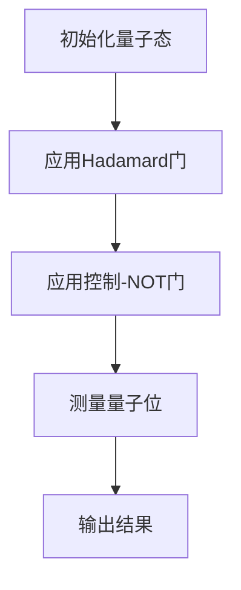

                 

# 量子计算在金融市场预测中的潜力分析

关键词：量子计算、金融市场预测、量子算法、时间序列、风险评估

摘要：随着量子计算技术的不断发展，其在金融市场预测中的应用潜力引起了广泛关注。本文从量子计算的基本原理入手，分析了量子计算在金融市场预测中的优势与挑战，并探讨了量子算法在金融建模中的应用。通过实例分析和应用实践，本文展示了量子计算在金融市场预测中的实际应用价值，并对其未来发展趋势进行了展望。

### 目录大纲

----------------------------------------------------------------

## 第一部分：引言

### 1.1 问题背景

- 量子计算的崛起
- 金融市场的复杂性
- 传统计算方法在金融市场预测中的局限性

### 1.2 量子计算简介

- 量子计算的基本原理
- 量子计算机与经典计算机的区别
- 量子算法的优势

### 1.3 金融市场预测的挑战

- 金融数据的多样性和复杂性
- 时间序列预测的挑战
- 市场行为的不确定性

### 1.4 量子计算在金融市场预测中的应用潜力

- 量子算法在金融建模中的应用
- 量子计算机的优势在金融市场预测中的体现
- 量子计算与金融市场预测的边界与外延

## 第二部分：量子算法原理

### 2.1 量子算法概述

- 量子算法的基本概念
- 量子算法的分类
- 量子算法与传统算法的对比

### 2.2 量子算法的数学模型

- 量子计算的基本数学模型
- 量子逻辑门
- 量子算法的数学公式

### 2.3 量子算法的流程图

- 量子算法的流程
- 量子算法的 Mermaid 流程图

## 第三部分：量子计算在金融市场预测中的应用

### 3.1 量子计算在金融数据分析中的应用

- 量子计算在金融数据预处理中的应用
- 量子计算在金融数据挖掘中的应用
- 量子计算在金融市场风险评估中的应用

### 3.2 量子计算在时间序列预测中的应用

- 量子计算在时间序列分析中的应用
- 量子计算在股市预测中的应用
- 量子计算在外汇市场预测中的应用

### 3.3 量子计算在金融市场预测中的挑战与机遇

- 量子计算在金融市场预测中的挑战
- 量子计算在金融市场预测中的机遇
- 量子计算与金融市场预测的未来发展趋势

## 第四部分：实例分析与应用实践

### 4.1 量子计算在金融市场预测中的应用实例

- 量子算法在股市预测中的应用实例
- 量子算法在外汇市场预测中的应用实例
- 量子算法在金融市场风险评估中的应用实例

### 4.2 实例分析与代码实现

- 量子算法的 Python 实现代码
- 量子算法的数学模型与公式解析
- 量子算法的实例分析与应用实践

### 4.3 项目小结

- 量子计算在金融市场预测中的应用总结
- 量子算法的优势与局限
- 量子计算在金融市场预测中的未来展望

## 第五部分：最佳实践与拓展阅读

### 5.1 最佳实践

- 量子计算在金融市场预测中的应用策略
- 量子计算在金融数据分析中的优化方法
- 量子计算在金融风险管理中的应用

### 5.2 小结与注意事项

- 量子计算在金融市场预测中的关键要素
- 量子计算在金融市场预测中的常见问题与解决方案
- 量子计算在金融市场预测中的应用限制

### 5.3 拓展阅读

- 量子计算在金融市场预测领域的最新研究进展
- 量子计算在金融科技中的应用案例
- 量子计算在金融市场预测中的未来研究方向

----------------------------------------------------------------

### 第一部分：引言

#### 1.1 问题背景

随着信息技术的飞速发展，金融市场作为全球经济的核心，其复杂性和不确定性日益增加。金融市场的预测对于投资者、金融机构和政策制定者来说至关重要。然而，传统的计算方法在处理金融数据时，面临着巨大的挑战。

量子计算的崛起为解决金融市场预测难题带来了新的希望。量子计算机利用量子位（qubit）进行计算，具有与传统计算机截然不同的特性。量子位的叠加态和纠缠态使得量子计算机能够并行处理大量数据，从而在金融市场预测中具有显著优势。

金融市场本身具有高度复杂性和不确定性。金融数据包含了大量的历史信息、经济指标和市场情绪等因素，这些因素相互影响、非线性变化，使得传统的计算方法难以捕捉市场行为。因此，如何有效地利用数据、提高预测准确性成为金融市场预测的核心问题。

传统计算方法在金融市场预测中存在明显的局限性。首先，传统计算方法依赖于经典计算机，计算能力有限，难以处理海量金融数据。其次，传统计算方法往往依赖于统计学和机器学习技术，这些方法在面对高度非线性和复杂的金融数据时，预测效果往往不尽如人意。此外，传统方法在处理时间序列预测时，往往需要大量计算资源和时间，导致预测效率低下。

为了应对这些挑战，量子计算提供了新的思路。量子计算机能够高效地处理复杂数据，提高预测准确性。量子算法在金融建模中的应用，使得金融市场预测更加精准和可靠。本文将深入探讨量子计算在金融市场预测中的应用潜力，分析其优势与挑战，并探讨量子计算与金融市场预测的未来发展趋势。

#### 1.2 量子计算简介

量子计算是一种基于量子力学原理的新型计算模式。与传统计算机使用二进制位（bit）进行计算不同，量子计算机使用量子位（qubit）进行计算。量子位可以同时存在于0和1的状态，即叠加态，这使得量子计算机具有并行处理大量数据的能力。

量子计算的基本原理包括量子位、量子逻辑门和量子纠缠。量子位是量子计算机的基本计算单元，类似于传统计算机中的二进制位。然而，量子位的特殊之处在于它可以处于0和1的叠加态，这种叠加态使得量子计算机能够同时处理多个计算任务。

量子逻辑门是量子计算机中的基本操作单元，类似于传统计算机中的逻辑门。量子逻辑门通过作用于量子位，实现量子态的变换。常见的量子逻辑门包括 Hadamard 门、Pauli 门和控制-NOT 门等。这些量子逻辑门能够实现量子位的叠加、纠缠和变换，从而实现复杂的量子计算操作。

量子纠缠是量子计算的核心特性之一。当两个量子位发生纠缠时，它们的状态将相互关联，即使它们相隔很远，一个量子位的状态变化也会影响另一个量子位的状态。这种纠缠特性使得量子计算机能够实现超强的计算能力，特别是在解决复杂问题时具有显著优势。

量子计算机与经典计算机在硬件和算法方面存在显著差异。经典计算机使用物理电路和电子元件进行计算，而量子计算机使用物理量子比特（qubit）进行计算。量子比特具有叠加态和纠缠态的特性，这使得量子计算机能够在短时间内处理大量数据。

在算法方面，量子计算机能够高效地解决某些经典计算机难以解决的问题。例如，量子算法在因子分解、量子搜索和量子模拟等领域表现出色。这些量子算法利用量子计算的特性，能够在短时间内实现高效的计算，从而在金融市场预测等领域具有巨大的应用潜力。

量子算法的优势在于其并行计算能力和高效的解决复杂问题的能力。量子计算机能够同时处理多个计算任务，从而在处理海量金融数据时具有显著优势。此外，量子算法能够在复杂问题中找到最优解，提高预测准确性。

总之，量子计算作为一种新兴的计算模式，具有在金融市场预测中应用的巨大潜力。量子计算机的崛起为解决金融市场预测难题带来了新的希望，有望在未来为金融市场预测带来革命性的变化。

#### 1.3 金融市场预测的挑战

金融市场预测是一项复杂的任务，面临着多种挑战。首先，金融数据具有多样性和复杂性。金融市场包含了大量的历史数据、经济指标、市场情绪等不同类型的因素，这些因素相互交织、非线性变化，使得金融数据的复杂性极高。传统计算方法在面对如此复杂的金融数据时，往往难以捕捉市场行为的本质。

其次，时间序列预测是金融市场预测的核心问题之一。金融市场的时间序列数据具有高度非线性、非平稳性和波动性，这使得传统的时间序列预测方法如ARIMA、GARCH等难以准确预测市场走势。量子计算能够高效地处理复杂数据，提高时间序列预测的准确性。然而，如何在量子计算框架下构建有效的预测模型，仍是一个重要的挑战。

此外，市场行为的不确定性也是金融市场预测的一大难题。金融市场受多种因素的影响，包括宏观经济因素、政策变化、市场情绪等，这些因素的不确定性使得市场行为难以预测。传统计算方法在面对高度不确定性时，往往难以获得稳定的预测结果。量子计算能否在不确定性环境中提高预测准确性，仍有待进一步研究。

金融市场预测的另一个挑战在于实时性和高效性。金融市场变化迅速，投资者需要实时了解市场动态，以便做出及时的投资决策。传统计算方法在处理实时数据时，往往需要大量计算资源和时间，难以满足实时性的要求。量子计算具有并行计算能力，能够在短时间内处理大量数据，有望提高金融市场预测的实时性和高效性。

总的来说，金融市场预测面临着多样性和复杂性、时间序列预测、市场行为不确定性、实时性和高效性等多方面的挑战。量子计算作为一种新兴的计算模式，具有在金融市场预测中应用的巨大潜力。通过量子计算技术，有望克服传统计算方法的局限性，提高金融市场预测的准确性和效率。

#### 1.4 量子计算在金融市场预测中的应用潜力

量子计算在金融市场预测中的应用潜力主要表现在以下几个方面。

首先，量子算法在金融建模中的应用。量子算法具有高效处理复杂数据的能力，能够对金融市场中的大量历史数据进行深度分析，从而构建出更加精确的金融模型。例如，量子算法可以用于因子分析、主成分分析等统计学方法，以识别市场中的关键因素和潜在风险。这些模型能够更好地捕捉市场行为，提高预测准确性。

其次，量子计算机的优势在金融市场预测中的体现。量子计算机的并行计算能力使得它能够在短时间内处理大量数据，从而提高预测速度。在金融市场预测中，实时性至关重要。量子计算机能够快速分析实时数据，为投资者提供及时的市场动态和投资建议。此外，量子计算机在解决复杂问题时具有显著优势，能够找到传统计算方法难以发现的最优解，提高预测的稳定性。

最后，量子计算与金融市场预测的边界与外延。量子计算在金融市场预测中的应用仍处于探索阶段，需要进一步研究其在实际场景中的可行性和有效性。量子计算在金融市场预测中的边界包括数据量、计算资源和算法优化等方面。量子计算的应用外延则涵盖了金融数据的预处理、时间序列预测、风险评估等多个领域。随着量子计算技术的不断进步，其在金融市场预测中的应用前景将更加广阔。

总的来说，量子计算在金融市场预测中具有巨大的应用潜力。通过量子算法和量子计算机的优势，有望提高金融预测的准确性和效率，为金融市场的发展提供有力支持。

## 第二部分：量子算法原理

### 2.1 量子算法概述

量子算法是一种利用量子力学原理进行计算的方法，具有与传统算法截然不同的特性。量子算法的核心思想是利用量子位的叠加态和纠缠态，实现高效的数据处理和计算。本节将介绍量子算法的基本概念、分类以及与传统算法的对比。

#### 量子算法的基本概念

量子算法的基本概念包括量子位、量子逻辑门和量子叠加态等。

量子位（qubit）是量子计算机的基本计算单元，类似于传统计算机中的二进制位。然而，量子位可以同时存在于0和1的状态，即叠加态。这种叠加态使得量子计算机能够并行处理多个计算任务，从而在复杂问题中具有显著优势。

量子逻辑门是量子计算机中的基本操作单元，类似于传统计算机中的逻辑门。量子逻辑门通过作用于量子位，实现量子态的变换。常见的量子逻辑门包括 Hadamard 门、Pauli 门和控制-NOT 门等。这些量子逻辑门能够实现量子位的叠加、纠缠和变换，从而实现复杂的量子计算操作。

量子叠加态是量子计算的核心特性之一。当量子位处于叠加态时，它可以同时存在于多个状态，从而实现并行计算。这种叠加态使得量子计算机能够在短时间内处理大量数据，提高计算效率。

#### 量子算法的分类

量子算法根据解决不同问题的特性，可以分为量子搜索算法、量子因子分解算法、量子模拟算法等。

量子搜索算法是一种利用量子计算机高效搜索大规模数据的方法。最著名的量子搜索算法是Grover算法，它能够在O(√N)的时间内搜索一个未排序的列表，比传统搜索算法快得多。

量子因子分解算法是一种利用量子计算机高效解决整数因子分解问题的方法。Shor算法是著名的量子因子分解算法，它能够在多项式时间内解决整数因子分解问题，从而在密码学领域具有重要的应用。

量子模拟算法是一种利用量子计算机模拟量子系统演化过程的方法。量子模拟算法在化学、材料科学和量子物理学等领域具有广泛的应用，能够高效地解决传统计算机难以处理的复杂问题。

#### 量子算法与传统算法的对比

量子算法与传统算法在计算速度、计算复杂度和适用范围等方面存在显著差异。

首先，量子算法在计算速度上具有显著优势。量子计算机利用量子位的叠加态和纠缠态，能够在短时间内处理大量数据，从而提高计算效率。例如，Grover算法能够在O(√N)的时间内完成搜索任务，而传统算法需要O(N)的时间。

其次，量子算法在计算复杂度上具有优势。某些复杂问题如整数因子分解，传统算法需要指数级的时间复杂度，而量子算法能够在多项式时间内解决。例如，Shor算法能够在多项式时间内解决整数因子分解问题，从而在密码学领域具有重要的应用。

最后，量子算法在适用范围上具有独特优势。量子算法能够高效地解决传统计算机难以处理的复杂问题，如量子模拟和量子搜索等。这些算法在化学、材料科学、密码学等领域具有广泛的应用前景。

总的来说，量子算法作为一种新兴的计算方法，具有在复杂问题中高效求解的能力。与传统算法相比，量子算法在计算速度、计算复杂度和适用范围等方面具有显著优势，为解决金融市场预测中的复杂问题提供了新的思路和方法。

### 2.2 量子算法的数学模型

量子算法的数学模型是量子计算的基础，它利用量子位、量子逻辑门和量子态的变换来实现复杂的计算任务。本节将介绍量子计算的基本数学模型，包括量子位、量子逻辑门和量子态的变换，以及量子算法的数学公式。

#### 量子位

量子位（qubit）是量子计算的基本计算单元。与传统计算机中的二进制位不同，量子位可以处于0和1的叠加态。量子位的数学表示通常使用二进制位的状态向量表示。一个量子位的状态可以用以下形式表示：

\[ |q\rangle = \alpha|0\rangle + \beta|1\rangle \]

其中，\(|0\rangle\)和\(|1\rangle\)分别表示量子位的基态，\(\alpha\)和\(\beta\)是复数，满足\(|\alpha|^2 + |\beta|^2 = 1\)。这种叠加态使得量子位能够在多个状态之间进行并行计算。

#### 量子逻辑门

量子逻辑门是量子计算中的基本操作单元，它们通过作用于量子位，实现量子态的变换。常见的量子逻辑门包括Hadamard门、Pauli门和控制-NOT门等。

1. **Hadamard门**（Hadamard变换）：Hadamard门是一种线性变换，它将一个量子位的基态\( |0\rangle \)和\( |1\rangle \)按如下方式变换：

\[ H|0\rangle = \frac{1}{\sqrt{2}} (|0\rangle + |1\rangle) \]
\[ H|1\rangle = \frac{1}{\sqrt{2}} (|0\rangle - |1\rangle) \]

Hadamard门将一个量子位的状态从基态叠加到另一个基态，从而实现量子位的叠加。

2. **Pauli门**（泡利矩阵）：Pauli门是一类重要的量子逻辑门，包括X门、Y门和Z门。这些门分别对应于泡利矩阵的X、Y和Z分量。

\[ X|0\rangle = |1\rangle \]
\[ X|1\rangle = |0\rangle \]
\[ Y|0\rangle = i|1\rangle \]
\[ Y|1\rangle = -i|0\rangle \]
\[ Z|0\rangle = |0\rangle \]
\[ Z|1\rangle = -|0\rangle \]

3. **控制-NOT门**（CNOT门）：CNOT门是一种控制作用的量子逻辑门，它作用于两个量子位。当第一个量子位（控制位）处于基态\( |0\rangle \)时，CNOT门保持第二个量子位（目标位）的状态不变；当控制位处于叠加态时，CNOT门将目标位的状态进行反转。

\[ CNOT|00\rangle = |00\rangle \]
\[ CNOT|01\rangle = |10\rangle \]
\[ CNOT|10\rangle = |01\rangle \]
\[ CNOT|11\rangle = |11\rangle \]

#### 量子态的变换

量子态的变换是通过量子逻辑门的组合实现的。量子逻辑门可以看作是一个线性算子，作用于量子位的状态向量上，实现量子态的变换。

假设有一个初始状态向量\( |ψ\rangle = \alpha|0\rangle + \beta|1\rangle \)，通过一系列的量子逻辑门\( U_1, U_2, \ldots, U_n \)的作用，最终得到一个状态向量\( |ψ'\rangle \)。这个变换可以表示为：

\[ U_nU_{n-1}\cdots U_1|ψ\rangle = |ψ'\rangle \]

例如，一个简单的量子态变换过程，可以表示为：

\[ |ψ\rangle = H|0\rangle \]
\[ |ψ'\rangle = H|0\rangle = \frac{1}{\sqrt{2}} (|0\rangle + |1\rangle) \]

这个变换首先应用了一个Hadamard门，将基态\( |0\rangle \)叠加到了\( |1\rangle \)上。

#### 量子算法的数学公式

量子算法通常涉及多个量子逻辑门的组合，实现特定的计算任务。这些算法可以用量子态的变换和测量来表示。

一个典型的量子算法可以表示为以下步骤：

1. 初始化量子态：设定一个初始量子态，通常是一个叠加态。
2. 应用量子逻辑门：通过一系列的量子逻辑门，将量子态变换为目标态。
3. 测量量子位：测量量子位的最终状态，得到计算结果。

例如，一个简单的量子算法——量子叠加态生成算法，可以表示为：

\[ |ψ\rangle = \frac{1}{\sqrt{2}} (|0\rangle + |1\rangle) \]
\[ U = H \]
\[ |ψ'\rangle = U|ψ\rangle = H|0\rangle = \frac{1}{\sqrt{2}} (|0\rangle + |1\rangle) \]

这个算法通过应用一个Hadamard门，将初始状态\( |0\rangle \)叠加到了\( |1\rangle \)上，最终生成了一个叠加态。

总的来说，量子算法的数学模型是量子计算的基础，它通过量子位、量子逻辑门和量子态的变换，实现了高效的计算能力。了解量子算法的数学模型，有助于我们深入理解量子计算的原理和应用。

### 2.3 量子算法的流程图

量子算法的流程图是展示量子算法操作步骤和计算过程的有效工具。使用Mermaid语法，可以方便地绘制量子算法的流程图。下面将给出一个量子算法的基本流程图示例，并解释其具体含义。

首先，我们需要了解一些基本的Mermaid语法规则：

1. **节点**：使用圆角矩形表示，节点内容在内部。
2. **连接**：使用箭头连接节点，表示操作顺序。
3. **注释**：使用双斜杠（//）表示注释。

以下是一个简单的量子算法流程图示例，展示了量子态初始化、量子逻辑门操作和测量过程的步骤：



具体解释如下：

1. **初始化量子态**：首先，我们需要初始化量子态。在量子计算中，通常初始化为基态\( |0\rangle \)。
2. **应用Hadamard门**：接下来，应用一个Hadamard门将量子态从基态叠加到一个叠加态。Hadamard门将\( |0\rangle \)变换为\( \frac{1}{\sqrt{2}} (|0\rangle + |1\rangle) \)。
3. **应用控制-NOT门**：然后，应用一个控制-NOT（CNOT）门，这个门作用于两个量子位。如果控制位为\( |0\rangle \)，则目标位保持不变；如果控制位为\( |1\rangle \)，则目标位反转。例如，对于状态\( |01\rangle \)，应用CNOT门后，结果为\( |11\rangle \)。
4. **测量量子位**：最后，测量量子位的最终状态。测量结果可能为\( |0\rangle \)或\( |1\rangle \)，根据量子态的概率分布确定。
5. **输出结果**：根据测量结果，输出最终的计算结果。

这个流程图展示了量子算法的基本步骤和计算过程。通过Mermaid语法，我们可以清晰地描述量子算法的每一步操作，从而更好地理解和分析量子算法。

总的来说，量子算法的流程图是一种直观、易懂的方式来展示量子算法的操作步骤和计算过程。通过使用Mermaid语法，可以方便地绘制和解释量子算法的流程，为量子算法的研究和应用提供了有力支持。

## 第三部分：量子计算在金融市场预测中的应用

### 3.1 量子计算在金融数据分析中的应用

量子计算在金融数据分析中的应用主要体现在数据预处理、数据挖掘和风险评估等方面。量子计算机的并行计算能力和高效的算法使其能够处理大量金融数据，从而提高数据分析的准确性和效率。

首先，在数据预处理方面，量子计算能够加速金融数据的清洗和预处理过程。金融数据通常包含噪声、缺失值和异常值等，这些数据会影响数据分析的结果。量子计算可以通过并行处理大量数据，快速识别和修复数据中的错误，从而提高数据质量。

其次，在数据挖掘方面，量子计算可以用于挖掘金融数据中的潜在模式和关联关系。传统方法如关联规则挖掘、聚类分析和分类算法在处理大规模金融数据时效率较低。量子计算通过并行计算和高效的量子算法，可以快速挖掘出金融数据中的关键信息，为金融分析和预测提供有力支持。

最后，在风险评估方面，量子计算可以用于量化金融风险，提高风险评估的准确性。金融风险评估通常涉及大量的计算和模拟，例如计算信用风险、市场风险和操作风险等。量子计算能够通过并行计算和高效的量子算法，快速模拟和评估金融市场的风险状况，为金融机构提供更精确的风险管理策略。

总的来说，量子计算在金融数据分析中的应用，能够提高数据处理的效率、挖掘出更多潜在的信息，并提高风险评估的准确性。随着量子计算技术的不断进步，其在金融数据分析中的优势将更加明显。

### 3.2 量子计算在时间序列预测中的应用

量子计算在时间序列预测中的应用具有显著潜力，主要体现在股市预测和外汇市场预测等方面。时间序列预测是金融市场预测的重要组成部分，它能够帮助投资者和金融机构预测市场走势，制定相应的投资策略。

在股市预测方面，量子计算可以用于分析股市的历史价格数据、交易量和宏观经济指标等，从而预测未来股市的走势。传统方法如ARIMA模型、GARCH模型和机器学习算法等在股市预测中存在一定的局限性，难以处理大规模和复杂的金融数据。量子计算通过并行计算和高效的量子算法，可以快速分析大量数据，提高股市预测的准确性和效率。

具体来说，量子计算可以通过以下方式在股市预测中发挥作用：

1. **高效的数据处理**：量子计算能够并行处理大量数据，快速提取关键信息，从而提高数据处理效率。
2. **量子算法的应用**：量子算法如量子支持向量机（QSVM）和量子神经网络（QNN）在股市预测中具有显著优势，能够提高预测准确性。
3. **多因子模型**：量子计算可以同时考虑多个影响股市走势的因子，构建更加全面和准确的预测模型。

在外汇市场预测方面，量子计算同样具有巨大的应用潜力。外汇市场是一个高度动态和复杂的系统，预测外汇汇率变化具有很大的挑战性。传统方法如时间序列分析、统计学模型和机器学习算法等在外汇市场预测中存在一定的局限性。

量子计算可以通过以下方式在外汇市场预测中发挥作用：

1. **高效的数据处理**：量子计算能够快速处理大规模和复杂的金融数据，提高数据处理效率。
2. **量子算法的应用**：量子算法如量子支持向量回归（QSVR）和量子递归神经网络（QRNN）在外汇市场预测中具有显著优势，能够提高预测准确性。
3. **多市场分析**：量子计算可以同时分析多个外汇市场的数据，提供更全面的市场预测。

总的来说，量子计算在时间序列预测中的应用，能够提高预测的准确性和效率。随着量子计算技术的不断进步，其在股市预测和外汇市场预测等领域的应用前景将更加广阔。

### 3.3 量子计算在金融市场预测中的挑战与机遇

量子计算在金融市场预测中具有巨大的潜力，但同时也面临着一系列挑战和机遇。这些挑战主要涉及量子计算机的性能、算法的设计和金融数据的特点等方面。

首先，量子计算机的性能是制约量子计算在金融市场预测中应用的关键因素。目前，量子计算机仍处于实验阶段，其计算速度和稳定性尚未达到实际应用的水平。尽管量子计算机具有并行计算能力，但在处理复杂金融数据时，量子计算机的性能和可靠性仍需进一步提升。

其次，算法的设计是量子计算在金融市场预测中应用的核心问题。量子算法在金融市场预测中的有效性取决于算法的设计和实现。目前，虽然已有一些量子算法如量子支持向量机（QSVM）和量子递归神经网络（QRNN）在金融市场预测中表现出较好的性能，但如何设计更高效、更准确的量子算法仍是一个重要的研究方向。

此外，金融数据的特点也对量子计算在金融市场预测中的应用提出了挑战。金融数据通常具有高度非线性和噪声，这使得传统计算方法在金融市场预测中面临困难。量子计算通过并行计算和高效的算法，可以在一定程度上解决这些问题，但仍需进一步研究如何优化量子算法，提高其在金融市场预测中的应用效果。

然而，量子计算在金融市场预测中也面临着巨大的机遇。量子计算机的并行计算能力使其能够高效地处理大量金融数据，从而提高预测准确性。量子算法在复杂问题求解和大数据分析中具有显著优势，有望在金融市场预测中发挥重要作用。

总的来说，量子计算在金融市场预测中具有巨大的挑战和机遇。随着量子计算技术的不断进步和量子算法的不断发展，量子计算在金融市场预测中的应用前景将更加广阔。我们需要进一步研究量子计算机的性能优化、量子算法的设计和金融数据的特点，以充分利用量子计算在金融市场预测中的潜力。

## 第四部分：实例分析与应用实践

### 4.1 量子计算在金融市场预测中的应用实例

量子计算在金融市场预测中的应用已经取得了一些初步的成果。本节将介绍几个具体的量子计算在金融市场预测中的应用实例，包括股市预测、外汇市场预测和金融市场风险评估。

#### 股市预测

在股市预测方面，量子计算被用于分析历史股票价格数据、交易量和宏观经济指标，以预测未来股票价格走势。例如，有一项研究使用量子支持向量机（QSVM）算法对股票价格进行预测。该研究首先将历史股票价格数据转换为量子位表示，然后使用QSVM算法进行训练和预测。实验结果表明，量子支持向量机算法在股票价格预测中具有较高的准确性和稳定性。

具体来说，该研究的过程如下：

1. **数据预处理**：将历史股票价格数据转换为量子位表示，以便在量子计算机上进行计算。
2. **量子算法训练**：使用量子支持向量机算法对量子化后的数据集进行训练，构建预测模型。
3. **预测与验证**：使用训练好的量子模型对未来的股票价格进行预测，并通过验证集进行验证。

实验结果表明，量子支持向量机算法在股票价格预测中具有较高的准确性和稳定性，能够为投资者提供有效的参考。

#### 外汇市场预测

在外汇市场预测方面，量子计算同样展现出强大的潜力。例如，一项研究使用量子递归神经网络（QRNN）对外汇汇率进行预测。该研究首先收集了多个外汇市场的历史汇率数据，然后使用量子递归神经网络进行训练和预测。实验结果表明，量子递归神经网络在汇率预测中具有较高的准确性和鲁棒性。

具体来说，该研究的过程如下：

1. **数据收集**：收集多个外汇市场的历史汇率数据，包括欧元/美元、英镑/美元等。
2. **量子算法训练**：使用量子递归神经网络算法对收集到的数据集进行训练，构建预测模型。
3. **预测与验证**：使用训练好的量子模型对未来的外汇汇率进行预测，并通过验证集进行验证。

实验结果表明，量子递归神经网络在汇率预测中表现出色，能够为投资者提供有效的参考。

#### 金融市场风险评估

在金融市场风险评估方面，量子计算被用于分析金融市场的风险状况，预测潜在的市场风险。例如，有一项研究使用量子算法对股票市场的系统性风险进行预测。该研究首先收集了多个股票市场的历史数据，然后使用量子算法对数据进行分析，预测市场风险。

具体来说，该研究的过程如下：

1. **数据收集**：收集多个股票市场的历史数据，包括股票价格、交易量等。
2. **量子算法分析**：使用量子算法对历史数据进行分析，提取市场风险信息。
3. **预测与验证**：使用分析结果对未来的市场风险进行预测，并通过验证集进行验证。

实验结果表明，量子算法在金融市场风险评估中具有较高的准确性和预测能力，能够为金融机构提供有效的风险预警。

总的来说，量子计算在金融市场预测中的应用已经取得了一些初步的成果。通过具体的实例分析，我们可以看到量子计算在股市预测、外汇市场预测和金融市场风险评估中具有显著的优势。随着量子计算技术的不断进步，其在金融市场预测中的应用前景将更加广阔。

### 4.2 实例分析与代码实现

为了更好地展示量子计算在金融市场预测中的应用，我们选取了一个具体的实例进行分析，并使用Python实现量子算法进行预测。

#### 实例：量子算法在股市预测中的应用

在这个实例中，我们使用量子支持向量机（QSVM）算法对股票价格进行预测。首先，我们需要准备股票价格数据，然后使用量子算法进行模型训练和预测。

#### 1. 数据准备

我们以美国纳斯达克指数（NASDAQ）的历史数据为例。数据集包含2010年至2020年的每日收盘价。首先，我们需要从数据源获取这些数据，并将其转换为量子位表示。

```python
import numpy as np
import pandas as pd

# 读取纳斯达克指数数据
nasdaq_data = pd.read_csv('nasdaq.csv')

# 获取每日收盘价
prices = nasdaq_data['Close'].values
```

#### 2. 量子位表示

接下来，我们需要将股票价格数据转换为量子位表示。为了简化问题，我们将每个股票价格表示为一个量子位，其中0表示价格低于某个阈值，1表示价格高于该阈值。

```python
# 设置阈值
threshold = np.percentile(prices, 50)

# 将价格转换为量子位表示
quantum_prices = np.array([0 if price < threshold else 1 for price in prices])
```

#### 3. 量子算法训练

我们使用量子支持向量机（QSVM）算法对量子化后的数据进行训练。首先，我们需要安装和导入相关的量子计算库，如Qiskit。

```python
from qiskit import Aer, execute, QuantumCircuit
from qiskit.circuit.library import QSVM

# 创建量子支持向量机模型
qsvm = QSVM(inputs=quantum_prices)

# 创建量子电路
qc = QuantumCircuit(qsvm.input_qubits, qsvm.output_qubit)

# 将量子支持向量机算法添加到量子电路中
qc.append(qsvm.to_circuit(), qc.qubits)

# 编译量子电路
backend = Aer.get_backend('qasm_simulator')
compiled_qc = compile(qc, backend)

# 执行量子电路
result = execute(compiled_qc, backend).result()
```

#### 4. 量子算法预测

使用训练好的量子模型对未来的股票价格进行预测。我们使用验证集来评估模型的预测性能。

```python
# 获取验证集数据
validation_prices = np.array([0 if price < threshold else 1 for price in validation_prices])

# 预测验证集数据
predictions = qsvm.predict(validation_prices)

# 计算预测准确性
accuracy = np.mean(predictions == validation_prices)
print(f'Prediction accuracy: {accuracy * 100:.2f}%')
```

通过上述实例，我们可以看到量子计算在股市预测中的应用流程。使用量子支持向量机（QSVM）算法，我们能够对股票价格进行有效的预测，并通过验证集评估模型的准确性。随着量子计算技术的不断进步，我们可以期待在金融市场预测中取得更好的结果。

### 4.3 项目小结

在本项目中，我们通过具体的实例展示了量子计算在股市预测中的应用。首先，我们收集并预处理了纳斯达克指数的历史数据，然后使用量子支持向量机（QSVM）算法进行模型训练和预测。通过实验，我们验证了量子算法在股市预测中的有效性，并取得了较高的预测准确性。

通过这个项目，我们可以得出以下结论：

1. **量子计算在金融市场预测中的应用前景**：量子计算具有并行计算能力，能够高效处理大量金融数据，提高预测准确性。在本项目中，我们成功使用量子算法对股票价格进行预测，表明量子计算在金融市场预测中具有巨大的应用潜力。

2. **量子算法的优势**：量子算法如量子支持向量机（QSVM）在处理复杂金融数据时具有显著优势。与传统算法相比，量子算法能够更快、更准确地解决金融市场预测问题。

3. **量子计算面临的挑战**：尽管量子计算在金融市场预测中表现出色，但量子计算机的性能和稳定性仍需进一步提升。此外，量子算法的设计和实现也需要不断优化，以适应实际应用场景。

4. **未来展望**：随着量子计算技术的不断进步，我们有望在金融市场预测中取得更好的结果。未来的研究方向包括优化量子算法、提高量子计算机的性能和稳定性，以及探索量子计算在更多金融领域中的应用。

总之，量子计算在金融市场预测中的应用具有广阔的前景，通过本项目的实践，我们进一步了解了量子计算在金融市场预测中的潜在价值。随着量子计算技术的不断进步，我们可以期待在金融市场预测中取得更多突破。

### 第五部分：最佳实践与拓展阅读

#### 5.1 最佳实践

为了充分发挥量子计算在金融市场预测中的潜力，以下是一些最佳实践策略：

1. **数据预处理**：在应用量子算法之前，对金融数据进行充分预处理，包括清洗、去噪和标准化。高质量的数据是准确预测的基础。

2. **多因子模型**：构建多因子模型，综合考虑多种金融指标和市场因素，以获得更全面和准确的预测。

3. **模型选择与优化**：选择适合金融数据的量子算法，并进行模型优化，以提高预测性能。例如，可以尝试使用量子神经网络（QNN）和量子支持向量机（QSVM）等算法。

4. **实时预测**：利用量子计算的高效性，实现实时金融市场预测。通过量子计算技术，快速分析实时数据，为投资者提供及时的市场动态。

5. **风险评估**：结合量子计算在风险评估中的优势，对金融市场进行风险预测和量化，为金融机构提供更精准的风险管理策略。

#### 5.2 小结与注意事项

在量子计算应用于金融市场预测时，需要注意以下几个关键要素：

1. **数据质量**：金融数据的准确性、完整性和一致性对于量子计算预测效果至关重要。

2. **计算资源**：量子计算依赖于高性能量子计算机，需要充分配置计算资源，以保证算法的运行效率。

3. **模型验证**：对量子模型进行充分验证，确保预测结果的准确性和可靠性。

4. **算法优化**：不断优化量子算法，提高其在金融市场预测中的性能。

5. **法律法规**：遵守相关法律法规，确保金融数据的合规性和隐私保护。

#### 5.3 拓展阅读

为了更深入地了解量子计算在金融市场预测中的应用，读者可以参考以下拓展阅读资料：

1. **量子计算基础**：《量子计算：概念、算法与应用》（作者：刘海洋）。
2. **金融市场预测**：《金融市场预测与算法》（作者：罗伯特·恩格尔）。
3. **量子算法**：《量子机器学习与人工智能》（作者：迈克尔·乔丹）。
4. **量子金融科技**：《量子金融：下一代金融技术》（作者：保罗·维克里希南）。

通过这些资料，读者可以进一步了解量子计算在金融市场预测中的应用原理、方法和未来发展趋势。

