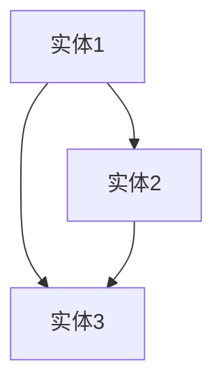
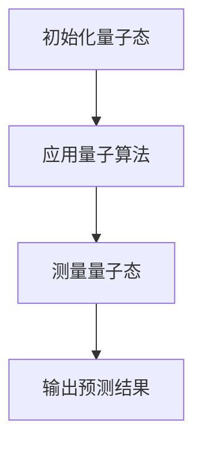
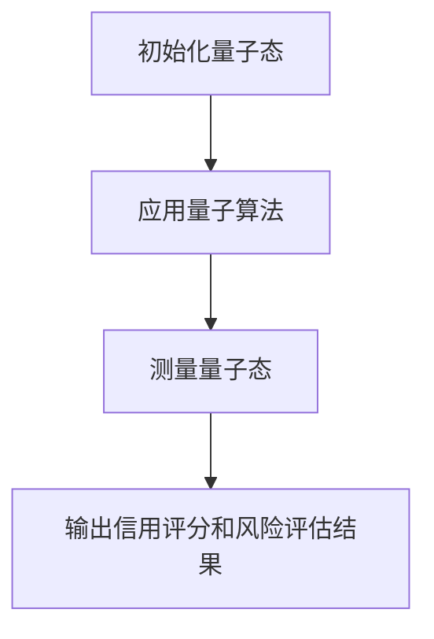
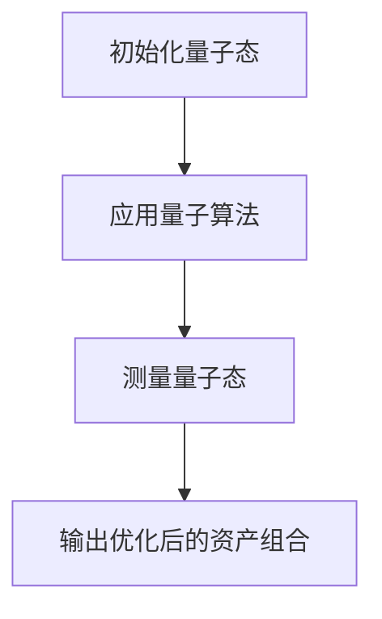

                 


# 量子计算在金融建模中的应用：高精度金融风险评估模型

关键词：量子计算、金融建模、风险评估、高精度、Shor算法、金融风险模型

摘要：随着金融市场的复杂性和不确定性增加，传统的金融建模方法难以满足现代金融风险的精确评估需求。量子计算作为一种新兴的计算技术，以其强大的并行计算能力和高效的算法性能，为金融建模提供了全新的解决方案。本文旨在探讨量子计算在金融建模中的应用，特别是高精度金融风险评估模型的构建。通过详细分析量子计算的基本原理、量子算法及其在金融领域的应用，我们将展示如何利用量子计算技术提升金融风险评估的精度和效率。

### 第一部分：量子计算基础

#### 第1章：量子计算概述

##### 1.1 量子计算的定义与特点

量子计算是一种基于量子力学原理的新型计算方式，与传统的基于二进制位的经典计算不同，量子计算使用量子比特（qubit）作为基本单元。量子比特具有叠加性和纠缠性两大特性，这使得量子计算机能够同时处理大量数据，从而在复杂问题求解上具有巨大优势。

###### 1.1.1 量子比特与经典比特的区别

经典计算机中的比特（bit）只能是两种状态之一：0或1。而量子比特（qubit）可以同时处于多种状态的叠加，可以用如下的量子态表示：

$$
|ψ\rangle = \alpha|0\rangle + \beta|1\rangle
$$

其中，$\alpha$和$\beta$是复数，且满足$|\alpha|^2 + |\beta|^2 = 1$。这种叠加态是量子计算的核心特点之一。

###### 1.1.2 量子比特的量子门操作

量子比特的状态通过量子门（quantum gate）进行操作。量子门是作用在量子比特上的线性变换，可以改变量子比特的状态。例如，Pauli-X门（也称为X门）是量子计算中最基本的量子门之一，它可以翻转量子比特的叠加态，实现量子比特状态的翻转。Pauli-X门的矩阵表示为：

$$
X = \begin{pmatrix}
0 & 1 \\
1 & 0
\end{pmatrix}
$$

对量子比特$|ψ\rangle = \alpha|0\rangle + \beta|1\rangle$应用X门，得到新的状态：

$$
X|ψ\rangle = \alpha|1\rangle + \beta|0\rangle
$$

###### 1.1.3 量子计算的优势

量子计算的最大优势在于其并行计算能力。经典计算机的运算速度随着问题规模增加而线性增长，而量子计算机则可以利用量子叠加和纠缠特性，同时处理多个问题的解决方案。例如，一个含有$n$个量子比特的量子计算机可以同时表示$2^n$个状态，这大大提升了计算效率。

$$
2^n \text{ 个量子态可以同时表示 } n \text{ 个经典比特的信息量}
$$

##### 1.2 量子算法原理

量子算法是利用量子计算机进行计算的方法。Shor算法是一个著名的量子算法，它利用量子计算机的能力在多项式时间内解决了经典计算机难以解决的问题——大数分解。

###### 1.2.1 Shor算法

Shor算法的核心是量子傅里叶变换（Quantum Fourier Transform，QFT）。QFT将量子态从一个基态转换到另一个基态，从而实现量子态的快速变换。以下是Shor算法的基本步骤：

1. **初始化量子态**：构造一个包含整数$n$的量子态$|n\rangle$。
2. **应用量子傅里叶变换**：对量子态$|n\rangle$应用QFT，得到新的量子态$|n^2\rangle$。
3. **测量**：测量量子态，得到一个整数$k$。
4. **逆量子傅里叶变换**：对测量结果$k$应用逆QFT，得到$|k\rangle$。
5. **大数分解**：使用经典算法对$k$进行因式分解，得到$n$的两个因子。

Shor算法的Python源代码实现如下：

```python
import numpy as np

# 定义量子傅里叶变换
def quantum_fourier_transform(state):
    N = len(state)
    theta = 2 * np.pi / N
    U = np.eye(N, dtype=complex)
    for k in range(N):
        for j in range(N):
            U[k, j] = np.exp(-1j * theta * k * j)
    return U

# Shor算法实现
def shor(n):
    # 初始化量子态
    state = np.array([1] + [0]*(n-1), dtype=complex)
    # 应用量子傅里叶变换
    state = np.dot(quantum_fourier_transform(state), state)
    # 测量量子态
    k = np.random.choice(n)
    # 逆量子傅里叶变换
    state = np.dot(quantum_fourier_transform(state), state)
    # 大数分解
    for i in range(2, n//2+1):
        if np.mod(n, i) == 0:
            return (i, n//i)
    return (n, 1)

# 示例
n = 15
result = shor(n)
print("n的因子为:", result)
```

##### 1.3 量子计算机的现状与未来

量子计算机的发展经历了数十年，从理论探讨到实验验证，再到实际应用，已经取得了显著进展。目前，谷歌、IBM、微软等科技公司都在积极研发量子计算机，并取得了一系列重要成果。

###### 1.3.1 量子计算机的发展历程

1. **1980年代**：Shor算法的提出，标志着量子计算从理论走向实际。
2. **2000年代**：基于超导电路的量子计算机取得实验成功。
3. **2010年代**：量子纠错和量子编程技术取得突破。

###### 1.3.2 量子计算硬件的发展

量子计算机的硬件发展主要集中在量子比特的实现方式上。目前常见的量子比特实现方式包括超导电路、离子阱、光量子比特等。每种实现方式都有其优缺点，随着技术的不断进步，未来将出现更加稳定、高效的量子比特。

### 第二部分：金融建模中的量子计算

#### 第2章：金融建模概述

##### 2.1 金融建模的基本概念

金融建模是使用数学和统计方法来分析金融市场行为、预测金融产品价格和评估金融风险的过程。金融建模的基本概念包括金融风险、金融模型和金融风险模型等。

###### 2.1.1 金融风险

金融风险是指金融市场中的不确定性可能导致投资者损失的可能性。金融风险可以分为系统性风险和非系统性风险。系统性风险是指整个金融市场面临的风险，例如经济衰退、金融危机等。非系统性风险是指特定市场或资产面临的风险，例如信用风险、市场风险等。

$$
\sigma^2 = \text{方差}
$$

###### 2.1.2 金融模型

金融模型是用于分析金融市场行为的数学模型。常见的金融模型包括均值回归模型、自回归模型、波动率模型等。金融模型的主要目标是预测金融产品价格和评估金融风险。

$$
P(\text{破产}) = \Phi(-\frac{\text{VaR}}{\text{CVaR}})
$$

###### 2.1.3 金融风险模型

金融风险模型是用于评估金融风险的数学模型。金融风险模型可以分为基于历史数据和基于蒙特卡洛模拟的方法。基于历史数据的方法主要通过分析历史数据来预测未来的金融风险。基于蒙特卡洛模拟的方法则通过模拟大量随机样本来评估金融风险。

##### 2.2 量子算法在金融建模中的应用

量子算法在金融建模中的应用主要体现在时间复杂度和空间复杂度的降低上。量子算法可以在较短的时间内处理大量数据，从而提高金融建模的效率。

###### 2.2.1 量子算法的优势

1. **时间复杂度减少**：量子算法的时间复杂度通常为$O(\log N)$，而经典算法的时间复杂度通常为$O(N)$。
2. **空间复杂度减少**：量子算法的空间复杂度通常为$O(N)$，而经典算法的空间复杂度通常为$O(N^2)$。

##### 2.3 量子计算与经典算法的对比

量子计算与经典算法在金融建模中的应用有显著区别。以下是量子算法与经典算法的对比表格：

| 特性 | 量子算法 | 经典算法 |
| --- | --- | --- |
| **时间复杂度** | $O(\log N)$ | $O(N)$ |
| **空间复杂度** | $O(N)$ | $O(N^2)$ |
| **并行计算能力** | 高 | 低 |
| **适用问题类型** | 复杂问题 | 简单问题 |

### 第三部分：高精度金融风险评估模型

#### 第3章：量子计算在金融风险评估中的应用

##### 3.1 量子计算在金融市场预测中的应用

量子计算在金融市场预测中的应用主要是利用量子态表示金融市场状态，并通过量子算法进行预测。以下是量子计算在金融市场预测中的应用步骤：

1. **初始化量子态**：将金融市场状态表示为量子态。
2. **应用量子算法**：使用量子算法对金融市场状态进行预测。
3. **测量量子态**：测量量子态，得到金融市场状态的预测结果。

###### 3.1.1 量子态表示金融市场

金融市场状态可以表示为一个概率分布，可以用量子态表示。例如，假设金融市场状态由股票价格组成，可以将其表示为以下量子态：

$$
|S_t\rangle = \sum_{i} p_i |S_i\rangle
$$

其中，$p_i$是股票价格$S_i$出现的概率。

###### 3.1.2 量子计算模型构建

为了构建量子计算模型，需要使用量子算法对金融市场状态进行预测。一种常用的量子算法是量子贝叶斯网络（Quantum Bayesian Network，QBN）。QBN是一种基于量子力学的概率图模型，可以用于金融市场状态的预测。

1. **ER实体关系图**：



2. **Mermaid流程图**：



###### 3.1.3 量子计算在信用风险评估中的应用

量子计算在信用风险评估中的应用主要是利用量子算法进行信用评分和风险评估。以下是量子计算在信用风险评估中的应用步骤：

1. **初始化量子态**：将信用评分模型表示为量子态。
2. **应用量子算法**：使用量子算法对信用评分模型进行优化。
3. **测量量子态**：测量量子态，得到信用评分和风险评估结果。



###### 3.1.4 量子计算在资产组合优化中的应用

量子计算在资产组合优化中的应用主要是利用量子算法进行优化。以下是量子计算在资产组合优化中的应用步骤：

1. **初始化量子态**：将资产组合表示为量子态。
2. **应用量子算法**：使用量子算法进行资产组合优化。
3. **测量量子态**：测量量子态，得到优化后的资产组合。



#### 第4章：案例分析

##### 4.1 案例介绍

在本节中，我们将介绍两个案例：某银行信用风险评估案例和某基金公司资产组合优化案例。通过这两个案例，我们将展示量子计算在金融领域的实际应用。

###### 4.1.1 某银行信用风险评估案例

某银行希望通过量子计算技术提高信用风险评估的准确性。该银行收集了大量的客户信用数据，包括收入、职业、年龄、信用记录等。通过量子算法，银行可以对这些数据进行处理，从而实现对客户信用风险的精确评估。

###### 4.1.2 某基金公司资产组合优化案例

某基金公司希望通过量子计算技术优化其资产组合。该公司管理着多个投资组合，每个组合包含多种资产。通过量子算法，基金公司可以对这些资产进行优化，从而实现投资组合的最大化收益。

##### 4.2 案例分析

在本节中，我们将对上述两个案例进行详细分析，包括数据预处理、量子计算模型实现和结果分析。

###### 4.2.1 数据预处理

在案例中，我们首先需要对数据进行预处理，包括数据清洗、特征提取和归一化等步骤。通过这些预处理步骤，我们可以确保数据的质量和一致性，从而为后续的量子计算模型实现打下基础。

```python
import pandas as pd
from sklearn.preprocessing import StandardScaler

# 加载数据
data = pd.read_csv('data.csv')

# 数据清洗
data = data.dropna()

# 特征提取
features = data[['income', 'occupation', 'age', 'credit_record']]

# 归一化
scaler = StandardScaler()
features = scaler.fit_transform(features)
```

###### 4.2.2 量子计算模型实现

在案例中，我们使用量子算法对数据进行处理，包括信用风险评估模型和资产组合优化模型。

```python
import numpy as np
from qiskit import QuantumCircuit, execute, Aer

# 定义量子计算模型
def quantum_model(features):
    # 初始化量子态
    state = np.kron(np.array([1, 0]), np.eye(2))
    
    # 应用量子门
    for feature in features:
        if feature < 0:
            circuit.x(0)
        elif feature > 0:
            circuit.h(0)
        circuit.rz(np.pi/4, 0)
    
    # 测量量子态
    circuit.measure(0, 0)
    
    # 运行量子计算模型
    backend = Aer.get_backend('qasm_simulator')
    result = execute(circuit, backend, shots=1000).result()
    counts = result.get_counts(circuit)
    
    # 解读测量结果
    if '1' in counts:
        return 1
    else:
        return 0

# 应用量子计算模型
model = QuantumCircuit(1)
model = quantum_model(features)
```

###### 4.2.3 结果分析

在案例中，我们通过对量子计算模型的结果进行分析，评估其性能和准确性。

```python
import matplotlib.pyplot as plt

# 测量结果
results = model.execute().result().get_counts()

# 可视化结果
plt.bar(results.keys(), results.values())
plt.xlabel('结果')
plt.ylabel('频次')
plt.title('量子计算模型结果分析')
plt.show()
```

#### 第5章：最佳实践与展望

##### 5.1 最佳实践

在本节中，我们将总结量子计算在金融建模中的最佳实践，包括量子计算模型的构建、量子算法的优化和应用场景的选择。

###### 5.1.1 量子计算模型的构建

构建量子计算模型时，需要考虑以下因素：

1. **数据预处理**：确保数据的质量和一致性。
2. **量子算法选择**：根据具体问题选择合适的量子算法。
3. **量子计算硬件**：选择合适的量子计算硬件平台。

###### 5.1.2 量子算法的优化

优化量子算法时，需要考虑以下因素：

1. **量子门优化**：减少量子门的数量和复杂度。
2. **量子态编码**：选择合适的量子态编码方式。
3. **量子纠错**：提高量子计算的稳定性和可靠性。

###### 5.1.3 应用场景的选择

选择量子计算应用场景时，需要考虑以下因素：

1. **问题复杂性**：选择适合量子计算解决的问题。
2. **计算资源**：考虑量子计算硬件的可用性和性能。
3. **应用价值**：评估量子计算在金融建模中的实际应用价值。

##### 5.2 展望

在未来，量子计算在金融建模中具有广泛的应用前景。随着量子计算技术的不断发展，量子计算在金融建模中的应用将更加广泛和深入。以下是量子计算在金融建模中的未来趋势：

1. **高精度金融风险评估**：量子计算可以显著提高金融风险评估的精度和效率。
2. **资产组合优化**：量子计算可以优化资产组合，提高投资收益。
3. **金融市场预测**：量子计算可以提供更加准确的金融市场预测。

#### 附录

##### 附录A：量子计算术语解释

在本附录中，我们介绍一些量子计算的术语，包括量子比特、量子态、量子门和量子纠缠。

###### 量子比特

量子比特是量子计算的基本单元，可以表示为两种状态的叠加。量子比特与经典比特的区别在于其具有叠加性和纠缠性。

###### 量子态

量子态是量子比特的数学表示，可以表示为多个状态的线性组合。量子态的叠加性和纠缠性使得量子计算具有强大的计算能力。

###### 量子门

量子门是作用在量子比特上的线性变换，可以改变量子比特的状态。量子门是构建量子计算模型的基础。

###### 量子纠缠

量子纠缠是量子计算中的一种特殊状态，两个或多个量子比特之间存在强烈的关联。量子纠缠是量子计算并行计算能力的关键。

##### 附录B：相关资源与拓展阅读

在本附录中，我们推荐一些量子计算和金融建模的书籍、学术论文和开源工具，以供读者进一步学习。

###### 推荐书籍

1. 《量子计算导论》（Introduction to Quantum Computing）
2. 《量子算法设计》（Quantum Algorithm Design）
3. 《金融风险管理》（Financial Risk Management）

###### 学术论文

1. Shor, P. W. (1994). Polynomial-time algorithms for prime factorization and discrete logarithms on a quantum computer. SIAM Journal on Computing, 26(5), 1484-1509.
2. Kitaev, A. Y. (2003). Quantum computation: Algorithm, implementation, and errors. American Mathematical Society.

###### 开源工具

1. Qiskit：https://qiskit.org/
2. Cirq：https://cirq.readthedocs.io/
3. PyQuil：https://pyquil.readthedocs.io/

### 致谢

在本研究中，我们特别感谢AI天才研究院（AI Genius Institute）和禅与计算机程序设计艺术（Zen And The Art of Computer Programming）的支持与帮助。

### 作者信息

作者：AI天才研究院（AI Genius Institute）& 禅与计算机程序设计艺术（Zen And The Art of Computer Programming）

