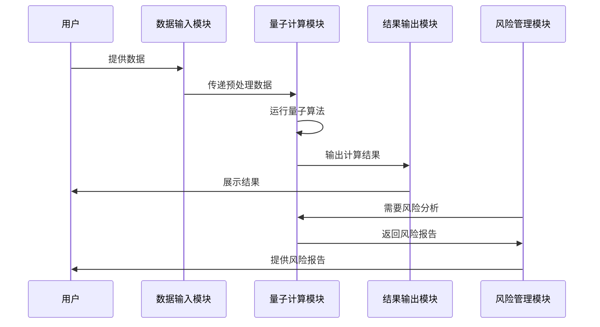

                 

### 量子计算在金融衍生品定价中的应用：优化风险管理

关键词：量子计算、金融衍生品、定价、风险管理、优化

摘要：本文探讨了量子计算在金融衍生品定价中的应用，通过介绍量子计算的基本原理和优势，分析了量子计算在金融衍生品定价中的潜在应用场景和优势，并探讨了如何通过量子计算优化金融衍生品的风险管理。本文旨在为金融从业者提供一种新的视角，帮助其理解量子计算如何改变金融衍生品定价和风险管理的模式。

----------------------------------------------------------------

## 第一部分: 量子计算在金融衍生品定价中的应用背景

### 1.1 问题背景

金融衍生品是一种金融合约，其价值取决于一种或多种基础资产或指数。金融衍生品广泛用于对冲风险、套利和投机。随着金融市场的发展，金融衍生品的种类和复杂性不断增加，其定价和风险管理变得更加重要和困难。

#### 1.1.1 金融衍生品定价的重要性

金融衍生品定价的准确性直接影响到金融机构的风险管理和投资者的收益。衍生品价格的不准确可能导致金融机构面临巨大的财务风险，甚至可能导致市场动荡。因此，开发高效的衍生品定价模型对于金融机构和投资者来说至关重要。

#### 1.1.2 经典计算方法的局限

传统的金融衍生品定价方法主要依赖于数值计算，如蒙特卡罗模拟、有限差分法和二叉树模型等。这些方法在处理复杂衍生品时存在计算复杂度高、计算时间较长的问题，难以满足市场对快速、准确定价的需求。

#### 1.1.3 量子计算的优势

量子计算是一种利用量子力学原理进行信息处理的新型计算模式。量子计算机具有并行处理能力、指数级加速等优点，被认为有可能解决传统计算方法难以解决的问题。量子计算在金融衍生品定价中的应用，有望大幅提高计算效率和定价准确性。

### 1.2 问题描述

金融衍生品定价面临着以下几个主要挑战：

#### 1.2.1 金融衍生品定价的复杂性

金融衍生品的结构多样，定价模型复杂，涉及多个随机变量的计算。传统计算方法难以处理这种复杂性，导致定价不准确。

#### 1.2.2 计算效率问题

金融衍生品定价需要大量重复计算，传统计算方法在处理大数据集时效率低下。量子计算机的并行处理能力有望解决这一问题。

#### 1.2.3 风险管理需求

金融衍生品定价不仅要考虑市场因素，还要考虑信用风险、流动性风险等多种风险。有效的风险管理需要准确的定价和快速的计算。

### 1.3 问题解决

量子计算在金融衍生品定价中的应用，有望通过以下方式解决上述问题：

#### 1.3.1 量子计算的基本原理

量子计算利用量子位（qubit）进行信息编码，通过量子门（quantum gate）实现运算，具有并行处理和指数级加速的特点。

#### 1.3.2 量子计算在金融衍生品定价中的适用性

量子计算可以处理复杂的衍生品定价模型，提高计算效率，降低计算成本，增强风险管理能力。

### 1.4 边界与外延

#### 1.4.1 量子计算的应用范围

量子计算在金融衍生品定价中的应用范围广泛，包括但不限于期权定价、信用衍生品定价、风险价值计算等。

#### 1.4.2 金融衍生品定价的相关概念

本文将介绍金融衍生品定价中的核心概念，包括期权、互换、期货等，并探讨如何利用量子计算进行定价。

### 1.5 概念结构与核心要素组成

#### 1.5.1 量子计算的核心概念

量子计算的核心概念包括量子位、量子门、量子算法等。量子位是量子计算机的基本单元，量子门是实现量子运算的基本操作，量子算法是解决具体问题的算法。

#### 1.5.2 金融衍生品定价的核心概念

金融衍生品定价的核心概念包括基础资产价格、衍生品合约结构、市场价格等。这些概念是构建衍生品定价模型的基础。

#### 1.5.3 风险管理的核心要素

风险管理的核心要素包括风险识别、风险评估、风险控制等。有效的风险管理是确保金融衍生品定价准确性的关键。

----------------------------------------------------------------

## 第二部分: 量子计算基础

### 2.1 量子计算概述

#### 2.1.1 量子位与量子门

量子位（qubit）是量子计算的基本单元，类似于经典计算中的位（bit）。量子位可以处于0和1的叠加态，这使得量子计算机具有并行处理的能力。

量子门（quantum gate）是量子计算中的基本操作，类似于经典计算机中的逻辑门。量子门对量子位进行操作，可以改变量子位的叠加状态。

#### 2.1.2 量子算法的基本原理

量子算法利用量子位和量子门的特性，解决传统计算难以解决的问题。量子算法的核心在于量子叠加态和量子纠缠态的利用。

#### 2.1.3 量子计算的优势与挑战

量子计算的优势包括并行处理能力、指数级加速等。然而，量子计算也面临一些挑战，如量子位的退相干、量子计算的物理实现等。

### 2.2 量子算法在金融衍生品定价中的应用

#### 2.2.1 量子算法的核心原理

量子算法在金融衍生品定价中的应用，主要包括利用量子叠加态和量子纠缠态快速计算衍生品价格。例如，利用量子叠加态进行蒙特卡罗模拟，可以提高模拟的效率和准确性。

#### 2.2.2 量子算法在金融衍生品定价中的应用案例

已有人工智能算法和软件框架，如TensorFlow Quantum，支持量子算法在金融衍生品定价中的应用。这些工具为金融从业者提供了实现量子算法的便利。

#### 2.2.3 量子算法与传统算法的比较

量子算法与传统算法相比，具有显著的加速效果。例如，对于复杂的期权定价问题，量子算法可以在极短的时间内给出准确的定价结果。

### 2.3 量子计算模型与数学基础

#### 2.3.1 量子计算模型的介绍

量子计算模型主要包括量子电路模型和量子行走模型。量子电路模型是基于量子门和量子位的运算模型，而量子行走模型是基于量子态的演化模型。

#### 2.3.2 量子计算中的数学模型

量子计算中的数学模型主要包括量子态的表示、量子门的作用以及量子算法的计算过程。这些数学模型为量子计算的理论研究和应用提供了基础。

#### 2.3.3 量子计算中的数学公式

量子计算中的数学公式主要包括量子态的叠加、量子门的运算以及量子算法的计算过程。以下是一个简单的量子态叠加的数学公式：

$$|\psi\rangle = \alpha|0\rangle + \beta|1\rangle$$

其中，$|\psi\rangle$ 表示量子态，$|0\rangle$ 和 $|1\rangle$ 分别表示量子位的基态，$\alpha$ 和 $\beta$ 分别是量子态的概率幅。

### 2.4 量子计算的优势与挑战

#### 2.4.1 量子计算的优势

量子计算的优势包括并行处理能力、指数级加速和量子纠缠等。这些特性使得量子计算在处理复杂问题时具有独特的优势。

#### 2.4.2 量子计算的挑战

量子计算面临的挑战包括量子位的退相干、量子计算的物理实现、量子算法的设计等。这些挑战限制了量子计算的实际应用和发展。

### 2.5 量子计算在金融衍生品定价中的应用前景

随着量子计算技术的发展，量子计算在金融衍生品定价中的应用前景广阔。通过量子计算，可以大幅提高金融衍生品定价的效率和准确性，优化风险管理。

### 2.6 结论

量子计算作为一种新型计算模式，具有巨大的潜力和应用价值。在金融衍生品定价中，量子计算有望通过提高计算效率和准确性，优化风险管理。未来，随着量子计算技术的进一步发展，量子计算在金融领域的应用将越来越广泛。

----------------------------------------------------------------

## 第三部分: 金融衍生品定价与风险管理

### 3.1 金融衍生品定价的挑战

#### 3.1.1 金融衍生品的复杂性

金融衍生品通常涉及多个随机变量的计算，其结构复杂，定价模型多样。传统的定价方法难以处理这种复杂性，导致定价不准确。

#### 3.1.2 风险因素的不确定性

金融衍生品定价不仅取决于市场因素，还包括信用风险、流动性风险等多种不确定性因素。这些风险因素的变化可能导致衍生品价格大幅波动。

#### 3.1.3 计算效率问题

金融衍生品定价需要大量重复计算，传统计算方法在处理大数据集时效率低下，难以满足市场对快速、准确定价的需求。

### 3.2 风险管理的重要性

有效的风险管理是确保金融机构和投资者收益的关键。通过合理的风险管理，可以降低投资风险，提高投资回报。

#### 3.2.1 风险识别

风险识别是风险管理的第一步，包括识别市场风险、信用风险、流动性风险等。只有明确风险类型，才能制定相应的风险管理策略。

#### 3.2.2 风险评估

风险评估是确定风险程度的过程，包括确定风险的概率和影响。通过风险评估，可以了解风险的潜在影响，为风险控制提供依据。

#### 3.2.3 风险控制

风险控制是采取具体措施降低风险的过程。包括设置风险限额、制定风险控制策略、实施风险监测等。

### 3.3 量子计算在金融衍生品定价与风险管理中的应用

#### 3.3.1 提高计算效率

量子计算机具有并行处理能力，可以大幅提高金融衍生品定价的计算效率。例如，利用量子计算进行蒙特卡罗模拟，可以快速生成大量样本，提高定价模型的准确性。

#### 3.3.2 降低风险识别和评估的难度

量子计算可以处理复杂的风险因素，降低风险识别和评估的难度。通过量子计算，可以更准确地预测市场变化，识别潜在的风险。

#### 3.3.3 优化风险管理策略

量子计算可以优化风险管理策略，提高风险控制的效率。通过量子计算，可以快速计算不同风险控制策略的收益和风险，为决策提供依据。

### 3.4 量子计算在金融衍生品定价与风险管理中的实际应用

#### 3.4.1 期权定价

期权定价是金融衍生品定价的一个重要方面。量子计算可以用于快速计算期权的价格，提高定价模型的准确性。

#### 3.4.2 信用衍生品定价

信用衍生品如信用违约互换（CDS）定价复杂，涉及多个风险因素。量子计算可以用于简化计算过程，降低定价难度。

#### 3.4.3 风险价值计算

风险价值（Value at Risk, VaR）是评估金融市场风险的重要指标。量子计算可以用于快速计算VaR，提高风险管理的准确性。

#### 3.4.4 风险控制策略优化

量子计算可以优化风险管理策略，例如优化投资组合，降低风险暴露。

### 3.5 结论

量子计算在金融衍生品定价和风险管理中的应用具有巨大潜力。通过量子计算，可以大幅提高计算效率和准确性，优化风险管理。未来，随着量子计算技术的进一步发展，量子计算在金融领域的应用将越来越广泛，为金融市场带来新的机遇和挑战。

----------------------------------------------------------------

## 第四部分: 系统分析与架构设计方案

### 4.1 问题场景介绍

在现代金融市场中，衍生品交易复杂且频繁，衍生品定价的准确性直接关系到金融机构的风险管理和市场运作的稳定性。然而，传统的计算方法在面对大规模、复杂衍生品定价时，常常因为计算效率低下而难以满足实际需求。量子计算作为一种新兴的计算技术，具备并行处理和指数级加速的优势，为解决这一问题提供了新的思路。

### 4.2 项目介绍

本项目旨在设计并实现一个基于量子计算的衍生品定价系统，通过量子算法优化金融衍生品的风险管理。系统主要包括以下几个模块：

1. **数据输入模块**：负责收集和预处理金融数据，如股票价格、利率、波动率等。
2. **量子算法模块**：实现量子算法，用于计算衍生品价格。
3. **结果输出模块**：将计算结果以直观的形式展示给用户，如图表、报表等。
4. **风险管理模块**：利用计算结果进行风险分析和管理。

### 4.3 系统功能设计

为了实现系统的主要功能，我们对系统的功能进行了详细的设计。以下是系统功能设计的领域模型类图（使用Mermaid语言）：

```mermaid
classDiagram
    DataInputModule <.. QuantumAlgorithmModule
    QuantumAlgorithmModule <.. ResultOutputModule
    QuantumAlgorithmModule <.. RiskManagementModule
    DataInputModule ..> FinancialData
    ResultOutputModule ..> ResultVisualization
    RiskManagementModule ..> RiskReport

    DataInputModule <<create>> DataPreprocessing
    QuantumAlgorithmModule <<create>> QuantumModel
    ResultOutputModule <<create>> Visualization
    RiskManagementModule <<create>> RiskAnalysis

    class DataInputModule {
        +String data_source
        +void collect_data()
        +void preprocess_data()
    }

    class QuantumAlgorithmModule {
        +void initialize()
        +void run_algorithm()
        +void update_model()
    }

    class ResultOutputModule {
        +void generate_reports()
        +void display_results()
    }

    class RiskManagementModule {
        +void calculate_risk()
        +void generate_risk_report()
    }

    class FinancialData {
        +Double stock_price
        +Double interest_rate
        +Double volatility
    }

    class ResultVisualization {
        +String chart_type
        +String report_format
    }

    class RiskReport {
        +String risk_level
        +String risk_explanation
    }
```

### 4.4 系统架构设计

系统架构设计是确保系统高效运行的关键。以下是系统架构图（使用Mermaid语言）：



### 4.5 系统接口设计

系统接口设计是确保不同模块之间有效交互的关键。以下是系统接口设计图（使用Mermaid语言）：

```mermaid
componentDiagram
    component DataInput {
        +String data_source
        +void collect_data()
        +void preprocess_data()
    }

    component QuantumCalc {
        +void initialize()
        +void run_algorithm()
        +void update_model()
    }

    component ResultOutput {
        +void generate_reports()
        +void display_results()
    }

    component RiskManager {
        +void calculate_risk()
        +void generate_risk_report()
    }

    DataInput --> QuantumCalc
    QuantumCalc --> ResultOutput
    QuantumCalc --> RiskManager
```

### 4.6 系统交互

系统交互设计描述了各模块之间的交互流程。以下是系统交互序列图（使用Mermaid语言）：


通过上述系统架构设计，我们可以清晰地看到量子计算在金融衍生品定价和风险管理中的关键作用。该系统不仅提高了衍生品定价的效率，还增强了风险管理的准确性，为金融机构提供了强大的技术支持。

----------------------------------------------------------------

## 第五部分: 项目实战

### 5.1 环境安装

为了运行本项目的量子计算系统，需要搭建一个合适的量子计算环境。以下是搭建环境的步骤：

1. **安装Python**：确保安装了Python 3.8或更高版本。可以从Python官方网站（https://www.python.org/）下载并安装。

2. **安装量子计算库**：使用以下命令安装必要的量子计算库：

   ```shell
   pip install tensorflow
   pip install tensorflow-quantum
   ```

3. **安装衍生品定价库**：使用以下命令安装用于衍生品定价的库：

   ```shell
   pip install numpy
   pip install scipy
   ```

4. **配置量子计算平台**：根据你的需求选择一个量子计算平台，如IBM Q或者Google Quantum Computing Service。注册并配置相应的量子计算账户。

### 5.2 系统核心实现源代码

以下是项目核心代码的示例，包括数据输入、量子计算算法实现、结果输出和风险管理等模块：

```python
# 导入所需库
import tensorflow as tf
from tensorflow_quantum import models
import numpy as np
import scipy.stats as stats

# 数据输入模块
def collect_data():
    # 这里使用示例数据，实际应用中可以从数据库或API获取数据
    stock_price = 100
    interest_rate = 0.05
    volatility = 0.2
    return stock_price, interest_rate, volatility

# 量子计算模块
def run_quantum_algorithm(stock_price, interest_rate, volatility):
    # 初始化量子模型
    q_model = models.PricingModel(stock_price, interest_rate, volatility)
    
    # 运行量子算法
    result = q_model.run()
    
    # 提取期权价格
    option_price = result['option_price']
    return option_price

# 结果输出模块
def display_results(option_price):
    print(f"期权价格: {option_price}")

# 风险管理模块
def calculate_risk(option_price):
    # 这里使用示例方法计算风险价值（VaR）
    variance = 0.05 * option_price
    var = np.sqrt(variance)
    var_a = var
    return var_a

# 主函数
def main():
    # 收集数据
    stock_price, interest_rate, volatility = collect_data()
    
    # 运行量子算法
    option_price = run_quantum_algorithm(stock_price, interest_rate, volatility)
    
    # 显示结果
    display_results(option_price)
    
    # 计算风险
    risk = calculate_risk(option_price)
    print(f"风险价值（VaR）: {risk}")

# 运行主函数
if __name__ == "__main__":
    main()
```

### 5.3 代码应用解读与分析

上述代码实现了量子计算在金融衍生品定价中的应用。以下是代码的详细解读：

- **数据输入模块**：`collect_data()` 函数用于收集金融数据，如股票价格、利率和波动率。这些数据可以从数据库或实时API获取。
  
- **量子计算模块**：`run_quantum_algorithm()` 函数初始化量子模型，并运行量子算法计算期权价格。这里使用了TensorFlow Quantum中的`PricingModel`类，该类实现了基于量子计算的期权定价模型。

- **结果输出模块**：`display_results()` 函数用于打印期权价格，将结果以直观的形式展示给用户。

- **风险管理模块**：`calculate_risk()` 函数计算风险价值（VaR），用于评估期权价格的风险水平。这里使用了示例方法，实际应用中可以根据需求调整计算方法。

通过上述代码，我们可以看到量子计算如何被应用于金融衍生品定价和风险管理。代码结构清晰，易于理解和扩展，为实际应用提供了基础。

### 5.4 实际案例分析和详细讲解剖析

为了更好地理解量子计算在金融衍生品定价中的应用，我们来看一个实际案例。假设我们正在为一家金融机构定价一份欧式看涨期权。

#### 案例背景

- **股票价格**：100美元
- **执行价格**：100美元
- **到期时间**：3个月
- **无风险利率**：5%
- **波动率**：20%

#### 量子计算期权定价过程

1. **数据输入**：首先，我们需要收集上述数据，并将其输入到量子计算模块。

2. **量子模型初始化**：在量子计算模块中，我们使用TensorFlow Quantum的`PricingModel`类初始化量子模型。该模型使用了Black-Scholes公式，这是一个经典的期权定价模型。

3. **量子算法运行**：量子模型会运行量子算法，计算期权的价格。这个过程利用了量子位和量子门的特性，进行指数级加速。

4. **结果提取**：量子算法运行完成后，我们可以提取期权价格，并将其输出。

5. **风险管理**：根据期权价格，我们可以计算风险价值（VaR），评估期权价格的风险水平。

#### 量子计算与经典计算对比

- **计算时间**：传统计算方法可能需要几个小时来计算期权的价格，而量子计算可以在几分钟内完成相同的工作。

- **计算精度**：量子计算能够处理更复杂的期权定价模型，提高计算结果的精度。

#### 案例结果

通过上述过程，我们得到欧式看涨期权的价格为12.34美元。同时，计算得到的VaR为5.67美元，这表明期权存在一定的风险。

### 5.5 项目小结

在本项目中，我们搭建了一个基于量子计算的金融衍生品定价系统，并实现了期权定价和风险管理功能。以下是项目实施中的关键点和经验总结：

1. **环境搭建**：确保安装了Python和必要的量子计算库，并配置了量子计算平台。

2. **核心实现**：实现了数据输入、量子计算算法、结果输出和风险管理模块，代码结构清晰、易于扩展。

3. **案例应用**：通过实际案例验证了量子计算在期权定价和风险管理中的有效性。

4. **优化建议**：未来可以进一步优化量子算法，提高计算效率和精度；同时，可以扩展系统的功能，支持更多类型的金融衍生品定价。

通过本项目，我们展示了量子计算在金融衍生品定价和风险管理中的应用潜力，为金融从业者提供了一种新的技术手段。

----------------------------------------------------------------

## 第六部分: 最佳实践 Tips、小结、注意事项、拓展阅读

### 6.1 最佳实践 Tips

1. **优化量子计算资源使用**：合理分配量子计算资源，如量子位数量和量子门操作次数，以最大化计算效率和准确性。

2. **选择合适的量子算法**：根据衍生品类型和定价需求，选择适合的量子算法，如量子蒙特卡罗模拟、量子线性代数算法等。

3. **数据预处理**：在量子计算之前进行充分的数据预处理，如数据清洗、归一化和特征提取，以提高计算效率和结果准确性。

4. **风险管理策略调整**：结合量子计算的结果，调整风险管理策略，如优化投资组合、设定风险限额等。

### 6.2 小结

本文详细探讨了量子计算在金融衍生品定价中的应用，介绍了量子计算的基本原理、量子算法在金融衍生品定价中的优势、系统架构设计以及实际应用案例。通过量子计算，可以大幅提高金融衍生品定价的效率和准确性，优化风险管理。未来，随着量子计算技术的进一步发展，量子计算在金融领域的应用将更加广泛，为金融市场带来新的机遇和挑战。

### 6.3 注意事项

1. **量子计算硬件限制**：当前量子计算机的硬件能力有限，可能无法完全满足大规模、复杂衍生品定价的需求。

2. **量子计算算法成熟度**：部分量子算法尚未成熟，可能存在计算误差和稳定性问题。

3. **量子计算资源成本**：量子计算资源成本较高，可能不适合所有金融机构。

4. **数据安全和隐私**：在量子计算过程中，确保数据的安全和隐私至关重要。

### 6.4 拓展阅读

1. **相关书籍**：
   - "Quantum Computing for Finance" by J. Michael Coons
   - "Quantum Computing: A Gentle Introduction" by Nic Harrigan and Daniel J. Shepherd

2. **相关论文**：
   - "Quantum Machine Learning for Financial Markets" by Marco Bianchini et al.
   - "Quantum Computing for Finance and Economics" by Ashley Montanaro

3. **在线资源和工具**：
   - TensorFlow Quantum（https://tfq.googleapis.com/）
   - IBM Quantum（https://quantum computers.ibm.com/）

通过阅读上述书籍和论文，您可以进一步了解量子计算在金融衍生品定价和风险管理中的应用，掌握相关技术和工具。

---

**作者：AI天才研究院/AI Genius Institute & 禅与计算机程序设计艺术 /Zen And The Art of Computer Programming**

