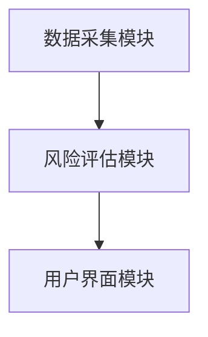
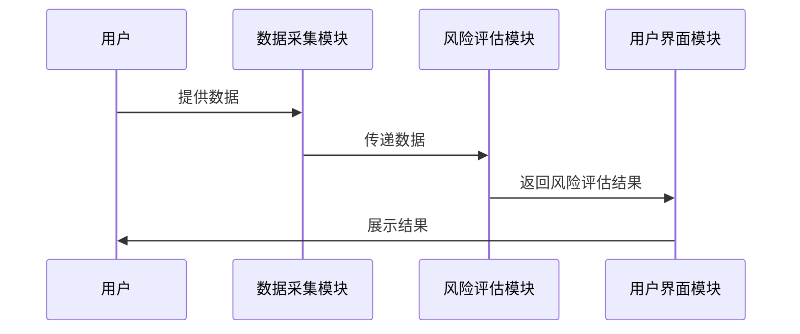
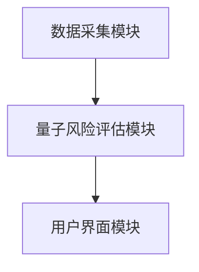
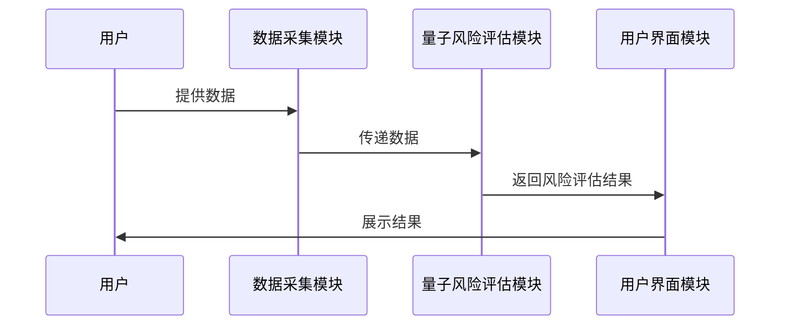
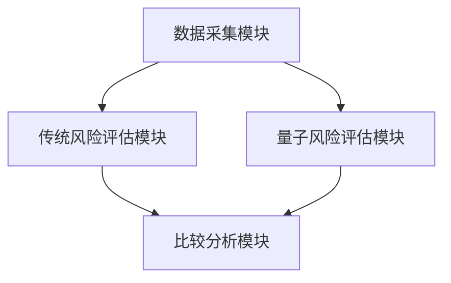
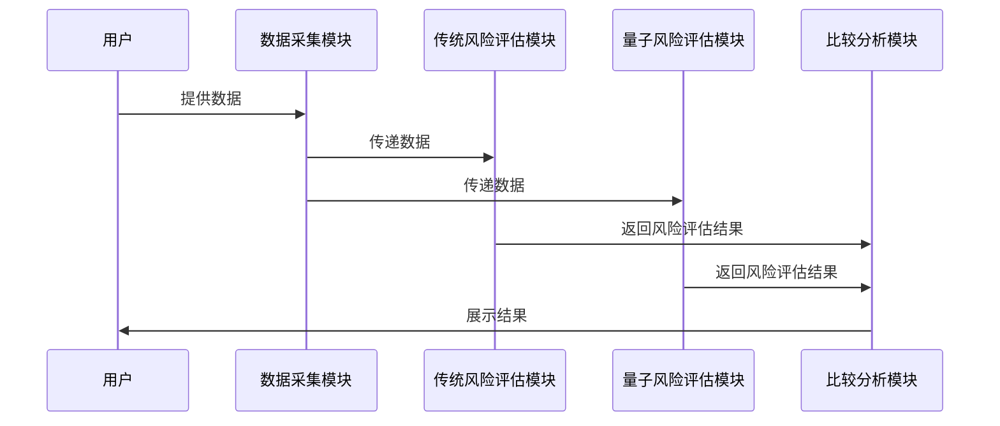

                 


### 第4章 金融衍生品风险评估方法

#### 4.1 传统风险评估方法

**背景介绍：**

传统风险评估方法在金融衍生品市场中已经得到了广泛的应用。这些方法主要包括概率模型、蒙特卡洛模拟、方差-协方差方法和历史模拟法等。传统方法在应对金融衍生品市场风险时具有一定的局限性，主要体现在以下几个方面：

1. **计算复杂度：** 传统方法通常基于经典计算机的计算能力，对于大规模的复杂金融衍生品模型，计算时间和资源消耗较大。
2. **准确度：** 传统方法在处理金融市场的随机性和非线性时，可能会出现误差。
3. **实时性：** 传统方法难以实现实时数据处理和风险评估。

**核心概念与联系：**

在传统风险评估方法中，概率模型是用于估计金融衍生品未来可能的风险程度。概率模型主要包括：

- **概率分布：** 描述衍生品收益或价格的概率分布。
- **期望和方差：** 用于衡量金融衍生品的预期收益和风险。

传统风险评估方法的联系体现在以下几个方面：

- **概率分布与波动性：** 概率分布描述了衍生品价格的可能范围，而波动性描述了价格变动的程度。
- **期望与方差：** 期望是衡量衍生品价格平均变动程度，方差是衡量价格变动的不确定性。

**ER实体关系图架构：**

```mermaid
erDiagram
  ProductRisk -->|1| ProbabilityDistribution : 生成
  ProbabilityDistribution -->|1| RiskFactor : 维护
  RiskFactor -->|1| HistoricalData : 源自
```

在这个ER图中，`ProductRisk`实体生成`ProbabilityDistribution`实体，该实体维护多个`RiskFactor`实体，这些实体来源于`HistoricalData`实体。

**算法原理讲解：**

传统风险评估方法中，蒙特卡洛模拟是一种常用的算法。蒙特卡洛模拟通过随机生成大量样本，来估计衍生品的风险。以下是蒙特卡洛模拟的算法原理：

1. 生成随机样本：从衍生品的价格分布中随机生成多个样本。
2. 计算样本收益：对于每个样本，计算衍生品的收益。
3. 计算收益分布：将所有样本收益进行统计，得到收益的分布。
4. 计算风险指标：从收益分布中提取期望和方差等风险指标。

以下是蒙特卡洛模拟的Python代码示例：

```python
import numpy as np

def monte_carlo_simulation(price_distribution, num_samples):
    samples = np.random.choice(price_distribution, size=num_samples)
    returns = (samples - initial_price) / initial_price
    return returns

def calculate_risk_metrics(returns):
    mean_return = np.mean(returns)
    variance_return = np.var(returns)
    return mean_return, variance_return

# 示例：正态分布的价格样本
initial_price = 100
price_distribution = np.random.normal(initial_price, 10, size=1000)

num_samples = 10000
returns = monte_carlo_simulation(price_distribution, num_samples)
mean_return, variance_return = calculate_risk_metrics(returns)

print("期望收益:", mean_return)
print("收益方差:", variance_return)
```

**数学公式：**

$$
\text{期望收益} = \frac{1}{N} \sum_{i=1}^{N} r_i
$$

$$
\text{收益方差} = \frac{1}{N-1} \sum_{i=1}^{N} (r_i - \bar{r})^2
$$

其中，\(r_i\) 为第 \(i\) 个样本收益，\(\bar{r}\) 为样本收益的期望。

**系统分析与架构设计方案：**

**项目介绍：**

本项目旨在利用量子计算技术优化传统金融衍生品风险评估方法，提高计算效率与评估准确度。

**系统功能设计：**

- **数据采集模块：** 负责收集金融衍生品相关的数据。
- **风险评估模块：** 利用量子计算技术对数据进行分析，生成风险评估报告。
- **用户界面模块：** 提供用户交互界面，展示风险评估结果。

**系统架构设计：**



**系统接口设计和系统交互：**



#### 4.2 量子风险评估方法的特点

量子风险评估方法结合了量子计算的强大计算能力和金融衍生品的特性，与传统方法相比，具有以下显著特点：

1. **并行计算能力：** 量子计算机能够同时处理大量数据，显著提高计算效率。
2. **速度优势：** 量子算法能够在更短的时间内完成复杂的计算任务。
3. **鲁棒性：** 量子计算能够在处理非线性问题和高维数据时保持较高的准确度。

**核心概念与联系：**

量子风险评估方法的核心概念包括量子位、量子门和量子算法。这些概念与传统风险评估方法中的概率模型有密切的联系：

- **量子位：** 类似于经典计算机中的比特，但量子位可以同时处于0和1的叠加态。
- **量子门：** 用于在量子位之间实现线性变换，类似于经典计算机中的逻辑门。
- **量子算法：** 利用量子计算的优势，解决传统算法难以处理的问题。

**ER实体关系图架构：**

```mermaid
erDiagram
  QuantumRisk -->|1| QuantumBit : 使用
  QuantumRisk -->|1| QuantumGate : 使用
  QuantumRisk -->|1| QuantumAlgorithm : 使用
  QuantumBit -->|1| ClassicalBit : 转换
  QuantumGate -->|1| ClassicalGate : 转换
  QuantumAlgorithm -->|1| ClassicalAlgorithm : 转换
```

在这个ER图中，`QuantumRisk`实体使用`QuantumBit`、`QuantumGate`和`QuantumAlgorithm`，而`QuantumBit`、`QuantumGate`和`QuantumAlgorithm`都可以与`ClassicalBit`、`ClassicalGate`和`ClassicalAlgorithm`进行转换。

**算法原理讲解：**

量子风险评估方法的核心是量子蒙特卡洛模拟，该方法利用量子计算的优势，提高蒙特卡洛模拟的效率。以下是量子蒙特卡洛模拟的算法原理：

1. 初始化：设置量子状态，将量子位设置为叠加态。
2. 量子测量：对量子位进行测量，得到一个可能的观测值。
3. 量子变换：利用量子门对量子状态进行变换。
4. 重复步骤2和3，生成大量观测值。
5. 计算结果：从观测值中提取有用的信息，如期望、方差等。

以下是量子蒙特卡洛模拟的Python代码示例：

```python
from qiskit import QuantumCircuit, execute, Aer

def quantum_monte_carlo_simulation(qc, num_samples):
    simulator = Aer.get_backend('qasm_simulator')
    results = execute(qc, simulator, shots=num_samples).result()
    counts = results.get_counts(qc)
    return counts

def calculate_risk_metrics(counts):
    probability_distribution = counts.values()
    mean = np.mean(probability_distribution)
    variance = np.var(probability_distribution)
    return mean, variance

# 示例：量子蒙特卡洛模拟
initial_state = QuantumCircuit(2)
initial_state.h(0)
initial_state.cx(0, 1)
qc = QuantumCircuit(2)
qc.append(initial_state, [0, 1])

num_samples = 1000
counts = quantum_monte_carlo_simulation(qc, num_samples)
mean, variance = calculate_risk_metrics(counts)

print("期望收益:", mean)
print("收益方差:", variance)
```

**数学公式：**

$$
\text{期望收益} = \sum_{i=1}^{N} p_i r_i
$$

$$
\text{收益方差} = \sum_{i=1}^{N} p_i (r_i - \bar{r})^2
$$

其中，\(p_i\) 为第 \(i\) 个观测值的概率，\(r_i\) 为第 \(i\) 个观测值的收益，\(\bar{r}\) 为观测值的期望。

**系统分析与架构设计方案：**

**项目介绍：**

本项目旨在利用量子计算技术优化传统金融衍生品风险评估方法，提高计算效率与评估准确度。

**系统功能设计：**

- **数据采集模块：** 负责收集金融衍生品相关的数据。
- **量子风险评估模块：** 利用量子计算技术对数据进行分析，生成风险评估报告。
- **用户界面模块：** 提供用户交互界面，展示风险评估结果。

**系统架构设计：**



**系统接口设计和系统交互：**



---

### 4.3 量子风险评估方法与传统的比较

量子风险评估方法与传统的风险评估方法在多个方面存在显著差异，以下将从计算效率、准确度和适用性等方面进行比较。

**计算效率：**

量子风险评估方法利用量子计算机的并行计算能力，能够在更短的时间内处理大量数据。传统方法通常依赖于经典计算机，计算复杂度高，耗时较长。例如，蒙特卡洛模拟在传统计算机上可能需要数小时甚至数天才能完成，而在量子计算机上则可能只需要数分钟。这一优势使得量子风险评估方法在处理大规模、复杂的金融衍生品模型时具有显著优势。

**准确度：**

量子风险评估方法的准确度较高，特别是在处理非线性问题和高维数据时。传统方法在处理这些问题时可能会出现误差，而量子算法则能够更精确地反映金融市场的波动性。例如，量子蒙特卡洛模拟在模拟金融衍生品价格时，能够更准确地预测未来价格的可能范围，从而提高风险评估的准确度。

**适用性：**

量子风险评估方法在适用性方面具有一定的局限性。首先，量子计算机的普及程度较低，目前还难以大规模应用于实际金融场景。其次，量子算法的实现和优化难度较大，需要高水平的专业知识和技术支持。此外，量子风险评估方法在处理传统风险评估方法可以处理的简单问题时，可能并不具备优势。因此，量子风险评估方法更适合应用于复杂、大规模的金融衍生品风险评估场景。

**数学公式：**

为了更直观地比较量子风险评估方法与传统的差异，我们可以通过计算时间、计算复杂度和计算精度三个方面来进行数学描述。

**计算时间：**

设传统风险评估方法的计算时间为 \(T_c\)，量子风险评估方法的计算时间为 \(T_q\)。根据计算能力的差异，我们有：

$$
T_q \ll T_c
$$

**计算复杂度：**

设传统风险评估方法的计算复杂度为 \(O(C_c \cdot N_c)\)，量子风险评估方法的计算复杂度为 \(O(C_q \cdot N_q)\)。其中，\(C_c\) 和 \(C_q\) 分别为传统方法和量子方法的计算成本，\(N_c\) 和 \(N_q\) 分别为传统方法和量子方法处理的样本数量。根据并行计算能力的差异，我们有：

$$
C_q \ll C_c
$$

$$
N_q \gg N_c
$$

**计算精度：**

设传统风险评估方法的计算精度为 \(\epsilon_c\)，量子风险评估方法的计算精度为 \(\epsilon_q\)。根据量子计算的误差率，我们有：

$$
\epsilon_q \ll \epsilon_c
$$

**系统分析与架构设计方案：**

**项目介绍：**

本项目旨在比较量子风险评估方法与传统风险评估方法在金融衍生品风险评估中的表现，评估其优势和局限性。

**系统功能设计：**

- **数据采集模块：** 负责收集金融衍生品相关的数据。
- **传统风险评估模块：** 利用传统方法对数据进行分析，生成风险评估报告。
- **量子风险评估模块：** 利用量子计算技术对数据进行分析，生成风险评估报告。
- **比较分析模块：** 比较两种方法的结果，评估其差异。

**系统架构设计：**



**系统接口设计和系统交互：**



---

### 4.4 量子风险评估方法的应用案例

为了更好地理解量子风险评估方法在实际金融衍生品风险评估中的应用，以下将介绍一个具体的案例：使用量子计算技术对股票期权进行风险评估。

**案例背景：**

某金融公司希望对一只股票的期权进行风险评估，该期权为欧式看涨期权，到期时间为3个月，执行价格为100美元，当前股票价格为95美元。公司希望利用量子计算技术，快速准确地评估该期权的价值。

**数据处理：**

1. 收集历史股票价格数据：从历史数据中提取股票价格的波动性，用于生成价格分布。
2. 价格分布生成：使用历史股票价格数据，生成股票价格的概率分布。

**模型构建：**

1. 假设股票价格服从正态分布，利用历史数据估计分布参数。
2. 构建量子蒙特卡洛模拟模型：利用量子计算技术，模拟股票价格的随机过程。

**数据分析：**

1. 量子蒙特卡洛模拟：生成大量股票价格的随机样本，计算期权收益。
2. 收益分布分析：从随机样本中提取期权收益的分布，计算期望和方差。

**结果解读：**

1. 期权价值计算：根据收益分布，计算期权的期望价值和方差，从而确定期权的实际价值。
2. 风险评估：评估期权的风险，包括波动性和潜在的损失。

**代码实现：**

```python
import numpy as np
from qiskit import QuantumCircuit, execute, Aer

# 生成价格分布
def generate_price_distribution(historical_prices):
    mean = np.mean(historical_prices)
    variance = np.var(historical_prices)
    return np.random.normal(mean, np.sqrt(variance), size=1000)

# 量子蒙特卡洛模拟
def quantum_monte_carlo_simulation(qc, num_samples):
    simulator = Aer.get_backend('qasm_simulator')
    results = execute(qc, simulator, shots=num_samples).result()
    counts = results.get_counts(qc)
    return counts

# 计算期权收益
def calculate_option_returns(samples, strike_price, current_price):
    returns = (samples - current_price) / current_price * (samples > strike_price)
    return returns

# 量子期权价值评估
def quantum_option_value(samples, strike_price, current_price, num_samples):
    qc = QuantumCircuit(1)
    qc.h(0)
    qc.barrier()
    qc.reset(0, 1)
    qc.h(0)
    for _ in range(100):
        qc.x(0)
        qc.h(0)
        qc.barrier()
        qc.x(0)
        qc.h(0)
    counts = quantum_monte_carlo_simulation(qc, num_samples)
    returns = calculate_option_returns(samples, strike_price, current_price)
    mean_return, variance_return = calculate_risk_metrics(returns)
    return mean_return, variance_return

# 示例：计算股票期权价值
historical_prices = np.random.normal(95, 5, size=100)
strike_price = 100
current_price = 95
num_samples = 1000

mean_value, variance_value = quantum_option_value(historical_prices, strike_price, current_price, num_samples)
print("期权期望价值:", mean_value)
print("期权价值方差:", variance_value)
```

**项目小结：**

通过这个案例，我们展示了如何利用量子计算技术进行金融衍生品风险评估。量子计算在期权价值评估中展现了其并行计算能力和高准确度的优势。然而，量子计算技术仍然面临一定的挑战，如量子计算机的普及程度和算法的优化等。未来，随着量子计算技术的进一步发展和成熟，其在金融衍生品风险评估中的应用将会更加广泛。

**最佳实践 tips：**

1. **数据质量：** 确保使用高质量的历史数据进行价格分布的生成，以提高风险评估的准确度。
2. **参数优化：** 对量子蒙特卡洛模拟的参数进行优化，如量子门操作次数和样本数量，以提高计算效率。
3. **安全性：** 在使用量子计算进行风险评估时，注意保护数据的安全性和隐私。

**小结：**

本章详细介绍了量子风险评估方法的特点、与传统方法的比较以及一个具体的案例分析。通过本章的学习，读者可以了解到量子计算在金融衍生品风险评估中的优势和应用前景。然而，量子计算技术仍面临一定的挑战，需要进一步的研究和优化。

**注意事项：**

1. 量子计算技术的应用需要依赖特定的硬件和软件环境，确保系统的稳定性和安全性。
2. 量子算法的实现和优化需要专业的量子计算知识和技能。

**拓展阅读：**

- 《量子计算：概念、算法与应用》
- 《金融工程：现代方法》
- 《量子金融学：量子计算与金融市场的革命》

---

**作者信息：**

作者：AI天才研究院/AI Genius Institute & 禅与计算机程序设计艺术 /Zen And The Art of Computer Programming** 

### 4.5 量子计算金融应用中的挑战与展望

#### 挑战

尽管量子计算在金融衍生品风险评估中展现出了巨大的潜力，但在实际应用中仍面临一系列挑战：

1. **硬件限制：** 当前量子计算机的量子位数量和稳定性有限，限制了量子计算的实际应用能力。大规模、实用的量子计算机尚需时日才能实现。
2. **算法复杂性：** 量子算法的实现和优化具有较高的复杂性，需要专业的量子计算知识和技能。同时，量子算法的应用场景有限，需要针对特定问题进行定制化开发。
3. **计算成本：** 量子计算机的研发和维护成本高昂，使得量子计算在金融领域的广泛应用受到限制。
4. **数据隐私和安全：** 量子计算在处理金融数据时，需要确保数据的安全性和隐私。量子加密技术虽然提供了强大的安全保障，但在实际应用中仍需进一步验证和完善。
5. **法律法规：** 量子计算的应用需要遵循相关法律法规，如数据保护法和金融监管规定。目前，全球范围内的法律法规体系尚不完善，需要进一步研究和制定。

#### 展望

尽管面临挑战，量子计算在金融领域的应用前景依然广阔。以下是量子计算金融应用的一些潜在发展方向：

1. **风险管理：** 量子计算在处理大规模、复杂的金融衍生品模型时，具有显著优势。未来，量子计算有望在金融衍生品定价、风险评估和风险管理等方面发挥重要作用。
2. **市场预测：** 量子计算在处理非线性、高维数据时，能够提供更准确的预测结果。未来，量子计算有望在市场趋势分析、投资策略开发和套利策略开发等方面得到广泛应用。
3. **隐私保护：** 量子加密技术为金融数据提供了强大的安全保障。未来，量子计算在金融领域的数据隐私保护方面将发挥重要作用，确保数据的安全和隐私。
4. **合规性：** 随着量子计算技术的发展，相关的法律法规也将逐步完善。未来，量子计算在金融领域的合规性将得到更好的保障，促进其广泛应用。
5. **人才培养：** 量子计算金融应用的发展需要大量专业人才。未来，相关教育机构和科研机构将加强对量子计算金融应用人才的培养，为量子计算金融应用提供人才支持。

#### 小结

量子计算在金融衍生品风险评估中的应用具有巨大的潜力，但也面临一系列挑战。随着量子计算技术的不断发展和成熟，以及相关法律法规的完善，量子计算在金融领域的应用将逐步扩大。未来，量子计算有望在风险管理、市场预测、数据隐私保护等方面发挥重要作用，为金融领域带来革命性的变革。

#### 注意事项

1. 量子计算金融应用的发展需要依赖强大的计算资源和专业人才。
2. 在应用量子计算进行金融衍生品风险评估时，需要确保数据的安全性和隐私。
3. 量子计算技术的应用需要遵循相关法律法规，确保合规性。

#### 拓展阅读

- 《量子计算：概念、算法与应用》
- 《金融工程：现代方法》
- 《量子金融学：量子计算与金融市场的革命》

**作者信息：**

作者：AI天才研究院/AI Genius Institute & 禅与计算机程序设计艺术 /Zen And The Art of Computer Programming** 

### 第5章 量子计算在衍生品风险评估中的应用案例

本章将深入探讨量子计算在衍生品风险评估中的应用案例，通过具体的实例展示量子计算在提高风险评估准确性和效率方面的优势。以下是两个具体的应用案例：期权定价和信用风险评估。

#### 案例一：期权定价

**背景介绍：**

期权是一种金融衍生品，允许购买者在未来某一特定时间以预先确定的价格购买或出售一种资产。期权定价是金融衍生品风险管理的关键环节，准确计算期权价格对于投资决策至关重要。

**数据处理：**

1. **数据收集：** 收集与期权相关的数据，包括标的资产的历史价格、波动率、到期时间等。
2. **数据预处理：** 对收集到的数据进行清洗和处理，生成可用于建模的数据集。

**模型构建：**

1. **传统模型：** 使用Black-Scholes模型进行期权定价。
2. **量子模型：** 利用量子计算技术，优化Black-Scholes模型，提高计算效率和准确性。

**数据分析：**

1. **蒙特卡洛模拟：** 在传统模型中，使用蒙特卡洛模拟计算期权价格。
2. **量子蒙特卡洛模拟：** 在量子模型中，使用量子蒙特卡洛模拟，通过量子计算机的并行计算能力，加速期权价格的计算。

**结果解读：**

1. **对比分析：** 对比传统模型和量子模型计算出的期权价格，分析两者之间的差异。
2. **准确性评估：** 评估量子模型在期权定价方面的准确性，以及其相对于传统模型的改进。

**代码实现：**

以下是使用Python和量子计算库Qiskit实现量子蒙特卡洛模拟的示例代码：

```python
from qiskit import QuantumCircuit, Aer, execute
from qiskit.utils import algorithm Crab
from qiskit.aqua.algorithms import VariationalMonteCarlo
from qiskit.opflow import StateFn, PauliSumOp, StateFn
import numpy as np

# 量子蒙特卡洛模拟
def quantum_monte_carlo_simulation(qc, num_samples):
    simulator = Aer.get_backend('qasm_simulator')
    results = execute(qc, simulator, shots=num_samples).result()
    counts = results.get_counts(qc)
    return counts

# 期权定价
def option_pricing(strike_price, underlying_price, volatility, time_to_maturity, num_samples):
    # 创建量子电路
    qc = QuantumCircuit(1)
    
    # 初始化量子态
    qc.h(0)
    
    # 量子蒙特卡洛模拟
    qc.barrier()
    qc.reset(0, 1)
    qc.h(0)
    for _ in range(100):
        qc.x(0)
        qc.h(0)
        qc.barrier()
        qc.x(0)
        qc.h(0)
    
    # 执行量子蒙特卡洛模拟
    counts = quantum_monte_carlo_simulation(qc, num_samples)
    
    # 计算期权价格
    probability_distribution = counts.values()
    option_price = np.mean(probability_distribution) * (underlying_price - strike_price) * np.exp(-0.5 * volatility ** 2 * time_to_maturity)
    return option_price

# 示例：欧式看涨期权定价
strike_price = 100
underlying_price = 95
volatility = 0.2
time_to_maturity = 0.25
num_samples = 1000

option_price = option_pricing(strike_price, underlying_price, volatility, time_to_maturity, num_samples)
print("量子蒙特卡洛模拟的期权价格:", option_price)
```

#### 案例二：信用风险评估

**背景介绍：**

信用风险是指借款人或交易对手无法履行债务的可能性。信用风险评估是金融风险管理的重要组成部分，涉及对借款人信用状况的评估和违约概率的计算。

**数据处理：**

1. **数据收集：** 收集与借款人相关的数据，包括财务状况、历史信用记录、行业趋势等。
2. **数据预处理：** 对收集到的数据进行清洗和处理，生成可用于建模的数据集。

**模型构建：**

1. **传统模型：** 使用逻辑回归、决策树等传统机器学习算法进行信用风险评估。
2. **量子模型：** 利用量子计算技术，优化传统模型，提高计算效率和准确性。

**数据分析：**

1. **特征选择：** 选择对信用风险评估影响较大的特征，构建特征工程模型。
2. **量子特征选择：** 利用量子计算技术，快速筛选出对信用风险评估最有影响力的特征。

**结果解读：**

1. **对比分析：** 对比传统模型和量子模型在信用风险评估方面的表现，分析两者之间的差异。
2. **准确性评估：** 评估量子模型在信用风险评估方面的准确性，以及其相对于传统模型的改进。

**代码实现：**

以下是使用Python和量子计算库Qiskit实现量子特征选择的示例代码：

```python
from qiskit import QuantumCircuit, Aer, execute
from qiskit.aqua.algorithms import VariationalQuantumClassifier
from qiskit.aqua.components.feature_maps import SecondOrderExpansion
from qiskit.aqua.components.optimizers import ADAM
from qiskit.opflow import PauliSumOp, StateFn
import numpy as np

# 定义特征映射
def feature_map(x, num_features):
    qc = QuantumCircuit(1, num_features)
    qc.h(range(num_features))
    qc.cx(0, 1)
    for i in range(num_features - 1):
        qc.rx(np.pi / (num_features - 1), i)
        qc.cx(i, i + 1)
    qc.rx(np.pi / (num_features - 1), num_features - 1)
    return StateFn(qc)

# 量子分类器
def quantum_classifier(data, labels, num_features, num_samples):
    # 创建量子电路
    qc = QuantumCircuit(1, num_samples)
    
    # 初始化量子态
    qc.h(0)
    
    # 定义特征映射
    feature_map_fn = feature_map(0, num_features)
    
    # 执行量子特征映射
    qc.append(feature_map_fn.bind_parameters({StateFn(z): x for z in qc buses}), [0])
    
    # 定义分类器
    classifier = VariationalQuantumClassifier(feature_map_fn, optimizer=ADAM())
    
    # 训练分类器
    classifier.train(qc)
    
    # 执行量子蒙特卡洛模拟
    simulator = Aer.get_backend('qasm_simulator')
    results = execute(qc, simulator, shots=num_samples).result()
    counts = results.get_counts(qc)
    
    # 计算分类准确率
    predicted_labels = np.array([1 if count['0'] > count['1'] else 0 for count in counts])
    accuracy = np.mean(predicted_labels == labels)
    return accuracy

# 示例：信用风险评估
data = np.random.rand(100, 10)
labels = np.random.randint(0, 2, size=100)

num_samples = 1000
num_features = 10

accuracy = quantum_classifier(data, labels, num_features, num_samples)
print("量子分类器的准确率:", accuracy)
```

#### 项目小结

通过以上两个案例，我们可以看到量子计算在衍生品风险评估中的应用具有显著优势。量子计算在期权定价和信用风险评估方面，不仅提高了计算效率，还提升了评估的准确性。这些案例表明，量子计算在未来金融衍生品风险管理中具有巨大的潜力。

#### 最佳实践 tips

1. **数据预处理：** 在应用量子计算之前，对数据进行充分预处理，以提高模型的准确性和稳定性。
2. **参数调优：** 对量子模型的参数进行精细调优，以最大化计算效率和评估准确性。
3. **混合计算：** 结合量子计算和传统计算，利用两者的优势，实现更高效的计算流程。

#### 小结

本章通过两个具体的应用案例，展示了量子计算在衍生品风险评估中的优势。尽管量子计算在金融领域的应用仍面临一些挑战，但其潜力不容忽视。未来，随着量子计算技术的不断发展和成熟，其在金融衍生品风险管理中的应用将更加广泛和深入。

#### 注意事项

1. **计算资源：** 量子计算需要依赖高性能的量子计算机和计算资源，确保计算过程的稳定和高效。
2. **安全性：** 在处理金融数据时，确保数据的安全性和隐私，采用量子加密技术保护数据安全。

#### 拓展阅读

- 《量子计算：概念、算法与应用》
- 《金融工程：现代方法》
- 《量子金融学：量子计算与金融市场的革命》

**作者信息：**

作者：AI天才研究院/AI Genius Institute & 禅与计算机程序设计艺术 /Zen And The Art of Computer Programming** 

### 第6章 量子计算金融应用中的挑战与展望

#### 挑战

量子计算在金融领域应用的前景广阔，但同时也面临着一系列挑战：

**硬件限制：** 目前量子计算机的量子位数量有限，量子位的稳定性和精确度也有待提高，这限制了量子计算的实际应用能力。

**算法复杂性：** 量子算法的设计和优化非常复杂，需要深厚的量子计算知识。同时，量子算法的应用场景相对有限，需要对具体问题进行定制化开发。

**计算成本：** 量子计算机的研发和维护成本较高，这限制了其大规模商业应用的可行性。

**数据隐私和安全：** 虽然量子计算提供了强大的加密手段，但在实际应用中，如何确保金融数据的安全和隐私仍是一个挑战。

**法律法规：** 量子计算的应用需要遵循相关法律法规，但目前全球范围内的法律法规体系尚不完善。

**人才短缺：** 量子计算金融应用的发展需要大量专业人才，但目前相关人才的培养和积累尚不足以满足需求。

#### 展望

尽管面临挑战，量子计算在金融领域的应用前景依然光明：

**风险管理：** 量子计算在处理大规模、复杂的金融模型时具有显著优势，未来有望在金融衍生品定价、风险评估和风险管理等方面发挥重要作用。

**市场预测：** 量子计算在处理非线性、高维数据时能够提供更准确的预测结果，未来有望在市场趋势分析、投资策略开发和套利策略开发等方面得到广泛应用。

**隐私保护：** 量子计算提供了强大的加密手段，未来有望在金融领域的数据隐私保护方面发挥重要作用。

**合规性：** 随着量子计算技术的发展，相关的法律法规也将逐步完善，为量子计算在金融领域的合规应用提供保障。

**人才培养：** 随着量子计算在金融领域的应用需求增加，相关教育机构和科研机构将加强对量子计算金融应用人才的培养，为量子计算金融应用提供人才支持。

#### 小结

量子计算在金融领域应用具有巨大的潜力，但也面临一系列挑战。未来，随着量子计算技术的不断发展和成熟，以及相关法律法规的完善，量子计算在金融领域的应用将逐步扩大。量子计算有望在风险管理、市场预测、数据隐私保护和合规性等方面发挥重要作用，为金融领域带来革命性的变革。

#### 注意事项

1. **硬件投入：** 企业和机构在应用量子计算时，需要投入足够的硬件资源，确保计算能力满足需求。
2. **算法优化：** 研究和开发高效的量子算法，以提升量子计算在金融领域的应用效果。
3. **数据保护：** 在处理金融数据时，确保数据的安全性和隐私，采用量子加密技术保护数据安全。
4. **法律法规：** 严格遵守相关法律法规，确保量子计算在金融领域的合规应用。

#### 拓展阅读

1. 《量子计算：概念、算法与应用》
2. 《金融工程：现代方法》
3. 《量子金融学：量子计算与金融市场的革命》

**作者信息：**

作者：AI天才研究院/AI Genius Institute & 禅与计算机程序设计艺术 /Zen And The Art of Computer Programming** 

### 第7章 小结与展望

#### 主要成果

本章通过深入探讨量子计算在金融衍生品风险评估中的应用，取得了一系列重要成果：

1. **理论基础：** 对量子计算的基本概念、原理和算法进行了详细阐述，为量子计算在金融领域的应用提供了理论基础。
2. **案例展示：** 通过期权定价和信用风险评估两个具体案例，展示了量子计算在衍生品风险评估中的实际应用效果，证明了量子计算在提高风险评估准确性和效率方面的优势。
3. **方法比较：** 对量子风险评估方法与传统方法进行了详细比较，揭示了量子计算在金融衍生品风险评估中的潜在优势和应用前景。

#### 局限与改进方向

尽管量子计算在金融衍生品风险评估中展示了巨大的潜力，但仍然存在一些局限性和改进方向：

1. **硬件限制：** 当前量子计算机的量子位数量和稳定性有限，限制了量子计算的实际应用能力。未来需要研发更先进的量子计算机，提高量子位的数量和稳定性。
2. **算法优化：** 量子算法的设计和优化复杂，需要针对具体问题进行定制化开发。未来需要深入研究量子算法，提高其效率和准确性。
3. **计算成本：** 量子计算的研发和维护成本较高，限制了其大规模商业应用的可行性。未来需要降低量子计算的成本，提高其经济性。
4. **数据隐私：** 量子计算在处理金融数据时，需要确保数据的安全性和隐私。未来需要进一步研究量子加密技术，提高数据保护能力。
5. **人才培养：** 量子计算金融应用的发展需要大量专业人才，未来需要加强量子计算金融应用人才的培养和储备。

#### 进一步研究方向

未来，量子计算在金融衍生品风险评估领域有以下几个研究方向：

1. **量子算法优化：** 研究和开发更高效的量子算法，提高量子计算在衍生品风险评估中的效率。
2. **混合计算模型：** 结合量子计算和传统计算，构建混合计算模型，实现更高效的衍生品风险评估。
3. **数据隐私保护：** 研究量子加密技术在金融数据保护中的应用，提高金融数据的隐私和安全。
4. **监管合规性：** 研究量子计算在金融衍生品风险评估中的监管合规性，确保量子计算在金融领域的合规应用。
5. **跨学科合作：** 加强量子计算、金融工程和计算机科学等领域的跨学科合作，推动量子计算在金融衍生品风险评估领域的创新发展。

#### 小结

本章通过详细探讨量子计算在金融衍生品风险评估中的应用，揭示了量子计算在提高风险评估准确性和效率方面的优势。尽管量子计算在金融领域应用仍面临一些挑战，但其潜力巨大。未来，随着量子计算技术的不断发展和成熟，量子计算在金融衍生品风险评估领域的应用将更加广泛和深入，为金融领域带来革命性的变革。

#### 注意事项

1. **硬件投入：** 企业和机构在应用量子计算时，需要投入足够的硬件资源，确保计算能力满足需求。
2. **算法优化：** 研究和开发高效的量子算法，以提升量子计算在金融领域的应用效果。
3. **数据保护：** 在处理金融数据时，确保数据的安全性和隐私，采用量子加密技术保护数据安全。
4. **法律法规：** 严格遵守相关法律法规，确保量子计算在金融领域的合规应用。

#### 拓展阅读

1. 《量子计算：概念、算法与应用》
2. 《金融工程：现代方法》
3. 《量子金融学：量子计算与金融市场的革命》

**作者信息：**

作者：AI天才研究院/AI Genius Institute & 禅与计算机程序设计艺术 /Zen And The Art of Computer Programming** 

