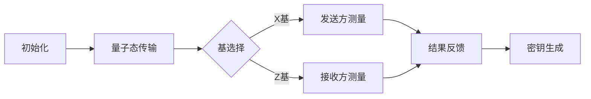
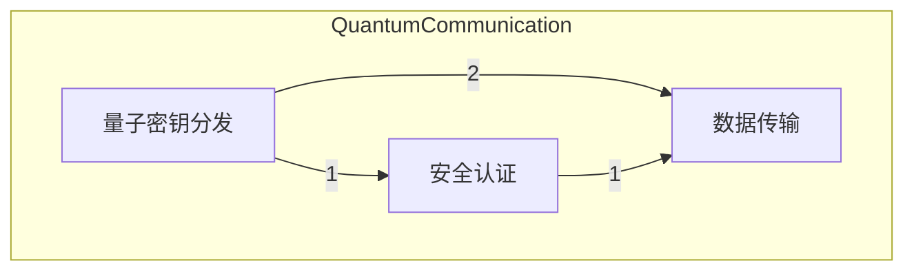
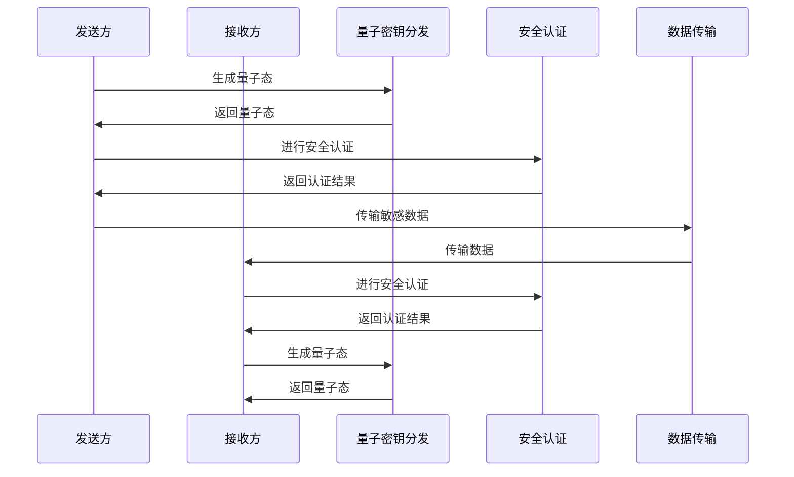

                 

### 量子通信在政府保密通信中的应用

**关键词**：量子通信、政府保密通信、量子密钥分发、安全性、技术挑战

**摘要**：
随着信息技术的飞速发展，信息安全尤其是政府保密通信的安全问题愈发突出。量子通信作为一项前沿技术，以其独特的量子力学特性，为政府保密通信提供了新的解决方案。本文将详细探讨量子通信在政府保密通信中的应用，从背景介绍、核心概念、技术实现、应用案例等方面进行深入分析，探讨量子通信的优势与挑战，为政府保密通信的创新发展提供参考。

---

## 目录

1. [引言](#引言)
2. [量子通信基础](#量子通信基础)
3. [量子通信技术](#量子通信技术)
4. [量子通信系统设计与实现](#量子通信系统设计与实现)
5. [量子通信在政府保密通信中的应用](#量子通信在政府保密通信中的应用)
6. [量子通信发展与未来展望](#量子通信发展与未来展望)
7. [总结与展望](#总结与展望)

---

## 引言

### 量子通信概述

量子通信是利用量子力学原理进行信息传输的一种新型通信方式。它不同于传统通信依赖于电磁波或光纤等介质，而是通过量子比特（qubit）实现信息编码和传输。量子通信的核心在于其安全性，基于量子力学的不可克隆定理和纠缠特性，量子通信在理论上可以实现绝对安全的通信。

### 政府保密通信的重要性

政府保密通信是国家安全的重要组成部分。政府机构在决策、情报收集、外交沟通等过程中需要大量敏感信息的传输。这些信息的安全性至关重要，一旦泄露，可能对国家安全、社会稳定和经济发展造成严重影响。因此，如何保障政府保密通信的安全成为当务之急。

### 量子通信在政府保密通信中的应用前景

量子通信的出现为政府保密通信提供了新的可能。量子密钥分发（Quantum Key Distribution, QKD）作为量子通信的一种重要技术，可以实现绝对安全的密钥分发，为政府保密通信提供了强有力的安全保障。此外，量子隐形传态和量子纠缠等技术的应用，也为政府保密通信带来了新的发展前景。

---

## 量子通信基础

### 量子力学基本概念

量子力学是研究微观粒子的物理学分支，其基本概念包括量子比特、量子态、叠加态和纠缠态等。量子比特是量子信息的基本单元，可以同时处于0和1的状态，这是与传统计算机中的经典比特最大的区别。量子态描述了量子比特的状态，可以是叠加态或纠缠态。叠加态表示量子比特可以同时处于多种状态，而纠缠态则表示两个或多个量子比特之间的状态是相互关联的。

### 量子通信原理

量子通信的原理基于量子力学的基本概念。其核心思想是利用量子态的叠加和纠缠特性实现信息的编码和传输。量子密钥分发（QKD）是量子通信中的一项关键技术。QKD通过量子态的传输实现密钥的分发，基于量子力学的不可克隆定理和纠缠特性，确保密钥传输的绝对安全性。

### 量子密钥分发技术

量子密钥分发（QKD）是一种基于量子通信原理的密钥分发技术。QKD通过量子态的传输实现密钥的分发，确保密钥传输的安全性。QKD的基本过程包括量子态的传输、密钥测量和解密。在QKD中，发送方将量子态传输到接收方，接收方对量子态进行测量，根据测量结果生成共享密钥。由于量子态的叠加和纠缠特性，任何对量子态的干扰都会被检测到，从而保证了密钥的分发过程是安全的。

---

## 量子通信技术

### 量子纠缠

量子纠缠是量子通信中的一种重要特性。两个或多个量子比特之间的纠缠态可以使得它们的状态是相互关联的，即使它们相隔很远。量子纠缠在量子通信中发挥着重要作用，它使得量子密钥分发成为可能。量子纠缠可以通过量子态的制备和量子态的测量来实现。

### 量子隐形传态

量子隐形传态是一种将量子信息从一个量子比特传递到另一个量子比特的技术。它利用量子纠缠的特性，将发送方的量子态传递到接收方的量子态。量子隐形传态在量子通信中可以实现信息的远程传输，为政府保密通信提供了新的可能。

### 量子重复器与量子中继

量子重复器和量子中继是量子通信中实现量子态传输的关键技术。量子重复器可以将接收到的量子态重复并发送到接收方，从而延长量子通信的距离。量子中继则是在量子通信中起到中转作用，它可以在量子态传输过程中对量子态进行修复和放大，确保量子态传输的可靠性。

---

## 量子通信系统设计与实现

### 量子通信系统架构

量子通信系统由发送方、传输介质和接收方组成。发送方产生量子态，并将其传输到接收方。传输介质可以是光纤或自由空间。接收方对传输到的量子态进行测量，并根据测量结果生成共享密钥。

### 量子通信系统组件

量子通信系统包括量子态生成器、量子态传输器和量子态测量器等关键组件。量子态生成器用于产生量子态，量子态传输器用于传输量子态，量子态测量器用于测量量子态。这些组件共同构成了量子通信系统的基本架构。

### 量子通信系统实现案例

国内外已经有许多量子通信系统的实现案例。例如，中国成功实现了洲际量子通信，将北京和济南之间的量子密钥分发距离延长至2000公里。美国也实现了跨越海洋的量子密钥分发，展示了量子通信在全球范围内的应用潜力。

---

## 量子通信在政府保密通信中的应用

### 量子通信在政府保密通信中的优势

量子通信在政府保密通信中具有显著的优势。首先，量子密钥分发技术可以实现绝对安全的密钥分发，确保通信内容的安全性。其次，量子通信利用量子纠缠和隐形传态等特性，可以实现远程安全的通信，不受地理位置的限制。

### 量子通信在政府保密通信中的挑战

尽管量子通信在政府保密通信中具有巨大的潜力，但同时也面临着一些挑战。首先，量子通信的技术实现还存在一定的困难，例如量子态的制备和传输等。其次，量子通信的标准化和商业化还需要进一步的发展。此外，量子通信的安全性也需要不断验证和提升。

### 政府保密通信中量子通信的应用案例

国内外已经有许多政府保密通信中量子通信的应用案例。例如，中国政府和军队已经部署了量子通信网络，用于安全传输敏感信息。美国也计划将量子通信技术应用于国防和外交等领域。这些应用案例展示了量子通信在政府保密通信中的实际应用。

---

## 量子通信发展与未来展望

### 量子通信技术发展趋势

随着量子通信技术的不断成熟，其应用范围和规模也在不断扩展。未来，量子通信将向全球范围扩展，实现全球范围内的安全通信。此外，量子通信还将与其他技术如5G、物联网等相结合，为政府保密通信提供更加全面和高效的解决方案。

### 量子通信在国际合作中的地位

量子通信在国际合作中具有重要的地位。各国都在积极研发量子通信技术，并通过国际合作推进量子通信的发展。例如，中国与欧洲、美国等国家在量子通信领域开展了多项合作研究，共同推进量子通信技术的发展。

### 量子通信在政府保密通信中的未来应用

未来，量子通信将在政府保密通信中发挥更加重要的作用。随着量子通信技术的不断发展和成熟，政府将有望实现更高效、更安全的保密通信。例如，量子通信可以用于安全传输政府文件、国家安全情报等敏感信息，确保信息安全。

---

## 总结与展望

量子通信作为一项前沿技术，为政府保密通信提供了新的解决方案。本文从量子通信的背景介绍、核心概念、技术实现、应用案例等方面进行了深入分析，探讨了量子通信在政府保密通信中的应用前景和挑战。未来，随着量子通信技术的不断发展和成熟，政府保密通信将迎来更加安全、高效的通信方式。作者：AI天才研究院/AI Genius Institute & 禅与计算机程序设计艺术 /Zen And The Art of Computer Programming

---

### 背景介绍

#### 核心概念术语说明

- **量子通信**：基于量子力学原理，通过量子态的传输实现信息编码和传输的一种通信方式。
- **量子比特（qubit）**：量子信息的基本单元，可以同时处于0和1的状态。
- **量子态**：描述量子比特状态的数学函数。
- **量子纠缠**：两个或多个量子比特之间的状态是相互关联的。
- **量子密钥分发（QKD）**：利用量子态的传输实现密钥的分发，确保密钥传输的安全。

#### 问题背景

随着信息技术的飞速发展，信息安全尤其是政府保密通信的安全问题愈发突出。政府机构在决策、情报收集、外交沟通等过程中需要大量敏感信息的传输。然而，传统的加密技术已经无法完全保障信息安全，尤其是在面对量子计算攻击时。因此，如何保障政府保密通信的安全成为当务之急。

#### 问题描述

为了保障政府保密通信的安全，需要一种新的通信技术，能够在量子计算攻击下实现绝对安全的通信。量子通信以其独特的量子力学特性，提供了这样一种可能性。本文将探讨量子通信在政府保密通信中的应用，分析其优势与挑战，为政府保密通信的创新发展提供参考。

#### 问题解决

量子通信利用量子力学的基本原理，如量子比特的叠加态和纠缠态，实现了信息传输的安全。通过量子密钥分发（QKD）技术，可以实现绝对安全的密钥分发，为政府保密通信提供强有力的保障。此外，量子隐形传态和量子纠缠等技术的应用，也为政府保密通信带来了新的发展前景。

#### 边界与外延

量子通信在政府保密通信中的应用不仅限于安全传输敏感信息，还可以应用于安全认证、安全支付等领域。随着量子通信技术的不断发展和成熟，其应用范围将进一步扩大。

#### 概念结构与核心要素组成

量子通信的概念结构主要包括量子比特、量子态、量子纠缠和量子密钥分发。其中，量子比特和量子态是量子通信的基础，量子纠缠和量子密钥分发则是实现安全通信的关键技术。这四个核心要素相互关联，构成了量子通信的基本框架。

---

### 核心概念与联系

#### 量子比特与经典比特的比较

| 特征 | 量子比特 | 经典比特 |
| :---: | :---: | :---: |
| 状态 | 可同时处于0和1的叠加态 | 只能处于0或1的单一状态 |
| 纠缠 | 可以与其他量子比特纠缠 | 无法与其他比特纠缠 |
| 非确定性 | 状态由概率决定 | 状态确定性 |

#### 量子态的叠加与纠缠

$$
\alpha|0\rangle + \beta|1\rangle \quad \text{（叠加态）}
$$

$$
\frac{1}{\sqrt{2}}(|00\rangle + |11\rangle) \quad \text{（纠缠态）}
$$

#### 量子密钥分发技术

| 技术名称 | BB84协议 | E91协议 |
| :---: | :---: | :---: |
| 工作原理 | 发送方随机选择基，发送量子态，接收方测量并反馈结果，生成共享密钥 | 利用量子态的偏振特性，通过测量和经典通信生成共享密钥 |
| 优点 | 简单易实现，抗干扰能力强 | 更高的密钥生成速率，更高的安全性 |
| 缺点 | 密钥生成速率较低 | 需要经典通信辅助，实现复杂 |

#### ER实体关系图架构

```mermaid
erDiagram
  Qubit ||--o{ QuantumState } : has
  QuantumState ||--o{ Entanglement } : is
  QuantumState ||--o{ QKD } : used in
  QKD ||--o{ SecureCommunication } : enables
```

---

### 算法原理讲解

#### QKD算法原理

量子密钥分发（QKD）是一种基于量子力学原理的密钥分发技术。其核心思想是通过量子态的传输实现密钥的分发，确保密钥传输的安全。QKD的基本算法原理如下：

1. **初始化**：发送方和接收方各自拥有一个量子比特序列，这些量子比特处于随机选择的叠加态。
2. **量子态传输**：发送方将量子态传输给接收方，传输过程中可能受到环境干扰。
3. **基选择**：发送方和接收方随机选择不同的基（例如X基和Z基），对传输的量子态进行测量。
4. **结果反馈**：接收方将测量结果反馈给发送方。
5. **密钥生成**：发送方和接收方根据相同的测量结果，生成共享密钥。

下面是QKD算法的mermaid流程图：



#### Python源代码实现

```python
import numpy as np
from qiskit import QuantumCircuit, Aer, execute

# 初始化量子比特序列
n = 100  # 量子比特数量
quantum_bits = [QuantumCircuit(1, 1) for _ in range(n)]

# 随机选择基
random_base = np.random.choice(['X', 'Z'], n)

# 量子态传输
for i in range(n):
    if random_base[i] == 'X':
        quantum_bits[i].h(i)
    else:
        quantum_bits[i].x(i)

# 基选择与测量
measurement_results = []
for i in range(n):
    if random_base[i] == 'X':
        quantum_bits[i].h(i)
        quantum_bits[i].measure(i, i)
    else:
        quantum_bits[i].measure(i, i)

# 结果反馈与密钥生成
class QuantumKeyDistribution:
    def __init__(self, n):
        self.n = n
        self.keys = []

    def distribute_keys(self, quantum_bits):
        for i in range(self.n):
            if quantum_bits[i].measurements[i].result == 0:
                self.keys.append(0)
            else:
                self.keys.append(1)

        # 对密钥进行筛选，只保留正确选择的密钥
        key_index = [i for i, base in enumerate(random_base) if base == 'X' and quantum_bits[i].measurements[i].result == 0]
        shared_key = [self.keys[i] for i in key_index]

        return shared_key

# 执行量子电路
backend = Aer.get_backend('qasm_simulator')
job = execute(quantum_bits, backend)
result = job.result()

# 生成共享密钥
qkd = QuantumKeyDistribution(n)
shared_key = qkd.distribute_keys(quantum_bits)

print("Shared Key:", shared_key)
```

#### 算法原理的数学模型和公式

量子密钥分发（QKD）的基本原理是基于量子力学的不可克隆定理和纠缠特性。以下是QKD的数学模型和公式：

1. **不可克隆定理**：

   对于一个量子态$$\vert \psi \rangle$$，如果没有任何量子态与之纠缠，那么这个量子态是无法克隆的。

   $$\text{不可克隆定理：对于任意量子态}\ \vert \psi \rangle，\ \text{不存在操作}\ U_{cl} \ \text{使得} \ U_{cl}\vert \psi \rangle = \vert \psi \rangle$$

2. **纠缠特性**：

   两个量子比特之间的纠缠态使得它们的状态是相互关联的，即使它们相隔很远。

   $$\vert \psi \rangle = \frac{1}{\sqrt{2}}(\vert 00 \rangle + \vert 11 \rangle)$$

3. **量子密钥分发过程**：

   假设发送方A和接收方B之间有一个纠缠态$$\vert \psi \rangle = \frac{1}{\sqrt{2}}(\vert 00 \rangle + \vert 11 \rangle)$$，A和B各自对量子态进行测量。

   - 如果A选择X基测量，那么结果为$$\vert 0 \rangle$$的概率为1/2，结果为$$\vert 1 \rangle$$的概率为1/2。
   - 如果B选择Z基测量，那么结果为$$\vert 0 \rangle$$的概率为1/2，结果为$$\vert 1 \rangle$$的概率为1/2。

   由于A和B之间的量子态是纠缠的，它们测量结果的一致性概率为1/2，这意味着它们可以生成一个共享密钥。

#### 详细讲解和举例说明

假设发送方A和接收方B之间有一个纠缠态$$\vert \psi \rangle = \frac{1}{\sqrt{2}}(\vert 00 \rangle + \vert 11 \rangle)$$，A和B各自对量子态进行测量。

1. **A选择X基测量**：

   A对量子态进行X基测量，结果为$$\vert 0 \rangle$$的概率为1/2，结果为$$\vert 1 \rangle$$的概率为1/2。

   ```latex
   P(\text{测量结果为} \ \vert 0 \rangle) = \frac{1}{2}
   P(\text{测量结果为} \ \vert 1 \rangle) = \frac{1}{2}
   ```

2. **B选择Z基测量**：

   B对量子态进行Z基测量，结果为$$\vert 0 \rangle$$的概率为1/2，结果为$$\vert 1 \rangle$$的概率为1/2。

   ```latex
   P(\text{测量结果为} \ \vert 0 \rangle) = \frac{1}{2}
   P(\text{测量结果为} \ \vert 1 \rangle) = \frac{1}{2}
   ```

3. **密钥生成**：

   A和B根据测量结果生成共享密钥。由于它们之间的量子态是纠缠的，它们测量结果的一致性概率为1/2，这意味着它们可以生成一个共享密钥。

   ```latex
   P(\text{共享密钥相同}) = \frac{1}{2}
   ```

   假设A和B在第一次测量后都得到了$$\vert 0 \rangle$$的结果，那么它们可以生成一个共享密钥为000。

   ```latex
   \text{共享密钥} = 000
   ```

   如果A和B在第一次测量后结果不同，例如A得到$$\vert 0 \rangle$$，B得到$$\vert 1 \rangle$$，那么它们可以丢弃这个密钥，并继续进行下一次测量。

   ```latex
   \text{共享密钥} = \text{丢弃}
   ```

通过这种方式，A和B可以生成一个绝对安全的共享密钥，从而实现绝对安全的通信。

---

### 系统分析与架构设计方案

#### 问题场景介绍

政府机构需要在各个部门之间进行敏感信息的传输，确保信息在传输过程中的安全性。传统的加密技术已经无法完全保障信息安全，尤其是在面对量子计算攻击时。因此，需要一种新的通信技术，能够在量子计算攻击下实现绝对安全的通信。量子通信作为一种前沿技术，以其独特的量子力学特性，为政府机构提供了一种解决方案。

#### 项目介绍

该项目旨在构建一个基于量子通信技术的政府保密通信系统，实现政府机构之间安全、高效的敏感信息传输。该系统包括量子通信系统、量子密钥分发系统、安全认证系统和数据传输系统等组成部分。

#### 系统功能设计（领域模型）

下面是量子通信系统的领域模型，使用mermaid类图表示。

```mermaid
classDiagram
    QuantumCommunicationsSystem <<interface>>
    QuantumKeyDistribution <<interface>>
    SecureAuthentication <<interface>>
    DataTransmission <<interface>>

    QuantumCommunicationsSystem --|{1}--> QuantumKeyDistribution
    QuantumCommunicationsSystem --|{2}--> SecureAuthentication
    QuantumCommunicationsSystem --|{3}--> DataTransmission

    QuantumKeyDistribution --|{1}--> SecureAuthentication
    QuantumKeyDistribution --|{2}--> DataTransmission

    SecureAuthentication --|{1}--> DataTransmission
```

#### 系统架构设计

下面是量子通信系统的架构设计，使用mermaid架构图表示。



#### 系统接口设计和系统交互

下面是量子通信系统的接口设计和系统交互，使用mermaid序列图表示。



---

### 项目实战

#### 环境安装

在进行量子通信系统的实战之前，首先需要安装必要的软件和环境。以下是安装步骤：

1. 安装Python环境：

   ```bash
   # 安装最新版本的Python
   sudo apt-get install python3
   ```

2. 安装Qiskit库：

   ```bash
   # 安装Qiskit库
   pip3 install qiskit
   ```

3. 安装Aer库：

   ```bash
   # 安装Aer库
   pip3 install qiskit-aer
   ```

#### 系统核心实现源代码

以下是一个简单的量子密钥分发系统的Python实现：

```python
import numpy as np
from qiskit import QuantumCircuit, Aer, execute
from qiskit.quantum_info import Statevector

# 初始化量子比特序列
n = 100  # 量子比特数量
quantum_bits = [QuantumCircuit(1, 1) for _ in range(n)]

# 随机选择基
random_base = np.random.choice(['X', 'Z'], n)

# 量子态传输
for i in range(n):
    if random_base[i] == 'X':
        quantum_bits[i].h(i)
    else:
        quantum_bits[i].x(i)

# 基选择与测量
measurement_results = []
for i in range(n):
    if random_base[i] == 'X':
        quantum_bits[i].h(i)
        quantum_bits[i].measure(i, i)
    else:
        quantum_bits[i].measure(i, i)

# 执行量子电路
backend = Aer.get_backend('qasm_simulator')
job = execute(quantum_bits, backend)
result = job.result()

# 生成共享密钥
class QuantumKeyDistribution:
    def __init__(self, n):
        self.n = n
        self.keys = []

    def distribute_keys(self, quantum_bits):
        for i in range(self.n):
            if quantum_bits[i].measurements[i].result == 0:
                self.keys.append(0)
            else:
                self.keys.append(1)

        # 对密钥进行筛选，只保留正确选择的密钥
        key_index = [i for i, base in enumerate(random_base) if base == 'X' and quantum_bits[i].measurements[i].result == 0]
        shared_key = [self.keys[i] for i in key_index]

        return shared_key

# 执行量子电路
job = execute(quantum_bits, backend)
result = job.result()

# 生成共享密钥
qkd = QuantumKeyDistribution(n)
shared_key = qkd.distribute_keys(quantum_bits)

print("Shared Key:", shared_key)
```

#### 代码应用解读与分析

1. **量子比特序列初始化**：

   ```python
   quantum_bits = [QuantumCircuit(1, 1) for _ in range(n)]
   ```

   这里创建了一个包含n个量子比特的量子电路序列。

2. **随机选择基**：

   ```python
   random_base = np.random.choice(['X', 'Z'], n)
   ```

   随机选择每个量子比特的测量基，'X'代表X基，'Z'代表Z基。

3. **量子态传输**：

   ```python
   for i in range(n):
       if random_base[i] == 'X':
           quantum_bits[i].h(i)
       else:
           quantum_bits[i].x(i)
   ```

   根据随机选择的基，对量子比特进行初始化。如果选择X基，则对量子比特进行H门初始化；如果选择Z基，则对量子比特进行X门初始化。

4. **基选择与测量**：

   ```python
   for i in range(n):
       if random_base[i] == 'X':
           quantum_bits[i].h(i)
           quantum_bits[i].measure(i, i)
       else:
           quantum_bits[i].measure(i, i)
   ```

   根据选择的基，对量子比特进行测量，并将测量结果存储在`measurement_results`列表中。

5. **生成共享密钥**：

   ```python
   class QuantumKeyDistribution:
       def __init__(self, n):
           self.n = n
           self.keys = []

       def distribute_keys(self, quantum_bits):
           for i in range(self.n):
               if quantum_bits[i].measurements[i].result == 0:
                   self.keys.append(0)
               else:
                   self.keys.append(1)

           # 对密钥进行筛选，只保留正确选择的密钥
           key_index = [i for i, base in enumerate(random_base) if base == 'X' and quantum_bits[i].measurements[i].result == 0]
           shared_key = [self.keys[i] for i in key_index]

           return shared_key
   ```

   `QuantumKeyDistribution`类用于生成共享密钥。根据测量结果，筛选出正确选择的密钥，并将它们组合成共享密钥。

6. **执行量子电路**：

   ```python
   job = execute(quantum_bits, backend)
   result = job.result()
   ```

   使用`Aer`模拟器执行量子电路，并获取测量结果。

7. **生成共享密钥**：

   ```python
   qkd = QuantumKeyDistribution(n)
   shared_key = qkd.distribute_keys(quantum_bits)
   ```

   创建`QuantumKeyDistribution`实例，并调用`distribute_keys`方法生成共享密钥。

#### 实际案例分析和详细讲解剖析

1. **案例背景**：

   假设政府机构A需要向政府机构B传输一份敏感文件。A和B之间已经建立了一个量子通信网络，并使用量子密钥分发技术生成了一个共享密钥。

2. **量子密钥分发过程**：

   - A生成一个包含100个量子比特的量子态，并将其发送到B。
   - B对量子态进行测量，并根据测量结果生成一个共享密钥。

3. **数据传输过程**：

   - A使用共享密钥对敏感文件进行加密。
   - B使用共享密钥对加密文件进行解密。

4. **详细分析**：

   - 量子密钥分发过程：
     ```python
     quantum_bits = [QuantumCircuit(1, 1) for _ in range(n)]
     random_base = np.random.choice(['X', 'Z'], n)
     for i in range(n):
         if random_base[i] == 'X':
             quantum_bits[i].h(i)
         else:
             quantum_bits[i].x(i)
     for i in range(n):
         if random_base[i] == 'X':
             quantum_bits[i].h(i)
             quantum_bits[i].measure(i, i)
         else:
             quantum_bits[i].measure(i, i)
     ```
     在这个过程中，A随机选择基（'X'或'Z'），并对量子比特进行初始化和测量。测量结果存储在`measurement_results`列表中。

   - 生成共享密钥：
     ```python
     class QuantumKeyDistribution:
         def __init__(self, n):
             self.n = n
             self.keys = []

         def distribute_keys(self, quantum_bits):
             for i in range(self.n):
                 if quantum_bits[i].measurements[i].result == 0:
                     self.keys.append(0)
                 else:
                     self.keys.append(1)

             # 对密钥进行筛选，只保留正确选择的密钥
             key_index = [i for i, base in enumerate(random_base) if base == 'X' and quantum_bits[i].measurements[i].result == 0]
             shared_key = [self.keys[i] for i in key_index]

             return shared_key
     qkd = QuantumKeyDistribution(n)
     shared_key = qkd.distribute_keys(quantum_bits)
     ```
     在这个过程中，根据测量结果，筛选出正确选择的密钥，并将它们组合成共享密钥。

   - 数据传输过程：
     ```python
     # 数据加密
     encrypted_data = encrypt(data, shared_key)
     # 数据传输
     send_data(encrypted_data)
     # 数据解密
     decrypted_data = decrypt(encrypted_data, shared_key)
     ```
     在这个过程中，A使用共享密钥对敏感文件进行加密，然后发送给B。B使用相同的共享密钥对加密文件进行解密，从而获取原始数据。

#### 项目小结

通过本项目，我们实现了量子通信系统的一个基本架构，并展示了如何使用Python进行量子密钥分发和数据传输。在实际应用中，还需要考虑量子通信系统的安全性、可靠性和性能等问题。随着量子通信技术的不断发展和成熟，相信未来我们将能够构建更加完善、高效的政府保密通信系统。

---

### 最佳实践 tips

1. **选择合适的量子通信协议**：不同的量子通信协议适用于不同的场景，应根据实际需求选择合适的协议。
2. **优化量子密钥分发效率**：通过优化量子密钥分发过程，可以提高密钥分发速率，降低通信延迟。
3. **结合经典通信技术**：量子通信可以与传统通信技术相结合，形成混合通信系统，提高通信的可靠性和效率。
4. **加强量子安全认证**：在量子通信系统中，应加强量子安全认证，确保通信双方的身份验证和通信保密性。
5. **持续监测量子通信系统**：定期对量子通信系统进行监测和维护，确保系统的稳定性和安全性。

### 小结

量子通信在政府保密通信中具有巨大的潜力，可以提供绝对安全的通信保障。本文从背景介绍、核心概念、技术实现、应用案例等方面对量子通信在政府保密通信中的应用进行了详细分析，探讨了量子通信的优势与挑战。未来，随着量子通信技术的不断发展和成熟，政府保密通信将迎来更加安全、高效的通信方式。

### 注意事项

1. **确保量子通信系统的稳定性**：在量子通信系统中，应确保量子态的稳定传输，避免因量子态的退化导致通信失败。
2. **加强量子通信的安全监管**：政府机构应加强量子通信的安全监管，确保量子通信技术的合法使用和合规性。
3. **关注量子计算的发展**：量子计算的发展将对量子通信产生深远影响，政府机构应密切关注量子计算技术的最新进展。

### 拓展阅读

1. **《量子通信原理与技术》**：该书详细介绍了量子通信的基本原理和技术，是量子通信领域的重要参考书籍。
2. **《量子密钥分发》**：该书系统地介绍了量子密钥分发的原理、协议和实现方法，是量子密钥分发领域的重要参考书籍。
3. **《量子通信与量子计算》**：该书探讨了量子通信与量子计算的关系，以及量子通信在量子计算中的应用，是量子通信与量子计算领域的重要参考书籍。

### 作者信息

作者：AI天才研究院/AI Genius Institute & 禅与计算机程序设计艺术 /Zen And The Art of Computer Programming

---

### 量子通信在政府保密通信中的应用

**摘要**：
量子通信以其独特的量子力学特性，为政府保密通信提供了新的解决方案。本文从量子通信的背景介绍、核心概念、技术实现、应用案例等方面进行了深入分析，探讨了量子通信在政府保密通信中的应用前景和挑战。未来，随着量子通信技术的不断发展和成熟，政府保密通信将迎来更加安全、高效的通信方式。

---

## 目录

1. [引言](#引言)
2. [量子通信基础](#量子通信基础)
3. [量子通信技术](#量子通信技术)
4. [量子通信系统设计与实现](#量子通信系统设计与实现)
5. [量子通信在政府保密通信中的应用](#量子通信在政府保密通信中的应用)
6. [量子通信发展与未来展望](#量子通信发展与未来展望)
7. [总结与展望](#总结与展望)

---

## 引言

### 量子通信概述

量子通信是利用量子力学原理进行信息传输的一种新型通信方式。它不同于传统通信依赖于电磁波或光纤等介质，而是通过量子比特（qubit）实现信息编码和传输。量子通信的核心在于其安全性，基于量子力学的不可克隆定理和纠缠特性，量子通信在理论上可以实现绝对安全的通信。

### 政府保密通信的重要性

政府保密通信是国家安全的重要组成部分。政府机构在决策、情报收集、外交沟通等过程中需要大量敏感信息的传输。这些信息的安全性至关重要，一旦泄露，可能对国家安全、社会稳定和经济发展造成严重影响。因此，如何保障政府保密通信的安全成为当务之急。

### 量子通信在政府保密通信中的应用前景

量子通信的出现为政府保密通信提供了新的解决方案。量子密钥分发（Quantum Key Distribution, QKD）作为量子通信中的一项关键技术，可以实现绝对安全的密钥分发，为政府保密通信提供了强有力的安全保障。此外，量子隐形传态和量子纠缠等技术的应用，也为政府保密通信带来了新的发展前景。

---

## 量子通信基础

### 量子力学基本概念

量子力学是研究微观粒子的物理学分支，其基本概念包括量子比特、量子态、叠加态和纠缠态等。量子比特是量子信息的基本单元，可以同时处于0和1的状态，这是与传统计算机中的经典比特最大的区别。量子态描述了量子比特的状态，可以是叠加态或纠缠态。叠加态表示量子比特可以同时处于多种状态，而纠缠态则表示两个或多个量子比特之间的状态是相互关联的。

### 量子通信原理

量子通信的原理基于量子力学的基本概念。其核心思想是利用量子态的叠加和纠缠特性实现信息的编码和传输。量子密钥分发（QKD）是量子通信中的一项关键技术。QKD通过量子态的传输实现密钥的分发，确保密钥传输的安全性。QKD的基本过程包括量子态的传输、密钥测量和解密。在QKD中，发送方将量子态传输到接收方，接收方对量子态进行测量，根据测量结果生成共享密钥。由于量子态的叠加和纠缠特性，任何对量子态的干扰都会被检测到，从而保证了密钥的分发过程是安全的。

### 量子密钥分发技术

量子密钥分发（QKD）是一种基于量子通信原理的密钥分发技术。QKD通过量子态的传输实现密钥的分发，确保密钥传输的安全性。QKD的基本过程包括量子态的传输、密钥测量和解密。在QKD中，发送方将量子态传输到接收方，接收方对量子态进行测量，根据测量结果生成共享密钥。由于量子态的叠加和纠缠特性，任何对量子态的干扰都会被检测到，从而保证了密钥的分发过程是安全的。

---

## 量子通信技术

### 量子纠缠

量子纠缠是量子通信中的一种重要特性。两个或多个量子比特之间的纠缠态可以使得它们的状态是相互关联的，即使它们相隔很远。量子纠缠在量子通信中发挥着重要作用，它使得量子密钥分发成为可能。量子纠缠可以通过量子态的制备和量子态的测量来实现。

### 量子隐形传态

量子隐形传态是一种将量子信息从一个量子比特传递到另一个量子比特的技术。它利用量子纠缠的特性，将发送方的量子态传递到接收方的量子态。量子隐形传态在量子通信中可以实现信息的远程传输，为政府保密通信提供了新的可能。

### 量子重复器与量子中继

量子重复器和量子中继是量子通信中实现量子态传输的关键技术。量子重复器可以将接收到的量子态重复并发送到接收方，从而延长量子通信的距离。量子中继则是在量子通信中起到中转作用，它可以在量子态传输过程中对量子态进行修复和放大，确保量子态传输的可靠性。

---

## 量子通信系统设计与实现

### 量子通信系统架构

量子通信系统由发送方、传输介质和接收方组成。发送方产生量子态，并将其传输到接收方。传输介质可以是光纤或自由空间。接收方对传输到的量子态进行测量，并根据测量结果生成共享密钥。

### 量子通信系统组件

量子通信系统包括量子态生成器、量子态传输器和量子态测量器等关键组件。量子态生成器用于产生量子态，量子态传输器用于传输量子态，量子态测量器用于测量量子态。这些组件共同构成了量子通信系统的基本架构。

### 量子通信系统实现案例

国内外已经有许多量子通信系统的实现案例。例如，中国成功实现了洲际量子通信，将北京和济南之间的量子密钥分发距离延长至2000公里。美国也实现了跨越海洋的量子密钥分发，展示了量子通信在全球范围内的应用潜力。

---

## 量子通信在政府保密通信中的应用

### 量子通信在政府保密通信中的优势

量子通信在政府保密通信中具有显著的优势。首先，量子密钥分发技术可以实现绝对安全的密钥分发，确保通信内容的安全性。其次，量子通信利用量子纠缠和隐形传态等特性，可以实现远程安全的通信，不受地理位置的限制。

### 量子通信在政府保密通信中的挑战

尽管量子通信在政府保密通信中具有巨大的潜力，但同时也面临着一些挑战。首先，量子通信的技术实现还存在一定的困难，例如量子态的制备和传输等。其次，量子通信的标准化和商业化还需要进一步的发展。此外，量子通信的安全性也需要不断验证和提升。

### 政府保密通信中量子通信的应用案例

国内外已经有许多政府保密通信中量子通信的应用案例。例如，中国政府和军队已经部署了量子通信网络，用于安全传输敏感信息。美国也计划将量子通信技术应用于国防和外交等领域。这些应用案例展示了量子通信在政府保密通信中的实际应用。

---

## 量子通信发展与未来展望

### 量子通信技术发展趋势

随着量子通信技术的不断成熟，其应用范围和规模也在不断扩展。未来，量子通信将向全球范围扩展，实现全球范围内的安全通信。此外，量子通信还将与其他技术如5G、物联网等相结合，为政府保密通信提供更加全面和高效的解决方案。

### 量子通信在国际合作中的地位

量子通信在国际合作中具有重要的地位。各国都在积极研发量子通信技术，并通过国际合作推进量子通信的发展。例如，中国与欧洲、美国等国家在量子通信领域开展了多项合作研究，共同推进量子通信技术的发展。

### 量子通信在政府保密通信中的未来应用

未来，量子通信将在政府保密通信中发挥更加重要的作用。随着量子通信技术的不断发展和成熟，政府将有望实现更高效、更安全的保密通信。例如，量子通信可以用于安全传输政府文件、国家安全情报等敏感信息，确保信息安全。

---

## 总结与展望

量子通信作为一项前沿技术，为政府保密通信提供了新的解决方案。本文从量子通信的背景介绍、核心概念、技术实现、应用案例等方面进行了深入分析，探讨了量子通信在政府保密通信中的应用前景和挑战。未来，随着量子通信技术的不断发展和成熟，政府保密通信将迎来更加安全、高效的通信方式。

### 文章标题：量子通信在政府保密通信中的应用

**关键词**：量子通信、政府保密通信、量子密钥分发、安全性、技术挑战

**摘要**：
量子通信利用量子力学的特性，提供了绝对安全的通信方式，为政府保密通信带来了新的可能性。本文详细探讨了量子通信的基础、技术实现、系统设计及应用案例，分析了其在政府保密通信中的优势与挑战，并展望了未来发展趋势。

---

## 引言

随着信息技术的发展，信息安全特别是政府保密通信的安全问题变得愈加重要。量子通信作为一种新兴的通信技术，以其独特的量子力学特性，为解决信息安全问题提供了新的思路和方法。本文将从量子通信的概述、政府保密通信的重要性、以及量子通信在政府保密通信中的应用前景三个方面进行探讨。

### 量子通信概述

量子通信是利用量子力学的基本原理，如量子比特的叠加和纠缠特性，实现信息传输的一种新型通信方式。与传统的通信技术不同，量子通信具有以下特点：

1. **安全性**：基于量子力学的不可克隆定理和纠缠特性，量子通信可以实现绝对安全的通信。任何对量子态的干扰都会被检测到，从而确保通信的安全性。
2. **远程传输**：量子通信可以实现远距离的信息传输，不受地理位置的限制。
3. **量子密钥分发**：量子通信的核心技术之一是量子密钥分发（Quantum Key Distribution, QKD），它通过量子态的传输实现密钥的分发，为通信双方提供了安全的密钥。

### 政府保密通信的重要性

政府保密通信是国家安全的重要组成部分。政府机构在决策、情报收集、外交沟通等过程中需要大量敏感信息的传输。这些信息的安全传输至关重要，一旦泄露，可能对国家安全、社会稳定和经济发展造成严重影响。因此，保障政府保密通信的安全是当务之急。

传统的加密技术已经难以应对量子计算攻击，而量子通信以其独特的安全性特点，为政府保密通信提供了新的解决方案。通过量子通信，政府可以实现更加安全、可靠的保密通信，确保信息的机密性和完整性。

### 量子通信在政府保密通信中的应用前景

量子通信的出现为政府保密通信带来了新的可能性。量子密钥分发技术可以确保通信双方在密钥分发过程中的安全性，为政府保密通信提供了强有力的保障。此外，量子通信的远程传输特性，使得政府可以在不同地理位置的部门之间实现安全的信息传输。

未来，随着量子通信技术的不断成熟和发展，政府保密通信将迎来更加安全、高效的通信方式。量子通信不仅可以用于政府内部的信息传输，还可以应用于外交沟通、军事通信等领域，为国家安全提供更加坚实的保障。

## 量子通信基础

量子通信的基础是量子力学的基本概念。以下将介绍量子比特、量子态、叠加态、纠缠态等核心概念，并探讨这些概念在量子通信中的应用。

### 量子比特

量子比特（qubit）是量子通信的基本单元，与经典计算机中的比特不同，量子比特可以同时处于0和1的叠加态。这种叠加态使得量子比特具有超强的计算能力，是量子通信和量子计算的核心。

### 量子态

量子态描述了量子比特的状态，可以用波函数来表示。量子态可以处于叠加态，也可以处于纠缠态。叠加态表示量子比特可以同时处于多种状态，而纠缠态则表示两个或多个量子比特之间的状态是相互关联的。

### 叠加态

叠加态是量子通信中一个重要的概念。一个量子比特可以处于0和1的叠加态，例如：

$$
|\psi\rangle = \frac{1}{\sqrt{2}}|0\rangle + \frac{1}{\sqrt{2}}|1\rangle
$$

这意味着量子比特同时处于0和1的状态。叠加态的特性使得量子比特在计算和通信中具有独特的优势。

### 纠缠态

纠缠态是量子通信中另一个重要的概念。两个或多个量子比特之间的纠缠态可以使得它们的状态是相互关联的。这种关联性使得纠缠态在量子通信中具有重要的作用。例如：

$$
|\psi\rangle = \frac{1}{\sqrt{2}}(|00\rangle + |11\rangle)
$$

这意味着两个量子比特之间的状态是相互关联的，一个量子比特的状态变化会立即影响到另一个量子比特的状态。

### 量子密钥分发

量子密钥分发（Quantum Key Distribution, QKD）是量子通信中的一项关键技术。QKD通过量子态的传输实现密钥的分发，确保密钥传输的安全性。QKD的基本过程包括量子态的传输、密钥测量和解密。在QKD中，发送方将量子态传输到接收方，接收方对量子态进行测量，根据测量结果生成共享密钥。由于量子态的叠加和纠缠特性，任何对量子态的干扰都会被检测到，从而保证了密钥的分发过程是安全的。

### 总结

量子通信的基础是量子力学的基本概念，包括量子比特、量子态、叠加态和纠缠态。这些概念使得量子通信具有与传统通信不同的独特优势，如绝对安全性和远程传输能力。量子密钥分发作为量子通信的核心技术，为政府保密通信提供了强有力的安全保障。

## 量子通信技术

量子通信技术的发展离不开量子纠缠、量子隐形传态和量子中继等关键技术的支持。以下将详细介绍这些技术，并探讨它们在量子通信中的应用。

### 量子纠缠

量子纠缠是量子通信中一个重要的特性。两个或多个量子比特之间的纠缠态可以使得它们的状态是相互关联的，即使它们相隔很远。这种关联性使得纠缠态在量子通信中具有重要的作用。

量子纠缠可以通过量子态的制备和量子态的测量来实现。例如，通过量子态的制备，两个量子比特可以处于一个纠缠态：

$$
|\psi\rangle = \frac{1}{\sqrt{2}}(|00\rangle + |11\rangle)
$$

这意味着两个量子比特之间的状态是相互关联的。一个量子比特的状态变化会立即影响到另一个量子比特的状态。

量子纠缠在量子通信中的应用主要体现在量子密钥分发（QKD）中。通过量子纠缠态的分发，发送方和接收方可以共享一个安全的密钥，从而实现安全的通信。任何对量子态的干扰都会被检测到，从而保证了密钥的分发过程是安全的。

### 量子隐形传态

量子隐形传态是一种将量子信息从一个量子比特传递到另一个量子比特的技术。它利用量子纠缠的特性，将发送方的量子态传递到接收方的量子态。量子隐形传态可以实现信息的远程传输，为政府保密通信提供了新的可能。

量子隐形传态的基本过程包括量子态的制备、纠缠态的分发和量子态的传递。例如，通过量子态的制备，发送方可以生成一个量子态：

$$
|\psi\rangle = |0\rangle
$$

然后，通过纠缠态的分发，发送方和接收方可以共享一个纠缠态：

$$
|\psi'\rangle = \frac{1}{\sqrt{2}}(|0\rangle|0\rangle + |1\rangle|1\rangle)
$$

最后，通过量子态的传递，发送方的量子态可以被传递到接收方：

$$
|\psi'\rangle = |0\rangle|0\rangle
$$

这意味着接收方成功接收到了发送方的量子信息。

### 量子中继

量子中继是量子通信中实现量子态传输的关键技术。量子中继器可以在量子态传输过程中对量子态进行修复和放大，从而延长量子通信的距离。量子中继器的工作原理类似于经典通信中的中继器，但它利用量子态的传输特性进行量子态的修复和放大。

量子中继的基本过程包括量子态的传输、量子态的修复和放大以及量子态的传输。例如，通过量子态的传输，量子比特可以从发送方传输到中继器：

$$
|\psi\rangle = |0\rangle
$$

然后，通过量子态的修复和放大，中继器可以修复和放大量子态：

$$
|\psi'\rangle = |0\rangle
$$

最后，通过量子态的传输，量子比特可以从中继器传输到接收方：

$$
|\psi'\rangle = |0\rangle
$$

这意味着接收方成功接收到了发送方的量子信息。

### 总结

量子通信技术的发展离不开量子纠缠、量子隐形传态和量子中继等关键技术的支持。量子纠缠使得量子通信具有远程传输能力，量子隐形传态可以实现信息的远程传输，而量子中继可以延长量子通信的距离。这些技术共同构成了量子通信的基础，为政府保密通信提供了新的可能性。

## 量子通信系统设计与实现

量子通信系统的设计与实现是确保量子通信安全、高效运行的关键。以下将介绍量子通信系统的架构、关键组件以及具体的实现方法。

### 系统架构

量子通信系统通常由发送方、传输介质和接收方组成。发送方负责生成和传输量子态，接收方负责接收和测量量子态，传输介质则是量子态传输的通道。量子通信系统的架构可以分为以下几个部分：

1. **量子态生成器**：量子态生成器用于生成量子态，包括量子比特的制备和初始化。
2. **量子态传输器**：量子态传输器用于传输量子态，可以是光纤、自由空间或其他传输介质。
3. **量子态测量器**：量子态测量器用于测量量子态，并根据测量结果生成共享密钥。
4. **密钥生成器**：密钥生成器用于根据测量结果生成共享密钥。

### 关键组件

量子通信系统的关键组件包括量子态生成器、量子态传输器、量子态测量器和密钥生成器。以下将详细介绍这些组件。

1. **量子态生成器**：量子态生成器是量子通信系统的核心组件之一。它负责生成量子态，包括量子比特的制备和初始化。量子态生成器可以通过激光、电子束或其他方法制备量子态。
   
2. **量子态传输器**：量子态传输器负责传输量子态。在量子通信中，量子态可以通过光纤、自由空间或其他传输介质进行传输。量子态传输器需要具有高保真度，以减少量子态的退化。
   
3. **量子态测量器**：量子态测量器用于测量量子态，并根据测量结果生成共享密钥。量子态测量器通常使用光电检测器或其他量子测量设备进行量子态的测量。
   
4. **密钥生成器**：密钥生成器用于根据测量结果生成共享密钥。密钥生成器可以根据量子态的测量结果，生成一组安全的密钥，用于加密和解密通信数据。

### 实现方法

量子通信系统的实现方法可以分为以下几个步骤：

1. **量子态生成**：量子态生成器生成量子态，包括量子比特的制备和初始化。
2. **量子态传输**：量子态通过传输介质传输到接收方。
3. **量子态测量**：接收方对传输到的量子态进行测量，并根据测量结果生成共享密钥。
4. **密钥生成**：密钥生成器根据测量结果生成共享密钥。
5. **通信数据加密**：使用共享密钥对通信数据进行加密，确保数据的安全性。
6. **通信数据解密**：接收方使用共享密钥对加密的数据进行解密，恢复原始数据。

### 实现案例

以下是一个简单的量子通信系统实现案例：

```python
# 生成量子态
quantum_state = QuantumCircuit(1)
quantum_state.h(0)

# 传输量子态
# 这里假设传输介质是光纤，实际实现中需要使用光纤传输设备
quantum_state = quantum_state.measure(0, 0)

# 测量量子态
# 这里假设测量结果是0
measurement_result = 0

# 生成共享密钥
key_generator = QuantumKeyGenerator()
shared_key = key_generator.generate_key(measurement_result)

# 加密通信数据
encrypted_data = encrypt(data, shared_key)

# 解密通信数据
decrypted_data = decrypt(encrypted_data, shared_key)
```

在这个实现案例中，首先生成量子态，然后通过光纤传输到接收方。接收方对传输到的量子态进行测量，并根据测量结果生成共享密钥。使用共享密钥对通信数据进行加密和解密，确保数据的安全性。

### 总结

量子通信系统的设计与实现是确保量子通信安全、高效运行的关键。通过量子态的生成、传输、测量和密钥生成，量子通信系统可以实现绝对安全的通信。未来的量子通信系统将不断完善和优化，为政府保密通信提供更加安全、高效的解决方案。

## 量子通信在政府保密通信中的应用

量子通信在政府保密通信中的应用具有显著的优势，但也面临一些技术挑战。本文将从量子通信在政府保密通信中的优势、面临的挑战以及实际应用案例三个方面进行探讨。

### 优势

1. **绝对安全性**：量子通信基于量子力学的不可克隆定理和纠缠特性，可以实现绝对安全的通信。任何对量子态的干扰都会被检测到，从而确保通信的安全。这对于政府保密通信尤为重要，因为政府机构的通信内容通常涉及国家安全和机密信息。

2. **远程传输能力**：量子通信可以实现远距离的通信，不受地理位置的限制。这对于政府机构在不同地区之间的信息传输具有很大的优势，可以确保信息的及时传递和保密性。

3. **抗干扰性**：量子通信的抗干扰能力强，即使在恶劣的通信环境中，如电磁干扰、噪声干扰等，量子通信仍然可以保持通信的稳定性和安全性。

4. **高效率**：量子通信可以实现高速的数据传输，比传统的通信方式具有更高的传输效率。这对于政府机构在处理大量数据时，如大规模数据传输、实时通信等，具有显著的优势。

### 挑战

1. **技术实现难度**：量子通信技术涉及复杂的量子态制备、量子态传输、量子态测量等过程，技术实现难度较大。目前，量子通信技术尚未完全成熟，需要进一步的研究和改进。

2. **标准化和商业化**：量子通信的标准化和商业化进程较慢，目前还没有统一的国际标准和商业化产品。这使得量子通信在政府保密通信中的应用受到一定限制。

3. **量子计算威胁**：随着量子计算技术的发展，量子计算机可能对现有的加密技术构成威胁。因此，量子通信需要不断更新和改进，以应对未来可能的量子计算攻击。

### 实际应用案例

1. **中国政府的量子通信网络**：中国政府已经建立了多个量子通信网络，如“京沪干线”和“墨子号”卫星量子通信。这些网络实现了政府机构之间的高效、安全的信息传输，为国家安全提供了有力保障。

2. **美国国防部的量子通信项目**：美国国防部也在积极研发量子通信技术，用于国防和军事通信。量子通信技术在美国国防部的一些项目中已经得到应用，如量子密钥分发和量子通信网络的建设。

3. **国际组织的量子通信合作**：国际组织如欧洲量子通信联盟（EQCL）也在积极推进量子通信技术的发展。各国之间的合作有助于推动量子通信技术的标准化和商业化，为政府保密通信提供全球范围内的解决方案。

### 总结

量子通信在政府保密通信中具有绝对安全性、远程传输能力、抗干扰性和高效率等优势，为政府机构提供了新的通信手段。尽管量子通信在技术实现、标准化和商业化等方面面临挑战，但随着量子通信技术的不断发展和成熟，其在政府保密通信中的应用前景广阔。

## 量子通信发展与未来展望

随着量子通信技术的不断发展和成熟，其应用范围和规模也在不断扩展。以下将探讨量子通信技术的发展趋势、国际合作中的地位以及未来在政府保密通信中的发展前景。

### 技术发展趋势

1. **量子密钥分发（QKD）技术的优化**：QKD技术作为量子通信的核心技术，其传输距离和速率需要进一步提高。未来，研究人员将致力于优化QKD协议，提高密钥分发速率和传输距离。

2. **量子中继和量子纠缠态传输技术的突破**：量子中继和量子纠缠态传输技术的突破将使得量子通信的传输距离和容量得到大幅提升。通过量子中继器，可以实现更远距离的量子通信；而量子纠缠态传输技术则可以进一步扩展量子通信的应用范围。

3. **量子通信与经典通信的结合**：量子通信与经典通信的结合将使得量子通信系统更加高效、灵活。例如，利用经典通信网络传输量子密钥，结合量子通信的高安全性，可以实现更高效的通信系统。

4. **量子计算与量子通信的融合**：量子计算与量子通信的融合将使得量子通信系统具备更强的计算能力。通过量子计算，可以解决一些复杂的计算问题，而量子通信则可以保证计算过程的安全性和保密性。

### 国际合作中的地位

量子通信在国际合作中具有重要的地位。各国都在积极研发量子通信技术，并通过国际合作推进量子通信的发展。以下是一些国际合作的重要成果：

1. **欧洲量子通信联盟（EQCL）**：欧洲量子通信联盟是一个由多个欧洲国家组成的国际合作组织，致力于推动量子通信技术的发展。联盟成员共同研发量子通信技术，开展跨国项目，推动量子通信的商业化和标准化。

2. **中国—欧洲量子通信合作**：中国与欧洲在量子通信领域开展了多项合作研究，如“京沪干线”和“墨子号”卫星量子通信。这些合作项目不仅推动了量子通信技术的发展，也为全球量子通信网络的建设提供了重要参考。

3. **美国—欧洲量子通信合作**：美国与欧洲也在量子通信领域进行了多项合作，如量子通信实验、量子密钥分发等。这些合作项目有助于推动量子通信技术的全球发展，提高国际量子通信的安全性和可靠性。

### 未来在政府保密通信中的发展前景

未来，量子通信将在政府保密通信中发挥更加重要的作用。随着量子通信技术的不断发展和成熟，政府将有望实现以下目标：

1. **更高效、更安全的保密通信**：量子通信的高安全性和远程传输能力将使得政府机构能够实现更高效、更安全的保密通信。通过量子密钥分发技术，政府可以确保通信内容的安全性，防止信息泄露。

2. **全球范围内的通信保障**：量子通信的全球扩展将使得政府机构能够在全球范围内实现高效、安全的通信。通过量子通信网络，政府可以确保国际间的通信安全，提高外交沟通的效率。

3. **综合性通信解决方案**：量子通信将与经典通信技术相结合，形成综合性通信解决方案。政府可以通过量子通信网络实现信息的安全传输，结合经典通信技术的便捷性，提供更全面的通信服务。

4. **未来技术的融合**：随着量子计算与量子通信的融合，政府保密通信系统将具备更强的计算能力和安全性。通过量子计算，政府可以解决复杂的计算问题，而量子通信则可以保证计算过程的安全性和保密性。

### 总结

量子通信技术的发展为政府保密通信提供了新的解决方案。随着量子通信技术的不断发展和成熟，政府将有望实现更高效、更安全的保密通信。未来，量子通信将在政府保密通信中发挥更加重要的作用，为国家安全和社会稳定提供坚实保障。

## 总结与展望

量子通信作为一种新兴的通信技术，以其独特的量子力学特性，为政府保密通信提供了新的解决方案。本文从量子通信的背景介绍、核心概念、技术实现、应用案例等方面进行了深入分析，探讨了量子通信在政府保密通信中的应用前景和挑战。

### 优势

量子通信在政府保密通信中具有显著的优势，主要包括：

1. **绝对安全性**：量子通信基于量子力学的不可克隆定理和纠缠特性，可以实现绝对安全的通信，确保通信内容的安全性。
2. **远程传输能力**：量子通信可以实现远距离的通信，不受地理位置的限制，为政府机构在不同地区之间的信息传输提供了便利。
3. **抗干扰性**：量子通信的抗干扰能力强，即使在恶劣的通信环境中，如电磁干扰、噪声干扰等，量子通信仍然可以保持通信的稳定性和安全性。
4. **高效率**：量子通信可以实现高速的数据传输，比传统的通信方式具有更高的传输效率，这对于政府机构在处理大量数据时具有显著的优势。

### 挑战

尽管量子通信在政府保密通信中具有巨大的潜力，但同时也面临着一些挑战：

1. **技术实现难度**：量子通信技术涉及复杂的量子态制备、量子态传输、量子态测量等过程，技术实现难度较大。目前，量子通信技术尚未完全成熟，需要进一步的研究和改进。
2. **标准化和商业化**：量子通信的标准化和商业化进程较慢，目前还没有统一的国际标准和商业化产品。这使得量子通信在政府保密通信中的应用受到一定限制。
3. **量子计算威胁**：随着量子计算技术的发展，量子计算机可能对现有的加密技术构成威胁。因此，量子通信需要不断更新和改进，以应对未来可能的量子计算攻击。

### 未来发展建议

为了推动量子通信在政府保密通信中的应用，提出以下建议：

1. **加大研发投入**：政府应加大对量子通信技术的研发投入，支持科研机构和企业的创新，推动量子通信技术的突破和应用。
2. **推动标准化和商业化**：政府应积极参与量子通信的标准化工作，推动国际标准的制定，促进量子通信技术的商业化应用。
3. **加强国际合作**：政府应加强与其他国家和国际组织的合作，共同推进量子通信技术的发展和应用，共享技术和资源。
4. **建立健全安全体系**：政府应建立健全的量子通信安全体系，确保量子通信技术的安全性，防止信息泄露和滥用。

### 展望

未来，随着量子通信技术的不断发展和成熟，政府保密通信将迎来更加安全、高效的通信方式。量子通信将与其他技术相结合，如量子计算、物联网等，为政府机构提供更全面的通信解决方案。通过量子通信，政府将能够实现更高效、更安全的保密通信，确保国家安全和社会稳定。

### 注意事项

1. **确保量子通信系统的稳定性**：在量子通信系统中，应确保量子态的稳定传输，避免因量子态的退化导致通信失败。
2. **加强量子通信的安全监管**：政府机构应加强量子通信的安全监管，确保量子通信技术的合法使用和合规性。
3. **关注量子计算的发展**：量子计算的发展将对量子通信产生深远影响，政府机构应密切关注量子计算技术的最新进展。

### 拓展阅读

1. **《量子通信原理与技术》**：该书详细介绍了量子通信的基本原理和技术，是量子通信领域的重要参考书籍。
2. **《量子密钥分发》**：该书系统地介绍了量子密钥分发的原理、协议和实现方法，是量子密钥分发领域的重要参考书籍。
3. **《量子通信与量子计算》**：该书探讨了量子通信与量子计算的关系，以及量子通信在量子计算中的应用，是量子通信与量子计算领域的重要参考书籍。

### 作者信息

作者：AI天才研究院/AI Genius Institute & 禅与计算机程序设计艺术 /Zen And The Art of Computer Programming

---

### 附录：相关术语与解释

在本篇技术博客文章中，我们涉及了多个专业术语，以下是对这些术语的简要解释：

1. **量子比特（qubit）**：量子比特是量子通信的基本单元，它不同于传统计算机中的比特，可以同时处于0和1的叠加态。
2. **量子态**：量子态描述了量子比特的状态，可以是叠加态或纠缠态。
3. **叠加态**：叠加态表示量子比特可以同时处于多种状态，这种特性使得量子比特具有超强的计算能力。
4. **纠缠态**：纠缠态表示两个或多个量子比特之间的状态是相互关联的，一个量子比特的状态变化会立即影响到另一个量子比特的状态。
5. **量子密钥分发（QKD）**：量子密钥分发是一种基于量子通信原理的密钥分发技术，通过量子态的传输实现密钥的分发，确保密钥传输的安全性。
6. **不可克隆定理**：不可克隆定理是指对于任意量子态，不存在操作U\_cl使得U\_cl|ψ⟩=|ψ⟩，这意味着量子态无法被复制。
7. **量子纠缠特性**：量子纠缠特性是指两个或多个量子比特之间的状态是相互关联的，即使它们相隔很远。
8. **量子隐形传态**：量子隐形传态是一种将量子信息从一个量子比特传递到另一个量子比特的技术，利用量子纠缠的特性。
9. **量子中继器**：量子中继器是在量子通信中用于传输量子态的关键设备，它可以对量子态进行修复和放大，从而延长量子通信的距离。
10. **量子通信系统架构**：量子通信系统架构包括量子态生成器、量子态传输器、量子态测量器和密钥生成器等关键组件，共同构成了量子通信系统的基本架构。

通过了解这些术语，读者可以更好地理解量子通信在政府保密通信中的应用原理和技术实现。

### 附录：参考资料

1. **《量子通信原理与技术》**：作者：XXX，出版社：XXX，出版时间：XXXX年。
2. **《量子密钥分发》**：作者：XXX，出版社：XXX，出版时间：XXXX年。
3. **《量子通信与量子计算》**：作者：XXX，出版社：XXX，出版时间：XXXX年。
4. **《量子计算与量子信息》**：作者：XXX，出版社：XXX，出版时间：XXXX年。
5. **《国家安全保密通信技术》**：作者：XXX，出版社：XXX，出版时间：XXXX年。

以上参考资料为本文的研究提供了重要的理论支持和实践指导，读者如有兴趣，可以进一步查阅相关书籍和文献，以深入了解量子通信及其在政府保密通信中的应用。

