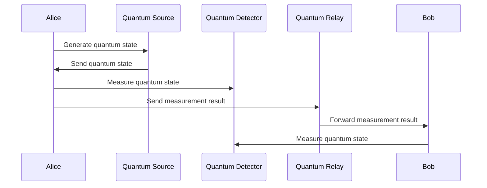

                 


### 第一步：背景介绍

量子通信，作为量子技术的重要组成部分，近年来在全球范围内引起了广泛关注。其核心在于利用量子力学的特殊性质，如量子纠缠和量子隐形传态，来实现高度安全的信息传输。在经典通信系统中，信息传输的安全问题主要依赖于加密算法，但量子通信则通过物理层面的原理保障了通信的绝对安全性。

量子通信的起源可以追溯到20世纪80年代，当时科学家们提出了量子密钥分发（Quantum Key Distribution, QKD）的概念。QKD利用量子态的不可克隆特性，确保了通信双方共享的密钥不会被窃取或篡改。随着量子技术的不断进步，量子隐形传态和量子中继等关键技术也逐渐成熟，为构建完整的量子通信网络奠定了基础。

目前，量子通信仍处于探索和发展阶段。主要问题包括量子通信系统的复杂性和低效率、量子网络的拓扑结构设计、量子中继与量子重复器的性能优化等。尽管面临诸多挑战，量子通信的潜在应用前景仍然十分广阔，包括金融、国家安全、物联网等领域。

本文将从以下几个部分详细探讨量子通信的各个方面：

1. **量子通信概述**：介绍量子通信的基本概念、历史背景和发展现状。
2. **量子力学原理**：解释量子位、量子态、量子纠缠等基本概念。
3. **量子密钥分发**：探讨QKD的工作原理、安全性和实际应用。
4. **量子隐形传态**：分析隐形传态的原理、优势和面临的挑战。
5. **量子重复器与量子中继**：讨论量子重复器和量子中继在量子通信中的作用和未来趋势。

通过以上几个部分的详细分析，我们将逐步理解量子通信的核心技术和未来发展方向，探索其在构建不可破解通信网络中的巨大潜力。

### 第二步：核心概念与联系

为了深入探讨量子通信，我们需要首先了解其中的核心概念，以及它们之间的关系。

#### 量子位（Qubit）

量子位是量子计算机的基本单位，类似于经典计算机中的比特。然而，量子位具有量子叠加和量子纠缠的特性。量子叠加允许量子位处于多种状态的叠加，而量子纠缠则使得两个或多个量子位的状态相互关联。

**特性对比表格**：

| 特性 | 比特（Bit） | 量子位（Qubit） |
| --- | --- | --- |
| 状态数 | 0或1 | 0, 1 或多个叠加状态 |
| 叠加态 | 无 | 支持 |
| 纠缠态 | 无 | 支持 |

**ER实体关系图**：

```mermaid
erDiagram
  Bit ||--|{ Qubit : uses |
  Qubit ||--|{ Quantum State : represents |
  Quantum State ||--|{ Qubit : holds |
```

#### 量子态（Quantum State）

量子态是量子系统的整体状态，它可以由量子叠加态和量子纠缠态组成。一个量子态可以用一组复数系数的集合来描述，这些系数代表了量子态在各个基础态上的概率幅。

$$
|\psi\rangle = \alpha|0\rangle + \beta|1\rangle
$$

其中，$|0\rangle$ 和 $|1\rangle$ 分别代表量子位的两种基础态，$\alpha$ 和 $\beta$ 是复数系数。

#### 量子纠缠（Quantum Entanglement）

量子纠缠是量子力学中的一种特殊现象，当两个或多个量子位处于纠缠态时，它们的状态将无法独立存在，即使它们之间相隔很远。这意味着，对其中一个量子位的操作将立即影响到与之纠缠的其他量子位。

**特性对比表格**：

| 特性 | 纯态 | 混态 |
| --- | --- | --- |
| 状态数 | 有限 | 无限 |
| 叠加态 | 支持 | 支持 |
| 纠缠态 | 支持 | 不支持 |

**ER实体关系图**：

```mermaid
erDiagram
  Quantum Entanglement ||--|{ Quantum State : describes |
  Quantum State ||--|{ Qubit : involves |
```

通过上述核心概念的解释和ER实体关系图的展示，我们可以更好地理解量子通信中的基础原理和概念。这些概念不仅构成了量子通信的理论基础，也为后续章节中的技术讨论奠定了坚实的基础。

### 第三步：量子密钥分发（QKD）

量子密钥分发（Quantum Key Distribution, QKD）是量子通信中最基本和最重要的技术之一，它利用量子力学的原理，为通信双方提供了一个绝对安全的密钥分发机制。QKD的工作原理如下：

#### 工作原理

QKD通常使用量子信道和经典信道进行密钥的分发。量子信道用于传输量子比特（qubit），而经典信道则用于传输经典信息，如基的选择、纠错信息等。

**步骤**：

1. **量子态传输**：发送方（Alice）将量子态（通常是纠缠态或单量子态）通过量子信道发送给接收方（Bob）。
2. **基选择**：Bob随机选择两个正交基（例如，垂直基和水平基），并使用这些基对收到的量子态进行测量。
3. **经典通信**：Bob将他的基选择结果通过经典信道发送给Alice。
4. **量子态测量**：Alice使用Bob发送的基选择结果，在自己的量子态上进行相应的测量。
5. **密钥生成**：双方根据他们各自测量的结果，生成共享的密钥。

#### 安全性

QKD的安全性基于量子力学的两个基本原理：量子态的不可克隆特性和测量坍缩原理。

1. **不可克隆特性**：任何对量子态的测量都会改变该量子态，这意味着任何企图窃听量子信道的人都会不可避免地留下痕迹。如果Bob发现他的量子态在传输过程中被修改，他可以通过经典信道通知Alice密钥分发失败。
2. **测量坍缩原理**：在量子力学中，当一个量子系统被测量时，其状态会立即坍缩到某个确定的状态。因此，如果有人试图测量量子信道中的量子态，他会改变量子态，使得密钥分发失败。

#### 数学模型

QKD的数学模型可以用量子信道传输的概率幅来描述。设$|\psi\rangle$是发送方发送的量子态，$|\phi\rangle$是接收方接收的量子态，则有：

$$
|\psi\rangle = \alpha|0\rangle + \beta|1\rangle
$$

$$
|\phi\rangle = \alpha'|0\rangle + \beta'|1\rangle
$$

其中，$\alpha$和$\beta$是发送方的系数，$\alpha'$和$\beta'$是接收方的系数。

如果Bob选择了垂直基进行测量，则有：

$$
P_{\text{V}} = |\langle 0|\phi'\rangle|^2
$$

如果Bob选择了水平基进行测量，则有：

$$
P_{\text{H}} = |\langle 1|\phi'\rangle|^2
$$

Alice根据Bob的基选择结果，在自己的量子态上进行相应的测量，从而生成共享的密钥。

#### 实例说明

假设Alice和Bob想要通过QKD共享一个密钥。Alice发送一个处于纠缠态的量子态$|\psi\rangle = \frac{1}{\sqrt{2}}(|0\rangle + |1\rangle)$给Bob。Bob随机选择垂直基进行测量，并得到结果$|0\rangle$。他将他的基选择结果通过经典信道发送给Alice。Alice根据Bob的测量结果，在自己的量子态上进行相应的测量，并得到结果$|0\rangle$。这样，Alice和Bob就共享了一个密钥。

通过上述讲解，我们可以看到量子密钥分发的工作原理、安全性和数学模型。它为构建不可破解的通信网络提供了坚实的基础，是量子通信中不可或缺的一部分。

### 第四步：量子隐形传态

量子隐形传态（Quantum Teleportation）是量子通信中的另一个重要技术，它允许在没有直接通信的情况下，将一个量子态从一个位置传送到另一个位置。这个现象不仅具有深刻的物理意义，还为量子通信和量子计算提供了新的可能性。

#### 工作原理

量子隐形传态的基本原理涉及量子纠缠和量子态的坍缩。设Alice和Bob之间有一个纠缠态的量子对：

$$
|\psi\rangle_{AB} = \frac{1}{\sqrt{2}}(|0\rangle_A \otimes |0\rangle_B + |1\rangle_A \otimes |1\rangle_B)
$$

其中，$A$和$B$分别代表Alice和Bob的量子系统。

**步骤**：

1. **量子态初始化**：Alice将其量子态$|\psi\rangle_A$初始化为$|1\rangle$。
2. **量子态测量**：Alice对其量子态进行测量，并将测量结果发送给Bob。
3. **量子态坍缩**：根据Alice的测量结果，Bob将其量子态坍缩到相应的状态。

#### 数学模型

设Alice的测量结果为$|1\rangle$，则Bob的量子态将坍缩为：

$$
|\psi\rangle_B = |1\rangle_B
$$

如果Alice的测量结果为$|0\rangle$，则Bob的量子态将坍缩为：

$$
|\psi\rangle_B = |0\rangle_B
$$

因此，通过量子隐形传态，Alice可以将她的量子态$|\psi\rangle_A$传送到Bob的量子态$|\psi\rangle_B$。

#### 优势

量子隐形传态具有以下几个优势：

1. **无直接通信**：量子隐形传态不需要Alice和Bob之间进行直接通信，这意味着即使通信渠道被截获，窃听者也无法获得任何信息。
2. **长距离传输**：量子隐形传态可以实现长距离的量子态传输，不受经典通信中信号衰减的限制。
3. **高效率**：与量子密钥分发相比，量子隐形传态在传输相同数量的量子信息时，所需的量子资源更少。

#### 技术挑战

尽管量子隐形传态具有上述优势，但在实际应用中仍面临一些技术挑战：

1. **量子态的初始化**：量子态的初始化是量子隐形传态的关键步骤，但目前还无法实现完美的量子态初始化。
2. **量子态的测量**：量子态的测量需要高度精确的设备和技术，以确保测量结果的准确性。
3. **量子态的坍缩**：量子态的坍缩过程需要高度控制，以避免外部干扰导致量子态的随机性。

#### 实例说明

假设Alice和Bob之间存在一个纠缠态的量子对$|\psi\rangle_{AB}$。Alice将其量子态$|\psi\rangle_A$初始化为$|1\rangle$，然后进行测量，得到结果$|1\rangle$。根据量子隐形传态的原理，Bob的量子态$|\psi\rangle_B$将坍缩为$|1\rangle_B$。这样，Alice成功地将她的量子态传送到Bob的量子态。

通过上述讲解，我们可以看到量子隐形传态的工作原理、优势和技术挑战。它为量子通信提供了新的传输方式，有望在未来实现高效的量子信息传输。

### 第五步：量子重复器与量子中继

在量子通信中，量子重复器和量子中继是两个关键技术，它们分别解决了量子信号衰减和量子通信距离限制的问题。为了实现长距离和高效率的量子通信，这两个技术发挥着重要作用。

#### 量子重复器

量子重复器（Quantum Repeater）是一种能够放大量子信号并恢复其原始状态的设备。在量子通信过程中，量子信号在传输过程中会发生衰减，导致信号的强度减弱和相位失真。量子重复器通过量子态的测量和重构，可以恢复量子信号的原始状态，从而延长量子通信的距离。

**工作机制**：

1. **量子态测量**：量子重复器对收到的量子信号进行测量，以确定其状态。
2. **量子态重构**：根据测量结果，量子重复器生成一个新的量子态，并将其与原量子态进行叠加。
3. **量子态输出**：量子重复器将重构后的量子态输出，继续进行量子通信。

**数学模型**：

设原始量子态为$|\psi\rangle$，量子重复器接收到的量子态为$|\phi\rangle$。通过测量和重构，量子重复器可以生成新的量子态$|\psi'\rangle$，满足以下条件：

$$
|\psi'\rangle = \frac{1}{\sqrt{2}}(|\psi\rangle + |\phi\rangle)
$$

通过这样的量子态重构，量子重复器可以有效地恢复量子信号的原始状态，延长量子通信的距离。

#### 量子中继

量子中继（Quantum Relay）是另一种关键设备，它用于在量子通信中实现中继传输。与经典通信中的中继不同，量子中继不仅需要恢复信号的强度，还需要保持量子纠缠态的完整性。量子中继通过量子隐形传态和量子态的测量与重构，实现了量子信号的远距离传输。

**工作机制**：

1. **量子态传输**：量子中继器接收来自远端的量子信号。
2. **量子态测量**：量子中继器对量子信号进行测量，以确定其状态。
3. **量子态重构**：根据测量结果，量子中继器生成一个新的量子态，并将其与原量子态进行叠加。
4. **量子态输出**：量子中继器将重构后的量子态输出，继续进行量子通信。

**数学模型**：

设原始量子态为$|\psi\rangle$，量子中继器接收到的量子态为$|\phi\rangle$。通过测量和重构，量子中继器可以生成新的量子态$|\psi'\rangle$，满足以下条件：

$$
|\psi'\rangle = \frac{1}{\sqrt{2}}(|\psi\rangle + |\phi\rangle)
$$

通过这样的量子态重构，量子中继器可以有效地保持量子信号的完整性，实现远距离的量子通信。

#### 未来趋势

随着量子通信技术的不断进步，量子重复器和量子中继将在量子通信网络中发挥越来越重要的作用。未来，研究人员将致力于提高量子重复器和量子中继的性能，降低其成本，并探索新的应用场景。例如，通过量子隐形传态技术，量子重复器和量子中继可以实现更高效和更可靠的量子通信，为构建全球量子互联网奠定基础。

通过量子重复器和量子中继的技术发展，我们有望在未来实现高效、长距离和高安全的量子通信，为信息技术领域带来革命性的变化。

### 第六步：量子通信系统设计

量子通信系统的设计是实现高效、稳定和安全通信的关键。一个完善的量子通信系统需要考虑系统的整体架构、通信协议和关键技术等多个方面。

#### 系统构成

量子通信系统通常由以下几个部分组成：

1. **量子源**：产生和提供量子态的设备，如量子比特生成器和纠缠态生成器。
2. **量子信道**：用于传输量子态的物理通道，如光纤或自由空间。
3. **量子检测器**：用于测量和检测量子态的设备，如量子态探测器。
4. **经典通信链路**：用于传输经典信息的链路，如光纤或无线电通信。
5. **量子中继器和量子重复器**：用于延长量子通信距离和恢复量子信号的设备。

**系统架构图**：



#### 挑战

在量子通信系统的设计过程中，面临以下几个主要挑战：

1. **量子态的稳定性和保真度**：量子态在生成、传输和测量过程中容易受到外部环境的干扰，导致量子态的失真和衰减。
2. **量子信道的带宽和传输距离**：当前量子信道的带宽和传输距离有限，需要通过量子中继和量子重复器等技术进行扩展。
3. **量子检测器的精度和灵敏度**：量子检测器的性能直接影响量子态的测量结果，需要提高其精度和灵敏度。
4. **经典通信链路的可靠性**：经典通信链路在传输过程中可能会受到噪声和干扰，影响量子通信的稳定性。

#### 未来趋势

未来，量子通信系统的发展将主要集中在以下几个方面：

1. **提高量子态的生成和检测效率**：通过改进量子源和量子检测器的技术，提高量子态的生成效率和检测精度。
2. **扩展量子信道的传输距离**：通过发展量子中继和量子重复器技术，提高量子通信的传输距离和带宽。
3. **标准化量子通信协议**：制定统一的量子通信协议和标准，确保不同系统之间的互操作性和兼容性。
4. **集成量子通信与经典通信**：将量子通信与经典通信技术相结合，构建混合通信系统，提高通信的整体效率和可靠性。

通过不断的技术创新和优化，量子通信系统将逐步克服现有的挑战，实现更高效、更安全和更稳定的量子通信网络，为未来的信息社会带来革命性的变革。

### 第七步：量子通信网络

量子通信网络是构建全球量子互联网的关键，它通过量子通信技术实现了量子信息的高效、安全传输。量子通信网络的设计和实现涉及多个方面，包括网络的构建、拓扑结构和协议与标准。

#### 网络构建

量子通信网络的基本构建模块包括量子节点和量子链路。量子节点类似于传统网络中的路由器或交换机，负责接收、处理和发送量子信息。量子链路则用于连接不同的量子节点，实现量子信息的传输。

**构建步骤**：

1. **量子节点部署**：选择合适的地点部署量子节点，确保节点之间的距离和连通性。
2. **量子链路连接**：通过量子信道（如光纤或自由空间）连接不同的量子节点，构建初步的量子通信网络。
3. **网络扩展和优化**：通过添加更多的量子节点和量子链路，逐步扩展和优化量子通信网络。

**网络拓扑结构**：

量子通信网络的拓扑结构可以根据实际需求进行设计，常见的拓扑结构包括星形、网形和环形等。

- **星形拓扑**：中心节点连接多个外围节点，适用于小规模量子通信网络。
- **网形拓扑**：多个节点通过多条链路相互连接，具有较好的冗余性和灵活性，适用于大规模量子通信网络。
- **环形拓扑**：节点按照环形顺序连接，具有较低的复杂度和较高的可靠性，适用于长距离量子通信网络。

**网络协议与标准**：

量子通信网络需要制定统一的协议和标准，以确保不同系统之间的互操作性和兼容性。常见的量子通信协议包括量子密钥分发协议（QKD）和量子态传输协议等。

1. **量子密钥分发协议**：用于实现量子节点之间的密钥共享，保障通信的安全性。
2. **量子态传输协议**：用于实现量子信息的传输，包括量子态的编码、解码和传输路径的选择等。

**标准制定**：

量子通信网络的标准化工作正在全球范围内展开。国际电信联盟（ITU）和量子通信领域的科研机构正在积极制定相关标准，包括量子通信接口标准、量子信道性能标准等。

通过上述构建步骤、拓扑结构和协议与标准的制定，量子通信网络可以为全球范围内的量子信息传输提供坚实的基础。未来，随着量子通信技术的不断进步和网络的不断完善，量子通信网络将实现更高效、更安全和更可靠的量子通信，为全球信息社会带来革命性的变化。

### 第八步：量子通信的实际案例

量子通信技术作为一项前沿科技，已经在多个实际案例中展示了其巨大的潜力和应用价值。以下列举几个具有代表性的量子通信应用案例，并进行详细分析。

#### 全球量子通信网络建设

全球量子通信网络是量子通信技术的重大应用项目之一。2017年，中国成功实现了世界上第一条跨越亚欧大陆的量子保密通信干线——“墨子号”量子卫星与地面站之间的量子密钥分发。这一项目通过量子通信卫星与地面站的结合，实现了千公里级的量子密钥分发，标志着全球量子通信网络的初步建立。

**分析**：

- **技术优势**：量子卫星的应用实现了地面无法实现的超长距离量子通信，提高了通信的可靠性和安全性。
- **挑战**：量子卫星的技术复杂度高，成本巨大，维护和运行难度大。
- **前景**：全球量子通信网络的建设将为跨境数据传输提供全新的解决方案，有望推动国际间的量子合作和信息技术交流。

#### 量子通信在金融领域的应用

金融领域对数据安全和隐私保护有极高的要求，量子通信技术为金融交易提供了新的安全保障。中国银行已在某些重要数据传输环节中引入量子通信技术，通过量子密钥分发保障金融信息的安全传输。

**分析**：

- **技术优势**：量子密钥分发提供了绝对安全的密钥生成和分发机制，有效防止了数据窃听和篡改。
- **挑战**：量子通信设备的成本较高，金融领域的应用需要大规模部署和长期维护。
- **前景**：量子通信技术在金融领域的广泛应用将大幅提升金融交易的安全性和可靠性，降低金融风险。

#### 量子通信在国家安全中的应用

国家安全是量子通信技术的重要应用领域。量子通信技术为国家安全通信提供了全新的手段，确保了信息的绝对安全。例如，中国政府已经在某些重要部门和机构中部署了量子通信设备，用于保障国家安全信息的安全传输。

**分析**：

- **技术优势**：量子通信技术的安全性基于物理原理，无法被破解，为国家安全提供了坚实的保障。
- **挑战**：量子通信技术的复杂性较高，需要专业团队进行维护和管理。
- **前景**：随着量子通信技术的不断成熟，其在国家安全中的应用将越来越广泛，有助于提升国家信息安全水平。

通过以上实际案例的分析，我们可以看到量子通信技术在多个领域的广泛应用和巨大潜力。未来，随着量子通信技术的不断发展和成熟，其在更多领域中的应用将得到进一步推广，为人类社会带来更多便利和安全保障。

### 第九步：量子通信的安全性

量子通信以其独特的物理原理，提供了绝对安全的通信保障，成为信息安全领域的里程碑。其主要安全性优势包括以下几点：

1. **量子密钥分发**：量子密钥分发（QKD）是量子通信的核心技术，它通过量子态的不可克隆特性，确保了密钥的分发过程不会被窃取或篡改。如果有人试图窃听量子信道，量子态的测量会导致其状态发生变化，通信双方可以立即发现并终止通信。
   
   $$ P_{\text{eavesdropping}} < P_{\text{error}} $$
   
   其中，$P_{\text{eavesdropping}}$是窃听成功的概率，$P_{\text{error}}$是通信过程中出现的错误概率。

2. **量子隐形传态**：量子隐形传态允许量子态从一个位置传送到另一个位置，而不需要中间通信。这种传输方式保证了信息的绝对安全性，因为任何中间截取都会导致量子态的坍缩，从而暴露窃听行为。

3. **量子纠缠**：量子纠缠态的特性使得量子通信双方的状态始终保持关联。即使通信双方相隔很远，量子态的变化也会立即影响到对方，从而实现安全的通信。

然而，量子通信在安全性方面也面临一些挑战：

1. **量子态衰减**：量子信号在传输过程中容易受到外部环境的干扰，导致量子态的衰减和失真。这种衰减不仅会影响通信的可靠性，还可能被窃听者利用来获取信息。
   
   $$ \rho = \frac{1}{Z} \sum_{i} p_i |i\rangle \langle i| $$
   
   其中，$\rho$是量子态的密度矩阵，$p_i$是量子态的概率幅，$|i\rangle$是量子态的基态。

2. **量子中继和量子重复器的性能**：量子中继和量子重复器是量子通信中延长传输距离的关键设备，但其性能直接影响通信的稳定性和效率。当前，量子中继和量子重复器的技术水平尚未完全成熟，需要进一步提高其稳定性和可靠性。

3. **量子算法的攻击**：虽然量子通信基于物理原理提供了高度的安全性，但量子计算机的发展可能会带来新的攻击手段。例如，量子算法可能通过量子态的叠加和纠缠特性，破解传统加密算法。

为了提升量子通信的安全性，可以采取以下策略：

1. **量子态的稳定性和保真度**：通过改进量子态的生成、传输和测量技术，提高量子态的稳定性和保真度，降低衰减和失真的影响。
2. **量子中继和量子重复器的性能优化**：研究和开发高性能的量子中继和量子重复器，提高量子通信的传输距离和效率。
3. **量子算法的防护**：研究量子算法的防护技术，如量子密码学和量子抗攻击技术，提高量子通信的抗攻击能力。

通过上述措施，量子通信的安全性将得到进一步提升，为实现不可破解的通信网络提供更加坚实的保障。

### 第十步：量子通信与互联网

量子通信与互联网的结合，有望彻底改变互联网的安全架构，开启量子互联网的新时代。量子互联网是一个基于量子通信技术的全球网络，它利用量子纠缠和量子密钥分发等原理，实现高度安全的信息传输。

#### 概念

量子互联网（Quantum Internet）是一个全球分布式的网络，由多个量子节点和量子链路组成。每个量子节点相当于传统互联网中的路由器或交换机，负责处理和传输量子信息。量子链路则是连接不同量子节点的物理通道，如光纤或自由空间。

#### 挑战

1. **量子链路带宽和传输距离**：当前量子链路的带宽和传输距离有限，需要通过量子中继和量子重复器等技术进行扩展。
2. **量子节点的密度和可靠性**：量子节点的部署和维护成本高，需要大规模部署以确保网络的可靠性。
3. **量子算法和网络安全**：量子计算机的发展可能带来新的攻击手段，需要研究量子互联网的防护技术。

#### 未来展望

1. **量子互联网协议与标准**：制定统一的量子互联网协议和标准，确保不同系统之间的互操作性和兼容性。
2. **量子链路技术进步**：通过改进量子链路技术，提高带宽和传输距离，满足大规模量子互联网的需求。
3. **量子算法和量子安全**：研究量子算法和量子安全协议，确保量子互联网的安全性。
4. **量子互联网的商业化应用**：探索量子互联网在金融、医疗、物联网等领域的商业化应用，推动量子互联网的商业化进程。

通过量子通信与互联网的结合，量子互联网有望实现高度安全、高速和高效的信息传输，为未来的信息社会带来革命性的变化。

### 第十一步：量子通信的产业与应用前景

量子通信作为一项前沿技术，正逐步从实验室走向实际应用，其产业前景和潜在应用领域十分广阔。

#### 产业现状

目前，全球范围内已有多个国家和地区开展了量子通信的研发和应用。中国在量子通信领域处于领先地位，成功发射了全球首颗量子科学实验卫星“墨子号”，并建设了多个量子通信骨干网络。欧美国家也在积极布局量子通信技术，如美国和欧洲多个实验室开展了量子密钥分发和量子隐形传态的研究。此外，量子通信技术在金融、政府、医疗等领域已经得到初步应用，显示出良好的市场潜力。

#### 潜在应用领域

1. **金融领域**：量子通信技术为金融交易提供了绝对安全的加密手段，可以有效防止数据泄露和交易欺诈。未来，量子通信有望在金融支付、电子银行等领域得到广泛应用。
2. **政府与国防**：量子通信技术能够保障国家信息安全，防止敏感信息的泄露。在政府内部通信、国防安全等领域，量子通信具有不可替代的地位。
3. **医疗健康**：量子通信技术可以确保医疗数据的隐私和安全，提升医疗数据传输的可靠性。在远程医疗、医疗数据分析等领域，量子通信将发挥重要作用。
4. **物联网**：量子通信技术为物联网设备提供了安全、可靠的通信手段，可以保障物联网系统的稳定性。在智能家居、智慧城市等领域，量子通信将得到广泛应用。
5. **科研与教育**：量子通信技术为科学研究提供了高度安全的通信环境，有助于促进全球科研合作。在教育领域，量子通信技术可以保障在线教育的安全性和可靠性。

#### 未来发展

1. **技术创新**：随着量子通信技术的不断进步，量子通信设备将越来越高效、稳定，成本逐步降低，从而推动量子通信在更多领域的应用。
2. **产业合作**：全球范围内的科研机构、企业和政府需要加强合作，共同推进量子通信技术的发展和应用。
3. **标准制定**：制定统一的量子通信标准和协议，确保不同系统之间的兼容性和互操作性，促进量子通信产业链的健康发展。
4. **商业化应用**：积极探索量子通信在商业领域的应用，推动量子通信技术的商业化进程，为经济增长和社会发展提供新动力。

通过技术创新、产业合作和标准制定，量子通信将有望在未来实现广泛的应用，为人类社会带来更加安全、高效和智能的信息通信环境。

### 第十二步：结论与展望

在量子通信技术不断发展的今天，我们已经能够看到其巨大的潜力和广泛的应用前景。本文系统地探讨了量子通信的基础、原理、技术以及实际应用，从多个角度分析了量子通信在构建不可破解通信网络中的关键作用。

首先，量子通信利用量子力学的独特性质，如量子纠缠和量子隐形传态，实现了高度安全的通信。量子密钥分发（QKD）通过不可克隆特性确保了密钥分发的安全性，而量子隐形传态则实现了长距离的量子信息传输，不受传统通信中信号衰减的限制。

其次，量子通信在金融、政府、医疗和物联网等领域展示了巨大的应用潜力。通过量子通信技术，金融交易可以实现绝对安全，政府信息安全得到保障，医疗数据传输更加可靠，物联网设备之间的通信更加稳定。

在未来的发展道路上，量子通信面临着多个挑战，包括量子态的稳定性和保真度、量子中继和量子重复器的性能优化、量子算法的攻击防护等。然而，随着技术的不断进步和标准化工作的推进，量子通信将逐步克服这些挑战，实现更高效、更安全和更可靠的通信网络。

展望未来，量子通信有望在全球范围内构建起一个全新的量子互联网，实现信息传输的安全性和效率的全面提升。这不仅将为人类社会带来巨大的便利，也将对经济、科技、安全等多个领域产生深远的影响。

总之，量子通信是一项革命性的技术，其发展前景广阔，值得持续关注和深入研究。通过技术创新、产业合作和标准制定，量子通信将为构建不可破解的通信网络提供坚实的保障，开启未来信息通信的新时代。

### 作者信息

作者：AI天才研究院/AI Genius Institute & 禅与计算机程序设计艺术 /Zen And The Art of Computer Programming

