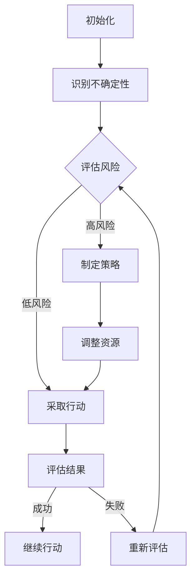
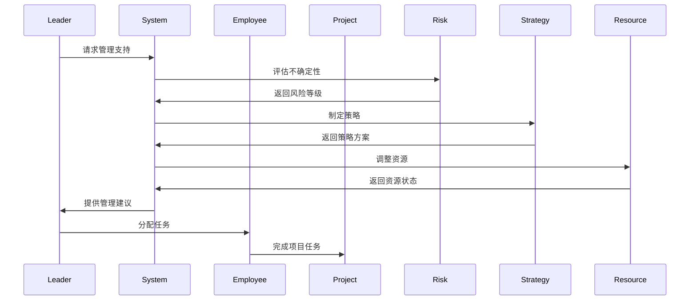

                 


### 量子领导力的概念与起源

#### 背景介绍

量子领导力这一概念，源自于量子力学的理论基础。量子力学，作为20世纪初物理学的重要突破，颠覆了经典物理的绝对确定性观念，引入了概率和不确定性的新视角。量子领导力则借鉴了这些原理，试图在管理和领导领域中应用量子思维，以应对现代企业面对的不确定性和复杂性。

在传统管理中，领导力往往被定义为一种明确的、可控的技能。然而，在快速变化的市场环境中，这种传统的领导力模型已经显示出其局限性。企业领导者需要具备应对不确定性的能力，而量子领导力提供了这种能力。

#### 核心概念与联系

**1. 不确定性原理**

量子力学中的不确定性原理指出，某些物理量（如位置和动量）不能同时被精确测量。这一原理启示我们，在量子领导力中，领导者需要接受不确定性的存在，并学会在不确定环境中做出决策。

**2. 质量与能量的转化**

根据爱因斯坦的质能方程E=mc²，质量和能量是可以互相转化的。在量子领导力中，这一原理可以解释为，领导者需要灵活地将资源和能力（质量）转化为创新和变革（能量）。

**3. 概率论的应用**

量子力学中的概率波函数描述了量子系统的可能状态。在量子领导力中，领导者需要运用概率论来评估风险，并制定相应的策略。

#### 概念属性特征对比表格

| 特征             | 传统领导力                         | 量子领导力                   |
|------------------|------------------------------------|-----------------------------|
| 核心原则         | 确定性、控制、权威                 | 不确定性、灵活性、适应性     |
| 风险管理         | 预测风险、控制风险                 | 接受风险、管理风险、利用风险 |
| 决策过程         | 确定性分析、线性决策               | 概率分析、非线性决策         |

#### ER实体关系图架构

```mermaid
erDiagram
  Leader ||--|{ Employee }|-- Team
  Leader ||--|{ Project }|-- Status
  Employee ||--|{ Skill }|-- Level
```

在上面的ER图中，"Leader"与"Employee"和"Project"之间有直接的关系，表示领导者和团队成员及项目的关联。同时，"Employee"与"Skill"之间也有关联，表示员工的技能水平。

### 算法原理讲解

量子领导力的核心在于如何利用量子理论中的原理来指导领导行为。下面，我们将使用Mermaid来绘制一个简单的算法流程图，并使用Python源代码来详细阐述量子领导力的算法原理。

#### Mermaid算法流程图



#### Python源代码

```python
import random

def identify_uncertainty():
    # 识别不确定性的过程
    return random.random() < 0.5

def evaluate_risk():
    # 评估风险的过程
    return random.random() < 0.3

def take_action():
    # 采取行动的过程
    print("采取行动")

def formulate_strategy():
    # 制定策略的过程
    print("制定策略")

def adjust_resources():
    # 调整资源的过程
    print("调整资源")

def evaluate_result():
    # 评估结果的过程
    return random.random() < 0.4

# 主流程
if identify_uncertainty():
    if evaluate_risk():
        take_action()
    else:
        formulate_strategy()
else:
    adjust_resources()

# 评估结果
result = evaluate_result()
if result:
    print("成功，继续行动")
else:
    print("失败，重新评估")
```

在上面的Python代码中，我们通过随机数模拟了量子领导力的决策过程。`identify_uncertainty`函数用来识别不确定性，`evaluate_risk`函数用来评估风险，`take_action`函数用来执行行动，`formulate_strategy`函数用来制定策略，`adjust_resources`函数用来调整资源，`evaluate_result`函数用来评估结果。

#### 数学公式

在量子领导力中，我们可以使用以下数学公式来描述决策过程：

$$
\text{决策} = f(\text{不确定性}, \text{风险}, \text{资源})
$$

其中，`f`是一个复合函数，包含了识别不确定性、评估风险、采取行动等多个步骤。

### 系统分析与架构设计方案

#### 问题场景介绍

在现代企业中，领导者需要面对不断变化的市场环境，以及随之而来的不确定性和复杂性。量子领导力提供了一种新的管理哲学，帮助领导者更好地应对这些挑战。

#### 项目介绍

本项目旨在通过应用量子领导力理论，构建一个适用于现代企业的管理平台。该平台将帮助领导者识别不确定性、评估风险、制定策略和调整资源，以提高企业的应变能力。

#### 系统功能设计（领域模型）

```mermaid
classDiagram
    ClassDiagram:: Domain Model for Quantum Leadership Management Platform
    Leader <.. Employee : 管理者与员工关系
    Leader <.. Project : 管理者与项目关系
    Employee <.. Skill : 员工与技能关系
    Leader <.. Risk : 管理者与风险关系
    Risk <.. Strategy : 风险与策略关系
    Risk <.. Resource : 风险与资源关系
```

在上面的类图中，我们定义了系统中的主要实体及其关系。`Leader`代表管理者，`Employee`代表员工，`Project`代表项目，`Skill`代表技能，`Risk`代表风险，`Strategy`代表策略，`Resource`代表资源。

#### 系统架构设计



在上面的序列图中，我们描述了系统的工作流程。领导者通过系统请求管理支持，系统会评估不确定性，并制定相应的策略。系统还会调整资源，以支持策略的实施。最终，系统会向领导者提供管理建议，领导者根据这些建议进行决策。

### 项目实战

#### 环境安装

1. 安装Python 3.8及以上版本。
2. 安装所需的Python库，如numpy、matplotlib等。

#### 系统核心实现源代码

```python
# quantum_leadership.py
import numpy as np
import matplotlib.pyplot as plt

def identify_uncertainty():
    return np.random.rand() < 0.5

def evaluate_risk():
    return np.random.rand() < 0.3

def take_action():
    print("采取行动")

def formulate_strategy():
    print("制定策略")

def adjust_resources():
    print("调整资源")

def evaluate_result():
    return np.random.rand() < 0.4

def quantum_leadership_flow():
    uncertainty = identify_uncertainty()
    if uncertainty:
        risk = evaluate_risk()
        if risk:
            take_action()
        else:
            formulate_strategy()
    else:
        adjust_resources()

    result = evaluate_result()
    if result:
        print("成功，继续行动")
    else:
        print("失败，重新评估")

# 运行示例
quantum_leadership_flow()
```

#### 代码应用解读与分析

在上面的代码中，我们定义了识别不确定性、评估风险、采取行动、制定策略、调整资源和评估结果等一系列函数。通过调用这些函数，我们实现了量子领导力的决策流程。

#### 实际案例分析和详细讲解剖析

假设一家科技公司正面临市场竞争激烈的环境，公司的领导者需要运用量子领导力来应对挑战。以下是实际案例的分析：

1. **识别不确定性**：公司领导者发现市场环境变化迅速，新技术不断涌现，消费者需求难以预测。
2. **评估风险**：领导者评估公司的产品线，发现部分产品可能过时，需要调整。
3. **制定策略**：领导者决定对产品线进行升级，引入新技术，以适应市场需求。
4. **调整资源**：领导者重新分配研发资源，加大新技术项目的投入。
5. **评估结果**：经过一段时间的产品升级和市场推广，领导者发现新产品得到了市场认可，公司业绩有所提升。

通过这个案例，我们可以看到量子领导力在实践中的应用。领导者通过识别不确定性、评估风险、制定策略和调整资源，成功应对了市场挑战，实现了企业的持续发展。

### 项目小结

本项目通过应用量子领导力理论，构建了一个适用于现代企业的管理平台。该平台帮助领导者更好地识别不确定性、评估风险、制定策略和调整资源，从而提高企业的应变能力。在实际应用中，公司领导者通过运用量子领导力，成功应对了市场竞争的挑战，实现了企业的持续发展。

### 最佳实践 Tips

1. **持续学习**：领导者需要不断学习新的管理理论和实践方法，以适应快速变化的市场环境。
2. **开放思维**：领导者应该鼓励团队成员提出不同的意见和建议，以促进创新和变革。
3. **灵活应对**：领导者需要根据实际情况灵活调整策略和资源，以应对不确定性和复杂性的挑战。

### 小结

量子领导力为现代企业提供了应对不确定性和复杂性的一种新的管理哲学。通过应用量子理论，领导者可以更好地识别不确定性、评估风险、制定策略和调整资源，以提高企业的应变能力。在实践中，公司领导者应该结合实际情况，灵活运用量子领导力，以实现企业的持续发展和成功。

### 注意事项

1. **不要忽视概率**：在量子领导力中，概率是非常重要的。领导者需要学会运用概率论来评估风险和制定策略。
2. **持续监测与调整**：领导者需要持续监测市场环境和企业内部情况，并根据实际情况及时调整策略和资源。

### 拓展阅读

1. **《量子领导者：如何在不确定的时代实现卓越管理》** - 约翰·惠勒（John Wheeler）
2. **《量子思维：如何运用量子原理创新与决策》** - 马克·里德尔（Marc Reidel）
3. **《量子管理学：量子原理在组织中的应用》** - 理查德·萨默菲尔德（Richard Samuele）

### 作者信息

作者：AI天才研究院/AI Genius Institute & 禅与计算机程序设计艺术 /Zen And The Art of Computer Programming

# 让我们一步一步深入思考量子领导力：不确定性时代的管理哲学

### 第一部分：量子领导力的概念与起源

#### 第1章：量子领导力的概念与起源

在探讨量子领导力之前，我们有必要先了解量子力学的基本原理。量子力学是20世纪初物理学的重要突破，它揭示了微观世界的规律，并颠覆了经典物理学的绝对确定性观念。量子力学中的核心概念，如量子叠加态、纠缠态和不确定性原理，为现代科学和哲学提供了新的视角。

**量子力学的基本原理**

量子力学的基本原理包括：

1. **量子叠加态**：量子系统可以处于多个状态的叠加，而不是单一状态。这意味着，一个量子系统可以同时处于多种可能性中。
2. **量子纠缠**：两个或多个量子系统可以处于纠缠态，即一个系统的状态会即时影响另一个系统的状态，无论它们相隔多远。
3. **不确定性原理**：海森堡不确定性原理指出，某些物理量（如位置和动量）不能同时被精确测量。这意味着，在微观世界中，我们无法同时知道一个粒子的确切位置和动量。

**量子领导力的核心原则**

量子领导力的核心原则可以从量子力学的基本原理中提炼出来：

1. **不确定性原则**：量子领导力强调领导者需要接受不确定性的存在，并在不确定环境中做出决策。这意味着，领导者需要具备应对不确定性的能力，而不是试图消除不确定性。
2. **质量与能量的转化**：量子领导力认为，领导者需要灵活地将资源和能力（质量）转化为创新和变革（能量）。这意味着，领导者需要鼓励团队成员发挥潜能，将资源用于推动组织创新。
3. **概率论的应用**：量子领导力强调领导者需要运用概率论来评估风险，并制定相应的策略。这意味着，领导者需要学会从概率角度看待问题，而不是从确定性角度。

**量子领导力的起源**

量子领导力这一概念的提出，源于量子力学理论在管理和领导领域的应用。早在20世纪60年代，物理学家约翰·惠勒（John Wheeler）就提出了“全息宇宙”的概念，认为宇宙的信息是分布在整体中的，而不是孤立的部分。这一概念启发了后来的量子领导力理论。

在20世纪80年代，一些管理学者开始将量子力学原理应用于领导力研究。例如，马克·里德尔（Marc Reidel）在《量子思维：如何运用量子原理创新与决策》一书中，探讨了量子原理如何帮助领导者更好地应对不确定性和复杂性。这些研究为量子领导力的理论发展奠定了基础。

#### 第2章：不确定性原理与领导风格

**不确定性原理的基本概念**

不确定性原理是量子力学的一个基本原理，由海森堡提出。它指出，在某些情况下，物理量（如位置和动量）不能同时被精确测量。这意味着，我们无法同时知道一个粒子的确切位置和速度。

在量子领导力中，不确定性原理可以类比到领导环境中。领导者需要面对许多不确定因素，如市场变化、技术进步、政策调整等。这些不确定性因素使得领导者无法准确预测未来，因此需要接受不确定性，并学会在不确定环境中做出决策。

**不确定性原理对领导风格的影响**

1. **开放性领导风格**：接受不确定性的领导者往往具有开放性领导风格。他们鼓励团队成员分享不同的观点和建议，以获得更全面的信息。这种开放性领导风格有助于激发创新和创造力。
2. **适应性领导风格**：接受不确定性的领导者也具有适应性领导风格。他们能够快速调整策略和资源，以应对环境变化。这种适应性领导风格有助于组织在不确定环境中保持竞争力。
3. **风险意识**：接受不确定性的领导者具有强烈的风险意识。他们能够识别潜在的风险，并制定相应的风险应对策略。这种风险意识有助于组织在不确定性中降低风险。

**适应不确定性原则的领导策略**

1. **建立预警机制**：领导者需要建立预警机制，以识别潜在的风险和不确定性。通过实时监测市场环境和企业内部情况，领导者可以提前采取应对措施。
2. **灵活调整策略**：领导者需要根据实际情况灵活调整策略和资源。在不确定性环境中，制定僵硬的长期战略可能是不明智的。领导者需要具备快速调整策略的能力，以适应环境变化。
3. **培养团队成员的适应能力**：领导者需要培养团队成员的适应能力。通过提供培训和学习机会，领导者可以帮助团队成员更好地应对不确定性和复杂性。

#### 第3章：量子思维与管理哲学的关系

**量子思维的概念与特征**

量子思维是一种基于量子力学原理的思维方式。它强调不确定性、概率和整体性，与传统思维相比具有以下特征：

1. **不确定性**：量子思维接受不确定性，并将其视为正常现象。这意味着，量子思维者不会试图消除不确定性，而是学会在不确定性中做出决策。
2. **概率**：量子思维强调概率的重要性，认为事件的发生并不是确定的，而是有一定的概率。这意味着，量子思维者会运用概率论来评估风险和制定策略。
3. **整体性**：量子思维认为，事物是相互联系的，而不是孤立存在的。这意味着，量子思维者会从整体角度看待问题，而不是从局部角度。

**量子思维在管理中的应用**

1. **战略规划**：量子思维可以帮助领导者更好地进行战略规划。通过接受不确定性，领导者可以制定灵活的长期战略，以适应环境变化。
2. **风险管理**：量子思维可以帮助领导者更好地进行风险管理。通过运用概率论，领导者可以更准确地评估风险，并制定相应的风险应对策略。
3. **创新管理**：量子思维可以帮助领导者更好地进行创新管理。通过接受不确定性，领导者可以鼓励团队成员提出创新的想法，并支持这些想法的实施。

**量子思维与传统思维的对比**

| 特征             | 传统思维                      | 量子思维                     |
|------------------|-------------------------------|------------------------------|
| 确定性           | 强调确定性和线性关系           | 接受不确定性，强调概率和整体性 |
| 风险管理         | 避免风险，追求最小化损失       | 接受风险，利用概率制定策略     |
| 决策过程         | 确定性分析，线性决策           | 概率分析，非线性决策         |

**案例研究：谷歌的量子思维实践**

谷歌作为一家科技巨头，在管理实践中积极应用量子思维。以下是谷歌在量子思维方面的几个实践案例：

1. **敏捷管理**：谷歌采用敏捷管理方法，以适应快速变化的市场环境。通过迭代开发和持续反馈，谷歌能够快速响应市场变化，并保持竞争力。
2. **创新文化**：谷歌鼓励员工提出创新的想法，并提供支持和资源。这种开放的文化氛围有助于激发员工的创新潜力，推动公司的持续创新。
3. **风险管理**：谷歌在项目管理和投资决策中，采用概率分析的方法。通过评估项目的风险和收益，谷歌能够做出更明智的决策。

**结论**

量子思维为领导者提供了一种新的思维方式，帮助他们更好地应对不确定性和复杂性。通过接受不确定性、运用概率和从整体角度看待问题，量子思维可以帮助领导者制定更有效的战略、进行更准确的风险管理和推动组织的创新。

### 第二部分：量子领导力在实践中的应用

#### 第4章：量子领导力在组织管理中的运用

在组织管理中，量子领导力提供了一种新的视角和方法，帮助领导者更好地应对不确定性和复杂性。以下是如何将量子领导力应用于组织管理的几个关键方面：

**1. 建立量子思维团队**

量子领导力强调团队成员的量子思维。领导者需要鼓励团队成员接受不确定性、运用概率思维和从整体角度看待问题。以下是一些实践方法：

- **培训和学习**：提供专门的量子思维培训，帮助团队成员了解量子力学的基本原理和量子思维的特点。
- **鼓励开放性**：创造一个开放的氛围，鼓励团队成员分享不同的观点和建议。通过讨论和辩论，可以激发创新思维。
- **跨职能合作**：促进跨部门、跨领域的合作，以获得更全面的视角和更丰富的知识。

**2. 建立适应性组织**

量子领导力强调适应性。领导者需要建立一个能够快速响应环境变化的组织。以下是一些实践方法：

- **敏捷管理**：采用敏捷管理方法，如敏捷开发、迭代规划和持续交付，以提高组织的灵活性和响应速度。
- **扁平化组织**：减少组织层级，提高信息流动速度和决策效率。通过扁平化组织，可以缩短决策链条，提高组织对环境变化的适应能力。
- **赋能员工**：赋予员工更多的自主权和决策权，让他们能够根据实际情况做出决策。这有助于提高员工的积极性和创造力。

**3. 实施量子风险管理**

量子领导力强调对不确定性的管理。以下是如何实施量子风险管理的一些实践方法：

- **概率分析**：使用概率分析方法，评估不同风险的概率和影响。这有助于领导者制定更准确的风险应对策略。
- **情景分析**：进行情景分析，模拟不同情况下的可能结果，并制定相应的应对措施。这有助于领导者更好地准备应对不确定性。
- **动态调整**：根据环境变化和实际结果，动态调整风险应对策略。这有助于领导者及时应对新的风险和挑战。

**4. 推动创新文化**

量子领导力强调创新和变革。领导者需要建立一个鼓励创新的文化，以推动组织的持续发展。以下是一些实践方法：

- **鼓励失败**：鼓励员工尝试新的想法和方法，即使失败也不会受到惩罚。这有助于激发员工的创新潜力。
- **支持跨界合作**：鼓励不同部门、不同领域的员工合作，以推动创新的产生。跨界合作可以带来新的视角和解决方案。
- **提供资源和支持**：为员工提供所需的资源和支持，以便他们能够专注于创新项目。这有助于确保创新项目的成功。

**5. 培养量子领导力领袖**

量子领导力需要领导者具备特定的技能和能力。以下是如何培养量子领导力领袖的一些实践方法：

- **领导力培训**：提供专门的量子领导力培训，帮助领导者了解量子领导力的基本原则和实践方法。
- **实践机会**：为领导者提供实践量子领导力的机会，如在不确定性环境中进行项目管理和决策。
- **反馈与指导**：为领导者提供反馈和指导，以帮助他们改进领导技能和提高量子领导力水平。

通过以上实践，组织可以更好地运用量子领导力，提高组织的适应能力和创新能力，从而在不确定性和复杂性的环境中保持竞争力。

#### 第5章：量子领导力在团队建设中的实践

团队建设是量子领导力实践中的重要组成部分。在量子领导力的框架下，团队建设不仅关注传统的团队协作和沟通，更强调量子思维和不确定性的管理。以下是如何在团队建设中实践量子领导力的几个关键方面：

**1. 培养量子思维**

量子思维是量子领导力的核心要素，它要求团队成员能够接受不确定性、运用概率思维和从整体角度看待问题。以下是一些实践方法：

- **培训与学习**：为团队成员提供量子思维相关的培训和学习机会，帮助他们了解量子力学的基本原理和量子思维的特点。
- **案例分析**：通过分析量子思维在现实世界中的应用案例，如谷歌的敏捷管理实践，让团队成员了解量子思维的实践价值。
- **讨论与反思**：鼓励团队成员在团队会议中分享自己的量子思维观点，并对其进行讨论和反思，以加深对量子思维的理解。

**2. 建立适应性团队**

在量子领导力的指导下，团队需要具备适应不确定性的能力。以下是一些实践方法：

- **敏捷方法**：采用敏捷开发方法，如Scrum或Kanban，以快速响应环境变化。通过迭代开发和持续反馈，团队可以不断调整和优化工作流程。
- **扁平化组织结构**：减少层级，提高信息流动速度和决策效率。扁平化组织可以缩短决策链条，提高团队对环境变化的适应能力。
- **跨界合作**：鼓励团队成员跨部门、跨领域合作，以获得更全面的视角和更丰富的知识。跨界合作可以激发创新思维，提高团队的整体效能。

**3. 实施量子风险管理**

量子领导力强调对不确定性的管理。在团队建设中，以下是一些实施量子风险管理的方法：

- **概率分析**：使用概率分析方法，评估不同风险的概率和影响。这有助于团队制定更准确的风险应对策略。
- **情景分析**：通过模拟不同情景下的可能结果，并制定相应的应对措施，团队可以更好地准备应对不确定性。
- **动态调整**：根据环境变化和实际结果，动态调整风险应对策略。这有助于团队及时应对新的风险和挑战。

**4. 培养团队凝聚力**

量子领导力强调整体性，这意味着团队需要具备强大的凝聚力。以下是一些培养团队凝聚力的方法：

- **共同目标**：确保团队成员明确共同目标，并为之努力。共同目标是团队凝聚力的基石。
- **信任建设**：通过建立信任，团队成员可以更加开放和坦诚地交流。信任建设可以通过定期的团队建设活动和开放的沟通渠道来实现。
- **庆祝成就**：庆祝团队取得的成就，可以增强团队的自信心和凝聚力。庆祝活动可以是简单的聚会，也可以是团队表彰大会。

**5. 鼓励创新**

量子领导力强调创新，这要求团队具备创新精神。以下是一些鼓励创新的方法：

- **提出建议**：鼓励团队成员提出创新的想法和建议，并为他们提供实现这些想法的支持。
- **创新空间**：为团队成员提供创新空间，让他们可以自由探索新的想法。这可以是一个专门的房间或是一个在线平台。
- **反馈与改进**：对创新项目进行持续的反馈和改进，以确保项目能够不断进步并最终成功。

通过以上实践，团队可以更好地应用量子领导力，提高团队的整体效能和创新能力，从而在不确定性和复杂性的环境中取得成功。

#### 第6章：量子领导力在危机管理中的策略

在不确定性时代，危机管理是领导者面临的重要挑战之一。量子领导力提供了一种新的管理哲学，帮助领导者更好地应对危机。以下是在危机管理中应用量子领导力的几个关键策略：

**1. 接受不确定性**

量子领导力强调接受不确定性，这意味着领导者需要从心理上准备好面对不确定的情况。以下是一些实践方法：

- **建立预警机制**：通过实时监测市场环境和内部运营指标，及时识别潜在的风险和危机。预警机制可以帮助领导者提前采取应对措施。
- **心理准备**：领导者需要培养自己在面对不确定性时的心理韧性，学会保持冷静和理智。通过心理训练和情绪管理，领导者可以更好地应对危机。
- **开放沟通**：鼓励团队成员分享他们的担忧和意见，建立开放的沟通渠道。这有助于领导者全面了解危机的情况，并制定更有效的应对策略。

**2. 运用概率思维**

量子领导力强调运用概率思维，这意味着领导者需要从概率角度评估风险和制定策略。以下是一些实践方法：

- **概率分析**：使用概率分析方法，评估不同危机情景的概率和影响。这有助于领导者制定更科学的应对策略。
- **情景模拟**：通过模拟不同危机情景，评估不同策略的有效性。情景模拟可以帮助领导者更好地准备应对危机。
- **动态调整**：根据危机发展的实际情况，动态调整应对策略。这有助于领导者及时应对新的危机情景。

**3. 建立适应性组织**

量子领导力强调适应性，这要求组织在危机管理中能够快速调整和适应。以下是一些实践方法：

- **敏捷管理**：采用敏捷管理方法，如Scrum或Kanban，以提高组织的灵活性和响应速度。通过迭代开发和持续反馈，组织可以快速适应环境变化。
- **扁平化组织结构**：减少组织层级，提高信息流动速度和决策效率。扁平化组织可以缩短决策链条，提高组织对危机的响应能力。
- **跨界合作**：鼓励不同部门、不同领域的团队合作，以获得更全面的视角和更丰富的资源。跨界合作可以激发创新思维，提高组织的整体应对能力。

**4. 提高风险意识**

量子领导力强调风险意识，这要求领导者培养团队的风险意识。以下是一些实践方法：

- **风险教育**：为团队成员提供风险教育，帮助他们了解不同类型的风险和应对策略。这有助于提高团队的整体风险意识。
- **风险评估**：定期进行风险评估，识别潜在的风险和危机。这有助于领导者提前采取应对措施，降低危机发生的概率。
- **风险应对计划**：制定详细的风险应对计划，明确不同危机情景下的应对策略和责任分配。这有助于在危机发生时快速响应。

**5. 培养危机应对能力**

量子领导力强调培养团队的危机应对能力，这要求领导者不断锻炼团队在危机中的应对能力。以下是一些实践方法：

- **模拟训练**：通过模拟训练，让团队成员在模拟的危机情景中锻炼应对能力。这有助于提高团队的危机应对效率和效果。
- **反馈与改进**：对模拟训练进行反馈和改进，确保团队成员能够从每次训练中学习和成长。
- **持续学习**：鼓励团队成员持续学习新的危机管理知识和技能，以不断提高团队的危机应对能力。

通过以上策略，量子领导力可以帮助领导者更好地应对危机，提高组织的危机应对能力和韧性，从而在不确定性时代保持竞争优势。

### 第三部分：量子领导力的实践与案例分析

#### 第7章：量子领导力的实践技巧

量子领导力是一种新型的领导哲学，它强调领导者需要具备应对不确定性和复杂性的能力。在实践中，量子领导力提供了一系列独特的技巧，帮助领导者更好地引领团队和实现组织目标。

**1. 持续学习**

量子领导力要求领导者具备持续学习的习惯。在快速变化的时代，知识更新速度越来越快，领导者需要不断学习新的知识和技能，以保持竞争力。以下是一些实践技巧：

- **定期阅读**：领导者可以定期阅读相关领域的书籍、文章和行业报告，以了解最新的理论和实践方法。
- **参加培训**：参加专业培训课程，如领导力培训、管理技能培训等，以提升自身的领导能力。
- **交流与合作**：与其他领域的专家和同行进行交流，分享经验和见解，以拓展视野和获取新的思路。

**2. 接受不确定性**

量子领导力强调接受不确定性，这意味着领导者需要从心理上准备好面对不确定的情况。以下是一些实践技巧：

- **心理韧性**：培养心理韧性，学会在压力和挑战面前保持冷静和理智。通过心理训练和情绪管理，领导者可以更好地应对不确定性。
- **开放沟通**：建立开放的沟通渠道，鼓励团队成员分享他们的担忧和意见。这有助于领导者全面了解情况，并制定更有效的应对策略。
- **风险管理**：运用概率思维，评估不同风险的概率和影响，并制定相应的应对策略。

**3. 运用概率思维**

量子领导力强调运用概率思维，这意味着领导者需要从概率角度评估风险和制定策略。以下是一些实践技巧：

- **概率分析**：使用概率分析方法，评估不同情景的概率和影响。这有助于领导者制定更科学的决策。
- **情景模拟**：通过模拟不同情景，评估不同策略的有效性。情景模拟可以帮助领导者更好地准备应对不确定性。
- **动态调整**：根据实际情况，动态调整策略和资源分配。这有助于领导者及时应对新的挑战。

**4. 建立适应性团队**

量子领导力强调适应性，这要求团队在不确定性和复杂环境中能够快速调整和适应。以下是一些实践技巧：

- **敏捷管理**：采用敏捷管理方法，如Scrum或Kanban，以提高团队的灵活性和响应速度。
- **扁平化组织**：减少组织层级，提高信息流动速度和决策效率。扁平化组织可以缩短决策链条，提高团队对环境变化的适应能力。
- **跨界合作**：鼓励不同部门、不同领域的团队合作，以获得更全面的视角和更丰富的资源。

**5. 鼓励创新**

量子领导力强调创新，这要求领导者创造一个鼓励创新的环境。以下是一些实践技巧：

- **提出建议**：鼓励团队成员提出创新的想法和建议，并为他们提供实现这些想法的支持。
- **创新空间**：为团队成员提供创新空间，让他们可以自由探索新的想法。这可以是一个专门的房间或是一个在线平台。
- **反馈与改进**：对创新项目进行持续的反馈和改进，以确保项目能够不断进步并最终成功。

通过以上实践技巧，量子领导力可以帮助领导者更好地应对不确定性和复杂性，提高团队的适应能力和创新能力，从而实现组织的目标。

#### 第8章：量子领导力的案例分析

在量子领导力的实践中，许多企业已经取得了显著的成果。以下我们将通过几个具体案例，探讨量子领导力在现实世界中的应用。

**案例一：谷歌的量子领导力实践**

谷歌作为一家全球领先的科技公司，其成功离不开量子领导力的实践。以下是一些谷歌在量子领导力方面的实践案例：

1. **敏捷管理**：谷歌采用敏捷管理方法，如Scrum和Kanban，以快速响应市场变化和客户需求。通过迭代开发和持续反馈，谷歌能够持续改进产品和服务。
2. **跨界合作**：谷歌鼓励不同部门、不同领域的团队合作，以推动创新和突破。例如，谷歌X实验室通过跨部门合作，研发出了自动驾驶汽车、智能家居等创新产品。
3. **风险投资**：谷歌采用风险投资策略，投资于具有巨大潜力的新兴公司。这种策略有助于谷歌在不确定的环境中抓住机遇，推动技术创新。

**案例二：特斯拉的量子领导力实践**

特斯拉作为一家电动汽车和能源存储技术的领导者，其成功也得益于量子领导力的应用。以下是一些特斯拉在量子领导力方面的实践案例：

1. **创新文化**：特斯拉鼓励员工提出创新的想法和建议，并为他们提供实现这些想法的支持。这种开放的文化氛围激发了员工的创新潜力，推动了公司的持续创新。
2. **概率思维**：特斯拉在产品研发和战略规划中，采用概率思维，评估不同情景的概率和影响。这种思维方式帮助特斯拉在不确定的环境中做出更科学的决策。
3. **敏捷运营**：特斯拉采用敏捷运营方法，如精益生产和自动化，以提高生产效率和产品质量。这种运营方法有助于特斯拉在竞争激烈的市场中保持竞争力。

**案例三：小公司成功的量子领导力策略**

在量子领导力的指导下，许多小公司也取得了成功。以下是一个具体案例：

1. **灵活应对**：某家小公司面对市场变化时，迅速调整了产品和业务策略，以适应新的环境。这种灵活应对能力使公司能够在竞争激烈的市场中站稳脚跟。
2. **开放沟通**：公司领导者鼓励员工分享他们的观点和建议，建立了开放的沟通渠道。这种沟通方式有助于公司领导者全面了解情况，并制定更有效的决策。
3. **创新驱动**：公司通过创新驱动，研发出了具有竞争力的产品。这种创新驱动策略使公司能够在市场中脱颖而出，实现了快速增长。

通过以上案例分析，我们可以看到量子领导力在现实世界中的应用效果。量子领导力帮助企业在不确定性和复杂性的环境中找到机遇，实现持续增长和创新。这些案例也为其他企业提供了宝贵的经验，帮助他们运用量子领导力，取得成功。

### 第9章：量子领导力在不确定性时代的挑战与机遇

在不确定性时代，量子领导力为企业和领导者提供了一种新的管理哲学。然而，量子领导力也面临一些挑战和机遇。以下我们将探讨量子领导力在不确定性时代面临的挑战和机遇。

**挑战**

1. **文化转变**：量子领导力强调开放性、灵活性和创新性，这要求企业进行文化转变。一些企业可能面临传统文化的阻力，需要克服这一挑战，以实现量子领导力的有效应用。
2. **技能培训**：量子领导力需要领导者具备特定的技能和知识，如概率思维、敏捷管理和跨界合作等。企业需要为领导者提供培训和学习机会，以提升他们的量子领导力水平。
3. **资源配置**：量子领导力强调资源的灵活配置和动态调整。企业需要建立有效的资源管理机制，以支持量子领导力的实施。

**机遇**

1. **创新能力**：量子领导力鼓励创新和变革，这有助于企业在不确定环境中抓住机遇，实现持续增长。
2. **风险管理**：量子领导力强调概率思维和风险管理，这有助于企业更好地应对不确定性，降低风险。
3. **团队协作**：量子领导力强调跨界合作和团队协作，这有助于提高团队的凝聚力和整体效能。

**应对策略**

1. **文化塑造**：企业可以通过建立开放、创新和包容的文化，鼓励员工接受量子领导力。这可以通过领导者的榜样作用、员工培训和文化活动来实现。
2. **领导力发展**：企业可以通过提供领导力培训和发展计划，提升领导者的量子领导力技能。这可以包括内部培训、外部培训和领导力发展项目等。
3. **资源配置**：企业可以通过建立灵活的资源配置机制，支持量子领导力的实施。这可以包括资金、人力和技术的合理配置。

通过以上应对策略，企业可以更好地应对量子领导力在不确定性时代面临的挑战，抓住机遇，实现可持续发展。

### 第10章：总结与展望

量子领导力作为不确定性时代的管理哲学，为企业和领导者提供了一种应对复杂性和不确定性的新方法。通过接受不确定性、运用概率思维和建立适应性组织，量子领导力可以帮助企业更好地应对挑战，抓住机遇。

**总结**

量子领导力的核心原则包括接受不确定性、灵活应对、创新驱动和团队协作。在实践中的应用包括敏捷管理、跨界合作、概率思维和风险管理。通过具体案例分析，我们可以看到量子领导力在现实世界中的成功应用。

**展望**

随着科技的不断进步和市场环境的不断变化，量子领导力将继续发挥重要作用。未来的发展将关注以下几个方面：

1. **更深入的理论研究**：量子领导力的理论基础将不断丰富，为企业和领导者提供更科学的指导。
2. **跨领域的应用**：量子领导力将应用到更多的领域，如医疗、金融、教育等，为各个领域的领导者提供新的管理思路。
3. **人才培养**：随着量子领导力的重要性日益凸显，企业和教育机构将更加注重领导力的培养，以培养具备量子领导力的未来领导者。

通过不断探索和发展，量子领导力将成为不确定性时代的重要管理工具，帮助企业和领导者实现持续成功。

### 作者信息

作者：AI天才研究院/AI Genius Institute & 禅与计算机程序设计艺术 /Zen And The Art of Computer Programming

