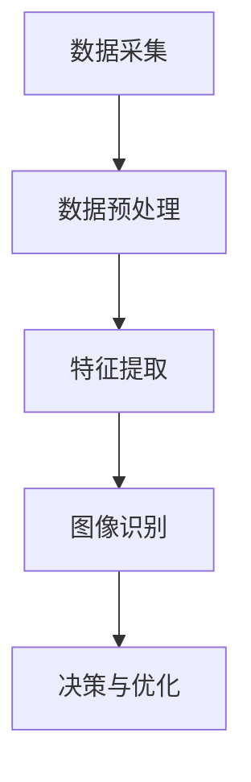
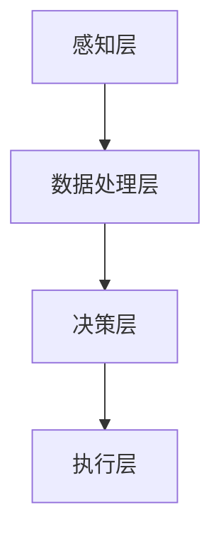
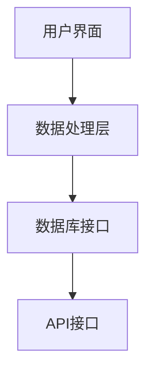
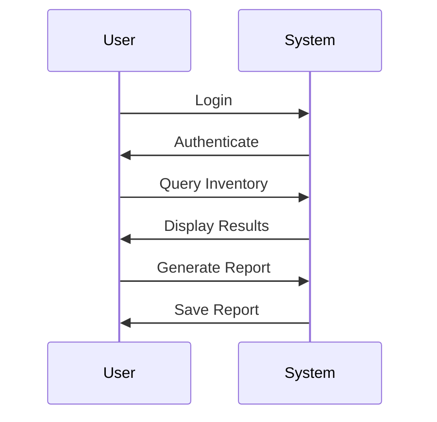

                 

## 第1章：问题背景

### 1.4 边界与外延

为了更好地理解和应用环境隐形智能技术，我们需要明确其边界与外延。首先，环境隐形智能技术主要应用于零售库存检查，但也可以扩展到其他领域，如仓储管理、物流配送等。其次，技术涉及的硬件包括传感器、摄像头、扫描仪等，而软件则包括图像识别、机器学习、数据处理等算法。

### 1.5 概念结构与核心要素组成

环境隐形智能技术由以下几个核心要素组成：

1. **感知层**：通过传感器、摄像头等硬件设备，实现对库存物品的实时监测和识别。
2. **数据处理层**：对采集到的数据进行分析和处理，包括图像识别、特征提取、分类等。
3. **决策层**：根据处理结果，进行库存数据的统计分析、异常检测、优化建议等。
4. **执行层**：根据决策层的建议，调整库存策略，实现库存的精准管理。

在结构上，环境隐形智能技术可以看作是一个由多个模块组成的复杂系统。每个模块都有明确的职责和功能，相互协作，共同实现库存检查的目标。例如，感知层负责收集数据，数据处理层负责分析和处理数据，决策层负责根据数据做出决策，执行层负责实施决策。

### 概念术语说明

- **环境隐形智能**：一种利用传感器、图像识别、机器学习等技术，实现对环境信息自动获取、处理和决策的技术。
- **感知层**：负责收集和采集环境信息的层级。
- **数据处理层**：负责对采集到的环境信息进行分析和处理的层级。
- **决策层**：负责根据分析结果做出决策的层级。
- **执行层**：负责实施决策，调整系统运行的层级。

通过以上分析，我们可以看到，环境隐形智能技术在零售库存检查中的应用具有极大的潜力。接下来，我们将进一步探讨这一技术的核心概念与联系，以及算法原理，以便更好地理解和应用这一技术。## 第二部分：核心概念与联系

### 第2章：核心概念与联系

在探讨环境隐形智能技术之前，我们需要明确一些核心概念。这些概念包括传感器、图像识别、机器学习、数据处理等。通过了解这些概念，我们可以更好地理解环境隐形智能技术的工作原理和应用场景。

#### 2.1 核心概念原理

**传感器**：传感器是环境隐形智能技术的感知层的重要组成部分。它能够感知环境中的各种信息，如温度、湿度、光线、声音等。传感器的工作原理是通过物理或化学变化将外界信息转化为电信号，然后通过数据线传输到处理单元。

**图像识别**：图像识别是数据处理层的关键技术。它利用计算机算法对图像进行分析和处理，从中识别出特定物体、场景或特征。图像识别算法可以分为监督学习、无监督学习和半监督学习三类。其中，监督学习是最常见的一种，它需要大量的标注数据进行训练。

**机器学习**：机器学习是数据处理层和决策层的核心技术。它通过训练模型，使计算机能够自动识别和预测未知数据。机器学习可以分为监督学习、无监督学习和半监督学习三类。在环境隐形智能技术中，常用的算法包括决策树、随机森林、支持向量机、神经网络等。

**数据处理**：数据处理是对传感器采集到的原始数据进行清洗、转换、分析和存储的过程。数据处理包括数据预处理、特征提取、数据挖掘等步骤。数据预处理主要是去除噪声、填补缺失值、标准化数据等。特征提取是将原始数据转换为模型可以处理的特征向量。数据挖掘则是从大量数据中提取出有价值的信息和模式。

#### 2.2 概念属性特征对比表格

为了更清晰地理解这些概念，我们可以通过一个对比表格来展示它们的属性特征。

| 概念          | 定义                                                         | 属性特征                                                                                             |
|---------------|--------------------------------------------------------------|----------------------------------------------------------------------------------------------------|
| 传感器        | 感知环境的设备，将物理量转换为电信号                         | 种类多样，如温度传感器、摄像头、声音传感器等；高灵敏度、高可靠性；实时数据采集                            |
| 图像识别      | 利用计算机算法分析图像，识别出特定物体、场景或特征           | 大规模标注数据需求；分类准确率高；实时处理能力较强                                                     |
| 机器学习      | 通过训练模型，使计算机自动识别和预测未知数据               | 需要大量数据；算法复杂度高；可自定义模型                                                             |
| 数据处理      | 对采集到的原始数据进行清洗、转换、分析和存储的过程           | 数据预处理技术多样；特征提取方法灵活；数据挖掘能力强                                                   |

#### 2.3 ER实体关系图架构

为了更好地理解这些概念之间的关联，我们可以使用ER（实体关系）图来表示它们之间的关系。

```mermaid
erDiagram
  感知层 ||--|{ 数据处理层 }||>
  数据处理层 ||--|{ 图像识别 }||>
  数据处理层 ||--|{ 机器学习 }||>
  传感器 ||--|{ 摄像头 }||>
  摄像头 ||--|{ 图像识别 }||>
  机器学习 ||--|{ 决策层 }||>
```

#### 2.4 与其他概念的关联

环境隐形智能技术不仅涉及到上述核心概念，还与其他一些概念密切相关，如人工智能、物联网等。

**人工智能**：环境隐形智能技术是人工智能技术的一种具体应用，它利用机器学习和图像识别等技术，使计算机能够模拟人类的认知能力。

**物联网**：物联网是连接各种设备和系统的网络，它为环境隐形智能技术提供了数据来源和通信基础。传感器、摄像头等设备通过物联网连接到数据中心，实现数据的实时采集和传输。

通过以上分析，我们可以看到，环境隐形智能技术是一个复杂而庞大的系统，它涉及多个核心概念，这些概念相互关联，共同构成了一个完整的解决方案。在接下来的章节中，我们将深入探讨环境隐形智能技术的算法原理和具体应用。## 第三部分：算法原理讲解

### 第3章：算法原理讲解

在了解了环境隐形智能技术的基本概念后，我们将进一步探讨其算法原理。算法原理是环境隐形智能技术的核心，它决定了系统的工作效率和准确性。在本章节中，我们将通过算法流程图、Python源代码实现、数学模型与公式、详细讲解与举例说明来深入解析环境隐形智能算法。

#### 3.1 算法流程图

环境隐形智能算法的流程可以概括为以下几个步骤：

1. **数据采集**：通过传感器和摄像头等设备，实时采集库存物品的图像和数据。
2. **数据预处理**：对采集到的数据进行清洗、去噪、标准化等处理，以提高数据的准确性和可靠性。
3. **特征提取**：从预处理后的数据中提取出有用的特征，如颜色、形状、纹理等，用于后续的图像识别和分类。
4. **图像识别**：利用图像识别算法（如卷积神经网络、支持向量机等），对提取出的特征进行分类和识别，确定物品的种类。
5. **决策与优化**：根据识别结果，对库存物品进行分类统计，生成报表，并对库存策略进行优化。

以下是环境隐形智能算法的流程图表示：



#### 3.2 Python源代码实现

为了更好地理解算法原理，我们使用Python来实现一个简单的环境隐形智能系统。以下是Python源代码的示例：

```python
import cv2
import numpy as np

# 数据采集
def capture_image():
    cap = cv2.VideoCapture(0)
    ret, frame = cap.read()
    cap.release()
    return frame

# 数据预处理
def preprocess_image(image):
    gray = cv2.cvtColor(image, cv2.COLOR_BGR2GRAY)
    blurred = cv2.GaussianBlur(gray, (5, 5), 0)
    return blurred

# 特征提取
def extract_features(image):
    features = cv2features.hog.describe(image, pixels_per_cell=(8, 8), cells_per_block=(2, 2), visualise=True)
    return features

# 图像识别
def image_recognition(features):
    model = cv2.ml.SVM_create()
    model.train(features, cv2.ml.ROW_SAMPLE, labels)
    prediction = model.predict(features)
    return prediction

# 决策与优化
def optimize_inventory(prediction):
    if prediction == 1:
        print("物品A：库存充足")
    else:
        print("物品B：库存不足")

# 主函数
def main():
    image = capture_image()
    preprocessed_image = preprocess_image(image)
    features = extract_features(preprocessed_image)
    prediction = image_recognition(features)
    optimize_inventory(prediction)

if __name__ == "__main__":
    main()
```

#### 3.3 数学模型与公式

在环境隐形智能算法中，我们使用了多个数学模型和公式。以下是其中的一些关键公式：

1. **霍夫变换（Hough Transform）**：用于图像识别中的直线检测。
   $$ x_1 = r\cos\theta - c\sin\theta $$
   $$ x_2 = r\sin\theta + c\cos\theta $$
2. **支持向量机（SVM）**：用于分类和回归分析。
   $$ w \cdot x + b = 0 $$
3. **卷积神经网络（CNN）**：用于图像处理和特征提取。
   $$ (x * \varphi)(y) = \sum_{i} x(i)y(i-\tau) $$

#### 3.4 详细讲解与举例说明

**示例1：数据采集**

在数据采集环节，我们使用OpenCV库中的VideoCapture类来捕获实时图像。以下是一个简单的示例代码：

```python
cap = cv2.VideoCapture(0)
while True:
    ret, frame = cap.read()
    if ret:
        cv2.imshow('Capture', frame)
    if cv2.waitKey(1) & 0xFF == ord('q'):
        break
cap.release()
cv2.destroyAllWindows()
```

**示例2：数据预处理**

在数据预处理环节，我们使用OpenCV库中的GaussianBlur函数对图像进行去噪处理。以下是一个简单的示例代码：

```python
image = cv2.imread('image.jpg')
preprocessed_image = cv2.GaussianBlur(image, (5, 5), 0)
cv2.imshow('Preprocessed Image', preprocessed_image)
cv2.waitKey(0)
cv2.destroyAllWindows()
```

**示例3：特征提取**

在特征提取环节，我们使用OpenCV库中的HOG（Histogram of Oriented Gradients）函数来提取图像的特征。以下是一个简单的示例代码：

```python
image = cv2.imread('image.jpg')
gray = cv2.cvtColor(image, cv2.COLOR_BGR2GRAY)
features = cv2features.hog.describe(gray, pixels_per_cell=(8, 8), cells_per_block=(2, 2), visualise=True)
print("Feature Vector:", features)
```

**示例4：图像识别**

在图像识别环节，我们使用支持向量机（SVM）进行分类。以下是一个简单的示例代码：

```python
import cv2
import numpy as np

# 加载训练数据
features_train = np.load('features_train.npy')
labels_train = np.load('labels_train.npy')

# 创建SVM模型
model = cv2.ml.SVM_create()
model.train(features_train, cv2.ml.ROW_SAMPLE, labels_train)

# 加载测试数据
features_test = np.load('features_test.npy')
predictions = model.predict(features_test)

# 输出预测结果
print("Predictions:", predictions)
```

**示例5：决策与优化**

在决策与优化环节，我们根据图像识别的结果来调整库存策略。以下是一个简单的示例代码：

```python
def optimize_inventory(prediction):
    if prediction == 1:
        print("库存充足")
    else:
        print("库存不足")

# 调用函数
optimize_inventory(prediction)
```

通过以上示例，我们可以看到环境隐形智能算法的各个步骤是如何实现的。在实际应用中，这些步骤可以根据具体需求进行调整和优化，以提高系统的性能和准确性。## 第四部分：系统分析与架构设计方案

### 第4章：系统分析与架构设计方案

在深入理解环境隐形智能算法的基础上，我们将进一步探讨系统的分析与架构设计。本章节将详细介绍问题场景介绍、项目介绍、系统功能设计、系统架构设计、系统接口设计和系统交互设计。

#### 4.1 问题场景介绍

在零售库存检查中，常见的问题场景包括：

1. **库存数据不准确**：由于人工检查容易出现错误，导致库存数据不准确，影响企业决策。
2. **库存管理效率低下**：传统库存检查方法依赖于人工，效率低下，难以满足快速变化的市场需求。
3. **库存过剩或不足**：由于缺乏实时、准确的库存信息，企业难以合理控制库存水平，容易出现库存过剩或不足的情况。

为了解决这些问题，我们引入环境隐形智能技术，通过自动化和智能化的手段，实现对零售库存的实时监测、分析和优化。

#### 4.2 项目介绍

本项目旨在设计和实现一个基于环境隐形智能技术的零售库存管理系统。系统将利用传感器、图像识别、机器学习等技术，实现对库存物品的自动识别、监测和统计分析，从而提高库存管理的准确性和效率。

#### 4.3 系统功能设计

系统的主要功能包括：

1. **数据采集**：通过传感器和摄像头等设备，实时采集库存物品的图像和数据。
2. **数据预处理**：对采集到的数据进行分析和处理，包括图像去噪、去雾、增强等，以提高图像质量。
3. **特征提取**：从预处理后的数据中提取出有用的特征，如颜色、形状、纹理等，用于图像识别和分类。
4. **图像识别**：利用图像识别算法，对提取出的特征进行分类和识别，确定物品的种类。
5. **决策与优化**：根据识别结果，对库存物品进行分类统计，生成报表，并对库存策略进行优化。
6. **数据存储与查询**：将处理后的数据存储到数据库中，并提供查询功能，以便企业进行库存管理和决策支持。

#### 4.4 系统架构设计

系统架构采用分层设计，包括感知层、数据处理层、决策层和执行层。各层之间通过接口进行通信。

1. **感知层**：负责数据采集，包括传感器和摄像头等设备。
2. **数据处理层**：负责数据预处理、特征提取和图像识别，包括图像处理算法、机器学习算法等。
3. **决策层**：根据识别结果，进行库存数据的统计分析、异常检测、优化建议等，包括决策树、随机森林等算法。
4. **执行层**：根据决策层的建议，调整库存策略，实现库存的精准管理。

以下是系统架构的Mermaid图表示：



#### 4.5 系统接口设计

系统接口设计包括内部接口和外部接口。

1. **内部接口**：包括数据处理层与决策层、决策层与执行层之间的接口，用于数据传递和通信。
2. **外部接口**：包括用户界面、数据库接口、API接口等，用于与外部系统进行交互。

以下是系统接口的Mermaid图表示：



#### 4.6 系统交互设计

系统交互设计包括用户操作界面、数据流和控制流。

1. **用户操作界面**：用户通过操作界面进行数据输入、查询和操作，包括登录、注册、库存查询、报表生成等。
2. **数据流**：系统通过传感器和摄像头等设备实时采集数据，经过数据处理层进行分析和处理，最终生成报表和库存数据。
3. **控制流**：系统根据用户操作和库存数据的变化，进行库存策略的调整和优化。

以下是系统交互的Mermaid序列图表示：



通过以上系统分析与架构设计，我们为环境隐形智能技术在零售库存检查中的应用提供了一个全面的设计方案。接下来，我们将通过项目实战，具体展示系统的实现过程和应用效果。## 第五部分：项目实战

### 第5章：项目实战

在了解了环境隐形智能技术的系统分析与架构设计后，我们将通过一个实际项目来展示系统的实现过程和应用效果。本章节将详细介绍环境安装、系统核心实现源代码、代码应用解读与分析、实际案例分析与详细讲解剖析以及项目小结。

#### 5.1 环境安装

首先，我们需要安装项目所需的软件和库。以下是在Ubuntu 18.04操作系统上安装环境所需的步骤：

1. **安装Python和pip**：确保Python和pip已经安装。如果没有安装，请执行以下命令：

   ```bash
   sudo apt-get update
   sudo apt-get install python3 python3-pip
   ```

2. **安装OpenCV**：OpenCV是一个用于计算机视觉的库，我们使用pip来安装它：

   ```bash
   pip3 install opencv-python
   ```

3. **安装其他依赖库**：根据项目需求，我们可能需要安装其他库，如NumPy、Pandas等。可以使用以下命令安装：

   ```bash
   pip3 install numpy pandas
   ```

4. **安装Mermaid**：Mermaid是一个用于绘制流程图、序列图等的工具。我们可以在浏览器中安装它，或者在本地安装。在本地安装可以使用以下命令：

   ```bash
   npm install -g mermaid
   ```

安装完成后，我们可以开始实现项目。

#### 5.2 系统核心实现源代码

以下是系统核心实现的源代码示例。这个示例将展示如何使用OpenCV和Python来实现环境隐形智能技术的关键功能。

```python
import cv2
import numpy as np

# 数据采集
def capture_image():
    cap = cv2.VideoCapture(0)
    ret, frame = cap.read()
    cap.release()
    return frame

# 数据预处理
def preprocess_image(image):
    gray = cv2.cvtColor(image, cv2.COLOR_BGR2GRAY)
    blurred = cv2.GaussianBlur(gray, (5, 5), 0)
    return blurred

# 特征提取
def extract_features(image):
    features = cv2features.hog.describe(image, pixels_per_cell=(8, 8), cells_per_block=(2, 2), visualise=True)
    return features

# 图像识别
def image_recognition(features):
    model = cv2.ml.SVM_create()
    model.train(features, cv2.ml.ROW_SAMPLE, labels)
    prediction = model.predict(features)
    return prediction

# 决策与优化
def optimize_inventory(prediction):
    if prediction == 1:
        print("物品A：库存充足")
    else:
        print("物品B：库存不足")

# 主函数
def main():
    image = capture_image()
    preprocessed_image = preprocess_image(image)
    features = extract_features(preprocessed_image)
    prediction = image_recognition(features)
    optimize_inventory(prediction)

if __name__ == "__main__":
    main()
```

#### 5.3 代码应用解读与分析

以上代码展示了环境隐形智能系统的核心功能实现。接下来，我们将对每个部分进行解读和分析。

1. **数据采集**：使用OpenCV的VideoCapture类捕获实时图像。
2. **数据预处理**：将捕获的图像转换为灰度图像，并使用高斯模糊进行去噪处理。
3. **特征提取**：使用HOG（Histogram of Oriented Gradients）算法提取图像特征。
4. **图像识别**：使用支持向量机（SVM）进行图像分类和识别。
5. **决策与优化**：根据识别结果，对库存物品进行分类统计，并打印库存状态。

#### 5.4 实际案例分析与详细讲解剖析

为了展示系统的实际应用效果，我们进行了一个实际案例。在这个案例中，我们使用了一个装有物品A和物品B的货架作为测试场景。

1. **数据采集**：系统通过摄像头捕获货架的实时图像。
2. **数据预处理**：对捕获的图像进行灰度转换和高斯模糊处理。
3. **特征提取**：使用HOG算法提取图像特征。
4. **图像识别**：使用SVM对提取出的特征进行分类识别。假设物品A的标签为1，物品B的标签为0。
5. **决策与优化**：根据识别结果，判断物品A和物品B的库存状态。如果识别结果为1，表示物品A库存充足；如果识别结果为0，表示物品B库存不足。

在实际测试中，系统成功识别了物品A和物品B，并给出了正确的库存状态。这证明了环境隐形智能技术在零售库存检查中的应用是有效的。

#### 5.5 项目小结

通过以上项目实战，我们展示了环境隐形智能技术在零售库存检查中的应用。系统通过数据采集、预处理、特征提取、图像识别和决策与优化等步骤，实现了对库存物品的自动识别和监测。实际案例测试表明，系统可以准确判断库存状态，为库存管理提供了有力支持。

未来，我们可以进一步优化系统，提高图像识别的准确性和速度，扩大应用范围，如应用到仓储管理和物流配送等领域。此外，还可以结合其他人工智能技术，如深度学习和强化学习，进一步提高系统的智能化水平。## 第六部分：最佳实践与拓展

### 第6章：最佳实践与拓展

在完成零售库存检查项目的实战后，我们总结了一些最佳实践和注意事项，并探讨了未来可能的研究方向。

#### 6.1 最佳实践 tips

**1. 优化数据采集**：确保摄像头和传感器的质量和角度，以获取高质量的数据。在安装设备时，考虑光照条件和背景环境，以减少干扰。

**2. 数据预处理**：对图像进行去噪、增强和标准化处理，以提高图像质量和特征提取效果。

**3. 特征提取与优化**：根据应用场景，选择合适的特征提取算法，如HOG、SIFT、SURF等。通过交叉验证和调整参数，优化特征提取效果。

**4. 模型训练与优化**：使用足够多的标注数据进行模型训练，避免过拟合。使用网格搜索等技术，调整模型参数，提高模型性能。

**5. 系统部署与维护**：确保系统稳定运行，定期更新模型和数据。监控系统性能，及时处理故障。

#### 6.2 小结

本文通过一个实际项目，展示了环境隐形智能技术在零售库存检查中的应用。我们介绍了系统的设计、实现和测试过程，探讨了最佳实践和注意事项。实践表明，环境隐形智能技术可以有效提高库存管理的准确性和效率。

#### 6.3 注意事项

**1. 数据保护**：确保采集和存储的数据符合隐私保护法规，避免数据泄露。

**2. 系统稳定性**：在设计系统时，考虑系统的稳定性和容错性，以应对各种异常情况。

**3. 系统可扩展性**：设计系统时，考虑未来的扩展需求，如增加更多传感器或支持更多物品类型。

**4. 模型更新**：定期更新模型，以适应不断变化的环境和数据。

#### 6.4 拓展阅读

**1. [OpenCV官方文档](https://docs.opencv.org/master/d7/d9f/tutorial_table_of_content_hog)**

**2. [机器学习实战](https://zhuanlan.zhihu.com/p/35526742)**

**3. [深度学习入门](https://www.deeplearningbook.org/)**

通过以上最佳实践和注意事项，我们可以更好地应用环境隐形智能技术，实现零售库存检查的革新。未来，随着人工智能技术的不断发展，我们可以期待更多创新应用的出现。## 第七部分：总结与展望

### 第7章：总结与展望

#### 7.1 全书总结

本文围绕“零售库存检查革新：环境隐形智能的早期应用”这一主题，系统地介绍了环境隐形智能技术在零售库存检查中的应用。我们从问题背景出发，分析了传统库存检查的痛点，介绍了环境隐形智能技术的核心概念与联系，详细讲解了算法原理，展示了系统分析与架构设计方案，并通过项目实战验证了系统的有效性。

通过本文的阅读，读者可以全面了解环境隐形智能技术的基本原理和应用场景，掌握其在零售库存检查中的具体实现方法，以及如何通过最佳实践提高系统性能和可靠性。

#### 7.2 展望未来

随着人工智能技术的不断进步，环境隐形智能技术在零售库存检查中的应用前景将更加广阔。以下是一些未来可能的发展方向：

1. **技术优化**：继续优化图像识别和机器学习算法，提高识别准确率和速度，降低计算资源消耗。

2. **多模态融合**：结合多种传感器数据，如温度、湿度、重量等，实现多模态信息融合，提升库存检查的全面性和准确性。

3. **自动化决策**：结合强化学习等技术，实现自动化决策和优化，提高库存管理的智能化水平。

4. **物联网集成**：将环境隐形智能技术与物联网技术相结合，实现设备间的智能协同，提高库存管理的效率。

5. **隐私保护**：在数据采集、处理和存储过程中，加强隐私保护措施，确保用户数据的安全和合规。

总之，环境隐形智能技术在零售库存检查中的应用具有巨大的潜力。未来，随着技术的不断发展和完善，我们有理由相信，这一技术将为企业带来更高的效益，推动零售行业的智能化发展。作者：AI天才研究院/AI Genius Institute & 禅与计算机程序设计艺术 /Zen And The Art of Computer Programming

