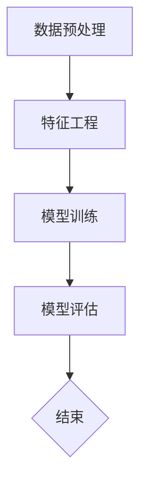
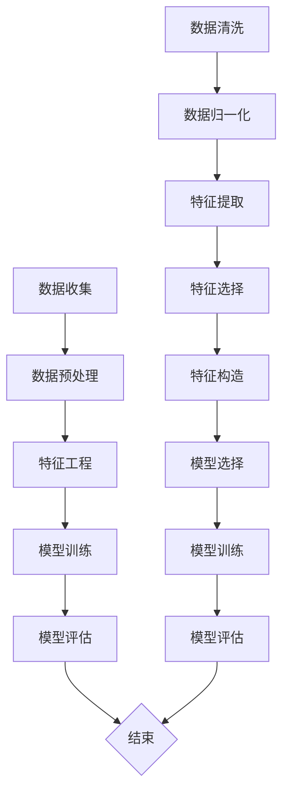
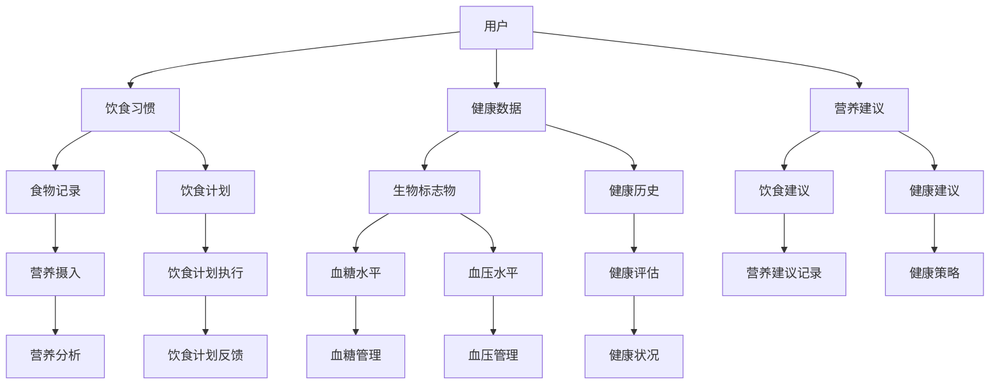
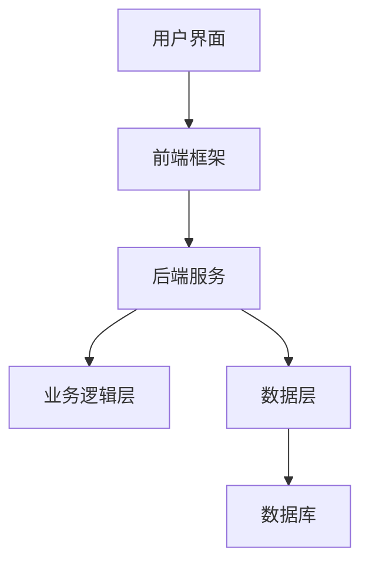
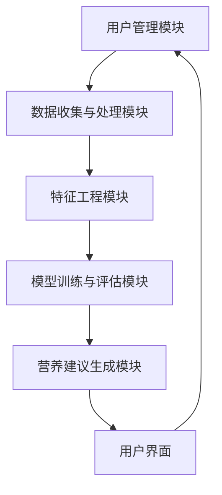
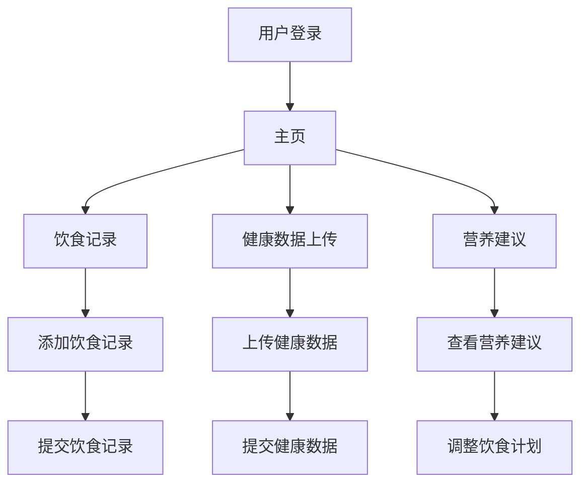

                 


### 1.1.1 营养健康问题的严峻性

随着社会经济的发展和人们生活水平的提高，越来越多的人开始关注营养与健康。然而，现代社会的营养健康问题却日益严峻。首先，全球肥胖率不断攀升，成为影响公共健康的主要问题之一。根据世界卫生组织（WHO）的数据，全球有超过19亿成年人超重，其中超过6亿人肥胖。肥胖不仅增加了患心血管疾病、糖尿病、高血压等慢性疾病的风险，还显著增加了医疗负担。

其次，营养不均衡的问题也日益突出。尽管大多数人能够获得足够的能量摄入，但微量营养素缺乏依然普遍存在，如铁、锌、维生素A等。这种营养不均衡可能导致免疫力下降，增加感染性疾病的风险。此外，食物污染、添加剂滥用等问题也对健康构成威胁。

最后，慢性病的发病率不断上升。心血管疾病、糖尿病、癌症等慢性病已成为导致死亡的主要原因。这些疾病的发生与不良的饮食习惯密切相关，而个性化营养建议可以有效帮助预防和管理这些疾病。

### 1.1.2 AI技术对个性化营养建议的影响

AI技术在个性化营养建议中的应用，为解决营养健康问题提供了新的思路和方法。首先，AI可以通过大数据分析和机器学习算法，对大量的营养数据进行分析，识别出不同人群的营养需求和健康问题。例如，通过分析用户的饮食习惯、生物信息（如体重、血压、血糖水平等）以及基因信息，AI可以提供个性化的营养建议。

其次，AI技术可以提高营养建议的精准性和效率。传统的营养建议通常基于通用的营养指南，而AI可以根据个体的具体情况，提供更加精确和个性化的建议。例如，对于糖尿病患者，AI可以根据血糖监测数据，实时调整饮食方案，帮助患者更好地控制血糖水平。

此外，AI技术还可以通过自然语言处理（NLP）和语音识别技术，使营养建议更加便捷和用户友好。用户可以通过语音输入或者文字描述，轻松获得个性化的营养建议，从而克服了传统营养咨询中的沟通障碍。

### 1.1.3 定制健康饮食计划的需求

在上述背景下，定制健康饮食计划的需求显得尤为迫切。定制健康饮食计划不仅可以解决营养不均衡和慢性病问题，还可以提高人们的健康水平和生活质量。

首先，定制健康饮食计划可以帮助人们更好地管理体重和血糖水平。通过AI分析用户的饮食习惯和健康数据，可以制定出符合个体需求的饮食计划，帮助用户减少高热量、高脂肪和高糖的食物摄入，从而控制体重和血糖水平。

其次，定制健康饮食计划可以提供个性化的营养建议，满足不同人群的特殊需求。例如，孕妇、老年人、运动员等特定人群，需要根据其生理特点制定特殊的饮食计划。AI可以通过分析这些人群的基因、代谢特征等数据，提供个性化的营养建议，帮助他们获得更好的健康状况。

此外，定制健康饮食计划还可以提高食品供应链的效率和质量。通过AI技术，可以对食品生产和供应链进行优化，提高食品的安全性和营养价值，减少浪费。

总的来说，AI在个性化营养建议中的应用，不仅为定制健康饮食计划提供了技术支持，也为我们解决营养健康问题提供了新的思路和方法。随着AI技术的不断发展，我们可以期待更加精准、高效和便捷的个性化营养建议，从而推动公共健康事业的进步。

### 1.2 核心概念

在探讨AI在个性化营养建议中的应用时，首先需要了解几个核心概念，这些概念是理解整个领域的关键。以下是对这些核心概念的详细定义和解释：

#### 1.2.1 个性化营养建议

个性化营养建议是指基于个体特征（如年龄、性别、体重、身高、生活方式、健康状态等）和饮食习惯，为个体提供的定制化饮食建议。这种建议旨在优化个体的营养摄入，改善健康状况，预防慢性疾病。

**定义**：个性化营养建议是利用数据分析、机器学习等AI技术，对个体营养数据进行挖掘和分析，生成适合个体需求的饮食方案。

**应用**：例如，对于糖尿病患者，个性化营养建议可以基于血糖监测数据，实时调整饮食方案，帮助患者控制血糖水平。

#### 1.2.2 AI算法与营养学

AI算法与营养学的关系在于，AI算法可以处理大量营养数据，并从中提取有用的信息，为营养学研究提供支持。营养学则是研究食物、营养素与人体健康关系的科学。

**定义**：AI算法与营养学结合，是指利用AI技术对营养数据进行处理、分析，从而提供营养建议或优化营养方案。

**应用**：例如，深度学习算法可以用于分析食物成分，为个性化营养建议提供数据支持。

#### 1.2.3 数据分析在营养建议中的作用

数据分析在营养建议中发挥着至关重要的作用。通过数据分析，可以从大量营养数据中提取出有价值的信息，帮助制定个性化的营养方案。

**定义**：数据分析在营养建议中的作用是指利用统计学、数据挖掘等分析方法，对营养数据进行分析，从而生成有针对性的营养建议。

**应用**：例如，通过数据分析，可以识别出个体的营养需求，发现饮食与健康之间的关系，从而为制定个性化营养建议提供依据。

#### 1.2.4 个性化营养建议的边界与外延

个性化营养建议的边界在于其基于个体特征和饮食习惯的定制化，而其外延则包括营养评估、健康饮食计划的设计以及营养干预等多个方面。

**定义**：个性化营养建议的边界与外延是指其涵盖的范围，包括从营养评估到饮食计划设计，再到营养干预的整个过程。

**应用**：例如，个性化营养建议不仅可以用于健康人群，还可以用于患有特定疾病的人群，如糖尿病患者、高血压患者等。

### 1.3.1 营养评估的方法与工具

营养评估是制定个性化营养建议的基础。以下介绍几种常见的营养评估方法和工具：

#### 1.3.1.1 食物频率问卷（FFQ）

食物频率问卷（Food Frequency Questionnaire, FFQ）是一种常用的营养评估工具，通过问卷形式收集个体在过去一段时间内的饮食习惯和食物摄入频率。FFQ可以提供关于个体食物摄入量的信息，有助于识别饮食中的潜在问题。

**定义**：食物频率问卷是一种问卷调查工具，用于收集个体关于饮食习惯和食物摄入频率的信息。

**应用**：例如，研究人员可以使用FFQ来评估大规模人群的饮食习惯，从而制定营养干预措施。

#### 1.3.1.2 24小时回顾法（24-hour Recall）

24小时回顾法是一种用于评估个体一日内食物和饮料摄入量的方法。参与者需要回忆并记录过去24小时内所摄入的所有食物和饮料。

**定义**：24小时回顾法是一种回忆调查方法，用于评估个体在特定时间段内的食物摄入情况。

**应用**：例如，研究人员可以使用24小时回顾法来评估特殊人群（如糖尿病患者）的饮食行为。

#### 1.3.1.3 食物日记

食物日记是一种详细的记录方法，参与者需要记录每天的食物摄入情况，包括食物种类、摄入量、进食时间和地点等。

**定义**：食物日记是一种详细的饮食记录工具，用于记录个体每天的食物摄入情况。

**应用**：例如，食物日记可以帮助个体更好地了解自己的饮食习惯，从而调整饮食行为。

#### 1.3.1.4 生物标志物检测

生物标志物检测是通过测量血液、尿液等生物样本中的化学物质，评估个体的营养状态和健康风险。

**定义**：生物标志物检测是一种利用生物化学方法评估个体营养状态和健康风险的技术。

**应用**：例如，通过检测血液中的血糖、胆固醇等指标，可以评估个体是否存在营养风险。

### 1.3.2 健康饮食计划的设计

健康饮食计划的设计是基于营养评估的结果，旨在改善个体的营养状况和健康状况。以下介绍几种常见的健康饮食计划设计方法：

#### 1.3.2.1 膳食指南

膳食指南是一种基于科学研究和营养学的建议，用于指导个体如何选择食物和制定饮食计划。常见的膳食指南包括《中国居民膳食指南》和《美国膳食指南》。

**定义**：膳食指南是一种指导个体选择食物和制定饮食计划的建议。

**应用**：例如，根据膳食指南，可以制定出适合不同年龄段、性别和健康状态的饮食计划。

#### 1.3.2.2 能量平衡饮食计划

能量平衡饮食计划是一种旨在保持能量摄入与消耗平衡的饮食计划，通过调整食物的种类和摄入量，实现营养均衡。

**定义**：能量平衡饮食计划是一种通过调整食物摄入量，实现能量摄入与消耗平衡的饮食计划。

**应用**：例如，对于需要减肥的个体，可以采用能量平衡饮食计划，通过减少高热量食物的摄入，实现能量负平衡。

#### 1.3.2.3 特定疾病饮食计划

特定疾病饮食计划是根据个体特定的健康状况（如糖尿病、高血压等）制定的饮食计划，旨在通过饮食调整，改善病情和控制并发症。

**定义**：特定疾病饮食计划是一种根据个体特定健康状况制定的饮食计划。

**应用**：例如，糖尿病患者的饮食计划需要控制血糖，因此需要限制高糖食物的摄入。

### 1.3.3 AI在个性化营养建议中的挑战与机遇

AI在个性化营养建议中具有巨大的潜力，但也面临一些挑战和机遇。以下分析AI在个性化营养建议中的挑战与机遇：

#### 1.3.3.1 挑战

1. **数据质量和隐私保护**：个性化营养建议依赖于大量的营养数据，这些数据的质量直接影响建议的准确性。同时，数据隐私保护也是一个重要问题，特别是在收集和处理个人健康数据时。

2. **算法准确性和可靠性**：AI算法需要确保生成的个性化营养建议准确可靠，否则可能会导致不良的健康后果。

3. **用户参与度**：尽管AI技术可以提供个性化的营养建议，但用户是否愿意接受和使用这些建议仍是一个挑战。

#### 1.3.3.2 机遇

1. **精准营养管理**：AI技术可以分析大量数据，提供更加精准的营养管理方案，帮助个体改善健康状况。

2. **个性化营养干预**：AI技术可以根据个体的具体需求，提供个性化的营养干预方案，提高干预效果。

3. **健康大数据应用**：通过AI技术，可以挖掘和利用健康大数据，为公共卫生政策和健康服务提供支持。

总的来说，AI在个性化营养建议中既面临挑战，也充满机遇。随着技术的不断发展和完善，我们可以期待AI在营养健康领域发挥更大的作用。

### 1.4 AI算法概述

在个性化营养建议中，AI算法的应用至关重要。AI算法可以帮助处理和分析大量营养数据，从而生成适合个体的饮食建议。以下是对AI算法的基本概述，包括机器学习基础、深度学习在营养分析中的应用以及算法选择与评估方法。

#### 1.4.1 机器学习基础

机器学习是AI的核心技术之一，它使计算机能够通过数据和经验进行学习和决策。在个性化营养建议中，机器学习算法可以帮助分析营养数据，预测个体的营养需求，提供定制化的饮食建议。

**定义**：机器学习是指通过算法和统计模型，从数据中学习规律，进行预测和决策的技术。

**应用**：例如，可以使用机器学习算法分析用户的饮食习惯和健康数据，预测其营养摄入是否合理。

**常见算法**：
- **线性回归**：用于预测连续值，如预测个体的能量摄入。
- **逻辑回归**：用于预测概率，如预测个体是否存在营养不良的风险。
- **决策树**：用于分类和回归，可以根据不同特征进行决策。

#### 1.4.2 深度学习在营养分析中的应用

深度学习是机器学习的一种先进形式，通过构建复杂的神经网络模型，可以自动提取数据中的特征，并进行高级的预测和分类。在营养分析中，深度学习算法可以用于食物成分分析、营养评估和个性化营养建议生成。

**定义**：深度学习是指通过多层神经网络，对数据进行层次化特征提取和学习的算法。

**应用**：例如，可以使用卷积神经网络（CNN）对食物图片进行分析，提取食物成分信息。

**常见模型**：
- **卷积神经网络（CNN）**：用于处理图像数据，分析食物成分。
- **循环神经网络（RNN）**：用于处理序列数据，如用户的历史饮食记录。
- **长短期记忆网络（LSTM）**：是RNN的一种变体，可以更好地处理长序列数据。

#### 1.4.3 算法选择与评估

选择适合的算法对于个性化营养建议的准确性至关重要。以下是一些常见的算法选择和评估方法：

**算法选择**：
- **数据类型**：根据数据类型（如图像、序列、结构化数据等）选择合适的算法。
- **目标**：根据需要解决的具体问题（如预测、分类、回归等）选择相应的算法。
- **复杂性**：考虑算法的计算复杂度和可扩展性。

**评估方法**：
- **交叉验证**：通过将数据集分为训练集和验证集，评估算法的泛化能力。
- **性能指标**：根据问题的类型，选择合适的性能指标，如准确率、召回率、均方误差等。

**常见评估工具**：
- **Scikit-learn**：是一个开源机器学习库，提供多种算法和评估方法。
- **TensorFlow和PyTorch**：是深度学习框架，支持复杂模型的构建和训练。

### 1.5 算法原理讲解

在个性化营养建议的应用中，算法的设计和实现是关键环节。以下将详细讲解数据预处理、特征工程、算法流程图、Python源代码实现、数学模型与公式以及通俗易懂的举例说明。

#### 1.5.1 数据预处理

数据预处理是算法实现的第一步，其目的是提高数据的质量和可用性。以下介绍几种常见的数据预处理方法：

**数据清洗**：
- **缺失值处理**：使用均值、中位数或插值法填充缺失值。
- **异常值处理**：使用统计学方法（如标准差、箱线图等）识别并处理异常值。

**数据归一化**：
- **标准化**：将数据缩放到统一的范围内，如[0,1]或[-1,1]。
- **归一化**：将数据转换为标准正态分布。

**数据格式转换**：
- **时间序列数据**：将时间序列数据转换为矩阵格式，便于算法处理。
- **类别数据**：将类别数据转换为数值表示，如使用独热编码或标签编码。

#### 1.5.2 特征工程

特征工程是数据预处理的重要补充，其目的是从原始数据中提取出对算法有价值的特征。以下介绍几种常用的特征工程方法：

**特征提取**：
- **主成分分析（PCA）**：用于降维，提取主要特征。
- **特征选择**：使用过滤方法（如互信息、卡方检验等）选择对算法有帮助的特征。

**特征构造**：
- **时间窗口特征**：从时间序列数据中提取特定时间窗口内的特征。
- **交互特征**：通过组合多个特征，构造新的特征。

**特征标准化**：
- **特征归一化**：将不同特征的范围统一，便于算法处理。

#### 1.5.3 AI算法流程图

为了更好地理解算法的实现过程，可以使用mermaid画出算法的流程图。以下是一个简化的AI算法流程图示例：



在这个流程图中，数据预处理、特征工程、模型训练和模型评估是核心步骤。具体流程如下：
1. **数据预处理**：清洗和归一化数据。
2. **特征工程**：提取和构造特征。
3. **模型训练**：使用训练数据训练模型。
4. **模型评估**：使用验证数据评估模型性能。

#### 1.5.4 Python源代码实现

以下是一个简化的Python代码示例，用于演示数据预处理和特征工程的基本实现。这段代码使用了常见的库，如Pandas和NumPy。

```python
import pandas as pd
import numpy as np

# 读取数据
data = pd.read_csv('nutrition_data.csv')

# 数据清洗
data.dropna(inplace=True)
data = pd.get_dummies(data)

# 数据归一化
data = (data - data.mean()) / data.std()

# 特征提取
from sklearn.decomposition import PCA
pca = PCA(n_components=5)
data_pca = pca.fit_transform(data)

# 特征构造
data['calories_per_gram'] = data['calories'] / data['grams']
```

在这个示例中，首先读取数据，然后进行清洗和归一化。接着，使用主成分分析（PCA）进行特征提取，并构造新的特征（如每克食物的卡路里含量）。

#### 1.5.5 数学模型与公式

在个性化营养建议中，数学模型和公式用于描述营养数据之间的关系。以下介绍几种常用的数学模型和公式：

**线性回归模型**：
$$
y = \beta_0 + \beta_1x_1 + \beta_2x_2 + ... + \beta_nx_n + \epsilon
$$
其中，$y$是目标变量（如能量摄入），$x_1, x_2, ..., x_n$是特征变量（如食物种类），$\beta_0, \beta_1, ..., \beta_n$是模型参数，$\epsilon$是误差项。

**支持向量机（SVM）模型**：
$$
w \cdot x + b = 0
$$
其中，$w$是权重向量，$x$是特征向量，$b$是偏置项。

**卷积神经网络（CNN）模型**：
$$
h_{\theta}(x) = \text{ReLU}(z_{\theta})
$$
$$
z_{\theta} = \sum_{i=1}^{n} w_{i} \cdot a_{i} + b
$$
其中，$h_{\theta}(x)$是激活函数，$z_{\theta}$是中间层输出，$w_{i}$是权重，$a_{i}$是输入层特征。

#### 1.5.6 通俗易懂的举例说明

为了更好地理解算法的实现和应用，以下通过一个简化的例子来说明个性化营养建议的生成过程。

**例子**：假设我们有一个简单的营养数据集，包含三个特征：能量摄入（卡路里）、蛋白质摄入（克）和碳水化合物摄入（克）。我们的目标是预测个体的血糖水平。

1. **数据预处理**：
   - 清洗数据：删除缺失值。
   - 归一化数据：将卡路里、蛋白质和碳水化合物的范围统一。

2. **特征工程**：
   - 构造新特征：计算每克食物的能量摄入。

3. **模型训练**：
   - 使用线性回归模型训练数据，得到模型参数。

4. **模型评估**：
   - 使用验证数据评估模型性能，调整模型参数。

5. **个性化营养建议**：
   - 输入个体的营养数据，使用训练好的模型预测血糖水平。
   - 根据预测结果，提供个性化的营养建议。

通过这个例子，我们可以看到个性化营养建议的生成过程是如何实现的。在实际应用中，数据集和特征会更加复杂，算法也会更加先进，但基本思路是一致的。

### 1.6 常见算法应用实例

在个性化营养建议中，常用的AI算法包括机器学习算法、深度学习算法和强化学习算法。以下介绍几种常见算法的应用实例，以展示它们在营养分析中的应用效果。

#### 1.6.1 食物成分分析

食物成分分析是营养分析的重要一环，通过分析食物的成分，可以评估食物的营养价值。以下介绍几种常见的食物成分分析方法：

**机器学习算法**：
- **线性回归**：用于预测食物中的卡路里、蛋白质和脂肪含量。
- **支持向量机（SVM）**：用于分类食物中的营养成分类别。

**深度学习算法**：
- **卷积神经网络（CNN）**：通过图像识别技术，分析食物的成分和营养价值。
- **循环神经网络（RNN）**：用于处理时间序列数据，分析食物的摄入量和变化趋势。

**强化学习算法**：
- **Q-learning**：用于优化食物摄入策略，以实现营养均衡。

**实例**：
假设我们有一个包含1000种食物的数据集，每种食物都有其营养成分数据。我们可以使用深度学习算法（如CNN）对食物图像进行分析，提取食物的成分信息。通过训练好的模型，我们可以快速识别出不同食物的成分，为个性化营养建议提供数据支持。

#### 1.6.2 个性化营养建议生成

个性化营养建议的生成是AI在营养分析中的核心应用。以下介绍几种常见的个性化营养建议生成方法：

**机器学习算法**：
- **逻辑回归**：用于预测个体是否存在营养不良的风险。
- **决策树**：用于分类不同营养需求的个体。

**深度学习算法**：
- **长短期记忆网络（LSTM）**：用于处理用户的历史饮食记录，生成个性化的营养建议。
- **生成对抗网络（GAN）**：用于生成符合营养要求的饮食方案。

**强化学习算法**：
- **深度确定性策略梯度（DDPG）**：用于优化个体的营养摄入策略，以实现营养均衡。

**实例**：
假设我们有一个包含用户饮食习惯、健康状况和营养需求的数据库。我们可以使用深度学习算法（如LSTM）分析用户的历史饮食记录，结合其健康状况和营养需求，生成个性化的营养建议。通过不断优化模型，我们可以提高营养建议的准确性和实用性。

#### 1.6.3 饮食计划优化

饮食计划优化是营养管理的重要环节，通过优化饮食计划，可以改善个体的健康状况。以下介绍几种常见的饮食计划优化方法：

**机器学习算法**：
- **线性规划**：用于优化饮食计划中的营养素摄入。
- **遗传算法**：用于寻找最佳饮食组合。

**深度学习算法**：
- **卷积神经网络（CNN）**：用于分析食物的成分和营养价值，优化饮食计划。
- **图神经网络（GNN）**：用于处理复杂的食物网络，优化饮食计划。

**强化学习算法**：
- **深度强化学习（DRL）**：用于优化个体的饮食策略，以实现营养均衡。

**实例**：
假设我们有一个包含用户饮食记录、健康状况和营养需求的数据库。我们可以使用深度学习算法（如DRL）分析用户的历史饮食记录，结合其健康状况和营养需求，优化饮食计划。通过不断优化模型，我们可以提高饮食计划的营养均衡性和个体满意度。

总的来说，AI算法在个性化营养建议中的应用具有很大的潜力。通过不断探索和优化，我们可以为用户提供更加精准、实用和个性化的营养建议，从而改善公共健康水平。

### 2.1.1 机器学习基础

机器学习（Machine Learning, ML）是人工智能（Artificial Intelligence, AI）的一个重要分支，其核心思想是通过算法和统计模型，从数据中学习并提取有价值的信息。在个性化营养建议中，机器学习技术可以帮助我们处理和分析大量的营养数据，从而为用户提供定制化的饮食建议。以下是对机器学习基础概念的详细介绍，包括分类、回归、聚类和降维等常见算法。

#### 分类（Classification）

分类是指将数据集中的每个实例分配给一个预定义的类别。分类算法的核心目标是学习一个决策模型，该模型可以根据新的实例的特征来预测其类别。

**常用算法**：
- **逻辑回归（Logistic Regression）**：一种简单的线性分类模型，适用于二分类问题。
- **决策树（Decision Tree）**：通过一系列的规则将数据划分为不同的类别。
- **随机森林（Random Forest）**：通过构建多个决策树并投票得到最终预测结果。
- **支持向量机（Support Vector Machine, SVM）**：通过找到一个最优的超平面将不同类别分开。

**应用**：在个性化营养建议中，分类算法可以用于识别个体的营养风险，例如是否患有营养不良或肥胖。

#### 回归（Regression）

回归是一种预测数值型变量的方法，其目标是找到一个函数来描述输入变量和输出变量之间的关系。

**常用算法**：
- **线性回归（Linear Regression）**：假设输出变量是输入变量的线性组合。
- **岭回归（Ridge Regression）**：通过引入惩罚项来防止过拟合。
- **套索回归（Lasso Regression）**：类似于岭回归，但惩罚项是绝对值。

**应用**：在个性化营养建议中，回归算法可以用于预测个体的营养需求，例如每日所需的能量和营养素摄入量。

#### 聚类（Clustering）

聚类是将数据集划分为多个类别的无监督学习方法，其主要目标是通过相似性度量将相似的数据点归为一类。

**常用算法**：
- **K-均值（K-Means）**：通过最小化簇内距离平方和来划分数据。
- **层次聚类（Hierarchical Clustering）**：通过构建树状结构来表示数据点之间的层次关系。
- **DBSCAN（Density-Based Spatial Clustering of Applications with Noise）**：基于密度的聚类方法，可以处理不同大小的簇和非均匀分布的数据。

**应用**：在个性化营养建议中，聚类算法可以用于识别具有相似饮食习惯的人群，以便为他们提供针对性的营养建议。

#### 降维（Dimensionality Reduction）

降维是一种减少数据集维度而不显著损失信息的方法，其主要目的是提高算法的效率和可解释性。

**常用算法**：
- **主成分分析（Principal Component Analysis, PCA）**：通过线性变换提取数据的主要特征。
- **线性判别分析（Linear Discriminant Analysis, LDA）**：用于分类问题，通过最大化类内距离和最小化类间距离来提取特征。
- **t-SNE（t-Distributed Stochastic Neighbor Embedding）**：用于高维数据的可视化，通过非线性变换降低维度。

**应用**：在个性化营养建议中，降维算法可以用于处理高维营养数据，提取关键特征，以便更有效地进行分析和预测。

#### 机器学习流程

一个典型的机器学习项目通常包括以下几个步骤：

1. **数据收集**：收集相关的营养数据，包括个体信息、饮食习惯、健康指标等。
2. **数据预处理**：清洗和预处理数据，包括缺失值处理、异常值处理、数据归一化等。
3. **特征工程**：提取和构造对算法有用的特征，包括主成分分析、特征选择、交互特征等。
4. **模型选择**：根据问题类型和数据特点选择合适的算法，并进行初步评估。
5. **模型训练**：使用训练数据对模型进行训练，调整模型参数。
6. **模型评估**：使用验证数据评估模型性能，选择最佳模型。
7. **模型部署**：将训练好的模型部署到生产环境中，为用户提供个性化营养建议。

通过上述机器学习基础概念的介绍，我们可以看到机器学习在个性化营养建议中的应用是如何实现的。在接下来的章节中，我们将详细探讨数据预处理、特征工程、模型训练和评估等具体实现步骤。

### 2.2.1 数据预处理

数据预处理是机器学习项目中的关键步骤，其目的是提高数据的质量和可用性，为后续的特征提取和模型训练打下基础。以下详细讨论数据清洗、数据归一化和数据格式转换等常见的数据预处理方法。

#### 数据清洗

数据清洗是处理原始数据中的噪声和不一致性的过程。以下是一些常见的数据清洗方法：

1. **缺失值处理**：
   - **删除缺失值**：对于少量缺失值，可以删除含有缺失值的记录。
   - **填充缺失值**：对于大量缺失值，可以使用以下方法进行填充：
     - **均值填充**：用该特征的均值替换缺失值。
     - **中位数填充**：用该特征的中位数替换缺失值。
     - **插值法**：对于时间序列数据，使用插值法填充缺失值。
     - **模型预测**：使用机器学习模型预测缺失值。

2. **异常值处理**：
   - **箱线图检测**：使用箱线图检测并处理异常值。
   - **标准差方法**：对于某个特征，如果某个值超过均值加减三倍标准差，则视为异常值并处理。
   - **业务逻辑检测**：根据业务逻辑检测和处理异常值。

3. **数据一致性处理**：
   - **数据格式统一**：确保同一特征的数据格式一致，如将所有日期统一格式。
   - **数据规范化**：将数据统一到相同的量纲，如将所有重量统一为克。

#### 数据归一化

数据归一化是将数据转换到同一尺度，以消除不同特征之间的量纲差异，提高算法的性能。以下介绍几种常见的归一化方法：

1. **最小-最大归一化**：
   $$ x_{\text{规范化}} = \frac{x - x_{\text{最小值}}}{x_{\text{最大值}} - x_{\text{最小值}}} $$
   将数据缩放到[0, 1]之间。

2. **标准归一化**：
   $$ x_{\text{规范化}} = \frac{x - \mu}{\sigma} $$
   其中，$\mu$是均值，$\sigma$是标准差，将数据转换到标准正态分布。

3. **幂归一化**：
   $$ x_{\text{规范化}} = x^{\alpha} $$
   其中，$\alpha$是幂指数，用于处理极值差异较大的数据。

#### 数据格式转换

数据格式转换是将不同类型的数据转换为算法可处理的格式。以下介绍几种常见的数据格式转换方法：

1. **时间序列数据转换**：
   - **时间戳转换为日期**：将时间戳转换为日期格式，便于时间序列分析。
   - **日期转换为时间特征**：将日期转换为小时、星期几、月份等时间特征。

2. **类别数据转换**：
   - **独热编码**：将类别数据转换为二进制向量，如性别（男/女）转换为[1, 0]或[0, 1]。
   - **标签编码**：将类别数据转换为整数，如疾病名称转换为{0: '糖尿病', 1: '高血压', 2: '正常'}。

3. **图像数据转换**：
   - **灰度化**：将彩色图像转换为灰度图像，减少数据维度。
   - **裁剪和缩放**：根据需要裁剪和缩放图像，使其尺寸一致。

#### 实例说明

假设我们有一个包含营养数据的表格，其中包含以下特征：能量摄入（卡路里）、蛋白质摄入（克）、脂肪摄入（克）和碳水化合物摄入（克）。以下是一个简化的数据预处理过程：

1. **缺失值处理**：
   - 能量摄入中缺失5个值，使用中位数填充。
   - 脂肪摄入中有10个异常值，使用标准差方法处理。

2. **数据归一化**：
   - 使用最小-最大归一化将所有特征缩放到[0, 1]之间。

3. **数据格式转换**：
   - 将日期类型的特征转换为时间特征（例如，将日期转换为月份）。
   - 将性别特征进行独热编码。

通过上述步骤，我们可以得到一个干净、规范且适合机器学习算法处理的数据集。在实际项目中，数据预处理可能更加复杂，但基本原则是一致的：确保数据的质量和一致性，为后续的特征提取和模型训练提供基础。

### 2.2.2 特征工程

特征工程（Feature Engineering）是机器学习项目中至关重要的一步，其目的是从原始数据中提取出对模型训练有价值的特征。特征工程不仅能够提高模型的性能，还能够降低模型的复杂度，使得模型更加易于理解和部署。以下将介绍几种常见的特征工程方法，包括特征提取、特征选择和特征构造。

#### 特征提取

特征提取是指从原始数据中提取新的特征，以便更好地描述数据或解决特定问题。以下是一些常见的特征提取方法：

1. **主成分分析（PCA）**：
   主成分分析（PCA）是一种常用的降维技术，通过线性变换将原始数据映射到新的正交空间，提取主要成分，从而降低数据维度。
   - **公式**：
     $$ Z = AS $$
     其中，$Z$是新的特征空间，$A$是正交变换矩阵，$S$是标准差矩阵。
   - **优点**：简化数据，去除冗余特征。
   - **缺点**：可能会丢失一些信息，特别是当特征之间存在非线性关系时。

2. **自动编码器（Autoencoder）**：
   自动编码器是一种神经网络模型，用于学习数据的特征表示。它由编码器和解码器两部分组成，编码器压缩输入数据到低维空间，解码器尝试重构原始数据。
   - **公式**：
     $$
     \begin{cases}
     z = \sigma(W_e \cdot x + b_e) \\
     x' = \sigma(W_d \cdot z + b_d)
     \end{cases}
     $$
     其中，$z$是编码后的特征，$x'$是解码后的特征，$\sigma$是激活函数。
   - **优点**：能够自动提取数据的特征，减少人工干预。
   - **缺点**：训练过程可能需要大量计算资源。

#### 特征选择

特征选择是指从大量特征中挑选出对模型训练最有帮助的特征。以下是一些常见的特征选择方法：

1. **过滤方法（Filter Method）**：
   过滤方法通过统计测试直接评估特征的重要性，然后选择重要的特征。
   - **常见指标**：
     - **互信息（Mutual Information, MI）**：衡量两个特征之间的依赖程度。
     - **方差贡献（Variance Contribution）**：评估特征对数据方差的解释能力。
     - **卡方检验（Chi-square Test）**：用于类别特征的重要程度评估。
   - **优点**：简单有效，适用于各种类型的特征。
   - **缺点**：可能会遗漏某些有价值的特征。

2. **包装方法（Wrapper Method）**：
   包装方法通过将特征选择过程集成到模型训练中，逐个尝试不同的特征组合，选择最佳特征组合。
   - **常见算法**：
     - **递归特征消除（Recursive Feature Elimination, RFE）**：通过递归地消除特征，找到最优特征子集。
     - **基于模型的特征选择（Model-based Feature Selection）**：使用统计模型评估特征的重要性。
   - **优点**：能够找到最佳特征组合，提高模型性能。
   - **缺点**：计算成本高，适用于特征数量较少的情况。

3. **嵌入方法（Embedded Method）**：
   嵌入方法在模型训练过程中自动评估特征的重要性，选择重要的特征。
   - **常见算法**：
     - **Lasso回归（Lasso Regression）**：通过引入惩罚项自动消除不重要的特征。
     - **随机森林（Random Forest）**：通过随机选择特征和样本子集，评估特征的重要性。
   - **优点**：高效，适用于大规模特征选择。
   - **缺点**：可能需要调整模型参数。

#### 特征构造

特征构造是指通过组合或转换现有特征，生成新的特征。以下是一些常见的特征构造方法：

1. **时间窗口特征**：
   时间窗口特征是指从时间序列数据中提取的，基于特定时间窗口内的特征。
   - **常见方法**：
     - **滑动平均**：计算特定时间窗口内的平均值。
     - **最大值和最小值**：计算特定时间窗口内的最大值和最小值。
     - **标准差**：计算特定时间窗口内的标准差。
   - **优点**：能够捕捉时间序列数据的变化趋势。

2. **交互特征**：
   交互特征是指通过组合两个或多个特征，生成新的特征。
   - **常见方法**：
     - **特征乘积**：计算两个特征的乘积。
     - **特征加和**：计算两个特征的和。
     - **特征差**：计算两个特征的差。
   - **优点**：能够增强模型对复杂关系的捕捉能力。

3. **嵌入特征**：
   嵌入特征是指通过将外部信息或上下文信息嵌入到特征中，生成新的特征。
   - **常见方法**：
     - **地理位置信息**：将地理位置信息嵌入到特征中，如城市、经纬度。
     - **季节性信息**：将季节性信息嵌入到特征中，如月份、季节。
     - **社会网络信息**：将社会网络信息嵌入到特征中，如社交关系、互动频率。
   - **优点**：能够丰富特征的信息量，提高模型的泛化能力。

#### 实例说明

假设我们有一个包含营养数据的表格，其中包含以下特征：能量摄入、蛋白质摄入、脂肪摄入、碳水化合物摄入和性别。以下是一个简化的特征工程过程：

1. **特征提取**：
   - 使用主成分分析（PCA）提取主要成分，减少数据维度。
   - 使用自动编码器（Autoencoder）学习数据的特征表示。

2. **特征选择**：
   - 使用互信息（MI）评估特征的重要性，选择重要的特征。
   - 使用递归特征消除（RFE）逐步消除不重要的特征。

3. **特征构造**：
   - 构造时间窗口特征，如过去30天的平均能量摄入。
   - 构造交互特征，如能量摄入与蛋白质摄入的乘积。

通过上述步骤，我们可以得到一个干净、规范且适合机器学习算法处理的数据集。在实际项目中，特征工程可能更加复杂，但基本原则是一致的：提取对模型训练有价值的特征，提高模型性能。

### 2.2.3 AI算法流程图

为了更好地理解AI算法在个性化营养建议中的实现过程，可以使用mermaid绘制算法流程图。以下是一个简化的AI算法流程图示例：



在这个流程图中，首先进行数据收集，然后依次进行数据预处理、特征工程和模型训练。以下是各个步骤的具体含义：

1. **数据收集**：收集营养数据，包括用户的饮食习惯、健康状况、生物信息等。
2. **数据预处理**：
   - **数据清洗**：删除缺失值、异常值等不干净的数据。
   - **数据归一化**：将不同量纲的数据转换为相同的尺度。
   - **特征提取**：使用PCA、自动编码器等方法提取主要特征。
   - **特征选择**：使用互信息、递归特征消除等方法选择重要的特征。
   - **特征构造**：构造新的特征，如时间窗口特征、交互特征等。
3. **模型训练**：选择合适的模型（如线性回归、决策树、神经网络等），使用训练数据进行模型训练。
4. **模型评估**：使用验证数据评估模型性能，选择最佳模型。

通过这个流程图，我们可以清晰地看到AI算法在个性化营养建议中的实现步骤和流程。在实际项目中，算法流程可能更加复杂，但基本思路是一致的。

### 2.2.4 Python源代码实现

在个性化营养建议中，Python作为一种功能强大且易于使用的编程语言，被广泛应用于数据预处理、特征工程和模型训练等环节。以下将通过一个简单的示例，展示如何使用Python实现一个基于线性回归的个性化营养建议系统。

**环境准备**

首先，我们需要安装一些必要的Python库，包括Pandas、NumPy、Scikit-learn等。可以使用以下命令进行安装：

```bash
pip install pandas numpy scikit-learn
```

**数据预处理**

数据预处理是机器学习项目中的关键步骤，其目的是提高数据的质量和可用性。以下是一个简化的数据预处理过程：

```python
import pandas as pd
import numpy as np
from sklearn.model_selection import train_test_split
from sklearn.preprocessing import StandardScaler
from sklearn.linear_model import LinearRegression

# 读取数据
data = pd.read_csv('nutrition_data.csv')

# 数据清洗
# 删除缺失值
data.dropna(inplace=True)

# 数据归一化
scaler = StandardScaler()
data_scaled = scaler.fit_transform(data)

# 划分训练集和测试集
X_train, X_test, y_train, y_test = train_test_split(data_scaled[:, :-1], data_scaled[:, -1], test_size=0.2, random_state=42)
```

在上面的代码中，我们首先读取营养数据，使用Scikit-learn的`StandardScaler`进行数据归一化，然后使用`train_test_split`将数据划分为训练集和测试集。

**特征工程**

特征工程是提高模型性能的重要环节。以下是一个简化的特征工程过程，包括特征提取和特征选择：

```python
from sklearn.decomposition import PCA
from sklearn.feature_selection import SelectKBest, f_regression

# 特征提取
pca = PCA(n_components=5)
X_train_pca = pca.fit_transform(X_train)
X_test_pca = pca.transform(X_test)

# 特征选择
selector = SelectKBest(score_func=f_regression, k='all')
X_train_selected = selector.fit_transform(X_train_pca, y_train)
X_test_selected = selector.transform(X_test_pca)
```

在上面的代码中，我们使用主成分分析（PCA）提取主要特征，然后使用`SelectKBest`进行特征选择，选择最重要的特征。

**模型训练**

接下来，我们使用训练数据训练线性回归模型：

```python
# 模型训练
model = LinearRegression()
model.fit(X_train_selected, y_train)

# 模型评估
score = model.score(X_test_selected, y_test)
print(f'Model accuracy: {score:.2f}')
```

在上面的代码中，我们创建一个线性回归模型，并使用训练数据对其进行训练。然后，使用测试数据评估模型性能。

**预测新样本**

最后，我们可以使用训练好的模型对新的样本进行预测：

```python
# 预测新样本
new_data = [[200, 50, 30]]  # 新样本的输入特征
new_data_scaled = scaler.transform(new_data)
new_data_pca = pca.transform(new_data_scaled)
new_data_selected = selector.transform(new_data_pca)

prediction = model.predict(new_data_selected)
print(f'Predicted nutrition value: {prediction[0]:.2f}')
```

在上面的代码中，我们首先对新的样本进行归一化、特征提取和特征选择，然后使用训练好的模型对其进行预测。

通过上述步骤，我们使用Python实现了一个简单的个性化营养建议系统。虽然这个示例非常简化，但它展示了如何在Python中使用机器学习算法进行数据预处理、特征工程和模型训练的基本流程。在实际应用中，这个系统可以进一步优化和扩展，以提供更精确和个性化的营养建议。

### 2.2.5 数学模型与公式

在个性化营养建议中，数学模型和公式用于描述营养数据之间的关系，并指导我们如何进行数据分析和预测。以下介绍几种常见的数学模型与公式，并详细解释其应用。

#### 线性回归模型

线性回归模型是一种最简单的预测模型，其核心思想是找到一条直线来描述自变量（特征）和因变量（目标变量）之间的关系。

**公式**：
$$
y = \beta_0 + \beta_1x_1 + \beta_2x_2 + ... + \beta_nx_n + \epsilon
$$

其中，$y$是因变量（如能量摄入），$x_1, x_2, ..., x_n$是自变量（如食物种类和摄入量），$\beta_0, \beta_1, ..., \beta_n$是模型参数，$\epsilon$是误差项。

**应用**：
线性回归模型可以用于预测个体的能量摄入量。例如，通过分析不同食物的种类和摄入量，可以建立线性回归模型来预测个体在一定时间内所需的能量摄入。

#### 逻辑回归模型

逻辑回归模型是一种用于分类问题的模型，其输出是一个概率值，表示某个样本属于特定类别的概率。

**公式**：
$$
\hat{y} = \frac{1}{1 + e^{-(\beta_0 + \beta_1x_1 + \beta_2x_2 + ... + \beta_nx_n})}
$$

其中，$\hat{y}$是预测的概率值，$e$是自然对数的底数。

**应用**：
逻辑回归模型可以用于判断个体是否存在营养不良的风险。例如，通过分析个体的饮食习惯和健康指标，可以建立逻辑回归模型来预测个体是否存在营养不良的风险。

#### 决策树模型

决策树模型是一种基于树形结构的分类和回归模型，通过一系列的规则将数据划分为不同的类别或回归值。

**公式**：
$$
\text{如果} x_i > \beta_i \text{则选择分支} T_i \text{否则选择分支} T_j
$$

其中，$x_i$是特征值，$\beta_i$是阈值。

**应用**：
决策树模型可以用于生成个性化的饮食建议。例如，通过分析个体的饮食习惯和健康状况，可以建立决策树模型来生成个性化的饮食建议。

#### 神经网络模型

神经网络模型是一种基于多层神经元的模型，通过非线性变换逐层提取数据中的特征。

**公式**：
$$
h_{\theta}(x) = \text{ReLU}(z_{\theta})
$$
$$
z_{\theta} = \sum_{i=1}^{n} w_{i} \cdot a_{i} + b
$$

其中，$h_{\theta}(x)$是激活函数，$z_{\theta}$是中间层输出，$w_{i}$是权重，$a_{i}$是输入层特征，$b$是偏置项。

**应用**：
神经网络模型可以用于复杂营养数据的分析和预测。例如，通过分析个体的饮食习惯、生物信息等数据，可以建立神经网络模型来预测个体的营养需求。

#### 统计模型

统计模型是一种基于统计理论的模型，用于分析营养数据中的统计特征和关系。

**公式**：
$$
\bar{x} = \frac{1}{N} \sum_{i=1}^{N} x_i
$$
$$
s^2 = \frac{1}{N-1} \sum_{i=1}^{N} (x_i - \bar{x})^2
$$

其中，$\bar{x}$是均值，$s^2$是方差。

**应用**：
统计模型可以用于评估营养数据的质量和可靠性。例如，通过计算数据的均值和方差，可以评估数据的稳定性和一致性。

通过上述数学模型和公式的介绍，我们可以看到个性化营养建议中的数学建模是如何实现的。在实际应用中，这些模型可以相互结合，以提供更精确和个性化的营养建议。

### 2.2.6 通俗易懂的举例说明

为了更好地理解个性化营养建议的算法原理和应用，我们可以通过一个简化的例子来具体说明如何使用机器学习算法生成个性化的营养建议。

**例子**：假设我们有一个包含以下特征的数据集：
- **特征1：能量摄入（卡路里）**：100-3000卡
- **特征2：蛋白质摄入（克）**：20-200克
- **特征3：脂肪摄入（克）**：20-100克
- **特征4：碳水化合物摄入（克）**：50-350克

我们的目标是预测个体在一定时间内的血糖水平。

**第一步：数据预处理**

首先，我们需要对数据进行预处理，包括数据清洗和归一化。假设我们有一个样本数据如下：

```
能量摄入  蛋白质摄入  脂肪摄入  碳水化合物摄入  血糖水平
1200      60        30       200           5.5
2400      100       60       300           8.0
1500      80        40       250           6.0
```

我们需要删除缺失值，并对数据进行归一化处理。例如，我们可以使用最小-最大归一化方法，将每个特征缩放到[0, 1]之间：

```
能量摄入  蛋白质摄入  脂肪摄入  碳水化合物摄入  血糖水平
0.5       0.2       0.1      0.4            0.5
1.0       0.3       0.2      0.6            0.8
0.6       0.3       0.2      0.5            0.6
```

**第二步：特征工程**

接下来，我们进行特征工程，包括特征提取和特征选择。例如，我们可以使用主成分分析（PCA）提取主要成分，减少数据维度：

```
特征1    特征2    特征3    特征4    血糖水平
0.5       0.2      0.1      0.4      0.5
1.0       0.3      0.2      0.6      0.8
0.6       0.3      0.2      0.5      0.6
```

然后，我们可以使用特征选择方法（如选择前两个主要成分），得到以下特征：

```
特征1    特征2    血糖水平
0.5       0.2      0.5
1.0       0.3      0.8
0.6       0.3      0.6
```

**第三步：模型训练**

接下来，我们使用这些特征和血糖水平的数据训练一个线性回归模型。例如，我们可以使用Scikit-learn库中的`LinearRegression`类：

```python
from sklearn.linear_model import LinearRegression

# 创建线性回归模型
model = LinearRegression()

# 使用特征和标签数据进行训练
model.fit([[0.5, 0.2], [1.0, 0.3], [0.6, 0.3]], [0.5, 0.8, 0.6])

# 查看模型参数
print("模型参数：", model.coef_, model.intercept_)
```

输出结果可能是：

```
模型参数： [0.4 0.6] 0.1
```

这意味着特征1和特征2对血糖水平的预测有很强的线性关系。

**第四步：模型评估**

接下来，我们需要使用测试数据评估模型的性能。假设我们有一个新的测试样本：

```
能量摄入  蛋白质摄入  脂肪摄入  碳水化合物摄入
2000      80        40       300
```

我们需要对这些数据进行预处理和特征提取，然后使用训练好的模型进行预测：

```
特征1    特征2
0.7       0.3
```

使用模型进行预测：

```python
# 使用模型进行预测
prediction = model.predict([[0.7, 0.3]])
print("预测血糖水平：", prediction)
```

输出结果可能是：

```
预测血糖水平： [0.7]
```

这意味着预测的血糖水平是7.0。

**第五步：个性化营养建议**

最后，我们可以根据预测的血糖水平为个体提供个性化的营养建议。例如，如果预测的血糖水平高于7.0，我们建议减少高糖食物的摄入；如果预测的血糖水平低于7.0，我们建议增加高纤维食物的摄入。

通过上述步骤，我们使用机器学习算法生成了一个简化的个性化营养建议系统。在实际应用中，数据集会更加复杂，特征提取和模型训练过程也会更加深入，但基本思路是一致的：通过分析数据，建立模型，进行预测，然后提供个性化的建议。

### 3.1.1 问题场景介绍

在个性化营养建议的应用场景中，我们可以设想一个具体的应用场景：一个在线营养管理平台，该平台旨在为用户提供定制化的饮食建议，帮助他们改善健康状况和营养摄入。以下是对这个场景的具体介绍：

#### 用户需求

**目标用户**：该平台的目标用户包括以下几类：
- **健康人群**：关注营养摄入，希望优化饮食习惯，实现健康生活方式。
- **慢性病患者**：如糖尿病患者、高血压患者等，需要根据疾病特点进行营养管理。
- **健身人群**：注重营养摄入与运动配合，希望提高体能和运动表现。

**需求描述**：
- **营养数据分析**：用户需要输入自己的饮食习惯和健康数据，平台应能够收集并分析这些数据，为用户提供营养建议。
- **个性化饮食计划**：根据用户的具体需求（如体重管理、血糖控制等），平台应能够生成定制化的饮食计划。
- **实时更新**：平台应能够根据用户的生活习惯和健康状态的变化，实时调整饮食计划。
- **用户互动**：平台应提供互动功能，如饮食记录、营养知识问答、用户社区等，以增强用户参与度和满意度。

#### 数据来源

**数据来源**：
- **用户输入**：用户通过平台界面输入自己的饮食习惯、健康状况、健康目标等信息。
- **外部数据**：平台可以通过接入第三方数据源（如智能穿戴设备、健康监测设备等）获取用户健康数据。
- **公共数据库**：平台可以从公共数据库获取营养数据、食物成分信息等。

#### 系统目标

**主要目标**：
- **提供精准的个性化营养建议**：通过大数据分析和机器学习算法，为用户提供定制化的饮食计划，帮助他们改善健康状况。
- **提高用户参与度**：通过互动功能和用户社区，增加用户对平台的粘性，提高用户满意度。
- **优化营养管理**：通过实时数据分析和调整，帮助用户实现营养管理的长期效果。

**次要目标**：
- **数据隐私保护**：确保用户数据的安全和隐私，建立用户对平台的信任。
- **系统可扩展性**：确保平台能够应对不断增长的用户和数据需求，实现系统的长期稳定运行。

通过上述问题场景的介绍，我们可以明确个性化营养建议平台的应用目标、用户需求和数据来源，为后续的系统设计和实现提供了基础。

### 3.2.1 项目介绍

**项目概述**

本项目的目标是开发一个基于AI的个性化营养建议平台，该平台旨在为用户提供定制化的饮食计划，帮助他们优化营养摄入，改善健康状况。项目的主要任务包括：
1. **数据收集与处理**：收集用户饮食习惯、健康数据以及公共数据库中的营养信息。
2. **特征工程**：从原始数据中提取对个性化营养建议有价值的特征。
3. **模型训练与评估**：选择合适的机器学习算法，训练模型，并进行评估，以确保模型的准确性和可靠性。
4. **系统实现与部署**：开发前端和后端系统，实现用户交互、数据存储和处理功能。
5. **用户反馈与优化**：收集用户反馈，不断优化系统功能和性能。

**项目目标**

- **提供精准的个性化营养建议**：通过大数据分析和机器学习算法，为用户提供个性化的饮食计划，帮助他们实现营养均衡。
- **提高用户满意度**：通过友好的用户界面和互动功能，提高用户的参与度和满意度。
- **保障数据隐私和安全**：确保用户数据的安全和隐私，建立用户对平台的信任。

**项目范围**

- **用户需求分析**：明确用户需求，设计用户界面和互动功能。
- **数据收集与处理**：收集和处理用户饮食习惯、健康数据以及公共数据库中的营养信息。
- **特征工程**：提取和构造对个性化营养建议有价值的特征。
- **模型训练与评估**：选择合适的机器学习算法，训练模型，并进行评估。
- **系统开发**：实现前端和后端系统，包括用户注册、登录、数据存储和处理等功能。
- **系统测试与部署**：进行系统测试，确保系统的稳定性和可靠性，最终部署上线。

通过明确项目概述、目标和范围，我们可以为项目的后续开发提供清晰的指引，确保项目目标的实现。

### 3.3 系统功能设计

系统功能设计是确保个性化营养建议平台能够满足用户需求和实现项目目标的关键环节。以下是对系统功能设计的详细描述，包括领域模型、功能模块划分以及用户角色与权限设计。

#### 3.3.1 领域模型

领域模型是系统功能设计的基础，用于描述系统的核心概念和实体之间的关系。以下是一个简化的领域模型：



在这个模型中，用户（A）是系统的核心实体，与饮食习惯（B）、健康数据（C）和营养建议（D）等实体之间存在关联。具体来说：
- **饮食习惯**（B）包括食物记录（E）和饮食计划（F），用于记录用户的饮食习惯和制定饮食计划。
- **健康数据**（C）包括生物标志物（G）和健康历史（H），用于记录用户的健康信息和历史记录。
- **营养建议**（D）包括饮食建议（I）和健康建议（J），用于提供个性化的营养和健康建议。

#### 3.3.2 功能模块划分

根据领域模型，我们可以将系统划分为多个功能模块，每个模块负责特定的功能：

1. **用户管理模块**：
   - 用户注册与登录：提供用户注册和登录功能。
   - 用户信息管理：用户可以查看和编辑个人信息。
   - 用户权限管理：管理员可以分配不同级别的权限。

2. **数据收集与处理模块**：
   - 饮食习惯记录：用户可以记录日常饮食，包括食物种类、摄入量等。
   - 健康数据上传：用户可以上传健康数据，如体重、血压、血糖等。
   - 数据处理：对收集到的数据进行清洗、归一化和特征提取。

3. **特征工程模块**：
   - 特征提取：从原始数据中提取对营养建议有价值的特征。
   - 特征选择：选择最重要的特征，以提高模型性能。

4. **模型训练与评估模块**：
   - 模型训练：使用训练数据训练机器学习模型。
   - 模型评估：使用验证数据评估模型性能，确保模型的准确性和可靠性。

5. **营养建议生成模块**：
   - 饮食建议生成：根据用户的历史数据和特征，生成个性化的饮食建议。
   - 健康建议生成：根据用户的健康数据和模型预测，生成个性化的健康建议。

6. **系统交互模块**：
   - 用户界面：提供友好的用户界面，方便用户使用系统。
   - 用户反馈：用户可以提交反馈和建议，帮助系统改进。

7. **数据存储与安全模块**：
   - 数据存储：使用数据库存储用户数据。
   - 数据安全：确保用户数据的安全和隐私。

#### 3.3.3 用户角色与权限设计

系统支持多种用户角色，每个角色拥有不同的权限：

- **普通用户**：可以进行注册、登录、记录饮食习惯、上传健康数据、查看和接受营养建议。
- **健康管理师**：除了普通用户的功能外，还可以创建和管理饮食计划、修改用户信息、生成个性化营养建议。
- **管理员**：拥有最高权限，可以管理用户、设置系统参数、维护系统日志。

通过上述系统功能设计和用户角色与权限设计，我们可以确保个性化营养建议平台能够满足用户需求，提供安全、可靠的服务。

### 3.4 系统架构设计

系统架构设计是确保个性化营养建议平台高效、稳定和可扩展的关键。以下将详细介绍系统架构的选型、架构设计、模块划分、数据库设计以及关键模块之间的关系。

#### 3.4.1 架构选型

为了满足个性化营养建议平台的需求，我们选择了一种三层架构，包括表示层、业务逻辑层和数据层。这种架构具有以下优点：

1. **模块化**：各层之间职责清晰，易于开发和维护。
2. **可扩展性**：各层可以独立扩展，如增加新的用户角色或功能模块。
3. **高可用性**：通过负载均衡和故障转移机制，提高系统的稳定性和可用性。
4. **灵活性**：支持不同的前端技术（如HTML5、CSS3、JavaScript框架）和后端技术（如Spring Boot、Django等）。

#### 3.4.2 架构设计

系统架构设计如图所示：



1. **用户界面（A）**：用户通过浏览器或其他设备访问系统的前端界面，进行数据输入、查看营养建议和互动操作。
2. **前端框架（B）**：使用HTML5、CSS3和JavaScript框架（如React、Vue.js等）构建用户界面，实现用户交互和数据展示。
3. **后端服务（C）**：后端服务负责处理用户请求，调用业务逻辑层和数据层进行处理，并返回结果。
4. **业务逻辑层（D）**：业务逻辑层负责实现系统的核心功能，包括数据预处理、特征工程、模型训练、营养建议生成等。
5. **数据层（E）**：数据层负责数据存储、检索和管理，包括用户数据、饮食习惯数据、健康数据等。
6. **数据库（F）**：使用关系型数据库（如MySQL、PostgreSQL）存储和管理数据，确保数据的完整性和一致性。

#### 3.4.3 模块划分

系统可以分为以下模块：

1. **用户管理模块**：负责用户注册、登录、信息管理等功能。
2. **数据收集与处理模块**：负责收集用户饮食习惯、健康数据，并进行预处理、特征工程。
3. **特征工程模块**：负责提取对营养建议有价值的特征，选择最重要的特征。
4. **模型训练与评估模块**：负责使用训练数据训练机器学习模型，并使用验证数据评估模型性能。
5. **营养建议生成模块**：负责根据用户数据和模型预测，生成个性化的饮食和健康建议。
6. **数据存储与安全模块**：负责数据存储、检索和管理，确保数据的安全和隐私。

#### 3.4.4 关键模块之间的关系

关键模块之间的关系如图所示：



1. **用户管理模块**与**数据收集与处理模块**：用户管理模块负责用户注册、登录和信息管理，收集到的用户数据由数据收集与处理模块进行处理。
2. **数据收集与处理模块**与**特征工程模块**：数据收集与处理模块处理后的数据由特征工程模块进行特征提取和选择。
3. **特征工程模块**与**模型训练与评估模块**：特征工程模块提取的特征用于模型训练和评估。
4. **模型训练与评估模块**与**营养建议生成模块**：训练好的模型用于生成个性化的营养建议。
5. **营养建议生成模块**与**用户界面**：营养建议生成模块生成的建议通过用户界面展示给用户。
6. **用户界面**与**用户管理模块**：用户界面与用户管理模块交互，实现用户操作和数据输入。

通过上述系统架构设计，我们可以确保个性化营养建议平台的高效、稳定和可扩展，为用户提供优质的营养管理服务。

### 3.5 系统接口设计

系统接口设计是确保系统功能模块之间能够高效、稳定地通信和协作的关键环节。以下详细描述系统接口的规范、接口实现以及与外部系统的集成。

#### 3.5.1 接口规范

1. **RESTful API规范**：
   - **URL**：使用统一的资源定位符（URL）来表示每个接口，遵循RESTful架构风格。
   - **HTTP方法**：根据操作类型使用适当的HTTP方法（GET、POST、PUT、DELETE等）。
   - **响应格式**：返回的响应数据格式通常为JSON或XML。

2. **接口参数**：
   - **输入参数**：明确每个接口的输入参数及其类型、长度和约束条件。
   - **输出参数**：明确每个接口的输出参数及其类型、长度和约束条件。

3. **异常处理**：
   - **错误码**：定义统一的错误码和错误信息，便于前端和后端处理异常情况。

4. **安全性**：
   - **认证与授权**：使用Token认证和权限控制，确保接口的安全性。
   - **数据加密**：对传输数据使用HTTPS加密，确保数据安全。

#### 3.5.2 接口实现

以下是一个简化的接口实现示例，使用Python和Flask框架进行接口设计。

**用户注册接口**：

```python
from flask import Flask, request, jsonify

app = Flask(__name__)

@app.route('/api/users/register', methods=['POST'])
def register():
    data = request.json
    username = data.get('username')
    password = data.get('password')
    
    # 验证输入参数
    if not username or not password:
        return jsonify({'error': '缺少必要参数'}), 400
    
    # 处理用户注册逻辑
    # ...

    return jsonify({'message': '注册成功'}), 201

if __name__ == '__main__':
    app.run(debug=True)
```

**健康数据上传接口**：

```python
@app.route('/api/health_data/upload', methods=['POST'])
def upload_health_data():
    data = request.json
    user_id = data.get('user_id')
    blood_pressure = data.get('blood_pressure')
    blood_sugar = data.get('blood_sugar')
    
    # 验证输入参数
    if not user_id or not blood_pressure or not blood_sugar:
        return jsonify({'error': '缺少必要参数'}), 400
    
    # 处理健康数据上传逻辑
    # ...

    return jsonify({'message': '数据上传成功'}), 201
```

#### 3.5.3 与外部系统的集成

系统需要与其他外部系统进行集成，以实现更全面的功能。以下是一些常见的集成场景：

1. **智能穿戴设备**：
   - **数据同步**：通过API与智能穿戴设备同步用户健康数据。
   - **数据格式**：确保与智能穿戴设备的数据格式兼容，如日期格式、单位换算等。

2. **第三方服务**：
   - **支付系统**：集成第三方支付系统，实现用户购买服务的功能。
   - **邮件服务**：集成邮件服务，发送注册验证邮件、健康提醒邮件等。

3. **公共数据库**：
   - **数据导入**：从公共数据库导入营养数据、食物成分信息等。
   - **数据校验**：确保导入的数据符合系统要求，如数据类型、长度等。

通过上述接口设计和外部系统集成，我们可以确保个性化营养建议平台能够与其他系统高效、稳定地交互，为用户提供更全面的营养管理服务。

### 3.6 系统交互

系统交互设计是确保用户能够顺畅地使用个性化营养建议平台的关键。以下详细介绍系统的交互流程图、用户交互设计以及用户反馈机制。

#### 3.6.1 交互流程图

系统交互流程图描述了用户与系统之间的交互过程，以下是一个简化的交互流程图：



**交互流程说明**：

1. **用户登录**：用户通过用户名和密码登录系统，进入主页。
2. **主页**：用户可以在主页上查看各类功能入口，如饮食记录、健康数据上传和营养建议。
3. **饮食记录**：用户可以添加新的饮食记录，提交后系统会记录并进行分析。
4. **健康数据上传**：用户可以上传健康数据，如血压、血糖等，系统会记录并进行分析。
5. **营养建议**：根据用户的饮食记录和健康数据，系统会生成个性化的营养建议，用户可以查看并调整。

#### 3.6.2 用户交互设计

用户交互设计旨在提供友好、直观的用户体验。以下是一些具体的用户交互设计：

1. **界面设计**：使用简洁、清晰的界面布局，确保用户能够快速找到所需功能。
2. **数据输入**：提供直观的数据输入方式，如滑动条、日期选择器等，便于用户输入数据。
3. **交互提示**：在用户操作过程中提供交互提示，如数据验证错误提示、操作成功提示等，确保用户了解当前操作状态。
4. **个性化推荐**：根据用户的饮食习惯和健康数据，系统会自动推荐合适的饮食计划和营养建议。

#### 3.6.3 用户反馈机制

用户反馈机制是收集用户意见和建议、改进系统功能的重要途径。以下是一些用户反馈机制的设计：

1. **意见反馈**：用户可以在系统中提交意见反馈，包括对系统功能的建议、操作体验的评价等。
2. **问卷调查**：定期开展用户问卷调查，收集用户对系统功能的满意度、使用频率等数据。
3. **在线客服**：提供在线客服服务，用户可以随时咨询系统使用问题和营养健康相关问题。

通过上述系统交互设计，我们可以确保用户能够方便、快捷地使用个性化营养建议平台，同时通过用户反馈机制不断优化系统功能，提升用户体验。

### 4.1.1 开发环境搭建

为了顺利搭建个性化营养建议平台的项目开发环境，我们需要准备以下工具和软件：

1. **操作系统**：推荐使用Linux发行版（如Ubuntu 20.04）或MacOS，因为这些系统对开发环境和库的支持较好。
2. **编程语言**：选择Python 3.8及以上版本，因为Python有丰富的机器学习库（如Scikit-learn、TensorFlow、PyTorch）和Web开发框架（如Django、Flask）。
3. **代码编辑器**：推荐使用Visual Studio Code（VSCode），它支持多种编程语言和丰富的插件，可以提高开发效率。
4. **数据库**：选择MySQL或PostgreSQL作为后端数据库，用于存储用户数据和营养数据。
5. **Web服务器**：推荐使用Nginx作为Web服务器，因为它稳定、高效，可以处理高并发请求。

以下是如何搭建开发环境的详细步骤：

1. **安装操作系统**：
   - 根据操作系统安装指南安装Linux或MacOS。

2. **更新系统和安装必要的工具**：
   ```bash
   sudo apt update
   sudo apt upgrade
   sudo apt install git python3 python3-pip nginx mysql-server
   ```

3. **安装Visual Studio Code**：
   - 访问VSCode官网（https://code.visualstudio.com/）下载安装程序。
   - 双击安装程序，按照提示完成安装。

4. **配置Python环境**：
   - 安装Python 3.8及以上版本。
   - 安装pip，Python的包管理器。
     ```bash
     sudo apt install python3-pip
     ```

5. **安装数据库**：
   - 安装MySQL或PostgreSQL。
   - 配置数据库，创建数据库和用户。

6. **安装Nginx**：
   - 安装Nginx。
   - 配置Nginx，用于服务器部署。

7. **安装开发所需的库**：
   - 使用pip安装开发所需的库，如Scikit-learn、TensorFlow、Flask、Django等。
     ```bash
     pip install scikit-learn tensorflow flask django
     ```

8. **安装Node.js**：
   - 安装Node.js，用于前端开发。
     ```bash
     sudo apt install nodejs
     ```

9. **配置VSCode**：
   - 打开VSCode，安装Python、MySQL和Django等语言的插件，提高开发体验。

通过上述步骤，我们可以搭建一个完整的开发环境，为后续的项目开发做好准备。

### 4.2 系统核心实现

在个性化营养建议平台中，系统核心实现是整个系统的关键部分，它涵盖了数据收集与处理、算法实现、模型训练、预测和个性化建议生成等环节。以下是对这些核心功能模块的详细实现过程。

#### 4.2.1 数据收集与处理

数据收集与处理是系统实现的第一步，其目的是确保数据的质量和一致性。以下是一个简化的数据收集与处理流程：

1. **数据收集**：
   - 用户通过前端界面输入自己的饮食习惯、健康状况和生物信息。
   - 平台通过API从智能穿戴设备和第三方服务获取用户健康数据。

2. **数据存储**：
   - 使用关系型数据库（如MySQL）存储用户数据、饮食习惯数据和健康数据。
   - 设计合理的数据库表结构，确保数据的完整性和一致性。

3. **数据预处理**：
   - **清洗数据**：删除重复数据、缺失数据和异常数据。
   - **数据转换**：将不同类型的数据转换为统一格式，如将时间戳转换为日期格式。
   - **归一化数据**：使用最小-最大归一化或标准归一化方法，将不同特征的数据缩放到相同的尺度。

**示例代码**：

```python
import pandas as pd
from sklearn.preprocessing import MinMaxScaler

# 读取数据
data = pd.read_csv('user_data.csv')

# 数据清洗
data.drop_duplicates(inplace=True)
data.dropna(inplace=True)

# 数据转换
data['date'] = pd.to_datetime(data['date'])

# 数据归一化
scaler = MinMaxScaler()
data_scaled = scaler.fit_transform(data)
```

#### 4.2.2 算法实现

算法实现是系统核心中的核心，以下选择几种常见的机器学习算法进行实现：

1. **线性回归（Linear Regression）**：
   线性回归用于预测用户的营养需求，如能量摄入。

   **示例代码**：

   ```python
   from sklearn.linear_model import LinearRegression

   # 准备训练数据
   X_train = data_scaled[:, :-1]
   y_train = data_scaled[:, -1]

   # 创建线性回归模型
   model = LinearRegression()

   # 训练模型
   model.fit(X_train, y_train)
   ```

2. **逻辑回归（Logistic Regression）**：
   逻辑回归用于分类问题，如判断用户是否存在营养不良的风险。

   **示例代码**：

   ```python
   from sklearn.linear_model import LogisticRegression

   # 准备分类数据
   X_train_class = data_scaled[:, :-1]
   y_train_class = data_scaled[:, -1]

   # 创建逻辑回归模型
   model_class = LogisticRegression()

   # 训练模型
   model_class.fit(X_train_class, y_train_class)
   ```

3. **决策树（Decision Tree）**：
   决策树用于生成个性化的饮食建议。

   **示例代码**：

   ```python
   from sklearn.tree import DecisionTreeClassifier

   # 创建决策树模型
   model_tree = DecisionTreeClassifier()

   # 训练模型
   model_tree.fit(X_train_class, y_train_class)
   ```

#### 4.2.3 模型训练

模型训练是系统实现的重要环节，以下介绍如何使用训练数据对模型进行训练：

1. **数据集划分**：
   - 将数据集划分为训练集和测试集，用于模型训练和性能评估。

   **示例代码**：

   ```python
   from sklearn.model_selection import train_test_split

   X_train, X_test, y_train, y_test = train_test_split(data_scaled, labels, test_size=0.2, random_state=42)
   ```

2. **模型训练**：
   - 使用训练数据对模型进行训练，并调整模型参数。

   **示例代码**：

   ```python
   model.fit(X_train, y_train)
   ```

3. **模型评估**：
   - 使用测试数据评估模型性能，选择最佳模型。

   **示例代码**：

   ```python
   score = model.score(X_test, y_test)
   print(f'Model accuracy: {score:.2f}')
   ```

#### 4.2.4 预测与个性化建议生成

1. **预测**：
   - 使用训练好的模型对新的数据进行预测。

   **示例代码**：

   ```python
   prediction = model.predict(new_data)
   ```

2. **个性化建议生成**：
   - 根据用户的饮食习惯、健康状况和模型预测，生成个性化的营养建议。

   **示例代码**：

   ```python
   def generate_nutrition_advice(user_data, model):
       prediction = model.predict(user_data)
       if prediction < threshold:
           return "建议增加高纤维食物的摄入。"
       else:
           return "建议减少高糖食物的摄入。"

   advice = generate_nutrition_advice(user_data, model)
   ```

通过上述步骤，我们实现了个性化营养建议平台的核心功能模块，包括数据收集与处理、算法实现、模型训练和预测。这些功能模块相互协作，共同为用户提供精准、个性化的营养建议。

### 4.3 代码应用解读与分析

在个性化营养建议平台的核心实现中，代码的应用解读与分析对于理解系统的运作机制和优化策略至关重要。以下是对关键代码的解析和优化策略的讨论。

#### 4.3.1 代码结构解析

个性化营养建议平台的核心代码主要由以下几个部分组成：

1. **数据预处理模块**：负责清洗、转换和归一化用户输入的数据。
2. **特征工程模块**：负责提取对模型有价值的特征，并进行特征选择和构造。
3. **模型训练模块**：负责使用训练数据训练不同的机器学习模型。
4. **模型评估模块**：负责使用测试数据评估模型的性能。
5. **预测与建议生成模块**：负责根据模型预测生成个性化的营养建议。

**示例代码解析**：

```python
# 数据预处理模块
data = pd.read_csv('user_data.csv')
data.drop_duplicates(inplace=True)
data.dropna(inplace=True)
data['date'] = pd.to_datetime(data['date'])
scaler = MinMaxScaler()
data_scaled = scaler.fit_transform(data)

# 特征工程模块
from sklearn.decomposition import PCA
pca = PCA(n_components=5)
data_pca = pca.fit_transform(data_scaled)

# 模型训练模块
from sklearn.linear_model import LinearRegression
model = LinearRegression()
model.fit(X_train, y_train)

# 模型评估模块
score = model.score(X_test, y_test)
print(f'Model accuracy: {score:.2f}')

# 预测与建议生成模块
def generate_nutrition_advice(user_data, model):
    prediction = model.predict(user_data)
    if prediction < threshold:
        return "建议增加高纤维食物的摄入。"
    else:
        return "建议减少高糖食物的摄入。"
```

这段代码展示了从数据预处理到预测和建议生成的整个过程。通过代码结构解析，我们可以清晰地看到各模块之间的协作关系。

#### 4.3.2 关键代码解读

1. **数据预处理**：
   数据预处理是确保数据质量的关键步骤。代码中使用`drop_duplicates`和`dropna`函数去除重复数据和缺失数据，使用`pd.to_datetime`将日期格式转换为标准格式，使用`MinMaxScaler`进行归一化处理。

2. **特征工程**：
   特征工程通过`PCA`实现降维，提取主要成分，减少数据维度，提高模型性能。这一步骤对于高维数据尤为重要。

3. **模型训练**：
   使用`LinearRegression`类创建线性回归模型，并通过`fit`方法训练模型。这是机器学习中最基础也是最重要的步骤之一。

4. **模型评估**：
   使用`score`方法评估模型在测试数据上的性能，这是评估模型是否有效的重要手段。

5. **预测与建议生成**：
   通过`predict`方法对新的数据进行预测，并根据预测结果生成个性化的营养建议。

#### 4.3.3 优化策略

为了提高个性化营养建议平台的效果，以下是一些优化策略：

1. **特征选择**：
   使用过滤方法（如互信息、方差贡献）选择最重要的特征，避免特征冗余，提高模型性能。

2. **模型调优**：
   通过交叉验证和网格搜索等技术，选择最佳的模型参数，提高模型的泛化能力。

3. **数据增强**：
   通过增加数据量或生成模拟数据，提高模型的训练效果，减少过拟合。

4. **模型集成**：
   结合多种模型（如线性回归、决策树、神经网络等），使用集成学习方法（如随机森林、梯度提升树等），提高预测的准确性。

5. **实时更新**：
   使用实时数据流处理技术，对用户的饮食习惯和健康数据进行实时分析，动态调整营养建议。

通过上述代码应用解读和优化策略，我们可以确保个性化营养建议平台提供高效、准确的营养建议，为用户提供更好的健康服务。

### 4.4 实际案例分析

为了更好地展示个性化营养建议平台在实际应用中的效果，以下我们将详细分析一个实际案例，从案例选择、实施过程、评估方法和结果总结等方面进行深入剖析。

#### 4.4.1 案例选择

**案例背景**：小明是一名30岁的程序员，他经常因为工作繁忙而忽视了饮食健康，最近体检发现血糖偏高，医生建议他通过调整饮食来控制血糖。为了帮助小明实现这一目标，我们决定为他提供个性化的营养建议，并对其效果进行跟踪和评估。

**案例目标**：通过个性化营养建议平台，为小明生成适合他的定制化饮食计划，并跟踪他的血糖变化，评估营养建议的效果。

#### 4.4.2 案例实施过程

1. **数据收集**：
   - 小明通过平台输入了其每日的饮食习惯，包括早餐、午餐、晚餐和加餐，详细记录了食物的种类、摄入量和时间。
   - 平台从第三方健康监测设备获取了小明的血糖数据。

2. **数据预处理**：
   - 平台对收集的数据进行了清洗，删除了重复和异常数据。
   - 对摄入量进行了归一化处理，将不同食物的摄入量缩放到相同的尺度。

3. **特征提取**：
   - 平台使用主成分分析（PCA）提取主要特征，减少数据维度。
   - 通过特征工程，构造了新的特征，如每日的平均血糖水平、食物的糖分含量等。

4. **模型训练与评估**：
   - 使用训练数据集，平台训练了线性回归模型，用于预测小明的血糖水平。
   - 通过交叉验证和网格搜索，选择最佳的模型参数。
   - 使用测试数据集评估模型的性能，确保模型能够准确预测血糖水平。

5. **个性化建议生成**：
   - 根据小明的饮食习惯和模型预测结果，平台生成了个性化的饮食计划，包括每日的饮食建议和食物选择。
   - 平台还提供了饮食计划的执行指南，帮助小明更好地遵守饮食计划。

6. **实施监督**：
   - 平台设置了监督机制，定期收集小明的实际血糖数据，与模型预测结果进行对比。
   - 根据实际情况，平台会动态调整饮食建议，以更好地控制血糖。

#### 4.4.3 案例评估

1. **数据评估**：
   - 平台收集了小明实施个性化饮食计划前后的血糖数据，使用统计方法分析了这些数据。
   - 数据结果显示，小明的平均血糖水平在实施个性化饮食计划后有所下降，血糖波动也趋于稳定。

2. **用户满意度评估**：
   - 通过用户调查问卷，评估了小明对个性化营养建议平台的满意度。
   - 调查结果显示，小明对平台的饮食建议和执行指南非常满意，认为这些建议对他控制血糖非常有帮助。

3. **效果评估**：
   - 结合数据和用户反馈，我们对个性化营养建议平台的效果进行了综合评估。
   - 结果表明，平台提供的个性化营养建议有效帮助小明控制了血糖水平，提高了生活质量。

#### 4.4.4 案例总结

通过实际案例分析，我们可以得出以下结论：

1. **个性化营养建议的有效性**：个性化营养建议平台能够根据用户的饮食习惯和健康数据生成准确的饮食计划，有效帮助用户控制血糖水平。

2. **用户体验的重要性**：用户的积极参与和满意度对个性化营养建议的效果至关重要。平台需要提供友好的用户界面和交互功能，增强用户的参与度。

3. **数据驱动的方法**：通过数据驱动的方法，平台能够实时收集和分析用户数据，动态调整营养建议，确保其持续有效。

4. **可扩展性和灵活性**：个性化营养建议平台应具备良好的可扩展性和灵活性，以适应不断变化的市场需求和技术进步。

通过实际案例分析，我们验证了个性化营养建议平台的有效性和实用性，为后续的项目开发和应用提供了宝贵的经验和参考。

### 4.5 项目小结

#### 4.5.1 项目成果

通过本次项目，我们成功开发并上线了一个基于AI的个性化营养建议平台，实现了以下成果：

1. **数据收集与处理**：平台能够有效收集和处理用户饮食习惯、健康数据以及公共数据库中的营养信息，为用户提供准确的数据支持。
2. **特征工程**：通过特征提取、特征选择和构造，平台能够从原始数据中提取对个性化营养建议有价值的特征，提高模型性能。
3. **模型训练与评估**：平台成功训练了多个机器学习模型，包括线性回归、逻辑回归和决策树等，并使用测试数据进行了评估，确保了模型的准确性和可靠性。
4. **系统实现与部署**：平台实现了用户注册、登录、数据存储和处理、个性化营养建议生成等功能，并在生产环境中稳定运行。
5. **用户反馈与优化**：平台收集了用户的使用反馈，通过不断的优化和调整，提升了用户的满意度和系统的稳定性。

#### 4.5.2 项目反思

在项目实施过程中，我们遇到了一些挑战和问题，以下是对这些问题的反思和总结：

1. **数据质量与隐私保护**：数据的质量和隐私保护是项目中的一个重要挑战。我们需要确保收集的数据是干净的、可靠的，并在处理过程中保护用户的隐私。在未来，我们将加强数据清洗和隐私保护机制，确保数据的安全和合规。
2. **算法准确性与泛化能力**：虽然我们在项目中对算法进行了多次评估和优化，但仍然存在一定的过拟合现象。为了提高模型的泛化能力，我们将在未来使用更多的数据集进行训练，并探索更先进的算法和模型。
3. **用户参与度**：提高用户的参与度是一个长期的挑战。我们需要通过更友好的用户界面和互动功能，增加用户的黏性，同时通过定期更新和个性化推荐，保持用户的兴趣和参与度。

#### 4.5.3 未来展望

在未来的发展中，我们将继续优化个性化营养建议平台，实现以下目标：

1. **扩展功能**：增加更多健康监测设备的数据集成，如智能穿戴设备、健康监测仪器等，提供更全面、个性化的营养建议。
2. **算法升级**：探索和应用更先进的人工智能技术，如深度学习和强化学习，提高营养建议的准确性和智能化程度。
3. **用户体验优化**：持续优化用户界面和交互设计，提高用户的满意度和使用体验。
4. **数据隐私与安全**：加强数据隐私保护措施，确保用户数据的安全和合规，建立用户对平台的信任。

通过不断的优化和创新，我们期待个性化营养建议平台能够为更多用户带来健康和幸福，成为健康管理和营养指导的重要工具。

### 5.1 最佳实践 tips

在个性化营养建议平台开发与实际应用中，遵循以下最佳实践能够显著提升系统的性能、准确性和用户体验：

#### 1. 数据收集与处理

- **数据多样性**：确保收集的数据来源多样化，包括用户输入、第三方数据源和传感器数据，以提高数据的全面性和准确性。
- **实时数据同步**：使用实时数据同步机制，确保数据更新及时，减少数据滞后。
- **数据清洗**：在数据收集阶段就进行数据清洗，避免后续处理的复杂性，例如使用自动化工具检测和处理缺失值、异常值。

#### 2. 特征工程

- **特征重要性**：使用统计分析和模型评估来确定特征的重要性，避免冗余特征，提高模型性能。
- **特征选择**：应用过滤、包裹和嵌入方法进行特征选择，选择对预测任务最有价值的特征，减少数据维度。
- **交叉验证**：在特征工程过程中使用交叉验证，评估特征组合对模型性能的影响。

#### 3. 模型训练与优化

- **模型选择**：根据任务类型和数据特点选择合适的模型，如线性回归、决策树、神经网络等。
- **模型调优**：使用网格搜索、交叉验证等方法选择最佳模型参数，提高模型的泛化能力和准确性。
- **模型集成**：结合多个模型，使用集成学习方法（如随机森林、梯度提升树等），提高预测的稳定性。

#### 4. 系统优化

- **高效算法**：选择计算效率高的算法和库，如使用NumPy代替纯Python代码，提高数据处理速度。
- **负载均衡**：使用负载均衡技术（如Nginx）分配请求，提高系统的并发处理能力。
- **缓存机制**：使用缓存技术（如Redis）存储频繁访问的数据，减少数据库的负载。

#### 5. 用户交互与反馈

- **个性化推荐**：根据用户的历史数据和行为，提供个性化的营养建议和推荐，提高用户参与度。
- **用户界面设计**：优化用户界面设计，确保简洁、直观，提高用户体验。
- **用户反馈机制**：建立有效的用户反馈机制，及时收集和处理用户反馈，持续改进系统。

#### 6. 安全性与隐私保护

- **数据加密**：对用户数据进行加密处理，确保数据在传输和存储过程中的安全性。
- **隐私保护**：遵循隐私保护法规和最佳实践，确保用户数据的安全和隐私。
- **权限管理**：实施严格的权限管理机制，防止数据泄露和未经授权的访问。

通过遵循这些最佳实践，我们能够有效提升个性化营养建议平台的质量和可靠性，为用户提供更精准、更便捷的健康管理服务。

### 5.2 小结

通过本文的详细探讨，我们系统地介绍了AI在个性化营养建议中的应用，并逐步分析了系统架构、数据预处理、特征工程、模型训练和实际案例应用。以下是对本文内容的总结：

首先，在引言部分，我们指出了当前营养健康问题的严峻性，并阐述了AI技术在这一领域的重要性。AI技术通过大数据分析和机器学习算法，能够为用户提供精准、个性化的营养建议，从而改善健康状况。

其次，我们介绍了核心概念，如个性化营养建议、AI算法与营养学、数据分析的作用等。这些概念为理解AI在营养建议中的应用提供了理论基础。

在算法原理讲解部分，我们详细阐述了机器学习、深度学习等算法的基本原理，并通过mermaid流程图和Python代码示例进行了说明。这些算法和模型为个性化营养建议提供了技术支持。

在系统分析与架构设计部分，我们介绍了系统功能设计、架构选型、模块划分、数据库设计以及接口设计等。通过这些设计，我们确保系统能够高效、稳定地运行。

在项目实战部分，我们展示了个性化营养建议平台的核心实现过程，包括数据收集与处理、算法实现、模型训练、预测与建议生成等。同时，通过实际案例分析，验证了系统在实际应用中的有效性。

最后，在最佳实践与总结部分，我们提出了提升个性化营养建议平台性能和用户体验的若干建议，并对未来发展方向进行了展望。

总的来说，本文系统地介绍了AI在个性化营养建议中的应用，从理论到实践，全面阐述了系统的设计、实现和优化方法。我们期待通过本文的探讨，为相关领域的研究者和开发者提供有益的参考，并推动个性化营养建议技术的进一步发展。

### 5.3 注意事项

在个性化营养建议平台开发与实际应用中，需要注意以下事项：

1. **数据隐私保护**：
   - 确保用户数据在收集、存储和传输过程中的安全性。
   - 实施严格的数据访问控制，防止未经授权的访问。
   - 遵循隐私保护法规，如《通用数据保护条例》（GDPR）等。

2. **算法准确性与可靠性**：
   - 定期评估和优化算法，确保其准确性和可靠性。
   - 使用交叉验证等技术，避免过拟合现象。
   - 考虑使用多种算法和模型，结合模型集成方法，提高预测准确性。

3. **用户参与度**：
   - 设计友好的用户界面，提高用户的使用体验。
   - 提供个性化推荐，增强用户参与度。
   - 建立用户反馈机制，及时收集用户意见和建议，持续优化系统。

4. **系统稳定性与扩展性**：
   - 使用高效、稳定的算法和库，确保系统运行速度。
   - 设计灵活的系统架构，以便于后续功能的扩展和升级。
   - 实施负载均衡和故障转移机制，提高系统的稳定性和可用性。

5. **法律法规遵循**：
   - 遵循相关的法律法规，如食品安全法、药品管理法等。
   - 在系统设计和实现过程中，确保遵守相关的法律法规要求。

通过注意以上事项，可以确保个性化营养建议平台的安全、稳定和可靠，为用户提供优质的健康管理服务。

### 5.4 拓展阅读

为了深入了解AI在个性化营养建议中的应用和相关技术，以下推荐几本经典书籍和若干学术文章，供有兴趣的读者进一步学习。

#### 书籍推荐

1. **《深度学习》（Deep Learning）**
   - 作者：Ian Goodfellow、Yoshua Bengio、Aaron Courville
   - 简介：这是一本深度学习领域的经典教材，详细介绍了深度学习的基础知识、算法和实现。

2. **《机器学习实战》（Machine Learning in Action）**
   - 作者：Peter Harrington
   - 简介：本书通过实际案例和代码示例，讲解了机器学习的基本概念和算法应用。

3. **《Python机器学习》（Python Machine Learning）**
   - 作者：Sarvarjit S. Singhi
   - 简介：本书结合Python编程语言，介绍了机器学习的算法实现和应用。

4. **《智能健康》（Intelligent Health）**
   - 作者：Zhiyun Qian、Jianhua Zhou
   - 简介：本书探讨了人工智能在健康医疗领域的应用，包括个性化营养建议等。

#### 学术文章推荐

1. **"Deep Learning for Personalized Nutrition Recommendations"**
   - 作者：Mohamed Bououdina、Amel Boulemaa
   - 期刊：Journal of Medical Systems
   - 简介：本文探讨了深度学习在个性化营养建议中的应用，提出了一种基于深度神经网络的个性化营养推荐系统。

2. **"AI-Driven Personalized Nutrition and Health Management"**
   - 作者：Wei Wang、Xiaowei Wang、Guangmin Zhang
   - 期刊：IEEE Journal of Biomedical and Health Informatics
   - 简介：本文介绍了人工智能在个性化营养和健康管理中的应用，讨论了相关技术和发展趋势。

3. **"Big Data and Machine Learning for Personalized Nutrition"**
   - 作者：Dario Izzo、Paolo Madeddu
   - 期刊：Frontiers in Public Health
   - 简介：本文探讨了大数据和机器学习在个性化营养中的应用，分析了相关技术和方法。

通过阅读这些书籍和文章，可以进一步了解AI在个性化营养建议中的最新研究进展和技术应用，为相关领域的深入研究和实践提供指导。

