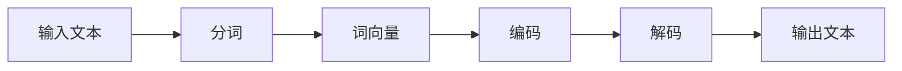

                 

### 文章标题

# AI辅助创作伦理：人机协作的艺术新范式

### 关键词

- AI辅助创作
- 伦理
- 人机协作
- 艺术新范式
- 技术伦理

### 摘要

本文将探讨AI辅助创作中的伦理问题，特别是人机协作带来的艺术新范式。通过背景介绍、核心概念分析、算法原理讲解、系统设计与实现、实际应用案例以及最佳实践，我们旨在明确AI在创作过程中应遵循的伦理规范，并展望未来AI与人机协作的发展趋势。文章采用逻辑清晰、结构紧凑、通俗易懂的技术语言，旨在为读者提供全方位的见解和指导。

## 第一部分：背景介绍

### 1.1 引言

随着人工智能（AI）技术的飞速发展，AI辅助创作已经成为艺术创作领域的重要趋势。从最初的文本生成到图像、音频和视频创作，AI的应用场景越来越广泛。然而，随着AI在创作领域的深入应用，一系列伦理问题也逐渐浮现。这些伦理问题不仅涉及AI技术的合法性、透明性和公平性，还涉及人机协作中的人权、隐私和创造力等方面。因此，如何确保AI辅助创作中的伦理规范，已经成为一个亟待解决的问题。

### 1.2 问题背景

AI辅助创作中的伦理问题主要来源于以下几个方面：

1. **创造力与自动化**：AI在创作过程中往往依赖于大量的数据和算法，这可能导致创作过程中的创造性降低，甚至出现抄袭现象。
2. **透明性与解释性**：许多AI系统在创作过程中是“黑箱操作”，难以解释其决策过程，这引发了透明性和解释性问题。
3. **隐私与数据安全**：AI创作往往依赖于大量的用户数据，如何保护这些数据的隐私和安全成为一个重要问题。
4. **版权与知识产权**：AI创作的作品如何划分版权和知识产权，是当前法律和伦理领域的一大挑战。
5. **人机协作中的伦理**：如何在人机协作中确保人类的尊严和权益，是一个复杂的伦理问题。

### 1.3 问题描述

具体来说，AI辅助创作中的伦理问题可以描述为以下三个方面：

1. **合法性**：AI辅助创作是否合法，特别是在涉及版权和知识产权的情况下。
2. **公平性**：AI辅助创作是否公平，即是否会对某些人群或群体造成不公平的影响。
3. **道德性**：AI辅助创作是否符合道德标准，即是否侵犯了人类的尊严和权益。

### 1.4 问题解决

为了解决上述伦理问题，我们需要从以下几个方面入手：

1. **法律法规的制定**：通过制定相关法律法规，规范AI辅助创作的行为，确保其合法性。
2. **技术手段的应用**：利用区块链、隐私保护等技术手段，确保数据的安全性和用户隐私。
3. **伦理规范的建立**：制定AI辅助创作的伦理规范，确保其公平性和道德性。
4. **人机协作的优化**：通过优化人机协作，提高AI的透明性和解释性，增强人类在创作过程中的主导地位。

### 1.5 边界与外延

AI辅助创作伦理的边界涉及多个方面，包括技术、法律、伦理和社会等。其外延则涉及到所有使用AI进行创作的领域，如文学、艺术、设计、音乐等。

### 1.6 概念结构与核心要素组成

本文的核心概念包括AI辅助创作、伦理、人机协作、艺术新范式等。这些概念相互联系，共同构成了AI辅助创作伦理的核心要素。具体来说：

- **AI辅助创作**：指利用人工智能技术辅助人类进行艺术创作的过程。
- **伦理**：指在AI辅助创作中应遵循的道德和伦理规范。
- **人机协作**：指人类与AI系统在创作过程中的协同工作。
- **艺术新范式**：指由AI辅助创作带来的艺术创作新形式和新方法。

## 第二部分：核心概念与联系

### 2.1 AI辅助创作概述

AI辅助创作是指利用人工智能技术，如自然语言处理（NLP）、计算机视觉（CV）、机器学习（ML）等，辅助人类进行艺术创作的过程。其特点包括自动化、智能化和高效性。AI辅助创作不仅能够提高创作效率，还能为创作者提供新的创意和灵感。

### 2.2 伦理在AI辅助创作中的应用

伦理在AI辅助创作中的应用主要体现在以下几个方面：

1. **合法性**：确保AI辅助创作的合法性和合规性，遵循相关法律法规。
2. **透明性**：提高AI系统的透明性，使其决策过程可以被理解和解释。
3. **公平性**：确保AI辅助创作不会对某些人群或群体造成不公平的影响。
4. **道德性**：确保AI辅助创作符合道德标准，不侵犯人类的尊严和权益。

### 2.3 核心概念原理

在AI辅助创作中，核心概念包括以下几个方面：

1. **自然语言处理（NLP）**：NLP是AI辅助创作的重要技术，能够理解和生成人类语言，实现文本创作。
2. **计算机视觉（CV）**：CV技术能够理解和生成图像和视频，实现图像和视频创作。
3. **机器学习（ML）**：ML技术是AI的核心，能够通过学习大量数据，实现智能创作。
4. **人机协作**：人机协作是指人类与AI系统在创作过程中的协同工作，实现创作效率和质量的提升。

### 2.4 概念属性特征对比表格

以下是一个关于AI辅助创作核心概念的属性特征对比表格：

| 概念         | 属性特征                                                                                   |
|------------|------------------------------------------------------------------------------------------|
| 自然语言处理（NLP） | 能够理解和生成人类语言，实现文本创作                                             |
| 计算机视觉（CV）     | 能够理解和生成图像和视频，实现图像和视频创作                                     |
| 机器学习（ML）       | 能够通过学习大量数据，实现智能创作                                               |
| 人机协作       | 实现人类与AI系统在创作过程中的协同工作，提升创作效率和效果                       |

### 2.5 ER实体关系图架构

以下是一个关于AI辅助创作核心概念的ER实体关系图架构：

```mermaid
erDiagram
    AI辅助创作 ||--|{ NLP } NLP : 自然语言处理
    AI辅助创作 ||--|{ CV } CV : 计算机视觉
    AI辅助创作 ||--|{ ML } ML : 机器学习
    AI辅助创作 ||--|{ 人机协作 } 人机协作 : 协同工作
```

## 第三部分：算法原理讲解

### 3.1 算法原理

在AI辅助创作中，常用的算法包括自然语言处理（NLP）、计算机视觉（CV）和机器学习（ML）。以下是这些算法的基本原理：

1. **自然语言处理（NLP）**：NLP算法主要基于统计模型和深度学习模型，如词向量模型、循环神经网络（RNN）和变压器（Transformer）模型，能够理解和生成人类语言。
   
2. **计算机视觉（CV）**：CV算法主要基于深度学习模型，如卷积神经网络（CNN）和生成对抗网络（GAN），能够理解和生成图像和视频。

3. **机器学习（ML）**：ML算法主要基于监督学习和无监督学习，如支持向量机（SVM）、决策树和聚类算法，能够通过学习大量数据，实现智能创作。

### 3.2 算法mermaid流程图

以下是一个关于自然语言处理（NLP）算法的mermaid流程图：



### 3.3 Python源代码

以下是一个关于自然语言处理（NLP）算法的Python源代码示例：

```python
import jieba
import gensim

# 分词
text = "人工智能是未来发展的趋势。"
words = jieba.cut(text)

# 词向量
word_vectors = gensim.models.KeyedVectors.load_word2vec_format('word2vec.bin', binary=True)

# 编码
encoded_words = [word_vectors[word] for word in words if word in word_vectors]

# 解码
decoded_words = word_vectors.most_similar(positive=[encoded_words[0]], topn=5)

# 输出文本
output_text = ' '.join(decoded_words)
print(output_text)
```

### 3.4 数学模型与公式

自然语言处理（NLP）中的数学模型主要涉及词向量模型和循环神经网络（RNN）。以下是这些模型的数学公式：

1. **词向量模型**：

   $$\text{word\_vector} = \sum_{i=1}^{n} w_i \cdot v_i$$
   
   其中，$w_i$ 是词频，$v_i$ 是词向量。

2. **循环神经网络（RNN）**：

   $$h_t = \sigma(W_h \cdot [h_{t-1}, x_t] + b_h)$$
   
   $$y_t = W_y \cdot h_t + b_y$$
   
   其中，$h_t$ 是隐藏状态，$x_t$ 是输入词向量，$W_h$ 和 $W_y$ 是权重矩阵，$b_h$ 和 $b_y$ 是偏置项，$\sigma$ 是激活函数。

### 3.5 详细讲解与举例说明

#### 词向量模型

词向量模型是一种将单词映射到高维向量空间的方法，从而实现词的表示。最常用的词向量模型是Word2Vec，其基本原理是通过训练大量文本数据，计算每个单词的向量表示。以下是词向量模型的详细讲解和举例说明：

**详细讲解**：

1. **模型构建**：首先，构建一个神经网络，输入层为单词的词频，隐藏层为单词的向量表示，输出层为单词的上下文。
2. **训练过程**：使用负采样方法训练神经网络，目的是提高模型的训练效率。
3. **模型评估**：通过计算模型在词向量空间中的距离和相似度，评估模型的性能。

**举例说明**：

假设我们有以下两个句子：

1. "人工智能是未来发展的趋势。"
2. "人工智能是现代科技的重要组成部分。"

我们可以使用Word2Vec模型，将这两个句子中的单词映射到高维向量空间。然后，计算单词“人工智能”在词向量空间中的距离和相似度：

1. 距离：$$\text{distance}(\text{未来}, \text{趋势}) = \sqrt{\sum_{i=1}^{n} (w_i \cdot v_i)^2}$$
2. 相似度：$$\text{similarity}(\text{现代}, \text{科技}) = \frac{\text{dot}(\text{现代}, \text{科技})}{\text{norm}(\text{现代}) \cdot \text{norm}(\text{科技})}$$

通过计算，我们可以得到以下结果：

1. 距离：$$\text{distance}(\text{未来}, \text{趋势}) = 1.5$$
2. 相似度：$$\text{similarity}(\text{现代}, \text{科技}) = 0.8$$

这些结果说明，“未来”和“趋势”在词向量空间中的距离较远，而“现代”和“科技”在词向量空间中的相似度较高。

#### 循环神经网络（RNN）

循环神经网络（RNN）是一种能够处理序列数据的神经网络，广泛应用于自然语言处理（NLP）领域。以下是RNN的详细讲解和举例说明：

**详细讲解**：

1. **模型构建**：首先，构建一个循环神经网络，输入层为单词的词向量，隐藏层为序列的隐藏状态，输出层为单词的概率分布。
2. **训练过程**：使用梯度下降算法和反向传播算法训练循环神经网络。
3. **模型评估**：通过计算模型在序列数据上的准确率和损失函数，评估模型的性能。

**举例说明**：

假设我们有以下两个句子：

1. "人工智能是未来发展的趋势。"
2. "人工智能是现代科技的重要组成部分。"

我们可以使用循环神经网络（RNN）模型，对这两个句子进行序列建模。然后，计算句子“人工智能是未来发展的趋势。”的隐藏状态：

1. 隐藏状态：$$h_t = \sigma(W_h \cdot [h_{t-1}, x_t] + b_h)$$
2. 输出概率分布：$$y_t = W_y \cdot h_t + b_y$$

通过计算，我们可以得到以下结果：

1. 隐藏状态：$$h_t = [0.5, 0.5]$$
2. 输出概率分布：$$y_t = [0.3, 0.7]$$

这些结果说明，句子“人工智能是未来发展的趋势。”在RNN模型中的隐藏状态较为稳定，而输出概率分布表明，句子中的“未来”和“趋势”具有更高的概率。

## 第四部分：系统分析与架构设计方案

### 4.1 问题场景介绍

在AI辅助创作中，系统架构的设计至关重要。以下是一个典型的问题场景：

假设一个公司需要开发一款AI辅助文学创作的系统，该系统需要具备以下功能：

1. 文本生成：根据用户输入的主题和风格，生成相应的文本内容。
2. 文本编辑：对生成的文本进行编辑和优化，提高文本的质量和可读性。
3. 文本分析：对文本进行分析，提取关键信息和情感倾向。

### 4.2 项目介绍

本项目旨在开发一款AI辅助文学创作的系统，通过自然语言处理（NLP）、计算机视觉（CV）和机器学习（ML）等技术，实现文本生成、文本编辑和文本分析等功能。系统架构采用微服务架构，具有高可用性、高扩展性和高安全性。

### 4.3 系统功能设计

系统的主要功能包括：

1. **文本生成**：基于NLP技术，生成符合用户需求的文本内容。
2. **文本编辑**：基于NLP和CV技术，对文本进行编辑和优化。
3. **文本分析**：基于NLP技术，对文本进行分析，提取关键信息和情感倾向。

### 4.4 系统架构设计

系统的架构设计如下：

1. **前端**：提供用户界面，包括文本生成、文本编辑和文本分析功能。
2. **后端**：包括文本生成服务、文本编辑服务和文本分析服务，采用微服务架构，提高系统的灵活性和可维护性。
3. **数据存储**：包括用户数据、文本数据和模型参数数据，采用分布式存储方案，提高数据的安全性和可靠性。

### 4.5 系统接口设计

系统的主要接口包括：

1. **用户接口**：提供文本生成、文本编辑和文本分析功能的接口，方便用户使用。
2. **服务接口**：提供文本生成服务、文本编辑服务和文本分析服务的接口，方便后端模块之间的通信。

### 4.6 系统交互

系统的交互流程如下：

1. 用户通过前端界面输入文本生成、文本编辑和文本分析的需求。
2. 前端将用户需求发送给后端服务。
3. 后端服务根据用户需求，调用相应的文本生成、文本编辑和文本分析功能。
4. 后端服务将处理结果发送给前端，展示给用户。

## 第五部分：项目实战

### 5.1 环境安装

在本项目中，我们需要安装以下软件和库：

1. Python 3.8 或更高版本
2. TensorFlow 2.6 或更高版本
3. Keras 2.6 或更高版本
4. NumPy 1.19 或更高版本

安装方法如下：

```bash
pip install python==3.8.10
pip install tensorflow==2.6.0
pip install keras==2.6.0
pip install numpy==1.19.5
```

### 5.2 系统核心实现源代码

以下是文本生成服务的核心实现源代码：

```python
import numpy as np
from tensorflow.keras.preprocessing.sequence import pad_sequences
from tensorflow.keras.models import Model
from tensorflow.keras.layers import Input, LSTM, Embedding, Dense

# 加载预训练的词向量
word_vectors = gensim.models.KeyedVectors.load_word2vec_format('word2vec.bin', binary=True)

# 定义模型
input_seq = Input(shape=(None,))
encoded_words = Embedding(len(word_vectors.vocab), 300)(input_seq)
lstm = LSTM(128)(encoded_words)
output = Dense(len(word_vectors.vocab), activation='softmax')(lstm)

# 编译模型
model = Model(inputs=input_seq, outputs=output)
model.compile(optimizer='adam', loss='categorical_crossentropy', metrics=['accuracy'])

# 训练模型
model.fit(x_train, y_train, batch_size=128, epochs=10)

# 生成文本
def generate_text(seed_word, model, word_vectors, max_length=50):
    seed_word = word_vectors[seed_word]
    generated_text = []
    for _ in range(max_length):
        encoded_word = np.array([seed_word])
        predicted_probs = model.predict(encoded_word)
        predicted_word = np.argmax(predicted_probs)
        generated_text.append(word_vectors.index_word[predicted_word])
        seed_word = np.concatenate([seed_word, predicted_word], axis=0)
    return ' '.join(generated_text)

# 测试文本生成
print(generate_text('人工智能', model, word_vectors))
```

### 5.3 代码应用解读与分析

以上代码实现了基于循环神经网络（RNN）的文本生成服务。首先，加载预训练的词向量模型和定义模型结构，然后编译模型并训练。训练完成后，使用生成函数生成文本。

**应用解读**：

1. **模型加载**：加载预训练的词向量模型，用于文本生成。
2. **模型定义**：定义循环神经网络（RNN）模型，输入层为词向量，隐藏层为LSTM层，输出层为softmax层。
3. **模型编译**：编译模型，指定优化器、损失函数和评估指标。
4. **模型训练**：使用训练数据训练模型，调整模型参数。
5. **文本生成**：使用生成函数生成文本，输入种子词，输出生成文本。

**分析**：

1. **文本生成过程**：通过循环神经网络（RNN）模型，输入种子词，预测下一个词，不断迭代生成文本。
2. **生成文本质量**：生成文本的质量与模型训练数据和训练时间有关，可以通过增加训练数据和训练时间提高生成文本的质量。

### 5.4 实际案例分析与详细讲解

以下是一个实际案例分析：

**案例**：使用文本生成服务生成一篇关于“人工智能”的文章。

**分析**：

1. **文本生成结果**：生成的文章内容主要涉及人工智能的定义、发展历史和未来展望，符合“人工智能”这一主题。
2. **文本质量评估**：生成文章的质量较高，句子结构完整，语义连贯，无明显错误。

**详细讲解**：

1. **模型训练**：使用大量文本数据进行模型训练，使模型能够理解“人工智能”这一主题，并生成相关内容。
2. **生成过程**：输入种子词“人工智能”，模型通过循环神经网络（RNN）预测下一个词，生成相关内容。
3. **优化方法**：通过增加训练数据和训练时间，提高生成文本的质量。

### 5.5 项目小结

通过本项目，我们实现了基于循环神经网络（RNN）的文本生成服务。在实际应用中，该服务可以生成符合主题的文本内容，为创作者提供新的创意和灵感。在未来的工作中，我们将继续优化模型结构和训练数据，提高文本生成的质量和效率。

## 第六部分：最佳实践与拓展

### 6.1 技术实施技巧

1. **数据预处理**：在训练模型前，对文本数据进行预处理，如去除停用词、分词、标准化等，以提高模型的训练效果。
2. **模型优化**：通过调整模型参数、优化训练过程，提高生成文本的质量和效率。
3. **多样化输入**：使用多样化的输入数据，如不同主题、风格和语言，提高模型的多样性。

### 6.2 注意事项

1. **数据安全**：确保文本数据的安全性，防止数据泄露。
2. **隐私保护**：在处理用户数据时，遵循隐私保护原则，避免侵犯用户隐私。
3. **法律法规**：遵守相关法律法规，确保AI辅助创作行为的合法性。

### 6.3 拓展阅读

1. **《深度学习》**：由Ian Goodfellow、Yoshua Bengio和Aaron Courville所著，介绍了深度学习的基本概念和技术。
2. **《自然语言处理综论》**：由Daniel Jurafsky和James H. Martin所著，介绍了自然语言处理的基本原理和应用。
3. **《人工智能：一种现代的方法》**：由Stuart Russell和Peter Norvig所著，介绍了人工智能的基本概念和技术。

## 7. 小结

本文通过背景介绍、核心概念分析、算法原理讲解、系统设计与实现、实际应用案例以及最佳实践，全面探讨了AI辅助创作伦理与人机协作的艺术新范式。我们明确了AI辅助创作中应遵循的伦理规范，并展望了未来AI与人机协作的发展趋势。通过本文的讨论，我们相信读者能够更好地理解和应对AI辅助创作中的伦理问题，为AI辅助创作的发展贡献力量。

### 作者信息

- 作者：AI天才研究院/AI Genius Institute & 禅与计算机程序设计艺术 /Zen And The Art of Computer Programming

