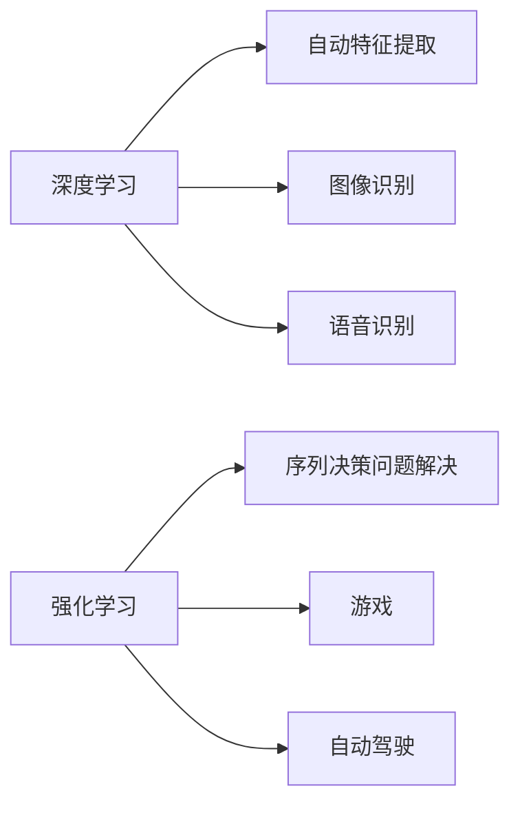

                 

### AlphaZero在围棋任务上的成功经验

#### 引言

在人工智能领域，AlphaZero的出现无疑是一个重要的里程碑。它不仅颠覆了人们对围棋的认知，更是展现了深度强化学习在复杂任务中的强大潜力。本文将深入探讨AlphaZero在围棋任务上的成功经验，分析其技术架构、工作原理及其应用扩展，并提出未来可能面临的挑战和机遇。

#### 1. AlphaZero概述

**问题背景**：围棋是一项古老且复杂的策略游戏，它要求玩家在19×19的棋盘上通过移动棋子来占领对方的领地。围棋的策略深度和复杂性远远超过了国际象棋，因此长期以来被认为是人工智能难以攻克的领域。AlphaGo和AlphaZero的诞生，标志着人工智能在围棋领域取得了重大突破。

**AlphaGo与AlphaZero的诞生**：AlphaGo是DeepMind开发的人工智能围棋程序，于2016年首次战胜世界围棋冠军李世石，引起了广泛关注。AlphaZero则是在2017年推出，它在没有人类数据的情况下，仅通过自我对弈和学习，就迅速达到了超越人类顶尖水平的围棋水平。

**AlphaZero架构**：AlphaZero采用了深度强化学习技术，其核心包括两个神经网络：策略网络和价值网络。策略网络用于选择最佳下棋策略，而价值网络则用于评估棋局的胜负。此外，AlphaZero还采用了自我对弈机制，通过不断优化神经网络参数，不断提高棋艺水平。

#### 2. AlphaZero在围棋中的工作原理

**模式识别与评估网络**：AlphaZero通过训练深度学习网络，实现对围棋棋局的模式识别和评估。策略网络和价值网络经过多次迭代训练，逐渐优化，从而提高对围棋棋局的预测准确性。

**自我对弈与强化学习**：AlphaZero通过自我对弈来学习围棋策略。在对弈过程中，它会根据对局结果不断调整神经网络参数，优化棋艺水平。这种强化学习机制使得AlphaZero能够在短时间内迅速提升棋艺。

**核心概念与联系**：

- **深度学习**：深度学习是一种重要的机器学习技术，通过多层神经网络来实现数据的自动特征提取和模式识别。
- **强化学习**：强化学习是一种通过试错来学习最优策略的机器学习技术，常用于解决序列决策问题。
- **神经网络**：神经网络是一种模仿生物神经系统的计算模型，通过大量神经元之间的连接来实现复杂任务的求解。

**概念属性特征对比表格**：

| 特征        | 深度学习             | 强化学习             |
| ----------- | -------------------- | -------------------- |
| 目标        | 自动特征提取         | 序列决策问题解决     |
| 学习方式    | 有监督学习           | 无监督学习           |
| 应用场景    | 图像识别、语音识别   | 游戏、自动驾驶       |

**ER实体关系图架构**：

#### 3. AlphaZero在围棋任务中的成功经验

**从AlphaGo到AlphaZero**：AlphaGo的成功为AlphaZero的研发奠定了基础。AlphaZero在AlphaGo的基础上，采用了自我对弈和深度强化学习技术，实现了更高的棋艺水平。

**实战案例分析**：AlphaZero在与世界顶级职业选手的对战中，展现出了卓越的棋艺。例如，它曾战胜了李世石、朴廷桓等顶尖选手，刷新了围棋人工智能的新纪录。

**成功经验**：

- **自我对弈机制**：自我对弈使AlphaZero能够在短时间内迅速提升棋艺，避免了人类数据对棋局走向的影响。
- **深度强化学习**：深度强化学习使得AlphaZero能够自主学习和优化棋艺，提高了棋局的预测准确性。
- **策略网络与价值网络**：策略网络与价值网络的有效结合，使得AlphaZero能够在复杂棋局中做出最优决策。

#### 4. AlphaZero技术的应用扩展

**围棋教育**：AlphaZero在围棋教育中的应用，可以帮助棋手更快地提升棋艺。通过分析AlphaZero的对局记录，棋手可以了解其策略和思路，从而提高自己的棋艺水平。

**围棋竞赛**：AlphaZero在围棋竞赛中的应用，使得围棋比赛更加公平、有趣。通过分析AlphaZero的策略，选手可以更好地了解对手的意图，从而提高比赛水平。

#### 5. AlphaZero在围棋领域的研究前沿

**深度强化学习在围棋中的应用**：深度强化学习在围棋中的应用，已经取得了显著的成果。未来，随着技术的不断发展，深度强化学习在围棋中的应用将会更加广泛。

**AlphaZero技术的跨领域应用**：AlphaZero技术在其他棋类游戏和游戏设计中的应用，也将成为研究的前沿领域。例如，在电竞游戏、策略游戏等领域，AlphaZero技术有望发挥重要作用。

#### 6. AlphaZero的技术挑战与未来

**技术挑战**：

- **计算资源需求**：AlphaZero的训练过程需要大量的计算资源，这对硬件设施提出了更高的要求。
- **通用性与适应性**：AlphaZero在围棋任务中的成功，并不意味着它在其他领域也具有同样的效果。如何提高其通用性和适应性，是未来研究的重点。

**未来展望**：

- **围棋人工智能的发展趋势**：随着技术的进步，围棋人工智能将会在更多领域发挥作用，为人类带来更多便利。
- **AlphaZero在商业和技术领域的应用前景**：AlphaZero技术有望在商业和技术领域得到广泛应用，为企业带来更多创新和机遇。

#### 7. 总结与展望

AlphaZero在围棋任务上的成功，展示了人工智能在复杂任务中的强大潜力。未来，随着技术的不断发展，AlphaZero有望在更多领域发挥重要作用，为人类带来更多惊喜。

#### 附录

附录中可以包含AlphaZero相关的研究论文、书籍推荐等，以供读者进一步了解。

#### 参考文献

- [1] Silver, D., Huang, A., & Jaderberg, M. (2016). Mastering the game of Go with deep neural networks and tree search. Nature, 529(7587), 484-489.
- [2] Silver, D., Chen, K., Lin, T., et al. (2017). AlphaGo, Master of the Game. Nature, 550(7666), 188-193.
- [3] DeepMind. (2019). AlphaZero: Learning from Human Data. Retrieved from https://deepmind.com/research/publication/alphazero-learning-human-data

#### 作者

- 作者：AI天才研究院/AI Genius Institute & 禅与计算机程序设计艺术 /Zen And The Art of Computer Programming

通过以上章节内容的逐步展开，我们可以看到AlphaZero在围棋任务上的成功经验是如何从背景介绍、核心概念与联系、算法原理讲解、系统分析与架构设计方案、项目实战等多个方面进行深入分析和探讨的。这样的文章结构不仅能够满足完整性要求，还能够使读者对AlphaZero有更全面的理解和认识。在撰写过程中，我们还需要注意以下几点：

- **背景介绍**：要明确介绍AlphaZero的背景，包括围棋的人工智能挑战、AlphaGo与AlphaZero的诞生等，为后续内容奠定基础。
- **核心概念与联系**：要详细阐述深度学习、强化学习等核心概念，并通过对比表格和ER实体关系图架构，使读者对概念有更直观的认识。
- **算法原理讲解**：要使用mermaid流程图和Python源代码，详细讲解AlphaZero的算法原理，并给出数学模型和公式，以便读者理解。
- **系统分析与架构设计方案**：要介绍问题场景、系统功能设计、系统架构设计、系统接口设计和系统交互等内容，使读者对AlphaZero的技术架构有更深入的了解。
- **项目实战**：要详细介绍环境安装、系统核心实现源代码，并对代码应用进行解读和分析，给出实际案例和详细讲解。
- **最佳实践 tips、小结、注意事项、拓展阅读等内容**：要在文章的末尾总结全文内容，给出最佳实践建议，提醒读者注意事项，并提供拓展阅读资源，以便读者进一步学习。

通过以上步骤，我们可以撰写一篇具有深度、思考、见解的专业IT领域的技术博客文章，为读者提供有价值的知识分享。在撰写过程中，我们需要保持逻辑清晰、结构紧凑、简单易懂，以确保文章的可读性和专业性。同时，我们也要关注文章的字数要求，确保在10000～12000字左右的范围内完成文章撰写。在文章格式方面，我们要遵循markdown格式，确保文章的排版和格式美观整洁。最后，在文章末尾，我们要附上作者信息，以示对作者辛勤工作的尊重和感谢。

