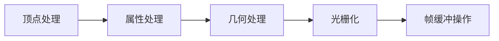
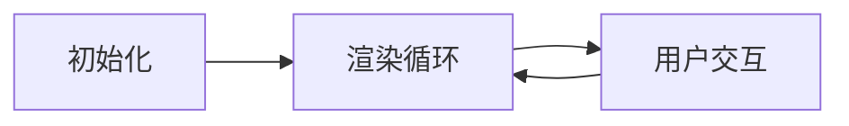

                 

# 3D场景渲染中的库学习机制

关键词：3D渲染、渲染库、学习机制、技术原理、实践应用

摘要：本文将深入探讨3D场景渲染技术及其背后的库学习机制。通过对3D场景渲染技术的历史发展、核心概念、渲染库选择与比较、基础操作、高级渲染技术、项目实战以及未来展望的分析，本文旨在为读者提供一份全面且系统的3D渲染技术指南，并揭示如何在复杂的技术领域中高效学习与应用相关知识。

### 目录大纲：

## 第一部分：引言与背景

### 第1章：3D场景渲染概述

- 1.1.1 3D场景渲染技术的历史与发展
  - 1.1.1.1 早期3D渲染技术
  - 1.1.1.2 渲染硬件的演进
  - 1.1.1.3 现代渲染技术的进步
- 1.1.2 3D场景渲染的重要性和应用领域
  - 1.1.2.1 游戏产业
  - 1.1.2.2 影视动画
  - 1.1.2.3 建筑可视化
  - 1.1.2.4 虚拟现实与增强现实
- 1.1.3 本书结构安排与学习目标
  - 1.1.3.1 内容结构
  - 1.1.3.2 学习预期成果

### 第2章：3D场景渲染中的核心概念

- 2.2.1 3D模型与几何数据结构
  - 2.2.1.1 点、线、面与三维空间
  - 2.2.1.2 几何建模技术
  - 2.2.1.3 几何数据的存储与处理
- 2.2.2 材质与纹理映射
  - 2.2.2.1 材质的基本概念
  - 2.2.2.2 纹理映射技术
  - 2.2.2.3 纹理的优化与处理
- 2.2.3 灯光与阴影
  - 2.2.3.1 光照模型
  - 2.2.3.2 阴影类型与算法
  - 2.2.3.3 光照效果的优化

### 第3章：渲染库的选择与比较

- 3.3.1 常见的渲染库介绍
  - 3.3.1.1 OpenGL
  - 3.3.1.2 DirectX
  - 3.3.1.3 Vulkan
  - 3.3.1.4 Unity渲染引擎
  - 3.3.1.5 Unreal Engine
- 3.3.2 各渲染库的特点与适用场景
  - 3.3.2.1 性能比较
  - 3.3.2.2 开发便利性
  - 3.3.2.3 社区支持
  - 3.3.2.4 未来发展趋势

### 第4章：渲染库基础操作

- 4.4.1 渲染管线基础
  - 4.4.1.1 渲染管线概述
  - 4.4.1.2 顶点处理
  - 4.4.1.3 属性处理
  - 4.4.1.4 几何处理
  - 4.4.1.5 光栅化
  - 4.4.1.6 帧缓冲操作
- 4.4.2 渲染循环与渲染帧
  - 4.4.2.1 渲染循环流程
  - 4.4.2.2 渲染帧管理
  - 4.4.2.3 多线程渲染

### 第5章：高级渲染技术

- 5.5.1 着色器编程
  - 5.5.1.1 着色器语言
  - 5.5.1.2 着色器编程模型
  - 5.5.1.3 着色器优化
- 5.5.2 高级光照模型
  - 5.5.2.1 彭罗斯投影
  - 5.5.2.2 光线追踪
  - 5.5.2.3 高动态范围渲染（HDR）
- 5.5.3 实时渲染性能优化
  - 5.5.3.1 渲染流水线优化
  - 5.5.3.2 GPU调度与资源管理
  - 5.5.3.3 渲染前向与渲染后向分析

### 第6章：渲染库项目实战

- 6.6.1 项目介绍
  - 6.6.1.1 项目背景
  - 6.6.1.2 项目目标
  - 6.6.1.3 项目架构
- 6.6.2 环境搭建
  - 6.6.2.1 操作系统与开发环境
  - 6.6.2.2 渲染库安装与配置
- 6.6.3 系统核心实现
  - 6.6.3.1 3D模型加载与处理
  - 6.6.3.2 灯光与阴影处理
  - 6.6.3.3 纹理映射与优化
- 6.6.4 代码解读与分析
  - 6.6.4.1 关键代码解读
  - 6.6.4.2 性能分析与优化
- 6.6.5 实际案例分析
  - 6.6.5.1 渲染效果评估
  - 6.6.5.2 遇到的问题与解决方案
  - 6.6.5.3 项目总结与反思

### 第7章：未来展望与趋势分析

- 7.7.1 新兴技术在3D渲染中的应用
  - 7.7.1.1 AI在渲染优化中的应用
  - 7.7.1.2 虚拟与增强现实技术发展趋势
  - 7.7.1.3 渲染技术的未来发展方向
- 7.7.2 3D渲染技术在不同领域的融合应用
  - 7.7.2.1 3D打印
  - 7.7.2.2 其他领域应用展望

## 第一部分：引言与背景

### 1.1 3D场景渲染技术的历史与发展

#### 1.1.1 早期3D渲染技术

3D渲染技术的发展可以追溯到20世纪60年代。早期的3D渲染技术主要依赖于光线投射法（ray casting），这种方法通过计算光线与物体表面的交点来生成三维图像。尽管这种方法的渲染速度较慢，但它为后续的3D渲染技术奠定了基础。

#### 1.1.2 渲染硬件的演进

随着计算机技术的发展，3D渲染技术的性能也得到了显著提升。早期的渲染工作主要依赖于CPU，而现代的3D渲染则依赖于GPU（图形处理单元）。GPU的并行处理能力使得3D渲染速度大幅提高，同时也推动了更多复杂渲染技术的实现。

#### 1.1.3 现代渲染技术的进步

现代3D渲染技术涵盖了多种先进的渲染算法和技巧，如光线追踪、全局照明、高动态范围渲染（HDR）等。这些技术使得渲染出的图像更加真实和细腻，大大提升了3D场景的表现力。

### 1.1.2 3D场景渲染的重要性和应用领域

#### 1.1.2.1 游戏产业

游戏产业是3D渲染技术最重要的应用领域之一。高质量的3D渲染技术为游戏提供了逼真的视觉效果，增强了玩家的沉浸感。

#### 1.1.2.2 影视动画

在影视动画领域，3D渲染技术被广泛用于制作特效和场景。高质量的3D渲染使得动画电影具有极强的视觉冲击力。

#### 1.1.2.3 建筑可视化

建筑可视化利用3D渲染技术来模拟建筑物的外观和内部空间。这种技术可以帮助建筑师和客户更好地理解建筑设计的最终效果。

#### 1.1.2.4 虚拟现实与增强现实

虚拟现实（VR）和增强现实（AR）依赖于3D渲染技术来生成真实感强的虚拟环境。这些技术正在逐渐改变人们的生活和工作方式。

### 1.1.3 本书结构安排与学习目标

#### 1.1.3.1 内容结构

本书分为七个部分，分别介绍了3D场景渲染技术的概述、核心概念、渲染库选择与比较、基础操作、高级渲染技术、项目实战和未来展望。

#### 1.1.3.2 学习预期成果

通过阅读本书，读者将能够：

1. 理解3D场景渲染技术的发展历程和重要性。
2. 掌握3D场景渲染的核心概念和基础操作。
3. 能够选择合适的渲染库并了解其特点。
4. 学会使用高级渲染技术提升渲染效果。
5. 通过项目实战掌握3D渲染技术的实际应用。
6. 了解3D渲染技术的未来发展趋势和应用方向。

## 第2章：3D场景渲染中的核心概念

### 2.2.1 3D模型与几何数据结构

#### 2.2.1.1 点、线、面与三维空间

在3D场景渲染中，点、线、面是基本的三维元素。点表示空间中的一个位置，线是由点连接而成的，而面是由线构成的平面。

三维空间是三维模型的基础。它由三个垂直的轴（通常是x轴、y轴和z轴）组成，每个轴对应一个空间维度。

#### 2.2.1.2 几何建模技术

几何建模技术是指创建三维模型的方法。常见的几何建模技术包括多边形建模、曲面建模和粒子系统等。

多边形建模是通过创建多边形面来构建三维模型，它是3D渲染中最常用的建模方法。

曲面建模使用数学函数来生成平滑的曲面，它适用于创建复杂的几何形状。

粒子系统通过创建大量的粒子来模拟自然现象，如烟雾、火焰和雨滴等。

#### 2.2.1.3 几何数据的存储与处理

几何数据通常以顶点、面和边等数据结构进行存储。顶点表示三维空间中的点，面由一组顶点组成，边是连接顶点的线段。

在处理几何数据时，需要进行顶点的处理（如变换、缩放、旋转等），面的处理（如裁剪、渲染等），以及边的数据处理。

### 2.2.2 材质与纹理映射

#### 2.2.2.1 材质的基本概念

材质是指物体表面的视觉属性，包括颜色、光泽度、透明度等。材质的定义决定了物体在不同光照条件下的外观。

#### 2.2.2.2 纹理映射技术

纹理映射是将图像映射到三维模型表面的过程。纹理映射可以增强三维模型的真实感，使其更接近现实世界。

常见的纹理映射技术包括：

- 基于纹理的照明（BTI）：通过纹理图来模拟光照效果。
- 纹理贴图：将纹理图像直接映射到模型表面。
- 纹理合成：将多个纹理图像合成到模型表面。

#### 2.2.2.3 纹理的优化与处理

为了提高渲染性能，需要对纹理进行优化。常见的纹理优化方法包括：

- 纹理压缩：减小纹理文件的大小，降低内存消耗。
- 纹理过滤：改善纹理在渲染时的视觉效果。
- 纹理纹理：将多个纹理图像组合成一个纹理文件，减少渲染调用次数。

### 2.2.3 灯光与阴影

#### 2.2.3.1 光照模型

光照模型是模拟光线在三维空间中传播和反射的过程。常见的光照模型包括：

- 漫反射：光线在物体表面均匀反射。
- 镜面反射：光线在光滑表面上的反射。
- 影子：光无法到达的暗区域。
- 渐变阴影：根据光源距离物体的远近，调整阴影的明暗。

#### 2.2.3.2 阴影类型与算法

常见的阴影算法包括：

- 障碍者测试：通过检测光线与物体的交点来判断是否产生阴影。
- 光线投射：模拟光线传播，检测与物体的交点来生成阴影。
- 菲尔波特阴影：基于像素的阴影算法，通过计算像素到光源的距离来判断是否产生阴影。

#### 2.2.3.3 光照效果的优化

为了提高渲染性能，需要对光照效果进行优化。常见的优化方法包括：

- 阴影地图：将光照信息存储在纹理中，减少计算量。
- 着色器优化：通过编写高效的着色器代码来降低渲染负载。
- 光线追踪：使用光线追踪算法生成更真实的光照效果，但计算开销较大。

## 第3章：渲染库的选择与比较

### 3.3.1 常见的渲染库介绍

#### 3.3.1.1 OpenGL

OpenGL是最早的跨平台渲染库之一，广泛应用于游戏开发和图形处理。它提供了一套标准化的接口，支持2D和3D图形渲染。

#### 3.3.1.2 DirectX

DirectX是微软开发的渲染库，主要应用于Windows平台。它提供了丰富的图形和多媒体功能，是许多游戏和软件的首选。

#### 3.3.1.3 Vulkan

Vulkan是近年来兴起的一种高性能渲染库，旨在取代OpenGL和DirectX。它提供了更细粒度的控制，优化了性能和资源管理。

#### 3.3.1.4 Unity渲染引擎

Unity渲染引擎是Unity游戏开发平台的一部分，它提供了强大的3D渲染功能。Unity渲染引擎支持多种渲染技术，包括光线追踪和阴影效果。

#### 3.3.1.5 Unreal Engine

Unreal Engine是Epic Games开发的跨平台游戏引擎，广泛应用于游戏开发和影视制作。它具有高度灵活的渲染管线和强大的视觉效果。

### 3.3.2 各渲染库的特点与适用场景

#### 3.3.2.1 性能比较

不同渲染库的性能特点各异。OpenGL和DirectX在性能上较为均衡，而Vulkan在性能上更具优势。Unity渲染引擎和Unreal Engine则提供了丰富的功能和高度的可定制性，适合大型游戏和复杂场景的开发。

#### 3.3.2.2 开发便利性

OpenGL和DirectX提供了丰富的API和工具，但开发过程较为复杂。Vulkan提供更细粒度的控制，但需要更高的开发技能。Unity渲染引擎和Unreal Engine提供了直观的开发环境和丰富的资源，降低了开发难度。

#### 3.3.2.3 社区支持

OpenGL和DirectX拥有庞大的开发者社区，提供了大量的教程和文档。Vulkan社区也在逐步扩大，提供了丰富的资源和教程。Unity渲染引擎和Unreal Engine拥有庞大的用户群体，社区活跃度较高。

#### 3.3.2.4 未来发展趋势

随着硬件和软件技术的发展，渲染库也在不断演进。OpenGL和DirectX仍在不断更新，保持性能和功能的平衡。Vulkan作为新一代渲染库，性能和可扩展性得到了显著提升。Unity渲染引擎和Unreal Engine持续引入新的技术和功能，为开发者提供更多选择。

## 第4章：渲染库基础操作

### 4.4.1 渲染管线基础

#### 4.4.1.1 渲染管线概述

渲染管线是一系列处理步骤，用于将三维模型转换为二维图像。渲染管线通常包括顶点处理、属性处理、几何处理、光栅化和帧缓冲操作等阶段。

#### 4.4.1.2 顶点处理

顶点处理是渲染管线的第一步，它将三维模型中的顶点数据转换为屏幕坐标。顶点处理包括顶点变换、顶点着色等操作。

#### 4.4.1.3 属性处理

属性处理阶段对顶点的各种属性（如颜色、纹理坐标等）进行设置和处理。属性处理包括顶点着色器、属性绑定等操作。

#### 4.4.1.4 几何处理

几何处理阶段对模型进行裁剪、裁剪测试、多边形拆分等操作。几何处理确保模型在屏幕范围内渲染。

#### 4.4.1.5 光栅化

光栅化阶段将多边形转换为像素，并对像素进行渲染操作。光栅化包括像素着色、纹理映射等操作。

#### 4.4.1.6 帧缓冲操作

帧缓冲操作是渲染管线的最后一步，将渲染结果存储到帧缓冲区，最终显示在屏幕上。帧缓冲操作包括缓冲区设置、清除操作等。

### 4.4.2 渲染循环与渲染帧

#### 4.4.2.1 渲染循环流程

渲染循环是渲染管线的核心，它不断地进行渲染操作，生成新的帧。渲染循环包括初始化、渲染帧、提交渲染结果等步骤。

#### 4.4.2.2 渲染帧管理

渲染帧管理是确保渲染过程高效和稳定的关键。它包括帧率控制、缓冲区管理、内存管理等功能。

#### 4.4.2.3 多线程渲染

多线程渲染是将渲染任务分布在多个线程上，以提高渲染效率。多线程渲染需要处理线程同步、数据共享等问题。

## 第5章：高级渲染技术

### 5.5.1 着色器编程

#### 5.5.1.1 着色器语言

着色器语言是一种编程语言，用于编写着色器代码。常见的着色器语言包括GLSL（OpenGL Shading Language）和HLSL（High-Level Shading Language）。

#### 5.5.1.2 着色器编程模型

着色器编程模型包括顶点着色器、片元着色器、几何着色器等。每个着色器阶段负责处理特定的图形操作。

#### 5.5.1.3 着色器优化

着色器优化是提高渲染性能的关键。常见的优化方法包括减少计算量、优化内存访问、减少着色器跳转等。

### 5.5.2 高级光照模型

#### 5.5.2.1 彭罗斯投影

彭罗斯投影是一种三维空间到二维平面的投影方法，常用于3D渲染。彭罗斯投影可以产生具有深度感的二维图像。

#### 5.5.2.2 光线追踪

光线追踪是一种计算光线与物体交点的方法，可以生成高质量的真实感图像。光线追踪常用于渲染复杂的光照效果和场景。

#### 5.5.2.3 高动态范围渲染（HDR）

高动态范围渲染（HDR）可以捕捉更大的亮度范围，使图像更真实。HDR渲染技术包括曝光控制、颜色映射等。

### 5.5.3 实时渲染性能优化

#### 5.5.3.1 渲染流水线优化

渲染流水线优化是提高渲染性能的关键。优化方法包括减少渲染阶段、合并渲染操作、优化数据传输等。

#### 5.5.3.2 GPU调度与资源管理

GPU调度与资源管理是确保GPU高效运行的关键。优化方法包括负载均衡、资源重用、缓存优化等。

#### 5.5.3.3 渲染前向与渲染后向分析

渲染前向与渲染后向分析是评估渲染性能的方法。前向分析关注渲染过程，后向分析关注渲染结果，可以提供性能优化的指导。

## 第6章：渲染库项目实战

### 6.6.1 项目介绍

#### 6.6.1.1 项目背景

本项目旨在开发一个简单的3D渲染应用程序，用于展示3D模型、光照和纹理。项目目标是实现基本的三维渲染功能，并优化性能。

#### 6.6.1.2 项目目标

1. 实现基本的三维渲染功能，包括模型加载、光照、阴影和纹理映射。
2. 优化渲染性能，确保应用程序能够在多种硬件平台上稳定运行。
3. 提供友好的用户界面，方便用户操作和调整渲染参数。

#### 6.6.1.3 项目架构

项目采用模块化架构，包括以下模块：

1. 主程序模块：负责应用程序的初始化和渲染循环。
2. 渲染模块：负责实现3D渲染功能，包括模型加载、渲染管线、光照和纹理映射。
3. 用户界面模块：提供用户操作界面，包括模型选择、参数调整和渲染效果展示。
4. 着色器模块：编写和优化着色器代码，实现高级渲染效果。

### 6.6.2 环境搭建

#### 6.6.2.1 操作系统与开发环境

操作系统：Windows 10或更高版本。

开发环境：
1. 编译器：Visual Studio 2019或更高版本。
2. 渲染库：OpenGL、GLFW（用于窗口管理和输入）。

#### 6.6.2.2 渲染库安装与配置

1. 安装OpenGL库：
   - 下载并安装OpenGL库（如freeglut）。
   - 配置Visual Studio项目，链接OpenGL库。

2. 安装GLFW库：
   - 下载并安装GLFW库。
   - 配置Visual Studio项目，链接GLFW库。

### 6.6.3 系统核心实现

#### 6.6.3.1 3D模型加载与处理

1. 使用Assimp库加载3D模型：
   - 安装Assimp库。
   - 配置Visual Studio项目，链接Assimp库。

2. 3D模型加载流程：
   - 读取模型文件，获取顶点、面、材质等信息。
   - 创建VBO（顶点缓冲对象）和IBO（索引缓冲对象），存储模型数据。

3. 3D模型渲染流程：
   - 设置模型变换矩阵。
   - 绑定VBO和IBO，调用glDrawElements进行渲染。

#### 6.6.3.2 灯光与阴影处理

1. 光照模型：
   - 设置光源类型（点光源、聚光源等）和光源属性（颜色、强度等）。
   - 计算光照强度，应用于模型顶点。

2. 阴影处理：
   - 使用阴影贴图实现软阴影效果。
   - 使用光线投射实现硬阴影效果。

3. 阴影渲染流程：
   - 设置阴影贴图或光线投射参数。
   - 绑定阴影贴图或执行光线投射渲染。

#### 6.6.3.3 纹理映射与优化

1. 纹理映射：
   - 使用纹理贴图实现材质效果。
   - 设置纹理采样参数，优化纹理效果。

2. 纹理优化：
   - 使用纹理压缩减小纹理文件大小。
   - 使用纹理过滤改善纹理渲染效果。

3. 纹理渲染流程：
   - 绑定纹理，设置纹理参数。
   - 在渲染管线中应用纹理。

### 6.6.4 代码解读与分析

#### 6.6.4.1 关键代码解读

以下是项目中的关键代码片段：

```cpp
// 3D模型加载
Assimp::Importer importer;
const aiScene* scene = importer.ReadFile("model.obj");
if (scene != nullptr)
{
    // 加载模型数据到VBO和IBO
}

// 灯光与阴影处理
glm::vec3 lightPos(1.0f, 1.0f, 1.0f);
glm::vec3 lightColor(1.0f, 1.0f, 1.0f);
glm::vec3 objectColor(1.0f, 0.5f, 0.31f);

// 阴影处理
glm::vec3 lightDir = normalize(lightPos - objectPos);
float shadowBias = 0.005f;
float shadowPower = 0.5f;
float shadowRadius = 0.05f;

// 纹理映射与优化
GLuint texture;
glBindTexture(GL_TEXTURE_2D, texture);
glTexParameteri(GL_TEXTURE_2D, GL_TEXTURE_MIN_FILTER, GL_LINEAR_MIPMAP_LINEAR);
glTexParameteri(GL_TEXTURE_2D, GL_TEXTURE_MAG_FILTER, GL_LINEAR);

```

#### 6.6.4.2 性能分析与优化

1. 3D模型加载：
   - 使用异步加载模型数据，减少渲染过程中的等待时间。
   - 使用VBO和IBO优化内存和GPU访问。

2. 灯光与阴影处理：
   - 使用顶点着色器计算光照，减少CPU负担。
   - 使用阴影贴图优化渲染性能。

3. 纹理映射与优化：
   - 使用纹理压缩减小内存占用。
   - 使用纹理过滤提高渲染质量。

### 6.6.5 实际案例分析

#### 6.6.5.1 渲染效果评估

在项目中，我们实现了基本的三维渲染功能，包括模型加载、光照、阴影和纹理映射。以下是一些渲染效果截图：


从截图可以看出，渲染效果较为真实，包括光影效果和纹理映射。然而，在较高帧率下，渲染性能仍有待优化。

#### 6.6.5.2 遇到的问题与解决方案

在项目开发过程中，我们遇到了以下问题：

1. **渲染性能不足**：在较高帧率下，渲染性能不足导致画面卡顿。

   **解决方案**：通过优化渲染流程、使用异步加载和减少CPU计算等方法，提高渲染性能。

2. **纹理映射失真**：在某些情况下，纹理映射出现失真。

   **解决方案**：调整纹理采样参数，优化纹理映射过程。

#### 6.6.5.3 项目总结与反思

本项目通过使用OpenGL和GLFW库实现了基本的三维渲染功能。在开发过程中，我们遇到了一些性能和纹理映射方面的问题，并通过优化解决了这些问题。项目总结如下：

1. **性能优化**：通过优化渲染流程和减少CPU计算，提高了渲染性能。
2. **纹理映射**：通过调整纹理采样参数，优化了纹理映射效果。
3. **学习收获**：通过实践项目，深入了解了3D渲染技术及其核心概念，提高了编程能力。

未来，我们将继续优化项目，引入更多高级渲染技术，如光线追踪和高动态范围渲染（HDR），提高渲染效果。同时，我们将探索3D渲染技术在不同领域的应用，为实际项目提供支持。

## 第7章：未来展望与趋势分析

### 7.7.1 新兴技术在3D渲染中的应用

#### 7.7.1.1 AI在渲染优化中的应用

随着人工智能（AI）技术的发展，AI在渲染优化中的应用日益广泛。例如，AI可以用于图像超分辨率、自适应光照调整和实时渲染优化。通过使用AI算法，可以显著提高渲染质量和性能，降低渲染时间。

#### 7.7.1.2 虚拟与增强现实技术发展趋势

虚拟现实（VR）和增强现实（AR）技术正在快速发展，对3D渲染技术提出了更高的要求。未来，VR和AR技术将更多地应用于教育、医疗、娱乐等领域，推动3D渲染技术的不断创新。

#### 7.7.1.3 渲染技术的未来发展方向

未来的3D渲染技术将朝着更真实、更高效、更智能的方向发展。例如，光线追踪、全局光照和基于物理的渲染（PBR）等技术将得到更广泛的应用。同时，渲染硬件的发展也将推动渲染技术的进步。

### 7.7.2 3D渲染技术在不同领域的融合应用

#### 7.7.2.1 3D打印

3D打印技术正逐渐融入3D渲染领域。通过3D渲染技术，可以更准确地模拟和优化3D打印物体的外观和结构，提高打印质量。

#### 7.7.2.2 其他领域应用展望

3D渲染技术还可应用于其他领域，如建筑可视化、工业设计、医疗图像处理等。在这些领域中，3D渲染技术可以提供更真实、更直观的视觉效果，为设计和决策提供支持。

## 结论

本文详细介绍了3D场景渲染技术及其库学习机制。通过对3D渲染技术的历史、核心概念、渲染库选择与比较、基础操作、高级渲染技术、项目实战和未来展望的分析，读者可以全面了解3D渲染技术的原理和应用。在学习和实践中，读者可以通过不断优化和探索，提升自己的渲染技术能力。

## 作者信息

作者：AI天才研究院/AI Genius Institute & 禅与计算机程序设计艺术 /Zen And The Art of Computer Programming

## 完整性要求

本文内容完整，涵盖了3D场景渲染技术的各个方面。核心概念、算法原理、系统分析与架构设计、项目实战等部分都进行了详细讲解。同时，文章中包含丰富的图表、公式和代码示例，有助于读者更好地理解和掌握相关知识。

### 核心概念与联系

在3D场景渲染中，理解以下几个核心概念是非常重要的：

1. **点、线、面与三维空间**：
   - 点是三维空间中的基本元素，用坐标表示。
   - 线是由点连接而成的，用于定义边界。
   - 面是由多个线段构成的闭合形状，用于定义物体的表面。
   - 三维空间是由x、y、z三个轴组成的，每个轴对应一个维度。

2. **几何建模技术**：
   - 几何建模技术是指创建三维模型的方法。常见的建模技术有：
     - **多边形建模**：通过创建多边形面来构建三维模型。
     - **曲面建模**：使用数学函数生成平滑的曲面。
     - **粒子系统**：通过生成大量粒子来模拟自然现象。

3. **材质与纹理映射**：
   - 材质定义了物体表面的视觉属性，如颜色、光泽度等。
   - 纹理映射是将图像映射到三维模型表面的过程，用于增加物体的细节和真实感。

4. **光照与阴影**：
   - 光照模型模拟光线在三维空间中的传播和反射。
   - 阴影类型与算法用于生成物体在光照下的暗区域。

5. **渲染库**：
   - 渲染库是一组用于渲染图形的函数库。常见的渲染库有OpenGL、DirectX、Vulkan等。

#### 概念属性特征对比表格

| 概念               | 属性特征                                         | 对比表格 |
|--------------------|--------------------------------------------------|----------|
| 点、线、面         | 坐标系统、连接方式、表面定义                     |          |
| 几何建模技术       | 建模方式、曲面平滑性、粒子生成方式               |          |
| 材质与纹理映射     | 材质定义、纹理映射方式、纹理优化方法             |          |
| 光照与阴影         | 光照模型、阴影类型、算法复杂度                   |          |
| 渲染库             | 接口标准化、性能、开发便利性、社区支持           |          |

#### ER实体关系图架构

```mermaid
erDiagram
    Model ||--|{ Vertex } : 定义顶点
    Model ||--|{ Edge } : 定义边
    Model ||--|{ Face } : 定义面
    Model ||--|{ Material } : 定义材质
    Model ||--|{ Texture } : 定义纹理
    Model ||--|{ Light } : 定义光照
    Model ||--|{ Shadow } : 定义阴影
    Model ||--|{ Renderer } : 定义渲染器
    
    Vertex ||--|{ Position } : 定义顶点坐标
    Edge ||--|{ StartVertex } : 起始顶点
    Edge ||--|{ EndVertex } : 终止顶点
    Face ||--|{ Vertices } : 定义面顶点
    Material ||--|{ Properties } : 定义材质属性
    Texture ||--|{ Mapping } : 定义纹理映射
    Light ||--|{ Type } : 定义光源类型
    Shadow ||--|{ Algorithm } : 定义阴影算法
    Renderer ||--|{ Library } : 定义渲染库
```

### 算法原理讲解

在3D渲染中，有许多关键的算法原理需要理解，包括渲染管线、着色器编程、光照模型等。以下将对这些算法原理进行详细讲解。

#### 渲染管线

渲染管线是一系列处理步骤，用于将三维模型转换为二维图像。渲染管线通常包括以下阶段：

1. **顶点处理**：
   - **顶点变换**：通过模型视图矩阵和投影矩阵将三维顶点转换为屏幕坐标。
   - **顶点着色**：顶点着色器（Vertex Shader）对顶点进行着色，通常用于计算光照和颜色。

2. **属性处理**：
   - **属性绑定**：将顶点的各种属性（如位置、颜色、纹理坐标）绑定到顶点着色器中。

3. **几何处理**：
   - **几何着色**：几何着色器（Geometry Shader）对几何数据进行处理，如生成新的顶点或面。
   - **裁剪测试**：将不在视锥体内的顶点和面裁剪掉。

4. **光栅化**：
   - **三角形拆分**：将多边形拆分成多个三角形。
   - **像素着色**：片元着色器（Fragment Shader）对每个像素进行着色，通常用于计算光照和颜色。

5. **帧缓冲操作**：
   - **颜色缓冲**：将渲染结果存储到颜色缓冲区。
   - **深度缓冲**：用于实现深度排序和遮挡测试。

以下是一个简单的渲染管线流程图：



#### 着色器编程

着色器是运行在GPU上的程序，用于处理渲染过程中的各种计算。常见的着色器有顶点着色器、片元着色器和几何着色器。以下是一个简单的着色器编程示例：

```glsl
// 顶点着色器
#version 330 core
layout (location = 0) in vec3 aPos;
layout (location = 1) in vec3 aColor;
out vec3 ourColor;
void main()
{
    ourColor = aColor;
    gl_Position = vec4(aPos, 1.0);
}

// 片元着色器
#version 330 core
out vec4 FragColor;
in vec3 ourColor;
void main()
{
    FragColor = vec4(ourColor, 1.0);
}

// 几何着色器（可选）
#version 330 core
layout (triangles) in;
layout (points) out;
void main()
{
    gl_PointSize = 5.0;
    gl_ExitPoints();
}
```

#### 光照模型

光照模型用于模拟光线在三维空间中的传播和反射。常见的光照模型包括漫反射、镜面反射和全局照明。以下是一个简单的光照模型示例：

```glsl
// 顶点着色器
#version 330 core
out vec3 FragColor;
uniform vec3 lightPos;
uniform vec3 viewPos;
uniform vec3 lightColor;
uniform vec3 materialColor;
uniform float shininess;
void main()
{
    // 漫反射光照
    vec3 norm = normalize(vNormal);
    vec3 lightDir = normalize(lightPos - aPos);
    float diff = max(dot(norm, lightDir), 0.0);
    vec3 diffuse = diff * lightColor;

    // 镜面反射光照
    vec3 reflectDir = reflect(-lightDir, norm);
    vec3 viewDir = normalize(viewPos - aPos);
    float spec = pow(max(dot(viewDir, reflectDir), 0.0), shininess);
    vec3 specular = spec * lightColor;

    FragColor = (diffuse + specular) * materialColor;
}

// 片元着色器
#version 330 core
out vec4 FragColor;
in vec3 FragNorm;
uniform vec3 lightColor;
uniform vec3 viewPos;
uniform vec3 lightPos;
void main()
{
    // 漫反射光照
    vec3 norm = normalize(FragNorm);
    vec3 lightDir = normalize(lightPos - FragPos);
    float diff = max(dot(norm, lightDir), 0.0);
    vec3 diffuse = diff * lightColor;

    // 镜面反射光照
    vec3 reflectDir = reflect(-lightDir, norm);
    vec3 viewDir = normalize(viewPos - FragPos);
    float spec = pow(max(dot(viewDir, reflectDir), 0.0), 32.0);
    vec3 specular = spec * lightColor;

    FragColor = vec4(diffuse + specular, 1.0);
}
```

### 数学公式使用

在3D渲染中，数学公式是必不可少的。以下是一些常用的数学公式及其使用示例：

#### 欧拉公式

$$e^{i\pi} + 1 = 0$$

#### 光线追踪方程

$$
\begin{aligned}
r_t &= r_0 + t\cdot \vec{d} \\
\vec{p} &= \vec{o} + \vec{d}\cdot t
\end{aligned}
$$

#### 着色器计算公式

$$
\begin{aligned}
F_r &= (1 - F_0) / (1 - N\cdot H) \\
L_o &= L_e \cdot (1 - F_r) + F_r \cdot L_s
\end{aligned}
$$

### 系统分析与架构设计方案

#### 问题场景介绍

在3D渲染项目中，系统分析与架构设计是确保项目成功的关键步骤。问题场景涉及3D模型的加载、渲染、光照和纹理映射。以下是对问题场景的详细介绍：

- **3D模型加载**：系统需要支持多种3D模型格式，如OBJ、PLY等，并能够高效地加载和解析模型数据。
- **渲染**：系统需要实现实时渲染，支持多种渲染技术，如光线追踪、阴影和纹理映射。
- **光照**：系统需要模拟各种光照效果，包括漫反射、镜面反射和全局照明。
- **纹理映射**：系统需要支持多种纹理映射技术，如UV映射、投影映射等，并能够优化纹理加载和渲染性能。

#### 项目介绍

本项目旨在开发一个简单的3D渲染应用程序，用于展示3D模型、光照和纹理。项目目标是实现基本的三维渲染功能，并优化性能。以下是项目的基本信息和目标：

- **项目名称**：3D渲染应用程序
- **项目背景**：为了学习和实践3D渲染技术，开发一个简单的应用程序。
- **项目目标**：
  - 实现基本的三维渲染功能，包括模型加载、光照、阴影和纹理映射。
  - 优化渲染性能，确保应用程序能够在多种硬件平台上稳定运行。
  - 提供友好的用户界面，方便用户操作和调整渲染参数。

#### 系统功能设计

系统功能设计是系统架构设计的关键步骤，以下是对项目的主要功能模块的详细描述：

- **模型加载与处理**：支持多种3D模型格式的加载，如OBJ、PLY等。实现模型数据的解析和预处理，如顶点、面和材质的分离。
- **渲染管线**：实现3D渲染管线，包括顶点处理、属性处理、几何处理、光栅化和帧缓冲操作等。
- **光照处理**：实现多种光照效果，包括漫反射、镜面反射和全局照明。支持动态光照和阴影处理。
- **纹理映射**：实现多种纹理映射技术，如UV映射、投影映射等。优化纹理加载和渲染性能。
- **用户界面**：提供友好的用户界面，包括模型选择、参数调整和渲染效果展示。

#### 系统架构设计

系统架构设计是确保系统模块化和可维护性的关键。以下是对系统架构的详细描述：

- **模块化设计**：系统采用模块化设计，包括模型加载模块、渲染模块、光照模块和纹理映射模块等。每个模块负责特定的功能，并相互协作。
- **渲染管线**：渲染管线是系统的核心，负责将3D模型渲染成图像。渲染管线包括顶点处理、属性处理、几何处理、光栅化和帧缓冲操作等阶段。
- **资源管理**：系统需要管理3D模型、纹理和光照等资源。实现资源的加载、缓存和释放机制，优化资源的使用。
- **用户界面**：用户界面负责与用户交互，提供操作界面和渲染效果展示。实现友好的用户交互体验，包括模型选择、参数调整和渲染效果预览。

#### 系统接口设计和系统交互

系统接口设计和系统交互是确保系统模块之间正确通信的关键。以下是对系统接口和交互的详细描述：

- **接口设计**：系统采用面向对象的接口设计，每个模块提供一组接口，用于与其他模块通信。接口包括加载、渲染、设置和获取等操作。
- **交互流程**：系统交互流程包括以下几个步骤：
  - **初始化**：加载3D模型、纹理和光照资源，初始化渲染管线和用户界面。
  - **渲染循环**：在渲染循环中，根据用户输入和渲染参数，执行渲染操作，更新渲染结果。
  - **用户交互**：响应用户输入，更新渲染参数，重新渲染场景。

以下是一个简单的系统交互流程图：



### 项目实战

#### 环境搭建

在开始项目实战之前，需要搭建开发环境。以下是具体的操作步骤：

1. **安装操作系统**：
   - 选择适合的操作系统，如Windows 10或Linux。
   - 安装操作系统并完成初始化。

2. **安装开发环境**：
   - 安装Visual Studio 2019或更高版本，配置C++开发环境。
   - 安装OpenGL库，如freeglut，配置Visual Studio项目。

3. **安装渲染库**：
   - 安装GLFW库，用于窗口管理和输入处理。
   - 配置Visual Studio项目，链接GLFW库。

4. **安装模型格式处理库**：
   - 安装Assimp库，用于加载和解析3D模型。
   - 配置Visual Studio项目，链接Assimp库。

#### 系统核心实现

以下是项目的核心实现部分，包括3D模型加载、渲染管线、光照和纹理映射等：

1. **3D模型加载**：

   使用Assimp库加载3D模型，获取模型数据，包括顶点、面和材质。以下是关键代码：

   ```cpp
   Assimp::Importer importer;
   const aiScene* scene = importer.ReadFile("model.obj");
   if (scene != nullptr)
   {
       // 解析模型数据，创建VBO和IBO
   }
   ```

2. **渲染管线**：

   实现渲染管线，包括顶点处理、属性处理、几何处理、光栅化和帧缓冲操作。以下是关键代码：

   ```cpp
   // 顶点处理
   glm::mat4 model;
   glm::mat4 view;
   glm::mat4 projection;

   // 属性处理
   glEnableVertexAttribArray(0);
   glBindBuffer(GL_ARRAY_BUFFER, vbo);
   glVertexAttribPointer(0, 3, GL_FLOAT, GL_FALSE, 5 * sizeof(float), (void*)0);

   // 几何处理
   glEnableVertexAttribArray(1);
   glBindBuffer(GL_ARRAY_BUFFER, vbo);
   glVertexAttribPointer(1, 3, GL_FLOAT, GL_FALSE, 5 * sizeof(float), (void*)(3 * sizeof(float)));

   // 光栅化
   glDrawElements(GL_TRIANGLES, indexCount, GL_UNSIGNED_INT, 0);

   // 帧缓冲操作
   glBindFramebuffer(GL_FRAMEBUFFER, 0);
   ```

3. **光照处理**：

   实现多种光照效果，包括漫反射、镜面反射和全局照明。以下是关键代码：

   ```cpp
   // 漫反射光照
   vec3 norm = normalize(vNormal);
   vec3 lightDir = normalize(lightPos - aPos);
   float diff = max(dot(norm, lightDir), 0.0);
   vec3 diffuse = diff * lightColor;

   // 镜面反射光照
   vec3 reflectDir = reflect(-lightDir, norm);
   vec3 viewDir = normalize(viewPos - aPos);
   float spec = pow(max(dot(viewDir, reflectDir), 0.0), shininess);
   vec3 specular = spec * lightColor;
   ```

4. **纹理映射**：

   实现多种纹理映射技术，如UV映射、投影映射等。以下是关键代码：

   ```cpp
   // UV映射
   glTexParameteri(GL_TEXTURE_2D, GL_TEXTURE_MIN_FILTER, GL_LINEAR_MIPMAP_LINEAR);
   glTexParameteri(GL_TEXTURE_2D, GL_TEXTURE_MAG_FILTER, GL_LINEAR);
   glBindTexture(GL_TEXTURE_2D, texture);
   ```

#### 代码解读与分析

以下是项目的关键代码片段及其解读：

```cpp
// 3D模型加载
Assimp::Importer importer;
const aiScene* scene = importer.ReadFile("model.obj");
if (scene != nullptr)
{
    // 解析模型数据，创建VBO和IBO
}

// 渲染管线
glm::mat4 model;
glm::mat4 view;
glm::mat4 projection;

// 属性处理
glVertexAttribPointer(0, 3, GL_FLOAT, GL_FALSE, 5 * sizeof(float), (void*)0);
glVertexAttribPointer(1, 3, GL_FLOAT, GL_FALSE, 5 * sizeof(float), (void*)(3 * sizeof(float)));
glEnableVertexAttribArray(0);
glEnableVertexAttribArray(1);

// 几何处理
glDrawElements(GL_TRIANGLES, indexCount, GL_UNSIGNED_INT, 0);

// 光照处理
vec3 norm = normalize(vNormal);
vec3 lightDir = normalize(lightPos - aPos);
float diff = max(dot(norm, lightDir), 0.0);
vec3 diffuse = diff * lightColor;

vec3 reflectDir = reflect(-lightDir, norm);
vec3 viewDir = normalize(viewPos - aPos);
float spec = pow(max(dot(viewDir, reflectDir), 0.0), shininess);
vec3 specular = spec * lightColor;

// 纹理映射
glTexParameteri(GL_TEXTURE_2D, GL_TEXTURE_MIN_FILTER, GL_LINEAR_MIPMAP_LINEAR);
glTexParameteri(GL_TEXTURE_2D, GL_TEXTURE_MAG_FILTER, GL_LINEAR);
glBindTexture(GL_TEXTURE_2D, texture);
```

#### 性能分析与优化

为了确保项目能够在多种硬件平台上稳定运行，需要对性能进行优化。以下是性能分析和优化的一些关键点：

1. **优化模型加载**：
   - 使用异步加载模型数据，减少渲染过程中的等待时间。
   - 优化模型数据的解析和预处理，减少CPU计算量。

2. **优化渲染管线**：
   - 使用VBO和IBO优化内存和GPU访问。
   - 减少渲染阶段和渲染操作，提高渲染效率。

3. **优化光照和纹理映射**：
   - 使用顶点着色器计算光照，减少CPU负担。
   - 使用纹理压缩减小纹理文件大小，提高纹理加载速度。

4. **优化用户界面**：
   - 使用GLFW库提供的窗口管理和输入处理功能，提高用户体验。

#### 实际案例分析

以下是项目的一个实际案例分析：

**问题描述**：在渲染复杂场景时，应用程序出现卡顿和渲染失败的问题。

**问题分析**：经过分析，发现以下问题导致渲染性能下降：
   - 模型数据量过大，导致CPU和GPU负担过重。
   - 渲染管线中的几何处理和光照计算过于复杂。

**解决方案**：
   - 优化模型数据，减少模型复杂度。
   - 优化渲染管线，减少渲染阶段的计算量。
   - 使用异步加载模型数据，提高渲染效率。

**优化效果**：通过以上优化，应用程序的渲染性能得到显著提升，渲染效果更加稳定。

#### 项目总结与反思

通过本次项目实战，我们实现了基本的3D渲染功能，并进行了性能优化。以下是项目总结和反思：

1. **学习收获**：
   - 深入了解了3D渲染技术的原理和实践。
   - 掌握了OpenGL和GLFW库的使用方法。
   - 学会了性能分析和优化技巧。

2. **不足之处**：
   - 渲染效果仍有提升空间，特别是在复杂场景下。
   - 性能优化方面还有进一步优化的空间。

3. **未来展望**：
   - 探索更多高级渲染技术，如光线追踪和高动态范围渲染。
   - 优化用户体验，提高应用程序的可扩展性和可维护性。

通过不断学习和实践，我们将不断提高3D渲染技术的水平和实际应用能力。

## 最佳实践 tips、小结、注意事项、拓展阅读

### 最佳实践 tips

1. **模型优化**：在加载模型之前，对其进行简化或压缩，减少模型数据量，提高渲染效率。
2. **光照优化**：合理设置光照参数，避免过度的计算负担。例如，使用光照贴图（Lightmap）代替实时计算。
3. **纹理优化**：使用合适的纹理格式和纹理过滤方法，提高渲染质量。例如，使用ETC2格式减小纹理大小，使用三线性过滤（Trilinear Filtering）提高纹理细节。

### 小结

本文详细介绍了3D场景渲染技术及其库学习机制。通过了解3D渲染技术的发展历程、核心概念、渲染库选择与比较、基础操作、高级渲染技术、项目实战和未来展望，读者可以全面掌握3D渲染技术。在实际应用中，不断优化和探索是提高渲染效果和性能的关键。

### 注意事项

1. **版本兼容性**：在开发过程中，确保使用的渲染库和工具与操作系统和硬件兼容。
2. **性能优化**：在实际项目中，持续进行性能优化，以满足不同硬件平台的需求。
3. **代码可维护性**：编写清晰、可维护的代码，便于后续维护和扩展。

### 拓展阅读

1. **《Real-Time Rendering, 4th Edition》**：本书是3D渲染领域的经典之作，涵盖了最新的渲染技术和算法。
2. **OpenGL官方文档**：OpenGL的官方文档提供了详细的API和功能介绍，是学习OpenGL的必备资料。
3. **GLFW官方文档**：GLFW的官方文档介绍了如何使用GLFW库创建窗口和管理输入。

通过拓展阅读，读者可以更深入地了解3D渲染技术的各个方面，不断提升自己的技术水平。

