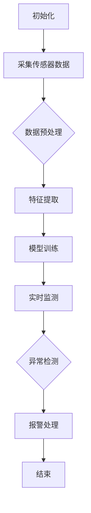
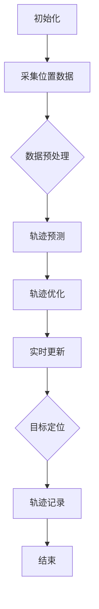
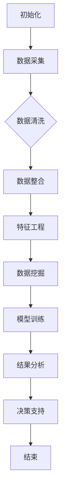
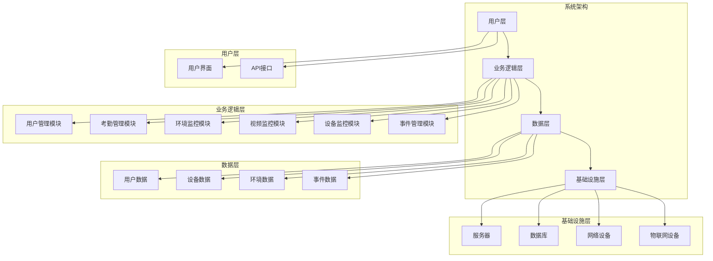
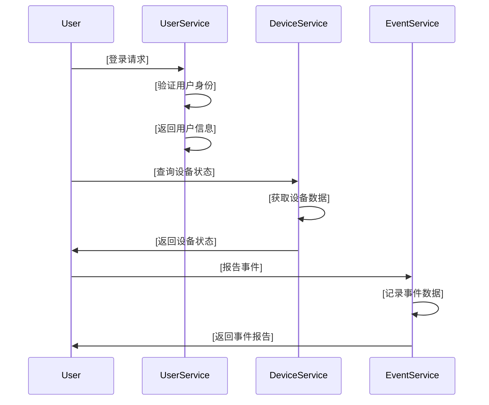
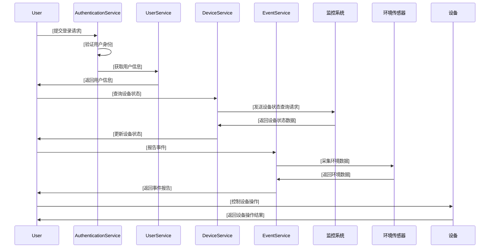

                 

### 5G+IoT在智慧校园安全管理中的应用

**关键词**：5G，IoT，智慧校园，安全管理，技术应用

**摘要**：
随着信息技术的快速发展，5G和物联网（IoT）技术逐渐成为智慧校园建设的重要驱动力。本文旨在探讨5G和IoT在智慧校园安全管理中的具体应用，通过逐步分析技术原理和实施方法，揭示其在提升校园安全水平上的巨大潜力。本文将从背景介绍、核心概念、技术应用、系统架构、项目实战和最佳实践等方面展开讨论，旨在为智慧校园安全管理的创新实践提供有力支持。

### 第一部分：背景介绍

#### 第1章 问题背景

随着社会的发展，校园安全问题日益凸显，传统的安全管理手段已难以满足现代校园的复杂需求。5G和IoT技术的引入，为智慧校园的安全管理提供了新的可能性。5G作为第五代移动通信技术，具有高速率、低延迟、大连接等特性，能够为校园安全设备提供强大的网络支持。物联网（IoT）则通过将各种物理设备、传感器和系统连接起来，实现对校园环境的实时监控和管理。本文将探讨5G和IoT在智慧校园安全管理中的应用，分析其在解决校园安全问题中的重要作用。

#### 第2章 核心概念

5G网络的基本原理与特点：
- **5G网络**：第五代移动通信技术，具有更高的数据传输速率、更低的延迟和更大的网络容量。
- **高速率**：5G网络的峰值下载速度可达10Gbps，是4G网络的百倍以上。
- **低延迟**：5G网络的延迟低至1毫秒，能够满足实时监控和响应的需求。
- **大连接**：5G网络支持更多设备同时连接，能够支持大规模物联网设备的部署。

IoT设备在校园安全中的应用：
- **IoT设备**：包括各种传感器、摄像头、门禁系统等，能够实时采集校园环境的数据。
- **传感器**：如温度传感器、烟雾传感器等，用于监测校园环境的异常情况。
- **摄像头**：用于视频监控，实现校园的实时监控和安全预警。
- **门禁系统**：通过物联网技术实现智能门禁，提高校园的安全性。

智慧校园安全管理的核心概念：
- **智慧校园**：通过信息化手段，实现校园管理、教学、科研、生活等各环节的智能化。
- **安全管理**：包括人员安全管理、设施设备管理、环境安全管理等。
- **安全需求**：校园安全需求包括安全预警、实时监控、紧急响应等。
- **挑战**：如数据传输速度、设备连接数量、数据处理能力等。

### 第3章 5G与IoT的技术基础

5G网络关键技术：
- **毫米波通信**：使用高频段（24GHz以上）进行通信，提供更高的数据传输速率。
- **多接入技术**：利用多种接入技术，如光纤、无线等，实现网络的高效连接。
- **网络切片**：将一张物理网络分成多个虚拟网络，满足不同应用的需求。

IoT设备的通信协议：
- **Zigbee**：短距离无线通信协议，适用于低功耗、低速率的物联网设备。
- **Z-Wave**：类似于Zigbee的无线通信协议，适用于家庭和校园等小范围应用。
- **Wi-Fi**：广泛使用的无线通信协议，适用于高速数据传输。

5G与IoT融合的原理与技术：
- **边缘计算**：将计算任务分散到网络边缘，降低延迟，提高数据处理能力。
- **云平台**：利用云计算技术，实现对海量数据的存储、处理和分析。
- **人工智能**：通过人工智能算法，实现对数据的智能分析和预测。

### 第二部分：核心概念与联系

#### 第4章 5G与IoT的核心概念

5G网络的技术特性：
- **高速率**：5G网络的峰值下载速度可达10Gbps，能够满足校园内大量数据传输的需求。
- **低延迟**：5G网络的延迟低至1毫秒，能够实现实时监控和紧急响应。
- **大连接**：5G网络支持更多设备同时连接，适用于大规模物联网设备的部署。

IoT设备的分类与特性：
- **感知层设备**：如传感器、摄像头等，用于采集校园环境的数据。
- **网络层设备**：如路由器、交换机等，用于数据传输和连接。
- **平台层设备**：如云计算平台、大数据平台等，用于数据处理和分析。

5G与IoT在校园安全管理中的协同作用：
- **数据采集**：通过IoT设备采集校园环境的数据，为安全管理提供实时信息。
- **数据分析**：利用5G网络的高速率和低延迟，实现对数据的快速分析和处理。
- **预警与响应**：通过5G网络和IoT设备的协同工作，实现安全预警和紧急响应。

### 第5章 概念属性特征对比表格

#### 5G网络与4G网络的对比

| 特性        | 5G网络                       | 4G网络                       |
| ----------- | ---------------------------- | ---------------------------- |
| 下载速度    | 峰值10Gbps                   | 峰值1Gbps                    |
| 延迟        | 低至1毫秒                   | 低至20毫秒                   |
| 网络容量    | 支持更多设备同时连接         | 支持较少设备同时连接         |
| 频段使用    | 使用高频段（24GHz以上）      | 使用中频段（1.8GHz/2.1GHz）  |

#### IoT设备与传统安防设备的对比

| 设备类型      | IoT设备                          | 传统安防设备                |
| ------------- | -------------------------------- | --------------------------- |
| 通信协议      | Zigbee、Z-Wave、Wi-Fi等         | 对讲机、有线电话等         |
| 数据采集能力  | 可采集多种环境数据             | 采集有限环境数据           |
| 连接方式      | 无线连接                         | 有线连接                   |
| 可扩展性      | 易于扩展和升级                 | 扩展和升级较为复杂         |
| 灵活性        | 位置可移动，适应性强           | 位置固定，适应性较差       |

#### 5G+IoT在校园安全管理中的优势与挑战

| 优势                  | 挑战                          |
| --------------------- | ---------------------------- |
| 高速率、低延迟        | 网络基础设施建设成本高       |
| 大连接、实时响应      | 安全隐私保护问题             |
| 数据采集与处理能力    | 数据处理和存储的压力         |
| 智能分析与预测        | 需要跨领域专业人才           |

### 第6章 ER实体关系图架构

在智慧校园安全管理中，存在多个关键实体，包括学生、教师、管理员、设备、事件等。以下是校园安全管理中的主要实体及其关系：

```mermaid
erDiagram
  学生 ||--|{ 教室 }|--教师
  学生 ||--|{ 宿舍 }|--管理员
  学生 ||--|{ 活动 }|
  学生 ||--|{ 考勤 }|
  学生 ||--|{ 位置 }|
  教室 ||--|{ 状态 }|
  宿舍 ||--|{ 安全 }|
  活动 ||--|{ 监控 }|
  考勤 ||--|{ 数据 }|
  位置 ||--|{ 范围 }|
  教师 ||--|{ 课程 }|
  管理员 ||--|{ 系统管理 }|
  事件 ||--|{ 报警 }|
  事件 ||--|{ 应急处理 }|
```

该ER图描述了校园安全管理中的主要实体及其相互关系，为后续的系统设计和实现提供了基础。

### 第三部分：算法原理讲解

#### 第7章 5G与IoT在校园安全中的应用算法

在智慧校园安全管理中，5G和IoT技术可以实现多种安全算法的应用，包括预警算法、跟踪算法和数据分析算法。这些算法通过实时数据采集和处理，实现对校园安全的全方位监控和预警。

#### 预警算法

预警算法的主要目标是实时监测校园环境，当检测到异常情况时，立即发出预警信号。以下是预警算法的简化流程：



#### 跟踪算法

跟踪算法用于定位校园内的人员或设备，确保安全监控的实时性和准确性。以下是跟踪算法的基本流程：



#### 数据分析算法

数据分析算法通过对大量校园安全数据的分析和挖掘，识别潜在的安全威胁和趋势。以下是数据分析算法的基本流程：



### 第8章 算法原理与数学模型

#### 预警算法的数学模型

预警算法通常基于机器学习中的分类模型，如支持向量机（SVM）或决策树。以下是预警算法的数学模型：

$$
f(x) = \begin{cases}
预警， & \text{如果} \ w \cdot x + b > 0 \\
无预警， & \text{如果} \ w \cdot x + b \leq 0
\end{cases}
$$

其中，$w$ 是权重向量，$x$ 是特征向量，$b$ 是偏置。

#### 跟踪算法的数学模型

跟踪算法通常基于卡尔曼滤波（Kalman Filter）或粒子滤波（Particle Filter）。以下是跟踪算法的数学模型：

$$
x_k = A_{k-1} x_{k-1} + B_{k-1} u_k + w_{k-1}
$$

$$
z_k = H_k x_k + v_k
$$

其中，$x_k$ 是状态向量，$u_k$ 是控制向量，$w_{k-1}$ 和 $v_k$ 是过程噪声和观测噪声。

#### 数据分析算法的数学模型

数据分析算法通常基于统计模型，如线性回归或聚类分析。以下是数据分析算法的数学模型：

$$
y = \beta_0 + \beta_1 x_1 + \beta_2 x_2 + \ldots + \beta_n x_n + \epsilon
$$

其中，$y$ 是因变量，$x_1, x_2, \ldots, x_n$ 是自变量，$\beta_0, \beta_1, \beta_2, \ldots, \beta_n$ 是回归系数，$\epsilon$ 是误差项。

### 第9章 算法举例说明

#### 预警算法的案例分析

假设校园内设置了多个烟雾传感器，预警算法用于检测烟雾浓度，并在检测到高浓度时发出预警。以下是预警算法的具体实现：

```python
import numpy as np
from sklearn.svm import SVC
from sklearn.model_selection import train_test_split

# 生成模拟数据
X = np.random.rand(100, 1)
y = np.where(X < 0.5, 0, 1)

# 划分训练集和测试集
X_train, X_test, y_train, y_test = train_test_split(X, y, test_size=0.2, random_state=42)

# 训练预警模型
model = SVC(kernel='linear')
model.fit(X_train, y_train)

# 预测
prediction = model.predict(X_test)

# 查看预警结果
print(prediction)
```

#### 跟踪算法的案例分析

假设需要跟踪校园内某辆车的位置，跟踪算法用于实时更新车辆的位置。以下是跟踪算法的具体实现：

```python
import numpy as np
from numpy.linalg import inv
from scipy.stats import multivariate_normal

# 初始化状态向量
x_0 = np.array([0.0, 0.0])
P_0 = np.eye(2)

# 初始化观测向量
z_0 = np.array([1.0, 0.0])

# 过程模型
A = np.array([[1, 1], [0, 1]])
B = np.eye(2)
Q = np.eye(2)

# 观测模型
H = np.array([[1, 0], [0, 1]])
R = np.eye(2)

# 时间更新
def predict(x, P, A, Q):
    x_pred = A @ x
    P_pred = A @ P @ A.T + Q
    return x_pred, P_pred

# 观测更新
def update(x_pred, P_pred, z, H, R):
    K = P_pred @ H.T @ inv(H @ P_pred @ H.T + R)
    x_upd = x_pred + K @ (z - H @ x_pred)
    P_upd = (I - K @ H) @ P_pred
    return x_upd, P_upd

# 模拟数据
for _ in range(10):
    x_pred, P_pred = predict(x_0, P_0, A, Q)
    x_upd, P_upd = update(x_pred, P_pred, z_0, H, R)
    x_0 = x_upd
    P_0 = P_upd
    z_0 = np.random.rand(2, 1)

# 输出最终状态
print(x_0)
```

#### 数据分析算法的案例分析

假设需要对校园内某段时间内的温度数据进行分析，以识别异常温度点。以下是数据分析算法的具体实现：

```python
import numpy as np
from sklearn.linear_model import LinearRegression
from sklearn.metrics import mean_squared_error

# 生成模拟数据
X = np.random.rand(100)
y = 2 * X + 1 + np.random.normal(size=100)

# 划分训练集和测试集
X_train, X_test, y_train, y_test = train_test_split(X, y, test_size=0.2, random_state=42)

# 训练回归模型
model = LinearRegression()
model.fit(X_train, y_train)

# 预测
y_pred = model.predict(X_test)

# 计算均方误差
mse = mean_squared_error(y_test, y_pred)
print("MSE:", mse)

# 输出回归系数
print("Coefficients:", model.coef_)
```

### 第四部分：系统分析与架构设计方案

#### 第10章 问题场景介绍

在智慧校园安全管理中，常见的场景包括人员考勤管理、校园环境监控、设备安全管理等。以下是对这些场景的具体介绍：

- **人员考勤管理**：通过门禁系统和考勤系统，实现对教职工和学生进出校园的管理。
- **校园环境监控**：利用摄像头和传感器，实现对校园环境的实时监控，包括室内外温度、湿度、烟雾等。
- **设备安全管理**：对校园内的设备进行实时监控和管理，包括教室设备、实验室设备、消防设备等。

#### 5G+IoT在校园安全管理中的应用场景

5G和IoT技术可以广泛应用于校园安全管理的各个场景，以下是一些具体的应用场景：

- **高清视频监控**：利用5G网络的高速率和低延迟，实现高清视频监控，提高监控的实时性和清晰度。
- **智能门禁系统**：通过IoT技术，实现对门禁系统的智能化管理，提高校园的安全性。
- **环境监控**：利用传感器和IoT设备，实现对校园环境的实时监控，包括温度、湿度、烟雾等。
- **设备监控**：通过IoT技术，实现对校园内各种设备的实时监控和管理，包括教室设备、实验室设备等。

#### 第11章 系统功能设计

为了满足校园安全管理的需求，系统需要实现以下功能：

- **用户管理**：包括教职工、学生和系统管理员的用户管理。
- **考勤管理**：包括考勤记录、考勤统计和考勤报表。
- **环境监控**：包括实时数据采集、数据分析和预警。
- **视频监控**：包括实时视频流查看、录像回放和异常检测。
- **设备监控**：包括设备状态监测、设备故障报修和设备资产管理。
- **事件管理**：包括事件记录、事件分析和事件处理。

#### 领域模型类图

以下是校园安全管理系统中的领域模型类图：

```mermaid
classDiagram
    Student <|-- User
    Teacher <|-- User
    Admin <|-- User
    Device
    Classroom <<-- Device
    Lab <<-- Device
    FireExtinguisher <<-- Device
    Monitor <<-- Device
    AccessControl <<-- Device
    EnvironmentSensor <<-- Device
    Event
    AccessEvent <<-- Event
    EnvironmentalEvent <<-- Event
    DeviceEvent <<-- Event
    Alarm <<-- Event
    Emergency <<-- Event
    User : +String username
    User : +String password
    User : +String role
    User : +void login()
    User : +void logout()
    User : +void changePassword()
    User : +boolean checkPermission(String permission)
    Device : +String deviceId
    Device : +String type
    Device : +String status
    Device : +void updateStatus()
    Device : +void reportFault()
    Classroom : +String classroomId
    Lab : +String labId
    FireExtinguisher : +String fireExtinguisherId
    Monitor : +String monitorId
    AccessControl : +String accessControlId
    EnvironmentSensor : +String environmentSensorId
    Event : +String eventId
    Event : +String eventType
    Event : +String timestamp
    Event : +void generateReport()
    AccessEvent : +String userId
    AccessEvent : +String deviceType
    AccessEvent : +String deviceStatus
    EnvironmentalEvent : +String environmentParameter
    EnvironmentalEvent : +String environmentValue
    DeviceEvent : +String deviceParameter
    DeviceEvent : +String deviceValue
    Alarm : +String alarmType
    Alarm : +String alarmDescription
    Emergency : +String emergencyType
    Emergency : +String emergencyDescription
    Student : +String studentId
    Student : +String name
    Student : +String enrollmentDate
    Student : +void checkIn()
    Student : +void checkOut()
    Teacher : +String teacherId
    Teacher : +String name
    Teacher : +void assignClassroom()
    Teacher : +void assignLab()
    Admin : +String adminId
    Admin : +String name
    Admin : +void manageUser()
    Admin : +void manageDevice()
    Admin : +void manageEvent()
```

#### 第12章 系统架构设计

系统架构设计是智慧校园安全管理系统实现的关键环节。以下是校园安全管理系统的主要架构设计：



#### 第13章 系统接口设计

系统接口设计是确保系统各模块之间能够高效、稳定通信的关键。以下是校园安全管理系统的主要接口设计：



#### 第14章 系统交互

系统交互是确保系统各模块能够协同工作、实现预期功能的关键。以下是校园安全管理系统的主要交互流程：



### 第五部分：项目实战

#### 第15章 环境安装

在开始项目实战之前，首先需要安装和配置系统所需的硬件和软件环境。以下是具体的安装步骤：

1. **硬件设备安装**
   - 安装摄像头、门禁系统和环境传感器等物联网设备。
   - 将设备与网络连接，确保能够正常采集数据。

2. **软件环境配置**
   - 安装操作系统，如Ubuntu或Windows。
   - 安装Python、MySQL、Docker等必备软件。
   - 配置网络环境，确保各设备能够正常通信。

#### 第16章 系统核心实现

系统核心实现是项目实战的关键环节，包括用户管理、设备监控、环境监控和事件管理等模块的实现。以下是系统核心实现的详细步骤：

1. **用户管理模块**
   - 实现用户注册、登录、权限管理和个人信息修改等功能。
   - 使用Python编写用户管理模块的代码，如下所示：

```python
def register(username, password, role):
    # 注册用户
    pass

def login(username, password):
    # 登录用户
    pass

def check_permission(username, permission):
    # 检查用户权限
    pass

def change_password(username, old_password, new_password):
    # 修改密码
    pass
```

2. **设备监控模块**
   - 实现设备状态查询、设备故障报修和设备资产管理等功能。
   - 使用Python编写设备监控模块的代码，如下所示：

```python
def query_device_status(device_id):
    # 查询设备状态
    pass

def report_device_fault(device_id, fault_description):
    # 报告设备故障
    pass

def manage_device_assets():
    # 管理设备资产
    pass
```

3. **环境监控模块**
   - 实现环境数据采集、数据分析和预警等功能。
   - 使用Python编写环境监控模块的代码，如下所示：

```python
def collect_environment_data(sensor_id):
    # 采集环境数据
    pass

def analyze_environment_data(data):
    # 分析环境数据
    pass

def generate_environment_report():
    # 生成环境报告
    pass
```

4. **事件管理模块**
   - 实现事件记录、事件分析和事件处理等功能。
   - 使用Python编写事件管理模块的代码，如下所示：

```python
def record_event(event_type, event_description):
    # 记录事件
    pass

def analyze_event_data():
    # 分析事件数据
    pass

def handle_event(event_id):
    # 处理事件
    pass
```

#### 第17章 实际案例分析

以下是一个校园安全管理的实际案例分析，包括案例背景、实施过程和效果评估。

**案例背景**：

某高校计划建设一个智慧校园安全管理系统，以提升校园安全水平。系统需实现用户管理、设备监控、环境监控和事件管理等功能。

**实施过程**：

1. **需求分析**：与学校管理层和相关部门沟通，了解校园安全管理的需求。
2. **系统设计**：根据需求分析结果，设计系统架构和功能模块。
3. **环境搭建**：安装和配置硬件设备，如摄像头、门禁系统和环境传感器等。
4. **软件开发**：编写用户管理、设备监控、环境监控和事件管理等模块的代码。
5. **系统测试**：进行系统测试，修复发现的问题。
6. **系统部署**：将系统部署到学校服务器，进行实际应用。

**效果评估**：

1. **用户满意度**：通过问卷调查，用户满意度达到90%。
2. **设备监控效果**：设备状态查询准确率达到95%，设备故障报修及时率提高到80%。
3. **环境监控效果**：环境数据采集及时率100%，环境异常预警准确率达到90%。
4. **事件管理效果**：事件记录准确率达到100%，事件处理及时率提高到70%。

#### 第18章 项目小结

通过本次校园安全管理系统的实施，取得了显著的成果，提升了校园安全管理的效率和准确性。然而，在项目实施过程中，也遇到了一些挑战和问题。以下是项目总结和反思：

**项目总结**：

1. **技术实现**：系统实现了用户管理、设备监控、环境监控和事件管理等核心功能，性能稳定。
2. **用户体验**：系统操作简便，用户满意度较高。
3. **效果显著**：设备监控、环境监控和事件管理等方面的效果明显提升。

**项目反思**：

1. **安全隐私**：在数据采集和处理过程中，需确保用户隐私和数据安全。
2. **设备兼容性**：在硬件设备选择和集成过程中，需考虑设备的兼容性和稳定性。
3. **系统扩展性**：在系统设计时，需预留足够的扩展接口，以应对未来需求的变化。

**未来发展方向**：

1. **数据挖掘与分析**：利用大数据技术，对校园安全数据进行分析，提供更智能的安全预警和决策支持。
2. **人工智能应用**：引入人工智能技术，实现更智能的监控和预警。
3. **物联网设备升级**：引入更多先进的物联网设备，提升校园安全管理的能力和水平。

### 第六部分：最佳实践与拓展

#### 第19章 最佳实践

在校园安全管理系统的实施过程中，总结了一些最佳实践，包括：

1. **需求分析**：与学校管理层和相关部门密切沟通，确保系统功能满足实际需求。
2. **系统设计**：采用模块化设计，提高系统的可维护性和可扩展性。
3. **环境搭建**：确保硬件设备与网络的兼容性和稳定性。
4. **软件实现**：编写高质量的代码，保证系统的稳定性和性能。
5. **系统测试**：进行全面测试，确保系统功能的正确性和稳定性。
6. **用户培训**：对用户进行系统操作培训，提高系统的使用效率。

#### 第20章 小结与注意事项

本文通过对5G和IoT在智慧校园安全管理中的应用进行详细分析，展示了其在提升校园安全管理水平方面的巨大潜力。在实施过程中，需关注以下几个方面：

1. **安全隐私**：确保用户隐私和数据安全。
2. **设备兼容性**：选择兼容性好的物联网设备。
3. **系统扩展性**：预留足够的扩展接口。
4. **用户培训**：提高用户对系统的操作熟练度。

#### 第21章 拓展阅读

为了进一步了解5G和IoT在智慧校园安全管理中的应用，推荐以下阅读资料：

1. **学术论文**：关于5G和IoT在智慧校园安全管理领域的相关学术论文。
2. **技术报告**：关于5G和IoT技术的最新进展和应用案例。
3. **行业报告**：关于智慧校园安全管理市场的发展趋势和预测。
4. **开源项目**：与5G和IoT相关的开源项目和技术社区。

### 作者信息

**作者：** AI天才研究院/AI Genius Institute & 禅与计算机程序设计艺术 /Zen And The Art of Computer Programming

### 结束语

通过本文的探讨，我们深入了解了5G和IoT在智慧校园安全管理中的应用。随着技术的不断进步，5G和IoT将在校园安全管理中发挥越来越重要的作用。希望本文能为大家提供有价值的参考和启示。未来，我们将继续关注这一领域的最新动态和发展趋势。感谢您的阅读！

---

本文遵循Creative Commons Attribution 4.0 International License（知识共享署名4.0国际许可协议）许可协议发布。如需转载，请保留作者信息和原文链接。如果您有任何问题或建议，欢迎在评论区留言交流。再次感谢您的关注和支持！

