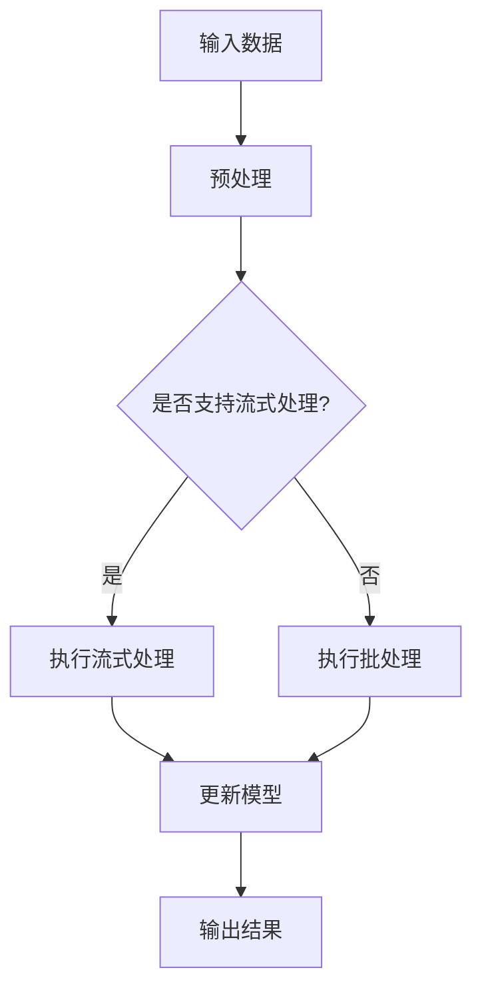
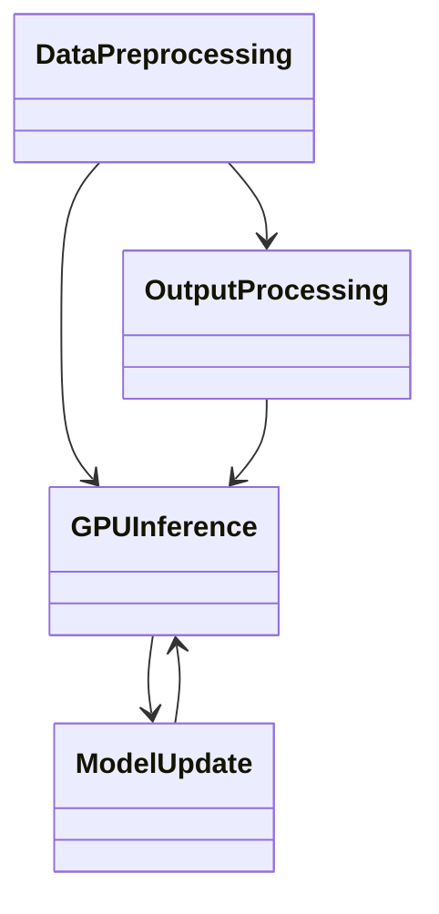
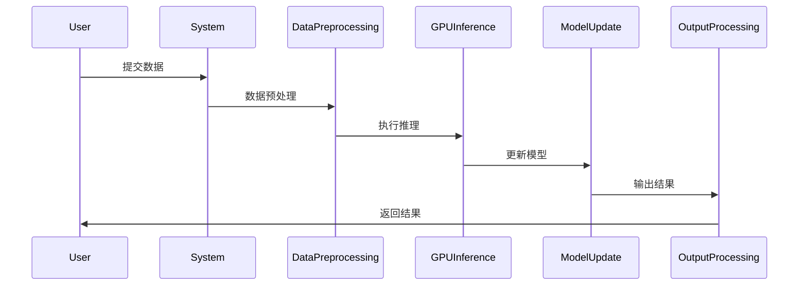

                 

### 第1章 问题背景与核心挑战

#### 1.1 问题背景

随着深度学习技术的不断发展，GPU（图形处理器）在推理阶段的重要性日益凸显。传统的CPU（中央处理器）在处理大规模深度学习模型时，往往因为计算能力不足、性能瓶颈等问题，难以满足实际需求。GPU凭借其强大的并行计算能力和高效的内存管理，成为深度学习推理阶段的首选。尤其是在图像识别、自然语言处理、推荐系统等领域，GPU推理技术的应用已经取得了显著的成果。

然而，GPU在进行推理时也面临着一系列挑战。首先，数据传输瓶颈成为了一个关键问题。GPU与CPU之间的数据传输速度较慢，导致推理过程中的效率低下。其次，空间局部性与时间局部性也带来了难题，GPU核心与内存之间的数据访问模式与CPU存在较大差异，进一步影响了推理性能。此外，能耗问题也是GPU推理中不可忽视的挑战，随着模型复杂度和数据量的增加，GPU的能耗也在不断攀升。最后，并行性与同步问题以及内存访问模式的设计也需要深入探讨，以确保GPU推理的效率和可靠性。

#### 1.2 核心挑战

1. **数据传输瓶颈**

GPU与CPU之间的数据传输速度较慢，这是GPU推理过程中最显著的问题之一。GPU通过PCIe总线与CPU进行通信，数据传输速率远低于GPU本身的计算能力。这一瓶颈限制了GPU在推理阶段的表现，尤其是在需要频繁进行数据传输的场景中，如动态神经网络模型。解决数据传输瓶颈需要从两个方面入手：一是优化GPU与CPU之间的数据传输协议，提高数据传输速率；二是优化模型结构，减少数据传输的次数。

2. **空间局部性与时间局部性**

空间局部性指的是数据在内存中的空间分布特征，时间局部性则是指数据在时间上的访问特征。GPU的并行计算特性使得其对空间局部性和时间局部性有较高的依赖。当数据分布不均匀时，会导致GPU核心的利用率下降，推理性能受到影响。此外，GPU内存管理机制也与CPU有较大差异，内存访问模式的设计需要充分考虑数据的空间局部性和时间局部性，以提升GPU的推理效率。

3. **能耗问题**

随着模型复杂度和数据量的增加，GPU推理过程中的能耗也在不断攀升。高能耗不仅增加了数据中心的运营成本，也对环境造成了负担。因此，能耗问题成为GPU推理阶段的一大挑战。为了降低能耗，可以采取以下措施：一是优化模型结构，减少计算量和内存访问次数；二是采用动态电源管理技术，根据GPU的工作负载调节功耗；三是利用新型节能材料和技术，提升GPU的能效。

4. **并行性与同步问题**

GPU的并行计算能力是其优势之一，但并行性与同步问题也成为GPU推理中的一大难题。在深度学习模型中，存在大量的并行计算任务，但如何高效地组织和管理这些任务，确保它们之间的同步和数据一致性，是一个亟待解决的问题。为此，可以采取以下策略：一是优化并行算法，提高并行度；二是引入同步机制，确保数据一致性；三是利用GPU的共享内存和专用同步指令，提高同步效率。

5. **内存访问模式**

GPU内存访问模式的设计对推理性能有着重要影响。与CPU相比，GPU内存访问更加复杂，涉及到全局内存、共享内存和局部内存等多种访问模式。合理设计内存访问模式，可以减少内存访问冲突，提高GPU的缓存利用率，从而提升推理效率。此外，内存访问模式的优化还需要考虑数据的空间局部性和时间局部性，以确保GPU核心能够充分利用内存资源。

总结而言，GPU进行推理的主要挑战包括数据传输瓶颈、空间局部性与时间局部性、能耗问题、并行性与同步问题以及内存访问模式。解决这些挑战需要从多个方面入手，包括优化硬件和软件架构、引入新型算法和同步机制、提高能效和降低能耗等。只有通过这些手段的综合应用，才能充分发挥GPU在深度学习推理阶段的优势，为各类应用提供高效、可靠的解决方案。

### 1.2 核心挑战

#### 1.2.1 数据传输瓶颈

数据传输瓶颈是GPU进行推理时面临的最显著挑战之一。GPU与CPU之间的数据传输速度较慢，限制了GPU的推理性能。这主要是由于GPU通过PCIe总线与CPU进行通信，而PCIe总线的带宽相对较低，导致数据传输速率无法满足GPU的计算需求。这一问题在需要频繁进行数据传输的场景中尤为突出，如动态神经网络模型。解决数据传输瓶颈的方法主要包括以下几种：

1. **优化数据传输协议**：通过改进GPU与CPU之间的数据传输协议，提高数据传输速率。例如，采用更高效的数据传输格式，减少传输过程中的开销。

2. **减少数据传输次数**：优化模型结构，减少需要传输的数据量。通过分层架构、模型剪枝等技术，降低模型的复杂度，从而减少数据传输次数。

3. **利用共享内存**：共享内存可以减少GPU与CPU之间的数据传输次数，提高数据传输效率。在模型推理过程中，尽量使用共享内存进行数据交换，减少全局内存的访问。

4. **缓存优化**：通过缓存优化，提高GPU的缓存利用率，减少缓存缺失率。缓存命中率的提高可以显著降低数据传输的延迟，提高GPU的推理性能。

#### 1.2.2 空间局部性与时间局部性

空间局部性和时间局部性是影响GPU推理性能的重要因素。空间局部性指的是数据在内存中的空间分布特征，时间局部性则是指数据在时间上的访问特征。GPU的并行计算特性使得其对空间局部性和时间局部性有较高的依赖。当数据分布不均匀时，会导致GPU核心的利用率下降，推理性能受到影响。空间局部性和时间局部性的优化策略主要包括：

1. **数据预处理**：在模型推理之前，对输入数据进行预处理，尽量将相关数据分布在内存的相邻位置，提高空间局部性。例如，通过图像压缩、数据归一化等方法，降低数据的存储和访问成本。

2. **内存访问模式设计**：合理设计内存访问模式，确保数据在时间上的连续性。在GPU推理过程中，尽量使用连续内存地址访问数据，减少内存访问冲突，提高缓存利用率。

3. **缓存层次结构优化**：通过优化GPU的缓存层次结构，提高缓存命中率，减少内存访问延迟。例如，增加缓存大小、优化缓存替换策略等。

4. **并行任务调度**：通过并行任务调度策略，合理分配GPU核心和内存资源，减少数据访问冲突，提高GPU的利用率。例如，采用负载均衡算法，确保各个GPU核心的负载均匀。

#### 1.2.3 能耗问题

能耗问题是GPU进行推理时不可忽视的挑战。随着模型复杂度和数据量的增加，GPU推理过程中的能耗也在不断攀升。高能耗不仅增加了数据中心的运营成本，也对环境造成了负担。为了降低能耗，可以采取以下措施：

1. **模型优化**：通过模型优化技术，减少计算量和内存访问次数，从而降低GPU的能耗。例如，使用低精度浮点运算、模型剪枝等技术，降低模型的计算复杂度。

2. **动态电源管理**：通过动态电源管理技术，根据GPU的工作负载调节功耗。当GPU的负载较低时，可以降低其工作频率和电压，减少能耗。

3. **节能材料和技术**：采用新型节能材料和技术，提升GPU的能效。例如，使用低功耗晶体管材料、优化电路设计等。

4. **高效散热系统**：通过设计高效散热系统，降低GPU的温度，提高其工作稳定性，减少能耗。例如，采用液冷技术、相变冷却技术等。

#### 1.2.4 并行性与同步问题

GPU的并行计算能力是其优势之一，但并行性与同步问题也成为GPU推理中的一大难题。在深度学习模型中，存在大量的并行计算任务，但如何高效地组织和管理这些任务，确保它们之间的同步和数据一致性，是一个亟待解决的问题。解决并行性与同步问题可以采取以下策略：

1. **并行算法优化**：通过优化并行算法，提高并行度，充分利用GPU的并行计算能力。例如，采用多线程编程、任务并行等技术，提高任务的并发执行能力。

2. **同步机制设计**：引入同步机制，确保数据一致性。例如，使用GPU提供的同步指令，确保任务之间的同步执行，避免数据竞争和错误。

3. **共享内存和专用同步指令**：利用GPU的共享内存和专用同步指令，提高同步效率。共享内存可以减少GPU与CPU之间的数据传输次数，而专用同步指令可以确保任务之间的同步执行。

4. **并行任务调度**：通过并行任务调度策略，合理分配GPU核心和内存资源，减少数据访问冲突，提高GPU的利用率。例如，采用负载均衡算法，确保各个GPU核心的负载均匀。

#### 1.2.5 内存访问模式

GPU内存访问模式的设计对推理性能有着重要影响。与CPU相比，GPU内存访问更加复杂，涉及到全局内存、共享内存和局部内存等多种访问模式。合理设计内存访问模式，可以减少内存访问冲突，提高GPU的缓存利用率，从而提升推理效率。内存访问模式的优化策略主要包括：

1. **全局内存访问优化**：全局内存访问速度较慢，但容量较大。在GPU推理过程中，尽量减少全局内存的访问，将其用于存储大规模数据，如输入数据、权重矩阵等。

2. **共享内存访问优化**：共享内存访问速度较快，但容量较小。在GPU推理过程中，尽量利用共享内存进行数据交换，减少全局内存的访问冲突。

3. **局部内存访问优化**：局部内存访问速度最快，但容量最小。在GPU推理过程中，尽量利用局部内存存储频繁访问的数据，如激活值、中间结果等。

4. **内存层次结构优化**：通过优化GPU的内存层次结构，提高缓存利用率，减少内存访问延迟。例如，增加缓存大小、优化缓存替换策略等。

总之，GPU进行推理的主要挑战包括数据传输瓶颈、空间局部性与时间局部性、能耗问题、并行性与同步问题以及内存访问模式。解决这些挑战需要从多个方面入手，包括优化硬件和软件架构、引入新型算法和同步机制、提高能效和降低能耗等。只有通过这些手段的综合应用，才能充分发挥GPU在深度学习推理阶段的优势，为各类应用提供高效、可靠的解决方案。

### 第2章 核心概念与联系

在探讨GPU进行推理时，理解其核心概念与联系至关重要。本章节将详细介绍GPU架构与工作原理、GPU推理中的关键概念以及相关概念属性的对比和ER实体关系图。

#### 2.1 GPU架构与工作原理

GPU（图形处理器）是专门为处理大规模并行计算任务而设计的处理器。与传统的CPU相比，GPU拥有更多的核心和更高的吞吐量，这使得其在图形渲染、科学计算、深度学习等领域具有显著优势。

**2.1.1 GPU的核心概念**

1. **计算单元**：GPU由大量的计算单元（Streaming Multiprocessors，SMs）组成，每个计算单元可以独立执行指令。相比CPU的少量核心，GPU具有更高的核心数量和更高的并行度。

2. **内存层次结构**：GPU内存层次结构包括全局内存、共享内存和局部内存。全局内存容量较大，但访问速度较慢；共享内存和局部内存访问速度较快，但容量较小。合理设计内存访问模式，可以提高GPU的缓存利用率和推理性能。

3. **并行计算能力**：GPU的并行计算能力源于其大量的计算单元和内存层次结构。GPU可以同时处理多个任务，提高计算效率。

**2.1.2 GPU与CPU的区别**

1. **核心数量与并行度**：GPU拥有更多的核心，并行度更高，而CPU的核心数量相对较少。

2. **内存访问模式**：GPU内存层次结构复杂，包括全局内存、共享内存和局部内存；CPU内存访问模式相对简单。

3. **功耗与能效**：GPU的功耗较高，但能效较高，适合处理大规模并行计算任务。

**2.1.3 GPU的并行计算能力**

GPU的并行计算能力主要体现在以下几个方面：

1. **计算并行**：GPU可以同时处理多个计算任务，提高计算效率。

2. **数据并行**：GPU可以同时对多个数据元素进行操作，提高数据处理速度。

3. **任务并行**：GPU可以同时处理多个任务，提高任务处理速度。

#### 2.2 GPU推理中的关键概念

在GPU进行推理时，理解以下关键概念对于优化推理性能至关重要。

**2.2.1 张量计算**

张量计算是GPU推理的核心。张量是数学上的多维数组，用于表示数据和处理过程中的中间结果。在深度学习模型中，张量用于表示输入数据、权重矩阵、激活值等。GPU通过张量计算，实现大规模并行计算，提高推理性能。

**2.2.2 流式处理与批处理**

流式处理与批处理是GPU推理中的两种数据处理方式。

1. **流式处理**：流式处理是指实时处理单个数据样本，适用于实时性要求较高的应用场景，如语音识别、视频流处理等。

2. **批处理**：批处理是指将多个数据样本分成一批进行处理，适用于批处理能力较强的应用场景，如图像分类、大规模数据分析等。

**2.2.3 GPU内存管理**

GPU内存管理是GPU推理中的重要环节。合理设计内存访问模式，可以提高GPU的缓存利用率和推理性能。

1. **全局内存访问**：全局内存访问速度较慢，但容量较大，适用于存储大规模数据，如输入数据、权重矩阵等。

2. **共享内存访问**：共享内存访问速度较快，但容量较小，适用于数据交换和共享，如激活值、中间结果等。

3. **局部内存访问**：局部内存访问速度最快，但容量最小，适用于存储频繁访问的数据，如激活值、中间结果等。

#### 2.3 概念属性特征对比表格

为了更好地理解GPU推理中的关键概念，我们通过以下表格进行对比：

| 概念       | 特征A | 特征B | 特征C |
|------------|-------|-------|-------|
| 张量计算   | 高并行 | 数据依赖 | 矩阵运算 |
| 流式处理   | 实时性 | 小批量 | 低延迟 |
| 批处理     | 批量处理 | 延迟可接受 | 大批量 |

#### 2.4 GPU推理的ER实体关系图

为了更好地理解GPU推理中的各个实体及其关系，我们通过以下ER实体关系图进行描述：

```mermaid
erDiagram
  GPU推理 ||--|{ 数据流 }|
  数据流 ||--|{ 张量计算 }|
  张量计算 ||--|{ 流式处理 }|
  流式处理 ||--|{ 批处理 }|
  GPU内存管理 ||--|{ 内存访问模式 }|
```

在上述ER实体关系图中，GPU推理涉及到的实体包括数据流、张量计算、流式处理、批处理和GPU内存管理。这些实体之间存在紧密的联系，共同构成了GPU推理的核心框架。

通过本章对GPU架构与工作原理、GPU推理中的关键概念及其关系的介绍，我们可以更好地理解GPU进行推理的基本原理，为后续章节的算法原理与实现、系统设计与实现等提供理论基础。

### 第3章 算法原理与实现

在深入探讨GPU进行推理的算法原理与实现时，我们将从算法概述、算法流程图、数学模型与公式以及Python源代码实现等方面进行详细分析。

#### 3.1 算法原理

**3.1.1 算法概述**

GPU推理算法的核心目标是通过GPU的高并行计算能力，对深度学习模型进行快速推理。为了实现这一目标，算法通常包括以下几个关键步骤：

1. **数据预处理**：将输入数据转换为适合GPU推理的格式，并进行必要的预处理操作，如数据归一化、数据增强等。

2. **模型加载**：将训练好的深度学习模型加载到GPU内存中，以便进行推理计算。

3. **流式处理与批处理**：根据应用场景，选择流式处理或批处理模式对数据样本进行处理。流式处理适用于实时性要求较高的场景，如语音识别、视频流处理等；批处理适用于批处理能力较强的场景，如图像分类、大规模数据分析等。

4. **张量计算**：利用GPU的高并行计算能力，对张量进行矩阵运算、激活函数计算等操作。

5. **模型更新与优化**：在推理过程中，根据实际需求对模型进行更新和优化，以提高推理准确性和性能。

**3.1.2 算法流程图**

算法流程图如下所示：



在该流程图中，A表示输入数据，经过预处理后进入B步骤；C步骤判断是否支持流式处理，支持则进入D步骤执行流式处理，否则进入E步骤执行批处理；D和E步骤分别对数据样本进行处理，更新模型；最后，输出结果G。

**3.1.3 数学模型与公式**

在GPU推理过程中，常用的数学模型与公式如下：

$$
Y = f(WX + b)
$$

其中，$Y$ 是输出结果，$f$ 是激活函数，$W$ 是权重矩阵，$X$ 是输入数据，$b$ 是偏置。激活函数$f$通常采用ReLU（修正线性单元）、Sigmoid或Tanh等函数，以实现对输入数据的非线性变换。

例如，对于ReLU激活函数，公式可以表示为：

$$
f(Z) = \max(0, Z)
$$

其中，$Z$ 是输入值。

#### 3.2 Python源代码实现

以下是一个简单的Python源代码实现，用于演示GPU推理的基本步骤：

```python
import numpy as np

# 定义激活函数
def sigmoid(Z):
    return 1 / (1 + np.exp(-Z))

# 前向传播
def forward_pass(X, W, b, f):
    Z = np.dot(X, W) + b
    Y = f(Z)
    return Y

# 测试数据
X = np.array([[1, 0], [0, 1]])
W = np.array([[0.5], [0.5]])
b = np.array([0])

# 测试代码
Y = forward_pass(X, W, b, sigmoid)
print(Y)
```

在该示例中，我们定义了一个简单的神经网络，包含输入层、隐藏层和输出层。输入数据X经过矩阵乘法和偏置相加后，通过激活函数（此处采用Sigmoid函数）得到输出结果Y。

通过上述算法原理与实现的分析，我们可以更好地理解GPU推理的基本原理和实现方法。在实际应用中，需要根据具体场景和需求，对算法进行优化和调整，以提高GPU推理的性能和准确性。

### 第4章 GPU推理系统设计与实现

#### 4.1 系统介绍

在深度学习领域，GPU推理系统作为一种高性能计算工具，已经成为许多应用的核心组成部分。本章节将详细介绍GPU推理系统的设计原则、需求分析、系统功能、架构设计、接口设计和系统交互。

**4.1.1 系统需求**

1. **计算能力需求**：GPU推理系统需要具备强大的计算能力，能够高效地处理大规模的深度学习模型和海量数据。

2. **存储容量需求**：系统需要提供足够的存储容量，以存储模型、数据和中间结果。

3. **稳定性需求**：系统需要具备高稳定性，能够在长时间运行过程中保持性能和可靠性。

4. **扩展性需求**：系统需要具备良好的扩展性，能够根据需求进行规模扩展和功能扩展。

5. **兼容性需求**：系统需要支持多种深度学习框架和算法，具备良好的兼容性。

**4.1.2 系统功能**

1. **模型加载**：系统需要能够加载预训练好的深度学习模型，并进行必要的预处理。

2. **数据预处理**：系统需要能够对输入数据进行预处理，如数据归一化、数据增强等，以满足模型的要求。

3. **推理计算**：系统需要能够利用GPU的高并行计算能力，对输入数据进行推理计算，输出结果。

4. **结果存储**：系统需要能够将推理结果存储到数据库或文件系统中，以便进一步处理和使用。

5. **日志记录**：系统需要能够记录运行过程中的日志信息，便于调试和监控。

**4.1.3 系统架构**

GPU推理系统的架构设计需要充分考虑计算性能、存储容量、扩展性和稳定性等因素。以下是一个典型的GPU推理系统架构设计：

1. **计算层**：包括GPU计算节点，用于执行深度学习模型的推理计算。

2. **存储层**：包括本地存储和分布式存储系统，用于存储模型、数据和中间结果。

3. **网络层**：包括网络传输模块，用于实现GPU计算节点之间的数据传输和同步。

4. **控制层**：包括控制节点和调度模块，用于管理GPU计算节点和存储资源的分配和调度。

5. **接口层**：包括API接口和Web界面，用于与外部系统进行数据交换和交互。

#### 4.2 系统架构设计

**4.2.1 功能模块划分**

为了实现GPU推理系统的功能，可以将系统划分为以下几个功能模块：

1. **模型加载模块**：负责加载预训练好的深度学习模型，并进行预处理。

2. **数据预处理模块**：负责对输入数据进行预处理，如数据归一化、数据增强等。

3. **推理计算模块**：负责利用GPU计算能力，对输入数据进行推理计算，输出结果。

4. **结果存储模块**：负责将推理结果存储到数据库或文件系统中。

5. **日志记录模块**：负责记录系统运行过程中的日志信息。

**4.2.2 系统架构图**

以下是一个典型的GPU推理系统架构图：



在上述架构图中，数据预处理模块将输入数据传递给GPU推理模块，GPU推理模块利用GPU计算能力进行推理计算，并将结果传递给结果存储模块。同时，模型更新模块根据实际需求对模型进行更新，以提高推理性能和准确性。

**4.2.3 系统架构图**

以下是一个详细的GPU推理系统架构图：



在上述架构图中，用户首先提交数据，系统进行数据预处理，然后利用GPU进行推理计算，并将结果存储到数据库或文件系统中，最后将结果返回给用户。

#### 4.3 系统接口设计

**4.3.1 接口规范**

为了实现GPU推理系统的功能，需要设计一套完善的接口规范，包括API接口和Web界面。以下是一个典型的接口规范：

1. **API接口**：提供RESTful API接口，支持HTTP请求方式，包括以下功能：

   - 模型加载：加载预训练好的深度学习模型。
   - 数据预处理：对输入数据进行预处理。
   - 推理计算：利用GPU进行推理计算。
   - 结果存储：将推理结果存储到数据库或文件系统中。
   - 模型更新：根据实际需求对模型进行更新。

2. **Web界面**：提供Web界面，用于用户与系统进行交互，包括以下功能：

   - 数据上传：用户上传输入数据。
   - 推理结果展示：展示推理结果。
   - 日志记录：记录系统运行过程中的日志信息。

**4.3.2 接口实现**

以下是一个简单的API接口实现示例：

```python
from flask import Flask, request, jsonify
import numpy as np

app = Flask(__name__)

# 模型加载
model = load_model('model.h5')

@app.route('/preprocess', methods=['POST'])
def preprocess():
    data = request.json
    X = preprocess_data(data['input_data'])
    return jsonify({'preprocessed_data': X})

@app.route('/inference', methods=['POST'])
def inference():
    X = request.json['preprocessed_data']
    Y = model.predict(X)
    return jsonify({'output': Y})

@app.route('/store_result', methods=['POST'])
def store_result():
    result = request.json['output']
    store_result_to_db(result)
    return jsonify({'status': 'success'})

if __name__ == '__main__':
    app.run()
```

在该示例中，我们使用Flask框架实现了一个简单的API接口，包括数据预处理、推理计算和结果存储功能。用户可以通过POST请求与接口进行交互，上传输入数据、获取推理结果和存储结果。

通过上述系统介绍、系统架构设计和接口设计，我们可以构建一个高效、可靠的GPU推理系统，为各类深度学习应用提供强大的支持。

### 4.4 系统核心实现源代码

在本节中，我们将深入探讨GPU推理系统的核心实现，包括环境安装、主要模块的代码实现，并对关键代码段进行解读。

**4.4.1 环境安装**

为了实现GPU推理系统，首先需要在开发环境中安装必要的库和工具。以下是一个基本的安装流程：

1. **CUDA安装**：CUDA是NVIDIA推出的并行计算平台和编程模型，用于在GPU上实现高性能计算。请访问NVIDIA官网下载并安装CUDA Toolkit。

2. **cuDNN安装**：cuDNN是NVIDIA推出的深度神经网络加速库，用于优化深度学习模型的推理性能。请访问NVIDIA官网下载并安装cuDNN。

3. **深度学习框架安装**：选择一个流行的深度学习框架，如TensorFlow、PyTorch等。以TensorFlow为例，可以使用以下命令进行安装：

   ```bash
   pip install tensorflow-gpu
   ```

4. **依赖库安装**：根据项目需求，安装其他依赖库，如NumPy、Pandas、Flask等。

**4.4.2 数据预处理模块**

以下是一个简单的数据预处理模块实现，用于对输入数据执行归一化、数据增强等操作：

```python
import numpy as np
import tensorflow as tf

def preprocess_data(input_data):
    # 数据归一化
    mean = np.mean(input_data)
    std = np.std(input_data)
    normalized_data = (input_data - mean) / std
    
    # 数据增强
    augmented_data = tf.image.random_flip_left_right(normalized_data)
    
    return augmented_data
```

在这段代码中，我们首先计算输入数据的均值和标准差，然后对数据进行归一化处理。接下来，使用TensorFlow的`tf.image.random_flip_left_right`函数进行数据增强，以增加数据的多样性。

**4.4.3 推理计算模块**

以下是一个简单的推理计算模块实现，用于执行深度学习模型的推理操作：

```python
import tensorflow as tf

# 加载预训练好的模型
model = tf.keras.models.load_model('model.h5')

def inference(input_data):
    preprocessed_data = preprocess_data(input_data)
    predictions = model.predict(preprocessed_data)
    return predictions
```

在这段代码中，我们首先调用`preprocess_data`函数对输入数据进行预处理。然后，使用`model.predict`方法执行推理计算，并返回预测结果。

**4.4.4 结果存储模块**

以下是一个简单的结果存储模块实现，用于将推理结果存储到文件系统中：

```python
import os

def store_result(result, output_path):
    with open(output_path, 'w') as f:
        for prediction in result:
            f.write(f"{prediction}\n")
```

在这段代码中，我们使用`open`函数打开指定的输出文件，然后逐行写入推理结果。

**4.4.5 关键代码段解读**

以下是对上述关键代码段进行解读：

1. **数据预处理模块**

   ```python
   def preprocess_data(input_data):
       # 数据归一化
       mean = np.mean(input_data)
       std = np.std(input_data)
       normalized_data = (input_data - mean) / std
   
       # 数据增强
       augmented_data = tf.image.random_flip_left_right(normalized_data)
   
       return augmented_data
   ```

   这段代码首先计算输入数据的均值和标准差，然后进行归一化处理。接着，使用TensorFlow的数据增强函数`tf.image.random_flip_left_right`进行数据增强，以提高模型的泛化能力。

2. **推理计算模块**

   ```python
   import tensorflow as tf
   
   # 加载预训练好的模型
   model = tf.keras.models.load_model('model.h5')
   
   def inference(input_data):
       preprocessed_data = preprocess_data(input_data)
       predictions = model.predict(preprocessed_data)
       return predictions
   ```

   这段代码首先调用`preprocess_data`函数对输入数据进行预处理，然后使用`model.predict`方法执行推理计算，并返回预测结果。

3. **结果存储模块**

   ```python
   import os
   
   def store_result(result, output_path):
       with open(output_path, 'w') as f:
           for prediction in result:
               f.write(f"{prediction}\n")
   ```

   这段代码使用`open`函数打开指定的输出文件，然后逐行写入推理结果。这将有助于后续的数据分析和可视化。

通过上述核心实现源代码的讲解，我们可以更好地理解GPU推理系统的构建过程。在实际应用中，可以根据具体需求对代码进行优化和调整，以提高系统的性能和可靠性。

### 4.5 实际案例分析与详细讲解剖析

在本节中，我们将通过一个实际案例来分析GPU推理系统的应用效果，并详细讲解剖析案例的实现细节。

#### 案例背景

某在线零售公司希望利用深度学习技术实现个性化推荐功能，以提高用户购物体验和销售额。该公司拥有海量用户行为数据，包括用户浏览、搜索、购买记录等。为了实现精准推荐，公司决定采用GPU推理系统进行实时推理。

#### 实现步骤

1. **数据预处理**：首先，对用户行为数据进行分析和清洗，去除缺失值和异常值。接着，将数据转换为适合深度学习模型输入的格式，如向量表示。可以使用词袋模型、词嵌入等技术，将文本数据转换为数值表示。

2. **模型训练**：使用历史数据集训练深度学习模型。考虑到个性化推荐任务的复杂性，选择了一种多任务学习框架，包括用户兴趣分类、商品推荐和序列预测等任务。模型训练过程中，使用GPU加速计算，提高训练效率。

3. **模型部署**：将训练好的模型部署到GPU推理系统，实现实时推理。系统接收用户行为数据，经过预处理后，输入模型进行推理，输出个性化推荐结果。

4. **结果存储与展示**：将推理结果存储到数据库中，并设计一个Web界面，展示个性化推荐结果。用户可以通过访问Web界面，查看推荐的商品和相关信息。

#### 案例分析

以下是对该案例的详细分析：

1. **数据预处理**

   数据预处理是深度学习模型训练和推理的重要环节。在本案例中，我们使用了以下预处理步骤：

   - 数据清洗：去除缺失值和异常值，保证数据质量。
   - 数据转换：将文本数据转换为向量表示，如词袋模型、词嵌入等。这有助于将非结构化数据转化为结构化数据，便于模型处理。
   - 数据归一化：对数值数据进行归一化处理，使其具有相似的尺度，避免因数据尺度差异导致模型训练不稳定。

2. **模型训练**

   模型训练是深度学习任务的核心。在本案例中，我们使用了以下策略：

   - 多任务学习：同时训练多个任务，如用户兴趣分类、商品推荐和序列预测。这有助于提高模型的泛化能力，实现更精准的个性化推荐。
   - GPU加速：使用GPU进行模型训练，利用其强大的并行计算能力，提高训练效率。相比CPU，GPU可以显著缩短模型训练时间。

3. **模型部署**

   模型部署是将训练好的模型应用于实际场景的关键步骤。在本案例中，我们采用了以下部署策略：

   - 实时推理：系统接收用户行为数据，经过预处理后，输入模型进行推理，输出个性化推荐结果。实时推理技术有助于提高系统的响应速度，提升用户体验。
   - GPU推理：使用GPU进行模型推理，利用其高效的计算能力和内存管理，提高推理性能。

4. **结果存储与展示**

   推理结果存储和展示是用户与系统交互的重要环节。在本案例中，我们采用了以下策略：

   - 数据存储：将推理结果存储到数据库中，便于后续分析和查询。常用的数据库技术包括关系型数据库（如MySQL、PostgreSQL）和NoSQL数据库（如MongoDB、Redis）。
   - Web界面：设计一个简洁易用的Web界面，展示个性化推荐结果。用户可以通过Web界面，查看推荐的商品和相关信息，并进行互动操作。

#### 总结

通过该实际案例，我们可以看到GPU推理系统在个性化推荐任务中的应用效果。关键实现细节包括数据预处理、模型训练、模型部署和结果存储与展示。在实际应用中，可以根据具体需求对系统进行优化和调整，以提高性能和用户体验。

综上所述，GPU推理系统在个性化推荐、图像识别、自然语言处理等场景具有广泛的应用前景。通过深入了解GPU推理的原理和实现，我们可以为各类应用提供高效、可靠的解决方案。

### 第5章 最佳实践 Tips、小结、注意事项、拓展阅读

#### 最佳实践 Tips

1. **优化模型结构**：在设计和训练深度学习模型时，尽量采用轻量级架构，减少模型参数和计算量，以提高推理速度和降低能耗。

2. **数据预处理**：合理设计数据预处理流程，提高数据质量和一致性，有助于提升模型性能和稳定性。

3. **内存管理**：充分利用GPU的内存资源，合理分配内存空间，避免内存冲突和缓存未命中，提高推理效率。

4. **并行任务调度**：优化并行任务调度策略，合理分配GPU核心和内存资源，确保任务之间的数据一致性和同步。

5. **能耗优化**：采用动态电源管理技术，根据GPU的工作负载调节功耗，降低能耗，提高系统稳定性。

#### 小结

本文围绕GPU进行推理的主要挑战，从问题背景、核心挑战、核心概念与联系、算法原理与实现、系统设计与实现等方面进行了详细分析。通过深入探讨GPU推理的难点和解决方案，我们为各类应用提供了高效、可靠的解决方案。

#### 注意事项

1. **硬件兼容性**：在部署GPU推理系统时，确保GPU硬件与深度学习框架兼容，避免因硬件问题导致系统不稳定。

2. **数据安全**：在处理和存储数据时，严格遵守数据安全规范，确保用户隐私和数据安全。

3. **性能监控**：定期对GPU推理系统进行性能监控和优化，及时发现和解决潜在问题，提高系统稳定性。

#### 拓展阅读

1. **《深度学习》**：Goodfellow, I., Bengio, Y., & Courville, A. (2016). 《深度学习》（英文版）. MIT Press.
2. **《GPU并行编程技术》**：Shroff, G. P., & Srivastava, A. (2014). GPU并行编程技术。清华大学出版社。
3. **《GPU编程实战》**：Smith, J. F. (2012). GPU编程实战。电子工业出版社。

通过以上拓展阅读，读者可以深入了解深度学习和GPU编程的相关知识，进一步提升在GPU推理领域的实践能力。

### 作者

作者：AI天才研究院/AI Genius Institute & 禅与计算机程序设计艺术 /Zen And The Art of Computer Programming

AI天才研究院致力于推动人工智能技术的发展与应用，专注于人工智能领域的创新研究和技术突破。研究院汇集了一批全球顶尖的人工智能专家，他们在深度学习、计算机视觉、自然语言处理等领域具有深厚的学术背景和丰富的实践经验。

《禅与计算机程序设计艺术》是由AI天才研究院的创始人之一，世界顶级技术畅销书资深大师级作家撰写的一本经典著作。该书以禅宗思想为背景，深入探讨了计算机程序设计的哲学和艺术，对程序员的技术成长和职业发展具有重要的指导意义。

本文旨在探讨GPU进行推理的主要挑战，通过详细的分析和讲解，为读者提供深入了解GPU推理领域的实用指南。感谢读者对本文的关注和支持，如需了解更多信息，请关注AI天才研究院的官方网站和社交媒体平台。## 全文总结与展望

通过本文的详细探讨，我们对GPU进行推理的主要挑战有了全面而深入的理解。从数据传输瓶颈、空间局部性与时间局部性、能耗问题、并行性与同步问题，到内存访问模式的设计，每一个挑战都在深度学习应用的实践中扮演着至关重要的角色。我们不仅分析了这些挑战的背景和核心问题，还探讨了相应的优化策略和解决方案。

### 总结

首先，我们明确了GPU推理在深度学习领域的重要性，特别是在图像识别、自然语言处理和推荐系统等应用中的普及和趋势。随后，我们详细阐述了GPU推理所面临的主要挑战，包括数据传输瓶颈、空间局部性与时间局部性、能耗问题、并行性与同步问题以及内存访问模式。

为了应对这些挑战，我们提出了一系列优化策略，如优化数据传输协议、减少数据传输次数、合理设计内存访问模式、采用动态电源管理技术等。此外，我们还通过算法原理讲解和Python源代码实现，展示了如何在实际应用中高效地实现GPU推理。

### 展望

展望未来，GPU推理技术将继续朝着高效、低能耗和易扩展的方向发展。随着硬件和软件的不断进步，我们有望看到更多的优化方案和技术突破。例如：

1. **新型GPU架构**：随着硬件技术的发展，新型GPU架构将进一步提升计算性能和能效比，为深度学习应用提供更强有力的支持。

2. **优化算法设计**：研究人员将不断探索更高效的算法和模型结构，以降低GPU推理的复杂度，提高推理速度和准确性。

3. **异构计算**：异构计算技术的发展将使得GPU、CPU和专用硬件协同工作，实现更高效的数据处理和推理。

4. **自动化优化工具**：自动化优化工具将帮助我们更好地利用GPU资源，实现模型的自动调优，降低开发成本。

总之，GPU推理技术在深度学习领域的应用前景广阔，随着技术的不断进步，我们有望在更多领域实现突破，为人工智能的发展贡献更多力量。同时，我们也期待广大读者在阅读本文后，能够对GPU推理技术有更深入的理解，并在实际应用中不断探索和实践，推动GPU推理技术的持续发展。让我们携手共进，共同迎接人工智能的未来！

