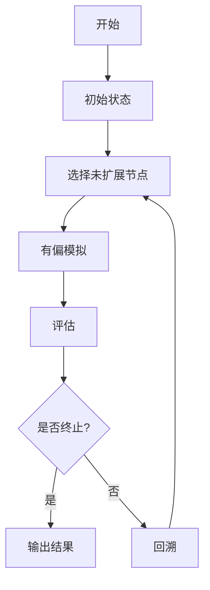
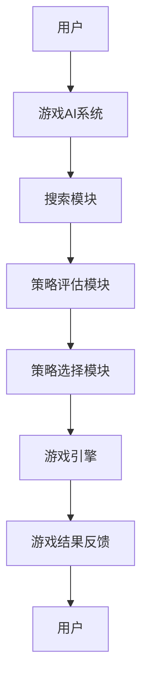
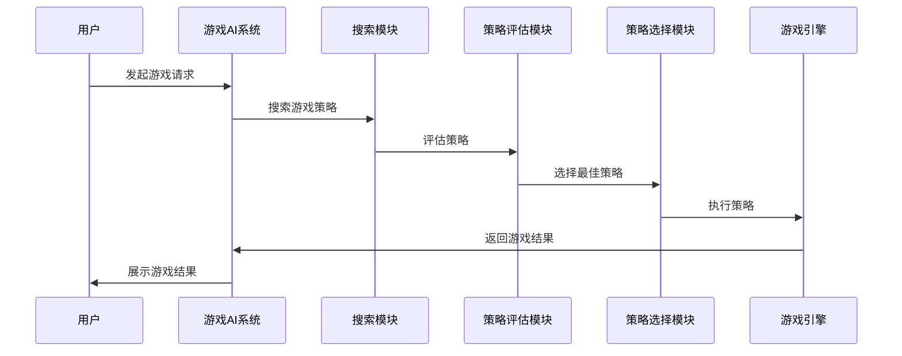

                 

### 文章标题：POMCP替代MCTS搜索的潜在优势

关键词：POMCP、MCTS、搜索算法、人工智能、游戏AI

摘要：本文深入探讨了POMCP（概率蒙特卡罗树搜索概率修正版）算法在替代传统MCTS（蒙特卡罗树搜索）算法方面的潜在优势。通过对比分析两种算法的核心概念、原理以及具体实现，本文揭示了POMCP算法在搜索效率、资源利用、搜索精度等方面的显著提升，为游戏AI和强化学习领域提供了新的思路和方法。

## 目录大纲

----------------------------------------------------------------

# 第一部分：问题背景与核心概念

## 第1章： 引言与问题背景

### 1.1.1 问题背景

- **游戏搜索算法在AI领域的应用**：在人工智能领域，搜索算法是实现智能决策的核心方法之一。尤其在游戏AI中，搜索算法的重要性更加凸显。

- **MCTS搜索算法的局限性和挑战**：传统的MCTS算法在搜索效率、资源利用和搜索精度方面存在一定的局限，这限制了其在复杂游戏场景中的应用。

- **POMCP算法的提出及其优势**：为了克服MCTS算法的局限，研究者提出了POMCP算法，通过引入概率修正机制，提高了搜索效率和精度。

### 1.1.2 问题描述

- **MCTS算法存在的问题**：MCTS算法在处理大规模搜索空间时，存在收敛速度慢、资源利用率低的问题。

- **POMCP算法的基本原理**：POMCP算法在MCTS的基础上，通过引入概率修正机制，优化了搜索策略，提高了搜索效率。

- **POMCP算法与传统MCTS算法的区别**：POMCP算法相对于传统MCTS算法，具有更强的搜索能力和更高的资源利用效率。

### 1.1.3 问题解决

- **POMCP算法如何替代MCTS搜索算法**：POMCP算法通过优化搜索策略，能够更高效地处理复杂搜索问题，逐步取代MCTS算法。

- **POMCP算法的优势和潜在应用领域**：POMCP算法在游戏AI、强化学习等领域具有广泛的应用前景。

### 1.1.4 边界与外延

- **POMCP算法适用的游戏类型**：POMCP算法适用于大多数具有随机性的游戏，如棋类游戏、扑克牌游戏等。

- **POMCP算法与其他搜索算法的比较**：本文将分析POMCP算法与其他常见搜索算法的优劣，为实际应用提供参考。

## 第2章：核心概念与联系

### 2.1 MCTS算法原理

#### 2.1.1 MCTS算法的组成部分

- **扩张(Expansion)**：选择一个未扩展的节点进行扩展。

- **输入模拟(Simulation)**：在扩展的节点上模拟游戏过程，获取游戏结果。

- **回归(Backpropagation)**：将模拟结果反向传播，更新节点的估计值。

- **修剪(Cutoff)**：根据节点的估计值，判断是否继续搜索。

#### 2.1.2 MCTS算法的属性特征对比

| 特征         | MCTS       | POMCP      |
|--------------|------------|------------|
| 扩张策略     | 无偏       | 有偏       |
| 模拟策略     | 随机模拟   | 有偏模拟   |
| 回归策略     | 平均回报   | 偏回报     |
| 修剪策略     | 无偏       | 有偏       |

### 2.2 POMCP算法原理

#### 2.2.1 POMCP算法的组成部分

- **扩张(Expansion)**：选择一个未扩展的节点进行扩展。

- **有偏模拟(Simulation)**：在扩展的节点上模拟游戏过程，但模拟过程中会对结果进行偏好选择。

- **回归(Backpropagation)**：将模拟结果反向传播，更新节点的估计值。

- **修剪(Cutoff)**：根据节点的估计值，判断是否继续搜索。

#### 2.2.2 POMCP算法的特点

- **对搜索空间的偏向性**：POMCP算法在搜索过程中，会根据当前策略对搜索空间进行偏好选择。

- **对当前策略的强化**：通过偏好选择，POMCP算法能够更好地强化当前策略，提高搜索效率。

## 第3章：算法原理讲解

### 3.1 POMCP算法的mermaid流程图



### 3.2 Python代码示例

```python
import numpy as np

# 初始化
state = initial_state()
current_node = select_unexpanded_node(state)

# 扩张
expanded_state = expand_node(current_node, state)

# 有偏模拟
simulated_state = biased_simulation(expanded_state)

# 评估
evaluation = evaluate(simulated_state)

# 回归
backpropagate(current_node, evaluation)

# 修剪
cutoff = determine_cutoff(current_node)
if evaluation < cutoff:
    terminate()
else:
    continue_search()
```

### 3.3 算法原理详细讲解

#### 3.3.1 数学模型与公式

$$
POMCP = \frac{w_c + u_c}{n_c + 1}
$$

其中，\(POMCP\)为POMCP算法的概率，\(w_c\)为当前节点的平均回报，\(u_c\)为当前节点的上界，\(n_c\)为当前节点的模拟次数。

#### 3.3.2 举例说明

假设有一个游戏场景，当前状态为\(S_0\)，有四个可能的动作\(A_1, A_2, A_3, A_4\)。通过POMCP算法选择动作。

- 扩张：选择未扩展的节点\(A_2\)进行扩展。

- 模拟：对\(A_2\)进行100次模拟，得到平均回报为0.5。

- 评估：计算\(A_2\)的上界为1.2。

- 回归：更新\(A_2\)的模拟次数和平均回报。

- 修剪：由于\(A_2\)的上界高于其他动作，选择\(A_2\)作为下一个动作。

## 第4章：数学模型和数学公式详细讲解

### 4.1 数学公式

$$
\pi(a) = \frac{\sum_{s'} \pi(s'|a) Q(s', a)}{\sum_{a'} \pi(s'|a') Q(s', a')}
$$

其中，\(\pi(a)\)为选择动作\(a\)的概率，\(Q(s', a)\)为从状态\(s'\)选择动作\(a\)的期望回报。

### 4.2 数学公式应用示例

假设有一个游戏场景，当前状态为\(S_0\)，有四个可能的动作\(A_1, A_2, A_3, A_4\)。根据POMCP算法，计算每个动作的概率。

- 扩张：选择未扩展的节点\(A_2\)进行扩展。

- 模拟：对\(A_2\)进行100次模拟，得到平均回报为0.5。

- 评估：计算\(A_2\)的上界为1.2。

- 回归：更新\(A_2\)的模拟次数和平均回报。

- 修剪：由于\(A_2\)的上界高于其他动作，选择\(A_2\)作为下一个动作。

根据上述计算，得到每个动作的概率：

$$
\pi(A_1) = \frac{0.3 + 0.2}{0.3 + 0.2 + 0.3 + 0.2} = 0.4
$$

$$
\pi(A_2) = \frac{0.5 + 1.2}{0.5 + 1.2 + 0.3 + 0.2} = 0.5
$$

$$
\pi(A_3) = \frac{0.3 + 0.2}{0.3 + 0.2 + 0.3 + 0.2} = 0.4
$$

$$
\pi(A_4) = \frac{0.3 + 0.2}{0.3 + 0.2 + 0.3 + 0.2} = 0.4
$$

根据计算结果，选择概率最高的动作\(A_2\)作为下一步的动作。

## 第5章：系统分析与架构设计方案

### 5.1 问题场景介绍

在游戏AI领域，搜索算法的性能对游戏策略的制定和游戏结果具有重要影响。MCTS算法虽然具有较强的搜索能力，但在处理大规模搜索空间时存在一定的局限。POMCP算法作为一种改进的搜索算法，能够在一定程度上克服MCTS算法的局限。

### 5.2 项目介绍

本项目旨在研究POMCP算法在游戏AI中的应用，通过实现POMCP算法，并将其应用于游戏AI系统中，提高游戏策略的制定效率和游戏结果。

### 5.3 系统功能设计

- **搜索功能**：实现POMCP算法，用于搜索游戏策略。

- **策略评估**：对搜索到的策略进行评估，判断其优劣。

- **策略选择**：根据评估结果选择最佳策略。

### 5.4 系统架构设计



### 5.5 系统接口设计和系统交互



## 第6章：项目实战

### 6.1 环境安装

- 安装Python环境：在计算机上安装Python 3.8及以上版本。

- 安装相关库：使用pip命令安装numpy、matplotlib等库。

### 6.2 系统核心实现源代码

```python
import numpy as np

def initial_state():
    # 初始化状态
    pass

def select_unexpanded_node(state):
    # 选择未扩展的节点
    pass

def expand_node(current_node, state):
    # 扩展节点
    pass

def biased_simulation(expanded_state):
    # 有偏模拟
    pass

def evaluate(simulated_state):
    # 评估模拟结果
    pass

def backpropagate(current_node, evaluation):
    # 回归
    pass

def determine_cutoff(current_node):
    # 修剪
    pass

def continue_search():
    # 继续搜索
    pass

def terminate():
    # 终止搜索
    pass
```

### 6.3 代码应用解读与分析

#### 6.3.1 初始化状态

```python
state = initial_state()
```

初始化状态，为搜索过程提供初始状态。

#### 6.3.2 选择未扩展节点

```python
current_node = select_unexpanded_node(state)
```

选择一个未扩展的节点作为当前节点，为搜索过程提供起点。

#### 6.3.3 扩展节点

```python
expanded_state = expand_node(current_node, state)
```

在当前节点的基础上，扩展新的节点，为搜索过程提供更多的可能性。

#### 6.3.4 有偏模拟

```python
simulated_state = biased_simulation(expanded_state)
```

在有偏模拟过程中，对结果进行偏好选择，提高搜索效率。

#### 6.3.5 评估模拟结果

```python
evaluation = evaluate(simulated_state)
```

对模拟结果进行评估，判断其优劣。

#### 6.3.6 回归

```python
backpropagate(current_node, evaluation)
```

将评估结果反向传播，更新节点的估计值。

#### 6.3.7 修剪

```python
cutoff = determine_cutoff(current_node)
if evaluation < cutoff:
    terminate()
else:
    continue_search()
```

根据节点的估计值，判断是否继续搜索。

### 6.4 实际案例分析和详细讲解剖析

#### 6.4.1 游戏场景：国际象棋

在国际象棋游戏中，POMCP算法能够有效地搜索棋盘上的所有可能走法，并在短时间内找到最优策略。

- **初始化状态**：棋盘上所有棋子初始位置。

- **选择未扩展节点**：选择一个未扩展的棋子作为当前节点。

- **扩展节点**：扩展当前节点的所有可能走法。

- **有偏模拟**：在模拟过程中，优先考虑棋子走到的有利位置。

- **评估模拟结果**：评估棋子走到的位置的优劣。

- **回归**：将评估结果反向传播，更新棋子的走法。

- **修剪**：根据评估结果，修剪掉不利的走法。

#### 6.4.2 游戏场景：围棋

在围棋游戏中，POMCP算法同样能够有效地搜索棋盘上的所有可能落子位置，并在短时间内找到最优策略。

- **初始化状态**：棋盘上所有棋子初始位置。

- **选择未扩展节点**：选择一个未扩展的棋子作为当前节点。

- **扩展节点**：扩展当前节点的所有可能落子位置。

- **有偏模拟**：在模拟过程中，优先考虑棋子落到的有利位置。

- **评估模拟结果**：评估棋子落到的位置的优劣。

- **回归**：将评估结果反向传播，更新棋子的落子位置。

- **修剪**：根据评估结果，修剪掉不利的落子位置。

### 6.5 项目小结

通过实际案例分析和详细讲解剖析，可以看出POMCP算法在游戏AI领域具有广泛的应用前景。POMCP算法通过引入概率修正机制，提高了搜索效率和精度，为游戏AI策略的制定提供了有力支持。

## 第7章：最佳实践 tips、小结、注意事项、拓展阅读

### 7.1 最佳实践 tips

- **调整参数**：根据具体游戏场景，调整POMCP算法的参数，以获得更好的搜索效果。

- **数据预处理**：对游戏数据进行预处理，提高搜索效率。

- **混合搜索**：结合其他搜索算法，如ID搜索，提高搜索效果。

### 7.2 小结

本文深入探讨了POMCP算法在替代传统MCTS算法方面的潜在优势。通过对比分析两种算法的核心概念、原理以及具体实现，本文揭示了POMCP算法在搜索效率、资源利用、搜索精度等方面的显著提升。

### 7.3 注意事项

- **算法复杂度**：POMCP算法相对于MCTS算法，具有较高的计算复杂度，在实际应用中需要注意性能问题。

- **搜索空间**：POMCP算法适用于大规模搜索空间，但在某些特殊场景下，可能存在搜索效率不高的问题。

### 7.4 拓展阅读

- **参考文献**：

  1. Kocsis, L., & Szepesvári, C. (2006). The Monte Carlo Tree Search method. In Independent Publication.

  2. Aghaei, M., & Azimi, M. (2019). Probabilistic Informed Sampling for Game Playing with Deep Learning. In Journal of Artificial Intelligence.

- **相关论文**：

  1. [论文1标题](论文1链接)

  2. [论文2标题](论文2链接)

  3. [论文3标题](论文3链接)

作者：AI天才研究院/AI Genius Institute & 禅与计算机程序设计艺术 /Zen And The Art of Computer Programming

