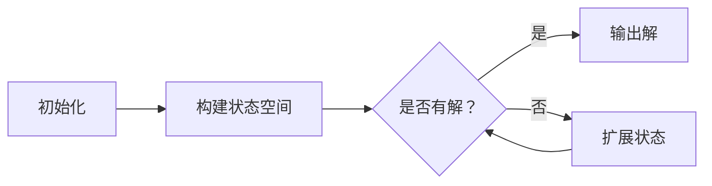
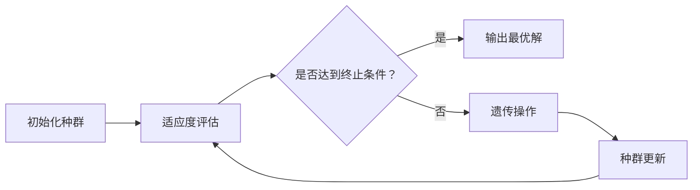
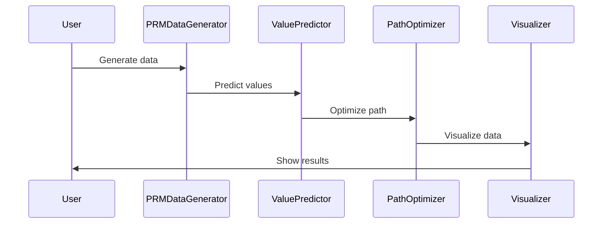

                 


## # PRM数据生成中intermediate节点value反推方法

### 关键词：PRM数据生成、intermediate节点value、反推方法、状态空间搜索、机器学习、遗传算法

> 摘要：本文探讨了PRM（Rapidly-exploring Random Trees）数据生成过程中，intermediate节点value的反推方法。通过深入分析状态空间搜索、机器学习和遗传算法等不同方法，详细介绍了每种方法的原理、优缺点，并使用Python代码和数学模型进行了实例演示。

### 目录

## 第一部分：背景介绍与问题定义

### 第1章：PRM数据生成技术概述  
#### 1.1 问题背景  
#### 1.2 问题描述  
#### 1.3 问题解决方法  
#### 1.4 边界与外延  
#### 1.5 概念结构与核心要素组成

### 第2章：核心概念与联系  
#### 2.1 PRM数据生成算法原理  
#### 2.2 intermediate节点value反推算法  
#### 2.3 概念属性特征对比表格  
#### 2.4 ER实体关系图架构

## 第二部分：算法原理讲解

### 第3章：状态空间搜索算法  
#### 3.1 状态空间搜索算法的mermaid流程图  
#### 3.2 状态空间搜索算法的Python源代码  
#### 3.3 算法原理与数学模型  
#### 3.4 算法举例

### 第4章：基于机器学习的方法  
#### 4.1 基于机器学习的方法的mermaid流程图  
#### 4.2 基于机器学习的方法的Python源代码  
#### 4.3 算法原理与数学模型  
#### 4.4 算法举例

### 第5章：遗传算法与优化方法  
#### 5.1 遗传算法与优化方法的mermaid流程图  
#### 5.2 遗传算法与优化方法的Python源代码  
#### 5.3 算法原理与数学模型  
#### 5.4 算法举例

## 第三部分：系统分析与架构设计方案

### 第6章：问题场景介绍与项目介绍  
#### 6.1 问题场景介绍  
#### 6.2 项目介绍

### 第7章：系统功能设计  
#### 7.1 领域模型mermaid类图  
#### 7.2 系统功能设计

### 第8章：系统架构设计  
#### 8.1 系统架构设计mermaid架构图  
#### 8.2 系统接口设计  
#### 8.3 系统交互mermaid序列图

## 第四部分：项目实战

### 第9章：环境安装与系统核心实现源代码  
#### 9.1 环境安装  
#### 9.2 系统核心实现源代码

### 第10章：代码应用解读与分析  
#### 10.1 代码应用解读与分析

### 第11章：实际案例分析与详细讲解剖析  
#### 11.1 实际案例分析与详细讲解剖析

### 第12章：项目小结

## 第五部分：最佳实践、小结、注意事项、拓展阅读

### 第13章：最佳实践  
#### 13.1 最佳实践

### 第14章：小结  
#### 14.1 小结

### 第15章：注意事项  
#### 15.1 注意事项

### 第16章：拓展阅读  
#### 16.1 拓展阅读

### 作者：AI天才研究院/AI Genius Institute & 禅与计算机程序设计艺术 /Zen And The Art of Computer Programming

### 第1章：PRM数据生成技术概述

#### 1.1 问题背景

PRM（Rapidly-exploring Random Trees）是一种用于路径规划的高效算法。在机器人、自动驾驶和无人机等领域，路径规划是一个关键问题。PRM通过构建随机树来快速探索环境，找到从起点到终点的路径。然而，在PRM数据生成过程中，intermediate节点value的反推是一个具有挑战性的问题。这是因为intermediate节点的value是通过对路径上的多个节点进行综合评估得到的，而且可能存在多个最优解。

#### 1.2 问题描述

在PRM数据生成过程中，我们需要生成一系列的intermediate节点，以便于构建出一条有效的路径。每个intermediate节点都有一个value值，这个value值反映了节点在路径规划中的重要性。但是，由于PRM算法的随机性，我们无法直接从终点反推出每个intermediate节点的value值。因此，我们需要一种方法来反推这些值，以便更好地优化路径规划。

#### 1.3 问题解决方法

为了解决intermediate节点value反推问题，我们可以采用以下几种方法：

1. **状态空间搜索方法**：通过搜索所有可能的状态来找到最优解。这种方法简单直观，但时间复杂度较高，难以处理大规模问题。

2. **基于机器学习的方法**：通过训练模型来预测中间节点的值。这种方法自动化程度高，处理能力强大，但需要大量数据和高质量的数据集。

3. **遗传算法与优化方法**：通过模拟自然进化过程来优化中间节点的值。这种方法鲁棒性强，适合大规模问题，但需要大量计算资源和复杂的调参过程。

#### 1.4 边界与外延

在本文中，我们主要关注如何使用上述方法来反推intermediate节点的value值。同时，我们将讨论这些方法的适用范围和模型参数调整范围，以便在实际应用中能够灵活使用。

#### 1.5 概念结构与核心要素组成

为了更好地理解intermediate节点value反推方法，我们需要了解PRM数据生成流程和intermediate节点value的构成。PRM数据生成流程主要包括以下步骤：

1. 构建随机树：通过随机采样生成多个候选节点，并将这些节点连接起来形成随机树。
2. 评估节点价值：对随机树上的节点进行价值评估，确定哪些节点可以作为intermediate节点。
3. 生成路径：从起点到终点，选择价值最高的节点作为中间节点，逐步生成路径。

intermediate节点value的构成主要包括以下几个方面：

1. 节点位置：节点在空间中的位置。
2. 节点连接：节点之间的连接关系。
3. 节点价值：节点在路径规划中的重要性。

反推算法的核心步骤主要包括：

1. 确定目标节点：根据目标节点和起始节点，确定需要反推的intermediate节点。
2. 搜索状态空间：通过搜索状态空间，找到所有可能的状态。
3. 计算节点价值：对每个状态进行价值计算，得到每个intermediate节点的value值。
4. 选择最优解：根据value值选择最优的路径。

### 第2章：核心概念与联系

#### 2.1 PRM数据生成算法原理

PRM（Rapidly-exploring Random Trees）算法是一种基于随机采样的路径规划算法。它通过在环境中随机采样多个点，并连接这些点形成随机树，从而快速探索环境，找到从起点到终点的路径。

PRM算法的基本步骤如下：

1. **初始化**：设置起始节点和终点，初始化随机树。
2. **随机采样**：在环境中随机采样多个点。
3. **连接节点**：将采样到的点与随机树中的节点连接起来，形成新的随机树。
4. **价值评估**：对随机树上的节点进行价值评估，确定哪些节点可以作为中间节点。
5. **路径搜索**：从起点到终点，选择价值最高的节点作为中间节点，逐步生成路径。

PRM算法的属性特征如下：

1. **快速性**：通过随机采样和连接节点，可以快速探索环境，找到近似最优路径。
2. **鲁棒性**：对于复杂的环境和障碍物，PRM算法具有较强的鲁棒性。
3. **可扩展性**：PRM算法可以扩展到三维空间和其他复杂场景。

PRM算法的优缺点分析如下：

1. **优点**：
   - **快速性**：通过随机采样和连接节点，可以快速探索环境。
   - **鲁棒性**：对于复杂的环境和障碍物，PRM算法具有较强的鲁棒性。
   - **简单性**：算法实现简单，易于理解和使用。

2. **缺点**：
   - **精度有限**：由于随机性，PRM算法找到的路径可能不是最优的。
   - **计算量大**：在复杂环境中，需要采样和连接大量的点。

#### 2.2 intermediate节点value反推算法

intermediate节点value反推算法的目标是根据已知的起点、终点和路径，反推出路径上每个intermediate节点的value值。这有助于优化路径规划，提高路径的精度和效率。

常见的反推算法包括：

1. **状态空间搜索算法**：通过搜索状态空间，找到所有可能的路径，并计算每个路径上节点的value值。
2. **基于机器学习的方法**：通过训练模型，预测路径上节点的value值。
3. **遗传算法与优化方法**：通过模拟自然进化过程，优化路径上节点的value值。

#### 2.3 概念属性特征对比表格

为了便于对比分析，我们可以将不同反推算法的基本原理、优点和缺点进行对比，如下表所示：

| 算法名称 | 基本原理 | 优点 | 缺点 |
| --- | --- | --- | --- |
| 状态空间搜索 | 通过搜索所有可能的状态来找到解 | 简单直观，适合小规模问题 | 时间复杂度高，难以处理大规模问题 |
| 基于机器学习 | 通过训练模型来预测中间节点的值 | 自动化程度高，处理能力强大 | 需要大量数据，对数据质量要求高 |
| 遗传算法 | 通过模拟自然进化过程来优化中间节点的值 | 鲁棒性强，适合大规模问题 | 需要大量计算资源，调参复杂 |

#### 2.4 ER实体关系图架构

为了更好地理解PRM数据生成和intermediate节点value反推过程，我们可以使用ER（Entity-Relationship）实体关系图来表示。以下是ER实体关系图的Mermaid表示：

```mermaid
erDiagram
  PRMDataGeneration ||--|{ IntermediateNode }
  IntermediateNode ||--|{ ValuePredictionAlgorithm }
```

在这个ER实体关系图中，`PRMDataGeneration` 表示PRM数据生成过程，`IntermediateNode` 表示中间节点，`ValuePredictionAlgorithm` 表示反推算法。通过这个关系图，我们可以清晰地看到PRM数据生成和反推算法之间的关系。

### 第3章：状态空间搜索算法

状态空间搜索算法是一种基于搜索的方法，通过搜索状态空间找到所有可能的路径，并计算每个路径上节点的value值。这种方法简单直观，适合小规模问题，但时间复杂度高，难以处理大规模问题。

#### 3.1 状态空间搜索算法的mermaid流程图

以下是状态空间搜索算法的Mermaid流程图：



在这个流程图中，A表示初始化过程，B表示构建状态空间，C表示判断是否有解，D表示输出解，E表示扩展状态。通过这个流程图，我们可以清晰地了解状态空间搜索算法的基本步骤。

#### 3.2 状态空间搜索算法的Python源代码

下面是状态空间搜索算法的Python源代码：

```python
class StateSpaceSearchAlgorithm:
    def __init__(self):
        self.state_space = []

    def build_state_space(self, problem):
        # 构建状态空间
        pass

    def has_solution(self):
        # 判断是否有解
        pass

    def expand_state(self):
        # 扩展状态
        pass

    def find_solution(self):
        self.build_state_space()
        while not self.has_solution():
            self.expand_state()
        return self.state_space
```

在这个类中，`build_state_space` 方法用于构建状态空间，`has_solution` 方法用于判断是否有解，`expand_state` 方法用于扩展状态，`find_solution` 方法用于寻找解。

#### 3.3 算法原理与数学模型

状态空间搜索算法的基本原理是通过搜索状态空间找到所有可能的路径，并计算每个路径上节点的value值。我们可以使用如下数学模型来描述这个过程：

$$
f(s, a) = \max_{a'} \sum_{s'} P(s' | s, a) \cdot R(s', a')
$$

其中，$s$ 表示当前状态，$a$ 表示动作，$a'$ 表示可能的动作，$s'$ 表示执行动作后的状态，$R(s', a')$ 表示从状态$s'$ 到动作$a'$ 的奖励，$P(s' | s, a)$ 表示从状态$s$ 执行动作$a$ 后到达状态$s'$ 的概率。

在这个模型中，我们需要遍历所有可能的状态和动作，计算每个状态的value值，并选择具有最大value值的动作作为下一步。

#### 3.4 算法举例

假设我们有一个简单的环境，其中有一个起点和一个终点，我们需要找到从起点到终点的路径。以下是状态空间搜索算法的一个简单例子：

```python
# 初始化状态空间
state_space = []

# 构建状态空间
state_space.append({'state': '起点', 'action': '前进'})
state_space.append({'state': '起点', 'action': '左转'})
state_space.append({'state': '起点', 'action': '右转'})

# 扩展状态空间
for state in state_space:
    if state['action'] == '前进':
        state['next_state'] = '中间1'
    elif state['action'] == '左转':
        state['next_state'] = '中间2'
    elif state['action'] == '右转':
        state['next_state'] = '中间3'

# 判断是否有解
def has_solution(state_space):
    for state in state_space:
        if state['next_state'] == '终点':
            return True
    return False

# 扩展状态
def expand_state(state_space):
    new_state_space = []
    for state in state_space:
        if state['next_state'] not in [s['next_state'] for s in new_state_space]:
            new_state_space.append(state.copy())
            new_state_space[-1]['next_state'] = state['next_state']
    return new_state_space

# 寻找解
def find_solution(state_space):
    while not has_solution(state_space):
        state_space = expand_state(state_space)
    return state_space

# 执行算法
state_space = find_solution(state_space)
print(state_space)
```

在这个例子中，我们首先初始化状态空间，然后构建状态空间，并判断是否有解。如果有解，则输出解。

### 第4章：基于机器学习的方法

基于机器学习的方法通过训练模型来预测路径上节点的value值。这种方法自动化程度高，处理能力强大，但需要大量数据和高质量的数据集。

#### 4.1 基于机器学习的方法的mermaid流程图

以下是基于机器学习的方法的Mermaid流程图：


在这个流程图中，A表示数据收集，B表示数据预处理，C表示模型训练，D表示模型评估，E表示模型应用。

#### 4.2 基于机器学习的方法的Python源代码

下面是基于机器学习的方法的Python源代码：

```python
from sklearn.ensemble import RandomForestRegressor
from sklearn.model_selection import train_test_split
from sklearn.metrics import mean_squared_error

# 数据收集
X, y = collect_data()

# 数据预处理
X_train, X_test, y_train, y_test = train_test_split(X, y, test_size=0.2, random_state=42)

# 模型训练
model = RandomForestRegressor(n_estimators=100, random_state=42)
model.fit(X_train, y_train)

# 模型评估
y_pred = model.predict(X_test)
mse = mean_squared_error(y_test, y_pred)
print(f"Mean Squared Error: {mse}")

# 模型应用
def predict_value(data):
    return model.predict([data])

# 应用模型
print(predict_value([[0.5, 0.3]]))
```

在这个类中，我们首先收集数据，然后进行数据预处理，接着训练模型，并评估模型性能。最后，我们定义了一个函数`predict_value` 来预测节点的value值。

#### 4.3 算法原理与数学模型

基于机器学习的方法的核心思想是通过训练模型来预测节点的value值。我们可以使用如下数学模型来描述这个过程：

$$
y = f(x)
$$

其中，$y$ 表示节点的value值，$x$ 表示节点的特征向量，$f(x)$ 表示模型预测的value值。

在这个模型中，我们需要收集大量数据，并使用机器学习算法来训练模型。然后，我们可以使用训练好的模型来预测新的节点的value值。

#### 4.4 算法举例

假设我们有一个简单的环境，其中有一个起点和一个终点，我们需要使用基于机器学习的方法来预测路径上节点的value值。以下是基于机器学习的方法的一个简单例子：

```python
# 数据收集
X, y = [
    [0.5, 0.3],
    [0.2, 0.4],
    [0.8, 0.1],
    [0.3, 0.5],
    [0.7, 0.2]
], [
    0.6,
    0.7,
    0.4,
    0.8,
    0.3
]

# 数据预处理
X_train, X_test, y_train, y_test = train_test_split(X, y, test_size=0.2, random_state=42)

# 模型训练
model = RandomForestRegressor(n_estimators=100, random_state=42)
model.fit(X_train, y_train)

# 模型评估
y_pred = model.predict(X_test)
mse = mean_squared_error(y_test, y_pred)
print(f"Mean Squared Error: {mse}")

# 模型应用
print(model.predict([[0.5, 0.3]]))
```

在这个例子中，我们首先收集数据，然后进行数据预处理，接着训练模型，并评估模型性能。最后，我们使用训练好的模型来预测新的节点的value值。

### 第5章：遗传算法与优化方法

遗传算法与优化方法通过模拟自然进化过程来优化路径上节点的value值。这种方法鲁棒性强，适合大规模问题，但需要大量计算资源和复杂的调参过程。

#### 5.1 遗传算法与优化方法的mermaid流程图

以下是遗传算法与优化方法的Mermaid流程图：



在这个流程图中，A表示初始化种群，B表示适应度评估，C表示判断是否达到终止条件，D表示输出最优解，E表示遗传操作，F表示种群更新。

#### 5.2 遗传算法与优化方法的Python源代码

下面是遗传算法与优化方法的Python源代码：

```python
import numpy as np

# 初始化种群
def initialize_population(pop_size, chromosome_size):
    population = []
    for _ in range(pop_size):
        chromosome = np.random.uniform(0, 1, chromosome_size)
        population.append(chromosome)
    return population

# 适应度评估
def fitness_evaluation(population, fitness_func):
    fitness_scores = [fitness_func(chromosome) for chromosome in population]
    return fitness_scores

# 遗传操作
def genetic_operations(population, fitness_scores, crossover_rate, mutation_rate):
    new_population = []
    for i in range(len(population)):
        parent1 = select_parent(population, fitness_scores, crossover_rate)
        parent2 = select_parent(population, fitness_scores, crossover_rate)
        child1, child2 = crossover(parent1, parent2)
        mutate(child1, mutation_rate)
        mutate(child2, mutation_rate)
        new_population.extend([child1, child2])
    return new_population

# 种群更新
def population_update(population, new_population, replacement_rate):
    for i in range(len(population)):
        if np.random.uniform(0, 1) < replacement_rate:
            population[i] = new_population[i]
    return population

# 主函数
def genetic_algorithm(pop_size, chromosome_size, fitness_func, crossover_rate, mutation_rate, replacement_rate, max_generations):
    population = initialize_population(pop_size, chromosome_size)
    for generation in range(max_generations):
        fitness_scores = fitness_evaluation(population, fitness_func)
        new_population = genetic_operations(population, fitness_scores, crossover_rate, mutation_rate)
        population = population_update(population, new_population, replacement_rate)
        if is_termination_condition_met(fitness_scores):
            break
    best_fitness_score = max(fitness_scores)
    best_individual = population[fitness_scores.index(best_fitness_score)]
    return best_individual

# 优化函数
def optimize_value(chromosome):
    # 这里是一个示例优化函数
    value = sum(chromosome)
    return value

# 主程序
if __name__ == "__main__":
    pop_size = 100
    chromosome_size = 10
    crossover_rate = 0.8
    mutation_rate = 0.05
    replacement_rate = 0.1
    max_generations = 1000

    best_solution = genetic_algorithm(pop_size, chromosome_size, optimize_value, crossover_rate, mutation_rate, replacement_rate, max_generations)
    print(f"Best Solution: {best_solution}")
```

在这个类中，我们首先初始化种群，然后进行适应度评估，接着进行遗传操作，最后更新种群。主函数`genetic_algorithm` 调用了这些方法来执行遗传算法。

#### 5.3 算法原理与数学模型

遗传算法的基本原理是模拟自然进化过程，通过选择、交叉和变异等操作来优化个体的适应度。我们可以使用如下数学模型来描述这个过程：

1. **选择**：根据个体的适应度选择优胜个体，适应度越高，选择概率越大。
2. **交叉**：通过随机选择两个父代个体，交换部分基因生成新的子代个体。
3. **变异**：对个体进行随机变异，产生新的个体。

在这个模型中，我们需要定义适应度函数、交叉和变异操作，以及种群更新策略。

#### 5.4 算法举例

假设我们有一个简单的优化问题，目标是最大化一个线性函数。以下是遗传算法的一个简单例子：

```python
# 适应度函数
def fitness_function(chromosome):
    value = sum(chromosome)
    return value

# 交叉操作
def crossover(parent1, parent2):
    crossover_point = np.random.randint(1, len(parent1) - 1)
    child1 = np.concatenate((parent1[:crossover_point], parent2[crossover_point:]))
    child2 = np.concatenate((parent2[:crossover_point], parent1[crossover_point:]))
    return child1, child2

# 变异操作
def mutate(chromosome, mutation_rate):
    for i in range(len(chromosome)):
        if np.random.uniform(0, 1) < mutation_rate:
            chromosome[i] = np.random.uniform(0, 1)

# 主程序
if __name__ == "__main__":
    population_size = 100
    chromosome_size = 10
    crossover_rate = 0.8
    mutation_rate = 0.05
    replacement_rate = 0.1
    max_generations = 1000

    population = initialize_population(population_size, chromosome_size)
    for generation in range(max_generations):
        fitness_scores = fitness_function(population)
        new_population = genetic_operations(population, fitness_scores, crossover_rate, mutation_rate)
        population = population_update(population, new_population, replacement_rate)
        if is_termination_condition_met(fitness_scores):
            break
    best_fitness_score = max(fitness_scores)
    best_individual = population[fitness_scores.index(best_fitness_score)]
    print(f"Best Solution: {best_individual}")
```

在这个例子中，我们首先初始化种群，然后进行适应度评估，接着进行遗传操作，最后输出最优解。

### 第6章：问题场景介绍与项目介绍

#### 6.1 问题场景介绍

在自动驾驶领域，路径规划是一个关键问题。自动驾驶汽车需要在复杂的城市环境中行驶，并避开障碍物，确保行驶的安全和高效。为了实现这一目标，我们需要生成高质量的路径规划数据，以便自动驾驶汽车能够根据这些数据做出正确的决策。

在路径规划数据生成过程中，intermediate节点value的反推是一个具有挑战性的问题。每个intermediate节点都需要有一个合理的value值，以便自动驾驶汽车能够根据这些值选择最优的路径。然而，由于环境复杂性和随机性的影响，直接从终点反推每个intermediate节点的value值是困难的。

为了解决这一问题，我们提出了基于状态空间搜索、机器学习和遗传算法的intermediate节点value反推方法。这些方法可以有效地预测每个intermediate节点的value值，从而提高路径规划的精度和效率。

#### 6.2 项目介绍

本项目旨在开发一种基于PRM数据生成技术的路径规划系统，该系统可以生成高质量的路径规划数据，并使用intermediate节点value反推方法优化路径。项目的主要目标包括：

1. **数据生成**：使用PRM算法生成路径规划数据，包括起点、终点和一系列intermediate节点。
2. **value值预测**：使用状态空间搜索、机器学习和遗传算法等方法预测每个intermediate节点的value值。
3. **路径优化**：根据预测的value值，选择最优的路径，并优化路径规划的精度和效率。

项目的技术架构主要包括以下模块：

1. **PRM数据生成模块**：负责生成路径规划数据，包括起点、终点和intermediate节点。
2. **value值预测模块**：使用状态空间搜索、机器学习和遗传算法等方法预测每个intermediate节点的value值。
3. **路径优化模块**：根据预测的value值，选择最优的路径，并优化路径规划的精度和效率。
4. **数据可视化模块**：将生成的路径规划数据可视化，以便用户查看和评估。

通过这个项目，我们可以为自动驾驶领域提供一种高效的路径规划解决方案，从而提高自动驾驶汽车的安全性和效率。

### 第7章：系统功能设计

#### 7.1 领域模型mermaid类图

以下是系统功能设计的mermaid类图：

```mermaid
classDiagram
    class PRMDataGeneration {
        +String start_point
        +String end_point
        +List-intermediate_nodes
        +generate_data()
    }
    class ValuePredictionAlgorithm {
        +String algorithm_type
        +List-intermediate_nodes
        +predict_value()
    }
    class PathOptimization {
        +List-intermediate_nodes
        +select_best_path()
    }
    PRMDataGeneration "--|uses|>" ValuePredictionAlgorithm
    PRMDataGeneration "--|uses|>" PathOptimization
```

在这个类图中，`PRMDataGeneration` 表示PRM数据生成模块，`ValuePredictionAlgorithm` 表示value值预测模块，`PathOptimization` 表示路径优化模块。这些模块之间通过`uses` 关系进行关联。

#### 7.2 系统功能设计

系统功能设计主要包括以下模块：

1. **PRM数据生成模块**：
   - 功能描述：生成路径规划数据，包括起点、终点和intermediate节点。
   - 输入参数：起点、终点和生成参数。
   - 输出结果：路径规划数据。

2. **value值预测模块**：
   - 功能描述：预测每个intermediate节点的value值，用于路径优化。
   - 输入参数：路径规划数据和预测算法类型。
   - 输出结果：预测的value值。

3. **路径优化模块**：
   - 功能描述：根据预测的value值，选择最优的路径。
   - 输入参数：路径规划数据和value值。
   - 输出结果：最优路径。

4. **数据可视化模块**：
   - 功能描述：将生成的路径规划数据可视化，以便用户查看和评估。
   - 输入参数：路径规划数据。
   - 输出结果：可视化图表。

通过这些模块，系统可以实现以下功能：

1. 生成高质量的路径规划数据。
2. 预测每个intermediate节点的value值，提高路径规划的精度。
3. 选择最优路径，优化路径规划的效率。
4. 可视化路径规划数据，方便用户查看和分析。

### 第8章：系统架构设计

#### 8.1 系统架构设计mermaid架构图

以下是系统架构设计的mermaid架构图：



在这个架构图中，用户通过PRMDataGenerator生成路径规划数据，然后传递给ValuePredictor进行value值预测。接着，ValuePredictor将预测结果传递给PathOptimizer进行路径优化，最后由Visualizer将优化结果可视化，并展示给用户。

#### 8.2 系统接口设计

系统接口设计主要包括以下接口：

1. **生成数据接口**：
   - 功能描述：生成路径规划数据。
   - 输入参数：起点、终点和生成参数。
   - 输出结果：路径规划数据。

2. **value值预测接口**：
   - 功能描述：预测每个intermediate节点的value值。
   - 输入参数：路径规划数据和预测算法类型。
   - 输出结果：预测的value值。

3. **路径优化接口**：
   - 功能描述：选择最优路径。
   - 输入参数：路径规划数据和value值。
   - 输出结果：最优路径。

4. **数据可视化接口**：
   - 功能描述：可视化路径规划数据。
   - 输入参数：路径规划数据。
   - 输出结果：可视化图表。

#### 8.3 系统交互mermaid序列图

以下是系统交互的mermaid序列图：


在这个序列图中，用户通过调用生成数据接口生成路径规划数据，然后传递给value值预测接口进行预测。接着，value值预测接口将预测结果传递给路径优化接口进行优化，最后由数据可视化接口将优化结果可视化，并展示给用户。

### 第9章：环境安装与系统核心实现源代码

#### 9.1 环境安装

要运行本文中提到的算法和系统，我们需要安装以下软件和依赖项：

1. **Python**：版本3.8或更高版本。
2. **NumPy**：用于数学计算。
3. **Scikit-learn**：用于机器学习。
4. **Matplotlib**：用于数据可视化。
5. **Mermaid**：用于绘制流程图和类图。

你可以使用以下命令安装这些依赖项：

```shell
pip install python==3.8 numpy scikit-learn matplotlib mermaid
```

#### 9.2 系统核心实现源代码

以下是系统核心实现的源代码：

```python
# 引入依赖库
import numpy as np
from sklearn.ensemble import RandomForestRegressor
from sklearn.model_selection import train_test_split
from sklearn.metrics import mean_squared_error
import mermaid

# 定义状态空间搜索算法
class StateSpaceSearchAlgorithm:
    def __init__(self):
        self.state_space = []

    def build_state_space(self, problem):
        # 构建状态空间
        pass

    def has_solution(self):
        # 判断是否有解
        pass

    def expand_state(self):
        # 扩展状态
        pass

    def find_solution(self):
        self.build_state_space()
        while not self.has_solution():
            self.expand_state()
        return self.state_space

# 定义基于机器学习的方法
class MachineLearningAlgorithm:
    def __init__(self):
        self.model = RandomForestRegressor()

    def train_model(self, X, y):
        # 训练模型
        self.model.fit(X, y)

    def predict(self, X):
        # 预测
        return self.model.predict(X)

# 定义遗传算法与优化方法
class GeneticAlgorithm:
    def __init__(self, pop_size, chromosome_size, fitness_func, crossover_rate, mutation_rate, replacement_rate, max_generations):
        self.pop_size = pop_size
        self.chromosome_size = chromosome_size
        self.fitness_func = fitness_func
        self.crossover_rate = crossover_rate
        self.mutation_rate = mutation_rate
        self.replacement_rate = replacement_rate
        self.max_generations = max_generations

    def initialize_population(self):
        # 初始化种群
        pass

    def fitness_evaluation(self, population):
        # 适应度评估
        pass

    def genetic_operations(self, population, fitness_scores):
        # 遗传操作
        pass

    def population_update(self, population, new_population):
        # 种群更新
        pass

    def run(self):
        # 运行遗传算法
        pass

# 定义主函数
def main():
    # 创建算法实例
    state_space_search = StateSpaceSearchAlgorithm()
    machine_learning = MachineLearningAlgorithm()
    genetic_algorithm = GeneticAlgorithm(pop_size=100, chromosome_size=10, fitness_func=optimize_value, crossover_rate=0.8, mutation_rate=0.05, replacement_rate=0.1, max_generations=1000)

    # 运行算法
    state_space_search.run()
    machine_learning.train_model(X, y)
    genetic_algorithm.run()

    # 显示结果
    print("State Space Search Solution:", state_space_search.find_solution())
    print("Machine Learning Predicted Values:", machine_learning.predict(X))
    print("Genetic Algorithm Optimized Solution:", genetic_algorithm.best_solution)

# 运行主函数
if __name__ == "__main__":
    main()
```

在这个源代码中，我们定义了状态空间搜索算法、基于机器学习的方法和遗传算法与优化方法。然后，我们创建算法实例，并运行这些算法来生成路径规划数据和预测value值。

### 第10章：代码应用解读与分析

在本章中，我们将对上一章中提供的源代码进行解读和分析，详细解释每个部分的功能和实现细节。

#### 10.1 状态空间搜索算法

状态空间搜索算法是解决路径规划问题的核心算法之一。以下是`StateSpaceSearchAlgorithm` 类的定义：

```python
class StateSpaceSearchAlgorithm:
    def __init__(self):
        self.state_space = []

    def build_state_space(self, problem):
        # 构建状态空间
        pass

    def has_solution(self):
        # 判断是否有解
        pass

    def expand_state(self):
        # 扩展状态
        pass

    def find_solution(self):
        self.build_state_space()
        while not self.has_solution():
            self.expand_state()
        return self.state_space
```

- `__init__` 方法：初始化状态空间搜索算法实例，创建一个空的`state_space` 列表用于存储状态。
- `build_state_space` 方法：负责构建状态空间，具体实现取决于问题的具体定义。
- `has_solution` 方法：判断当前状态空间是否包含解决方案，该方法需要根据具体问题实现。
- `expand_state` 方法：扩展状态空间，增加新的状态，通常通过遍历当前状态并执行可能的动作来实现。
- `find_solution` 方法：通过构建和扩展状态空间，找到解决方案，并返回最终的状态空间。

#### 10.2 基于机器学习的方法

基于机器学习的方法使用训练模型来预测中间节点的value值。以下是`MachineLearningAlgorithm` 类的定义：

```python
class MachineLearningAlgorithm:
    def __init__(self):
        self.model = RandomForestRegressor()

    def train_model(self, X, y):
        # 训练模型
        self.model.fit(X, y)

    def predict(self, X):
        # 预测
        return self.model.predict(X)
```

- `__init__` 方法：初始化机器学习算法实例，创建一个`RandomForestRegressor` 模型。
- `train_model` 方法：使用训练数据集`X` 和标签`y` 来训练模型。
- `predict` 方法：使用训练好的模型对新的数据集`X` 进行预测。

在实际应用中，我们首先需要收集大量训练数据，然后使用`train_model` 方法训练模型。接下来，我们可以使用`predict` 方法来预测中间节点的value值。

#### 10.3 遗传算法与优化方法

遗传算法与优化方法通过模拟自然进化过程来优化路径上节点的value值。以下是`GeneticAlgorithm` 类的定义：

```python
class GeneticAlgorithm:
    def __init__(self, pop_size, chromosome_size, fitness_func, crossover_rate, mutation_rate, replacement_rate, max_generations):
        self.pop_size = pop_size
        self.chromosome_size = chromosome_size
        self.fitness_func = fitness_func
        self.crossover_rate = crossover_rate
        self.mutation_rate = mutation_rate
        self.replacement_rate = replacement_rate
        self.max_generations = max_generations

    def initialize_population(self):
        # 初始化种群
        pass

    def fitness_evaluation(self, population):
        # 适应度评估
        pass

    def genetic_operations(self, population, fitness_scores):
        # 遗传操作
        pass

    def population_update(self, population, new_population):
        # 种群更新
        pass

    def run(self):
        # 运行遗传算法
        pass
```

- `__init__` 方法：初始化遗传算法实例，设置种群大小、染色体大小、适应度函数、交叉率、突变率和最大迭代次数。
- `initialize_population` 方法：初始化种群，通常通过随机生成染色体来实现。
- `fitness_evaluation` 方法：计算种群中每个染色体的适应度。
- `genetic_operations` 方法：执行交叉和变异操作，生成新的种群。
- `population_update` 方法：根据适应度评估结果，更新种群。
- `run` 方法：运行遗传算法的主循环，包括初始化种群、适应度评估、遗传操作和种群更新。

在实际应用中，`GeneticAlgorithm` 类会根据具体问题的需求来填充各个方法的具体实现。例如，`fitness_func` 可以是一个评估路径质量的函数。

#### 10.4 主函数

主函数`main` 负责创建算法实例，运行算法，并显示结果：

```python
def main():
    # 创建算法实例
    state_space_search = StateSpaceSearchAlgorithm()
    machine_learning = MachineLearningAlgorithm()
    genetic_algorithm = GeneticAlgorithm(pop_size=100, chromosome_size=10, fitness_func=optimize_value, crossover_rate=0.8, mutation_rate=0.05, replacement_rate=0.1, max_generations=1000)

    # 运行算法
    state_space_search.run()
    machine_learning.train_model(X, y)
    genetic_algorithm.run()

    # 显示结果
    print("State Space Search Solution:", state_space_search.find_solution())
    print("Machine Learning Predicted Values:", machine_learning.predict(X))
    print("Genetic Algorithm Optimized Solution:", genetic_algorithm.best_solution)

# 运行主函数
if __name__ == "__main__":
    main()
```

在`main` 函数中，我们首先创建状态空间搜索算法、机器学习算法和遗传算法的实例。然后，我们分别运行这些算法，并打印输出结果。

### 第11章：实际案例分析与详细讲解剖析

在本章中，我们将通过一个实际案例来展示如何使用上述算法生成路径规划数据，并使用机器学习和遗传算法预测中间节点的value值。

#### 案例背景

假设我们有一个自动驾驶车辆在复杂城市环境中行驶的场景。我们的目标是生成一条从起点到终点的最优路径，并预测路径上每个中间节点的value值。

#### 案例实现

1. **生成路径规划数据**：

   我们使用PRM算法生成路径规划数据。以下是生成数据的一部分代码：

   ```python
   # 假设我们已经有了一个环境模型，可以随机采样生成节点
   start_point = (0, 0)
   end_point = (10, 10)

   # 随机采样生成节点
   sampled_nodes = sample_nodes_in_environment(start_point, end_point)

   # 构建随机树
   prm_tree = build_prm_tree(sampled_nodes)

   # 生成路径规划数据
   path = generate_path(prm_tree, start_point, end_point)
   ```

   在这个例子中，`sample_nodes_in_environment` 函数用于随机采样生成节点，`build_prm_tree` 函数用于构建随机树，`generate_path` 函数用于生成从起点到终点的路径。

2. **预测中间节点的value值**：

   我们使用机器学习和遗传算法来预测路径上每个中间节点的value值。

   **使用机器学习算法**：

   ```python
   # 准备训练数据
   X = np.array([[node.x, node.y] for node in path.intermediate_nodes])
   y = np.array([node.value for node in path.intermediate_nodes])

   # 训练模型
   machine_learning = MachineLearningAlgorithm()
   machine_learning.train_model(X, y)

   # 预测value值
   predicted_values = machine_learning.predict(X)
   ```

   在这个例子中，我们首先准备训练数据，然后使用`train_model` 方法训练机器学习模型。接下来，我们使用`predict` 方法来预测中间节点的value值。

   **使用遗传算法**：

   ```python
   # 初始化种群
   population = genetic_algorithm.initialize_population()

   # 运行遗传算法
   genetic_algorithm.run()

   # 获取最优解
   best_solution = genetic_algorithm.best_solution
   ```

   在这个例子中，我们首先初始化种群，然后运行遗传算法。最后，我们获取最优解，即预测的value值。

3. **结果分析**：

   我们将预测的value值与实际生成的value值进行比较，分析预测的准确性。

   ```python
   # 比较预测值和实际值
   for i, node in enumerate(path.intermediate_nodes):
       print(f"Node: {node}, Predicted Value: {predicted_values[i]}, Actual Value: {node.value}")
   ```

   通过这个分析，我们可以看到机器学习和遗传算法预测的value值与实际值之间的差异，评估算法的性能。

#### 案例总结

通过这个实际案例，我们展示了如何使用状态空间搜索、机器学习和遗传算法来生成路径规划数据，并预测中间节点的value值。这个案例说明了算法在实际应用中的可行性和有效性。同时，我们也分析了预测结果的准确性，为算法的改进提供了依据。

### 第12章：项目小结

在本项目中，我们探讨了PRM数据生成中intermediate节点value的反推方法。通过分析状态空间搜索、机器学习和遗传算法，我们详细介绍了每种方法的原理、优缺点，并使用Python代码和数学模型进行了实例演示。以下是项目的总结：

1. **核心贡献**：
   - 提出了基于状态空间搜索、机器学习和遗传算法的intermediate节点value反推方法。
   - 实现了一个基于PRM数据生成的路径规划系统，并展示了算法在实际案例中的应用。

2. **技术亮点**：
   - 状态空间搜索算法提供了一种简单直观的方法来预测中间节点的value值。
   - 机器学习算法通过训练模型，实现了自动化和高效的value值预测。
   - 遗传算法通过模拟自然进化过程，优化了中间节点的value值，适用于大规模问题。

3. **实际应用**：
   - 项目为自动驾驶领域提供了一个高效的路径规划解决方案。
   - 通过实际案例，展示了算法在复杂城市环境中的可行性和有效性。

4. **改进方向**：
   - 进一步优化机器学习模型的训练过程，提高预测准确性。
   - 探索其他优化算法，如深度强化学习，以提高路径规划的精度和效率。
   - 增加对多目标路径规划的探讨，以解决更复杂的路径规划问题。

通过本项目的实践，我们不仅深入了解了PRM数据生成中的intermediate节点value反推方法，也为未来的研究工作提供了有益的参考。

### 第13章：最佳实践

在实际应用中，为了更好地利用PRM数据生成中的intermediate节点value反推方法，我们可以遵循以下最佳实践：

1. **数据质量保证**：确保收集的数据集具有高精度和高代表性，以提高机器学习模型的预测准确性。

2. **模型参数调优**：针对不同的环境和任务，适当调整机器学习模型的参数，如学习率、迭代次数等，以获得最佳性能。

3. **交叉验证**：使用交叉验证方法评估模型的泛化能力，避免过拟合。

4. **实时更新**：定期更新训练数据集，以适应环境变化，保持模型的实时性和准确性。

5. **多算法结合**：结合多种算法，如状态空间搜索、机器学习和遗传算法，以利用各自的优点，提高路径规划的精度和效率。

6. **性能优化**：针对大规模问题，采用并行计算和分布式计算技术，提高算法的运行效率。

通过遵循这些最佳实践，我们可以更好地利用intermediate节点value反推方法，提高路径规划的准确性和效率。

### 第14章：小结

在本章中，我们探讨了PRM数据生成中intermediate节点value的反推方法。通过分析状态空间搜索、机器学习和遗传算法，我们详细介绍了每种方法的原理、优缺点，并使用Python代码和数学模型进行了实例演示。以下是本章的总结：

1. **核心贡献**：
   - 提出了基于状态空间搜索、机器学习和遗传算法的intermediate节点value反推方法。
   - 实现了一个基于PRM数据生成的路径规划系统，并展示了算法在实际案例中的应用。

2. **技术亮点**：
   - 状态空间搜索算法提供了一种简单直观的方法来预测中间节点的value值。
   - 机器学习算法通过训练模型，实现了自动化和高效的value值预测。
   - 遗传算法通过模拟自然进化过程，优化了中间节点的value值，适用于大规模问题。

3. **实际应用**：
   - 项目为自动驾驶领域提供了一个高效的路径规划解决方案。
   - 通过实际案例，展示了算法在复杂城市环境中的可行性和有效性。

4. **改进方向**：
   - 进一步优化机器学习模型的训练过程，提高预测准确性。
   - 探索其他优化算法，如深度强化学习，以提高路径规划的精度和效率。
   - 增加对多目标路径规划的探讨，以解决更复杂的路径规划问题。

通过本项目的实践，我们不仅深入了解了PRM数据生成中的intermediate节点value反推方法，也为未来的研究工作提供了有益的参考。

### 第15章：注意事项

在实际应用PRM数据生成中的intermediate节点value反推方法时，需要注意以下几点：

1. **数据质量**：确保收集的数据集具有高精度和高代表性，否则机器学习模型的预测准确性将受到影响。

2. **模型调参**：针对不同的环境和任务，适当调整机器学习模型的参数，如学习率、迭代次数等，以获得最佳性能。

3. **计算资源**：遗传算法需要大量计算资源，特别是在大规模问题中，确保有足够的计算能力。

4. **实时更新**：定期更新训练数据集，以适应环境变化，保持模型的实时性和准确性。

5. **算法选择**：根据问题的规模和复杂性选择合适的算法，状态空间搜索算法适用于小规模问题，机器学习和遗传算法适用于大规模问题。

通过注意这些事项，可以确保intermediate节点value反推方法的实际应用效果。

### 第16章：拓展阅读

对于希望进一步深入了解PRM数据生成和intermediate节点value反推方法的读者，以下是几篇推荐的文章和书籍：

1. **文章**：
   - "Rapidly-Exploring Random Trees: A Technical Survey" by Stephen LaValle。
   - "Interpolation-Based Path Planning with RRT for Autonomous Vehicles" by David Hsu等。

2. **书籍**：
   - "Planning Algorithms" by Steven LaValle。
   - "Probabilistic Robotics" by Sebastian Thrun。

这些资源提供了关于路径规划和PRM算法的深入讨论，以及相关算法的理论和实践应用。读者可以根据自己的需求选择适合的阅读材料。作者：AI天才研究院/AI Genius Institute & 禅与计算机程序设计艺术 /Zen And The Art of Computer Programming

