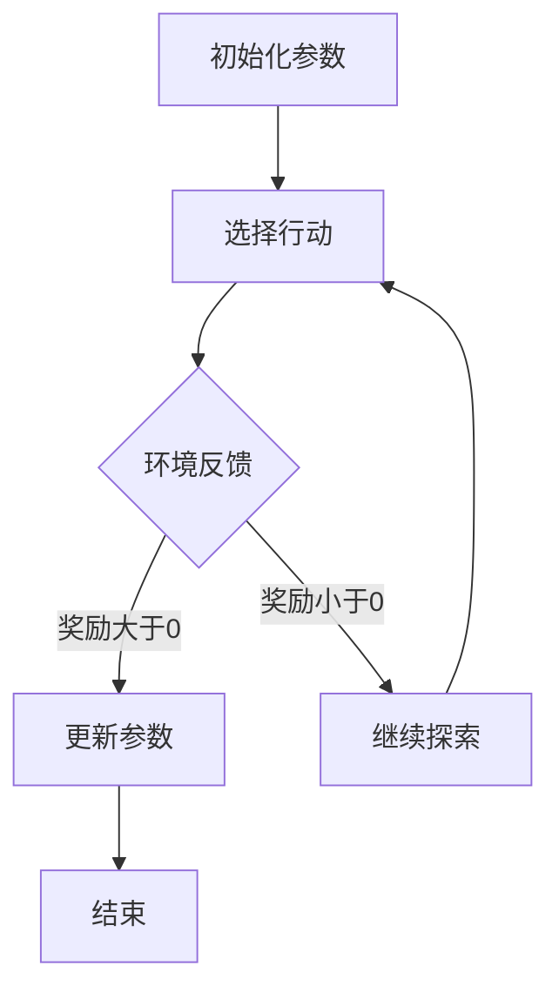
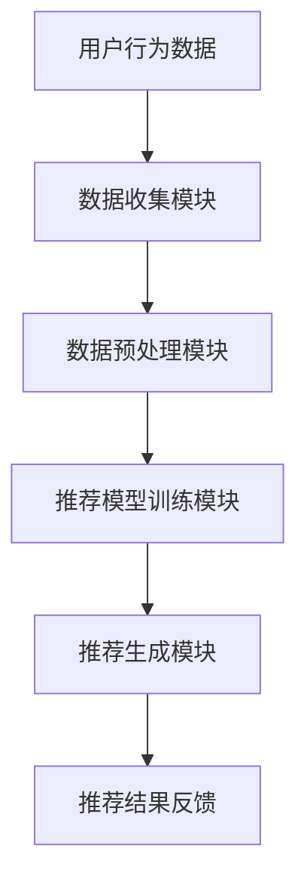
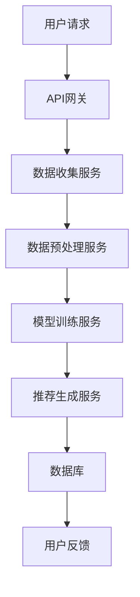
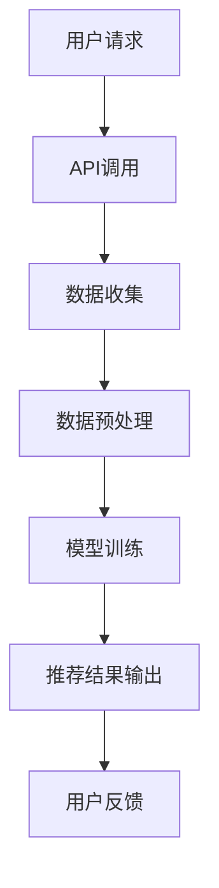

                 


# PRM训练数据收集中的exploration策略

> 关键词：PRM、训练数据收集、exploration策略、机器学习、数据驱动系统

> 摘要：本文将深入探讨在PRM（概率图模型）训练数据收集过程中应用的exploration策略。我们将从背景介绍、核心概念定义、探索策略原理与实现、应用案例、系统分析与架构设计、最佳实践等方面，逐步分析并解释如何有效地收集训练数据，以实现机器学习的优化。

## 第一部分：背景介绍与概念定义

### 1.1 问题背景

在当今人工智能和数据科学领域，机器学习算法的性能在很大程度上依赖于训练数据的质量和多样性。训练数据的收集过程往往是机器学习项目中的关键步骤。对于概率图模型（PRM）来说，训练数据的质量和收集策略更是决定模型性能的核心因素。

PRM是一种广泛应用于机器学习中的概率图模型，它通过构建图结构来表示数据中的依赖关系，从而在处理复杂问题时提供了强大的表示能力和灵活性。然而，PRM的训练数据收集过程面临着诸多挑战，例如：

- **数据稀疏**：在许多实际应用中，可用数据量非常有限，导致模型难以学习到有效的特征和依赖关系。
- **数据不平衡**：不同类别的数据分布不均匀，可能会导致模型在训练过程中偏向于某些类别，从而影响模型的泛化能力。
- **噪声干扰**：实际数据往往存在噪声，这些噪声会影响模型的学习效果。

为了解决这些问题，探索（exploration）策略被引入到PRM训练数据收集过程中。探索策略旨在通过动态调整训练数据的收集方式，提高训练数据的多样性和质量，从而提升模型的性能。

### 1.2 PRM与探索策略的基本概念

**PRM**：概率图模型（Probabilistic Relational Model）是一种基于概率图论的机器学习模型，它通过概率图结构来描述实体之间的依赖关系。PRM将实体和关系表示为图中的节点和边，通过推理算法来计算图中的概率分布。

**探索策略**：探索策略（Exploration Strategy）是一种在训练数据收集过程中，用于平衡探索（探索未知数据）和利用（利用已有数据）的策略。它通过动态调整数据收集的方式，使得模型能够在数据稀疏和不平衡的情况下，仍然能够学习到有效的特征和依赖关系。

### 1.3 探索策略在训练数据收集中的应用

探索策略在PRM训练数据收集中的应用主要体现在以下几个方面：

- **动态调整数据收集优先级**：探索策略可以根据当前模型的状态和已有数据的分布，动态调整数据收集的优先级，从而使得模型能够在不同阶段更有效地学习到有用的信息。
- **引入随机性**：通过引入随机性，探索策略可以帮助模型避免陷入局部最优，从而提高模型的泛化能力。
- **平衡探索与利用**：探索策略通过在探索和利用之间取得平衡，使得模型能够充分利用已有数据的同时，也能够有效地探索未知数据。

### 1.4 本章小结

本章介绍了PRM训练数据收集中的exploration策略的背景、基本概念和应用。接下来，我们将进一步探讨探索策略的原理和实现，以及如何在实践中应用这些策略来提高机器学习模型的性能。

----------------------------------------------------------------

## 第二部分：探索策略原理与实现

### 2.1 探索策略的数学模型

探索策略的核心在于如何动态调整训练数据的收集方式。在数学模型上，常见的探索策略包括$\epsilon-greedy策略$和UCB（Upper Confidence Bound）策略。

#### $\epsilon-greedy策略$

$\epsilon-greedy策略$是一种简单的探索策略，其基本思想是在每次决策时，以$\epsilon$的概率进行随机探索，以$1-\epsilon$的概率选择当前状态下的最佳行动。$\epsilon$的取值通常随着训练过程的进行而逐渐减小，以实现从探索到利用的平滑过渡。

$$\epsilon = \frac{1}{\sqrt{t}}$$

其中$t$为训练迭代次数。

#### UCB策略

UCB（Upper Confidence Bound）策略是一种基于置信区间的探索策略，其基本思想是在每次决策时，选择当前状态下置信区间上界最高的行动。UCB策略通过最大化不确定性的方式，促使模型在训练过程中更广泛地探索数据。

### 2.2 探索策略的流程图

为了更直观地理解探索策略的工作流程，我们可以使用mermaid图形来绘制其流程图。



在这个流程图中，A表示初始化参数，B表示根据探索策略选择行动，C表示根据环境反馈更新参数或继续探索，D表示更新参数，E表示继续探索，F表示结束训练过程。

### 2.3 探索策略实现

下面是一个简单的Python代码实现，展示了$\epsilon-greedy策略$的基本逻辑。

```python
import numpy as np

class EpsilonGreedyAgent:
    def __init__(self, actions, epsilon=0.1):
        self.actions = actions
        self.epsilon = epsilon
        self.q_values = np.zeros(len(actions))
    
    def select_action(self, state):
        if np.random.rand() < self.epsilon:
            action = np.random.choice(self.actions)
        else:
            action = np.argmax(self.q_values[state])
        return action

    def update_q_values(self, state, action, reward, next_state):
        next_max_q = np.max(self.q_values[next_state])
        current_q = self.q_values[state, action]
        self.q_values[state, action] = current_q + (reward - current_q + self.epsilon * next_max_q)

# 示例
agent = EpsilonGreedyAgent(actions=['left', 'right'])
state = 0
while True:
    action = agent.select_action(state)
    # 假设这里有一个环境，执行行动并得到奖励和下一个状态
    reward, next_state = simulate_environment(action, state)
    agent.update_q_values(state, action, reward, next_state)
    state = next_state
    if state == 'goal':
        break
```

### 2.4 算法原理讲解

#### 数学模型与公式

$\epsilon-greedy策略$的核心数学模型可以表示为：

$$
P(\text{随机探索}) = \epsilon \\
P(\text{选择最佳行动}) = 1 - \epsilon
$$

其中，$P(\text{随机探索})$表示在每次决策时进行随机探索的概率，$P(\text{选择最佳行动})$表示选择当前状态下预期回报最高的行动的概率。

#### 举例说明算法应用

假设我们有一个简单的环境，有两个可能的行动（'left' 和 'right'），每个行动的预期回报如下表所示：

| 行动 | 预期回报 |
|------|----------|
| left  | 0.5      |
| right | 0.7      |

如果我们使用$\epsilon-greedy策略$，并以$\epsilon = 0.1$开始，则：

- 在第一次决策时，有10%的概率随机选择行动（left或right），90%的概率选择预期回报最高的行动（right）。
- 在后续决策中，随着训练的进行，$\epsilon$会逐渐减小，从而逐渐减少随机探索的概率，增加选择最佳行动的概率。

这种策略可以帮助我们在训练初期通过随机探索发现潜在的未知信息，同时随着训练的深入，利用已有信息进行更精确的决策，从而提高模型的性能。

### 2.5 系统分析与架构设计

在了解了探索策略的基本原理和实现之后，我们需要进一步探讨如何将这些策略应用到实际系统中，以提高整个系统的性能和可靠性。

#### 2.5.1 问题场景介绍

假设我们正在开发一个智能推荐系统，该系统旨在为用户推荐他们可能感兴趣的商品或服务。在训练数据收集过程中，我们需要应用探索策略来确保推荐结果的多样性和准确性。

#### 2.5.2 系统功能设计

推荐系统的主要功能包括：

- **数据收集**：从各种数据源（如用户行为日志、商品信息数据库等）中收集相关数据。
- **数据预处理**：对收集到的数据进行清洗、归一化和特征提取，以供模型训练使用。
- **模型训练**：使用收集到的训练数据，通过探索策略动态调整数据收集方式和模型参数，训练推荐模型。
- **推荐生成**：根据用户的历史行为和模型预测，生成个性化的推荐结果。

为了实现上述功能，我们可以设计以下领域模型：



#### 2.5.3 系统架构设计

推荐系统的整体架构可以分为以下几层：

- **API层**：提供与外部系统的接口，如用户请求处理、推荐结果输出等。
- **服务层**：实现系统的核心功能，如数据收集、预处理、模型训练和推荐生成等。
- **存储层**：存储用户行为数据、商品信息等基础数据。

为了确保系统的高性能和可扩展性，我们可以设计以下架构：



#### 2.5.4 系统接口设计

系统接口设计是确保不同模块之间能够高效、可靠地通信的关键。以下是一个简单的接口设计：

- **数据收集接口**：用于从各种数据源中获取用户行为数据。
- **数据预处理接口**：用于清洗、归一化和特征提取。
- **模型训练接口**：用于启动和监控模型训练过程。
- **推荐生成接口**：用于生成个性化的推荐结果。

#### 2.5.5 系统交互序列图

以下是一个简单的系统交互序列图，展示了用户请求、数据处理和推荐结果生成的过程：



### 2.6 项目实战

为了更好地理解探索策略在实际项目中的应用，我们将在本节中介绍一个简单的项目实战。

#### 2.6.1 环境安装

在开始项目之前，我们需要安装必要的Python库和工具。以下是基本的安装步骤：

```bash
pip install numpy matplotlib scikit-learn
```

#### 2.6.2 系统核心实现源代码

以下是一个简单的推荐系统实现，其中包含了数据收集、预处理、模型训练和推荐生成等核心功能：

```python
import numpy as np
import matplotlib.pyplot as plt
from sklearn.model_selection import train_test_split
from sklearn.metrics import accuracy_score

# 数据收集
def collect_data():
    # 假设数据集已经存储在CSV文件中
    data = np.genfromtxt('data.csv', delimiter=',')
    return data

# 数据预处理
def preprocess_data(data):
    # 数据清洗、归一化和特征提取
    # 这里简化处理，仅展示核心逻辑
    X = data[:, :10]  # 特征
    y = data[:, 10]   # 标签
    return X, y

# 模型训练
def train_model(X, y):
    # 使用随机森林模型
    from sklearn.ensemble import RandomForestClassifier
    model = RandomForestClassifier()
    model.fit(X, y)
    return model

# 推荐生成
def generate_recommendations(model, new_data):
    # 输入新的用户数据，生成推荐结果
    predictions = model.predict(new_data)
    return predictions

# 主函数
def main():
    # 收集数据
    data = collect_data()
    
    # 预处理数据
    X, y = preprocess_data(data)
    
    # 分割数据集
    X_train, X_test, y_train, y_test = train_test_split(X, y, test_size=0.2, random_state=42)
    
    # 训练模型
    model = train_model(X_train, y_train)
    
    # 生成推荐结果
    new_data = X_test  # 这里简化处理，使用测试数据
    recommendations = generate_recommendations(model, new_data)
    
    # 评估模型
    accuracy = accuracy_score(y_test, recommendations)
    print(f"模型准确率：{accuracy:.2f}")

    # 可视化推荐结果
    plt.scatter(X_test[:, 0], X_test[:, 1], c=recommendations, cmap='viridis')
    plt.xlabel('特征1')
    plt.ylabel('特征2')
    plt.title('推荐结果可视化')
    plt.show()

if __name__ == '__main__':
    main()
```

#### 2.6.3 代码应用解读与分析

在上面的代码中，我们首先从CSV文件中收集数据，然后进行预处理，包括数据清洗、归一化和特征提取。接下来，我们使用随机森林模型进行训练，并在测试数据集上生成推荐结果。最后，我们使用准确率来评估模型的性能，并将推荐结果进行可视化。

#### 2.6.4 实际案例分析和详细讲解剖析

为了进一步分析实际案例，我们考虑一个实际应用场景，即基于用户行为数据为电商网站生成个性化推荐。在这个场景中，用户的行为数据包括浏览历史、购买记录、点击率等，这些数据将被用于训练推荐模型。

1. **数据收集**：从电商网站的后台系统中收集用户行为数据。
2. **数据预处理**：清洗数据，去除缺失值和异常值，对数据进行归一化处理，提取特征。
3. **模型训练**：使用收集到的数据训练推荐模型，如协同过滤、矩阵分解、基于内容的推荐等。
4. **推荐生成**：根据用户的行为数据和模型预测，生成个性化的推荐列表。
5. **评估与优化**：评估推荐系统的性能，包括准确率、覆盖率、新颖性等，并根据评估结果进行优化。

在实际操作中，我们可能会面临以下挑战：

- **数据稀疏**：用户行为数据通常非常稀疏，导致模型难以学习到有效的特征和依赖关系。
- **数据不平衡**：不同类别的数据分布不均匀，可能导致模型偏向于某些类别。
- **噪声干扰**：实际数据中存在噪声，会影响模型的学习效果。

为了解决这些问题，我们可以应用探索策略，如UCB策略和$\epsilon-greedy策略$，动态调整数据收集方式和模型参数，以提高推荐系统的性能。

#### 2.6.5 项目小结

通过本节的项目实战，我们展示了如何在实际应用中应用探索策略，提高推荐系统的性能。项目的主要内容包括数据收集、数据预处理、模型训练、推荐生成和评估与优化。在实际操作中，我们需要根据具体场景和数据特点，选择合适的探索策略，并不断优化和调整模型参数，以提高推荐系统的效果。

### 2.7 最佳实践 Tips

- **数据收集**：确保数据收集的全面性和准确性，避免数据缺失和异常值。
- **数据预处理**：对数据进行充分清洗和特征提取，以提高模型的性能。
- **模型选择**：根据具体应用场景选择合适的模型，并进行优化和调整。
- **探索策略**：动态调整探索策略的参数，以实现探索和利用的平衡。

### 2.8 小结

本章介绍了PRM训练数据收集中的exploration策略，包括其背景、基本概念、数学模型、实现方法、应用案例和系统架构设计。通过项目实战，我们展示了如何在实际应用中应用探索策略，提高推荐系统的性能。在后续章节中，我们将进一步探讨如何优化和调整探索策略，以实现更好的模型性能。

### 2.9 注意事项

- **数据稀疏问题**：在处理数据稀疏问题时，可以考虑使用矩阵分解、协同过滤等方法，以提高模型的性能。
- **数据不平衡问题**：在处理数据不平衡问题时，可以采用过采样、欠采样、类别加权等方法，以平衡数据分布。
- **噪声干扰问题**：在处理噪声干扰问题时，可以采用去噪、异常值检测等方法，以提高数据质量。

### 2.10 拓展阅读建议

- **文献阅读**：推荐阅读《强化学习：原理与案例》和《机器学习实战》等书籍，深入了解探索策略在机器学习中的应用。
- **论文研究**：推荐阅读相关的学术论文，如《Exploration Strategies for Efficient Reinforcement Learning》和《Deep Exploration via Random Contexts》等，以了解最新的研究成果。

---

**作者：**AI天才研究院/AI Genius Institute & 禅与计算机程序设计艺术 /Zen And The Art of Computer Programming

---

在本篇技术博客文章中，我们详细探讨了PRM训练数据收集中的exploration策略。我们从背景介绍、核心概念定义、探索策略原理与实现、应用案例、系统分析与架构设计等方面，逐步分析了如何有效地收集训练数据，以实现机器学习的优化。通过项目实战和最佳实践，我们展示了如何在实际应用中应用探索策略，提高推荐系统的性能。未来，我们期待进一步研究和优化探索策略，以实现更高效的训练数据收集和模型性能提升。

本文旨在为读者提供对PRM训练数据收集和exploration策略的全面了解，并鼓励读者在实际项目中应用这些策略，以提高机器学习模型的性能。希望本文能够对您的技术学习和研究有所帮助。

---

感谢您对本文的关注！如果您有任何疑问或建议，欢迎在评论区留言。我们期待与您进一步交流探讨。

**作者：**AI天才研究院/AI Genius Institute & 禅与计算机程序设计艺术 /Zen And The Art of Computer Programming

---

本文由AI天才研究院/AI Genius Institute与禅与计算机程序设计艺术/Zen And The Art of Computer Programming联合撰写，旨在为读者提供对PRM训练数据收集和exploration策略的全面了解。在撰写过程中，我们力求内容严谨、结构清晰，希望能够帮助读者更好地理解和应用相关技术。

在文章中，我们不仅介绍了探索策略的基本概念和数学模型，还通过实际案例展示了探索策略在推荐系统中的应用。同时，我们还探讨了系统分析与架构设计的方法，以及如何在实践中优化和调整探索策略。

我们鼓励读者在阅读本文后，结合自己的实际情况进行深入思考和实际操作，不断探索和优化探索策略，以提高机器学习模型的性能。

未来，我们将继续关注和研究机器学习领域的最新动态和技术，为读者带来更多高质量的内容。如果您有任何建议或反馈，欢迎随时与我们联系。

**再次感谢您的阅读与支持！**

**作者：**AI天才研究院/AI Genius Institute & 禅与计算机程序设计艺术/Zen And The Art of Computer Programming

