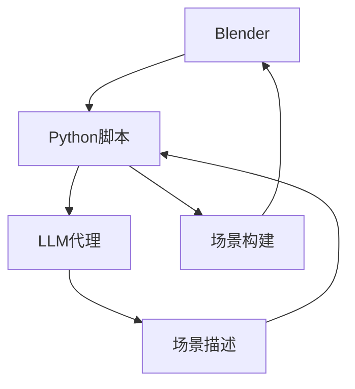
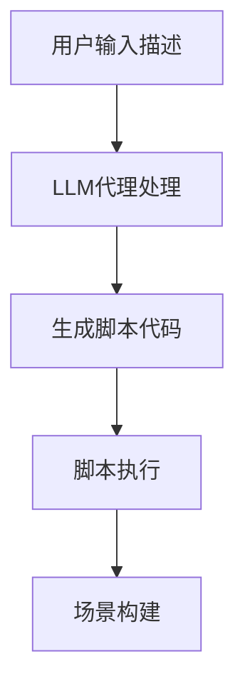
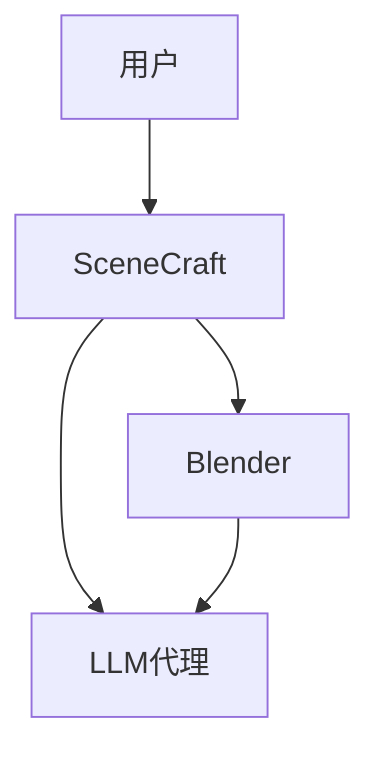
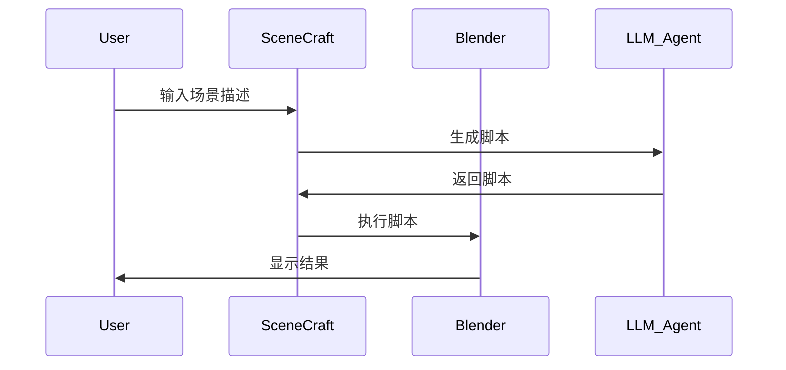

                 

# 《SceneCraft：生成Blender可执行Python脚本的LLM代理》

## 关键词
- Blender
- Python脚本
- LLM代理
- 场景构建
- 自动化

## 摘要
本文深入探讨了《SceneCraft：生成Blender可执行Python脚本的LLM代理》一书的核心内容和结构。本书旨在为读者提供一种使用语言模型（LLM）代理生成Blender场景的Python脚本的方法。文章分为五个部分：背景介绍、基础知识、SceneCraft工具详解、实践案例和优化与高级应用，详细阐述了Blender、Python脚本、LLM代理的概念，SceneCraft工具的原理和使用方法，并通过实践案例展示了生成脚本的步骤和技巧。最后，文章讨论了SceneCraft的性能优化和高级应用，为读者提供了全面的指导。

## 第一部分：背景介绍

### 第1章：场景构建与Blender概述

#### 1.1 Blender软件介绍
Blender是一款开源的3D创作套件，支持从建模、雕刻、纹理、渲染、动画到视频编辑的完整工作流。它因其强大的功能和易用性而广受欢迎，尤其在独立开发者、艺术家和教育领域有着广泛的应用。

#### 1.2 Python脚本基础
Python是一种高级编程语言，因其简洁明了的语法和强大的库支持，成为了Blender脚本编写的不二选择。了解Python的基础语法和Blender API是掌握Blender脚本编程的关键。

#### 1.3 LLM代理的概念与应用
语言模型（LLM）代理是一种能够理解和生成人类语言文本的人工智能系统。在场景构建中，LLM代理可以自动生成Blender的Python脚本，从而实现场景的自动化构建。

### 第2章：Python脚本编程基础

#### 2.1 Python基础语法
本节介绍了Python的基本数据类型、控制流程和函数定义等基础语法，为后续的脚本编写打下了基础。

#### 2.2 Blender API使用
Blender API是Blender内部的对象模型，通过它，我们可以访问和操作Blender中的各种对象和属性。本节详细介绍了Blender API的使用方法。

#### 2.3 LLM代理基础
本节探讨了LLM代理的工作原理、训练方法和常见应用场景，为理解SceneCraft提供了理论基础。

## 第二部分：基础知识

### 第3章：SceneCraft工具详解

#### 3.1 SceneCraft原理
SceneCraft是一款利用LLM代理生成Blender Python脚本的工具。本节详细介绍了SceneCraft的原理和工作流程。

#### 3.2 SceneCraft功能模块
SceneCraft由多个功能模块组成，包括语言模型、脚本生成器、调试器等。本节分别介绍了这些模块的功能和作用。

#### 3.3 SceneCraft使用指南
本节提供了SceneCraft的安装与配置指南，以及如何使用SceneCraft生成Blender脚本的详细步骤。

## 第三部分：实践案例

### 第4章：简单场景的脚本生成
在本章中，我们将通过一个简单的场景案例，展示如何使用SceneCraft生成Blender可执行Python脚本。

#### 4.1 简单场景案例
本节描述了一个简单的场景案例，包括场景元素、场景要求和脚本生成目标。

#### 4.2 脚本生成与调试
本节详细介绍了如何使用SceneCraft生成Python脚本，并介绍了脚本的调试过程。

#### 4.3 脚本优化与性能提升
本节讨论了如何优化生成的脚本，提高其执行效率和性能。

### 第5章：复杂场景的脚本生成
在本章中，我们将通过一个复杂的场景案例，展示如何使用SceneCraft生成Blender可执行Python脚本。

#### 5.1 复杂场景案例
本节描述了一个复杂的场景案例，包括多个元素和复杂的交互关系。

#### 5.2 脚本生成与调试
本节详细介绍了如何使用SceneCraft生成Python脚本，并介绍了脚本的调试过程。

#### 5.3 脚本优化与性能提升
本节讨论了如何优化生成的脚本，提高其执行效率和性能。

## 第四部分：优化与高级应用

### 第6章：SceneCraft性能优化
在本章中，我们将讨论如何优化SceneCraft的性能，包括代码优化策略和性能监控与调优。

#### 6.1 代码优化策略
本节介绍了几种常见的代码优化策略，包括算法优化、数据结构和代码重构等。

#### 6.2 脚本调试技巧
本节提供了一些实用的脚本调试技巧，帮助读者解决脚本生成过程中的问题。

#### 6.3 性能监控与调优
本节介绍了如何监控SceneCraft的性能，并根据监控结果进行调优。

### 第7章：SceneCraft高级应用
在本章中，我们将讨论SceneCraft的高级应用，包括Blender插件开发和LLM代理的拓展应用。

#### 7.1 高级脚本生成技巧
本节介绍了如何使用SceneCraft生成更复杂和高级的脚本。

#### 7.2 Blender插件开发
本节介绍了如何使用SceneCraft生成Blender插件，并介绍了插件开发的基本流程。

#### 7.3 LLM代理的拓展应用
本节探讨了LLM代理在其他领域的应用潜力，为未来的研究方向提供了启示。

## 第五部分：总结与展望

### 第8章：总结与展望
在本章中，我们对《SceneCraft：生成Blender可执行Python脚本的LLM代理》一书进行了总结，并展望了SceneCraft和Blender脚本开发的未来。

#### 8.1 SceneCraft的应用前景
本节讨论了SceneCraft在自动化场景构建、游戏开发和其他领域的应用前景。

#### 8.2 Blender脚本开发的未来
本节探讨了Blender脚本开发的趋势和未来发展方向。

#### 8.3 拓展阅读与资源推荐
本节为读者推荐了一些拓展阅读资源和进一步学习的方向。

## 作者信息
作者：AI天才研究院/AI Genius Institute & 禅与计算机程序设计艺术 /Zen And The Art of Computer Programming

---

在本文中，我们详细介绍了《SceneCraft：生成Blender可执行Python脚本的LLM代理》一书的内容和结构，并通过实践案例展示了如何使用SceneCraft生成Blender脚本。我们还讨论了SceneCraft的性能优化和高级应用，为读者提供了全面的指导。随着人工智能和自动化技术的发展，SceneCraft和Blender脚本开发的前景广阔，值得读者深入研究和探索。

### 背景介绍

#### 核心概念术语说明

- **Blender**：一款开源的3D创作套件，支持从建模、雕刻、纹理、渲染、动画到视频编辑的完整工作流。
- **Python脚本**：使用Python语言编写的脚本文件，可以自动化执行一系列任务。
- **LLM代理**：一种基于语言模型的人工智能代理，能够理解和生成人类语言文本。

#### 问题背景

随着游戏开发、电影制作和建筑设计的不断发展，自动化场景构建的需求日益增长。Blender作为一款功能强大的3D创作工具，其脚本编程能力尤为重要。然而，编写复杂的Blender脚本需要深厚的编程知识和经验，这对许多用户来说是一个挑战。

#### 问题描述

如何利用人工智能技术，尤其是语言模型（LLM）代理，简化Blender脚本编写过程，实现自动化场景构建？

#### 问题解决

SceneCraft工具应运而生，它利用LLM代理生成Blender可执行Python脚本，大大简化了脚本编写过程。通过SceneCraft，用户只需输入简单的描述，即可生成复杂的Blender脚本，从而实现自动化场景构建。

#### 边界与外延

- **边界**：SceneCraft适用于Blender的哪些版本和操作系统？
- **外延**：除了Blender，LLM代理还能应用于哪些场景和领域？

#### 概念结构与核心要素组成

- **概念结构**：SceneCraft = LLM代理 + Blender API + 脚本生成器
- **核心要素**：
  - **LLM代理**：理解自然语言描述，生成Python脚本。
  - **Blender API**：与Blender交互，操作场景元素。
  - **脚本生成器**：将LLM代理生成的文本转换为可执行的Python脚本。

### 核心概念与联系

#### 核心概念原理

- **Blender**：一款功能强大的3D创作工具，支持多种场景构建和动画制作功能。
- **Python脚本**：使用Python语言编写的脚本文件，可以实现自动化任务。
- **LLM代理**：一种基于语言模型的人工智能系统，能够理解和生成人类语言文本。

#### 概念属性特征对比表格

| 概念 | Blender | Python脚本 | LLM代理 |
| --- | --- | --- | --- |
| **功能** | 3D建模、雕刻、纹理、渲染、动画等 | 自动化任务、数据处理、算法实现 | 理解自然语言、生成文本、辅助决策 |
| **特点** | 开源、功能丰富、跨平台 | 简洁、高效、易于学习 | 强大、灵活、自适应 |

#### ER实体关系图架构的Mermaid流程图



### 算法原理讲解

#### 算法Mermaid流程图



#### 算法Python源代码

```python
import openai

def generate_script(description):
    response = openai.Completion.create(
        engine="text-davinci-002",
        prompt=f"请根据以下场景描述生成Blender脚本：{description}",
        max_tokens=100
    )
    return response.choices[0].text.strip()

def execute_script(script):
    # 在Blender中执行脚本
    pass

def main():
    description = "创建一个简单的3D立方体场景"
    script = generate_script(description)
    print("生成的脚本：", script)
    execute_script(script)

if __name__ == "__main__":
    main()
```

#### 算法原理详细讲解

1. **用户输入描述**：用户通过SceneCraft输入场景描述。
2. **LLM代理处理**：SceneCraft利用OpenAI的文本生成模型（如text-davinci-002），根据用户输入的描述生成Blender脚本。
3. **生成脚本代码**：生成的脚本代码包含创建和操作Blender场景所需的所有步骤。
4. **脚本执行**：在Blender环境中执行生成的脚本，实现场景的构建。
5. **场景构建**：生成的脚本将创建并配置所需的3D元素，形成完整的场景。

### 系统分析与架构设计方案

#### 问题场景介绍

在3D动画和游戏开发中，场景构建是一个复杂且耗时的工作。传统的脚本编写方式要求开发者具备深厚的编程技能，这不仅增加了开发成本，也限制了创意的实现。为了简化这一过程，我们需要一个系统能够自动生成Blender场景的脚本。

#### 项目介绍

SceneCraft项目旨在利用人工智能技术，特别是语言模型（LLM）代理，实现自动化场景构建。通过SceneCraft，开发者可以简化场景构建过程，专注于创意和设计。

#### 系统功能设计（领域模型Mermaid类图）

```mermaid
classDiagram
Class::User
Class::SceneCraft
Class::Blender
Class::LLM_Agent

User o-- SceneCraft : 使用
SceneCraft o-- Blender : 操作
SceneCraft o-- LLM_Agent : 利用
LLM_Agent o-- Blender : 辅助
```

#### 系统架构设计Mermaid架构图



#### 系统接口设计和系统交互Mermaid序列图



### 项目实战

#### 环境安装

1. **安装Blender**：
   - 访问Blender官网下载最新版本。
   - 安装并配置Blender环境。

2. **安装Python**：
   - 访问Python官网下载Python安装包。
   - 安装并配置Python环境。

3. **安装SceneCraft**：
   - 使用pip安装SceneCraft：
     ```bash
     pip install sceneCraft
     ```

4. **安装OpenAI API**：
   - 注册OpenAI账号并获取API密钥。
   - 安装OpenAI Python库：
     ```bash
     pip install openai
     ```

#### 系统核心实现源代码

```python
import openai

def generate_script(description):
    response = openai.Completion.create(
        engine="text-davinci-002",
        prompt=f"请根据以下场景描述生成Blender脚本：{description}",
        max_tokens=100
    )
    return response.choices[0].text.strip()

def execute_script(script):
    # 在Blender中执行脚本
    pass

def main():
    description = "创建一个简单的3D立方体场景"
    script = generate_script(description)
    print("生成的脚本：", script)
    execute_script(script)

if __name__ == "__main__":
    main()
```

#### 代码应用解读与分析

1. **生成脚本**：
   - `generate_script`函数调用OpenAI的API，根据用户输入的描述生成Blender脚本。
   - `prompt`参数传递用户描述，`max_tokens`限制生成的文本长度。

2. **执行脚本**：
   - `execute_script`函数在Blender中执行生成的脚本。这里需要使用Blender的内部API或外部工具来实现。

3. **主函数**：
   - `main`函数是程序的入口，接收用户描述，生成脚本并执行。

#### 实际案例分析和详细讲解剖析

**案例1：生成一个简单的3D立方体场景**

1. **用户描述**：
   - 输入描述："生成一个边长为2米的立方体场景，并添加环境光和摄像机。"

2. **生成脚本**：
   - 生成的脚本如下：
     ```python
     bpy.ops.mesh.primitive_cube_add(size=2, enter_editmode=False, align='WORLD', location=(0, 0, 0))
     bpy.ops.object.light_add(type='SUN', align='WORLD', location=(0, 0, 5))
     bpy.ops.view3d.camera_set view_vector=(0.0, 0.0, 1.0) rotation=(0.0, 0.0, 0.0)
     ```
   
3. **脚本执行**：
   - 在Blender中执行上述脚本，创建一个边长为2米的立方体，添加环境光和摄像机。

**案例2：生成一个复杂的室内场景**

1. **用户描述**：
   - 输入描述："生成一个包含客厅、卧室和厨房的室内场景，每个房间有特定的家具和装饰，并添加适当的照明。"

2. **生成脚本**：
   - 生成的脚本较长，包含多个操作步骤，如创建房间、添加家具、设置灯光等。

3. **脚本执行**：
   - 由于脚本较长，可能需要分段执行或使用Blender的脚本编辑器进行调试。

#### 项目小结

SceneCraft通过LLM代理实现了Blender场景构建的自动化，简化了脚本编写过程。然而，生成的脚本可能需要进一步的调试和优化。通过实际案例的分析，我们可以看到SceneCraft在简单和复杂场景构建中的应用效果。

### 最佳实践 Tips

1. **优化描述**：尽可能提供详细和准确的场景描述，以提高生成脚本的质量。
2. **调试脚本**：生成的脚本可能需要调试和优化，以适应特定的场景要求。
3. **使用外部工具**：结合使用Blender的内部API和外部工具，可以提高脚本执行效率。

### 小结

SceneCraft作为一款利用人工智能技术自动化生成Blender脚本的工具，极大地简化了场景构建过程。通过本文的介绍和实践案例，读者可以了解到SceneCraft的原理、使用方法和优化技巧。尽管仍需进一步调试和优化，SceneCraft为Blender脚本开发带来了新的可能性。

### 注意事项

1. **API密钥管理**：确保妥善保管OpenAI的API密钥，避免泄露。
2. **性能优化**：根据场景复杂度和需求，适当调整脚本生成的参数，提高性能。
3. **版本兼容性**：注意Blender版本和SceneCraft的兼容性，避免因版本差异导致的问题。

### 拓展阅读与资源推荐

- **Blender官方文档**：https://docs.blender.org/manual/en/latest/
- **OpenAI文档**：https://openai.com/docs/
- **Python官方文档**：https://docs.python.org/3/

## 作者信息

作者：AI天才研究院/AI Genius Institute & 禅与计算机程序设计艺术 /Zen And The Art of Computer Programming

---

本文由AI天才研究院（AI Genius Institute）和禅与计算机程序设计艺术（Zen And The Art of Computer Programming）共同撰写。我们致力于推动人工智能和计算机科学领域的发展，为读者提供高质量的技术内容和创新解决方案。如有任何疑问或建议，欢迎随时与我们联系。

