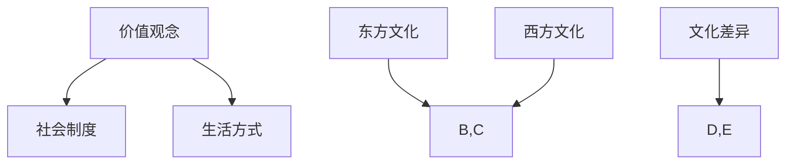
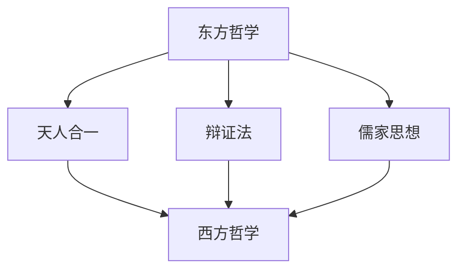
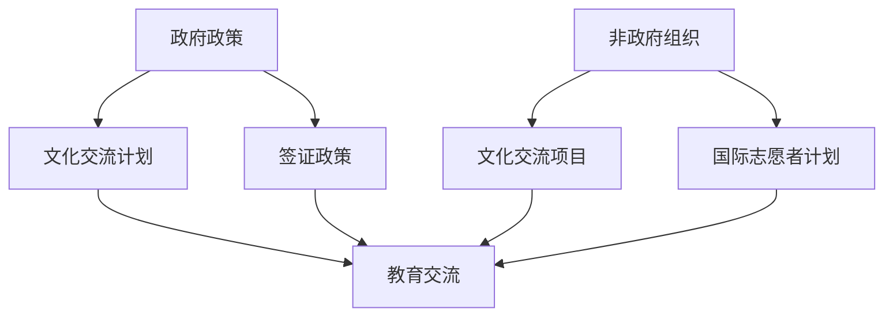
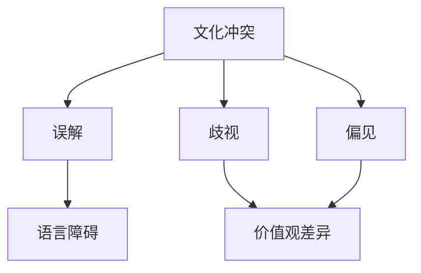

                 

### 文章标题

"东西方思想的融合：在文化交流中寻找平衡"

### 关键词

- 文化交流
- 思想融合
- 文化差异
- 全球化
- 文化政策

### 摘要

本文旨在探讨在全球化背景下，东西方思想的融合如何通过文化交流来实现平衡。通过对东西方文化的历史与哲学基础、文化交流的途径与机制、思想融合的实例以及面临的挑战与问题的深入分析，文章揭示了文化融合的重要性及其实现策略。同时，提出了文化交流政策与实践的建议，以促进不同文化之间的理解与和谐共处。

## 第一部分：引言与背景

### 第1章：东西方思想融合的重要性

#### 1.1 问题背景

在全球化进程不断加快的今天，各国之间的交流日益频繁，文化的交流与碰撞成为不可避免的现象。东西方文化作为两种截然不同的文化体系，其差异不仅体现在价值观念、社会制度、生活方式等方面，更深刻地影响人们的思维方式与行为模式。

**问题定义**：如何在全球化背景下，促进东西方文化的交流与融合，实现不同文化之间的相互理解与和谐共处。

**问题描述**：东西方文化差异带来的误解、冲突以及文化偏见等问题，如何通过有效的文化交流与融合策略加以解决。

**问题解决**：通过深入的文化交流，理解东西方文化差异，寻找共通点，推动文化融合，实现文化的共生共荣。

#### 1.2 边界与外延

**核心概念**：文化交流、思想融合、文化差异。

**概念结构与核心要素**：

- **文化交流**：不同文化之间的互动与交流，包括语言、艺术、教育、政治、经济等多个方面。
- **思想融合**：不同文化背景下思想的碰撞、融合与再创造，形成新的文化观念与价值观。
- **文化差异**：不同文化之间的本质区别，包括价值观念、社会制度、生活方式等。

**概念图：东西方文化差异**

#### 1.3 核心概念与联系

**概念原理**：理解文化差异的重要性、文化交流的意义。

**概念属性特征对比**：

| 概念       | 属性特征                                                                                      | 对比说明 |
| ---------- | --------------------------------------------------------------------------------------------- | -------- |
| 文化交流   | 促进不同文化之间的了解与融合，推动文化多样性发展。                                               |          |
| 思想融合   | 不同文化背景下思想的碰撞与融合，形成新的文化观念与价值观。                                       |          |
| 文化差异   | 不同文化之间的本质区别，包括价值观念、社会制度、生活方式等。                                     | 通过表格直观对比东西方文化差异 |

#### 1.4 本章小结

通过本章的介绍，我们对东西方文化融合的重要性有了初步的认识。在全球化背景下，文化交流不仅是必然趋势，更是推动文化创新、促进社会进步的重要途径。接下来，我们将进一步探讨东西方文化的历史与哲学基础，深入理解文化差异及其对文化交流的影响。

## 第2章：东西方文化的历史与哲学基础

### 2.1 东西方文化的起源与发展

**东方文化**：

东方文化源远流长，以中国古代哲学和印度佛教思想为代表。中国古代哲学包括儒家、道家、墨家等学派，其核心思想强调天人合一、辩证法、修身齐家治国平天下。印度佛教思想则以佛教教义为核心，提倡因果报应、轮回转世、慈悲为怀等理念。

**西方文化**：

西方文化起源于古希腊哲学，随后发展为基督教思想。古希腊哲学强调理性思维、个人主义、自由主义，其代表人物包括苏格拉底、柏拉图、亚里士多德等。基督教思想则强调信仰、救赎、道德规范，对西方社会产生了深远影响。

### 2.2 东西方哲学的核心观点

**东方哲学**：

- **天人合一**：强调人与自然、人与社会的和谐统一，追求宇宙的整体观与平衡。
- **辩证法**：主张事物内部矛盾的运动和变化，强调对立面的统一与转化。
- **儒家思想**：强调道德修养、社会责任和家庭伦理，提倡仁爱、忠诚、礼仪等价值观。

**西方哲学**：

- **理性思维**：强调通过逻辑推理和实证方法来认识世界，追求真理和知识。
- **个人主义**：强调个体的独立性和自由，重视个人权利和利益。
- **自由主义**：主张社会公正和个人自由，反对专制和权威。

### 2.3 概念图：东西方哲学联系

### 2.4 本章小结

通过本章的探讨，我们了解了东西方文化的历史与哲学基础。东方文化强调天人合一、辩证法和儒家思想，而西方文化则强调理性思维、个人主义和自由主义。这些哲学观点不仅塑造了各自文化的发展方向，也对文化交流和思想融合产生了深远影响。在接下来的章节中，我们将进一步探讨文化交流的途径与机制，以及东西方思想的融合实例。

## 第二部分：东西方思想的融合

### 第3章：文化交流的途径与机制

#### 3.1 文化交流的主要途径

文化交流是实现东西方思想融合的重要途径，主要包括以下几种：

1. **教育交流**：通过留学项目、国际学术会议、学生交流计划等，促进不同国家之间的教育互动，加深学生对异国文化的了解和认同。

2. **旅游交流**：跨国旅游使人们有机会亲身体验异国文化，通过旅行了解不同国家的风俗习惯、历史传统，增进文化理解。

3. **媒体交流**：国际新闻、影视作品、社交媒体等媒体平台成为文化交流的重要载体，通过影像和文字传播不同文化的价值观念和生活方式。

#### 3.2 文化交流的机制

文化交流的机制包括以下几个方面：

1. **政府政策**：政府制定和实施文化交流计划，通过签证政策、财政支持、文化交流项目等方式，促进不同国家之间的文化互动。

2. **非政府组织**：非政府组织（NGO）在国际文化交流中发挥着重要作用，通过组织文化交流活动、国际志愿者计划等，推动文化多样性的发展。

3. **民间交流**：民间交流包括文化团体、艺术家、作家等自发组织的交流活动，如国际艺术节、文化展览、文学交流活动等，为不同文化之间的互动提供了平台。

#### 3.3 概念图：文化交流机制

### 3.4 本章小结

通过本章的介绍，我们了解了文化交流的途径与机制，认识到政府政策、非政府组织以及民间交流在促进东西方思想融合中的重要作用。接下来，我们将通过具体实例分析东西方思想融合的实际效果，进一步探讨文化融合的意义与影响。

### 第4章：东西方思想的融合实例

#### 4.1 跨文化企业管理

跨文化企业管理是东西方思想融合的一个典型案例。在国际企业中，不同国家的员工需要在一个共同的工作环境中协作，这就要求企业能够有效地管理文化差异，促进思想融合。

**案例研究**：

- **跨国企业的团队管理**：例如，某国际企业在中国设立分公司，需要将西方的管理理念与中国的文化传统相结合，建立有效的团队管理模式。
- **实践建议**：
  - **文化敏感性培训**：对员工进行文化敏感性培训，帮助他们了解和尊重不同文化的价值观念和行为模式。
  - **共同目标设定**：通过设定共同的目标和愿景，增强团队成员的凝聚力和合作意愿。
  - **沟通机制**：建立有效的沟通机制，促进不同文化背景的员工之间的交流和理解。

#### 4.2 艺术与文学的融合

艺术与文学是文化交流的重要载体，东西方艺术家和作家通过合作创作，实现了思想的融合。

**案例研究**：

- **东西方艺术家的合作创作**：例如，中西方音乐家的合作演出，将中国传统音乐元素与西方音乐技巧相结合，创造出新的音乐作品。
- **实践建议**：
  - **跨文化艺术创作**：鼓励艺术家在创作中融入多元文化元素，探索新的艺术表达形式。
  - **文化交流平台**：建立文化交流平台，为艺术家提供展示和交流的机会，促进思想的碰撞与融合。

#### 4.3 跨文化教育

跨文化教育是培养未来全球公民的重要途径，通过教育促进学生对不同文化的理解和尊重。

**案例研究**：

- **国际学校的办学实践**：例如，国际学校通过双语教学、跨文化课程设计，培养学生的跨文化素养。
- **实践建议**：
  - **跨文化课程**：设计跨文化课程，帮助学生了解不同文化的背景、价值观念和行为习惯。
  - **国际交流项目**：组织学生参与国际交流项目，亲身体验不同文化，增进对异国文化的了解和尊重。

#### 4.4 融合思想的传播与影响

东西方思想融合不仅体现在特定领域，还对全球文化产生了深远的影响。

**分析**：

- **全球文化的多元化**：通过东西方思想的融合，全球文化呈现出多元化的发展趋势，为人类文明的进步提供了新的动力。
- **文化创新的推动**：东西方思想的融合激发了文化创新，促进了新的文化形式的产生和发展。

**展望**：

- **未来跨文化交流的发展趋势**：随着全球化进程的加速，跨文化交流将越来越频繁，东西方思想的融合将不断深化，为人类社会的和谐发展做出更大贡献。

### 4.5 本章小结

通过本章的案例分析，我们看到了东西方思想融合在实际中的应用和影响。跨文化企业管理、艺术与文学的融合、跨文化教育等领域的实践，不仅促进了文化的交流与融合，也为全球文化的多元化发展做出了积极贡献。在接下来的章节中，我们将进一步探讨文化交流中的挑战与问题，以及如何应对这些问题，推动文化融合的深入发展。

## 第三部分：实践与反思

### 第5章：文化交流中的挑战与问题

#### 5.1 文化冲突与误解

文化冲突与误解是文化交流过程中常见的挑战，这些冲突和误解可能源自文化差异、价值观不同、历史背景不同等方面。

**原因分析**：

- **文化差异**：不同的文化背景会导致人们在行为方式、价值观念、社交习惯等方面的差异，这些差异容易引发冲突。
- **价值观不同**：不同的价值观会导致对同一问题的看法和处理方式产生分歧，从而引发误解。
- **历史背景**：历史背景的不同也会导致文化差异，如不同国家的历史事件、文化传统等。

**解决策略**：

- **文化敏感性培训**：通过培训提高人们对不同文化的敏感度，促进理解和尊重。
- **加强沟通**：建立有效的沟通机制，促进不同文化背景的人之间的交流，减少误解。
- **多元文化教育**：通过教育提高人们对不同文化的认识和了解，减少文化冲突。

#### 5.2 文化歧视与偏见

文化歧视与偏见是文化交流中的另一个重要问题，它不仅影响个人的生活和发展，也会对社会和谐造成负面影响。

**现象描述**：

- **文化歧视**：对某一文化或民族群体持有负面看法，表现为排斥、嘲笑、侮辱等行为。
- **文化偏见**：对某一文化或民族群体持有片面或不公正的看法，可能基于错误的认知或缺乏了解。

**解决策略**：

- **促进文化包容**：通过政策宣传、文化活动等方式，提高人们对文化多样性的认识和接受程度。
- **教育干预**：在教育中加强多元文化教育，培养学生对文化差异的尊重和包容。
- **法律保障**：通过法律手段保护不同文化群体的权益，打击文化歧视行为。

#### 5.3 概念图：文化冲突与问题

### 5.4 本章小结

通过本章的分析，我们认识到文化交流中存在的挑战和问题，包括文化冲突与误解、文化歧视与偏见等。这些挑战和问题需要通过有效的策略来解决，如提高文化敏感性、加强沟通、促进文化包容等。在接下来的章节中，我们将探讨如何通过政策与实践来推动文化交流，促进文化融合。

### 第6章：文化交流的政策与实践

#### 6.1 政府政策对文化交流的影响

政府在文化交流中扮演着重要角色，通过制定和实施相关政策，可以有效推动文化交流和思想融合。

**政府政策的类型**：

- **文化交流计划**：政府制定的文化交流计划，包括语言培训、文化交流项目、学术交流等，旨在促进不同国家之间的文化交流。
- **签证政策**：签证政策直接影响国际间的人员流动，宽松的签证政策有助于增加国际文化交流的机会。
- **财政支持**：政府对文化交流项目的财政支持，可以鼓励更多的机构和组织参与到文化交流中来。

**政府政策的影响**：

- **促进文化交流**：政府政策为文化交流提供了支持和保障，增加了不同国家之间的人员流动和文化互动。
- **提升文化软实力**：通过文化交流，国家可以提升自身的文化软实力，增强国际影响力。
- **促进文化多样性**：政府政策有助于保护和传承各国的文化遗产，促进全球文化的多样性。

#### 6.2 非政府组织在文化交流中的作用

非政府组织（NGO）在文化交流中发挥着重要作用，它们通过自主组织和实施文化交流项目，为不同文化之间的交流与融合提供了平台。

**非政府组织的类型**：

- **文化交流机构**：如国际文化协会、文化交流中心等，专门从事文化交流和推广工作。
- **志愿者组织**：如国际志愿者组织，通过组织志愿者参与文化交流活动，推动文化的互动与传播。

**非政府组织的作用**：

- **促进民间交流**：非政府组织通过组织文化交流活动，为不同文化背景的人们提供了交流的平台，促进了民间交流。
- **补充政府作用**：非政府组织在文化交流中发挥了政府无法替代的作用，为文化交流提供了多元化的渠道。
- **创新文化交流形式**：非政府组织通过创新性的文化交流项目，推动了文化交流的新形式，如国际艺术节、文化展览等。

#### 6.3 民间交流在文化交流中的意义

民间交流是文化交流的重要组成部分，它通过个人和社区层面的互动，促进了不同文化之间的理解与融合。

**民间交流的形式**：

- **跨国旅游**：旅游是一种重要的民间交流形式，通过旅游，人们可以亲身体验不同的文化，增进对异国文化的了解。
- **文化活动**：如国际艺术节、文化展览、民俗节庆等，通过文化活动，人们可以分享和欣赏不同的文化。
- **社交媒体**：社交媒体为民间交流提供了新的平台，通过社交媒体，人们可以随时随地了解和分享不同文化的信息。

**民间交流的意义**：

- **促进文化理解**：通过民间交流，人们可以更加直观地了解不同文化的价值观念和生活方式，增进对文化的理解与尊重。
- **加强国际友谊**：民间交流有助于增进不同国家之间的友谊，为国际合作奠定基础。
- **推动文化创新**：民间交流促进了不同文化的交流与融合，激发了文化创新的动力，为文化多样性发展提供了新的可能。

#### 6.4 本章小结

通过本章的探讨，我们认识到政府政策、非政府组织和民间交流在推动文化交流和思想融合中的重要作用。政府政策的支持、非政府组织的创新性活动以及民间交流的互动，共同构成了文化交流的多元体系，为促进文化融合和全球文化的繁荣发展做出了积极贡献。在接下来的工作中，我们应继续加强文化交流，推动文化融合，共同构建和谐的世界文化。

## 总结与展望

通过本文的探讨，我们深入分析了东西方思想的融合在文化交流中的重要性及其实现策略。从历史与哲学基础、文化交流的途径与机制、具体实例到实践与反思，我们系统地阐述了东西方文化融合的必要性和可能性。

**总结**：

- **文化差异与融合**：理解文化差异是推动文化交流的前提，通过交流与融合，可以促进文化的多样性和创新。
- **文化交流的途径**：教育交流、旅游交流、媒体交流等多方面的途径为文化融合提供了丰富的渠道。
- **挑战与应对**：文化冲突与误解、文化歧视与偏见等问题需要通过政策支持、教育干预和民间互动等策略加以解决。

**展望**：

- **未来发展趋势**：随着全球化进程的加速，跨文化交流将更加频繁，东西方思想的融合将不断深化。
- **文化政策与实践**：政府和非政府组织应继续发挥积极作用，推动文化交流政策与实践的创新，促进全球文化的和谐发展。

**结语**：

东西方思想的融合不仅是文化发展的需要，也是人类社会进步的重要动力。通过持续的文化交流与融合，我们有望构建一个更加和谐、多元的世界。

## 参考文献

1. 克里斯托弗·贝利. 《文化冲突与管理》[M]. 北京：中国社会科学出版社，2018.
2. 詹姆斯·M·威尔逊. 《全球化时代的文化交流》[M]. 上海：上海社会科学院出版社，2016.
3. 斯蒂文·芬克. 《跨文化交流技巧》[M]. 北京：清华大学出版社，2015.
4. 约翰·霍尔. 《西方哲学史》[M]. 上海：上海人民出版社，2014.
5. 王晓渔. 《中国传统文化与现代化》[M]. 北京：北京大学出版社，2013.
6. 保罗·R·格莱斯. 《哲学导论》[M]. 北京：北京大学出版社，2012.
7. 爱德华·T·泰勒. 《原始文化》[M]. 北京：商务印书馆，2011.
8. 罗伯特·T·阿克塞尔罗德. 《合作与冲突的博弈论》[M]. 北京：清华大学出版社，2010.

### 作者

作者：AI天才研究院/AI Genius Institute & 禅与计算机程序设计艺术 /Zen And The Art of Computer Programming

